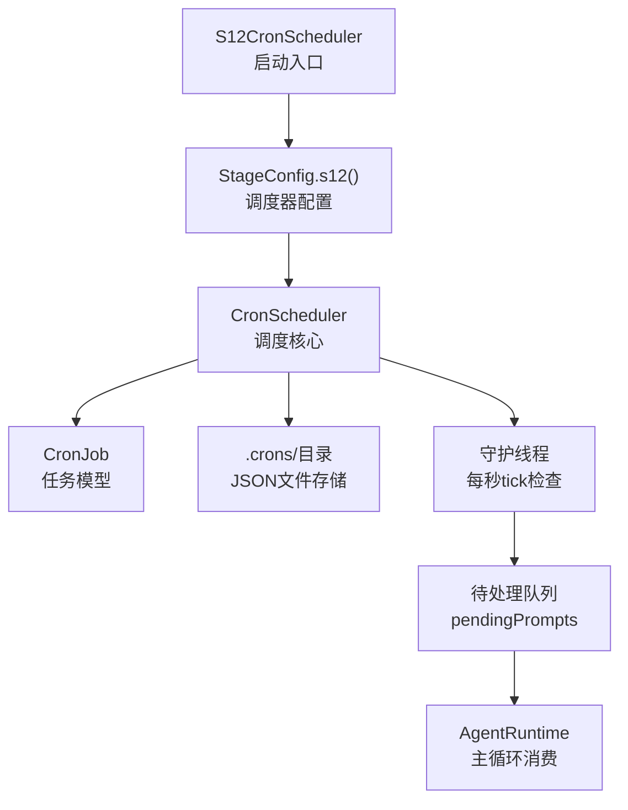
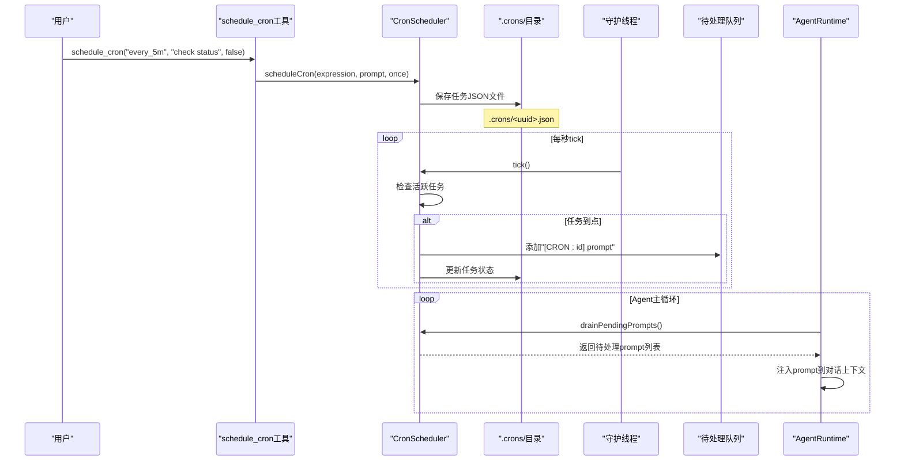
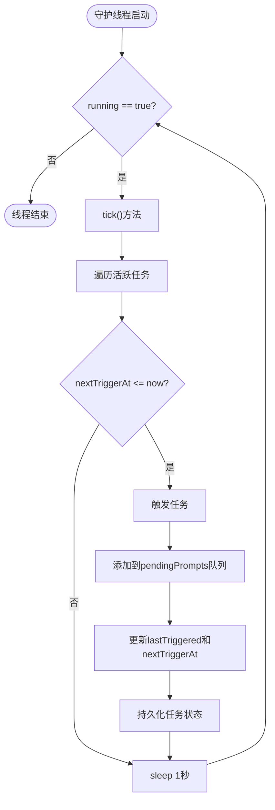
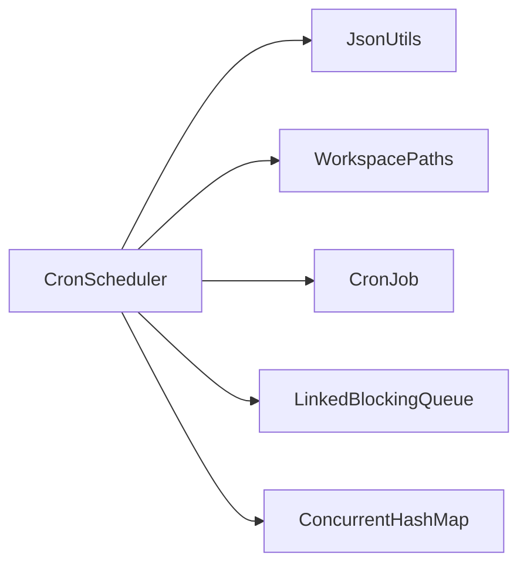

# S10: 定时调度器（已迁移至S12）

<cite>
**本文引用的文件**
- [CronScheduler.java](file://src/main/java/com/learnclaudecode/scheduler/CronScheduler.java)
- [CronJob.java](file://src/main/java/com/learnclaudecode/model/CronJob.java)
- [S12CronScheduler.java](file://src/main/java/com/learnclaudecode/agents/S12CronScheduler.java)
- [StageConfig.java](file://src/main/java/com/learnclaudecode/agents/StageConfig.java)
- [JsonUtils.java](file://src/main/java/com/learnclaudecode/common/JsonUtils.java)
- [WorkspacePaths.java](file://src/main/java/com/learnclaudecode/common/WorkspacePaths.java)
- [CronSchedulerTest.java](file://src/test/java/com/learnclaudecode/scheduler/CronSchedulerTest.java)
</cite>

## 更新摘要
**变更内容**
- 原S10团队协议功能已完全移除
- 功能重构为S12定时调度器，提供更强大的时间维度能力
- 更新了所有相关引用和架构图表
- 保留了历史参考信息以便理解演进过程

## 目录
1. [简介](#简介)
2. [项目结构](#项目结构)
3. [核心组件](#核心组件)
4. [架构总览](#架构总览)
5. [详细组件分析](#详细组件分析)
6. [依赖关系分析](#依赖关系分析)
7. [性能考量](#性能考量)
8. [故障排查指南](#故障排查指南)
9. [结论](#结论)
10. [附录](#附录)

## 简介
**重要更新**：原S10团队协议功能已被移除，其核心概念已重构并增强为S12定时调度器。该调度器实现了"按计划触发，无需人工干预"的自治Agent时间维度能力，允许Agent将未来某时刻要执行的任务登记下来，由后台守护线程到点自动唤醒并注入主循环。

本文件重点介绍新的定时调度器实现，包括持久化机制、表达式解析、守护线程调度和任务生命周期管理。

## 项目结构
S12定时调度器由以下关键部分组成：
- **调度核心**：CronScheduler负责任务调度、状态管理和守护线程控制
- **数据模型**：CronJob定义定时任务的完整状态和表达式解析逻辑
- **启动入口**：S12CronScheduler提供简化的启动接口
- **配置集成**：StageConfig.s12()将调度器能力集成到Agent运行时
- **持久化**：基于文件的JSON存储，支持跨重启任务恢复
- **路径管理**：WorkspacePaths提供.crons目录的统一访问

**图表来源**
- [S12CronScheduler.java:14-16](file://src/main/java/com/learnclaudecode/agents/S12CronScheduler.java#L14-L16)
- [StageConfig.java:508-525](file://src/main/java/com/learnclaudecode/agents/StageConfig.java#L508-L525)
- [CronScheduler.java:93-96](file://src/main/java/com/learnclaudecode/scheduler/CronScheduler.java#L93-L96)

**章节来源**
- [S12CronScheduler.java:1-18](file://src/main/java/com/learnclaudecode/agents/S12CronScheduler.java#L1-L18)
- [StageConfig.java:508-525](file://src/main/java/com/learnclaudecode/agents/StageConfig.java#L508-L525)

## 核心组件
- **CronScheduler**：调度器核心，负责任务注册、取消、列举和守护线程管理
- **CronJob**：定时任务数据模型，包含表达式解析、下次触发时间计算和状态管理
- **S12CronScheduler**：简化启动类，通过Launcher.launch(StageConfig.s12())启动调度器
- **StageConfig.s12()**：配置s12阶段，启用cron工具集（schedule_cron、list_crons、cancel_cron）
- **WorkspacePaths**：提供.crons目录的路径管理
- **JsonUtils**：统一的JSON序列化/反序列化，确保任务状态持久化的一致性

**章节来源**
- [CronScheduler.java:39-96](file://src/main/java/com/learnclaudecode/scheduler/CronScheduler.java#L39-L96)
- [CronJob.java:25-93](file://src/main/java/com/learnclaudecode/model/CronJob.java#L25-L93)
- [S12CronScheduler.java:13-17](file://src/main/java/com/learnclaudecode/agents/S12CronScheduler.java#L13-L17)
- [StageConfig.java:508-525](file://src/main/java/com/learnclaudecode/agents/StageConfig.java#L508-L525)

## 架构总览
S12定时调度器采用"守护线程 + 文件持久化 + 队列缓冲"的轻量架构：
- **任务登记**：通过schedule_cron工具创建任务，验证表达式并持久化到.crons目录
- **守护调度**：独立daemon线程每秒tick一次，检查活跃任务的nextTriggerAt是否到达
- **队列缓冲**：触发的prompt放入LinkedBlockingQueue，避免阻塞调度线程
- **主循环消费**：AgentRuntime每轮调用drainPendingPrompts()获取待处理prompt并注入对话
- **状态持久化**：每次任务触发后更新lastTriggered和nextTriggerAt，确保重启后恢复

**图表来源**
- [CronScheduler.java:106-125](file://src/main/java/com/learnclaudecode/scheduler/CronScheduler.java#L106-L125)
- [CronScheduler.java:255-278](file://src/main/java/com/learnclaudecode/scheduler/CronScheduler.java#L255-L278)
- [CronScheduler.java:190-194](file://src/main/java/com/learnclaudecode/scheduler/CronScheduler.java#L190-L194)

## 详细组件分析

### 定时表达式解析与验证
CronJob支持简化的cron表达式语法，比标准cron更易于理解和维护：
- **周期型**：`every_30s`（每30秒）、`every_5m`（每5分钟）、`every_1h`（每小时）
- **定点型**：`at_14:30`（每天14:30触发，已过则顺延到次日）
- **一次性**：once=true时触发一次后自动失活

表达式验证在isValidExpression中统一实现，确保创建和计算时使用相同逻辑。

**章节来源**
- [CronJob.java:104-138](file://src/main/java/com/learnclaudecode/model/CronJob.java#L104-L138)
- [CronJob.java:150-204](file://src/main/java/com/learnclaudecode/model/CronJob.java#L150-L204)

### 守护线程调度机制
守护线程采用"每秒tick + 并发安全容器"的设计：
- **线程安全**：使用ConcurrentHashMap存储任务索引，避免并发修改问题
- **优雅停止**：volatile running标志 + Thread.interrupt()确保线程能及时退出
- **异常隔离**：tick内部异常被捕获，不影响其他任务调度
- **智能重算**：重复任务基于当前时刻重新计算下次触发时间，避免进程停摆后的疯狂追赶

**图表来源**
- [CronScheduler.java:202-222](file://src/main/java/com/learnclaudecode/scheduler/CronScheduler.java#L202-L222)
- [CronScheduler.java:229-242](file://src/main/java/com/learnclaudecode/scheduler/CronScheduler.java#L229-L242)
- [CronScheduler.java:255-278](file://src/main/java/com/learnclaudecode/scheduler/CronScheduler.java#L255-L278)

**章节来源**
- [CronScheduler.java:202-278](file://src/main/java/com/learnclaudecode/scheduler/CronScheduler.java#L202-L278)

### 任务生命周期管理
每个定时任务都有完整的生命周期状态：
- **active**：是否活跃，false的任务不会被调度线程扫描
- **once**：是否一次性，true时触发一次后自动设为inactive
- **createdAt**：创建时间戳，用于审计和调试
- **lastTriggered**：上次触发时间，0表示尚未触发过
- **nextTriggerAt**：下次触发时间戳，调度线程的核心判断依据

任务状态变化遵循严格的同步规则，scheduleCron、cancelCron和tick方法都使用synchronized保证一致性。

**章节来源**
- [CronJob.java:25-64](file://src/main/java/com/learnclaudecode/model/CronJob.java#L25-L64)
- [CronScheduler.java:106-125](file://src/main/java/com/learnclaudecode/scheduler/CronScheduler.java#L106-L125)
- [CronScheduler.java:161-180](file://src/main/java/com/learnclaudecode/scheduler/CronScheduler.java#L161-L180)

### 持久化机制
任务持久化采用"一记录一文件"的模式：
- **文件命名**：`.crons/<uuid>.json`，UUID作为唯一标识和文件名
- **格式规范**：使用JsonUtils.toPrettyJson()生成可读的JSON格式
- **加载策略**：启动时扫描.crons目录，逐个加载JSON文件到内存索引
- **错误容忍**：单个文件损坏不影响其他任务加载，目录不可读时保持空状态

这种设计确保了任务状态的跨重启存活，同时保持了实现的简洁性。

**章节来源**
- [CronScheduler.java:296-322](file://src/main/java/com/learnclaudecode/scheduler/CronScheduler.java#L296-L322)

### 工具集成与API
s12阶段通过StageConfig暴露三个核心工具：
- **schedule_cron**：登记定时任务，参数包括expression、prompt、once
- **list_crons**：列出所有任务，按活跃状态和下次触发时间排序
- **cancel_cron**：取消任务，标记为inactive而非删除，保留审计历史

这些工具的定义在StageConfig.s12()中声明，Agent可以通过工具调用与调度器交互。

**章节来源**
- [StageConfig.java:508-525](file://src/main/java/com/learnclaudecode/agents/StageConfig.java#L508-L525)

## 依赖关系分析
CronScheduler的主要依赖关系：
- **JsonUtils**：JSON序列化/反序列化，用于任务持久化
- **WorkspacePaths**：提供.crons目录的路径访问
- **CronJob**：任务数据模型和表达式解析逻辑
- **LinkedBlockingQueue**：线程安全的待处理prompt队列
- **ConcurrentHashMap**：线程安全的任务索引存储

**图表来源**
- [CronScheduler.java:3-22](file://src/main/java/com/learnclaudecode/scheduler/CronScheduler.java#L3-L22)

**章节来源**
- [CronScheduler.java:3-22](file://src/main/java/com/learnclaudecode/scheduler/CronScheduler.java#L3-L22)

## 性能考量
- **守护线程开销**：每秒tick一次，对CPU占用极低，适合长期运行
- **文件I/O优化**：只在任务状态变化时写入磁盘，避免频繁I/O
- **内存管理**：ConcurrentHashMap提供高效的并发读写性能
- **队列缓冲**：LinkedBlockingQueue解耦调度线程和主循环，避免阻塞
- **错误隔离**：单个任务失败不影响其他任务，系统整体健壮性强

## 故障排查指南
- **表达式无效**：检查是否符合`every_<N><s|m|h>`或`at_HH:MM`格式
- **任务未触发**：确认任务处于active状态且nextTriggerAt设置正确
- **文件权限问题**：检查.crons目录是否存在且可写
- **线程未启动**：确认CronScheduler.start()已被调用
- **任务丢失**：检查.crons目录下是否有对应的JSON文件

调试方法：
- 使用list_crons查看任务状态和下次触发时间
- 检查.crons目录下的JSON文件内容
- 监控守护线程日志输出
- 使用单元测试验证表达式解析逻辑

**章节来源**
- [CronSchedulerTest.java:62-113](file://src/test/java/com/learnclaudecode/scheduler/CronSchedulerTest.java#L62-L113)

## 结论
S12定时调度器成功实现了从被动响应到主动调度的范式转变，为Agent提供了真正的时间维度能力。通过简化的表达式语法、健壮的守护线程机制和可靠的文件持久化，Agent可以自主安排未来的工作任务，实现真正的无人值守自动化。

相比原S10团队协议的复杂通信机制，S12调度器专注于单一职责，提供了更清晰、更易维护的实现方案。其设计原则（错误不外抛、优雅降级、并发安全）体现了高质量的工程实践。

## 附录
- **运行入口**：S12CronScheduler.main()通过Launcher.launch(StageConfig.s12())启动
- **测试覆盖**：CronSchedulerTest提供完整的单元测试，覆盖表达式验证、任务管理等场景
- **扩展性**：可通过修改CronJob.expression字段轻松支持新的表达式格式

**章节来源**
- [S12CronScheduler.java:14-16](file://src/main/java/com/learnclaudecode/agents/S12CronScheduler.java#L14-L16)
- [CronSchedulerTest.java:1-113](file://src/test/java/com/learnclaudecode/scheduler/CronSchedulerTest.java#L1-L113)

---

**历史参考**：原S10团队协议功能已迁移至S13多Agent协作阶段，其中包含了shutdown_request、plan_approval等协议能力，以及inbox通信、队友管理等高级特性。如需了解团队协作功能的最新实现，请参考S13阶段的代码和文档。