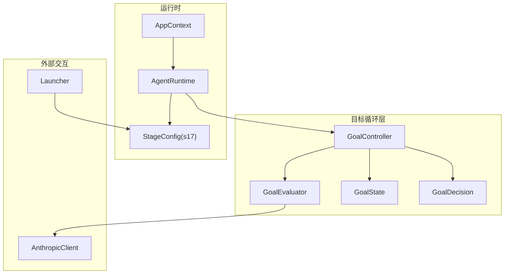
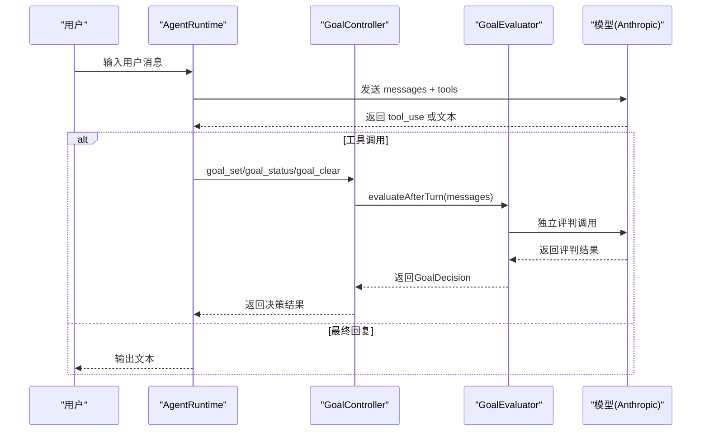
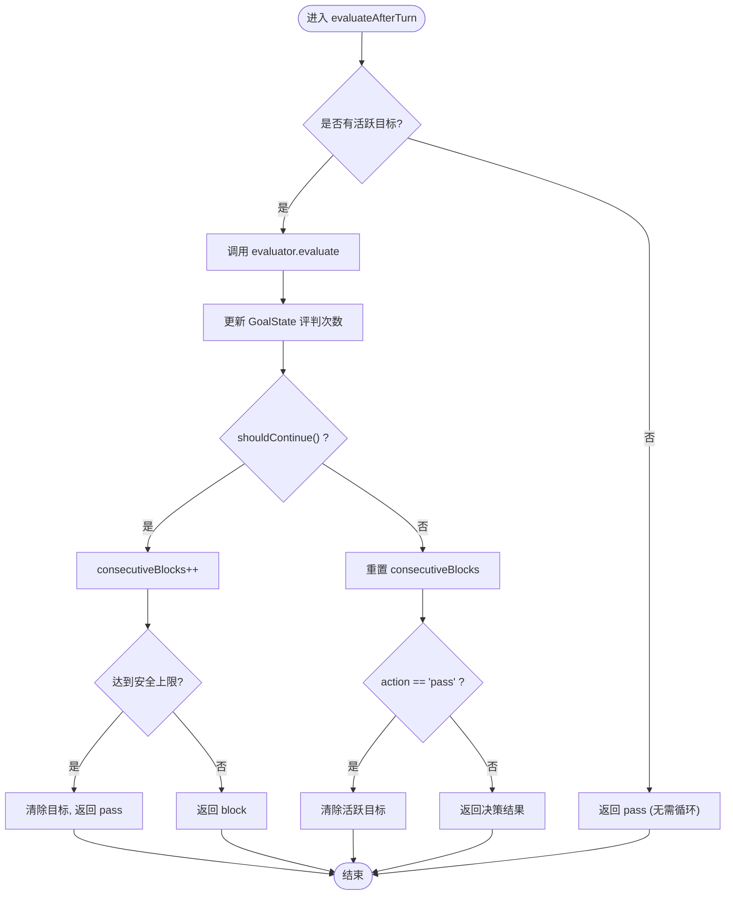
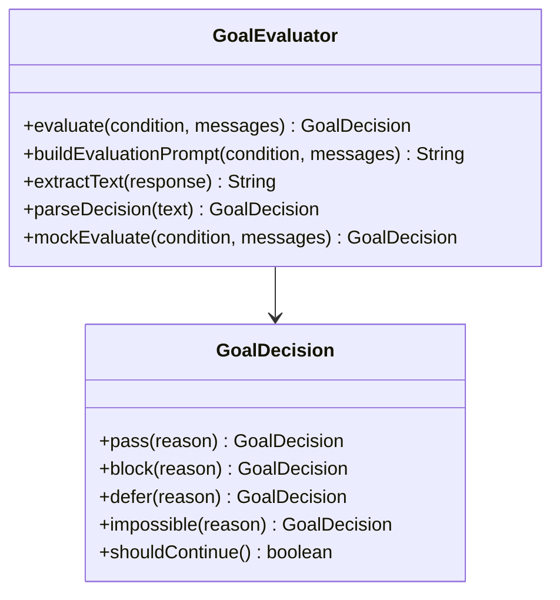
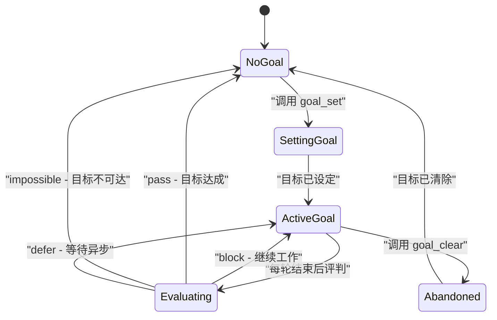
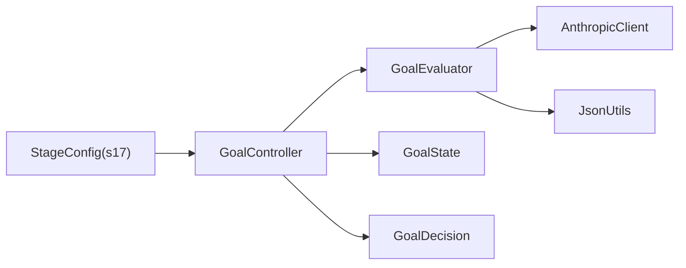

# S17: 目标循环系统

<cite>
**本文引用的文件**
- [S17GoalLoop.java](file://src/main/java/com/learnclaudecode/agents/S17GoalLoop.java)
- [StageConfig.java](file://src/main/java/com/learnclaudecode/agents/StageConfig.java)
- [GoalController.java](file://src/main/java/com/learnclaudecode/goal/GoalController.java)
- [GoalEvaluator.java](file://src/main/java/com/learnclaudecode/goal/GoalEvaluator.java)
- [GoalState.java](file://src/main/java/com/learnclaudecode/goal/GoalState.java)
- [GoalDecision.java](file://src/main/java/com/learnclaudecode/goal/GoalDecision.java)
</cite>

## 更新摘要
**变更内容**
- 原S11自主代理功能已完全移除，代码重构为新的目标循环系统(S17 Goal Loop)
- 新增目标循环架构：包含目标控制器、评判者、状态管理等核心组件
- 更新了所有相关章节以反映新的实现状态和架构设计
- 移除了原有的任务板轮询机制，替换为目标条件驱动的循环控制

## 目录
1. [简介](#简介)
2. [项目结构](#项目结构)
3. [核心组件](#核心组件)
4. [架构总览](#架构总览)
5. [详细组件分析](#详细组件分析)
6. [依赖关系分析](#依赖关系分析)
7. [性能考量](#性能考量)
8. [故障排查指南](#故障排查指南)
9. [结论](#结论)
10. [附录：配置与使用示例](#附录配置与使用示例)

## 简介
本章节面向"S17 目标循环系统"的完整说明，聚焦以下目标：
- 解释目标循环的核心设计理念：通过独立评判者决定循环何时终止，实现"目标驱动"的自治代理。
- 详细说明目标循环系统的三大核心组件：GoalController（会话级Stop hook）、GoalEvaluator（独立评判者）、GoalState（会话状态管理）。
- 提供完整的配置示例：如何设置目标条件、使用goal_set/goal_status/goal_clear工具进行循环控制。
- 解释安全机制：连续block上限、不可达目标检测、安全出口等防止死循环的设计。
- 明确评判者与执行者分离的设计原则：避免"既当运动员又当裁判"的问题。

## 项目结构
S17 目标循环系统位于教学脚本演进的第 17 阶段，采用全新的目标驱动架构。关键文件职责如下：
- S17GoalLoop：入口类，启动 s17 阶段的目标循环。
- StageConfig：定义 s17 的工具集（goal_set、goal_status、goal_clear）与能力开关（enableGoalLoop）。
- GoalController：会话级目标控制器，管理活跃目标和评判流程。
- GoalEvaluator：独立评判者，基于对话历史判断目标是否达成。
- GoalState：记录当前活跃目标的会话状态信息。
- GoalDecision：评判结果封装，支持pass/block/defer/impossible四种决策。

图表来源
- [S17GoalLoop.java:18-22](file://src/main/java/com/learnclaudecode/agents/S17GoalLoop.java#L18-L22)
- [StageConfig.java:649-664](file://src/main/java/com/learnclaudecode/agents/StageConfig.java#L649-L664)
- [GoalController.java:18-35](file://src/main/java/com/learnclaudecode/goal/GoalController.java#L18-L35)

章节来源
- [S17GoalLoop.java:1-23](file://src/main/java/com/learnclaudecode/agents/S17GoalLoop.java#L1-L23)
- [StageConfig.java:649-664](file://src/main/java/com/learnclaudecode/agents/StageConfig.java#L649-L664)

## 核心组件
- GoalController：会话级Stop hook，管理活跃目标并在每轮结束后驱动评判，维护连续block计数以实现安全出口。
- GoalEvaluator：独立评判者，基于对话历史判断目标条件是否达成，支持真实模型调用和启发式mock模式。
- GoalState：会话级状态记录，包含目标条件、评判次数、开始时间、最近理由等信息。
- GoalDecision：评判结果封装，定义pass/block/defer/impossible四种决策类型。
- StageConfig：s17阶段配置，启用目标循环能力并提供相应的工具集。

章节来源
- [GoalController.java:18-137](file://src/main/java/com/learnclaudecode/goal/GoalController.java#L18-L137)
- [GoalEvaluator.java:21-203](file://src/main/java/com/learnclaudecode/goal/GoalEvaluator.java#L21-L203)
- [GoalState.java:16-55](file://src/main/java/com/learnclaudecode/goal/GoalState.java#L16-L55)
- [GoalDecision.java:19-75](file://src/main/java/com/learnclaudecode/goal/GoalDecision.java#L19-L75)
- [StageConfig.java:649-664](file://src/main/java/com/learnclaudecode/agents/StageConfig.java#L649-L664)

## 架构总览
S17 目标循环系统的核心思想是"目标驱动 + 独立评判"。Agent围绕一个可验证的目标条件持续工作，直到独立评判者确认目标达成才停止。该模式通过以下机制实现：
- 目标设定：通过goal_set工具设定可验证的目标条件，开启一段新的循环。
- 独立评判：每轮结束后调用GoalEvaluator基于对话历史判断目标是否达成。
- 安全机制：维护连续block计数，达到上限时强制终止循环，防止死循环。
- 会话状态：GoalState记录目标相关的会话级状态信息，支持状态查询和历史追踪。

图表来源
- [GoalController.java:98-126](file://src/main/java/com/learnclaudecode/goal/GoalController.java#L98-L126)
- [GoalEvaluator.java:52-70](file://src/main/java/com/learnclaudecode/goal/GoalEvaluator.java#L52-L70)
- [StageConfig.java:649-664](file://src/main/java/com/learnclaudecode/agents/StageConfig.java#L649-L664)

## 详细组件分析

### GoalController 会话级控制
- 目标生命周期：setGoal -> active -> clearGoal，支持在任意时刻清除目标。
- 评判流程：evaluateAfterTurn在每轮结束后调用，根据评判结果决定是否继续循环。
- 安全机制：consecutiveBlocks计数器，达到MAX_CONSECUTIVE_BLOCKS(10)时触发安全出口。
- 状态管理：activeGoal记录当前活跃目标，支持getGoalStatus查询状态。

图表来源
- [GoalController.java:98-126](file://src/main/java/com/learnclaudecode/goal/GoalController.java#L98-L126)

章节来源
- [GoalController.java:18-137](file://src/main/java/com/learnclaudecode/goal/GoalController.java#L18-L137)

### GoalEvaluator 独立评判者
- 评判策略：基于对话历史的独立判断，不携带任何工具，避免执行者自判。
- 消息处理：只取最后MAX_MESSAGES(10)条消息，每条截断到MAX_MESSAGE_CHARS(500)字符。
- 降级机制：无API Key时自动切换到启发式mock评判，支持教学演示。
- 错误处理：评判失败时返回block而非pass，确保"宁可继续也不误停"的安全原则。

图表来源
- [GoalEvaluator.java:21-203](file://src/main/java/com/learnclaudecode/goal/GoalEvaluator.java#L21-L203)
- [GoalDecision.java:19-75](file://src/main/java/com/learnclaudecode/goal/GoalDecision.java#L19-L75)

章节来源
- [GoalEvaluator.java:21-203](file://src/main/java/com/learnclaudecode/goal/GoalEvaluator.java#L21-L203)
- [GoalDecision.java:19-75](file://src/main/java/com/learnclaudecode/goal/GoalDecision.java#L19-L75)

### GoalState 会话状态管理
- 状态字段：condition(目标条件)、evaluationCount(评判次数)、startTime(开始时间)、latestReason(最近理由)。
- 状态更新：withEvaluation方法创建新的状态对象，保持不可变性。
- 时间计算：elapsed方法将毫秒时间戳转换为易读的"42s"或"3m 12s"格式。

章节来源
- [GoalState.java:16-55](file://src/main/java/com/learnclaudecode/goal/GoalState.java#L16-L55)

### 目标循环工作流程
- 目标设定：通过goal_set工具设定可验证的目标条件。
- 循环执行：Agent每轮工作后，GoalController调用GoalEvaluator进行评判。
- 决策处理：根据GoalDecision(action)决定继续循环、停止循环或等待异步结果。
- 安全退出：连续block达到上限时强制终止，防止无限循环。

图表来源
- [GoalController.java:43-66](file://src/main/java/com/learnclaudecode/goal/GoalController.java#L43-L66)
- [GoalController.java:98-126](file://src/main/java/com/learnclaudecode/goal/GoalController.java#L98-L126)

## 依赖关系分析
- GoalController 依赖 GoalEvaluator、GoalState、GoalDecision，管理会话级目标状态。
- GoalEvaluator 依赖 AnthropicClient 进行模型调用，依赖 JsonUtils 解析JSON响应。
- StageConfig 提供 s17 的工具集与 system prompt，启用 enableGoalLoop 能力。
- GoalDecision 作为纯数据记录，被其他组件用于传递评判结果。

图表来源
- [GoalController.java:18-35](file://src/main/java/com/learnclaudecode/goal/GoalController.java#L18-L35)
- [GoalEvaluator.java:21-43](file://src/main/java/com/learnclaudecode/goal/GoalEvaluator.java#L21-L43)
- [StageConfig.java:649-664](file://src/main/java/com/learnclaudecode/agents/StageConfig.java#L649-L664)

章节来源
- [GoalController.java:18-35](file://src/main/java/com/learnclaudecode/goal/GoalController.java#L18-L35)
- [GoalEvaluator.java:21-43](file://src/main/java/com/learnclaudecode/goal/GoalEvaluator.java#L21-L43)
- [StageConfig.java:649-664](file://src/main/java/com/learnclaudecode/agents/StageConfig.java#L649-L664)

## 性能考量
- 消息截断：限制评判时回看的消息数量(10条)和单条消息长度(500字符)，控制请求体积。
- 降级策略：无API Key时使用启发式mock评判，保证教学环境下的可用性。
- 并发安全：GoalController的方法使用synchronized关键字保证线程安全。
- 内存管理：GoalState采用record类型，每次更新创建新对象，避免状态污染。

章节来源
- [GoalEvaluator.java:29-32](file://src/main/java/com/learnclaudecode/goal/GoalEvaluator.java#L29-L32)
- [GoalEvaluator.java:172-182](file://src/main/java/com/learnclaudecode/goal/GoalEvaluator.java#L172-L182)
- [GoalController.java:43-66](file://src/main/java/com/learnclaudecode/goal/GoalController.java#L43-L66)

## 故障排查指南
- 目标为空：setGoal方法会拒绝空字符串，需检查传入的目标条件。
- 评判失败：GoalEvaluator捕获异常并返回block，确保循环不会意外终止。
- 连续block过多：达到10次连续block时会触发安全出口，需检查目标条件是否合理。
- 工具未知：stageConfig中未正确注册goal_*工具时，模型无法调用相应功能。

章节来源
- [GoalController.java:43-52](file://src/main/java/com/learnclaudecode/goal/GoalController.java#L43-L52)
- [GoalEvaluator.java:52-70](file://src/main/java/com/learnclaudecode/goal/GoalEvaluator.java#L52-L70)
- [GoalController.java:108-115](file://src/main/java/com/learnclaudecode/goal/GoalController.java#L108-L115)
- [StageConfig.java:654-656](file://src/main/java/com/learnclaudecode/agents/StageConfig.java#L654-L656)

## 结论
S17 目标循环系统通过"目标驱动 + 独立评判"的架构，实现了更加可靠和可控的自治代理。相比传统的任务板轮询机制，目标循环系统具有以下优势：
- 明确的终止条件：通过可验证的目标条件替代模糊的任务完成判断。
- 客观的评判机制：独立评判者避免了执行者自判的偏见问题。
- 完善的安全保障：连续block上限、不可达目标检测等多重安全机制。
- 灵活的降级策略：支持真实模型调用和启发式mock两种运行模式。

## 附录：配置与使用示例

### 启动入口
- 使用 S17GoalLoop.main 启动 s17 阶段，内部调用 Launcher.launch(StageConfig.s17())。

章节来源
- [S17GoalLoop.java:18-22](file://src/main/java/com/learnclaudecode/agents/S17GoalLoop.java#L18-L22)

### 阶段配置（s17）
- 工具集：包含目标循环三件套（goal_set、goal_status、goal_clear），继承自s04的基础工具。
- System Prompt：强调目标驱动的工作模式，指导Agent使用goal_set设定目标并持续工作。
- 能力开关：enablePermission=true、enableHooks=true、enableGoalLoop=true。

章节来源
- [StageConfig.java:649-664](file://src/main/java/com/learnclaudecode/agents/StageConfig.java#L649-L664)

### 目标函数、约束与安全机制
- 目标函数：通过goal_set设定可验证的目标条件，Agent持续工作直到条件满足。
- 约束条件：
  - 目标条件必须非空且可验证。
  - 最多允许10次连续block，超过则强制终止。
  - 支持defer状态等待异步结果。
- 安全机制：
  - 连续block上限保护，防止无限循环。
  - 不可达目标检测，区分正常完成和目标放弃。
  - 评判失败时的fail-safe设计，宁可继续也不误停。

章节来源
- [GoalController.java:19-20](file://src/main/java/com/learnclaudecode/goal/GoalController.java#L19-L20)
- [GoalController.java:108-115](file://src/main/java/com/learnclaudecode/goal/GoalController.java#L108-L115)
- [GoalEvaluator.java:66-69](file://src/main/java/com/learnclaudecode/goal/GoalEvaluator.java#L66-L69)

### 使用示例
- 设定目标：调用goal_set工具，传入condition参数定义可验证的目标条件。
- 监控状态：定期调用goal_status查看当前目标状态、评判次数和耗时。
- 主动终止：调用goal_clear主动清除目标并停止循环。
- 错误处理：当目标不可达或评判失败时，系统会自动采取安全措施。

章节来源
- [GoalController.java:43-66](file://src/main/java/com/learnclaudecode/goal/GoalController.java#L43-L66)
- [GoalController.java:73-82](file://src/main/java/com/learnclaudecode/goal/GoalController.java#L73-L82)
- [StageConfig.java:654-662](file://src/main/java/com/learnclaudecode/agents/StageConfig.java#L654-L662)