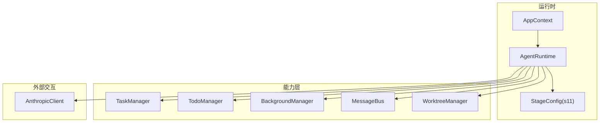
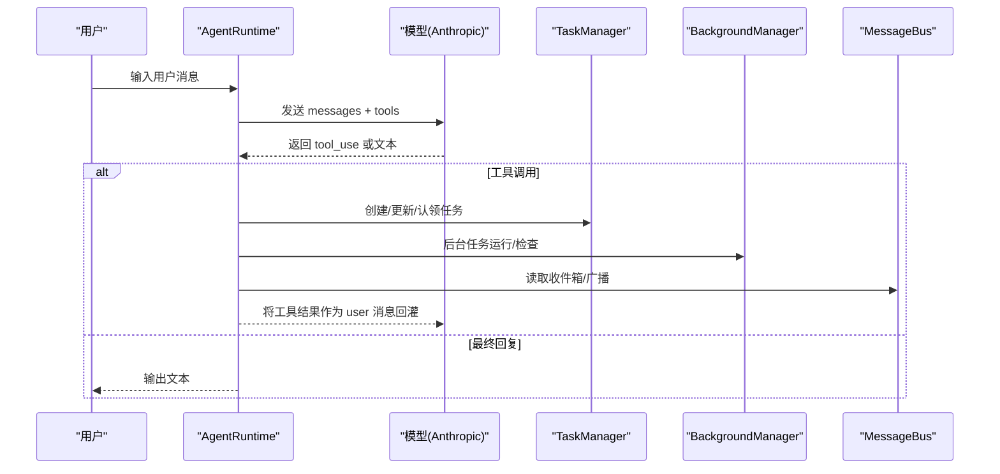
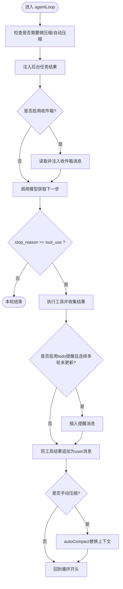
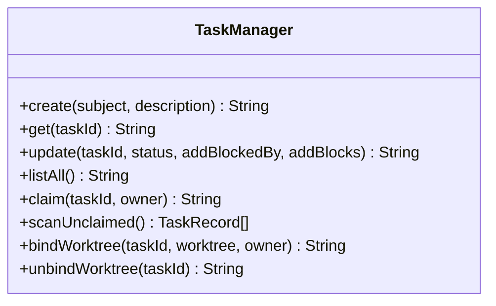
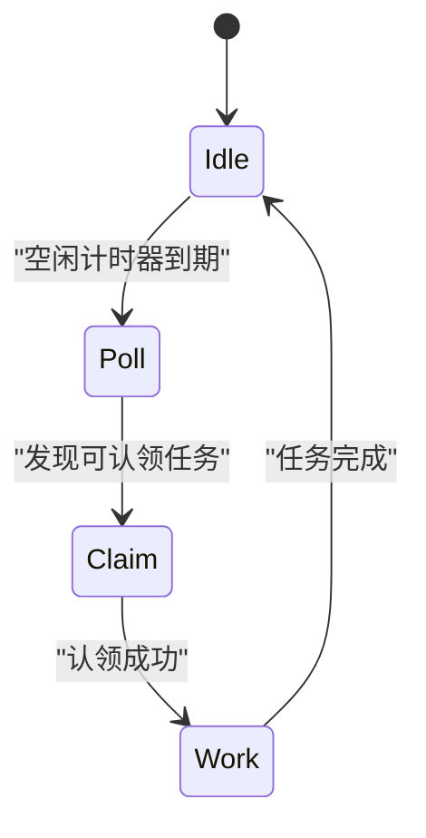
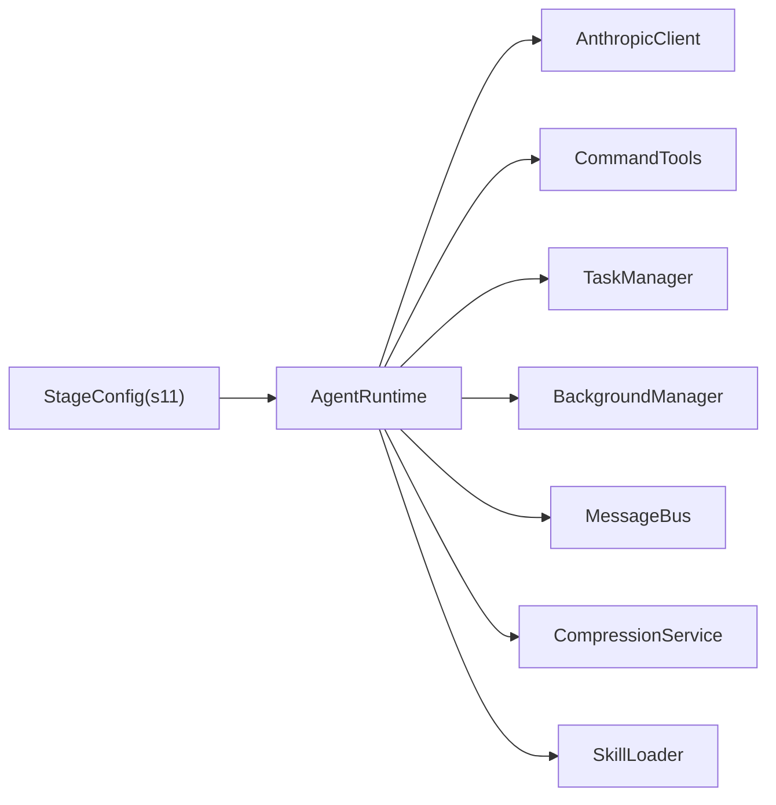

# S11: 自主代理

<cite>
**本文引用的文件**
- [S11AutonomousAgents.java](file://src/main/java/com/learnclaudecode/agents/S11AutonomousAgents.java)
- [AgentRuntime.java](file://src/main/java/com/learnclaudecode/agents/AgentRuntime.java)
- [AppContext.java](file://src/main/java/com/learnclaudecode/agents/AppContext.java)
- [StageConfig.java](file://src/main/java/com/learnclaudecode/agents/StageConfig.java)
- [TaskManager.java](file://src/main/java/com/learnclaudecode/tasks/TaskManager.java)
- [TodoManager.java](file://src/main/java/com/learnclaudecode/tools/TodoManager.java)
- [s11-autonomous-agents.tsx](file://web/src/components/visualizations/s11-autonomous-agents.tsx)
- [s11.json（场景）](file://web/src/data/scenarios/s11.json)
- [s11.json（注解）](file://web/src/data/annotations/s11.json)
</cite>

## 目录
1. [简介](#简介)
2. [项目结构](#项目结构)
3. [核心组件](#核心组件)
4. [架构总览](#架构总览)
5. [详细组件分析](#详细组件分析)
6. [依赖关系分析](#依赖关系分析)
7. [性能考量](#性能考量)
8. [故障排查指南](#故障排查指南)
9. [结论](#结论)
10. [附录：配置与使用示例](#附录配置与使用示例)

## 简介
本章节面向“S11 自主代理”的完整说明，聚焦以下目标：
- 解释自主代理的决策机制与行为模式：目标设定、计划制定与执行策略。
- 详细说明 AgentRuntime 中的自主行为实现：自我反思（通过工具结果反馈）、环境感知（任务板/收件箱/后台任务）、自适应调整（上下文压缩与提醒）。
- 提供完整的配置示例：如何设置系统提示、工具集、约束条件与奖励机制（以任务状态推进为奖励信号）。
- 解释学习能力、经验积累与知识迁移：通过技能加载、上下文压缩与任务依赖传递实现。
- 明确安全边界与伦理考虑：只读子代理、最小权限工具集、超时与终止策略、避免无限循环与资源浪费。

## 项目结构
S11 自主代理位于教学脚本演进的第 11 阶段，基于统一的 AgentRuntime 逐步打开能力开关。关键文件职责如下：
- S11AutonomousAgents：入口类，启动 s11 阶段。
- StageConfig：定义 s11 的工具集、system prompt 与能力开关（如 enableInbox、autonomousTeammates）。
- AgentRuntime：统一驱动“用户输入 -> 模型决策 -> 工具执行 -> 结果回灌”的主循环，并集成后台任务、收件箱、上下文压缩等。
- TaskManager：基于文件的轻量任务板，支持创建、更新、认领、扫描可认领任务、依赖清理等。
- TodoManager：用于短清单式规划与进度跟踪。
- AppContext：装配共享服务，构造 AgentRuntime。
- Web 可视化与场景数据：展示自主代理的 idle-poll-claim-work 周期与多代理协作流程。

图表来源
- [AgentRuntime.java:23-39](file://src/main/java/com/learnclaudecode/agents/AgentRuntime.java#L23-L39)
- [StageConfig.java:213-227](file://src/main/java/com/learnclaudecode/agents/StageConfig.java#L213-L227)
- [AppContext.java:35-58](file://src/main/java/com/learnclaudecode/agents/AppContext.java#L35-L58)

章节来源
- [S11AutonomousAgents.java:1-13](file://src/main/java/com/learnclaudecode/agents/S11AutonomousAgents.java#L1-L13)
- [StageConfig.java:213-227](file://src/main/java/com/learnclaudecode/agents/StageConfig.java#L213-L227)
- [AppContext.java:35-58](file://src/main/java/com/learnclaudecode/agents/AppContext.java#L35-L58)

## 核心组件
- AgentRuntime：实现主循环与工具调度，负责消息历史维护、上下文压缩、后台任务注入、收件箱轮询、工具执行与结果回灌。
- StageConfig：集中编排各阶段的能力开关与工具集；s11 开启团队通信与自主认领能力，并提供 system prompt 模板。
- TaskManager：持久化任务板，提供创建、更新、认领、扫描可认领任务、依赖清理等方法，支撑多代理协作。
- TodoManager：短清单管理，限制最大条目数与进行中任务数量，保障计划的可控性。
- AppContext：装配所有共享服务，生成统一的 AgentRuntime。

章节来源
- [AgentRuntime.java:97-261](file://src/main/java/com/learnclaudecode/agents/AgentRuntime.java#L97-L261)
- [StageConfig.java:213-227](file://src/main/java/com/learnclaudecode/agents/StageConfig.java#L213-L227)
- [TaskManager.java:51-197](file://src/main/java/com/learnclaudecode/tasks/TaskManager.java#L51-L197)
- [TodoManager.java:21-55](file://src/main/java/com/learnclaudecode/tools/TodoManager.java#L21-L55)
- [AppContext.java:35-58](file://src/main/java/com/learnclaudecode/agents/AppContext.java#L35-L58)

## 架构总览
S11 自主代理的核心思想是“无中心协调的多代理自组织”。每个队友在空闲时主动轮询任务板，认领可执行的任务并工作，完成后回到空闲态。该模式通过以下机制实现：
- 决策循环：每轮调用模型决定下一步动作（文本或工具调用），本地执行工具后将结果写回消息历史，形成闭环。
- 环境感知：后台任务结果、收件箱消息、任务板状态变化被周期性注入到对话中，使模型能基于真实世界状态继续推理。
- 自适应调整：上下文自动压缩与手动压缩，配合提醒机制，确保长对话不失控。
- 自主认领：通过 claim_task 与 scanUnclaimed 的配合，实现无冲突的任务分配。

图表来源
- [AgentRuntime.java:131-261](file://src/main/java/com/learnclaudecode/agents/AgentRuntime.java#L131-L261)
- [StageConfig.java:213-227](file://src/main/java/com/learnclaudecode/agents/StageConfig.java#L213-L227)
- [TaskManager.java:51-197](file://src/main/java/com/learnclaudecode/tasks/TaskManager.java#L51-L197)

## 详细组件分析

### AgentRuntime 自主行为实现
- 自我反思：通过工具结果回灌，模型在下一轮基于“执行后的真实世界状态”进行再推理，形成“行动-观察-反思”的闭环。
- 环境感知：
  - 后台任务：drain 后台结果并以 user 消息注入，使模型知晓异步任务完成状态。
  - 收件箱：readInbox 将队友消息拼入上下文，支持团队协作。
  - 上下文压缩：microCompact 与 autoCompact 控制对话长度，防止上下文溢出。
- 自适应调整：
  - 多轮未更新 todo 时插入提醒，促使模型维护计划。
  - 手动 compact 触发后直接替换旧上下文，保持信息密度。

图表来源
- [AgentRuntime.java:131-261](file://src/main/java/com/learnclaudecode/agents/AgentRuntime.java#L131-L261)

章节来源
- [AgentRuntime.java:131-261](file://src/main/java/com/learnclaudecode/agents/AgentRuntime.java#L131-L261)

### 任务系统与自主认领
- 任务生命周期：pending -> in_progress -> completed/deleted。
- 自主认领：scanUnclaimed 筛选 pending、无 owner、无 blockedBy 的任务；claim 将 owner 写入并推进状态。
- 依赖清理：completed 任务完成后，自动移除其他任务的 blockedBy 引用，释放后续任务。

图表来源
- [TaskManager.java:51-197](file://src/main/java/com/learnclaudecode/tasks/TaskManager.java#L51-L197)

章节来源
- [TaskManager.java:51-197](file://src/main/java/com/learnclaudecode/tasks/TaskManager.java#L51-L197)

### 多代理协作与可视化
- 前端可视化展示了三个代理围绕任务板的 idle-poll-claim-work 周期，体现无中心协调的自组织能力。
- 场景数据描述了从创建任务到多个队友并发认领、等待依赖、完成任务的全过程。

图表来源
- [s11-autonomous-agents.tsx:16-28](file://web/src/components/visualizations/s11-autonomous-agents.tsx#L16-L28)

章节来源
- [s11-autonomous-agents.tsx:70-162](file://web/src/components/visualizations/s11-autonomous-agents.tsx#L70-L162)
- [s11.json（场景）:1-45](file://web/src/data/scenarios/s11.json#L1-L45)

### 学习、经验与知识迁移
- 技能加载：通过 load_skill 工具动态加载领域知识，辅助模型处理不熟悉的工作。
- 上下文压缩：autoCompact 将长对话摘要化，保留关键信息与身份元数据，使长期记忆更紧凑。
- 任务依赖传递：blockedBy/blocks 字段记录任务间依赖，完成前置任务后自动解锁后续任务，形成“经验”的结构化表达。

章节来源
- [StageConfig.java:124-135](file://src/main/java/com/learnclaudecode/agents/StageConfig.java#L124-L135)
- [AgentRuntime.java:136-145](file://src/main/java/com/learnclaudecode/agents/AgentRuntime.java#L136-L145)
- [TaskManager.java:84-133](file://src/main/java/com/learnclaudecode/tasks/TaskManager.java#L84-L133)

## 依赖关系分析
- AgentRuntime 依赖 AnthropicClient、CommandTools、TodoManager、SkillLoader、CompressionService、TaskManager、BackgroundManager、MessageBus、TeammateManager、WorktreeManager。
- StageConfig 提供 s11 的工具集与 system prompt，包含团队通信与自主认领能力。
- TaskManager 依赖 WorkspacePaths 与 JsonUtils，实现任务持久化与依赖管理。

图表来源
- [AgentRuntime.java:41-51](file://src/main/java/com/learnclaudecode/agents/AgentRuntime.java#L41-L51)
- [StageConfig.java:213-227](file://src/main/java/com/learnclaudecode/agents/StageConfig.java#L213-L227)

章节来源
- [AgentRuntime.java:41-51](file://src/main/java/com/learnclaudecode/agents/AgentRuntime.java#L41-L51)
- [StageConfig.java:213-227](file://src/main/java/com/learnclaudecode/agents/StageConfig.java#L213-L227)

## 性能考量
- 轮询间隔：前端可视化与注解表明，自主代理采用约 1 秒的轮询间隔，平衡响应性与文件系统开销。
- 上下文压缩：microCompact 与 autoCompact 降低对话长度，减少模型调用成本与延迟。
- 后台任务：长时间命令在后台执行，避免阻塞主循环。
- 同步访问：TaskManager 对任务读写使用 synchronized，保证并发安全。

章节来源
- [s11.json（注解）:5-17](file://web/src/data/annotations/s11.json#L5-L17)
- [AgentRuntime.java:136-145](file://src/main/java/com/learnclaudecode/agents/AgentRuntime.java#L136-L145)
- [TaskManager.java:84-133](file://src/main/java/com/learnclaudecode/tasks/TaskManager.java#L84-L133)

## 故障排查指南
- 任务不存在：load 方法抛出异常，需检查任务 ID 是否正确。
- 删除失败：delete 操作可能因 IO 异常失败，需检查文件权限与路径。
- 依赖清理异常：completed 任务完成后清理依赖失败会影响后续任务解锁，需检查任务文件完整性。
- 工具未知：switch default 分支返回未知工具提示，需确认工具名与 schema 一致。

章节来源
- [TaskManager.java:276-321](file://src/main/java/com/learnclaudecode/tasks/TaskManager.java#L276-L321)
- [AgentRuntime.java:233-233](file://src/main/java/com/learnclaudecode/agents/AgentRuntime.java#L233-L233)

## 结论
S11 自主代理通过“无中心协调 + 任务板轮询 + 上下文压缩 + 后台任务”的组合，实现了多代理自组织与高效协作。其决策机制以工具调用为核心，环境感知与自适应调整确保系统在长对话与复杂任务下的稳定性。通过合理的配置与约束，可以在保证安全边界的前提下，充分发挥模型的规划与执行能力。

## 附录：配置与使用示例

### 启动入口
- 使用 S11AutonomousAgents.main 启动 s11 阶段，内部调用 Launcher.launch(StageConfig.s11())。

章节来源
- [S11AutonomousAgents.java:9-11](file://src/main/java/com/learnclaudecode/agents/S11AutonomousAgents.java#L9-L11)

### 阶段配置（s11）
- 工具集：包含团队通信（spawn_teammate、send_message、read_inbox、broadcast、shutdown_request、plan_approval）、任务管理（task_create、task_update、task_list、task_get）、自主认领（claim_task、idle）以及基础文件/命令工具。
- System Prompt：强调队友具备自治能力，能够自行寻找工作。
- 能力开关：enableInbox=true、autonomousTeammates=true。

章节来源
- [StageConfig.java:213-227](file://src/main/java/com/learnclaudecode/agents/StageConfig.java#L213-L227)

### 目标函数、约束与奖励机制
- 目标函数：以任务完成为目标，通过 claim_task 与 task_update 推进状态。
- 约束条件：
  - 仅允许认领 pending、无 owner、无 blockedBy 的任务。
  - 最多同时一个 in_progress 的 todo（由 TodoManager 校验）。
  - 子代理可设置为只读模式，避免不受控上下文修改文件。
- 奖励机制：
  - 任务状态从 pending -> in_progress -> completed 视为正向奖励信号。
  - 依赖清理后解锁新任务，形成“经验”的正反馈。

章节来源
- [TaskManager.java:168-197](file://src/main/java/com/learnclaudecode/tasks/TaskManager.java#L168-L197)
- [TodoManager.java:21-55](file://src/main/java/com/learnclaudecode/tools/TodoManager.java#L21-L55)
- [AgentRuntime.java:270-310](file://src/main/java/com/learnclaudecode/agents/AgentRuntime.java#L270-L310)

### 安全边界与伦理考虑
- 只读子代理：subagentWritable=false 时移除 write_file/edit_file，限制子代理的文件写入权限。
- 超时与终止：注解建议空闲 60 秒后自动终止，防止僵尸进程。
- 最小权限：按阶段开放工具集，避免不必要的系统访问。
- 伦理考虑：避免无限循环与资源浪费，确保任务依赖清晰、状态可追溯。

章节来源
- [AgentRuntime.java:270-310](file://src/main/java/com/learnclaudecode/agents/AgentRuntime.java#L270-L310)
- [s11.json（注解）:18-31](file://web/src/data/annotations/s11.json#L18-L31)