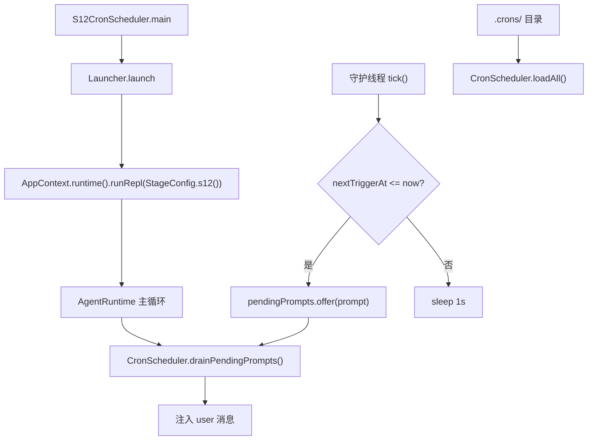
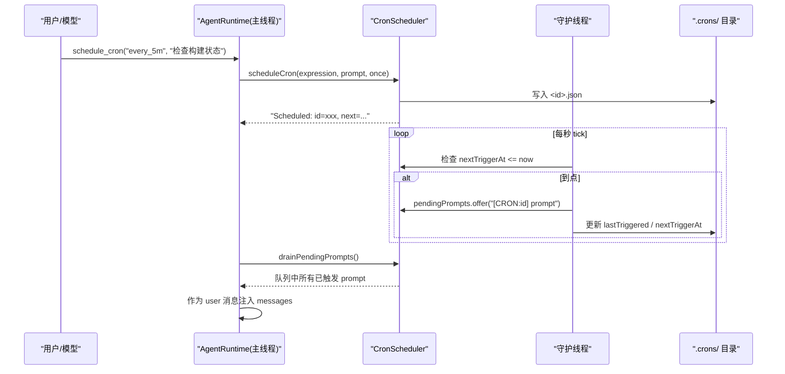

# S12: 定时调度

<cite>
**本文引用的文件**
- [CronScheduler.java](file://src/main/java/com/learnclaudecode/scheduler/CronScheduler.java)
- [CronJob.java](file://src/main/java/com/learnclaudecode/model/CronJob.java)
- [StageConfig.java](file://src/main/java/com/learnclaudecode/agents/StageConfig.java)
- [S12CronScheduler.java](file://src/main/java/com/learnclaudecode/agents/S12CronScheduler.java)
- [AgentRuntime.java](file://src/main/java/com/learnclaudecode/agents/AgentRuntime.java)
- [WorkspacePaths.java](file://src/main/java/com/learnclaudecode/common/WorkspacePaths.java)
</cite>

## 目录
1. [简介](#简介)
2. [教学目标](#教学目标)
3. [项目结构](#项目结构)
4. [核心组件](#核心组件)
5. [架构总览](#架构总览)
6. [详细组件分析](#详细组件分析)
7. [工具列表](#工具列表)
8. [持久化机制](#持久化机制)
9. [与前后阶段的关系](#与前后阶段的关系)
10. [故障排查指南](#故障排查指南)
11. [结论](#结论)

## 简介

> **座右铭："按计划触发，无需人工干预"**

在 S11（后台任务）中，Agent 学会了异步执行长耗时命令。但后台任务仍然是"被动触发"的——需要用户或模型主动发起。如果我想让 Agent "每 5 分钟检查一次构建状态"或"每天 9 点生成日报"呢？

S12 引入**定时调度器（Cron Scheduler）**，让 Agent 具备"时间维度"的自治能力：把未来要做的事登记下来，由后台守护线程到点自动唤醒，并将预设 prompt 注入主循环。

本阶段的核心问题是：**如何让 Agent 在没有人工输入的情况下，按计划自动行动？**

## 教学目标

完成本阶段学习后，你应当能够：

- 理解定时调度与后台任务的区别：后台是"异步执行已发起的命令"，定时是"到点自动发起新动作"
- 掌握简化 cron 表达式的四种格式：every_Ns / every_Nm / every_Nh / at_HH:MM
- 理解守护线程（daemon thread）的 tick 循环如何检查触发条件
- 掌握 pendingPrompts 队列如何实现"调度线程 → 主循环线程"的跨线程通信
- 了解 `.crons/` 目录的持久化模式如何让计划跨重启存活
- 能够解释 once 标志对任务生命周期的影响

## 项目结构

S12 的定时调度能力由"阶段配置 + 调度器 + 数据模型 + 运行时消费"四部分构成：

- 阶段配置 `StageConfig.s12()` 启用 `enableCron=true`，暴露调度管理工具
- `CronScheduler` 负责定时任务的登记、持久化、守护线程调度和 prompt 队列管理
- `CronJob` 是定时任务的数据模型，包含表达式、prompt、触发时间等
- `AgentRuntime` 每轮循环调用 `drainPendingPrompts()` 消费已触发的 prompt



**图表来源**
- [S12CronScheduler.java](file://src/main/java/com/learnclaudecode/agents/S12CronScheduler.java)
- [CronScheduler.java:39-96](file://src/main/java/com/learnclaudecode/scheduler/CronScheduler.java#L39-L96)

**章节来源**
- [S12CronScheduler.java](file://src/main/java/com/learnclaudecode/agents/S12CronScheduler.java)
- [CronScheduler.java:1-348](file://src/main/java/com/learnclaudecode/scheduler/CronScheduler.java#L1-L348)
- [CronJob.java:1-206](file://src/main/java/com/learnclaudecode/model/CronJob.java#L1-L206)

## 核心组件

- **CronScheduler**：定时调度器，管理任务登记、守护线程、prompt 队列
- **CronJob**：定时任务数据模型，包含 id、expression、prompt、once、active、nextTriggerAt 等字段
- **StageConfig.s12()**：启用 `enableCron` 开关，暴露 `schedule_cron`、`list_crons`、`cancel_cron` 工具
- **WorkspacePaths.cronsDir()**：提供 `.crons/` 目录路径

**章节来源**
- [CronScheduler.java:39-96](file://src/main/java/com/learnclaudecode/scheduler/CronScheduler.java#L39-L96)
- [CronJob.java:25-65](file://src/main/java/com/learnclaudecode/model/CronJob.java#L25-L65)

## 架构总览

定时调度的跨线程协作模型：



**图表来源**
- [CronScheduler.java:98-200](file://src/main/java/com/learnclaudecode/scheduler/CronScheduler.java#L98-L200)
- [AgentRuntime.java](file://src/main/java/com/learnclaudecode/agents/AgentRuntime.java)

## 详细组件分析

### CronJob：简化 cron 表达式

本项目刻意不引入完整的 Quartz/cron 五段式表达式，而是用一套"够用且好懂"的简化语法：

| 格式 | 含义 | 示例 |
|------|------|------|
| `every_Ns` | 每 N 秒触发 | `every_30s` = 每 30 秒 |
| `every_Nm` | 每 N 分钟触发 | `every_5m` = 每 5 分钟 |
| `every_Nh` | 每 N 小时触发 | `every_1h` = 每小时 |
| `at_HH:MM` | 每天指定时刻触发 | `at_14:30` = 每天 14:30 |

CronJob 的核心字段：

```java
public class CronJob {
    public String id;              // UUID，同时作为文件名
    public String expression;      // 简化 cron 表达式
    public String prompt;          // 触发时注入的 prompt
    public boolean once;           // 是否一次性（触发后失活）
    public boolean active;         // 是否活跃
    public long createdAt;         // 创建时间
    public long lastTriggered;     // 上次触发时间（0=未触发过）
    public long nextTriggerAt;     // 下次触发时间
}
```

`nextTriggerAt` 的计算逻辑：
- `every_Ns/m/h`：当前时间 + N 秒/分/时
- `at_HH:MM`：今天的 HH:MM（如已过则顺延到明天）

**章节来源**
- [CronJob.java:1-206](file://src/main/java/com/learnclaudecode/model/CronJob.java#L1-L206)

### CronScheduler：守护线程与 tick 循环

调度器启动一个 daemon 线程，每秒执行一次 tick：

```java
private void loop() {
    while (running) {
        tick();
        Thread.sleep(TICK_INTERVAL_MS);  // 1000ms
    }
}
```

`tick()` 的逻辑：
1. 遍历所有 active 的任务
2. 检查 `nextTriggerAt <= System.currentTimeMillis()`
3. 到点的任务：将 `"[CRON:<id>] <prompt>"` 压入 `pendingPrompts` 队列
4. 更新 `lastTriggered` 为当前时间
5. 如果 `once=true`：设 `active=false`（一次性任务触发后失活）
6. 如果 `once=false`：重新计算 `nextTriggerAt`（周期任务继续）
7. 将更新后的 CronJob 写回磁盘

**守护线程（daemon）**：设置为 daemon 线程意味着 JVM 退出时不会被该线程阻塞。Agent 进程结束时，调度线程自动终止。

**章节来源**
- [CronScheduler.java:39-96](file://src/main/java/com/learnclaudecode/scheduler/CronScheduler.java#L39-L96)

### 跨线程通信：pendingPrompts 队列

```java
private final LinkedBlockingQueue<String> pendingPrompts = new LinkedBlockingQueue<>();
```

- **写入方**：守护线程（tick 中 offer）
- **读取方**：主循环线程（drainPendingPrompts 中 poll）
- **线程安全**：LinkedBlockingQueue 是线程安全的阻塞队列，无需额外同步

`drainPendingPrompts()` 一次性取出并清空队列中所有已触发的 prompt，返回给 AgentRuntime 注入到消息历史中。

**章节来源**
- [CronScheduler.java:66-73](file://src/main/java/com/learnclaudecode/scheduler/CronScheduler.java#L66-L73)

### 并发安全设计

- 任务索引使用 `ConcurrentHashMap`，读操作无锁
- 写操作（scheduleCron、cancelCron、tick 中的状态更新）加 `synchronized`
- `running` 标志用 `volatile` 修饰，保证 stop() 的写入对 loop() 立即可见
- 构造时 `loadAll()` 从磁盘恢复上次会话的任务，实现"计划跨重启存活"

**章节来源**
- [CronScheduler.java:56-96](file://src/main/java/com/learnclaudecode/scheduler/CronScheduler.java#L56-L96)

## 工具列表

S12 阶段暴露以下定时调度工具：

| 工具名 | 功能 | 关键参数 |
|--------|------|---------|
| `schedule_cron` | 登记一个定时任务 | expression, prompt, once(boolean) |
| `list_crons` | 列出所有定时任务及状态 | 无 |
| `cancel_cron` | 取消（失活）一个定时任务 | cron_id |

**使用示例**：

```
用户：每 5 分钟检查一次构建状态
Agent 调用：schedule_cron(expression="every_5m", prompt="检查构建状态并报告", once=false)
返回：Scheduled cron job: id=xxx, expression=every_5m, next=2024-01-15 14:35:00
```

```
用户：明天 9 点生成日报（只一次）
Agent 调用：schedule_cron(expression="at_09:00", prompt="生成昨日工作日报", once=true)
返回：Scheduled cron job: id=yyy, expression=at_09:00, next=2024-01-16 09:00:00
```

**章节来源**
- [StageConfig.java](file://src/main/java/com/learnclaudecode/agents/StageConfig.java)
- [CronScheduler.java:98-180](file://src/main/java/com/learnclaudecode/scheduler/CronScheduler.java#L98-L180)

## 持久化机制

### 存储结构

```
.crons/
├── a1b2c3d4-e5f6-7890-abcd-ef1234567890.json
├── b2c3d4e5-f6a7-8901-bcde-f12345678901.json
└── ...
```

### 单条任务 JSON 格式

```json
{
  "id": "a1b2c3d4-...",
  "expression": "every_5m",
  "prompt": "检查构建状态并报告",
  "once": false,
  "active": true,
  "createdAt": 1705312800000,
  "lastTriggered": 1705313100000,
  "nextTriggerAt": 1705313400000
}
```

### 跨重启恢复

CronScheduler 构造时调用 `loadAll()`，扫描 `.crons/` 目录下所有 JSON 文件，恢复任务到内存。这意味着：
- 上次会话登记的周期任务，重启后继续按计划触发
- 已失活（active=false）的一次性任务不会被重新激活
- nextTriggerAt 如果已过期，下次 tick 时会立即触发

**章节来源**
- [CronScheduler.java:86-96](file://src/main/java/com/learnclaudecode/scheduler/CronScheduler.java#L86-L96)
- [CronJob.java:24-65](file://src/main/java/com/learnclaudecode/model/CronJob.java#L24-L65)
- [WorkspacePaths.java](file://src/main/java/com/learnclaudecode/common/WorkspacePaths.java)

## 与前后阶段的关系

### 前置阶段

- **S10（任务系统）**：任务系统是"事件驱动"的（有人创建/认领才推进），定时调度是"时间驱动"的（到点自动触发）。二者可配合：cron 触发的 prompt 可以是"检查任务板并推进下一个任务"
- **S11（后台任务）**：后台任务是"异步执行已发起的命令"，定时调度是"到点自动发起新动作"。后台任务的结果通过 drain() 回注，定时任务的 prompt 通过 drainPendingPrompts() 注入——二者使用相同的"队列 + 主循环消费"模式

### 后续阶段

- **S13（多 Agent 协作）**：cron 可以定期触发"检查队友消息"或"扫描待认领任务"
- **S15（集成运行时）**：定时调度成为主循环的标准注入源之一，与后台任务、inbox 消息并列
- **S17（目标循环）**：cron 可以定期触发目标评判，实现"持续监控直到目标达成"

### 设计演进

```
S10: 任务系统（事件驱动）
S11: 后台任务（异步执行 + 队列回注）
S12: 定时调度（时间驱动 + 队列注入） ← 你在这里
S15: 集成运行时（cron + background + inbox 三源注入）
```

**章节来源**
- [StageConfig.java](file://src/main/java/com/learnclaudecode/agents/StageConfig.java)
- [AgentRuntime.java](file://src/main/java/com/learnclaudecode/agents/AgentRuntime.java)

## 故障排查指南

| 现象 | 可能原因 | 定位方法 |
|------|---------|---------|
| schedule_cron 返回 "Invalid cron expression" | 表达式格式不合法 | 只接受 every_Ns/every_Nm/every_Nh/at_HH:MM |
| 任务登记成功但未触发 | 守护线程未启动或 nextTriggerAt 计算错误 | 调用 list_crons 查看 next 时间；检查 start() 是否被调用 |
| 重启后任务消失 | .crons/ 目录被清理 | 检查 WorkspacePaths.cronsDir() 路径 |
| prompt 注入后 Agent 无反应 | enableCron 未开启或 drainPendingPrompts 未被调用 | 检查 StageConfig 和 AgentRuntime 主循环 |
| 一次性任务重复触发 | once 标志未正确设置 | 检查 JSON 文件中 once 字段值 |
| cancel_cron 后仍触发 | 任务已 active=false 但队列中有残留 prompt | drain 一次即可清空残留 |

**章节来源**
- [CronScheduler.java:98-250](file://src/main/java/com/learnclaudecode/scheduler/CronScheduler.java#L98-L250)

## 结论

S12 通过定时调度器实现了"按计划触发，无需人工干预"的时间维度自治。CronScheduler 以守护线程 + 阻塞队列的模式，将"到点触发"与"主循环消费"解耦，并通过 `.crons/` 目录实现计划跨重启存活。

关键设计决策：
- **简化表达式**：不引入完整 cron 五段式，降低学习门槛，聚焦"调度状态如何被计算和持久化"
- **守护线程**：daemon 线程不阻止 JVM 退出，Agent 结束时调度自动停止
- **队列解耦**：LinkedBlockingQueue 连接调度线程与主循环线程，无需共享锁
- **一记录一文件**：与 TaskManager、MemoryStore 保持一致的持久化模式
- **跨重启恢复**：构造时 loadAll()，上次会话的计划自动恢复

定时调度补齐了 Agent 的"时间维度"：S10 管事件驱动，S11 管异步执行，S12 管定时触发。三者共同构成 Agent 面向长时间任务的完整能力栈。
