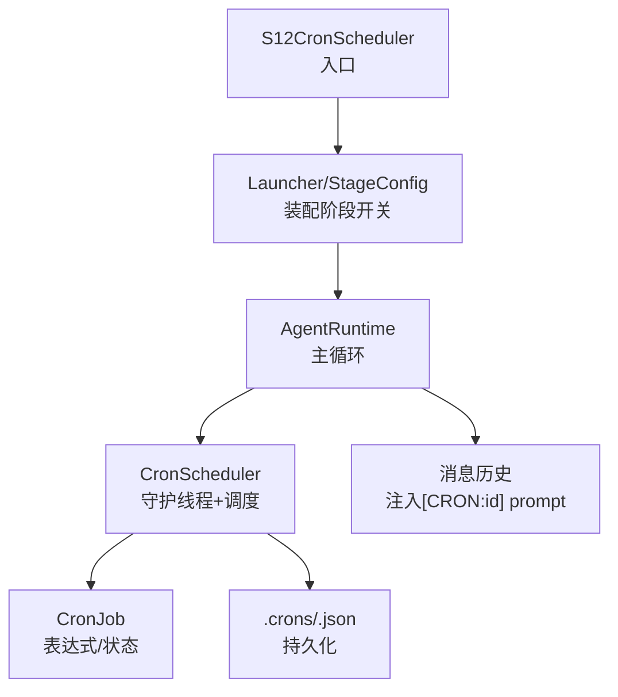
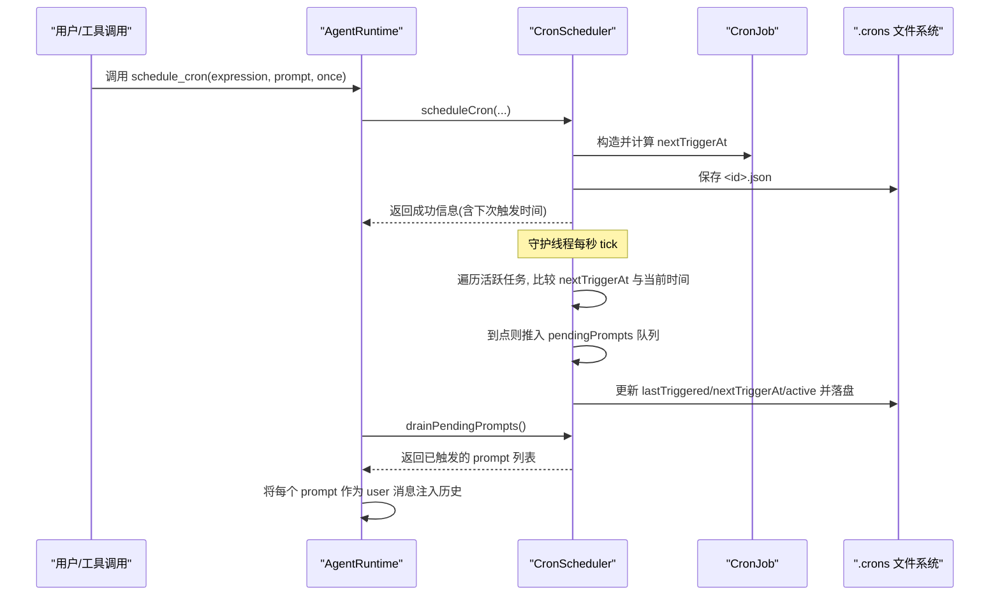
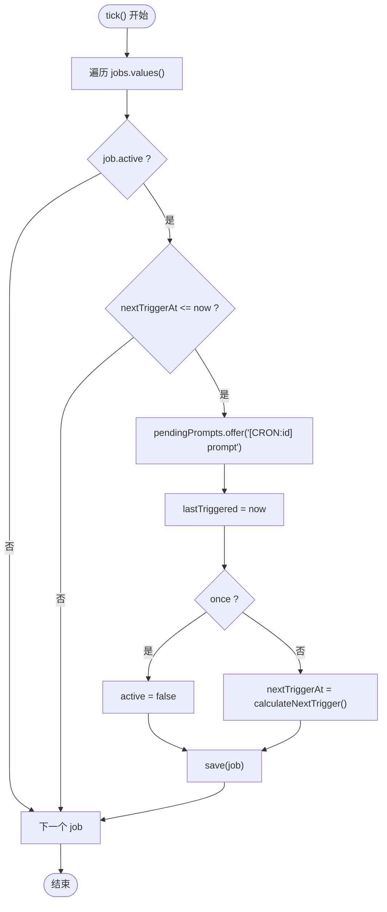
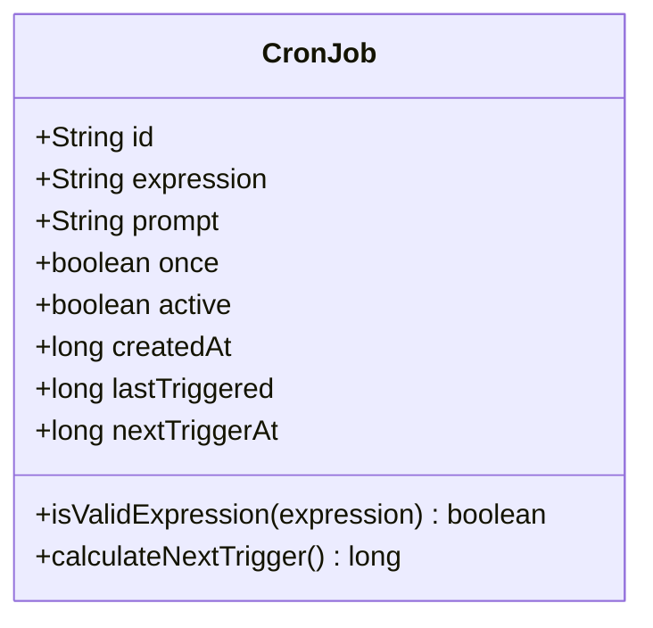
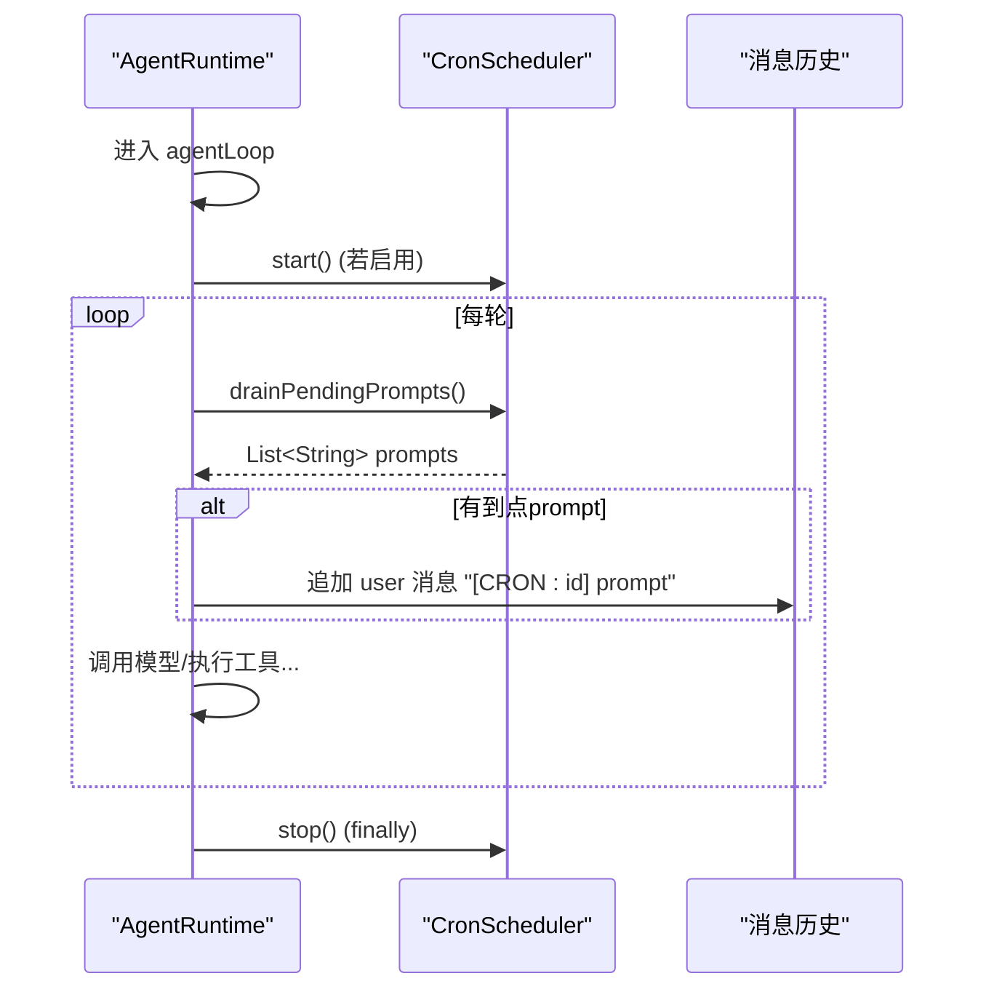
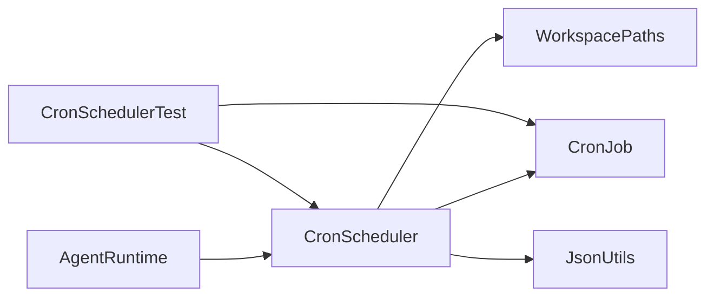

# S12: 定时调度器

<cite>
**本文引用的文件**
- [S12CronScheduler.java](file://src/main/java/com/learnclaudecode/agents/S12CronScheduler.java)
- [CronScheduler.java](file://src/main/java/com/learnclaudecode/scheduler/CronScheduler.java)
- [CronJob.java](file://src/main/java/com/learnclaudecode/model/CronJob.java)
- [AgentRuntime.java](file://src/main/java/com/learnclaudecode/agents/AgentRuntime.java)
- [WorkspacePaths.java](file://src/main/java/com/learnclaudecode/common/WorkspacePaths.java)
- [JsonUtils.java](file://src/main/java/com/learnclaudecode/common/JsonUtils.java)
- [CronSchedulerTest.java](file://src/test/java/com/learnclaudecode/scheduler/CronSchedulerTest.java)
</cite>

## 目录
1. [简介](#简介)
2. [项目结构](#项目结构)
3. [核心组件](#核心组件)
4. [架构总览](#架构总览)
5. [详细组件分析](#详细组件分析)
6. [依赖关系分析](#依赖关系分析)
7. [性能与并发特性](#性能与并发特性)
8. [故障排查指南](#故障排查指南)
9. [结论](#结论)
10. [附录：表达式语法与使用示例](#附录表达式语法与使用示例)

## 简介
本章节聚焦“S12 定时调度器”，它让 Agent 具备“按计划触发、无需人工干预”的能力。通过一个轻量级 cron 机制，Agent 可以在后台守护线程中按周期或定点时间自动将预设 prompt 注入主循环，从而在无人值守时也能持续工作。该能力以“一记录一 JSON 文件”的方式持久化到工作区的 .crons 目录，支持跨重启恢复计划。

## 项目结构
S12 定时调度器由入口类、调度核心、数据模型、运行时集成以及工具类组成：
- 入口类：S12CronScheduler（仅负责装配阶段配置并启动统一 Launcher）
- 调度核心：CronScheduler（任务登记、扫描触发、队列投递、持久化）
- 数据模型：CronJob（表达式解析、下次触发时间计算、状态字段）
- 运行时集成：AgentRuntime（在主循环中消费待处理 prompt）
- 路径与序列化：WorkspacePaths（.crons 目录）、JsonUtils（JSON 读写）
- 测试：CronSchedulerTest（覆盖表达式校验、持久化、触发、队列等）

图表来源
- [S12CronScheduler.java:1-18](file://src/main/java/com/learnclaudecode/agents/S12CronScheduler.java#L1-L18)
- [AgentRuntime.java:171-222](file://src/main/java/com/learnclaudecode/agents/AgentRuntime.java#L171-L222)
- [CronScheduler.java:93-96](file://src/main/java/com/learnclaudecode/scheduler/CronScheduler.java#L93-L96)
- [CronScheduler.java:255-278](file://src/main/java/com/learnclaudecode/scheduler/CronScheduler.java#L255-L278)
- [WorkspacePaths.java:168-170](file://src/main/java/com/learnclaudecode/common/WorkspacePaths.java#L168-L170)

章节来源
- [S12CronScheduler.java:1-18](file://src/main/java/com/learnclaudecode/agents/S12CronScheduler.java#L1-L18)
- [AgentRuntime.java:171-222](file://src/main/java/com/learnclaudecode/agents/AgentRuntime.java#L171-L222)
- [CronScheduler.java:24-38](file://src/main/java/com/learnclaudecode/scheduler/CronScheduler.java#L24-L38)

## 核心组件
- CronScheduler：实现定时任务的登记、列举、取消、守护线程 tick、待处理队列投递与持久化；提供 drainPendingPrompts 供主循环消费。
- CronJob：定义简化 cron 表达式（every_Ns/m/h、at_HH:MM），负责表达式合法性校验与下次触发时间计算。
- WorkspacePaths：提供 .crons 目录路径并确保目录存在。
- JsonUtils：统一的 JSON 序列化/反序列化，用于任务文件的持久化与加载。
- AgentRuntime：在主循环中启动/停止调度器，并将到点产生的 prompt 作为 user 消息注入对话历史。
- S12CronScheduler：极简入口，委托 Launcher 与 StageConfig 完成阶段装配。

章节来源
- [CronScheduler.java:93-96](file://src/main/java/com/learnclaudecode/scheduler/CronScheduler.java#L93-L96)
- [CronJob.java:104-138](file://src/main/java/com/learnclaudecode/model/CronJob.java#L104-L138)
- [WorkspacePaths.java:168-170](file://src/main/java/com/learnclaudecode/common/WorkspacePaths.java#L168-L170)
- [JsonUtils.java:43-49](file://src/main/java/com/learnclaudecode/common/JsonUtils.java#L43-L49)
- [AgentRuntime.java:171-222](file://src/main/java/com/learnclaudecode/agents/AgentRuntime.java#L171-L222)
- [S12CronScheduler.java:13-16](file://src/main/java/com/learnclaudecode/agents/S12CronScheduler.java#L13-L16)

## 架构总览
定时调度器的整体流程如下：
- 启动：AgentRuntime 根据阶段配置决定是否启用 cron；若启用则启动 CronScheduler 的守护线程。
- 登记：通过 schedule_cron 工具创建 CronJob，写入 .crons/<id>.json，并在内存索引中注册。
- 扫描：守护线程每秒 tick，检查活跃任务的 nextTriggerAt 是否已到；若到点则将 "[CRON:id] prompt" 推入阻塞队列。
- 消费：AgentRuntime 每轮循环调用 drainPendingPrompts 取出所有待处理 prompt，并以 user 消息形式注入对话历史。
- 取消/列举：cancel_cron 标记失活并持久化；list_crons 输出可读的任务清单。

图表来源
- [AgentRuntime.java:171-222](file://src/main/java/com/learnclaudecode/agents/AgentRuntime.java#L171-L222)
- [CronScheduler.java:106-125](file://src/main/java/com/learnclaudecode/scheduler/CronScheduler.java#L106-L125)
- [CronScheduler.java:255-278](file://src/main/java/com/learnclaudecode/scheduler/CronScheduler.java#L255-L278)
- [CronJob.java:150-204](file://src/main/java/com/learnclaudecode/model/CronJob.java#L150-L204)

## 详细组件分析

### CronScheduler：调度核心
职责与关键点：
- 初始化时从 .crons 目录加载全部任务，实现“计划跨重启存活”。
- 提供 scheduleCron/listCrons/cancelCron/drainPendingPrompts/start/stop 等接口。
- 守护线程 loop 每秒 tick，tick 内对活跃任务进行到期判断与触发。
- 写操作（schedule/cancel/tick）加 synchronized 互斥；读走 ConcurrentHashMap。
- 触发后一次性任务置为 inactive；重复任务基于“当前时刻”重算下次触发时间，避免进程停摆后的堆积触发。

关键方法说明（路径引用）：
- 构造与加载：[CronScheduler.java:93-96](file://src/main/java/com/learnclaudecode/scheduler/CronScheduler.java#L93-L96)、[CronScheduler.java:305-322](file://src/main/java/com/learnclaudecode/scheduler/CronScheduler.java#L305-L322)
- 登记任务：[CronScheduler.java:106-125](file://src/main/java/com/learnclaudecode/scheduler/CronScheduler.java#L106-L125)
- 列出任务：[CronScheduler.java:132-153](file://src/main/java/com/learnclaudecode/scheduler/CronScheduler.java#L132-L153)
- 取消任务：[CronScheduler.java:161-180](file://src/main/java/com/learnclaudecode/scheduler/CronScheduler.java#L161-L180)
- 消费队列：[CronScheduler.java:190-194](file://src/main/java/com/learnclaudecode/scheduler/CronScheduler.java#L190-L194)
- 守护线程：[CronScheduler.java:202-242](file://src/main/java/com/learnclaudecode/scheduler/CronScheduler.java#L202-L242)
- 单次扫描：[CronScheduler.java:255-278](file://src/main/java/com/learnclaudecode/scheduler/CronScheduler.java#L255-L278)

图表来源
- [CronScheduler.java:255-278](file://src/main/java/com/learnclaudecode/scheduler/CronScheduler.java#L255-L278)

章节来源
- [CronScheduler.java:93-96](file://src/main/java/com/learnclaudecode/scheduler/CronScheduler.java#L93-L96)
- [CronScheduler.java:106-125](file://src/main/java/com/learnclaudecode/scheduler/CronScheduler.java#L106-L125)
- [CronScheduler.java:132-153](file://src/main/java/com/learnclaudecode/scheduler/CronScheduler.java#L132-L153)
- [CronScheduler.java:161-180](file://src/main/java/com/learnclaudecode/scheduler/CronScheduler.java#L161-L180)
- [CronScheduler.java:190-194](file://src/main/java/com/learnclaudecode/scheduler/CronScheduler.java#L190-L194)
- [CronScheduler.java:202-242](file://src/main/java/com/learnclaudecode/scheduler/CronScheduler.java#L202-L242)
- [CronScheduler.java:255-278](file://src/main/java/com/learnclaudecode/scheduler/CronScheduler.java#L255-L278)
- [CronScheduler.java:305-322](file://src/main/java/com/learnclaudecode/scheduler/CronScheduler.java#L305-L322)

### CronJob：表达式与时间计算
职责与关键点：
- 支持简化表达式：every_30s / every_5m / every_1h / at_14:30。
- isValidExpression 集中校验规则，calculateNextTrigger 复用同一套逻辑计算下次触发时间。
- 字段包含 id/expression/prompt/once/active/createdAt/lastTriggered/nextTriggerAt。
- 使用 Jackson 注解忽略未知字段，保证向前兼容。

图表来源
- [CronJob.java:25-64](file://src/main/java/com/learnclaudecode/model/CronJob.java#L25-L64)
- [CronJob.java:104-138](file://src/main/java/com/learnclaudecode/model/CronJob.java#L104-L138)
- [CronJob.java:150-204](file://src/main/java/com/learnclaudecode/model/CronJob.java#L150-L204)

章节来源
- [CronJob.java:25-64](file://src/main/java/com/learnclaudecode/model/CronJob.java#L25-L64)
- [CronJob.java:104-138](file://src/main/java/com/learnclaudecode/model/CronJob.java#L104-L138)
- [CronJob.java:150-204](file://src/main/java/com/learnclaudecode/model/CronJob.java#L150-L204)

### AgentRuntime：与主循环的集成
职责与关键点：
- 在 agentLoop 开始时根据配置启动 CronScheduler（daemon 线程）。
- 每轮循环调用 drainPendingPrompts，将到点 prompt 作为 user 消息注入历史。
- 在 finally 块中确保停止调度器，避免线程泄漏。
- 暴露 schedule_cron/list_crons/cancel_cron 工具映射到 CronScheduler。

图表来源
- [AgentRuntime.java:171-222](file://src/main/java/com/learnclaudecode/agents/AgentRuntime.java#L171-L222)
- [AgentRuntime.java:438-443](file://src/main/java/com/learnclaudecode/agents/AgentRuntime.java#L438-L443)
- [AgentRuntime.java:361-372](file://src/main/java/com/learnclaudecode/agents/AgentRuntime.java#L361-L372)

章节来源
- [AgentRuntime.java:171-222](file://src/main/java/com/learnclaudecode/agents/AgentRuntime.java#L171-L222)
- [AgentRuntime.java:361-372](file://src/main/java/com/learnclaudecode/agents/AgentRuntime.java#L361-L372)
- [AgentRuntime.java:438-443](file://src/main/java/com/learnclaudecode/agents/AgentRuntime.java#L438-L443)

### 入口与装配：S12CronScheduler
- 极薄入口，仅调用 Launcher.launch(StageConfig.s12())，由统一入口装配阶段能力与工具集。
- 具体调度逻辑位于 CronScheduler，避免入口重复初始化。

章节来源
- [S12CronScheduler.java:13-16](file://src/main/java/com/learnclaudecode/agents/S12CronScheduler.java#L13-L16)

## 依赖关系分析
- CronScheduler 依赖：
  - WorkspacePaths：获取 .crons 目录路径
  - JsonUtils：JSON 序列化/反序列化
  - CronJob：表达式校验与时间计算
- AgentRuntime 依赖：
  - CronScheduler：调度与队列
  - 其他模块（压缩、任务、团队、MCP、工作流、目标循环等）通过 StageConfig 选择性装配
- 测试依赖：
  - 使用临时目录隔离 .crons 文件，验证持久化与触发行为

图表来源
- [AgentRuntime.java:17-25](file://src/main/java/com/learnclaudecode/agents/AgentRuntime.java#L17-L25)
- [CronScheduler.java:3-22](file://src/main/java/com/learnclaudecode/scheduler/CronScheduler.java#L3-L22)
- [CronSchedulerTest.java:1-25](file://src/test/java/com/learnclaudecode/scheduler/CronSchedulerTest.java#L1-L25)

章节来源
- [AgentRuntime.java:17-25](file://src/main/java/com/learnclaudecode/agents/AgentRuntime.java#L17-L25)
- [CronScheduler.java:3-22](file://src/main/java/com/learnclaudecode/scheduler/CronScheduler.java#L3-L22)
- [CronSchedulerTest.java:1-25](file://src/test/java/com/learnclaudecode/scheduler/CronSchedulerTest.java#L1-L25)

## 性能与并发特性
- 守护线程间隔：TICK_INTERVAL_MS=1000ms，兼顾精度与 CPU 占用。
- 并发安全：
  - jobs 使用 ConcurrentHashMap 支持并发读。
  - pendingPrompts 使用 LinkedBlockingQueue 保证守护线程写入与主循环读取的可见性与原子性。
  - 写操作（schedule/cancel/tick）加 synchronized 互斥。
- 持久化策略：
  - 每个任务独立 JSON 文件，单条记录损坏不影响其余任务。
  - 目录不可读时优雅降级为空集合，后续仍可创建新任务。
- 触发防抖：
  - 重复任务基于“当前时刻”重算下次触发时间，避免进程停摆后大量补触发。

章节来源
- [CronScheduler.java:41-43](file://src/main/java/com/learnclaudecode/scheduler/CronScheduler.java#L41-L43)
- [CronScheduler.java:61-73](file://src/main/java/com/learnclaudecode/scheduler/CronScheduler.java#L61-L73)
- [CronScheduler.java:255-278](file://src/main/java/com/learnclaudecode/scheduler/CronScheduler.java#L255-L278)
- [CronScheduler.java:305-322](file://src/main/java/com/learnclaudecode/scheduler/CronScheduler.java#L305-L322)

## 故障排查指南
常见问题与定位建议：
- 表达式非法：
  - 现象：scheduleCron 返回错误提示。
  - 原因：未遵循 every_Ns/m/h 或 at_HH:MM 格式。
  - 参考：[CronJob.isValidExpression:104-138](file://src/main/java/com/learnclaudecode/model/CronJob.java#L104-L138)
- 空 prompt：
  - 现象：scheduleCron 拒绝空 prompt。
  - 参考：[CronScheduler.scheduleCron:111-113](file://src/main/java/com/learnclaudecode/scheduler/CronScheduler.java#L111-L113)
- 任务未触发：
  - 检查 nextTriggerAt 是否在未来；确认守护线程已 start；确认任务 active=true。
  - 参考：[CronScheduler.tick:255-278](file://src/main/java/com/learnclaudecode/scheduler/CronScheduler.java#L255-L278)
- 队列无内容：
  - 未到点时 drainPendingPrompts 返回空；属于正常。
  - 参考：[CronScheduler.drainPendingPrompts:190-194](file://src/main/java/com/learnclaudecode/scheduler/CronScheduler.java#L190-L194)
- 持久化失败：
  - 写盘异常会返回错误字符串；可检查工作区权限与磁盘空间。
  - 参考：[CronScheduler.save:296-298](file://src/main/java/com/learnclaudecode/scheduler/CronScheduler.java#L296-L298)
- 线程未停止：
  - 确保 AgentRuntime 退出时调用 stop；测试用例中显式 stop。
  - 参考：[AgentRuntime.agentLoop finally:438-443](file://src/main/java/com/learnclaudecode/agents/AgentRuntime.java#L438-L443)

章节来源
- [CronJob.java:104-138](file://src/main/java/com/learnclaudecode/model/CronJob.java#L104-L138)
- [CronScheduler.java:111-113](file://src/main/java/com/learnclaudecode/scheduler/CronScheduler.java#L111-L113)
- [CronScheduler.java:190-194](file://src/main/java/com/learnclaudecode/scheduler/CronScheduler.java#L190-L194)
- [CronScheduler.java:255-278](file://src/main/java/com/learnclaudecode/scheduler/CronScheduler.java#L255-L278)
- [CronScheduler.java:296-298](file://src/main/java/com/learnclaudecode/scheduler/CronScheduler.java#L296-L298)
- [AgentRuntime.java:438-443](file://src/main/java/com/learnclaudecode/agents/AgentRuntime.java#L438-L443)

## 结论
S12 定时调度器以最小复杂度实现了“按计划触发”的核心能力：通过守护线程周期性扫描、阻塞队列解耦、JSON 文件持久化，使 Agent 能够在无人值守时按周期或定点时间自动行动。其设计强调“错误不外抛、优雅降级”，并通过单元测试覆盖了表达式校验、持久化、触发与队列等关键路径，具备良好的教学价值与工程可用性。

## 附录：表达式语法与使用示例
支持的表达式：
- every_30s：每 30 秒触发一次
- every_5m：每 5 分钟触发一次
- every_1h：每 1 小时触发一次
- at_14:30：每天 14:30 触发一次（若已过当天该时刻则顺延至次日）

使用要点：
- 通过 schedule_cron 工具登记任务，参数包括 expression、prompt、once。
- 通过 list_crons 查看任务清单（活跃优先，按下次触发时间排序）。
- 通过 cancel_cron 取消任务（标记 inactive，保留文件以便审计）。
- 到点触发后，AgentRuntime 会将 "[CRON:id] prompt" 注入对话历史。

章节来源
- [CronJob.java:10-23](file://src/main/java/com/learnclaudecode/model/CronJob.java#L10-L23)
- [CronScheduler.java:106-125](file://src/main/java/com/learnclaudecode/scheduler/CronScheduler.java#L106-L125)
- [CronScheduler.java:132-153](file://src/main/java/com/learnclaudecode/scheduler/CronScheduler.java#L132-L153)
- [CronScheduler.java:161-180](file://src/main/java/com/learnclaudecode/scheduler/CronScheduler.java#L161-L180)
- [AgentRuntime.java:361-372](file://src/main/java/com/learnclaudecode/agents/AgentRuntime.java#L361-L372)