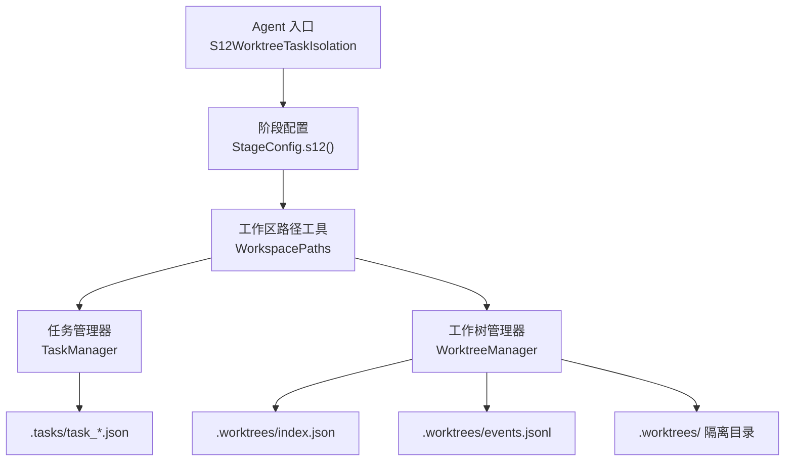
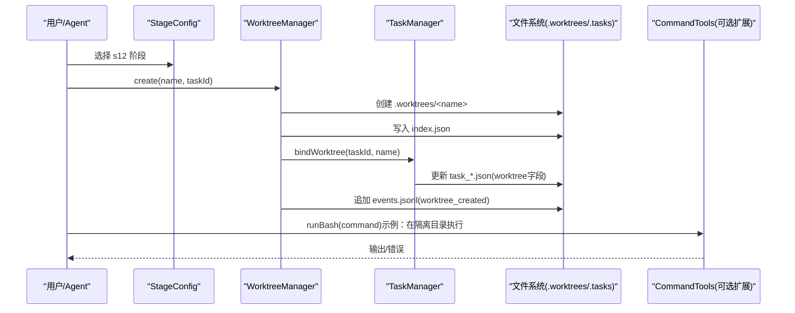
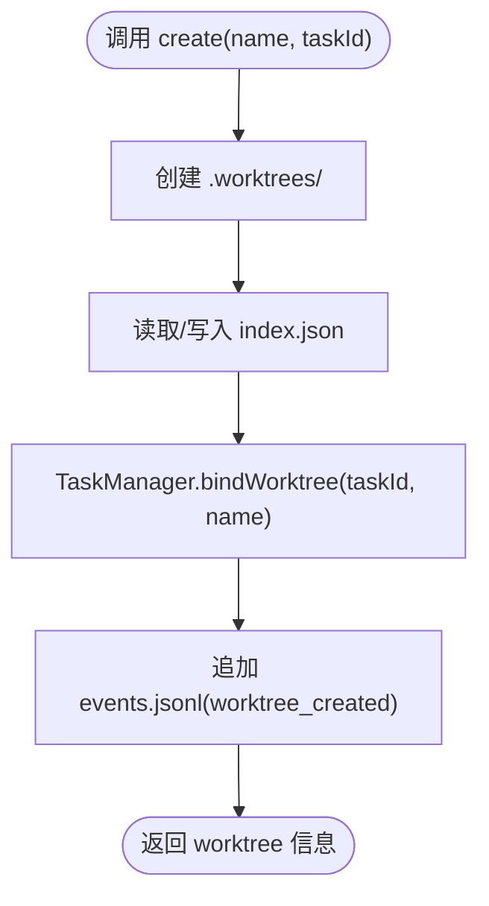
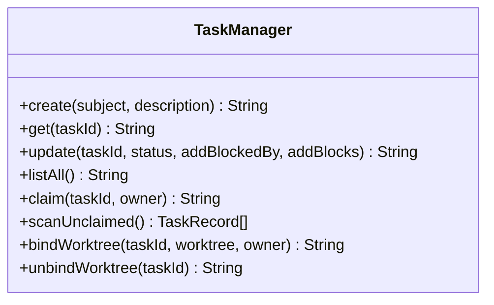
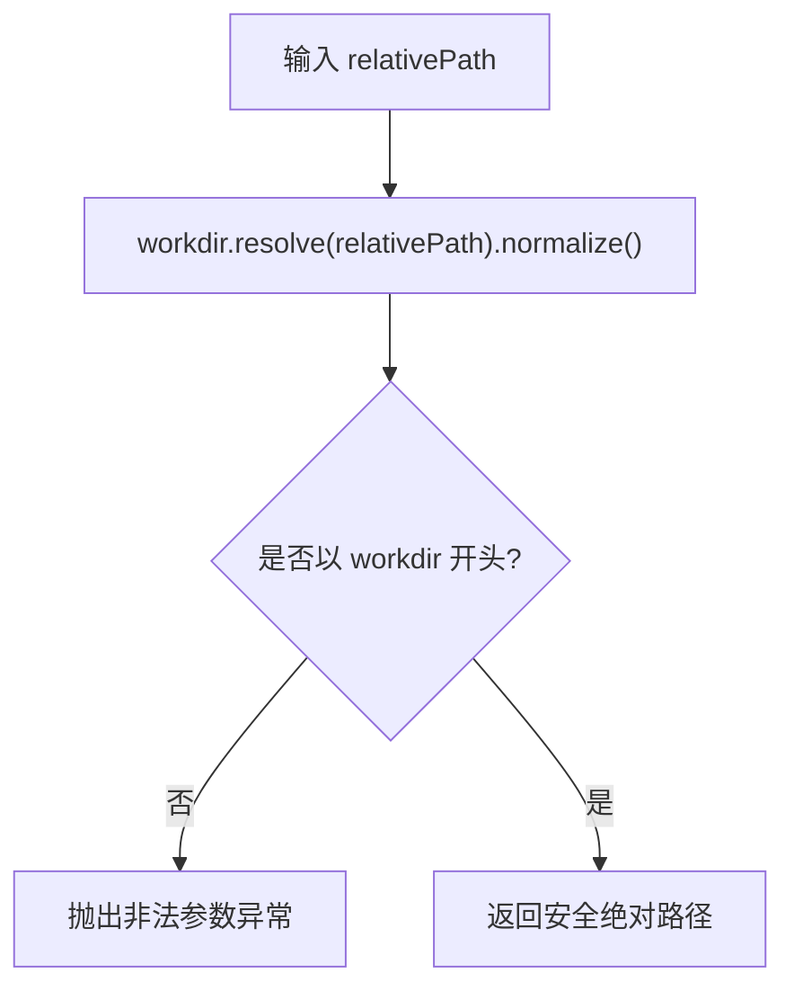
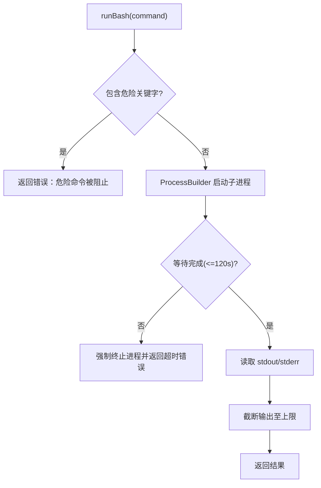
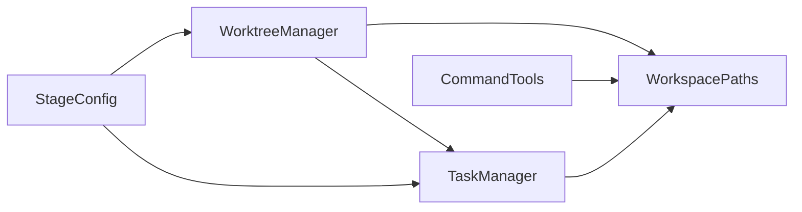

# S12: 工作树隔离

<cite>
**本文引用的文件**
- [S12WorktreeTaskIsolation.java](file://src/main/java/com/learnclaudecode/agents/S12WorktreeTaskIsolation.java)
- [StageConfig.java](file://src/main/java/com/learnclaudecode/agents/StageConfig.java)
- [WorktreeManager.java](file://src/main/java/com/learnclaudecode/tasks/WorktreeManager.java)
- [TaskManager.java](file://src/main/java/com/learnclaudecode/tasks/TaskManager.java)
- [WorkspacePaths.java](file://src/main/java/com/learnclaudecode/common/WorkspacePaths.java)
- [CommandTools.java](file://src/main/java/com/learnclaudecode/tools/CommandTools.java)
- [s12-worktree-task-isolation.tsx](file://web/src/components/visualizations/s12-worktree-task-isolation.tsx)
- [s12.json（场景）](file://web/src/data/scenarios/s12.json)
- [s12.json（注解）](file://web/src/data/annotations/s12.json)
</cite>

## 目录
1. [简介](#简介)
2. [项目结构](#项目结构)
3. [核心组件](#核心组件)
4. [架构总览](#架构总览)
5. [详细组件分析](#详细组件分析)
6. [依赖关系分析](#依赖关系分析)
7. [性能与可扩展性](#性能与可扩展性)
8. [故障排查指南](#故障排查指南)
9. [结论](#结论)
10. [附录：使用示例与最佳实践](#附录使用示例与最佳实践)

## 简介
本章节面向“S12 工作树隔离”能力，围绕 WorktreeManager 的文件系统隔离机制展开，说明如何为每个任务创建独立的隔离工作空间（worktree），并通过任务板进行协调。文档涵盖以下主题：
- 工作树的创建、切换与资源清理流程
- 隔离环境的配置选项（文件系统路径安全、命令执行限制、事件审计）
- 完整的使用示例，展示在受控环境中执行不可信代码的推荐方式
- 隔离级别、性能影响与安全考量
- 容器化部署与云原生集成的建议

注意：当前实现以“独立目录 + 索引 + 事件日志”的方式提供轻量级隔离；未内置网络访问控制或细粒度权限模型，但提供了可扩展的切入点。

## 项目结构
S12 将“协调层”和“执行层”解耦：
- 协调层：共享的任务板位于 .tasks，用于多任务协作与状态管理
- 执行层：每个任务的代码与产物落在 .worktrees/<name> 下的独立目录中
- 元数据与可观测性：.worktrees/index.json 记录 worktree 清单，events.jsonl 记录生命周期事件

图示来源
- [S12WorktreeTaskIsolation.java:1-12](file://src/main/java/com/learnclaudecode/agents/S12WorktreeTaskIsolation.java#L1-L12)
- [StageConfig.java:230-244](file://src/main/java/com/learnclaudecode/agents/StageConfig.java#L230-L244)
- [WorkspacePaths.java:138-148](file://src/main/java/com/learnclaudecode/common/WorkspacePaths.java#L138-L148)
- [WorktreeManager.java:39-58](file://src/main/java/com/learnclaudecode/tasks/WorktreeManager.java#L39-L58)
- [TaskManager.java:35-42](file://src/main/java/com/learnclaudecode/tasks/TaskManager.java#L35-L42)

章节来源
- [S12WorktreeTaskIsolation.java:1-12](file://src/main/java/com/learnclaudecode/agents/S12WorktreeTaskIsolation.java#L1-L12)
- [StageConfig.java:230-244](file://src/main/java/com/learnclaudecode/agents/StageConfig.java#L230-L244)
- [WorkspacePaths.java:1-150](file://src/main/java/com/learnclaudecode/common/WorkspacePaths.java#L1-L150)
- [WorktreeManager.java:1-245](file://src/main/java/com/learnclaudecode/tasks/WorktreeManager.java#L1-L245)
- [TaskManager.java:1-338](file://src/main/java/com/learnclaudecode/tasks/TaskManager.java#L1-L338)

## 核心组件
- WorktreeManager：负责 worktree 的生命周期（创建、列出、移除）、索引持久化、事件追加以及与 TaskManager 的绑定/解绑
- TaskManager：维护任务状态、依赖关系以及 worktree 绑定字段，支持任务认领、完成、删除等
- WorkspacePaths：统一工作区路径解析与安全校验，确保所有路径操作不逃逸工作区根目录
- CommandTools：提供受限的命令执行能力（黑名单拦截、超时控制、输出长度限制），作为后续扩展 worktree_run 的基础
- StageConfig：定义 s12 阶段的可用工具集合（worktree_create/list/remove/events）
- 可视化与场景：前端可视化演示隔离前后状态变化；场景与注解描述设计决策与约束

章节来源
- [WorktreeManager.java:16-245](file://src/main/java/com/learnclaudecode/tasks/WorktreeManager.java#L16-L245)
- [TaskManager.java:17-338](file://src/main/java/com/learnclaudecode/tasks/TaskManager.java#L17-L338)
- [WorkspacePaths.java:8-150](file://src/main/java/com/learnclaudecode/common/WorkspacePaths.java#L8-L150)
- [CommandTools.java:13-146](file://src/main/java/com/learnclaudecode/tools/CommandTools.java#L13-L146)
- [StageConfig.java:230-244](file://src/main/java/com/learnclaudecode/agents/StageConfig.java#L230-L244)
- [s12.json（场景）:1-52](file://web/src/data/scenarios/s12.json#L1-L52)
- [s12.json（注解）:1-90](file://web/src/data/annotations/s12.json#L1-L90)

## 架构总览
S12 的核心思想是“共享协调 + 隔离执行”。任务板集中记录全局可见的状态，而实际代码编辑与命令执行被路由到各自的工作树目录，避免并发冲突与上下文污染。

图示来源
- [StageConfig.java:230-244](file://src/main/java/com/learnclaudecode/agents/StageConfig.java#L230-L244)
- [WorktreeManager.java:71-98](file://src/main/java/com/learnclaudecode/tasks/WorktreeManager.java#L71-L98)
- [TaskManager.java:215-234](file://src/main/java/com/learnclaudecode/tasks/TaskManager.java#L215-L234)
- [CommandTools.java:36-65](file://src/main/java/com/learnclaudecode/tools/CommandTools.java#L36-L65)

## 详细组件分析

### WorktreeManager：工作树生命周期与索引
- 初始化：确保 .worktrees 存在，并准备 index.json 与 events.jsonl
- 创建：创建隔离目录，写入索引项（name/path/branch/task_id/status），绑定任务，追加创建事件
- 列出：读取 index.json 返回 worktree 列表
- 移除：可选择保留或删除物理目录，从索引删除，解绑任务，追加移除事件
- 事件：追加式 JSONL 事件流，便于审计与回放

图示来源
- [WorktreeManager.java:71-98](file://src/main/java/com/learnclaudecode/tasks/WorktreeManager.java#L71-L98)
- [WorktreeManager.java:228-243](file://src/main/java/com/learnclaudecode/tasks/WorktreeManager.java#L228-L243)

章节来源
- [WorktreeManager.java:39-245](file://src/main/java/com/learnclaudecode/tasks/WorktreeManager.java#L39-L245)

### TaskManager：任务绑定与状态流转
- 绑定 worktree：将 worktree 名称写入任务记录，若任务处于 pending 则推进为 in_progress
- 解绑 worktree：清空 worktree 字段并更新时间戳
- 列表视图：显示任务状态、阻塞关系与 worktree 绑定情况

图示来源
- [TaskManager.java:51-234](file://src/main/java/com/learnclaudecode/tasks/TaskManager.java#L51-L234)

章节来源
- [TaskManager.java:17-338](file://src/main/java/com/learnclaudecode/tasks/TaskManager.java#L17-L338)

### WorkspacePaths：路径安全与工作区边界
- safeResolve：规范化相对路径并校验是否逃逸工作区根目录
- 专用目录：tasksDir、teamDir、skillsDir、transcriptDir、worktreesDir
- 读写封装：readText/writeText 基于 safeResolve，保证只在工作区内操作

图示来源
- [WorkspacePaths.java:42-49](file://src/main/java/com/learnclaudecode/common/WorkspacePaths.java#L42-L49)

章节来源
- [WorkspacePaths.java:8-150](file://src/main/java/com/learnclaudecode/common/WorkspacePaths.java#L8-L150)

### CommandTools：命令执行的安全基线
- 黑名单拦截：阻止危险命令
- 超时控制：默认 120 秒超时
- 输出限制：最大输出长度限制，防止上下文爆炸
- 平台适配：Windows 使用 powershell，其他平台使用 bash -lc

图示来源
- [CommandTools.java:36-65](file://src/main/java/com/learnclaudecode/tools/CommandTools.java#L36-L65)
- [CommandTools.java:73-78](file://src/main/java/com/learnclaudecode/tools/CommandTools.java#L73-L78)

章节来源
- [CommandTools.java:13-146](file://src/main/java/com/learnclaudecode/tools/CommandTools.java#L13-L146)

### 前端可视化与场景说明
- 步骤动画：展示“单工作区痛点 -> 分配车道 -> 并行执行 -> 收尾”的过程
- 三栏视图：任务板、worktree 索引、执行车道
- 场景与注解：明确设计决策（共享任务板 + 隔离执行通道、显式生命周期索引、追加式事件流、关闭策略等）

章节来源
- [s12-worktree-task-isolation.tsx:38-143](file://web/src/components/visualizations/s12-worktree-task-isolation.tsx#L38-L143)
- [s12.json（场景）:1-52](file://web/src/data/scenarios/s12.json#L1-L52)
- [s12.json（注解）:1-90](file://web/src/data/annotations/s12.json#L1-L90)

## 依赖关系分析
- WorktreeManager 依赖 WorkspacePaths（路径）与 TaskManager（任务绑定）
- TaskManager 依赖 WorkspacePaths（任务目录）与 JsonUtils（序列化）
- StageConfig 聚合工具定义，暴露给 Agent 使用
- CommandTools 依赖 WorkspacePaths 限定执行目录

图示来源
- [StageConfig.java:230-244](file://src/main/java/com/learnclaudecode/agents/StageConfig.java#L230-L244)
- [WorktreeManager.java:24-28](file://src/main/java/com/learnclaudecode/tasks/WorktreeManager.java#L24-L28)
- [TaskManager.java:27-36](file://src/main/java/com/learnclaudecode/tasks/TaskManager.java#L27-L36)
- [CommandTools.java:16-28](file://src/main/java/com/learnclaudecode/tools/CommandTools.java#L16-L28)

章节来源
- [StageConfig.java:230-244](file://src/main/java/com/learnclaudecode/agents/StageConfig.java#L230-L244)
- [WorktreeManager.java:24-28](file://src/main/java/com/learnclaudecode/tasks/WorktreeManager.java#L24-L28)
- [TaskManager.java:27-36](file://src/main/java/com/learnclaudecode/tasks/TaskManager.java#L27-L36)
- [CommandTools.java:16-28](file://src/main/java/com/learnclaudecode/tools/CommandTools.java#L16-L28)

## 性能与可扩展性
- 索引与事件文件均为小文件读写，适合频繁增删改；在高并发下需注意文件锁与顺序写
- 事件追加采用行级追加，读最近 N 条时做切片，避免全量加载
- 任务列表扫描按文件名过滤，简单高效；随着任务数量增长可考虑引入轻量索引
- 可扩展点：
  - 在 WorktreeManager 中增加 worktree_run 方法，结合 CommandTools 实现“按车道 cwd 路由”的命令执行
  - 在 CommandTools 中增强沙箱能力（白名单命令、资源配额、网络隔离）
  - 在 WorkspacePaths 中增加更严格的权限检查（如仅允许读写 .worktrees 与 .tasks）

[本节为通用指导，无需特定文件引用]

## 故障排查指南
- 无法创建 worktree：检查 .worktrees 目录是否存在及是否有写权限；查看 WorktreeManager.create 的异常处理
- 任务未绑定 worktree：确认 TaskManager.bindWorktree 是否成功，检查 task_*.json 中的 worktree 字段
- 事件缺失：确认 events.jsonl 是否被正确创建与追加；检查 emit 的 IO 异常分支
- 命令执行失败：检查 CommandTools.runBash 的黑名单与超时逻辑；确认工作区路径是否正确设置

章节来源
- [WorktreeManager.java:71-98](file://src/main/java/com/learnclaudecode/tasks/WorktreeManager.java#L71-L98)
- [WorktreeManager.java:228-243](file://src/main/java/com/learnclaudecode/tasks/WorktreeManager.java#L228-L243)
- [TaskManager.java:215-234](file://src/main/java/com/learnclaudecode/tasks/TaskManager.java#L215-L234)
- [CommandTools.java:36-65](file://src/main/java/com/learnclaudecode/tools/CommandTools.java#L36-L65)

## 结论
S12 通过“共享任务板 + 隔离执行车道”的设计，实现了在多任务并行时的文件与上下文隔离。WorktreeManager 提供轻量级的目录隔离、索引与事件追踪；TaskManager 提供任务状态与绑定关系；WorkspacePaths 保障路径安全；CommandTools 提供基础命令执行保护。该方案易于理解与扩展，适合作为教学与生产环境的基础隔离层。

[本节为总结，无需特定文件引用]

## 附录：使用示例与最佳实践

### 典型使用流程
- 创建任务：通过任务管理器创建多个任务
- 分配车道：为每个任务创建 worktree 并绑定
- 执行命令：在隔离目录下执行测试或构建命令（可通过扩展 worktree_run）
- 收尾清理：选择性保留或移除 worktree，并标记任务完成

章节来源
- [s12.json（场景）:1-52](file://web/src/data/scenarios/s12.json#L1-L52)
- [s12-worktree-task-isolation.tsx:38-143](file://web/src/components/visualizations/s12-worktree-task-isolation.tsx#L38-L143)

### 隔离级别的配置建议
- 文件系统权限：
  - 使用 WorkspacePaths.safeResolve 限制所有文件访问于工作区根目录
  - 对 .worktrees 与 .tasks 目录设置最小必要权限
- 环境变量隔离：
  - 在扩展 worktree_run 时，为子进程注入受限的环境变量（例如禁用敏感变量）
- 网络访问控制：
  - 在容器或云原生环境中，通过网络策略限制出站流量
  - 在命令执行前进行白名单校验，禁止 curl/wget 等网络工具

[本节为通用指导，无需特定文件引用]

### 容器化与云原生集成最佳实践
- 容器镜像：
  - 将工作区挂载为卷，确保 .worktrees 与 .tasks 持久化
  - 限制容器资源（CPU/内存）与文件系统只读（除工作区外）
- 编排：
  - 使用命名空间与 PodSecurityPolicy/PSA 限制特权操作
  - 通过 Sidecar 收集 events.jsonl 进行审计与告警
- 可观测性：
  - 将 events.jsonl 接入日志系统，监控 worktree 生命周期
  - 对长时间运行的命令设置超时与熔断

[本节为通用指导，无需特定文件引用]