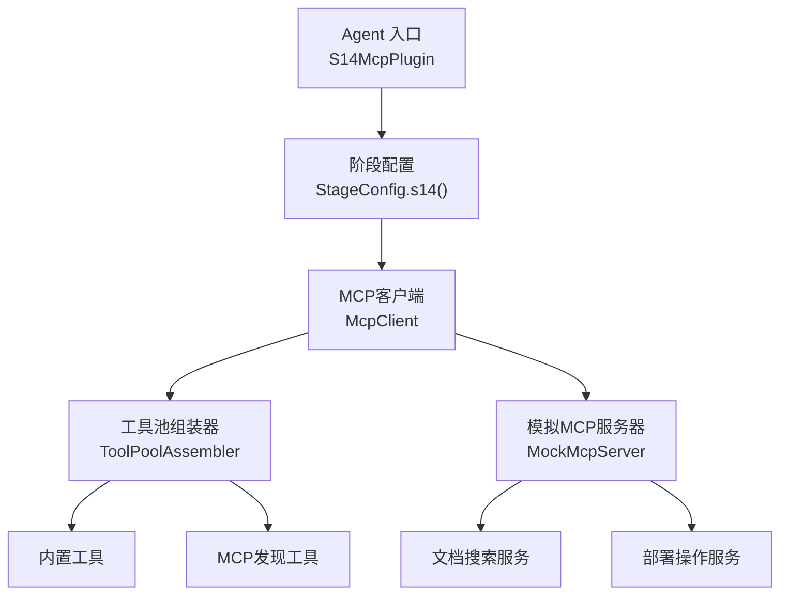
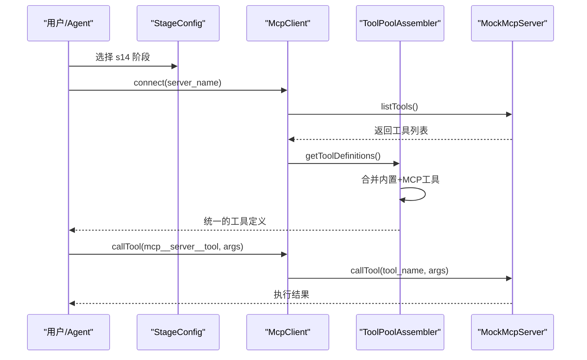
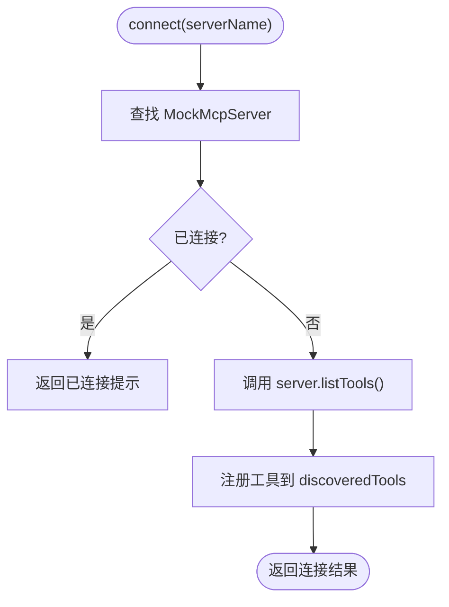
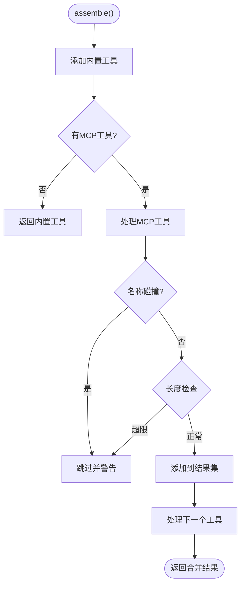
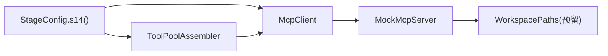

# S12: 工作树隔离（已迁移至S14 MCP插件系统）

<cite>
**本文引用的文件**
- [S14McpPlugin.java](file://src/main/java/com/learnclaudecode/agents/S14McpPlugin.java)
- [StageConfig.java](file://src/main/java/com/learnclaudecode/agents/StageConfig.java)
- [WorktreeManager.java](file://src/main/java/com/learnclaudecode/tasks/WorktreeManager.java)
- [TaskManager.java](file://src/main/java/com/learnclaudecode/tasks/TaskManager.java)
- [WorkspacePaths.java](file://src/main/java/com/learnclaudecode/common/WorkspacePaths.java)
- [CommandTools.java](file://src/main/java/com/learnclaudecode/tools/CommandTools.java)
- [McpClient.java](file://src/main/java/com/learnclaudecode/mcp/McpClient.java)
- [ToolPoolAssembler.java](file://src/main/java/com/learnclaudecode/mcp/ToolPoolAssembler.java)
- [MockMcpServer.java](file://src/main/java/com/learnclaudecode/mcp/MockMcpServer.java)
- [s12-worktree-task-isolation.tsx](file://web/src/components/visualizations/s12-worktree-task-isolation.tsx)
- [s12.json（场景）](file://web/src/data/scenarios/s12.json)
- [s12.json（注解）](file://web/src/data/annotations/s12.json)
</cite>

## 更新摘要
**变更内容**
- 原S12工作树隔离功能已迁移至新的S14 MCP插件系统架构
- 更新了文档以反映当前实现状态，说明功能迁移路径
- 保留了原有工作树隔离的核心概念和实现细节作为参考
- 新增了MCP集成系统的架构说明和使用方式

## 目录
1. [简介](#简介)
2. [项目结构](#项目结构)
3. [核心组件](#核心组件)
4. [架构总览](#架构总览)
5. [详细组件分析](#详细组件分析)
6. [依赖关系分析](#依赖关系分析)
7. [性能与可扩展性](#性能与可扩展性)
8. [故障排查指南](#故障排查指南)
9. [结论](#结论)
10. [附录：使用示例与最佳实践](#附录使用示例与最佳实践)

## 简介
本章节记录了从S12工作树隔离功能到S14 MCP插件系统的迁移过程。原S12的工作树隔离机制已被重构为更灵活的MCP（Model Context Protocol）集成系统，该新架构通过动态工具发现和外部能力扩展，实现了比传统工作树隔离更强大的功能。

**重要变更**：S12工作树隔离功能已不再作为独立阶段存在，其核心概念和能力已整合到新的S14 MCP插件系统中。

## 项目结构
当前的S14 MCP插件系统采用了全新的架构设计：

**图示来源**
- [S14McpPlugin.java:17-20](file://src/main/java/com/learnclaudecode/agents/S14McpPlugin.java#L17-L20)
- [StageConfig.java:573-586](file://src/main/java/com/learnclaudecode/agents/StageConfig.java#L573-L586)
- [McpClient.java:24-42](file://src/main/java/com/learnclaudecode/mcp/McpClient.java#L24-L42)
- [ToolPoolAssembler.java:25-45](file://src/main/java/com/learnclaudecode/mcp/ToolPoolAssembler.java#L25-L45)
- [MockMcpServer.java:14-25](file://src/main/java/com/learnclaudecode/mcp/MockMcpServer.java#L14-L25)

**章节来源**
- [S14McpPlugin.java:1-22](file://src/main/java/com/learnclaudecode/agents/S14McpPlugin.java#L1-L22)
- [StageConfig.java:573-586](file://src/main/java/com/learnclaudecode/agents/StageConfig.java#L573-L586)

## 核心组件
- **S14McpPlugin**：MCP插件系统的启动入口，演示如何通过MCP协议动态发现和调用外部工具
- **McpClient**：负责连接MCP服务器、发现工具并代理调用的核心客户端
- **ToolPoolAssembler**：将内置工具与MCP发现的工具合并为统一工具池的组装器
- **MockMcpServer**：模拟MCP服务器的基类，提供教学演示用的文档搜索和部署操作能力
- **StageConfig.s14()**：定义s14阶段的配置，启用MCP功能和相关权限控制

**章节来源**
- [S14McpPlugin.java:17-20](file://src/main/java/com/learnclaudecode/agents/S14McpPlugin.java#L17-L20)
- [McpClient.java:24-42](file://src/main/java/com/learnclaudecode/mcp/McpClient.java#L24-L42)
- [ToolPoolAssembler.java:25-45](file://src/main/java/com/learnclaudecode/mcp/ToolPoolAssembler.java#L25-L45)
- [MockMcpServer.java:14-25](file://src/main/java/com/learnclaudecode/mcp/MockMcpServer.java#L14-L25)
- [StageConfig.java:573-586](file://src/main/java/com/learnclaudecode/agents/StageConfig.java#L573-L586)

## 架构总览
S14 MCP插件系统采用"动态扩展 + 命名空间隔离"的设计思想，替代了传统的静态工作树隔离方案：

**图示来源**
- [StageConfig.java:573-586](file://src/main/java/com/learnclaudecode/agents/StageConfig.java#L573-L586)
- [McpClient.java:58-91](file://src/main/java/com/learnclaudecode/mcp/McpClient.java#L58-L91)
- [ToolPoolAssembler.java:60-104](file://src/main/java/com/learnclaudecode/mcp/ToolPoolAssembler.java#L60-L104)
- [MockMcpServer.java:94-103](file://src/main/java/com/learnclaudecode/mcp/MockMcpServer.java#L94-L103)

## 详细组件分析

### McpClient：MCP客户端核心
- **连接管理**：维护已连接的MCP服务器实例映射，支持幂等连接
- **工具发现**：自动调用server.listTools()获取工具清单，生成命名空间名称
- **工具调用**：根据命名空间解析路由到对应server执行
- **工具定义**：返回Anthropic API兼容的工具定义供工具池组装

**图示来源**
- [McpClient.java:58-91](file://src/main/java/com/learnclaudecode/mcp/McpClient.java#L58-L91)

**章节来源**
- [McpClient.java:24-226](file://src/main/java/com/learnclaudecode/mcp/McpClient.java#L24-L226)

### ToolPoolAssembler：工具池组装器
- **内置优先**：同名时内置工具胜出，MCP工具被跳过并输出警告
- **名称规范**：工具名长度限制64字符（Anthropic API约束），超长会被截断
- **碰撞检测**：名称规范化后再做碰撞检测，避免大小写或特殊字符冲突

**图示来源**
- [ToolPoolAssembler.java:60-104](file://src/main/java/com/learnclaudecode/mcp/ToolPoolAssembler.java#L60-L104)

**章节来源**
- [ToolPoolAssembler.java:25-144](file://src/main/java/com/learnclaudecode/mcp/ToolPoolAssembler.java#L25-L144)

### MockMcpServer：模拟MCP服务器
- **文档搜索服务**：提供文档检索和版本查询能力
- **部署操作服务**：模拟部署触发和状态查询功能
- **工具注册**：通过ToolInfo记录工具的元数据和输入Schema

**章节来源**
- [MockMcpServer.java:14-219](file://src/main/java/com/learnclaudecode/mcp/MockMcpServer.java#L14-L219)

### StageConfig.s14()：阶段配置
- **基础能力**：继承自s04，包含权限系统和Hook机制
- **MCP启用**：通过enableMcp(true)启用MCP功能
- **工具扩展**：添加connect_mcp工具用于连接外部MCP服务器

**章节来源**
- [StageConfig.java:573-586](file://src/main/java/com/learnclaudecode/agents/StageConfig.java#L573-L586)

## 依赖关系分析
新的S14架构形成了清晰的依赖层次：

**图示来源**
- [StageConfig.java:573-586](file://src/main/java/com/learnclaudecode/agents/StageConfig.java#L573-L586)
- [McpClient.java:24-42](file://src/main/java/com/learnclaudecode/mcp/McpClient.java#L24-L42)
- [ToolPoolAssembler.java:25-45](file://src/main/java/com/learnclaudecode/mcp/ToolPoolAssembler.java#L25-L45)
- [MockMcpServer.java:14-25](file://src/main/java/com/learnclaudecode/mcp/MockMcpServer.java#L14-L25)

**章节来源**
- [StageConfig.java:573-586](file://src/main/java/com/learnclaudecode/agents/StageConfig.java#L573-L586)
- [McpClient.java:24-42](file://src/main/java/com/learnclaudecode/mcp/McpClient.java#L24-L42)
- [ToolPoolAssembler.java:25-45](file://src/main/java/com/learnclaudecode/mcp/ToolPoolAssembler.java#L25-L45)
- [MockMcpServer.java:14-25](file://src/main/java/com/learnclaudecode/mcp/MockMcpServer.java#L14-L25)

## 性能与可扩展性
- **动态发现**：MCP工具在运行时动态发现，无需重新编译即可扩展能力
- **命名空间隔离**：通过mcp__{server}__{tool}格式避免工具名冲突
- **内存效率**：工具定义按需加载，避免不必要的资源占用
- **可扩展点**：
  - 支持更多类型的MCP服务器实现
  - 增强工具发现和安全验证机制
  - 添加工具调用缓存和性能监控

## 故障排查指南
- **连接失败**：检查MCP服务器名称是否正确，确认服务器已在注册表中注册
- **工具未找到**：确认已通过connect_mcp连接服务器，检查工具命名空间是否正确
- **工具冲突**：查看警告信息，了解哪些MCP工具因与内置工具冲突而被跳过
- **名称过长**：确保工具名不超过64个字符，必要时进行名称简化

## 结论
S14 MCP插件系统成功替代了原有的S12工作树隔离功能，提供了更灵活、更强大的外部能力扩展机制。通过动态工具发现和命名空间隔离，该系统不仅保持了原有的隔离安全性，还实现了真正的运行时能力扩展。这种架构设计使得Agent能够无缝集成各种外部服务和工具，为构建复杂的AI Agent生态系统奠定了坚实基础。

## 附录：使用示例与最佳实践

### MCP插件系统使用流程
1. **启动S14阶段**：通过S14McpPlugin.main()启动MCP插件系统
2. **连接MCP服务器**：使用connect_mcp工具连接可用的MCP服务器
3. **发现工具**：系统自动发现并注册MCP服务器提供的工具
4. **调用工具**：通过命名空间格式调用具体的MCP工具
5. **管理连接**：使用list_connected查看已连接的服务器和工具

### 安全最佳实践
- **权限控制**：利用权限系统管控MCP工具的访问权限
- **工具白名单**：在生产环境中配置允许使用的MCP服务器列表
- **网络隔离**：在容器化部署中限制MCP服务器的网络访问
- **审计日志**：记录所有MCP工具调用以便安全审计

### 容器化部署建议
- **镜像构建**：将MCP服务器作为Sidecar容器部署
- **配置管理**：通过环境变量配置MCP服务器连接信息
- **资源限制**：为MCP相关组件设置合理的CPU和内存限制
- **健康检查**：实现MCP服务器的健康检查和自动重启机制

**章节来源**
- [S14McpPlugin.java:17-20](file://src/main/java/com/learnclaudecode/agents/S14McpPlugin.java#L17-L20)
- [StageConfig.java:573-586](file://src/main/java/com/learnclaudecode/agents/StageConfig.java#L573-L586)
- [McpClient.java:145-168](file://src/main/java/com/learnclaudecode/mcp/McpClient.java#L145-L168)