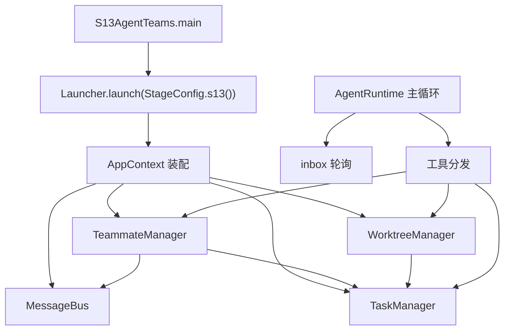
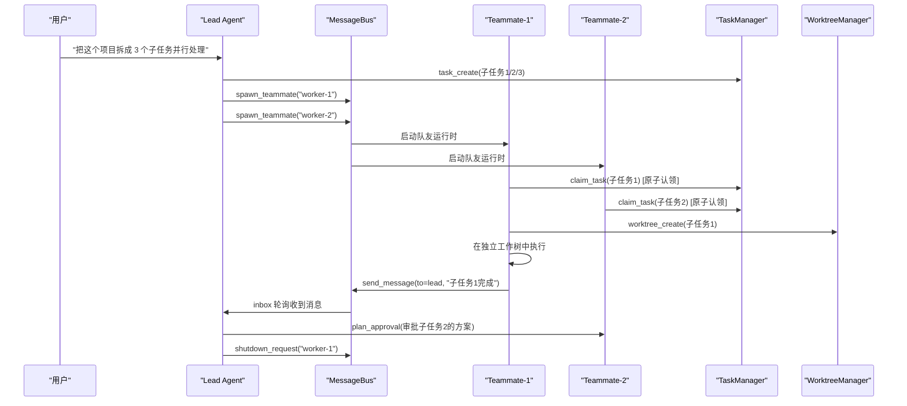

# S13: 多 Agent 协作

<cite>
**本文引用的文件**
- [TeammateManager.java](file://src/main/java/com/learnclaudecode/team/TeammateManager.java)
- [MessageBus.java](file://src/main/java/com/learnclaudecode/team/MessageBus.java)
- [WorktreeManager.java](file://src/main/java/com/learnclaudecode/tasks/WorktreeManager.java)
- [TaskManager.java](file://src/main/java/com/learnclaudecode/tasks/TaskManager.java)
- [StageConfig.java](file://src/main/java/com/learnclaudecode/agents/StageConfig.java)
- [S13AgentTeams.java](file://src/main/java/com/learnclaudecode/agents/S13AgentTeams.java)
- [AgentRuntime.java](file://src/main/java/com/learnclaudecode/agents/AgentRuntime.java)
- [TeamMessage.java](file://src/main/java/com/learnclaudecode/model/TeamMessage.java)
</cite>

## 目录
1. [简介](#简介)
2. [教学目标](#教学目标)
3. [合并说明](#合并说明)
4. [项目结构](#项目结构)
5. [核心组件](#核心组件)
6. [架构总览](#架构总览)
7. [详细组件分析](#详细组件分析)
8. [工具列表](#工具列表)
9. [与前后阶段的关系](#与前后阶段的关系)
10. [故障排查指南](#故障排查指南)
11. [结论](#结论)

## 简介

> **座右铭："一个人的极限——让队友分担工作"**

前面 12 个阶段中，Agent 始终是"一个人"在战斗：即使有子代理（S06），那也只是临时的、一次性的分治。当任务足够复杂——需要多人并行、需要持久协作、需要隔离工作区——单个 Agent 就不够用了。

S13 是**多 Agent 协作**的完整阶段，合并了原来分散在四个阶段中的团队能力：
- 原 S09：Agent Teams（消息总线 + 队友 spawn）
- 原 S10：Team Protocols（shutdown + plan approval）
- 原 S11：Autonomous Agents（自治认领 + idle 循环）
- 原 S12：Worktree Isolation（任务级目录隔离）

本阶段的核心问题是：**如何让多个 Agent 像一个团队一样协作——有分工、有通信、有治理、有隔离？**

## 教学目标

完成本阶段学习后，你应当能够：

- 理解 Lead + Teammates 的角色模型
- 掌握文件型消息总线（MessageBus）的通信机制
- 理解类型化控制消息（shutdown_request / plan_approval）的协议设计
- 掌握原子认领（claim_task）如何避免多队友抢占同一任务
- 理解 Worktree 隔离如何为每个任务提供独立工作目录
- 了解自治队友的 idle → scan → claim → work → idle 循环
- 能够解释 Plan gate 如何确保队友在重大决策前获得 Lead 审批

## 合并说明

本阶段将原来四个渐进式阶段合并为一个完整的"多 Agent 协作"运行时：

| 原阶段 | 能力 | 合并后位置 |
|--------|------|-----------|
| S09 Agent Teams | spawn_teammate, send_message, read_inbox, broadcast | 基础通信层 |
| S10 Team Protocols | shutdown_request, plan_approval | 治理协议层 |
| S11 Autonomous Agents | claim_task, idle, autonomousTeammates | 自治执行层 |
| S12 Worktree Isolation | worktree_create/list/remove/events | 工作区隔离层 |

合并的理由：这四个能力在实际使用中是**不可分割的整体**——你不可能只要通信不要治理，也不可能只要自治不要隔离。将它们合并为一个阶段，更能体现"多 Agent 协作"的完整面貌。

## 项目结构



**图表来源**
- [S13AgentTeams.java](file://src/main/java/com/learnclaudecode/agents/S13AgentTeams.java)
- [AppContext.java](file://src/main/java/com/learnclaudecode/agents/AppContext.java)

**章节来源**
- [S13AgentTeams.java](file://src/main/java/com/learnclaudecode/agents/S13AgentTeams.java)
- [StageConfig.java](file://src/main/java/com/learnclaudecode/agents/StageConfig.java)

## 核心组件

- **TeammateManager**：队友生命周期管理器，负责 spawn、消息收发、shutdown 协议、plan approval、自治认领
- **MessageBus**：文件型消息总线，通过 `.team/inbox/` 目录下的 JSONL 文件实现代理间通信
- **WorktreeManager**：工作树管理器，为每个任务创建独立目录，记录生命周期事件
- **TaskManager**：任务板（S10 引入），提供 claim_task 的原子认领能力
- **TeamMessage**：消息数据模型，包含 from、to、type、content、timestamp

**章节来源**
- [TeammateManager.java](file://src/main/java/com/learnclaudecode/team/TeammateManager.java)
- [MessageBus.java](file://src/main/java/com/learnclaudecode/team/MessageBus.java)
- [WorktreeManager.java](file://src/main/java/com/learnclaudecode/tasks/WorktreeManager.java)

## 架构总览

多 Agent 协作的完整交互流程：



**图表来源**
- [TeammateManager.java](file://src/main/java/com/learnclaudecode/team/TeammateManager.java)
- [MessageBus.java](file://src/main/java/com/learnclaudecode/team/MessageBus.java)
- [TaskManager.java](file://src/main/java/com/learnclaudecode/tasks/TaskManager.java)

## 详细组件分析

### MessageBus：文件型消息总线

通信基础设施，通过文件系统实现低耦合的代理间消息传递：

- **收件箱目录**：`.team/inbox/<agent-name>/`，每个 Agent 一个子目录
- **消息格式**：JSONL（每行一条 JSON 消息），追加写入
- **读取语义**：read_inbox 读取并清空（消费即删除），保证消息不重复处理
- **广播**：向所有已注册队友的 inbox 写入同一条消息

设计选择：用文件而非内存队列，使得消息可以跨进程、跨重启存活。

### TeammateManager：队友生命周期

核心职责：
1. **spawn**：创建队友运行时（独立线程 + 独立上下文）
2. **消息路由**：send_message / read_inbox / broadcast 的实际执行者
3. **shutdown 协议**：Lead 发送 shutdown_request，队友收到后完成当前工作再退出
4. **plan approval**：队友提交计划，Lead 审批通过后才执行（Plan gate）
5. **自治循环**：idle → scanUnclaimed → claim_task → work → idle

### 原子认领（claim_task）

多队友同时扫描任务板时，如何避免两个队友认领同一个任务？

TaskManager.claim(taskId, owner) 使用 synchronized 保证原子性：
1. 读取任务 JSON
2. 检查 status == "pending" 且 owner == null
3. 设置 owner 和 status = "in_progress"
4. 写回磁盘

如果检查失败（已被他人认领），返回错误信息，队友继续扫描下一个。

### Worktree 隔离

每个任务可以绑定一个独立的工作目录（worktree lane）：

- **worktree_create**：在 `.worktrees/` 下创建以任务 ID 命名的子目录
- **worktree_list**：列出所有活跃的工作树
- **worktree_remove**：删除工作树并解绑任务
- **worktree_events**：查看工作树的生命周期事件日志

隔离的价值：多个队友可以同时在各自的工作树中修改文件，互不干扰。

### 类型化控制消息

除了普通文本消息，MessageBus 支持类型化的控制消息：

| 消息类型 | 方向 | 语义 |
|---------|------|------|
| `message` | 双向 | 普通文本通信 |
| `shutdown_request` | Lead → Teammate | 请求队友关闭 |
| `shutdown_ack` | Teammate → Lead | 确认关闭 |
| `plan_approval` | Lead → Teammate | 审批队友的计划 |
| `plan_submit` | Teammate → Lead | 提交计划等待审批 |

**章节来源**
- [TeammateManager.java](file://src/main/java/com/learnclaudecode/team/TeammateManager.java)
- [MessageBus.java](file://src/main/java/com/learnclaudecode/team/MessageBus.java)
- [WorktreeManager.java](file://src/main/java/com/learnclaudecode/tasks/WorktreeManager.java)
- [TaskManager.java](file://src/main/java/com/learnclaudecode/tasks/TaskManager.java)

## 工具列表

S13 阶段暴露完整的团队协作工具集：

| 工具名 | 功能 | 关键参数 |
|--------|------|---------|
| `spawn_teammate` | 创建一个持久队友 | name, role/prompt |
| `list_teammates` | 列出所有队友及状态 | 无 |
| `send_message` | 向指定队友发消息 | to, content |
| `read_inbox` | 读取自己的收件箱 | 无 |
| `broadcast` | 向所有队友广播 | content |
| `shutdown_request` | 请求队友关闭 | teammate_name |
| `plan_approval` | 审批队友计划 | teammate_name, approved(bool) |
| `claim_task` | 原子认领一个任务 | task_id |
| `idle` | 进入空闲等待状态 | 无 |
| `worktree_create` | 为任务创建工作树 | task_id |
| `worktree_list` | 列出所有工作树 | 无 |
| `worktree_remove` | 删除工作树 | worktree_id |
| `worktree_events` | 查看工作树事件 | worktree_id |

**章节来源**
- [StageConfig.java](file://src/main/java/com/learnclaudecode/agents/StageConfig.java)

## 与前后阶段的关系

### 前置阶段

- **S06（子代理）**：子代理是临时的、一次性的分治；S13 的队友是持久的、可复用的协作伙伴
- **S10（任务系统）**：任务板是团队协作的数据基础——队友通过 claim_task 认领任务
- **S11（后台任务）**：后台任务的异步模式为队友的并行执行提供了思路
- **S12（定时调度）**：cron 可以定期触发"检查队友消息"或"扫描待认领任务"

### 后续阶段

- **S14（MCP 插件）**：MCP 工具可以被队友使用，扩展团队的整体能力
- **S15（集成运行时）**：团队协作成为完整系统的标准能力，inbox 轮询是主循环的注入源之一
- **S16（工作流运行时）**：工作流可以编排多队友的并行执行（parallel 原语）

### 设计演进

```
S06: 子代理（临时分治）
S10: 任务板（共享状态）
S13: 多 Agent 协作（持久团队） ← 你在这里
S15: 集成运行时（团队 + 全部能力）
S16: 工作流（脚本化编排团队）
```

**章节来源**
- [StageConfig.java](file://src/main/java/com/learnclaudecode/agents/StageConfig.java)
- [AgentRuntime.java](file://src/main/java/com/learnclaudecode/agents/AgentRuntime.java)

## 故障排查指南

| 现象 | 可能原因 | 定位方法 |
|------|---------|---------|
| send_message 后队友未收到 | inbox 目录不存在或消息格式错误 | 检查 .team/inbox/<name>/ 目录；确认 MessageBus 已装配 |
| claim_task 返回 "already claimed" | 任务已被其他队友认领 | 调用 task_list 查看 owner 字段 |
| spawn_teammate 后队友无动作 | autonomousTeammates 未开启 | 检查 StageConfig 的 autonomousTeammates 字段 |
| worktree_create 失败 | .worktrees/ 目录权限问题 | 检查 WorkspacePaths.worktreesDir() |
| shutdown_request 后队友仍在工作 | 队友正在完成当前任务（优雅关闭） | 等待 shutdown_ack 消息 |
| broadcast 部分队友未收到 | 队友已 shutdown 或名称不匹配 | 调用 list_teammates 确认活跃队友 |

**章节来源**
- [TeammateManager.java](file://src/main/java/com/learnclaudecode/team/TeammateManager.java)
- [MessageBus.java](file://src/main/java/com/learnclaudecode/team/MessageBus.java)

## 结论

S13 将多 Agent 协作的四个维度——通信、治理、自治、隔离——合并为一个完整的"Lead + 持久 Teammates"运行时。这不是简单的功能拼凑，而是一个有机整体：

- **MessageBus** 提供通信基础设施（文件型 inbox）
- **TeammateManager** 管理生命周期与协议（spawn/shutdown/approval）
- **TaskManager** 提供共享状态与原子认领
- **WorktreeManager** 提供工作区隔离

关键设计决策：
- **文件型通信**：低耦合、可跨进程、可审计
- **原子认领**：synchronized 保证不重复分配
- **Plan gate**：重大决策需 Lead 审批，防止队友"跑偏"
- **优雅关闭**：shutdown_request 不是立即杀死，而是让队友完成当前工作
- **自治循环**：idle → scan → claim → work → idle，减少 Lead 的分配负担

这一阶段是项目从"单 Agent 工具"到"多 Agent 系统"的关键跃迁。
