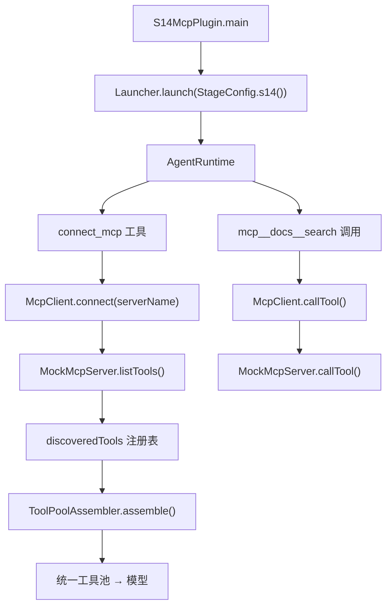
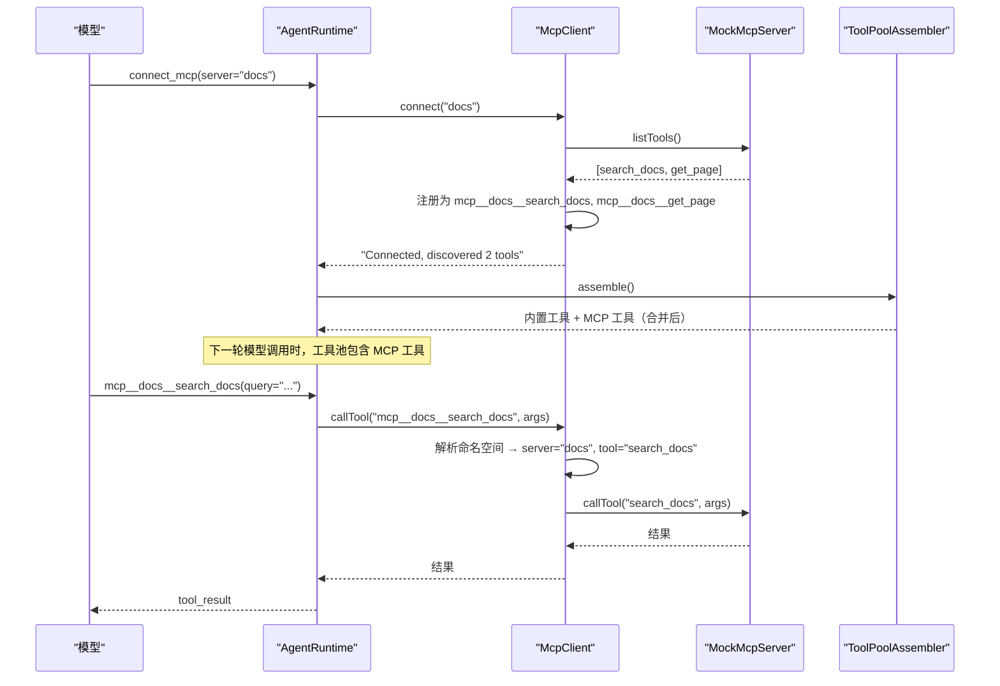

# S14: MCP 插件

<cite>
**本文引用的文件**
- [McpClient.java](file://src/main/java/com/learnclaudecode/mcp/McpClient.java)
- [MockMcpServer.java](file://src/main/java/com/learnclaudecode/mcp/MockMcpServer.java)
- [ToolPoolAssembler.java](file://src/main/java/com/learnclaudecode/mcp/ToolPoolAssembler.java)
- [StageConfig.java](file://src/main/java/com/learnclaudecode/agents/StageConfig.java)
- [S14McpPlugin.java](file://src/main/java/com/learnclaudecode/agents/S14McpPlugin.java)
- [AgentRuntime.java](file://src/main/java/com/learnclaudecode/agents/AgentRuntime.java)
</cite>

## 目录
1. [简介](#简介)
2. [教学目标](#教学目标)
3. [项目结构](#项目结构)
4. [核心组件](#核心组件)
5. [架构总览](#架构总览)
6. [详细组件分析](#详细组件分析)
7. [工具列表](#工具列表)
8. [与前后阶段的关系](#与前后阶段的关系)
9. [故障排查指南](#故障排查指南)
10. [结论](#结论)

## 简介

> **座右铭："能力不够？插上 MCP 扩展"**

前面 13 个阶段中，Agent 的所有工具都是"内置"的——编译时确定，运行时不可变。但真实世界的需求是无穷无尽的：今天需要查文档，明天需要部署服务，后天需要操作数据库。如果每个需求都要修改源码、重新编译，Agent 就失去了灵活性。

S14 引入 **MCP（Model Context Protocol）插件系统**，让 Agent 能够在运行时动态发现和调用外部工具。通过 MCP 协议，外部服务以"插件"的形式接入，Agent 的工具池从"编译时固定"变为"运行时可扩展"。

本阶段的核心问题是：**如何让 Agent 在不修改自身代码的前提下，获得新的工具能力？**

## 教学目标

完成本阶段学习后，你应当能够：

- 理解 MCP 协议的"发现 + 调用"两阶段模型
- 掌握工具命名空间 `mcp__<server>__<tool>` 的设计意图
- 理解 ToolPoolAssembler 如何合并内置工具与 MCP 工具（去重、限长、内置优先）
- 了解 MockMcpServer 如何模拟外部 MCP 服务（进程内演示）
- 能够解释为什么 MCP 工具也需要经过权限系统（S03）的检查
- 理解"动态工具池"与"静态工具列表"的区别

## 项目结构

S14 的 MCP 能力由"阶段配置 + MCP 客户端 + Mock 服务端 + 工具池组装器"四部分构成：

- 阶段配置 `StageConfig.s14()` 启用 `enableMcp=true`，暴露 `connect_mcp` 工具
- `McpClient` 负责连接 server、发现工具、代理调用
- `MockMcpServer` 提供进程内的模拟 MCP 服务（docs / deploy）
- `ToolPoolAssembler` 将内置工具与 MCP 发现的工具合并为统一列表



**图表来源**
- [S14McpPlugin.java](file://src/main/java/com/learnclaudecode/agents/S14McpPlugin.java)
- [McpClient.java:58-100](file://src/main/java/com/learnclaudecode/mcp/McpClient.java#L58-L100)
- [ToolPoolAssembler.java:60-100](file://src/main/java/com/learnclaudecode/mcp/ToolPoolAssembler.java#L60-L100)

**章节来源**
- [S14McpPlugin.java](file://src/main/java/com/learnclaudecode/agents/S14McpPlugin.java)
- [McpClient.java:1-226](file://src/main/java/com/learnclaudecode/mcp/McpClient.java#L1-L226)
- [MockMcpServer.java:1-250](file://src/main/java/com/learnclaudecode/mcp/MockMcpServer.java#L1-L250)
- [ToolPoolAssembler.java:1-144](file://src/main/java/com/learnclaudecode/mcp/ToolPoolAssembler.java#L1-L144)

## 核心组件

- **McpClient**：MCP 客户端，管理连接、工具发现与代理调用
- **MockMcpServer**：模拟 MCP 服务端，提供 docs（文档搜索）和 deploy（部署操作）两个示例 server
- **ToolPoolAssembler**：工具池组装器，合并内置工具与 MCP 工具，处理命名冲突和长度限制
- **ToolDefinition**：MCP 工具定义记录，包含命名空间名称、描述、输入 schema

**章节来源**
- [McpClient.java:24-42](file://src/main/java/com/learnclaudecode/mcp/McpClient.java#L24-L42)
- [MockMcpServer.java](file://src/main/java/com/learnclaudecode/mcp/MockMcpServer.java)
- [ToolPoolAssembler.java:25-45](file://src/main/java/com/learnclaudecode/mcp/ToolPoolAssembler.java#L25-L45)

## 架构总览

MCP 的"发现 → 注册 → 调用"三阶段流程：



**图表来源**
- [McpClient.java:58-150](file://src/main/java/com/learnclaudecode/mcp/McpClient.java#L58-L150)
- [ToolPoolAssembler.java:60-100](file://src/main/java/com/learnclaudecode/mcp/ToolPoolAssembler.java#L60-L100)

## 详细组件分析

### McpClient：连接与发现

`connect(serverName)` 的流程：
1. 在 MockMcpServer 注册表中查找目标 server
2. 幂等检查：已连接则直接返回
3. 调用 `server.listTools()` 获取工具清单
4. 为每个工具生成命名空间名称：`mcp__<server>__<tool>`
5. 注册到 `discoveredTools` Map

`callTool(namespacedName, args)` 的流程：
1. 解析命名空间：从 `mcp__docs__search_docs` 中提取 server="docs"、tool="search_docs"
2. 路由到对应 server 的 `callTool()` 方法
3. 返回执行结果

**命名空间设计**：`mcp__<server>__<tool>` 格式确保：
- 不同 server 的同名工具不冲突（如 docs__search 和 deploy__search）
- AgentRuntime 可以通过前缀 `mcp__` 识别 MCP 工具并路由到 McpClient
- 双下划线 `__` 作为分隔符，避免与工具名中的单下划线混淆

### MockMcpServer：进程内模拟

为了教学演示，本项目不依赖真实的 MCP 服务进程，而是用进程内的 Mock 实现：

| Server 名 | 提供的工具 | 模拟功能 |
|-----------|-----------|---------|
| `docs` | search_docs, get_page | 文档搜索与页面获取 |
| `deploy` | deploy_service, check_status | 服务部署与状态检查 |

每个 Mock Server 实现 `listTools()` 和 `callTool()` 接口，返回预设的模拟结果。

### ToolPoolAssembler：工具池合并

将内置工具与 MCP 发现的工具合并为统一列表：

```java
public List<Map<String, Object>> assemble() {
    List<Map<String, Object>> result = new ArrayList<>(builtinTools);
    // 注册所有内置工具名称（规范化后）
    // 逐一追加 MCP 工具：
    //   - 跳过与内置工具同名的（内置优先）
    //   - 跳过超过 64 字符名称的（API 限制）
    return result;
}
```

设计规则：
- **内置优先**：同名时内置工具胜出，MCP 工具被跳过并打印警告
- **名称限长**：Anthropic API 要求工具名 ≤ 64 字符，超长则跳过
- **规范化碰撞检测**：名称规范化后再做冲突判断，避免大小写差异导致的隐性冲突

**章节来源**
- [McpClient.java:24-226](file://src/main/java/com/learnclaudecode/mcp/McpClient.java#L24-L226)
- [MockMcpServer.java](file://src/main/java/com/learnclaudecode/mcp/MockMcpServer.java)
- [ToolPoolAssembler.java:25-144](file://src/main/java/com/learnclaudecode/mcp/ToolPoolAssembler.java#L25-L144)

## 工具列表

S14 阶段暴露以下 MCP 相关工具：

| 工具名 | 功能 | 关键参数 |
|--------|------|---------|
| `connect_mcp` | 连接一个 MCP server 并发现其工具 | server_name |

连接成功后，发现的 MCP 工具会自动加入工具池，模型可以直接调用：

| 动态工具名 | 来源 Server | 功能 |
|-----------|------------|------|
| `mcp__docs__search_docs` | docs | 搜索文档 |
| `mcp__docs__get_page` | docs | 获取文档页面 |
| `mcp__deploy__deploy_service` | deploy | 部署服务 |
| `mcp__deploy__check_status` | deploy | 检查部署状态 |

**使用示例**：

```
用户：连接文档服务
Agent 调用：connect_mcp(server_name="docs")
返回：Connected to MCP server 'docs'. Discovered 2 tool(s):
  - mcp__docs__search_docs: Search documentation
  - mcp__docs__get_page: Get a documentation page

用户：搜索 "权限管理" 相关文档
Agent 调用：mcp__docs__search_docs(query="权限管理")
返回：[模拟搜索结果]
```

**章节来源**
- [StageConfig.java](file://src/main/java/com/learnclaudecode/agents/StageConfig.java)
- [McpClient.java:58-100](file://src/main/java/com/learnclaudecode/mcp/McpClient.java#L58-L100)

## 与前后阶段的关系

### 前置阶段

- **S02（工具调用）**：S02 的工具是编译时固定的；S14 的工具是运行时动态发现的。MCP 是"工具调用"能力的扩展
- **S03（权限系统）**：MCP 工具同样经过权限检查。默认被 `*` 兜底规则 allow，但可以通过 permission_set 对特定 MCP 工具设置 deny/confirm
- **S04（钩子系统）**：MCP 工具的调用同样触发 PreToolUse/PostToolUse 钩子

### 后续阶段

- **S15（集成运行时）**：MCP 成为完整系统的标准能力，connect_mcp 在启动时自动连接预配置的 server
- **S16（工作流运行时）**：工作流的 agent 步骤可以使用 MCP 工具
- **S13（多 Agent 协作）**：队友也可以使用 MCP 工具，扩展团队整体能力

### 设计演进

```
S02: 静态工具（编译时固定）
S03: 权限控制（工具调用前检查）
S14: MCP 插件（运行时动态发现） ← 你在这里
S15: 集成运行时（静态 + 动态工具统一池）
```

**章节来源**
- [StageConfig.java](file://src/main/java/com/learnclaudecode/agents/StageConfig.java)
- [AgentRuntime.java](file://src/main/java/com/learnclaudecode/agents/AgentRuntime.java)

## 故障排查指南

| 现象 | 可能原因 | 定位方法 |
|------|---------|---------|
| connect_mcp 返回 "Unknown MCP server" | server 名不在注册表中 | 检查 MockMcpServer.getAvailableServerNames() |
| 连接成功但模型不调用 MCP 工具 | 工具池未刷新或 system prompt 未提示 | 检查 ToolPoolAssembler.assemble() 输出 |
| MCP 工具调用返回 "Unknown tool" | 命名空间解析失败 | 检查工具名格式是否为 mcp__server__tool |
| 工具名冲突警告 | MCP 工具与内置工具同名 | ToolPoolAssembler 会跳过冲突工具，内置优先 |
| 工具名超长被跳过 | 命名空间 + 工具名 > 64 字符 | 缩短 server 名或工具名 |

**章节来源**
- [McpClient.java:58-150](file://src/main/java/com/learnclaudecode/mcp/McpClient.java#L58-L150)
- [ToolPoolAssembler.java:60-100](file://src/main/java/com/learnclaudecode/mcp/ToolPoolAssembler.java#L60-L100)

## 结论

S14 通过 MCP 插件系统实现了"能力不够？插上 MCP 扩展"的动态工具扩展。McpClient 负责连接与发现，MockMcpServer 提供进程内模拟，ToolPoolAssembler 将内外部工具合并为统一池。

关键设计决策：
- **命名空间隔离**：`mcp__<server>__<tool>` 避免不同来源的工具名冲突
- **内置优先**：同名时内置工具胜出，保证核心能力不被外部覆盖
- **进程内 Mock**：教学演示无需真实外部服务，降低运行门槛
- **与权限/钩子协同**：MCP 工具不是"法外之地"，同样受权限检查和钩子审计
- **动态工具池**：每轮模型调用前重新组装工具池，新连接的 server 立即可用

MCP 插件系统使 Agent 从"封闭系统"变为"开放平台"——能力边界不再由编译时决定，而是由运行时连接的服务决定。
