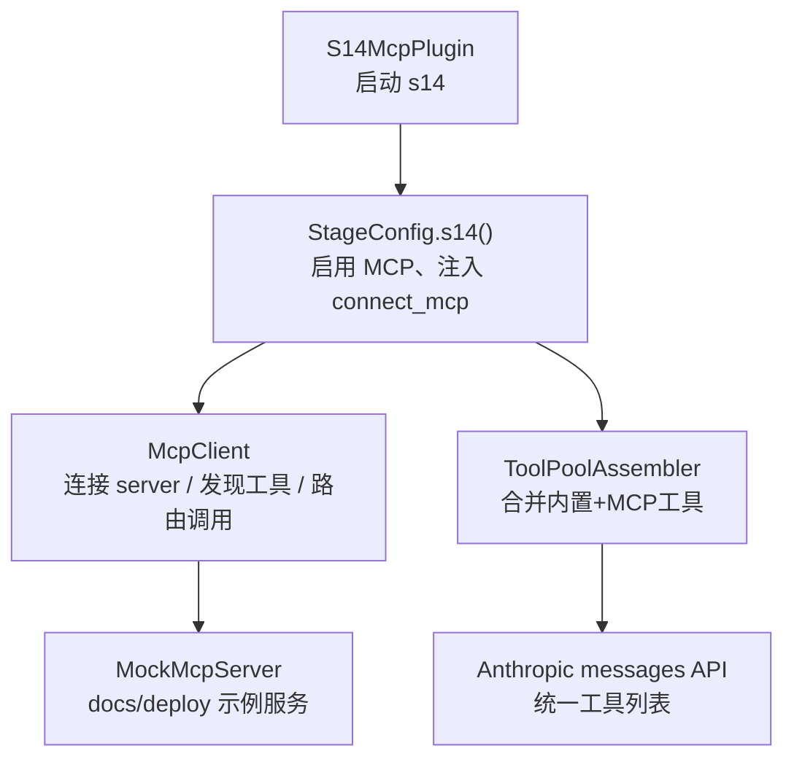
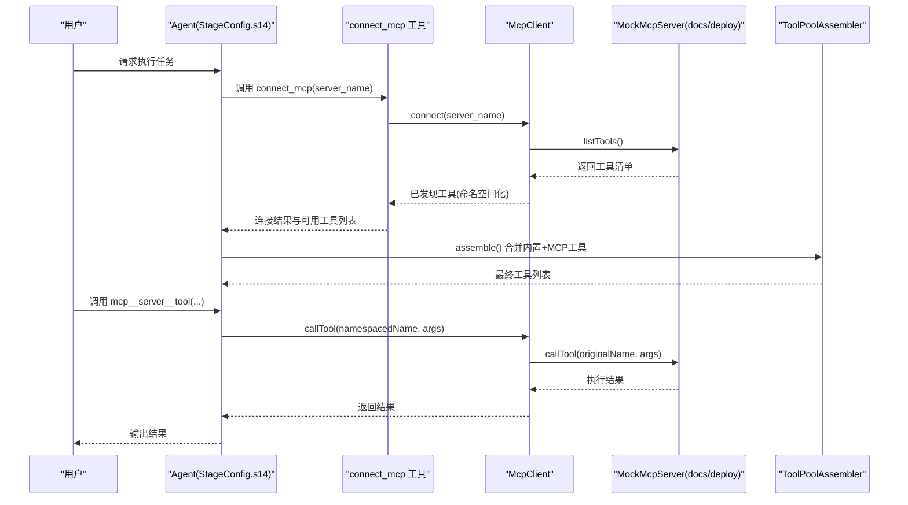
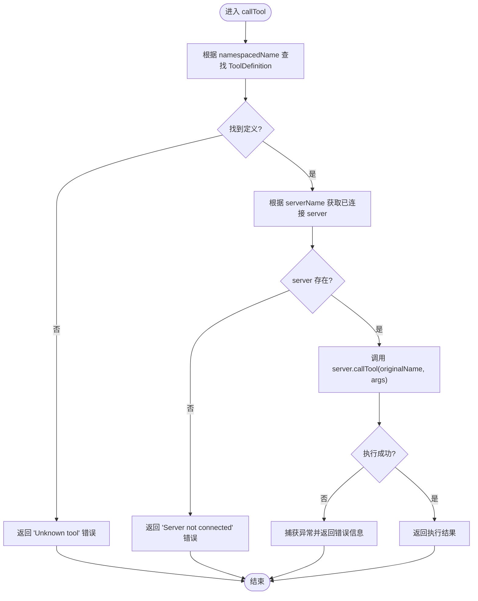
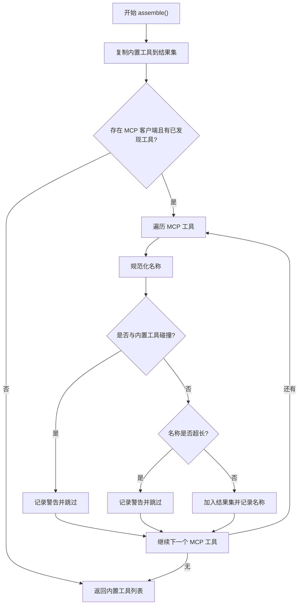
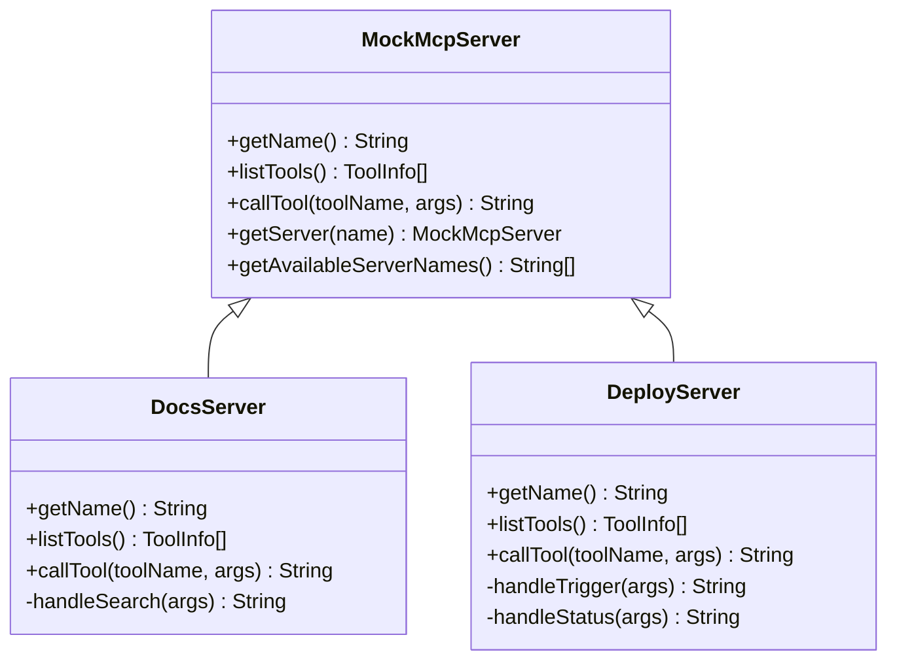
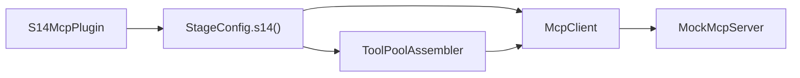

# S14: MCP集成

<cite>
**本文引用的文件**
- [S14McpPlugin.java](file://src/main/java/com/learnclaudecode/agents/S14McpPlugin.java)
- [StageConfig.java](file://src/main/java/com/learnclaudecode/agents/StageConfig.java)
- [McpClient.java](file://src/main/java/com/learnclaudecode/mcp/McpClient.java)
- [ToolPoolAssembler.java](file://src/main/java/com/learnclaudecode/mcp/ToolPoolAssembler.java)
- [MockMcpServer.java](file://src/main/java/com/learnclaudecode/mcp/MockMcpServer.java)
- [McpClientTest.java](file://src/test/java/com/learnclaudecode/mcp/McpClientTest.java)
- [ToolPoolAssemblerTest.java](file://src/test/java/com/learnclaudecode/mcp/ToolPoolAssemblerTest.java)
</cite>

## 目录
1. [简介](#简介)
2. [项目结构](#项目结构)
3. [核心组件](#核心组件)
4. [架构总览](#架构总览)
5. [详细组件分析](#详细组件分析)
6. [依赖关系分析](#依赖关系分析)
7. [性能与扩展性](#性能与扩展性)
8. [故障排查指南](#故障排查指南)
9. [结论](#结论)
10. [附录](#附录)

## 简介
本章节聚焦于“S14：MCP集成”，展示如何通过 MCP（Model Context Protocol）在运行时动态发现并调用外部工具，从而将 Agent 的工具集从编译期固定扩展到运行期可插拔。该阶段通过一个进程内 Mock Server 演示 MCP 的“能力发现 + 工具调用”机制，并以命名空间化方式将外部工具安全地合并到主工具池，同时保持权限、Hook 等既有系统的一致性。

## 项目结构
S14 的核心位于 agents 与 mcp 两个包：
- agents 层提供阶段入口与配置：S14McpPlugin 启动 s14 阶段；StageConfig.s14() 启用 MCP 并注入 connect_mcp 工具。
- mcp 层实现客户端、工具池组装器与模拟服务器：McpClient 负责连接 server、发现工具与路由调用；ToolPoolAssembler 将内置工具与 MCP 工具合并；MockMcpServer 提供教学用 docs/deploy 两类能力。

图表来源
- [S14McpPlugin.java:17-20](file://src/main/java/com/learnclaudecode/agents/S14McpPlugin.java#L17-L20)
- [StageConfig.java:573-586](file://src/main/java/com/learnclaudecode/agents/StageConfig.java#L573-L586)
- [McpClient.java:24-225](file://src/main/java/com/learnclaudecode/mcp/McpClient.java#L24-L225)
- [ToolPoolAssembler.java:25-143](file://src/main/java/com/learnclaudecode/mcp/ToolPoolAssembler.java#L25-L143)
- [MockMcpServer.java:14-219](file://src/main/java/com/learnclaudecode/mcp/MockMcpServer.java#L14-L219)

章节来源
- [S14McpPlugin.java:17-20](file://src/main/java/com/learnclaudecode/agents/S14McpPlugin.java#L17-L20)
- [StageConfig.java:573-586](file://src/main/java/com/learnclaudecode/agents/StageConfig.java#L573-L586)

## 核心组件
- McpClient：连接指定 MCP server，自动发现其工具并以命名空间形式注册；支持按命名空间名路由调用；导出 Anthropic 兼容的工具定义；提供连接状态查询。
- ToolPoolAssembler：将内置工具与 MCP 发现的工具合并，处理名称规范化、长度限制与冲突检测（内置优先）。
- MockMcpServer：抽象基类与两个教学用实现（docs、deploy），暴露 listTools/callTool，用于演示 MCP 协议语义。
- StageConfig.s14()：为 s14 阶段启用 MCP，注入 connect_mcp 工具，使 Agent 可在运行时连接外部 server 并扩展能力。
- S14McpPlugin：阶段入口，委托 Launcher.launch(StageConfig.s14()) 启动。

章节来源
- [McpClient.java:24-225](file://src/main/java/com/learnclaudecode/mcp/McpClient.java#L24-L225)
- [ToolPoolAssembler.java:25-143](file://src/main/java/com/learnclaudecode/mcp/ToolPoolAssembler.java#L25-L143)
- [MockMcpServer.java:14-219](file://src/main/java/com/learnclaudecode/mcp/MockMcpServer.java#L14-L219)
- [StageConfig.java:573-586](file://src/main/java/com/learnclaudecode/agents/StageConfig.java#L573-L586)
- [S14McpPlugin.java:17-20](file://src/main/java/com/learnclaudecode/agents/S14McpPlugin.java#L17-L20)

## 架构总览
下图展示了 s14 阶段中，Agent 如何通过 connect_mcp 工具连接 MCP server，发现工具并将其纳入统一工具池，随后以命名空间化的方式调用外部工具。

图表来源
- [StageConfig.java:573-586](file://src/main/java/com/learnclaudecode/agents/StageConfig.java#L573-L586)
- [McpClient.java:58-118](file://src/main/java/com/learnclaudecode/mcp/McpClient.java#L58-L118)
- [ToolPoolAssembler.java:60-104](file://src/main/java/com/learnclaudecode/mcp/ToolPoolAssembler.java#L60-L104)
- [MockMcpServer.java:86-219](file://src/main/java/com/learnclaudecode/mcp/MockMcpServer.java#L86-L219)

## 详细组件分析

### McpClient：连接、发现与路由
- 连接流程：根据 server 名称查找 MockMcpServer，幂等保护避免重复连接；调用 listTools() 获取工具清单；为每个工具生成命名空间名（mcp__{server}__{tool}）并注册到 discoveredTools。
- 调用流程：根据命名空间名解析出原始工具名与所属 server，委托对应 server 执行；异常被捕获并转换为错误字符串。
- 工具定义导出：getToolDefinitions() 返回 Anthropic 兼容格式（name/description/input_schema），供 ToolPoolAssembler 合并。
- 状态查询：listConnected() 展示已连接 server 及其工具树；isConnected() 判断连接状态。

图表来源
- [McpClient.java:102-118](file://src/main/java/com/learnclaudecode/mcp/McpClient.java#L102-L118)

章节来源
- [McpClient.java:58-118](file://src/main/java/com/learnclaudecode/mcp/McpClient.java#L58-L118)
- [McpClient.java:128-168](file://src/main/java/com/learnclaudecode/mcp/McpClient.java#L128-L168)
- [McpClient.java:197-206](file://src/main/java/com/learnclaudecode/mcp/McpClient.java#L197-L206)

### ToolPoolAssembler：工具池合并与冲突治理
- 合并策略：先加入所有内置工具，再追加 MCP 工具；对同名工具进行规范化后碰撞检测，内置优先，跳过冲突的 MCP 工具并输出警告。
- 名称规范与限长：名称仅保留字母、数字与下划线并转小写；超过 64 字符的工具名将被跳过并警告。
- 辅助能力：detectCollisions() 可用于预检查两组工具名是否存在冲突。

图表来源
- [ToolPoolAssembler.java:60-104](file://src/main/java/com/learnclaudecode/mcp/ToolPoolAssembler.java#L60-L104)
- [ToolPoolAssembler.java:115-142](file://src/main/java/com/learnclaudecode/mcp/ToolPoolAssembler.java#L115-L142)

章节来源
- [ToolPoolAssembler.java:25-143](file://src/main/java/com/learnclaudecode/mcp/ToolPoolAssembler.java#L25-L143)

### MockMcpServer：教学用能力演示
- 抽象接口：getName/listTools/callTool；静态注册表管理可用 server。
- DocsServer：提供 search/get_version 工具，演示文档检索与版本查询。
- DeployServer：提供 trigger/status 工具，演示触发部署与查询进度。

图表来源
- [MockMcpServer.java:14-77](file://src/main/java/com/learnclaudecode/mcp/MockMcpServer.java#L14-L77)
- [MockMcpServer.java:86-135](file://src/main/java/com/learnclaudecode/mcp/MockMcpServer.java#L86-L135)
- [MockMcpServer.java:140-219](file://src/main/java/com/learnclaudecode/mcp/MockMcpServer.java#L140-L219)

章节来源
- [MockMcpServer.java:14-219](file://src/main/java/com/learnclaudecode/mcp/MockMcpServer.java#L14-L219)

### 阶段入口与配置：S14McpPlugin 与 StageConfig.s14()
- S14McpPlugin：作为 s14 阶段的入口，调用 Launcher.launch(StageConfig.s14()) 启动。
- StageConfig.s14()：从 s04 工具集分叉，增加 connect_mcp 工具，启用权限、Hook 与 MCP；设置系统提示，指导 Agent 使用 connect_mcp 动态扩展能力。

章节来源
- [S14McpPlugin.java:17-20](file://src/main/java/com/learnclaudecode/agents/S14McpPlugin.java#L17-L20)
- [StageConfig.java:573-586](file://src/main/java/com/learnclaudecode/agents/StageConfig.java#L573-L586)

## 依赖关系分析
- S14McpPlugin 依赖 StageConfig.s14() 完成阶段配置。
- StageConfig.s14() 引入 connect_mcp 工具并启用 MCP 开关。
- McpClient 依赖 WorkspacePaths（预留持久化）、MockMcpServer（能力源）。
- ToolPoolAssembler 依赖 McpClient 获取动态工具，并与内置工具合并。
- 测试覆盖：McpClientTest 验证连接、发现、调用与导出；ToolPoolAssemblerTest 验证合并、冲突与规范化。

图表来源
- [S14McpPlugin.java:17-20](file://src/main/java/com/learnclaudecode/agents/S14McpPlugin.java#L17-L20)
- [StageConfig.java:573-586](file://src/main/java/com/learnclaudecode/agents/StageConfig.java#L573-L586)
- [McpClient.java:24-225](file://src/main/java/com/learnclaudecode/mcp/McpClient.java#L24-L225)
- [ToolPoolAssembler.java:25-143](file://src/main/java/com/learnclaudecode/mcp/ToolPoolAssembler.java#L25-L143)
- [MockMcpServer.java:14-219](file://src/main/java/com/learnclaudecode/mcp/MockMcpServer.java#L14-L219)

章节来源
- [McpClientTest.java:35-137](file://src/test/java/com/learnclaudecode/mcp/McpClientTest.java#L35-L137)
- [ToolPoolAssemblerTest.java:33-113](file://src/test/java/com/learnclaudecode/mcp/ToolPoolAssemblerTest.java#L33-L113)

## 性能与扩展性
- 连接与发现：connect() 使用 synchronized 保护，确保线程安全；发现过程仅一次写入，后续读取无需加锁。
- 工具合并：ToolPoolAssembler 在内存中进行去重与校验，时间复杂度近似 O(N+M)，N 为内置工具数，M 为 MCP 工具数。
- 名称规范化与限长：防止恶意或过长名称导致下游 API 异常，保障稳定性。
- 可扩展性：新增 MockMcpServer 即可扩展新能力；真实场景可将 MockMcpServer 替换为基于 JSON-RPC over stdio/SSE 的真实 MCP 服务端。

[本节为通用指导，不直接分析具体文件]

## 故障排查指南
- 未知 server：connect("nonexistent") 会返回错误并提示可用 server 列表。
- 重复连接：再次 connect 同一 server 会返回已连接提示。
- 未连接调用：在未连接 server 的情况下调用工具会返回错误提示。
- 工具不存在：调用未发现的命名空间工具会返回 Unknown tool 错误。
- 工具名冲突：当 MCP 工具与内置工具同名时，内置优先，MCP 工具被跳过并输出警告。
- 工具名超长：超过 64 字符的工具名会被跳过并输出警告。

章节来源
- [McpClient.java:58-118](file://src/main/java/com/learnclaudecode/mcp/McpClient.java#L58-L118)
- [ToolPoolAssembler.java:80-104](file://src/main/java/com/learnclaudecode/mcp/ToolPoolAssembler.java#L80-L104)
- [McpClientTest.java:57-95](file://src/test/java/com/learnclaudecode/mcp/McpClientTest.java#L57-L95)
- [ToolPoolAssemblerTest.java:64-82](file://src/test/java/com/learnclaudecode/mcp/ToolPoolAssemblerTest.java#L64-L82)

## 结论
S14 通过 MCP 将 Agent 的能力从编译期固定扩展到运行期可插拔：借助 connect_mcp 工具，Agent 可以动态连接外部 server、发现工具并以命名空间化方式安全调用；ToolPoolAssembler 保证工具池的一致性与健壮性。该设计既保持了与权限、Hook 等子系统的一致性，又为未来接入真实 MCP 服务提供了清晰的演进路径。

[本节为总结性内容，不直接分析具体文件]

## 附录
- 典型用法参考：
  - 连接 docs 并搜索文档：connect("docs") → 调用 mcp__docs__search(query="...")
  - 触发部署并查询状态：connect("deploy") → 调用 mcp__deploy__trigger(environment="...", version="...") → 调用 mcp__deploy__status(deployment_id="...")
- 测试用例覆盖：
  - McpClientTest：连接、发现、调用、导出、状态列举
  - ToolPoolAssemblerTest：合并、冲突、规范化、碰撞检测

章节来源
- [McpClientTest.java:35-137](file://src/test/java/com/learnclaudecode/mcp/McpClientTest.java#L35-L137)
- [ToolPoolAssemblerTest.java:33-113](file://src/test/java/com/learnclaudecode/mcp/ToolPoolAssemblerTest.java#L33-L113)