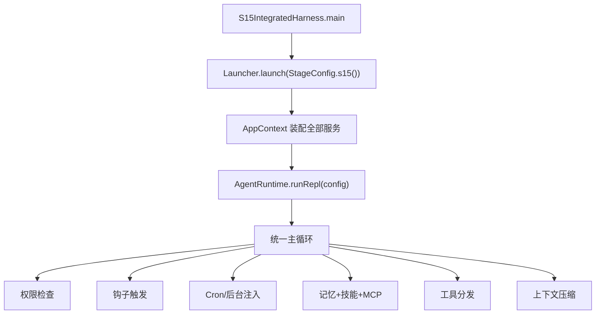
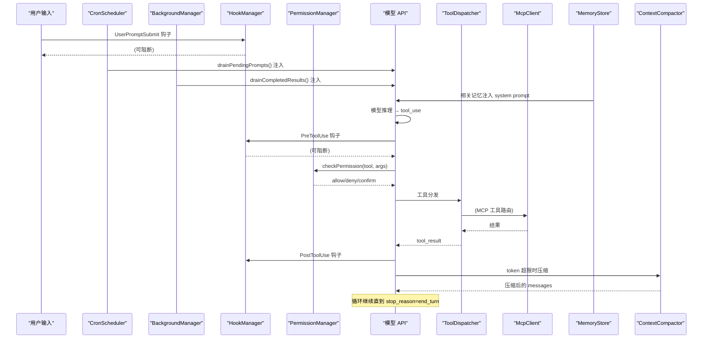

# S15: 集成运行时

<cite>
**本文引用的文件**
- [S15IntegratedHarness.java](file://src/main/java/com/learnclaudecode/agents/S15IntegratedHarness.java)
- [StageConfig.java](file://src/main/java/com/learnclaudecode/agents/StageConfig.java)
- [AgentRuntime.java](file://src/main/java/com/learnclaudecode/agents/AgentRuntime.java)
- [Launcher.java](file://src/main/java/com/learnclaudecode/agents/Launcher.java)
- [AppContext.java](file://src/main/java/com/learnclaudecode/agents/AppContext.java)
- [PermissionManager.java](file://src/main/java/com/learnclaudecode/permission/PermissionManager.java)
- [HookManager.java](file://src/main/java/com/learnclaudecode/hooks/HookManager.java)
- [MemoryStore.java](file://src/main/java/com/learnclaudecode/memory/MemoryStore.java)
- [CronScheduler.java](file://src/main/java/com/learnclaudecode/scheduler/CronScheduler.java)
- [McpClient.java](file://src/main/java/com/learnclaudecode/mcp/McpClient.java)
- [ToolPoolAssembler.java](file://src/main/java/com/learnclaudecode/mcp/ToolPoolAssembler.java)
</cite>

## 目录
1. [简介](#简介)
2. [教学目标](#教学目标)
3. [项目结构](#项目结构)
4. [核心组件](#核心组件)
5. [架构总览](#架构总览)
6. [完整流水线](#完整流水线)
7. [能力开关汇总](#能力开关汇总)
8. [工具池](#工具池)
9. [与前后阶段的关系](#与前后阶段的关系)
10. [故障排查指南](#故障排查指南)
11. [结论](#结论)

## 简介

> **座右铭："众多机制，一个循环"**

S01 到 S14，每一个阶段都在主循环上叠加了一种新能力：工具调用、权限控制、钩子注入、任务管理、子代理、技能加载、上下文压缩、记忆持久化、后台执行、定时调度、团队协作、MCP 插件……

但这些能力一直是**隔离运行**的——每个阶段的 StageConfig 只启用该阶段关注的子系统。S15 的使命是：**把所有开关同时打开**，验证 14 种能力可以在同一个 AgentRuntime 循环中协同工作、互不冲突。

本阶段**不引入任何新机制**。它是一张"全能力验收单"：如果 S15 能正常跑通，说明前 14 个阶段的设计是可组合的。

本阶段的核心问题是：**如何把 14 种独立机制统一编排在一个循环里，让它们协同而不打架？**

## 教学目标

完成本阶段学习后，你应当能够：

- 理解"集成运行时"与"单能力阶段"的区别：不是新机制，而是全开关
- 掌握 StageConfig.s15() 的构建模式：继承 s13().tools() + s14().tools()，去重合并
- 能够画出完整的 agentLoop 流水线图，标注每种能力的介入点
- 理解工具池组装顺序：内置工具 → MCP 动态工具 → 去重
- 了解"能力开关全部为 true"时的性能影响与调优方向
- 能够解释为什么 S15 是后续 S16（工作流）和 S17（目标循环）的基础

## 项目结构

S15 的入口极为简洁——只做一件事：选择 StageConfig.s15()，交给 Launcher：

```java
public class S15IntegratedHarness {
    public static void main(String[] args) {
        Launcher.launch(StageConfig.s15());
    }
}
```

所有复杂度都在 StageConfig.s15() 和 AgentRuntime 的循环里。



**图表来源**
- [S15IntegratedHarness.java](file://src/main/java/com/learnclaudecode/agents/S15IntegratedHarness.java)
- [Launcher.java](file://src/main/java/com/learnclaudecode/agents/Launcher.java)

**章节来源**
- [S15IntegratedHarness.java](file://src/main/java/com/learnclaudecode/agents/S15IntegratedHarness.java)
- [StageConfig.java:594-614](file://src/main/java/com/learnclaudecode/agents/StageConfig.java#L594-L614)

## 核心组件

S15 本身不新增组件，而是同时激活以下所有子系统：

| 子系统 | 来源阶段 | 核心类 | 职责 |
|--------|---------|--------|------|
| Agent Loop | S01 | AgentRuntime | 主循环驱动 |
| Tool Use | S02 | ToolDispatcher | 工具注册与调用 |
| Permission | S03 | PermissionManager | 调用前三态检查 |
| Hooks | S04 | HookManager | 生命周期钩子注入 |
| Todo | S05 | TodoManager | 任务清单管理 |
| Subagent | S06 | SubagentRunner | 子代理分治 |
| Skills | S07 | SkillLoader | 技能文件加载 |
| Compression | S08 | ContextCompactor | 上下文压缩 |
| Memory | S09 | MemoryStore | 跨会话记忆 |
| Task System | S10 | TaskManager | 深度任务板 |
| Background | S11 | BackgroundManager | 异步后台执行 |
| Cron | S12 | CronScheduler | 定时调度注入 |
| Teams | S13 | TeammateManager | 多 Agent 协作 |
| MCP | S14 | McpClient + ToolPoolAssembler | 动态工具扩展 |

**章节来源**
- [StageConfig.java:594-614](file://src/main/java/com/learnclaudecode/agents/StageConfig.java#L594-L614)
- [AppContext.java](file://src/main/java/com/learnclaudecode/agents/AppContext.java)

## 架构总览

S15 的 agentLoop 是所有能力的汇聚点。下面展示一次完整循环中各子系统的介入顺序：



**图表来源**
- [AgentRuntime.java](file://src/main/java/com/learnclaudecode/agents/AgentRuntime.java)

## 完整流水线

将 S15 的一轮完整循环拆解为有序步骤：

```
┌─────────────────────────────────────────────────────────────┐
│                    AgentRuntime 主循环                        │
├─────────────────────────────────────────────────────────────┤
│  1. 用户输入 / Cron prompt 注入 / Background 结果注入         │
│  2. HookManager.triggerHooks(UserPromptSubmit)               │
│  3. MemoryStore 检索相关记忆 → 追加到 system prompt           │
│  4. SkillLoader 加载 .skills/ 目录 → 追加到 system prompt    │
│  5. ToolPoolAssembler.assemble() → 内置 + MCP 动态工具       │
│  6. ContextCompactor.maybeCompress() → token 超限时压缩      │
│  7. AnthropicClient.createMessage() → 模型推理               │
│  8. 解析 stop_reason:                                        │
│     - end_turn → 输出回复，回到步骤 1                         │
│     - tool_use → 进入工具执行流程 ↓                           │
│  9. HookManager.triggerHooks(PreToolUse) → 可阻断            │
│ 10. PermissionManager.checkPermission() → allow/deny/confirm │
│ 11. ToolDispatcher.dispatch() → 执行工具                     │
│     - MCP 工具 → McpClient.callTool() 路由                   │
│     - 内置工具 → 本地执行                                     │
│ 12. HookManager.triggerHooks(PostToolUse)                    │
│ 13. tool_result 追加到 messages → 回到步骤 6                 │
└─────────────────────────────────────────────────────────────┘
```

每个步骤都来自前面某个阶段的实现，S15 只是把它们串联成一条完整流水线。

## 能力开关汇总

StageConfig.s15() 的完整开关配置：

```java
public static StageConfig s15() {
    List<Map<String, Object>> tools = new ArrayList<>(s13().tools());
    tools.addAll(s14().tools());
    return builder("s15")
            .enablePermission(true)      // S03
            .enableHooks(true)           // S04
            .enableTodoNag(true)         // S05
            .enableCompression(true)     // S08
            .enableMemory(true)          // S09
            .enableBackground(true)      // S11
            .enableCron(true)            // S12
            .enableInbox(true)           // S13
            .autonomousTeammates(true)   // S13
            .subagentWritable(true)      // S06
            .enableMcp(true)             // S14
            .tools(dedupe(tools))
            .systemTemplate("You are a fully integrated coding agent...")
            .build();
}
```

| 开关 | 对应阶段 | 功能 |
|------|---------|------|
| enablePermission | S03 | 工具调用权限检查 |
| enableHooks | S04 | 生命周期钩子触发 |
| enableTodoNag | S05 | 待办清单提醒 |
| enableCompression | S08 | 上下文自动压缩 |
| enableMemory | S09 | 记忆读写与检索 |
| enableBackground | S11 | 后台任务异步执行 |
| enableCron | S12 | 定时调度 prompt 注入 |
| enableInbox | S13 | 团队消息收件箱轮询 |
| autonomousTeammates | S13 | 队友自治认领循环 |
| subagentWritable | S06 | 子代理可写文件 |
| enableMcp | S14 | MCP 动态工具发现 |

**章节来源**
- [StageConfig.java:594-614](file://src/main/java/com/learnclaudecode/agents/StageConfig.java#L594-L614)

## 工具池

S15 的工具池由三部分合并去重：

1. **S13 的全部工具**（包含 S01-S13 所有阶段累积的工具）
2. **S14 的 MCP 工具**（connect_mcp）
3. **运行时动态发现的 MCP 工具**（通过 ToolPoolAssembler.assemble() 追加）

去重策略：`dedupe(tools)` 按工具 name 字段做唯一性判断，保留首次出现的定义。

**工具总数**：26+ 内置工具 + 动态 MCP 工具（取决于连接了哪些 server）

## 与前后阶段的关系

### 前置阶段

S15 直接依赖 S01-S14 的所有阶段：

```
S01: Agent Loop 基础循环
S02: 工具注册与调用
S03: 权限三态检查
S04: 钩子注入与阻断
S05: 待办清单管理
S06: 子代理分治
S07: 技能文件加载
S08: 上下文压缩
S09: 跨会话记忆
S10: 深度任务板
S11: 后台异步执行
S12: 定时调度
S13: 多 Agent 协作
S14: MCP 动态工具
      ↓
S15: 全部汇聚 ← 你在这里
```

### 后续阶段

- **S16（工作流运行时）**：在 S15 的全能力基础上增加 `workflow` 工具和 `enableWorkflow=true`，让模型可以调用预定义的多步编排
- **S17（目标循环）**：在 S16 基础上增加 `goal_set/goal_status/goal_clear` 工具和 `enableGoalLoop=true`，引入独立评判者决定循环终止条件

### 设计哲学

S15 体现了一个重要的工程原则：**可组合性（Composability）**。

如果每个阶段的机制都是正交的（互不依赖内部实现），那么把它们全部打开应该不会冲突。S15 就是这个假设的验证场：

- 权限检查在钩子之后、工具执行之前 → 两者不冲突
- Cron 注入在用户输入同一层 → 不会覆盖用户消息
- Memory 注入在 system prompt → 不影响工具列表
- MCP 工具通过 ToolPoolAssembler 追加 → 不会覆盖内置工具

如果某个组合导致冲突，说明设计有耦合需要解耦。

**章节来源**
- [StageConfig.java:594-640](file://src/main/java/com/learnclaudecode/agents/StageConfig.java#L594-L640)
- [AgentRuntime.java](file://src/main/java/com/learnclaudecode/agents/AgentRuntime.java)

## 故障排查指南

| 现象 | 可能原因 | 定位方法 |
|------|---------|---------|
| 启动时报工具名冲突 | dedupe 未覆盖某个重名工具 | 检查 StageConfig.s15() 的 tools 列表 |
| 模型不调用 MCP 工具 | connect_mcp 未执行，工具池中没有动态工具 | 先执行 connect_mcp 连接 server |
| Cron prompt 不注入 | enableCron 未启用或调度器未启动 | 检查 AppContext 中 CronScheduler 初始化 |
| 权限误拦截 | 默认规则未覆盖某个工具 | 检查 PermissionManager 的兜底规则 |
| 上下文快速膨胀 | enableCompression 的阈值设置过高 | 调整 ContextCompactor 的触发阈值 |
| 钩子阻断导致循环卡住 | PreToolUse 钩子返回 block | 检查 HookManager 的已注册钩子 |

## 结论

S15 是整个学习旅程的"验收站"：

1. **不引入新机制**——它是 S01-S14 的集成验证
2. **全部开关打开**——验证 14 种能力的可组合性
3. **统一流水线**——展示一次循环中各子系统的介入顺序
4. **工具池合并**——内置 + MCP 动态工具的统一管理
5. **承上启下**——为 S16（工作流）和 S17（目标循环）提供完整的能力基座

通过 S15，你已经拥有了一个功能完整的 AI 编码助手运行时。接下来的 S16 和 S17 将在这个基础上，分别引入"确定性编排"和"自主终止"两种高阶控制能力。
