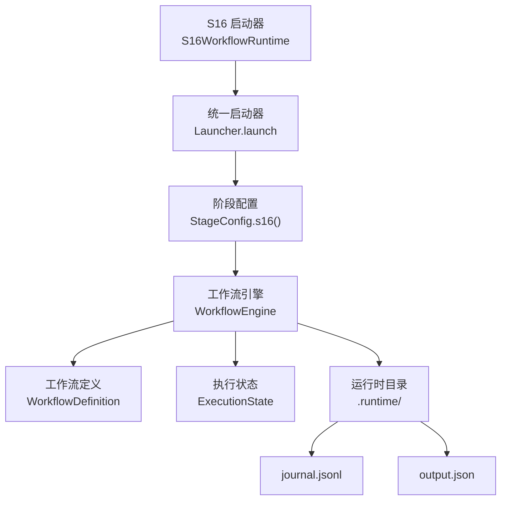
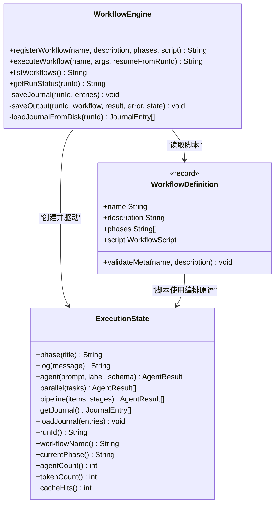
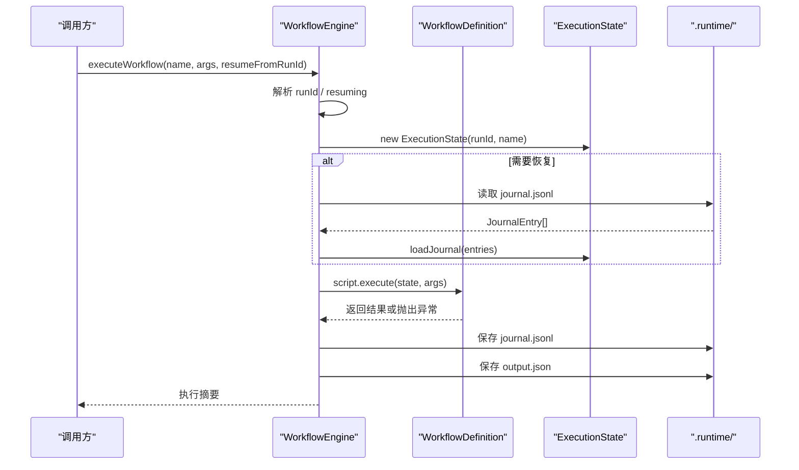
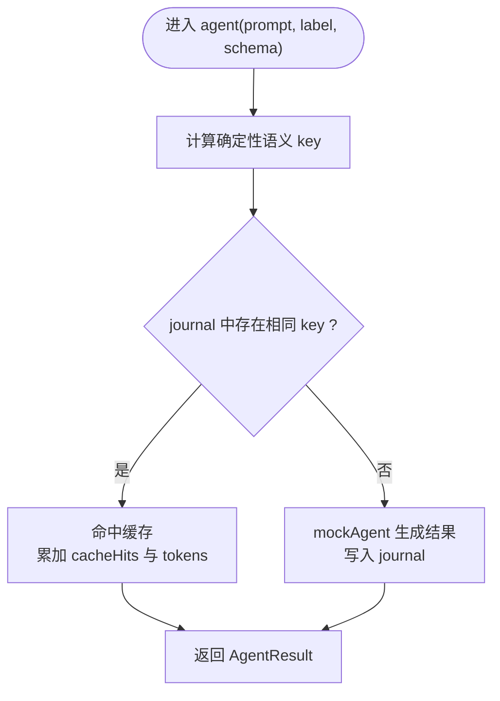
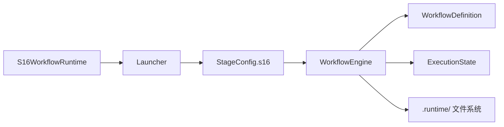
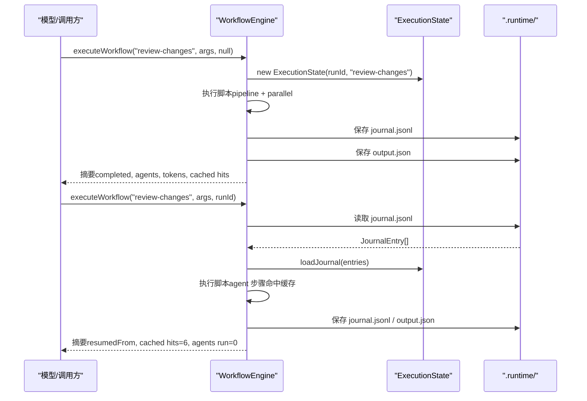

# S16: 工作流运行时

<cite>
**本文引用的文件**
- [S16WorkflowRuntime.java](file://src/main/java/com/learnclaudecode/agents/S16WorkflowRuntime.java)
- [Launcher.java](file://src/main/java/com/learnclaudecode/agents/Launcher.java)
- [StageConfig.java](file://src/main/java/com/learnclaudecode/agents/StageConfig.java)
- [WorkflowEngine.java](file://src/main/java/com/learnclaudecode/workflow/WorkflowEngine.java)
- [WorkflowDefinition.java](file://src/main/java/com/learnclaudecode/workflow/WorkflowDefinition.java)
- [ExecutionState.java](file://src/main/java/com/learnclaudecode/workflow/ExecutionState.java)
- [WorkflowEngineTest.java](file://src/test/java/com/learnclaudecode/workflow/WorkflowEngineTest.java)
</cite>

## 目录
1. [简介](#简介)
2. [项目结构](#项目结构)
3. [核心组件](#核心组件)
4. [架构总览](#架构总览)
5. [详细组件分析](#详细组件分析)
6. [依赖关系分析](#依赖关系分析)
7. [性能与可恢复性](#性能与可恢复性)
8. [故障排查指南](#故障排查指南)
9. [结论](#结论)
10. [附录：关键流程时序图](#附录关键流程时序图)

## 简介
本章节聚焦“工作流运行时”能力，对应教学阶段 s16。其核心思想是：当编排形状固定时，应将多步流程以代码形式注册为“工作流”，而非每次让模型现场推理整套流程。工作流引擎负责注册、执行、持久化与恢复；执行状态提供编排原语（phase/log/agent/parallel/pipeline）；通过确定性语义 key 的 journal 机制实现断点续跑与缓存复用，从而提升稳定性与成本效率。

## 项目结构
s16 的工作流运行时由以下部分构成：
- 入口与配置：S16 启动类仅选择 StageConfig.s16()，统一交由 Launcher 启动。
- 工作流引擎：WorkflowEngine 管理注册表、执行生命周期、journal 与输出落盘、Resume。
- 工作流定义：WorkflowDefinition 描述工作流元数据与脚本接口，并提供元数据校验。
- 执行状态：ExecutionState 暴露编排原语，维护 journal、统计信息，并支持 Resume。
- 测试用例：覆盖列举、注册、执行、落盘、Resume 命中缓存、状态查询等场景。

**图表来源**
- [S16WorkflowRuntime.java:17-20](file://src/main/java/com/learnclaudecode/agents/S16WorkflowRuntime.java#L17-L20)
- [Launcher.java:23-25](file://src/main/java/com/learnclaudecode/agents/Launcher.java#L23-L25)
- [StageConfig.java:621-641](file://src/main/java/com/learnclaudecode/agents/StageConfig.java#L621-L641)
- [WorkflowEngine.java:100-144](file://src/main/java/com/learnclaudecode/workflow/WorkflowEngine.java#L100-L144)
- [WorkflowEngine.java:192-233](file://src/main/java/com/learnclaudecode/workflow/WorkflowEngine.java#L192-L233)

**章节来源**
- [S16WorkflowRuntime.java:17-20](file://src/main/java/com/learnclaudecode/agents/S16WorkflowRuntime.java#L17-L20)
- [Launcher.java:23-25](file://src/main/java/com/learnclaudecode/agents/Launcher.java#L23-L25)
- [StageConfig.java:621-641](file://src/main/java/com/learnclaudecode/agents/StageConfig.java#L621-L641)

## 核心组件
- 工作流引擎 WorkflowEngine
  - 职责：注册工作流、分配 runId、准备 ExecutionState、执行脚本、保存 journal 与 output、Resume 回灌、列出工作流、查询运行状态。
  - 关键点：executeWorkflow 在异常路径仍会落盘 journal/output；getRunStatus 基于磁盘 journal 统计。
- 工作流定义 WorkflowDefinition
  - 职责：封装 name/description/phases/script；validateMeta 约束名称与描述合法性。
- 执行状态 ExecutionState
  - 职责：提供 phase/log/agent/parallel/pipeline 等编排原语；维护 journal、agentCount/tokenCount/cacheHits；computeSemanticKey 生成确定性 key；loadJournal 支持 Resume。
- 阶段配置 StageConfig.s16
  - 职责：打开工作流能力开关，暴露 workflow 工具给模型调用，提示 resume_from_run_id 用法。

**章节来源**
- [WorkflowEngine.java:17-28](file://src/main/java/com/learnclaudecode/workflow/WorkflowEngine.java#L17-L28)
- [WorkflowEngine.java:100-144](file://src/main/java/com/learnclaudecode/workflow/WorkflowEngine.java#L100-L144)
- [WorkflowDefinition.java:19-65](file://src/main/java/com/learnclaudecode/workflow/WorkflowDefinition.java#L19-L65)
- [ExecutionState.java:12-26](file://src/main/java/com/learnclaudecode/workflow/ExecutionState.java#L12-L26)
- [ExecutionState.java:115-136](file://src/main/java/com/learnclaudecode/workflow/ExecutionState.java#L115-L136)
- [StageConfig.java:621-641](file://src/main/java/com/learnclaudecode/agents/StageConfig.java#L621-L641)

## 架构总览
工作流运行时采用“脚本即编排”的设计：Host 用代码注册工作流，模型仅提交工作流名与参数。引擎负责编排调度、结果持久化与恢复。执行状态提供统一的编排原语，屏蔽底层细节，使脚本专注于业务编排。

**图表来源**
- [WorkflowEngine.java:83-144](file://src/main/java/com/learnclaudecode/workflow/WorkflowEngine.java#L83-L144)
- [WorkflowDefinition.java:19-65](file://src/main/java/com/learnclaudecode/workflow/WorkflowDefinition.java#L19-L65)
- [ExecutionState.java:74-183](file://src/main/java/com/learnclaudecode/workflow/ExecutionState.java#L74-L183)

## 详细组件分析

### 工作流引擎 WorkflowEngine
- 注册与校验：registerWorkflow 先校验元数据再入注册表，避免非法名称污染。
- 执行流程：
  - 解析 resumeFromRunId，决定 runId 是否复用。
  - 创建 ExecutionState，必要时 loadJournal 回灌历史。
  - 执行脚本，捕获异常并记录错误。
  - 保存 journal 与 output，生成摘要（包含 phases/agents/tokens/cached hits）。
- 持久化：
  - journal.jsonl：每行一个 JSON 对象，便于追加与回放。
  - output.json：结构化输出，含 status/result/error/统计。
- 查询：getRunStatus 从磁盘 journal 统计 phases/agents/logs。

**图表来源**
- [WorkflowEngine.java:100-144](file://src/main/java/com/learnclaudecode/workflow/WorkflowEngine.java#L100-L144)
- [WorkflowEngine.java:192-233](file://src/main/java/com/learnclaudecode/workflow/WorkflowEngine.java#L192-L233)

**章节来源**
- [WorkflowEngine.java:100-144](file://src/main/java/com/learnclaudecode/workflow/WorkflowEngine.java#L100-L144)
- [WorkflowEngine.java:192-233](file://src/main/java/com/learnclaudecode/workflow/WorkflowEngine.java#L192-L233)

### 执行状态 ExecutionState
- 编排原语：
  - phase：推进阶段并记录日志。
  - log：带阶段前缀的记录。
  - agent：计算确定性语义 key，命中则复用缓存，否则 mock 执行并写入 journal。
  - parallel：顺序收集任务结果（对外语义为并行提交）。
  - pipeline：每个条目独立流经多个阶段，前一阶段输出作为下一阶段输入。
- Resume 机制：
  - computeSemanticKey：基于 kind/label/prompt/schema 生成稳定 key。
  - loadJournal：将历史 journal 注入当前状态，后续 agent 步骤可命中缓存。
- 统计：agentCount、tokenCount、cacheHits 用于评估执行效果与成本。

**图表来源**
- [ExecutionState.java:115-136](file://src/main/java/com/learnclaudecode/workflow/ExecutionState.java#L115-L136)
- [ExecutionState.java:272-278](file://src/main/java/com/learnclaudecode/workflow/ExecutionState.java#L272-L278)
- [ExecutionState.java:289-303](file://src/main/java/com/learnclaudecode/workflow/ExecutionState.java#L289-L303)

**章节来源**
- [ExecutionState.java:74-183](file://src/main/java/com/learnclaudecode/workflow/ExecutionState.java#L74-L183)
- [ExecutionState.java:272-303](file://src/main/java/com/learnclaudecode/workflow/ExecutionState.java#L272-L303)

### 工作流定义 WorkflowDefinition
- 元数据校验：validateMeta 限制名称长度与字符集，确保可用于文件名与注册表键。
- 脚本接口：WorkflowScript.execute 接收 ExecutionState 与参数，返回结果供引擎序列化落盘。

**章节来源**
- [WorkflowDefinition.java:19-65](file://src/main/java/com/learnclaudecode/workflow/WorkflowDefinition.java#L19-L65)

### 阶段配置 StageConfig.s16
- 开启工作流能力，暴露 workflow 工具，允许模型传入 name、args、resume_from_run_id。
- systemTemplate 提示工作流具备确定性与可恢复特性。

**章节来源**
- [StageConfig.java:621-641](file://src/main/java/com/learnclaudecode/agents/StageConfig.java#L621-L641)

## 依赖关系分析
- 入口层：S16WorkflowRuntime -> Launcher -> StageConfig.s16。
- 引擎层：WorkflowEngine 依赖 WorkflowDefinition（脚本）、ExecutionState（编排原语与状态）、WorkspacePaths（运行时目录）。
- 持久化：WorkflowEngine 通过 JsonUtils 将 journal 与 output 序列化为 JSON/JSONL。
- 测试：WorkflowEngineTest 验证注册、执行、落盘、Resume、状态查询等行为。

**图表来源**
- [S16WorkflowRuntime.java:17-20](file://src/main/java/com/learnclaudecode/agents/S16WorkflowRuntime.java#L17-L20)
- [Launcher.java:23-25](file://src/main/java/com/learnclaudecode/agents/Launcher.java#L23-L25)
- [StageConfig.java:621-641](file://src/main/java/com/learnclaudecode/agents/StageConfig.java#L621-L641)
- [WorkflowEngine.java:100-144](file://src/main/java/com/learnclaudecode/workflow/WorkflowEngine.java#L100-L144)

**章节来源**
- [WorkflowEngineTest.java:44-161](file://src/test/java/com/learnclaudecode/workflow/WorkflowEngineTest.java#L44-L161)

## 性能与可恢复性
- 确定性语义 key：通过 kind/label/prompt/schema 生成稳定 key，保证 Resume 时能精确命中已执行步骤，避免重复计算。
- 缓存命中：ExecutionState 在 agent 步骤中优先查找 journal，命中则直接复用结果并累计 cacheHits。
- 批处理与流水线：pipeline 让每个条目独立流经各阶段，减少屏障等待；parallel 对外语义为并行提交，便于未来扩展线程池。
- 落盘策略：journal.jsonl 逐行追加，便于增量回放；output.json 集中记录本次运行的完整状态与统计。

[本节为通用指导，不直接分析具体文件]

## 故障排查指南
- 未知工作流：executeWorkflow 返回 “Error: Unknown workflow ...”，检查注册表与工作流名。
- 元数据非法：registerWorkflow 抛出 IllegalArgumentException，检查名称长度与字符集、描述是否为空。
- 无 journal：getRunStatus 返回未找到提示，确认 runId 是否正确、.runtime 目录是否存在。
- 落盘失败：IO 异常会包装为 IllegalStateException，检查 .runtime 目录权限与磁盘空间。
- Resume 无效：确认 resume_from_run_id 指向有效 runId，且该 runId 对应的 journal.jsonl 存在且可读。

**章节来源**
- [WorkflowEngine.java:100-144](file://src/main/java/com/learnclaudecode/workflow/WorkflowEngine.java#L100-L144)
- [WorkflowEngine.java:171-184](file://src/main/java/com/learnclaudecode/workflow/WorkflowEngine.java#L171-L184)
- [WorkflowEngine.java:192-233](file://src/main/java/com/learnclaudecode/workflow/WorkflowEngine.java#L192-L233)
- [WorkflowDefinition.java:54-65](file://src/main/java/com/learnclaudecode/workflow/WorkflowDefinition.java#L54-L65)

## 结论
s16 工作流运行时通过“脚本即编排”的方式，将固定形状的多步流程沉淀为可重复、可恢复的执行单元。WorkflowEngine 负责编排调度与持久化，ExecutionState 提供稳定的编排原语与确定性 key 机制，StageConfig 将能力以工具形式暴露给模型。配合单元测试，系统覆盖了注册、执行、落盘、Resume、状态查询等关键路径，具备良好的可维护性与可扩展性。

[本节为总结性内容，不直接分析具体文件]

## 附录：关键流程时序图

### 工作流执行与恢复时序

**图表来源**
- [WorkflowEngine.java:100-144](file://src/main/java/com/learnclaudecode/workflow/WorkflowEngine.java#L100-L144)
- [WorkflowEngine.java:192-233](file://src/main/java/com/learnclaudecode/workflow/WorkflowEngine.java#L192-L233)
- [ExecutionState.java:115-136](file://src/main/java/com/learnclaudecode/workflow/ExecutionState.java#L115-L136)