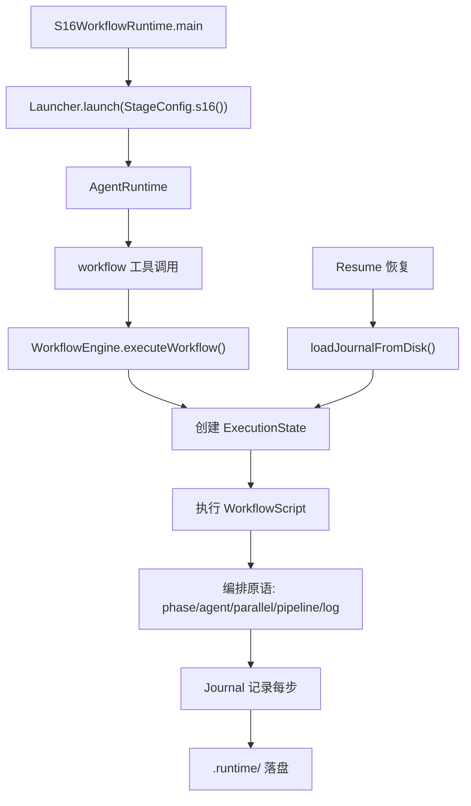
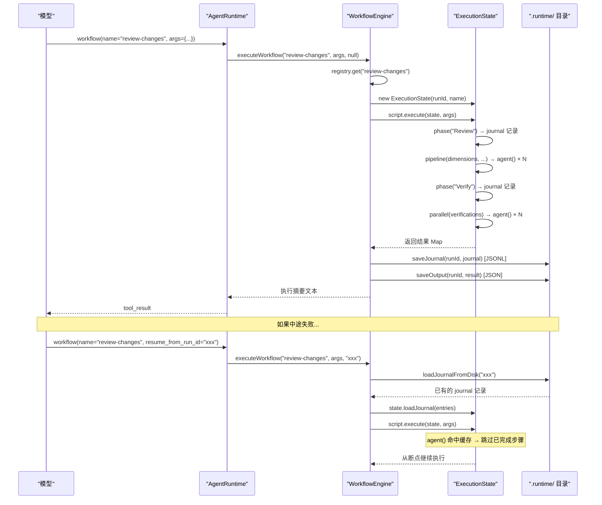

# S16: 工作流运行时

<cite>
**本文引用的文件**
- [WorkflowEngine.java](file://src/main/java/com/learnclaudecode/workflow/WorkflowEngine.java)
- [ExecutionState.java](file://src/main/java/com/learnclaudecode/workflow/ExecutionState.java)
- [WorkflowDefinition.java](file://src/main/java/com/learnclaudecode/workflow/WorkflowDefinition.java)
- [StageConfig.java](file://src/main/java/com/learnclaudecode/agents/StageConfig.java)
- [S16WorkflowRuntime.java](file://src/main/java/com/learnclaudecode/agents/S16WorkflowRuntime.java)
- [AgentRuntime.java](file://src/main/java/com/learnclaudecode/agents/AgentRuntime.java)
- [WorkspacePaths.java](file://src/main/java/com/learnclaudecode/common/WorkspacePaths.java)
</cite>

## 目录
1. [简介](#简介)
2. [教学目标](#教学目标)
3. [项目结构](#项目结构)
4. [核心组件](#核心组件)
5. [架构总览](#架构总览)
6. [详细组件分析](#详细组件分析)
7. [工具列表](#工具列表)
8. [持久化机制](#持久化机制)
9. [与前后阶段的关系](#与前后阶段的关系)
10. [故障排查指南](#故障排查指南)
11. [结论](#结论)

## 简介

> **座右铭："编排形状固定时，写进代码而非对话"**

在 S15（集成运行时）中，Agent 拥有了全部能力，但每次执行多步流程时，模型仍需"现场推理"——每一步做什么、下一步是什么、失败了怎么恢复，全靠模型在对话中临时决定。这带来了两个问题：

1. **不确定性**：同样的需求，模型可能编排不同的步骤序列
2. **不可恢复**：中途失败后，无法从断点继续，只能从头来过

S16 引入**工作流运行时（Workflow Runtime）**：当编排形状固定时（如"先审查、再验证、后汇总"），把它写成代码注册到引擎，模型只需一个 `workflow` 工具调用就能触发整条流水线。工作流的每一步都记入 Journal，失败后可通过 Resume 从断点恢复。

本阶段的核心问题是：**如何把"每次都要模型现场推理的多步流程"变成确定性的、可恢复的代码编排？**

## 教学目标

完成本阶段学习后，你应当能够：

- 理解"编排写进代码"与"编排靠对话推理"的本质区别
- 掌握 WorkflowDefinition 的四要素：name、description、phases、script
- 理解 ExecutionState 的五个编排原语：phase()、log()、agent()、parallel()、pipeline()
- 掌握确定性语义 key 的计算方式及其对 Resume 幂等性的保证
- 了解 Journal 的落盘格式（JSONL）和恢复流程
- 能够解释为什么 WorkflowScript 是函数式接口而非字符串 DSL
- 理解 `.runtime/` 目录的持久化结构

## 项目结构

S16 的工作流能力由"阶段配置 + 引擎 + 执行状态 + 定义模型"四部分构成：

- 阶段配置 `StageConfig.s16()` 启用 `enableWorkflow=true`，暴露 `workflow` 工具
- `WorkflowEngine` 维护工作流注册表，负责执行、持久化与恢复
- `ExecutionState` 是每次运行的"工作台 + 账本"，向脚本暴露编排原语
- `WorkflowDefinition` 描述一个工作流的元数据与编排脚本



**图表来源**
- [S16WorkflowRuntime.java](file://src/main/java/com/learnclaudecode/agents/S16WorkflowRuntime.java)
- [WorkflowEngine.java:39-72](file://src/main/java/com/learnclaudecode/workflow/WorkflowEngine.java#L39-L72)

**章节来源**
- [S16WorkflowRuntime.java](file://src/main/java/com/learnclaudecode/agents/S16WorkflowRuntime.java)
- [WorkflowEngine.java:1-260](file://src/main/java/com/learnclaudecode/workflow/WorkflowEngine.java#L1-L260)
- [ExecutionState.java:1-336](file://src/main/java/com/learnclaudecode/workflow/ExecutionState.java#L1-L336)
- [WorkflowDefinition.java:1-66](file://src/main/java/com/learnclaudecode/workflow/WorkflowDefinition.java#L1-L66)

## 核心组件

- **WorkflowEngine**：工作流引擎，管理注册表、执行调度、Journal 持久化与 Resume
- **ExecutionState**：执行状态，提供编排原语（phase/log/agent/parallel/pipeline）和 Journal 账本
- **WorkflowDefinition**：工作流定义 record，包含 name、description、phases、script
- **WorkflowScript**：函数式接口，定义编排逻辑 `Object execute(ExecutionState state, Map<String, Object> args)`
- **JournalEntry**：Journal 记录，包含 key、kind、label、result

**章节来源**
- [WorkflowEngine.java:29-42](file://src/main/java/com/learnclaudecode/workflow/WorkflowEngine.java#L29-L42)
- [ExecutionState.java:27-72](file://src/main/java/com/learnclaudecode/workflow/ExecutionState.java#L27-L72)
- [WorkflowDefinition.java:19-66](file://src/main/java/com/learnclaudecode/workflow/WorkflowDefinition.java#L19-L66)

## 架构总览

工作流的"注册 → 执行 → 持久化 → 恢复"完整生命周期：



**图表来源**
- [WorkflowEngine.java:100-145](file://src/main/java/com/learnclaudecode/workflow/WorkflowEngine.java#L100-L145)
- [ExecutionState.java:115-136](file://src/main/java/com/learnclaudecode/workflow/ExecutionState.java#L115-L136)

## 详细组件分析

### WorkflowDefinition：工作流定义

```java
public record WorkflowDefinition(
    String name,           // 唯一标识，模型调用时使用
    String description,    // 描述，帮助模型选择合适的工作流
    List<String> phases,   // 阶段标题列表
    WorkflowScript script  // 编排脚本（函数式接口）
) { }
```

设计选择：用**函数式接口**而非字符串 DSL，原因是：
- 编译期类型检查，编排逻辑有 IDE 支持
- 可直接使用 ExecutionState 的全部原语
- 无需额外的解析器/解释器

`validateMeta()` 约束：
- name：1-64 字符，只允许 `[a-zA-Z0-9._-]`
- description：不能为空

### ExecutionState：编排原语

ExecutionState 是工作流脚本的"工作台"，提供五个原语：

| 原语 | 签名 | 语义 |
|------|------|------|
| `phase(title)` | → String | 进入新阶段，记入 journal |
| `log(message)` | → String | 记录进度日志 |
| `agent(prompt, label, schema)` | → AgentResult | 执行一个 agent 步骤（带缓存） |
| `parallel(tasks)` | → List\<AgentResult\> | 并行执行一组 agent 任务 |
| `pipeline(items, stages...)` | → List\<AgentResult\> | 让每个条目独立流经所有阶段 |

#### agent() 与确定性语义 key

agent() 是 Resume 的核心——它通过**确定性语义 key** 实现幂等：

```java
public AgentResult agent(String prompt, String label, Map<String, Object> schema) {
    String key = computeSemanticKey("agent", label, prompt, schema);
    // 在 journal 中查找已有结果
    for (JournalEntry entry : journal) {
        if ("agent".equals(entry.kind()) && key.equals(entry.key())) {
            cacheHits++;
            return decodeResult(entry.result());  // Resume 命中
        }
    }
    // 未命中：执行并记录
    AgentResult result = mockAgent(prompt, label, schema, key);
    journal.add(new JournalEntry(key, "agent", label, encodeResult(result)));
    return result;
}
```

语义 key 计算：`kind|label|prompt|schemaJson` → hashCode → 10 位数字串。
相同输入必定得到相同 key，这是 Resume 幂等的基础。

#### parallel() 与 pipeline()

- **parallel(tasks)**：提交一批 Supplier，收集全部结果。教学版顺序执行，语义上代表"并行"
- **pipeline(items, stages...)**：每个条目独立流经所有阶段函数，条目间无屏障

两者的区别：
- parallel = "多件事同时做，全做完再往下走"（屏障语义）
- pipeline = "每个条目独立穿越所有阶段，不等其他条目"（流水线语义）

**章节来源**
- [ExecutionState.java:80-183](file://src/main/java/com/learnclaudecode/workflow/ExecutionState.java#L80-L183)
- [ExecutionState.java:260-303](file://src/main/java/com/learnclaudecode/workflow/ExecutionState.java#L260-L303)

### WorkflowEngine：注册与执行

引擎的核心职责：

1. **注册表管理**：LinkedHashMap 保持注册顺序，支持运行时动态注册新工作流
2. **执行调度**：为每次运行分配 runId、创建 ExecutionState、调用 script
3. **持久化**：journal（JSONL）+ output（JSON）落盘到 `.runtime/`
4. **Resume**：从磁盘加载 journal 回灌到 state，让 agent() 命中缓存

内置示例工作流 `review-changes`：
```java
registerWorkflow("review-changes", "Review code changes across multiple dimensions",
    List.of("Review", "Verify"),
    (state, args) -> {
        state.phase("Review");
        var dimensions = List.of("correctness", "security", "performance");
        var reviews = state.pipeline(dimensions, item ->
            state.agent("Review the code changes for " + item + " issues",
                "review-" + item, null));
        state.phase("Verify");
        var verifications = state.parallel(
            reviews.stream()
                .map(r -> (Supplier<AgentResult>) () ->
                    state.agent("Verify finding: " + r.output(), "verify", null))
                .toList());
        return Map.of("reviews", reviews.size(), "verifications", verifications.size());
    });
```

**章节来源**
- [WorkflowEngine.java:29-184](file://src/main/java/com/learnclaudecode/workflow/WorkflowEngine.java#L29-L184)

## 工具列表

S16 阶段在 S15 全部工具基础上新增：

| 工具名 | 功能 | 关键参数 |
|--------|------|---------|
| `workflow` | 执行一个已注册的工作流 | name(required), args(object), resume_from_run_id(string) |

**使用示例**：

```
用户：执行代码审查工作流
Agent 调用：workflow(name="review-changes", args={"focus": "security"})
返回：Workflow 'review-changes' completed
  runId: a1b2c3d4-...
  resumedFrom: (fresh run)
  phases completed: 2
  agents run: 6
  tokens used: 420
  cached hits: 0
  result: {"reviews":3,"verifications":3}
```

```
用户：上次执行到一半失败了，从断点继续
Agent 调用：workflow(name="review-changes", args={}, resume_from_run_id="a1b2c3d4-...")
返回：Workflow 'review-changes' completed
  runId: a1b2c3d4-...
  resumedFrom: a1b2c3d4-...
  phases completed: 2
  agents run: 2
  tokens used: 420
  cached hits: 4
  result: {"reviews":3,"verifications":3}
```

**章节来源**
- [StageConfig.java:621-640](file://src/main/java/com/learnclaudecode/agents/StageConfig.java#L621-L640)

## 持久化机制

### 存储结构

```
.runtime/
├── a1b2c3d4-....journal.jsonl    # Journal 账本（一行一条）
├── a1b2c3d4-....output.json      # 执行结果与统计
├── e5f6g7h8-....journal.jsonl
├── e5f6g7h8-....output.json
└── ...
```

### Journal 格式（JSONL）

每行一条 JournalEntry 的 JSON：

```json
{"key":"phase:Review","kind":"phase","label":"Review","result":"Review"}
{"key":"0384756291","kind":"agent","label":"review-correctness","result":"{\"output\":\"[mock-agent:review-correctness] ...\",\"tokens\":72}"}
{"key":"0192837465","kind":"agent","label":"review-security","result":"{\"output\":\"[mock-agent:review-security] ...\",\"tokens\":55}"}
```

### Output 格式（JSON）

```json
{
  "runId": "a1b2c3d4-...",
  "workflow": "review-changes",
  "status": "completed",
  "result": {"reviews": 3, "verifications": 3},
  "agents": 6,
  "tokens": 420,
  "cacheHits": 0
}
```

### Resume 流程

1. 模型传入 `resume_from_run_id`
2. 引擎从 `.runtime/<runId>.journal.jsonl` 加载已有 journal
3. 调用 `state.loadJournal(entries)` 回灌到 ExecutionState
4. 重新执行 script：agent() 对每个步骤计算语义 key
5. key 命中 journal 中已有记录 → 直接返回缓存结果（cacheHits++）
6. key 未命中 → 正常执行（说明上次在这步之后失败了）

**章节来源**
- [WorkflowEngine.java:186-258](file://src/main/java/com/learnclaudecode/workflow/WorkflowEngine.java#L186-L258)
- [ExecutionState.java:194-204](file://src/main/java/com/learnclaudecode/workflow/ExecutionState.java#L194-L204)

## 与前后阶段的关系

### 前置阶段

- **S15（集成运行时）**：S16 继承 S15 的全部工具和能力开关，在此基础上新增 `enableWorkflow=true`
- **S01（Agent Loop）**：工作流中的 agent() 原语本质上是一次简化的 agent 循环调用
- **S10（任务系统）**：任务板可以作为工作流的输入——"为每个待办任务启动一轮审查"

### 后续阶段

- **S17（目标循环）**：工作流执行完毕后，GoalController 可以评判"工作流输出是否满足目标条件"

### 设计演进

```
S01: 模型在对话中"现场推理"每一步
S15: 全能力集成，但编排仍靠模型即兴
S16: 固定编排写进代码，确定性执行 ← 你在这里
S17: 目标决定何时停止
```

**章节来源**
- [StageConfig.java:621-640](file://src/main/java/com/learnclaudecode/agents/StageConfig.java#L621-L640)

## 故障排查指南

| 现象 | 可能原因 | 定位方法 |
|------|---------|---------|
| "Unknown workflow" | 工作流未注册或名称拼写错误 | 调用 WorkflowEngine.listWorkflows() |
| Resume 后仍从头执行 | runId 错误或 journal 文件不存在 | 检查 .runtime/ 下是否有对应文件 |
| cacheHits 为 0（预期 > 0） | prompt/label 发生变化导致语义 key 不同 | 对比两次运行的 journal key 列 |
| 工作流名称被拒绝 | 包含非法字符（只允许 alphanumeric/._-） | 检查 validateMeta 的约束 |
| 执行中途异常 | script 内部抛出未捕获异常 | 检查 output.json 中的 error 字段 |

## 结论

S16 引入了"确定性编排"的概念：

1. **编排即代码**——固定的多步流程用 WorkflowScript 函数式接口定义，而非让模型每次现场推理
2. **五个原语**——phase/log/agent/parallel/pipeline 覆盖常见的编排形状
3. **Journal 账本**——每一步都记录语义 key 和结果，支撑可追溯性
4. **Resume 幂等**——确定性语义 key 保证失败重跑时跳过已完成步骤
5. **持久化落盘**——`.runtime/` 目录让工作流的执行痕迹跨重启可恢复

工作流运行时的价值在于：把"不确定的对话编排"变成"确定的代码执行"，同时保留了 Agent 的灵活性——模型仍然决定"何时调用哪个工作流"，但工作流内部的步骤序列是固定的。
