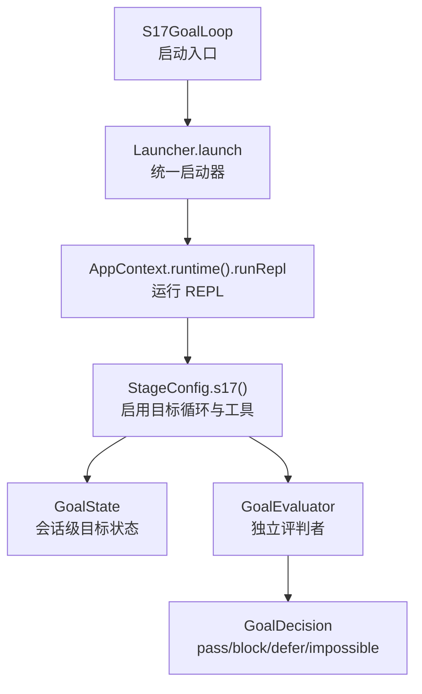
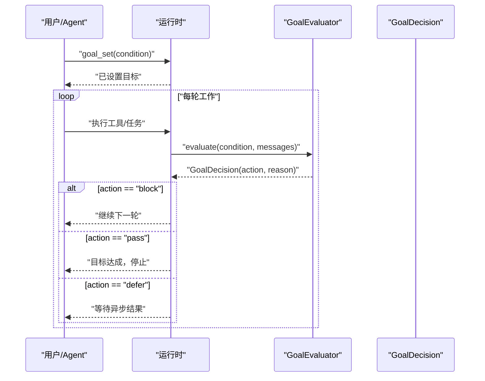
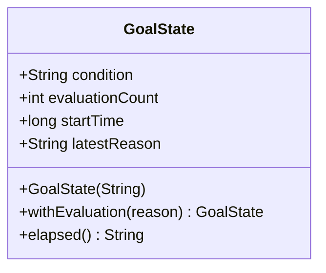
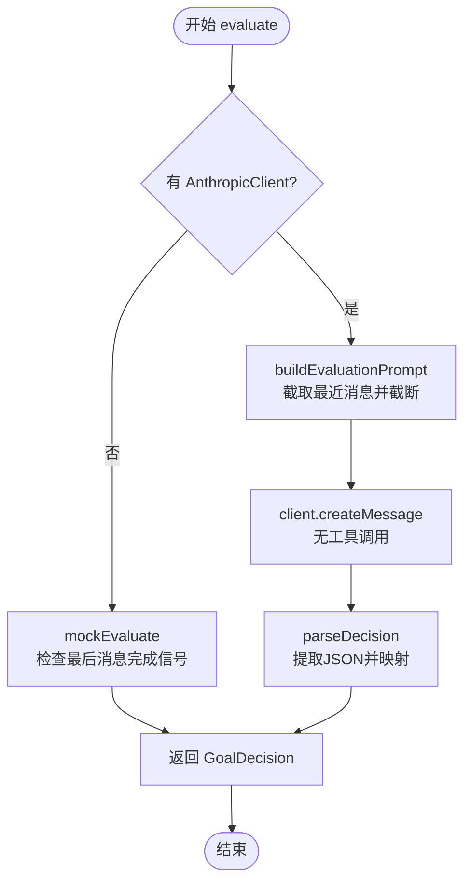
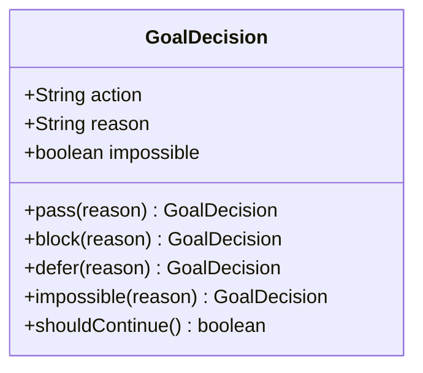
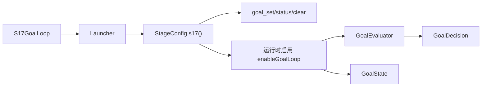

# S17: 目标循环

<cite>
**本文引用的文件**
- [S17GoalLoop.java](file://src/main/java/com/learnclaudecode/agents/S17GoalLoop.java)
- [Launcher.java](file://src/main/java/com/learnclaudecode/agents/Launcher.java)
- [StageConfig.java](file://src/main/java/com/learnclaudecode/agents/StageConfig.java)
- [GoalState.java](file://src/main/java/com/learnclaudecode/goal/GoalState.java)
- [GoalEvaluator.java](file://src/main/java/com/learnclaudecode/goal/GoalEvaluator.java)
- [GoalDecision.java](file://src/main/java/com/learnclaudecode/goal/GoalDecision.java)
- [GoalControllerTest.java](file://src/test/java/com/learnclaudecode/goal/GoalControllerTest.java)
</cite>

## 目录
1. [简介](#简介)
2. [项目结构](#项目结构)
3. [核心组件](#核心组件)
4. [架构总览](#架构总览)
5. [详细组件分析](#详细组件分析)
6. [依赖关系分析](#依赖关系分析)
7. [性能与可扩展性](#性能与可扩展性)
8. [故障排查指南](#故障排查指南)
9. [结论](#结论)
10. [附录](#附录)

## 简介
本章节围绕“S17: 目标循环”展开，讲解如何通过“目标条件 + 独立评判者”的机制，让 Agent 在会话内持续自主迭代，直到目标达成才停止。该设计强调“执行者与评判者分离”，并通过安全出口（最大轮数、连续 block 上限）避免无限循环。

## 项目结构
S17 的目标循环由“启动入口 → 阶段配置 → 运行时能力开关 → 目标状态与评判器”构成：
- 启动入口：S17GoalLoop 仅负责选择 s17 阶段配置并启动统一运行时。
- 阶段配置：StageConfig.s17() 暴露 goal_set / goal_status / goal_clear 工具，并开启 enableGoalLoop。
- 目标状态：GoalState 记录当前活跃目标的判定次数、起始时间与最近理由。
- 评判器：GoalEvaluator 基于对话历史调用模型或启发式规则，输出 pass/block/defer/impossible。
- 决策对象：GoalDecision 封装动作、理由与不可达标记，供运行时决定是否继续循环。

图表来源
- [S17GoalLoop.java:18-21](file://src/main/java/com/learnclaudecode/agents/S17GoalLoop.java#L18-L21)
- [Launcher.java:23-26](file://src/main/java/com/learnclaudecode/agents/Launcher.java#L23-L26)
- [StageConfig.java:649-663](file://src/main/java/com/learnclaudecode/agents/StageConfig.java#L649-L663)
- [GoalState.java:16-39](file://src/main/java/com/learnclaudecode/goal/GoalState.java#L16-L39)
- [GoalEvaluator.java:52-70](file://src/main/java/com/learnclaudecode/goal/GoalEvaluator.java#L52-L70)
- [GoalDecision.java:19-73](file://src/main/java/com/learnclaudecode/goal/GoalDecision.java#L19-L73)

章节来源
- [S17GoalLoop.java:1-22](file://src/main/java/com/learnclaudecode/agents/S17GoalLoop.java#L1-L22)
- [Launcher.java:1-28](file://src/main/java/com/learnclaudecode/agents/Launcher.java#L1-L28)
- [StageConfig.java:644-664](file://src/main/java/com/learnclaudecode/agents/StageConfig.java#L644-L664)

## 核心组件
- 启动器与阶段配置
  - S17GoalLoop 通过 Launcher.launch(StageConfig.s17()) 启动目标循环模式。
  - StageConfig.s17() 打开 enableGoalLoop，并提供 goal_set / goal_status / goal_clear 三个工具，用于设定、查询与清除目标。
- 目标状态
  - GoalState 维护 condition、evaluationCount、startTime、latestReason，并提供 withEvaluation 与 elapsed 方法。
- 评判器
  - GoalEvaluator 根据 messages 构造提示词，调用 AnthropicClient（若存在）或走 mock 启发式规则，返回 GoalDecision。
- 决策对象
  - GoalDecision 提供 pass/block/defer/impossible 工厂方法与 shouldContinue 判断。

章节来源
- [S17GoalLoop.java:18-21](file://src/main/java/com/learnclaudecode/agents/S17GoalLoop.java#L18-L21)
- [StageConfig.java:649-663](file://src/main/java/com/learnclaudecode/agents/StageConfig.java#L649-L663)
- [GoalState.java:16-53](file://src/main/java/com/learnclaudecode/goal/GoalState.java#L16-L53)
- [GoalEvaluator.java:21-70](file://src/main/java/com/learnclaudecode/goal/GoalEvaluator.java#L21-L70)
- [GoalDecision.java:19-73](file://src/main/java/com/learnclaudecode/goal/GoalDecision.java#L19-L73)

## 架构总览
目标循环的关键在于“每轮结束后进行独立评判”。流程如下：
- 用户或 Agent 通过 goal_set 设置目标条件。
- 每轮工作完成后，运行时将当前对话历史发送给 GoalEvaluator。
- 评判器返回 GoalDecision：
  - pass：目标达成，停止循环；
  - block：未达成，回到同一循环继续；
  - defer：等待异步结果，本轮不判定；
  - impossible：目标不可达，停止但标记为放弃式终止。
- 当连续 block 达到安全上限时，强制退出以避免死循环。

图表来源
- [StageConfig.java:649-663](file://src/main/java/com/learnclaudecode/agents/StageConfig.java#L649-L663)
- [GoalEvaluator.java:52-70](file://src/main/java/com/learnclaudecode/goal/GoalEvaluator.java#L52-L70)
- [GoalDecision.java:19-73](file://src/main/java/com/learnclaudecode/goal/GoalDecision.java#L19-L73)

## 详细组件分析

### 启动与配置
- S17GoalLoop 作为教学入口，仅调用 Launcher.launch(StageConfig.s17())。
- StageConfig.s17() 从 s04 分叉，叠加权限与 Hook，并开启 enableGoalLoop，同时注入 goal_* 工具集。

章节来源
- [S17GoalLoop.java:18-21](file://src/main/java/com/learnclaudecode/agents/S17GoalLoop.java#L18-L21)
- [StageConfig.java:649-663](file://src/main/java/com/learnclaudecode/agents/StageConfig.java#L649-L663)

### 目标状态管理
- GoalState 以不可变 record 形式保存目标条件、评判次数、起始时间与最近理由。
- withEvaluation 每次评判后生成新状态，便于追踪评估轨迹。
- elapsed 提供人类可读的持续时间，便于调试与展示。

图表来源
- [GoalState.java:16-53](file://src/main/java/com/learnclaudecode/goal/GoalState.java#L16-L53)

章节来源
- [GoalState.java:16-53](file://src/main/java/com/learnclaudecode/goal/GoalState.java#L16-L53)

### 评判器与决策
- GoalEvaluator 的职责是“只判不动”：
  - 构建包含目标条件与最近消息的提示词；
  - 若有 AnthropicClient，则发起一次独立模型调用；
  - 若无客户端，则走 mock 启发式（检测最后消息是否包含完成信号）。
- parseDecision 解析 JSON 并映射到 GoalDecision；异常时回退为 block，保证“宁可继续也不误停”。

图表来源
- [GoalEvaluator.java:52-70](file://src/main/java/com/learnclaudecode/goal/GoalEvaluator.java#L52-L70)
- [GoalEvaluator.java:82-102](file://src/main/java/com/learnclaudecode/goal/GoalEvaluator.java#L82-L102)
- [GoalEvaluator.java:127-142](file://src/main/java/com/learnclaudecode/goal/GoalEvaluator.java#L127-L142)
- [GoalEvaluator.java:172-182](file://src/main/java/com/learnclaudecode/goal/GoalEvaluator.java#L172-L182)

章节来源
- [GoalEvaluator.java:21-70](file://src/main/java/com/learnclaudecode/goal/GoalEvaluator.java#L21-L70)
- [GoalEvaluator.java:82-102](file://src/main/java/com/learnclaudecode/goal/GoalEvaluator.java#L82-L102)
- [GoalEvaluator.java:127-142](file://src/main/java/com/learnclaudecode/goal/GoalEvaluator.java#L127-L142)
- [GoalEvaluator.java:172-182](file://src/main/java/com/learnclaudecode/goal/GoalEvaluator.java#L172-L182)

### 决策对象与循环控制
- GoalDecision 提供四种语义：
  - pass：目标达成；
  - block：继续循环；
  - defer：等待异步；
  - impossible：不可达而终止。
- shouldContinue 仅在 action 为 block 时返回 true，简化运行时逻辑。

图表来源
- [GoalDecision.java:19-73](file://src/main/java/com/learnclaudecode/goal/GoalDecision.java#L19-L73)

章节来源
- [GoalDecision.java:19-73](file://src/main/java/com/learnclaudecode/goal/GoalDecision.java#L19-L73)

### 测试覆盖与行为验证
- 测试用例覆盖了：
  - 设置/清除目标、状态查询、活跃判断；
  - 无目标时直接返回 pass；
  - mock 模式下含完成信号返回 pass 并清除目标；
  - 不含完成信号返回 block 且保留目标；
  - 连续 block 达到安全上限后强制 pass 并清除目标。

章节来源
- [GoalControllerTest.java:38-148](file://src/test/java/com/learnclaudecode/goal/GoalControllerTest.java#L38-L148)

## 依赖关系分析
- S17GoalLoop 依赖 Launcher 与 StageConfig.s17()。
- StageConfig.s17() 依赖权限与 Hook 能力，并注入 goal_* 工具。
- GoalEvaluator 依赖 AnthropicClient（可选）与 JsonUtils，输出 GoalDecision。
- GoalState 与 GoalDecision 为纯数据对象，被控制器与运行时消费。

图表来源
- [S17GoalLoop.java:18-21](file://src/main/java/com/learnclaudecode/agents/S17GoalLoop.java#L18-L21)
- [StageConfig.java:649-663](file://src/main/java/com/learnclaudecode/agents/StageConfig.java#L649-L663)
- [GoalEvaluator.java:52-70](file://src/main/java/com/learnclaudecode/goal/GoalEvaluator.java#L52-L70)
- [GoalDecision.java:19-73](file://src/main/java/com/learnclaudecode/goal/GoalDecision.java#L19-L73)
- [GoalState.java:16-53](file://src/main/java/com/learnclaudecode/goal/GoalState.java#L16-L53)

章节来源
- [S17GoalLoop.java:18-21](file://src/main/java/com/learnclaudecode/agents/S17GoalLoop.java#L18-L21)
- [StageConfig.java:649-663](file://src/main/java/com/learnclaudecode/agents/StageConfig.java#L649-L663)
- [GoalEvaluator.java:52-70](file://src/main/java/com/learnclaudecode/goal/GoalEvaluator.java#L52-L70)
- [GoalDecision.java:19-73](file://src/main/java/com/learnclaudecode/goal/GoalDecision.java#L19-L73)
- [GoalState.java:16-53](file://src/main/java/com/learnclaudecode/goal/GoalState.java#L16-L53)

## 性能与可扩展性
- 评判输入裁剪：仅取最近若干条消息，单条内容截断，降低请求体积与延迟。
- 失败安全：评判异常时返回 block，避免误停导致任务中断。
- 可扩展点：
  - 替换评判策略：可接入更复杂的评测模型或规则引擎；
  - 调整裁剪参数：MAX_MESSAGES、MAX_MESSAGE_CHARS 可按场景调优；
  - 增加异步支持：通过 defer 配合后台任务，实现非阻塞推进。

[本节为通用指导，不直接分析具体文件]

## 故障排查指南
- 无法连接模型：
  - 现象：评判器抛出异常或返回空响应。
  - 处理：自动降级为 mock 启发式，确保演示可用；生产环境需配置有效客户端。
- 目标永远不达成：
  - 现象：连续 block 触发安全上限，强制 pass 并清除目标。
  - 处理：检查目标条件是否合理，或调整消息内容与完成信号。
- 状态不一致：
  - 现象：goal_status 显示异常或缺失信息。
  - 处理：确认 goal_set 成功，检查是否有 clear_goal 操作。

章节来源
- [GoalEvaluator.java:52-70](file://src/main/java/com/learnclaudecode/goal/GoalEvaluator.java#L52-L70)
- [GoalEvaluator.java:172-182](file://src/main/java/com/learnclaudecode/goal/GoalEvaluator.java#L172-L182)
- [GoalControllerTest.java:134-148](file://src/test/java/com/learnclaudecode/goal/GoalControllerTest.java#L134-L148)

## 结论
S17 目标循环通过“目标条件 + 独立评判者”的解耦设计，实现了 Agent 的自治闭环。借助 GoalState 与 GoalDecision，系统能够稳定地驱动多轮迭代，并在必要时通过安全出口保护运行稳定性。配合权限、Hook 与工具扩展，目标循环可作为复杂任务的自治骨架。

[本节为总结，不直接分析具体文件]

## 附录
- 关键概念速查
  - 目标条件：可验证的终止条件，由 goal_set 设定。
  - 评判者：独立于执行者的模型或规则，仅做判断。
  - 决策对象：封装 pass/block/defer/impossible 及理由。
  - 安全出口：防止无限循环的强制退出机制。

[本节为补充说明，不直接分析具体文件]