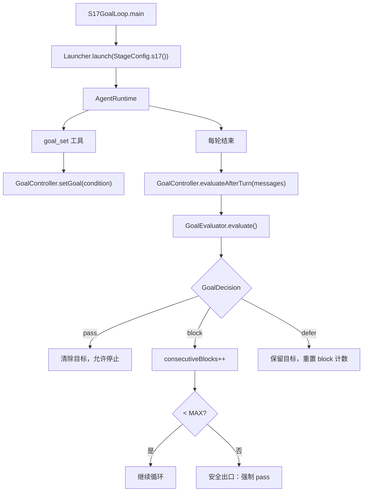
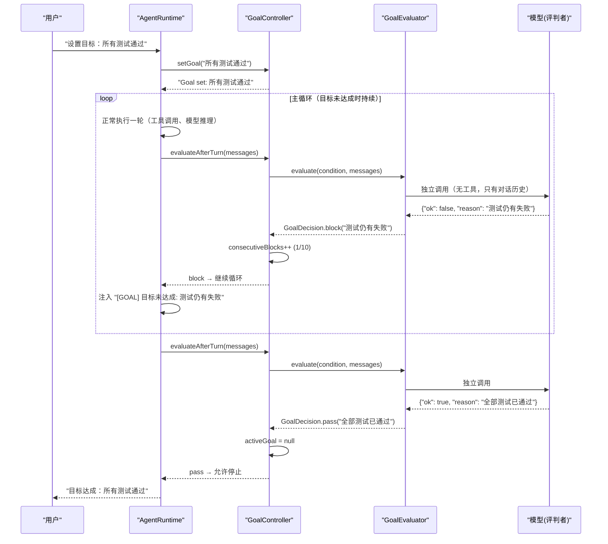

# S17: 目标循环

<cite>
**本文引用的文件**
- [GoalController.java](file://src/main/java/com/learnclaudecode/goal/GoalController.java)
- [GoalEvaluator.java](file://src/main/java/com/learnclaudecode/goal/GoalEvaluator.java)
- [GoalState.java](file://src/main/java/com/learnclaudecode/goal/GoalState.java)
- [GoalDecision.java](file://src/main/java/com/learnclaudecode/goal/GoalDecision.java)
- [StageConfig.java](file://src/main/java/com/learnclaudecode/agents/StageConfig.java)
- [S17GoalLoop.java](file://src/main/java/com/learnclaudecode/agents/S17GoalLoop.java)
- [AgentRuntime.java](file://src/main/java/com/learnclaudecode/agents/AgentRuntime.java)
</cite>

## 目录
1. [简介](#简介)
2. [教学目标](#教学目标)
3. [项目结构](#项目结构)
4. [核心组件](#核心组件)
5. [架构总览](#架构总览)
6. [详细组件分析](#详细组件分析)
7. [工具列表](#工具列表)
8. [安全出口机制](#安全出口机制)
9. [与前后阶段的关系](#与前后阶段的关系)
10. [故障排查指南](#故障排查指南)
11. [结论](#结论)

## 简介

> **座右铭："目标决定循环何时可以停止"**

S16 引入了确定性编排，但 Agent 的主循环何时终止仍然靠一个简单的条件：模型返回 `stop_reason=end_turn`。这意味着**模型自己决定什么时候停下来**——执行者既当运动员又当裁判。

S17 引入**目标循环（Goal Loop）**：由一个独立的评判者（不带任何工具，只能读取对话历史）来判断"目标是否已达成"。如果未达成（block），主循环继续工作；如果达成（pass），循环才被允许停止。

这是一个关键的架构决策：**把"是否完成"的判断权从执行者手中拿走，交给独立的评判者**。

本阶段的核心问题是：**如何让 Agent 在目标未达成时自动继续工作，同时避免无限循环？**

## 教学目标

完成本阶段学习后，你应当能够：

- 理解"评判者与执行者分离"的设计原则
- 掌握 GoalController 的 setGoal / evaluateAfterTurn / clearGoal 生命周期
- 理解 GoalDecision 的四种判定：pass / block / defer / impossible
- 了解 GoalEvaluator 如何通过独立模型调用实现客观评判
- 掌握安全出口（MAX_CONSECUTIVE_BLOCKS=10）防止死循环的机制
- 理解 GoalState 的不可变更新模式（withEvaluation 返回新实例）
- 能够解释为什么评判失败时默认返回 block 而非 pass

## 项目结构

S17 的目标循环能力由"阶段配置 + 控制器 + 评判者 + 状态 + 决定"五部分构成：

- 阶段配置 `StageConfig.s17()` 启用 `enableGoalLoop=true`，暴露目标管理工具
- `GoalController` 管理会话级目标，驱动评判，实施安全出口
- `GoalEvaluator` 独立模型调用，判断目标是否达成
- `GoalState` 不可变 record，记录目标条件与评判历史
- `GoalDecision` 评判结果 record，决定循环是否继续



**图表来源**
- [S17GoalLoop.java](file://src/main/java/com/learnclaudecode/agents/S17GoalLoop.java)
- [GoalController.java:97-126](file://src/main/java/com/learnclaudecode/goal/GoalController.java#L97-L126)

**章节来源**
- [S17GoalLoop.java](file://src/main/java/com/learnclaudecode/agents/S17GoalLoop.java)
- [GoalController.java:1-137](file://src/main/java/com/learnclaudecode/goal/GoalController.java#L1-L137)
- [GoalEvaluator.java:1-203](file://src/main/java/com/learnclaudecode/goal/GoalEvaluator.java#L1-L203)
- [GoalState.java:1-55](file://src/main/java/com/learnclaudecode/goal/GoalState.java#L1-L55)
- [GoalDecision.java:1-75](file://src/main/java/com/learnclaudecode/goal/GoalDecision.java#L1-L75)

## 核心组件

- **GoalController**：会话级目标控制器，驱动评判循环，实施安全出口
- **GoalEvaluator**：独立评判者，通过模型调用或启发式 mock 判断目标达成
- **GoalState**：不可变 record（condition, evaluationCount, startTime, latestReason）
- **GoalDecision**：评判结果 record（action, reason, impossible）

**章节来源**
- [GoalController.java:18-36](file://src/main/java/com/learnclaudecode/goal/GoalController.java#L18-L36)
- [GoalEvaluator.java:21-43](file://src/main/java/com/learnclaudecode/goal/GoalEvaluator.java#L21-L43)

## 架构总览

目标循环在 AgentRuntime 主循环中的位置：



**图表来源**
- [GoalController.java:97-126](file://src/main/java/com/learnclaudecode/goal/GoalController.java#L97-L126)
- [GoalEvaluator.java:52-70](file://src/main/java/com/learnclaudecode/goal/GoalEvaluator.java#L52-L70)

## 详细组件分析

### GoalController：目标生命周期

GoalController 管理三个核心状态：

```java
public class GoalController {
    private static final int MAX_CONSECUTIVE_BLOCKS = 10;
    private final GoalEvaluator evaluator;
    private GoalState activeGoal;       // null = 无活跃目标
    private int consecutiveBlocks;      // 连续 block 计数
}
```

**生命周期**：

1. **setGoal(condition)**：创建新 GoalState，重置 consecutiveBlocks=0
2. **evaluateAfterTurn(messages)**：每轮结束后调用评判者
3. **clearGoal()**：手动清除目标（用户或模型主动放弃）

**evaluateAfterTurn 决策树**：

```
activeGoal == null?
  └─ 是 → 返回 pass("No active goal")
  └─ 否 → evaluator.evaluate(condition, messages)
           ├─ decision.shouldContinue() == true (block)
           │   ├─ consecutiveBlocks++
           │   ├─ >= MAX_CONSECUTIVE_BLOCKS?
           │   │   ├─ 是 → 安全出口：清除目标，返回 pass
           │   │   └─ 否 → 返回 block（继续循环）
           ├─ action == "pass"
           │   └─ 清除目标，返回 pass（循环可停止）
           └─ action == "defer"
               └─ consecutiveBlocks=0，保留目标，返回 defer
```

**线程安全**：所有公开方法加 `synchronized`，因为评判可能来自不同线程。

### GoalEvaluator：独立评判者

评判者的关键设计——**与执行者完全隔离**：

```java
private static final String EVALUATOR_SYSTEM =
    "You are an independent evaluator. Judge whether the following goal condition has been met "
    + "based solely on the conversation history provided. You have no tools and cannot act; "
    + "you can only judge. Respond in JSON only: "
    + "{\"ok\": bool, \"reason\": \"...\", \"impossible\": bool}";
```

- **无工具**：评判者不能执行任何操作，只能读取对话历史
- **输入截断**：最多取最近 10 条消息（MAX_MESSAGES），每条最多 500 字符（MAX_MESSAGE_CHARS）
- **输出格式**：强制 JSON，包含 ok/reason/impossible 三个字段
- **fail-safe**：评判调用异常时返回 block（宁可继续也不误停）

**Mock 模式**（无 API Key 时）：

```java
private GoalDecision mockEvaluate(String condition, List<Map<String, Object>> messages) {
    String last = stringifyContent(messages.get(messages.size() - 1).get("content")).toLowerCase();
    boolean done = last.contains("done") || last.contains("complete") || last.contains("pass");
    if (done) return GoalDecision.pass("[mock] goal appears satisfied");
    return GoalDecision.block("[mock] goal not yet satisfied; keep working toward: " + condition);
}
```

### GoalState：不可变状态

```java
public record GoalState(
    String condition,        // 目标条件文本
    int evaluationCount,     // 已评判次数
    long startTime,          // 目标设定时刻
    String latestReason      // 最近一次评判理由
) {
    public GoalState(String condition) {
        this(condition, 0, System.currentTimeMillis(), null);
    }
    public GoalState withEvaluation(String reason) {
        return new GoalState(condition, evaluationCount + 1, startTime, reason);
    }
    public String elapsed() { /* 格式化时长 */ }
}
```

设计选择：用 record + withXxx() 模式实现不可变更新，每次评判返回新实例，避免并发修改问题。

### GoalDecision：评判结果

```java
public record GoalDecision(String action, String reason, boolean impossible) {
    public static GoalDecision pass(String reason);      // 目标达成
    public static GoalDecision block(String reason);     // 未达成，继续
    public static GoalDecision defer(String reason);     // 等待异步结果
    public static GoalDecision impossible(String reason); // 不可达（pass+impossible=true）
    public boolean shouldContinue();                     // action=="block" → true
}
```

四种判定的语义：

| 判定 | action | impossible | 运行时行为 |
|------|--------|-----------|-----------|
| pass | "pass" | false | 清除目标，允许循环停止 |
| block | "block" | false | 累加计数，继续循环 |
| defer | "defer" | false | 重置计数，保留目标，继续循环 |
| impossible | "pass" | true | 清除目标（放弃式终止） |

**章节来源**
- [GoalController.java:18-137](file://src/main/java/com/learnclaudecode/goal/GoalController.java#L18-L137)
- [GoalEvaluator.java:21-203](file://src/main/java/com/learnclaudecode/goal/GoalEvaluator.java#L21-L203)
- [GoalState.java:1-55](file://src/main/java/com/learnclaudecode/goal/GoalState.java#L1-L55)
- [GoalDecision.java:1-75](file://src/main/java/com/learnclaudecode/goal/GoalDecision.java#L1-L75)

## 工具列表

S17 阶段在 S16 全部工具基础上新增：

| 工具名 | 功能 | 关键参数 |
|--------|------|---------|
| `goal_set` | 设定一个目标条件 | condition(string, required) |
| `goal_status` | 查看当前目标与评判状态 | 无 |
| `goal_clear` | 手动清除当前目标 | 无 |

**使用示例**：

```
用户：持续工作直到所有测试通过
Agent 调用：goal_set(condition="所有单元测试通过且无编译错误")
返回：Goal set: 所有单元测试通过且无编译错误. The agent will continue working until this condition is met.

[Agent 自动继续工作...]
[每轮结束后，评判者检查对话历史]

Agent 调用：goal_status()
返回：Active goal: 所有单元测试通过且无编译错误
  elapsed: 2m 35s
  evaluations: 4
  consecutive blocks: 1/10
  latest reason: 还有 2 个测试失败

[评判者最终判定 pass]
返回：Goal cleared: 全部测试已通过
```

**章节来源**
- [StageConfig.java](file://src/main/java/com/learnclaudecode/agents/StageConfig.java)

## 安全出口机制

### 为什么需要安全出口？

如果评判者持续返回 block（可能因为目标本身不可达、评判逻辑有 bug、或模型幻觉），Agent 会陷入无限循环，持续消耗 API token 而无法停止。

### MAX_CONSECUTIVE_BLOCKS = 10

```java
if (consecutiveBlocks >= MAX_CONSECUTIVE_BLOCKS) {
    activeGoal = null;
    consecutiveBlocks = 0;
    return GoalDecision.pass("Safety limit reached (10 consecutive blocks). Returning control to user.");
}
```

设计考量：
- **10 次**是经验值：足够让 Agent 尝试多种策略，又不会无限消耗
- **连续**而非累计：defer 判定会重置计数，避免"偶尔 defer"误触安全出口
- **强制 pass**：安全出口触发后清除目标，把控制权交还用户
- **明确告知**：reason 中说明是安全出口触发，而非目标真正达成

### 计数重置规则

| 判定 | 对 consecutiveBlocks 的影响 |
|------|--------------------------|
| block | +1 |
| pass | 重置为 0（目标清除） |
| defer | 重置为 0（保留目标但不计入连续 block） |
| setGoal() | 重置为 0（新目标开始） |

**章节来源**
- [GoalController.java:19-20](file://src/main/java/com/learnclaudecode/goal/GoalController.java#L19-L20)
- [GoalController.java:107-116](file://src/main/java/com/learnclaudecode/goal/GoalController.java#L107-L116)

## 与前后阶段的关系

### 前置阶段

- **S01（Agent Loop）**：目标循环是 Agent 主循环的扩展——在每轮结束时插入评判步骤
- **S04（钩子系统）**：GoalController 可以看作一种特殊的 Stop hook——在循环即将停止时拦截并评判
- **S15（集成运行时）**：S17 继承 S15 的全部能力，目标达成可能需要调用任何工具
- **S16（工作流运行时）**：工作流执行完毕后，目标评判可以检查"工作流输出是否满足条件"

### 后续阶段

S17 是本学习旅程的最后一站。完成 S17 后，你拥有了一个完整的 AI Agent 运行时：
- 能行动（S01-S02）
- 有边界（S03-S04）
- 能规划（S05-S06）
- 有知识（S07-S09）
- 能持久（S10-S12）
- 能协作（S13）
- 可扩展（S14-S15）
- 能编排（S16）
- 知何时停（S17）

### 设计演进

```
S01: stop_reason=end_turn 时停止（模型自判）
S04: Stop hook 可以阻断停止（外部拦截）
S17: 独立评判者决定是否允许停止 ← 你在这里
```

**章节来源**
- [GoalController.java:10-17](file://src/main/java/com/learnclaudecode/goal/GoalController.java#L10-L17)
- [StageConfig.java](file://src/main/java/com/learnclaudecode/agents/StageConfig.java)

## 故障排查指南

| 现象 | 可能原因 | 定位方法 |
|------|---------|---------|
| 目标设定后循环立即停止 | 评判者返回 pass（最后一条消息含 done/complete） | 检查 goal_status 的 latestReason |
| 循环不停（超过 10 轮） | consecutiveBlocks 被 defer 反复重置 | 检查评判者是否频繁返回 defer |
| "Safety limit reached" | 连续 10 次 block | 目标可能不可达，检查条件描述 |
| 评判者返回 block 但目标明显已达成 | 对话历史被截断，评判者看不到关键信息 | 增加 MAX_MESSAGES 或 MAX_MESSAGE_CHARS |
| mock 模式总返回 block | 最后一条消息不含 done/complete/pass | 让 Agent 在完成时输出包含这些词 |
| GoalEvaluator 抛异常 | API Key 无效或网络问题 | 检查异常日志，确认退化为 mock |

## 结论

S17 引入了 Agent 系统中最重要的控制机制之一——**自主终止判断**：

1. **评判者独立**——GoalEvaluator 没有工具，只能读取历史，避免"既当运动员又当裁判"
2. **四种判定**——pass/block/defer/impossible 覆盖所有终止场景
3. **安全出口**——MAX_CONSECUTIVE_BLOCKS=10 防止死循环，把控制权交还用户
4. **fail-safe 设计**——评判异常时返回 block（宁可继续也不误停）
5. **不可变状态**——GoalState 用 record + withXxx() 模式，线程安全

通过 S17，你的 Agent 不仅能做事、能协作、能编排，还能**知道什么时候该停下来**。这是从"工具"到"自治体"的最后一步。
