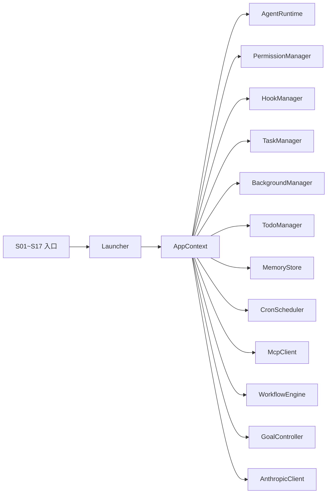

# 学习阶段详解

<cite>
**本文引用的文件**
- [S01AgentLoop.java](file://src/main/java/com/learnclaudecode/agents/S01AgentLoop.java)
- [S02ToolUse.java](file://src/main/java/com/learnclaudecode/agents/S02ToolUse.java)
- [S03Permission.java](file://src/main/java/com/learnclaudecode/agents/S03Permission.java)
- [S04Hooks.java](file://src/main/java/com/learnclaudecode/agents/S04Hooks.java)
- [S05TodoWrite.java](file://src/main/java/com/learnclaudecode/agents/S05TodoWrite.java)
- [S06Subagent.java](file://src/main/java/com/learnclaudecode/agents/S06Subagent.java)
- [S07SkillLoading.java](file://src/main/java/com/learnclaudecode/agents/S07SkillLoading.java)
- [S08ContextCompact.java](file://src/main/java/com/learnclaudecode/agents/S08ContextCompact.java)
- [S09MemorySystem.java](file://src/main/java/com/learnclaudecode/agents/S09MemorySystem.java)
- [S10TaskSystem.java](file://src/main/java/com/learnclaudecode/agents/S10TaskSystem.java)
- [S11BackgroundTasks.java](file://src/main/java/com/learnclaudecode/agents/S11BackgroundTasks.java)
- [S12CronScheduler.java](file://src/main/java/com/learnclaudecode/agents/S12CronScheduler.java)
- [S13AgentTeams.java](file://src/main/java/com/learnclaudecode/agents/S13AgentTeams.java)
- [S14McpPlugin.java](file://src/main/java/com/learnclaudecode/agents/S14McpPlugin.java)
- [S15IntegratedHarness.java](file://src/main/java/com/learnclaudecode/agents/S15IntegratedHarness.java)
- [S16WorkflowRuntime.java](file://src/main/java/com/learnclaudecode/agents/S16WorkflowRuntime.java)
- [S17GoalLoop.java](file://src/main/java/com/learnclaudecode/agents/S17GoalLoop.java)
- [Launcher.java](file://src/main/java/com/learnclaudecode/agents/Launcher.java)
- [StageConfig.java](file://src/main/java/com/learnclaudecode/agents/StageConfig.java)
- [AppContext.java](file://src/main/java/com/learnclaudecode/agents/AppContext.java)
</cite>

## 目录
1. [简介](#简介)
2. [项目结构](#项目结构)
3. [核心组件](#核心组件)
4. [架构总览](#架构总览)
5. [全部 17 阶段一览](#全部-17-阶段一览)
6. [依赖关系分析](#依赖关系分析)
7. [性能考量](#性能考量)
8. [故障排查指南](#故障排查指南)
9. [结论](#结论)
10. [附录](#附录)

## 简介
本教程以"从简单到复杂"的递进方式，讲解一个 Claude Code 风格的 Agent 如何逐步具备工具调用、权限控制、钩子注入、任务管理、子代理、技能加载、上下文压缩、记忆持久化、后台任务、定时调度、多 Agent 协作、MCP 插件、集成运行时、工作流编排与目标循环等能力。全部 17 个阶段，每个阶段都包含概念解释、代码示例路径、运行演示步骤和学习要点，并明确阶段之间的演进关系与知识衔接，帮助读者循序渐进地掌握 Agent 设计与实现。

## 项目结构
本项目采用"统一入口 + 阶段配置 + 运行时装配"的组织方式：
- 每个 S01~S17 入口类仅负责选择对应的 StageConfig，再交给 Launcher 启动。
- Launcher 创建 AppContext，装配所有共享服务（命令执行、Todo、技能加载、上下文压缩、任务系统、后台任务、团队通信、worktree、权限、钩子、记忆、调度、MCP、工作流、目标控制），并驱动统一的 AgentRuntime。
- StageConfig 是"课程编排器"，决定当前阶段暴露给模型的 system prompt、工具集以及是否启用高级机制。


**图表来源**
- [Launcher.java](file://src/main/java/com/learnclaudecode/agents/Launcher.java)
- [AppContext.java](file://src/main/java/com/learnclaudecode/agents/AppContext.java)

**章节来源**
- [Launcher.java](file://src/main/java/com/learnclaudecode/agents/Launcher.java)
- [AppContext.java](file://src/main/java/com/learnclaudecode/agents/AppContext.java)

## 核心组件
- 统一启动器：Launcher 提供 launch(StageConfig)，屏蔽各阶段初始化差异。
- 应用装配器：AppContext 集中创建共享服务，按"基础能力 → 扩展机制 → 运行时"的顺序装配。
- 阶段配置：StageConfig 定义每个阶段的 system prompt、工具集和能力开关，体现"同一运行时，逐步打开能力"的设计思想。
- 核心子系统：
  - PermissionManager：三态权限控制（allow/deny/confirm）+ 路径沙箱 + bash 黑名单。
  - HookManager：生命周期钩子（PreToolUse/PostToolUse/UserPromptSubmit/Stop）+ 阻断机制。
  - TodoManager：维护待办清单，支持状态校验与渲染。
  - MemoryStore：跨会话持久记忆，支持分类与检索。
  - TaskManager：基于文件的轻量任务板，支持创建、更新、认领、依赖管理与 worktree 绑定。
  - BackgroundManager：异步执行长耗时命令，提供状态查询与通知队列。
  - CronScheduler：定时调度守护线程，自动注入 prompt 到主循环。
  - TeammateManager + MessageBus：多 Agent 协作通信基础设施。
  - McpClient + ToolPoolAssembler：MCP 动态工具发现与池合并。
  - WorkflowEngine + ExecutionState：确定性编排与 Journal Resume。
  - GoalController + GoalEvaluator：独立评判者决定循环终止。

**章节来源**
- [Launcher.java](file://src/main/java/com/learnclaudecode/agents/Launcher.java)
- [AppContext.java](file://src/main/java/com/learnclaudecode/agents/AppContext.java)
- [StageConfig.java](file://src/main/java/com/learnclaudecode/agents/StageConfig.java)

## 架构总览
下图展示了从入口到运行时的整体流程，以及关键子系统在运行时的协作关系。


**图表来源**
- [Launcher.java](file://src/main/java/com/learnclaudecode/agents/Launcher.java)
- [AppContext.java](file://src/main/java/com/learnclaudecode/agents/AppContext.java)

## 全部 17 阶段一览

| 阶段 | 名称 | 座右铭 | 核心能力 | 详解文档 |
|------|------|--------|---------|---------|
| S01 | Agent 循环基础 | "让 Agent 行动" | 最小闭环：对话→bash→执行→反馈 | [S01_ Agent循环基础.md](S01_%20Agent循环基础.md) |
| S02 | 工具调用机制 | "给 Agent 双手" | 文件读写编辑、多工具注册与分发 | [S02_ 工具调用机制.md](S02_%20工具调用机制.md) |
| S03 | 权限系统 | "先设边界，再给自由" | 三态策略(allow/deny/confirm)、路径沙箱、bash 黑名单 | [S03_ 权限系统.md](S03_%20权限系统.md) |
| S04 | 钩子系统 | "围绕循环挂钩子，而非重写循环" | PreToolUse/PostToolUse/UserPromptSubmit/Stop、阻断机制 | [S04_ 钩子系统.md](S04_%20钩子系统.md) |
| S05 | 任务管理入门 | "计划写下来，执行跟上去" | TodoWrite 待办清单、状态机(pending/in_progress/completed) | [S05_ 任务管理入门.md](S05_%20任务管理入门.md) |
| S06 | 子代理概念 | "一个人忙不过来？分身出去" | task 工具派生子代理、上下文隔离、结果聚合 | [S06_ 子代理概念.md](S06_%20子代理概念.md) |
| S07 | 技能加载系统 | "不会就学，学了就用" | load_skill 动态加载、.skills/ 目录、system prompt 注入 | [S07_ 技能加载系统.md](S07_%20技能加载系统.md) |
| S08 | 上下文压缩 | "记住要点，忘掉废话" | compact 工具、token 超限自动压缩、聚焦策略 | [S08_ 上下文压缩.md](S08_%20上下文压缩.md) |
| S09 | 记忆系统 | "记住重要的，遗忘无关的" | MemoryRecord、分类(fact/preference/procedure)、关键词检索、.memory/ 持久化 | [S09_ 记忆系统.md](S09_%20记忆系统.md) |
| S10 | 任务系统深化 | "任务不只是待办，而是有依赖的工程" | task_create/update/list/get、依赖管理、文件持久化、原子认领 | [S10_ 任务系统深化.md](S10_%20任务系统深化.md) |
| S11 | 后台任务处理 | "长活扔后台，主循环不等待" | background_run/check、异步执行、通知队列 | [S11_ 后台任务处理.md](S11_%20后台任务处理.md) |
| S12 | 定时调度 | "按计划触发，无需人工干预" | CronScheduler、简化 cron 表达式、守护线程 tick、.crons/ 持久化 | [S12_ 定时调度.md](S12_%20定时调度.md) |
| S13 | 多Agent协作 | "一个人的极限——让队友分担工作" | Lead+Teammates、MessageBus、原子认领、Worktree 隔离、类型化控制消息 | [S13_ 多Agent协作.md](S13_%20多Agent协作.md) |
| S14 | MCP插件 | "能力不够？插上 MCP 扩展" | McpClient、MockMcpServer、工具命名空间(mcp__server__tool)、ToolPoolAssembler | [S14_ MCP插件.md](S14_%20MCP插件.md) |
| S15 | 集成运行时 | "众多机制，一个循环" | 全部开关启用、26+ 工具池、完整 agentLoop 流水线 | [S15_ 集成运行时.md](S15_%20集成运行时.md) |
| S16 | 工作流运行时 | "编排形状固定时，写进代码而非对话" | WorkflowDefinition、ExecutionState、编排原语、Journal、Resume | [S16_ 工作流运行时.md](S16_%20工作流运行时.md) |
| S17 | 目标循环 | "目标决定循环何时可以停止" | GoalController、GoalEvaluator(独立评判)、GoalDecision(pass/block/defer)、安全出口 | [S17_ 目标循环.md](S17_%20目标循环.md) |

### 阶段分组

```
┌──────────────────────────────────────────────────────────────┐
│  第一天：让 Agent 行动                                         │
│  S01 Agent循环 → S02 工具调用 → S03 权限 → S04 钩子            │
├──────────────────────────────────────────────────────────────┤
│  第二天：处理复杂工作                                           │
│  S05 任务管理 → S06 子代理 → S08 上下文压缩                     │
├──────────────────────────────────────────────────────────────┤
│  第三天：知识与记忆                                             │
│  S07 技能加载 → S09 记忆系统                                    │
├──────────────────────────────────────────────────────────────┤
│  第四天：长时间任务                                             │
│  S10 任务系统 → S11 后台任务 → S12 定时调度                     │
├──────────────────────────────────────────────────────────────┤
│  第五天：多Agent协作                                            │
│  S13 多Agent协作                                               │
├──────────────────────────────────────────────────────────────┤
│  第六天：扩展与集成                                             │
│  S14 MCP插件 → S15 集成运行时                                   │
├──────────────────────────────────────────────────────────────┤
│  第七天：编排与目标                                             │
│  S16 工作流运行时 → S17 目标循环 + 总复习                        │
└──────────────────────────────────────────────────────────────┘
```

## 依赖关系分析
- 入口层：S01~S17 入口类仅依赖 Launcher 与 StageConfig。
- 装配层：AppContext 依赖 EnvConfig、WorkspacePaths、AnthropicClient、CommandTools、TodoManager、SkillLoader、CompressionService、TaskManager、BackgroundManager、MessageBus、TeammateManager、WorktreeManager、PermissionManager、HookManager、MemoryStore、CronScheduler、McpClient、WorkflowEngine、GoalController。
- 运行时层：AgentRuntime 协调上述组件完成"对话-工具-执行-反馈"的主循环。



**图表来源**
- [AppContext.java](file://src/main/java/com/learnclaudecode/agents/AppContext.java)

**章节来源**
- [AppContext.java](file://src/main/java/com/learnclaudecode/agents/AppContext.java)

## 性能考量
- 工具调用开销：频繁的文件读写与命令执行会带来 I/O 与进程开销，建议批量操作与缓存热点数据。
- 上下文长度：S08 的压缩机制有助于控制 token 消耗与延迟，应合理设置压缩阈值与聚焦策略。
- 后台任务：S11 的异步执行避免阻塞主循环，但需注意超时与资源释放，防止僵尸进程。
- 任务并发：S10/S13 的任务更新需保证原子性，避免竞态条件导致状态不一致。
- 工作树隔离：S13 通过目录隔离减少冲突，但也带来磁盘与路径管理的复杂度，应定期清理无用 worktree。
- 定时调度：S12 的守护线程每秒 tick 一次，大量活跃任务时注意遍历开销。
- MCP 工具池：S14 的工具池动态增长，注意 Anthropic API 的工具名 64 字符限制。
- 目标评判：S17 每轮结束后额外调用一次模型（评判者），增加 API 消耗。

## 故障排查指南
- 权限拦截：
  - 现象：工具调用返回 "Permission denied"。
  - 定位：检查 PermissionManager 的规则列表，确认是否有 deny 规则命中。
  - 参考：[PermissionManager.java](file://src/main/java/com/learnclaudecode/permission/PermissionManager.java)
- 钩子阻断：
  - 现象：工具调用被跳过，日志显示 "blocked by hook"。
  - 定位：检查 HookManager 已注册的 PreToolUse 钩子。
  - 参考：[HookManager.java](file://src/main/java/com/learnclaudecode/hooks/HookManager.java)
- Todo 校验失败：
  - 现象：抛出非法参数异常。
  - 定位：检查传入的 items 结构与字段名。
  - 参考：[TodoManager.java](file://src/main/java/com/learnclaudecode/tools/TodoManager.java)
- 任务不存在或保存失败：
  - 现象：找不到任务文件或写入失败。
  - 定位：检查 .tasks 目录权限与文件名规则。
  - 参考：[TaskManager.java](file://src/main/java/com/learnclaudecode/tasks/TaskManager.java)
- 后台任务超时或异常：
  - 现象：check 返回 timeout/error。
  - 定位：检查命令合法性、工作区目录设置、超时时间。
  - 参考：[BackgroundManager.java](file://src/main/java/com/learnclaudecode/background/BackgroundManager.java)
- 团队消息未送达：
  - 现象：read_inbox 为空。
  - 定位：确认 MessageBus 与 TeammateManager 已正确装配。
  - 参考：[MessageBus.java](file://src/main/java/com/learnclaudecode/team/MessageBus.java)
- Cron 不触发：
  - 现象：定时任务已过 nextTriggerAt 但未注入 prompt。
  - 定位：确认守护线程已启动、任务 active=true。
  - 参考：[CronScheduler.java](file://src/main/java/com/learnclaudecode/scheduler/CronScheduler.java)
- MCP 连接失败：
  - 现象：connect_mcp 返回 "Unknown MCP server"。
  - 定位：检查 MockMcpServer 注册表中的 server 名。
  - 参考：[McpClient.java](file://src/main/java/com/learnclaudecode/mcp/McpClient.java)
- 工作流执行失败：
  - 现象：workflow 工具返回 error。
  - 定位：检查 .runtime/ 下的 output.json 文件。
  - 参考：[WorkflowEngine.java](file://src/main/java/com/learnclaudecode/workflow/WorkflowEngine.java)
- 目标循环不停：
  - 现象：连续 block 但未触发安全出口。
  - 定位：检查 consecutiveBlocks 计数，确认评判者返回值。
  - 参考：[GoalController.java](file://src/main/java/com/learnclaudecode/goal/GoalController.java)

**章节来源**
- [PermissionManager.java](file://src/main/java/com/learnclaudecode/permission/PermissionManager.java)
- [HookManager.java](file://src/main/java/com/learnclaudecode/hooks/HookManager.java)
- [TodoManager.java](file://src/main/java/com/learnclaudecode/tools/TodoManager.java)
- [TaskManager.java](file://src/main/java/com/learnclaudecode/tasks/TaskManager.java)
- [BackgroundManager.java](file://src/main/java/com/learnclaudecode/background/BackgroundManager.java)
- [CronScheduler.java](file://src/main/java/com/learnclaudecode/scheduler/CronScheduler.java)

## 结论
本教程通过 17 个递进阶段，展示了如何在一个统一的 Agent 运行时上逐步打开能力开关，从最基础的"对话-命令"闭环，演进到具备权限控制、钩子扩展、任务管理、子代理、技能加载、上下文压缩、记忆持久化、后台任务、定时调度、多 Agent 协作、MCP 插件、集成验证、工作流编排与目标循环的完整工程化体系。每个阶段都围绕"最小可行能力"展开，既便于学习，又易于扩展。建议在掌握 S01~S04 的基础上，继续深入 S05~S17，最终形成面向真实项目的 Agent 开发范式。

## 附录
- 快速运行指引：
  - 安装依赖并配置环境变量（模型 API Key、工作区路径等）。
  - 选择对应阶段入口类运行（例如 java ...S01AgentLoop）。
  - 根据提示与工具说明进行交互，观察日志与输出。
- 进阶阅读：
  - 关注 StageConfig 中各阶段的 tools 与能力开关，理解"配置即能力"的设计。
  - 研究 AppContext 的装配顺序，掌握分层与解耦原则。
  - 结合 TaskManager 与 BackgroundManager，构建高可靠的任务与异步执行机制。
  - 研究 WorkflowEngine 的 Resume 机制，理解确定性编排的价值。
  - 研究 GoalController 的评判者分离设计，理解自主终止的架构选择。
