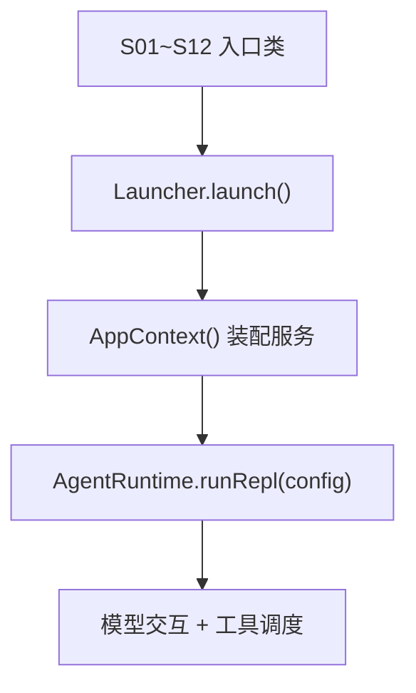
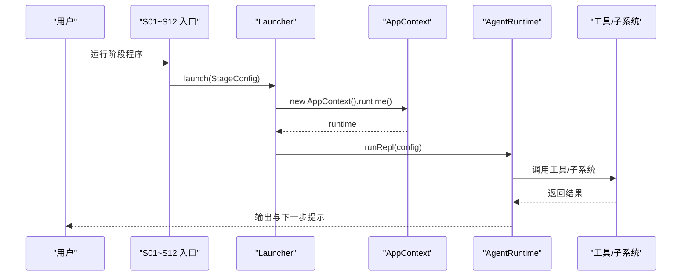
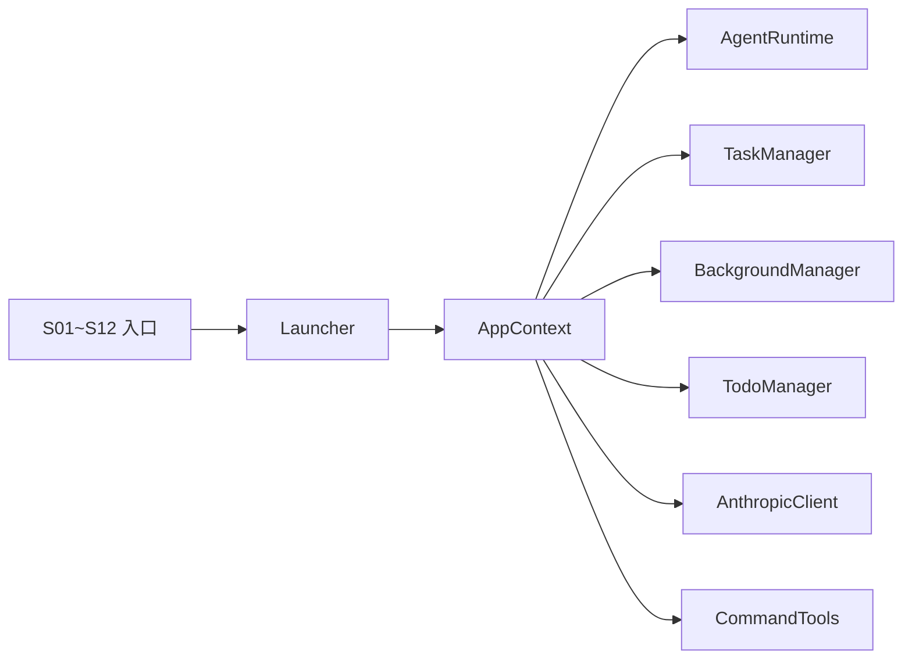

# 学习阶段详解

<cite>
**本文引用的文件**
- [S01AgentLoop.java](file://src/main/java/com/learnclaudecode/agents/S01AgentLoop.java)
- [S02ToolUse.java](file://src/main/java/com/learnclaudecode/agents/S02ToolUse.java)
- [S03TodoWrite.java](file://src/main/java/com/learnclaudecode/agents/S03TodoWrite.java)
- [S04Subagent.java](file://src/main/java/com/learnclaudecode/agents/S04Subagent.java)
- [S05SkillLoading.java](file://src/main/java/com/learnclaudecode/agents/S05SkillLoading.java)
- [S06ContextCompact.java](file://src/main/java/com/learnclaudecode/agents/S06ContextCompact.java)
- [S07TaskSystem.java](file://src/main/java/com/learnclaudecode/agents/S07TaskSystem.java)
- [S08BackgroundTasks.java](file://src/main/java/com/learnclaudecode/agents/S08BackgroundTasks.java)
- [S09AgentTeams.java](file://src/main/java/com/learnclaudecode/agents/S09AgentTeams.java)
- [S10TeamProtocols.java](file://src/main/java/com/learnclaudecode/agents/S10TeamProtocols.java)
- [S11AutonomousAgents.java](file://src/main/java/com/learnclaudecode/agents/S11AutonomousAgents.java)
- [S12WorktreeTaskIsolation.java](file://src/main/java/com/learnclaudecode/agents/S12WorktreeTaskIsolation.java)
- [Launcher.java](file://src/main/java/com/learnclaudecode/agents/Launcher.java)
- [StageConfig.java](file://src/main/java/com/learnclaudecode/agents/StageConfig.java)
- [AppContext.java](file://src/main/java/com/learnclaudecode/agents/AppContext.java)
- [TodoManager.java](file://src/main/java/com/learnclaudecode/tools/TodoManager.java)
- [TaskManager.java](file://src/main/java/com/learnclaudecode/tasks/TaskManager.java)
- [BackgroundManager.java](file://src/main/java/com/learnclaudecode/background/BackgroundManager.java)
</cite>

## 目录
1. [简介](#简介)
2. [项目结构](#项目结构)
3. [核心组件](#核心组件)
4. [架构总览](#架构总览)
5. [详细阶段分析](#详细阶段分析)
6. [依赖关系分析](#依赖关系分析)
7. [性能考量](#性能考量)
8. [故障排查指南](#故障排查指南)
9. [结论](#结论)
10. [附录](#附录)

## 简介
本教程以“从简单到复杂”的递进方式，讲解一个 Claude Code 风格的 Agent 如何逐步具备工具调用、任务管理、子代理、技能加载、上下文压缩、任务系统深化、后台任务、团队协作、团队协议、自治代理与工作树隔离等能力。每个阶段都包含概念解释、代码示例路径、运行演示步骤和学习要点，并明确阶段之间的演进关系与知识衔接，帮助读者循序渐进地掌握 Agent 设计与实现。

## 项目结构
本项目采用“统一入口 + 阶段配置 + 运行时装配”的组织方式：
- 每个 S01~S12 入口类仅负责选择对应的 StageConfig，再交给 Launcher 启动。
- Launcher 创建 AppContext，装配所有共享服务（命令执行、Todo、技能加载、上下文压缩、任务系统、后台任务、团队通信、worktree），并驱动统一的 AgentRuntime。
- StageConfig 是“课程编排器”，决定当前阶段暴露给模型的 system prompt、工具集以及是否启用高级机制。

**图表来源**
- [Launcher.java:18-26](file://src/main/java/com/learnclaudecode/agents/Launcher.java#L18-L26)
- [AppContext.java:35-58](file://src/main/java/com/learnclaudecode/agents/AppContext.java#L35-L58)

**章节来源**
- [Launcher.java:1-28](file://src/main/java/com/learnclaudecode/agents/Launcher.java#L1-L28)
- [AppContext.java:1-70](file://src/main/java/com/learnclaudecode/agents/AppContext.java#L1-L70)

## 核心组件
- 统一启动器：Launcher 提供 launch(StageConfig)，屏蔽各阶段初始化差异。
- 应用装配器：AppContext 集中创建共享服务，按“基础能力 -> 扩展机制 -> 运行时”的顺序装配。
- 阶段配置：StageConfig 定义每个阶段的 system prompt、工具集和能力开关，体现“同一运行时，逐步打开能力”的设计思想。
- 工具与子系统：
  - TodoManager：维护待办清单，支持状态校验与渲染。
  - TaskManager：基于文件的轻量任务板，支持创建、更新、认领、依赖管理与 worktree 绑定。
  - BackgroundManager：异步执行长耗时命令，提供状态查询与通知队列。

**章节来源**
- [Launcher.java:18-26](file://src/main/java/com/learnclaudecode/agents/Launcher.java#L18-L26)
- [AppContext.java:35-58](file://src/main/java/com/learnclaudecode/agents/AppContext.java#L35-L58)
- [StageConfig.java:11-35](file://src/main/java/com/learnclaudecode/agents/StageConfig.java#L11-L35)
- [TodoManager.java:15-91](file://src/main/java/com/learnclaudecode/tools/TodoManager.java#L15-L91)
- [TaskManager.java:17-338](file://src/main/java/com/learnclaudecode/tasks/TaskManager.java#L17-L338)
- [BackgroundManager.java:17-159](file://src/main/java/com/learnclaudecode/background/BackgroundManager.java#L17-L159)

## 架构总览
下图展示了从入口到运行时的整体流程，以及关键子系统在运行时的协作关系。

**图表来源**
- [Launcher.java:18-26](file://src/main/java/com/learnclaudecode/agents/Launcher.java#L18-L26)
- [AppContext.java:35-58](file://src/main/java/com/learnclaudecode/agents/AppContext.java#L35-L58)

## 详细阶段分析

### 阶段 S01：基础 Agent 循环
- 概念：最小闭环——“模型思考 -> 调用 bash -> 执行命令 -> 回传结果”。
- 代码示例：入口类只选择 s01 配置并启动。
- 运行演示：
  - 进入项目根目录。
  - 运行 S01AgentLoop 主类。
  - 输入任意 shell 命令，观察 Agent 通过 bash 执行并返回结果。
- 学习要点：
  - 理解 Agent 的核心循环：对话 -> 工具调用 -> 执行 -> 反馈。
  - 认识 system prompt 对行为约束的重要性。
- 演进衔接：为后续引入更多工具与机制奠定基础。

**章节来源**
- [S01AgentLoop.java:9-11](file://src/main/java/com/learnclaudecode/agents/S01AgentLoop.java#L9-L11)
- [StageConfig.java:77-82](file://src/main/java/com/learnclaudecode/agents/StageConfig.java#L77-L82)

### 阶段 S02：工具调用（文件与命令）
- 概念：在 S01 基础上开放 read_file、write_file、edit_file 等文件工具，使 Agent 能直接读写项目内容。
- 代码示例：入口类选择 s02 配置。
- 运行演示：
  - 运行 S02ToolUse。
  - 让 Agent 读取或创建项目中的文件，验证工具生效。
- 学习要点：
  - 工具定义与 schema 的作用。
  - 将“纯对话”升级为“可操作环境”的关键一步。
- 演进衔接：为规划多步任务（S03）和更复杂的工具链做准备。

**章节来源**
- [S02ToolUse.java:9-11](file://src/main/java/com/learnclaudecode/agents/S02ToolUse.java#L9-L11)
- [StageConfig.java:89-94](file://src/main/java/com/learnclaudecode/agents/StageConfig.java#L89-L94)

### 阶段 S03：任务管理（Todo 规划）
- 概念：引入 todo 工具，帮助模型把长任务拆成可跟踪的步骤，提升可观测性与可控性。
- 代码示例：入口类选择 s03 配置；TodoManager 负责校验与渲染。
- 运行演示：
  - 运行 S03TodoWrite。
  - 让 Agent 使用 todo 工具创建计划，标记 in_progress 与 completed，观察看板输出。
- 学习要点：
  - 任务状态机：pending/in_progress/completed。
  - 限制同时进行的 in_progress 数量，避免混乱。
- 演进衔接：为后续任务系统（S07）与自治认领（S11）打下基础。

**章节来源**
- [S03TodoWrite.java:9-11](file://src/main/java/com/learnclaudecode/agents/S03TodoWrite.java#L9-L11)
- [StageConfig.java:101-108](file://src/main/java/com/learnclaudecode/agents/StageConfig.java#L101-L108)
- [TodoManager.java:21-91](file://src/main/java/com/learnclaudecode/tools/TodoManager.java#L21-L91)

### 阶段 S04：子代理（分治）
- 概念：通过 task 工具派生子代理，将探索性或子任务委派给独立上下文处理，降低主代理负担。
- 代码示例：入口类选择 s04 配置。
- 运行演示：
  - 运行 S04Subagent。
  - 让 Agent 使用 task 工具委派子任务，观察结果聚合。
- 学习要点：
  - 何时拆分任务、如何设计子代理提示词。
  - 上下文隔离与结果合并策略。
- 演进衔接：为团队协作（S09+）与自治代理（S11）提供思路。

**章节来源**
- [S04Subagent.java:9-11](file://src/main/java/com/learnclaudecode/agents/S04Subagent.java#L9-L11)
- [StageConfig.java:115-122](file://src/main/java/com/learnclaudecode/agents/StageConfig.java#L115-L122)

### 阶段 S05：技能加载（动态知识）
- 概念：通过 load_skill 动态加载领域知识，使 Agent 在面对陌生工作前获取专项指导。
- 代码示例：入口类选择 s05 配置；system prompt 中注入可用技能描述。
- 运行演示：
  - 运行 S05SkillLoading。
  - 让 Agent 先加载技能，再执行相关任务，对比无技能时的表现。
- 学习要点：
  - 技能描述的结构化表达。
  - 运行时动态注入知识的价值。
- 演进衔接：为完整能力视图（s_full）与跨阶段组合打基础。

**章节来源**
- [S05SkillLoading.java:9-11](file://src/main/java/com/learnclaudecode/agents/S05SkillLoading.java#L9-L11)
- [StageConfig.java:129-135](file://src/main/java/com/learnclaudecode/agents/StageConfig.java#L129-L135)

### 阶段 S06：上下文压缩
- 概念：当对话历史过长时，使用 compact 工具触发压缩，保留关键信息，缓解上下文窗口压力。
- 代码示例：入口类选择 s06 配置；启用 enableCompression。
- 运行演示：
  - 运行 S06ContextCompact。
  - 让 Agent 在长对话后主动触发压缩，观察上下文变化与效果。
- 学习要点：
  - 压缩时机与聚焦策略。
  - 如何在长任务中保持“记忆”的有效性。
- 演进衔接：为复杂任务流（S07+）提供稳定性保障。

**章节来源**
- [S06ContextCompact.java:9-11](file://src/main/java/com/learnclaudecode/agents/S06ContextCompact.java#L9-L11)
- [StageConfig.java:142-149](file://src/main/java/com/learnclaudecode/agents/StageConfig.java#L142-L149)

### 阶段 S07：任务系统深化（持久化任务板）
- 概念：引入 task_create/update/list/get 等工具，实现任务的创建、更新、查看与依赖管理，并通过文件持久化。
- 代码示例：入口类选择 s07 配置；TaskManager 负责持久化与状态流转。
- 运行演示：
  - 运行 S07TaskSystem。
  - 让 Agent 创建任务、设置依赖、更新状态，观察看板与文件变化。
- 学习要点：
  - 任务状态机与依赖关系（blockedBy/blocks）。
  - 并发安全与原子更新。
- 演进衔接：为自治认领（S11）与 worktree 绑定（S12）提供数据基础。

**章节来源**
- [S07TaskSystem.java:9-11](file://src/main/java/com/learnclaudecode/agents/S07TaskSystem.java#L9-L11)
- [StageConfig.java:156-165](file://src/main/java/com/learnclaudecode/agents/StageConfig.java#L156-L165)
- [TaskManager.java:51-133](file://src/main/java/com/learnclaudecode/tasks/TaskManager.java#L51-L133)

### 阶段 S08：后台任务（异步执行）
- 概念：通过 background_run/check 工具，将长耗时命令放入后台线程执行，不阻塞主对话循环。
- 代码示例：入口类选择 s08 配置；BackgroundManager 负责异步执行与通知。
- 运行演示：
  - 运行 S08BackgroundTasks。
  - 提交长耗时命令，轮询检查状态，查看结果摘要。
- 学习要点：
  - 进程生命周期管理与超时控制。
  - 通知队列与主循环集成。
- 演进衔接：为团队协作（S09+）中的并行工作流提供支持。

**章节来源**
- [S08BackgroundTasks.java:9-11](file://src/main/java/com/learnclaudecode/agents/S08BackgroundTasks.java#L9-L11)
- [StageConfig.java:172-179](file://src/main/java/com/learnclaudecode/agents/StageConfig.java#L172-L179)
- [BackgroundManager.java:43-123](file://src/main/java/com/learnclaudecode/background/BackgroundManager.java#L43-L123)

### 阶段 S09：代理团队协作（消息总线）
- 概念：lead 可以 spawn 队友，通过 send_message/read_inbox/broadcast 进行协作。
- 代码示例：入口类选择 s09 配置；启用 enableInbox。
- 运行演示：
  - 运行 S09AgentTeams。
  - 让 lead 创建队友并发送指令，观察收件箱与广播效果。
- 学习要点：
  - 角色分工与消息路由。
  - 解耦的通信模式。
- 演进衔接：为协议化治理（S10）与自治协作（S11）提供通道。

**章节来源**
- [S09AgentTeams.java:9-11](file://src/main/java/com/learnclaudecode/agents/S09AgentTeams.java#L9-L11)
- [StageConfig.java:186-197](file://src/main/java/com/learnclaudecode/agents/StageConfig.java#L186-L197)

### 阶段 S10：团队协议（治理与审批）
- 概念：引入 shutdown_request 与 plan_approval，使 lead 能对队友进行生命周期管理与方案审批。
- 代码示例：入口类选择 s10 配置；继承 s09 的工具集。
- 运行演示：
  - 运行 S10TeamProtocols。
  - 让 lead 请求关闭某队友或审批其计划，观察协议执行。
- 学习要点：
  - 协议化治理的必要性与边界。
  - 审批流与状态一致性。
- 演进衔接：为自治认领（S11）提供治理框架。

**章节来源**
- [S10TeamProtocols.java:9-11](file://src/main/java/com/learnclaudecode/agents/S10TeamProtocols.java#L9-L11)
- [StageConfig.java:204-211](file://src/main/java/com/learnclaudecode/agents/StageConfig.java#L204-L211)

### 阶段 S11：自治代理（自主认领）
- 概念：队友可在空闲时主动 claim_task 并 idle，减少 lead 分配负担，提高吞吐。
- 代码示例：入口类选择 s11 配置；启用 autonomousTeammates。
- 运行演示：
  - 运行 S11AutonomousAgents。
  - 让队友扫描待认领任务并自动开始处理，观察任务状态流转。
- 学习要点：
  - 任务可见性与抢占式认领。
  - 空闲检测与自驱循环。
- 演进衔接：结合 worktree 隔离（S12）实现多任务并行与互不干扰。

**章节来源**
- [S11AutonomousAgents.java:9-11](file://src/main/java/com/learnclaudecode/agents/S11AutonomousAgents.java#L9-L11)
- [StageConfig.java:218-227](file://src/main/java/com/learnclaudecode/agents/StageConfig.java#L218-L227)
- [TaskManager.java:168-197](file://src/main/java/com/learnclaudecode/tasks/TaskManager.java#L168-L197)

### 阶段 S12：工作树隔离（任务级隔离）
- 概念：通过 worktree_create/list/remove/events 将不同任务绑定到独立目录，减少上下文与文件冲突。
- 代码示例：入口类选择 s12 配置；继承 s11 的工具集。
- 运行演示：
  - 运行 S12WorktreeTaskIsolation。
  - 为任务创建工作树，观察事件与隔离效果。
- 学习要点：
  - 任务与工作树的绑定关系。
  - 生命周期事件的可观测性。
- 演进衔接：形成“任务-工作树-代理”三位一体的工程化实践。

**章节来源**
- [S12WorktreeTaskIsolation.java:9-11](file://src/main/java/com/learnclaudecode/agents/S12WorktreeTaskIsolation.java#L9-L11)
- [StageConfig.java:234-244](file://src/main/java/com/learnclaudecode/agents/StageConfig.java#L234-L244)
- [TaskManager.java:215-235](file://src/main/java/com/learnclaudecode/tasks/TaskManager.java#L215-L235)

## 依赖关系分析
- 入口层：S01~S12 入口类仅依赖 Launcher 与 StageConfig。
- 装配层：AppContext 依赖 EnvConfig、WorkspacePaths、AnthropicClient、CommandTools、TodoManager、SkillLoader、CompressionService、TaskManager、BackgroundManager、MessageBus、TeammateManager、WorktreeManager。
- 运行时层：AgentRuntime 协调上述组件完成“对话-工具-执行-反馈”的主循环。

**图表来源**
- [AppContext.java:35-58](file://src/main/java/com/learnclaudecode/agents/AppContext.java#L35-L58)

**章节来源**
- [AppContext.java:1-70](file://src/main/java/com/learnclaudecode/agents/AppContext.java#L1-L70)

## 性能考量
- 工具调用开销：频繁的文件读写与命令执行会带来 I/O 与进程开销，建议批量操作与缓存热点数据。
- 上下文长度：S06 的压缩机制有助于控制 token 消耗与延迟，应合理设置压缩阈值与聚焦策略。
- 后台任务：S08 的异步执行避免阻塞主循环，但需注意超时与资源释放，防止僵尸进程。
- 任务并发：S07/S11 的任务更新需保证原子性，避免竞态条件导致状态不一致。
- 工作树隔离：S12 通过目录隔离减少冲突，但也带来磁盘与路径管理的复杂度，应定期清理无用 worktree。

## 故障排查指南
- Todo 校验失败：
  - 现象：抛出非法参数异常（如超过最大条目数、无效状态、文本为空、多个 in_progress）。
  - 定位：检查传入的 items 结构与字段名兼容（text/content、status、activeForm）。
  - 参考：[TodoManager.java:21-54](file://src/main/java/com/learnclaudecode/tools/TodoManager.java#L21-L54)
- 任务不存在或保存失败：
  - 现象：找不到任务文件或写入失败。
  - 定位：检查 .tasks 目录权限与文件名规则；确认任务 ID 存在。
  - 参考：[TaskManager.java:276-322](file://src/main/java/com/learnclaudecode/tasks/TaskManager.java#L276-L322)
- 后台任务超时或异常：
  - 现象：check 返回 timeout/error；drain 无通知。
  - 定位：检查命令合法性、工作区目录设置、超时时间；确认通知队列未被消费。
  - 参考：[BackgroundManager.java:68-123](file://src/main/java/com/learnclaudecode/background/BackgroundManager.java#L68-L123)
- 团队消息未送达：
  - 现象：read_inbox 为空或 send_message 无响应。
  - 定位：确认 MessageBus 与 TeammateManager 已正确装配；检查消息类型与目标名称。
  - 参考：[AppContext.java:51-53](file://src/main/java/com/learnclaudecode/agents/AppContext.java#L51-L53)

**章节来源**
- [TodoManager.java:21-54](file://src/main/java/com/learnclaudecode/tools/TodoManager.java#L21-L54)
- [TaskManager.java:276-322](file://src/main/java/com/learnclaudecode/tasks/TaskManager.java#L276-L322)
- [BackgroundManager.java:68-123](file://src/main/java/com/learnclaudecode/background/BackgroundManager.java#L68-L123)
- [AppContext.java:51-53](file://src/main/java/com/learnclaudecode/agents/AppContext.java#L51-L53)

## 结论
本教程通过 12 个递进阶段，展示了如何在一个统一的 Agent 运行时上逐步打开能力开关，从最基础的“对话-命令”闭环，演进到具备任务管理、子代理、技能加载、上下文压缩、后台任务、团队协作、协议治理、自治认领与工作树隔离的完整工程化体系。每个阶段都围绕“最小可行能力”展开，既便于学习，又易于扩展。建议在掌握 S01~S06 的基础上，继续深入 S07~S12，最终形成面向真实项目的 Agent 开发范式。

## 附录
- 快速运行指引：
  - 安装依赖并配置环境变量（模型 API Key、工作区路径等）。
  - 选择对应阶段入口类运行（例如 java ...S01AgentLoop）。
  - 根据提示与工具说明进行交互，观察日志与输出。
- 进阶阅读：
  - 关注 StageConfig 中各阶段的 tools 与能力开关，理解“配置即能力”的设计。
  - 研究 AppContext 的装配顺序，掌握分层与解耦原则。
  - 结合 TaskManager 与 BackgroundManager，构建高可靠的任务与异步执行机制。