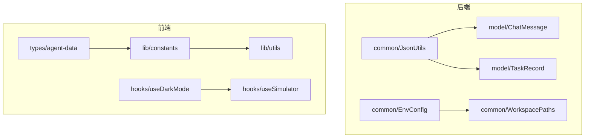
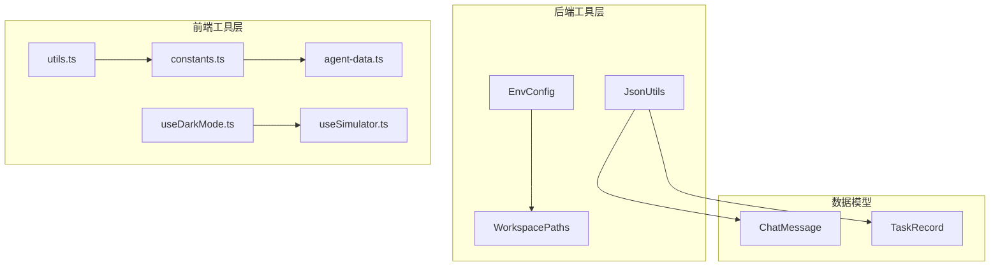
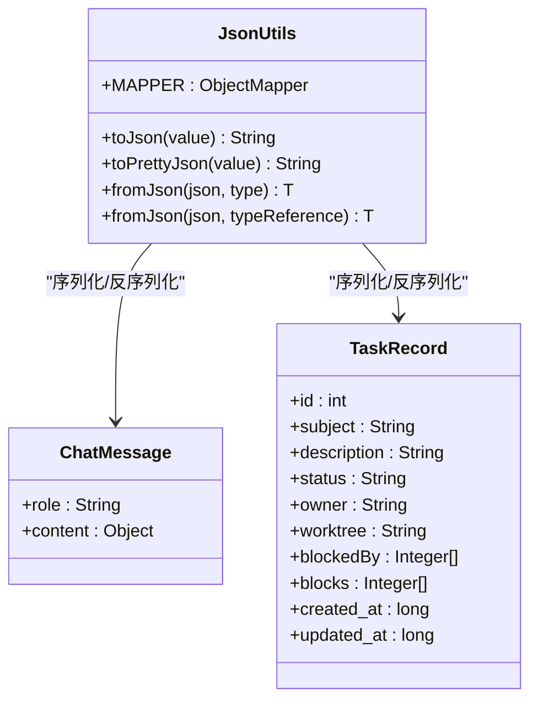
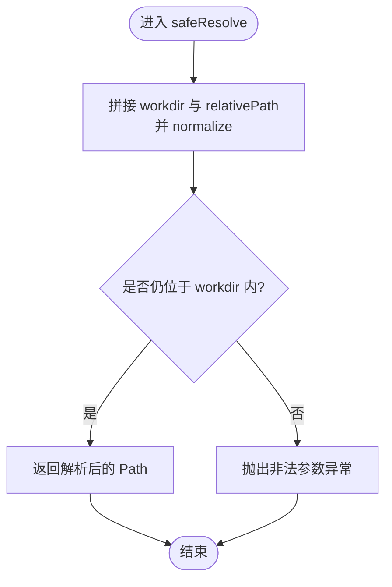
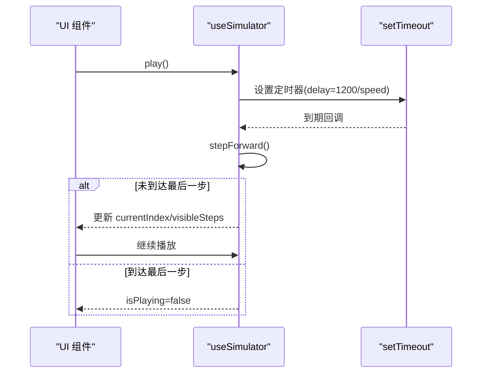
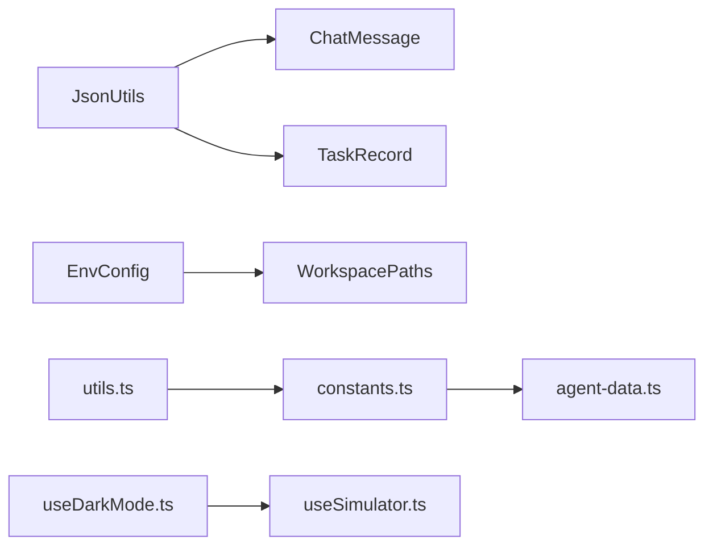

# 工具类和辅助功能

<cite>
**本文引用的文件**
- [JsonUtils.java](file://src/main/java/com/learnclaudecode/common/JsonUtils.java)
- [EnvConfig.java](file://src/main/java/com/learnclaudecode/common/EnvConfig.java)
- [WorkspacePaths.java](file://src/main/java/com/learnclaudecode/common/WorkspacePaths.java)
- [ChatMessage.java](file://src/main/java/com/learnclaudecode/model/ChatMessage.java)
- [TaskRecord.java](file://src/main/java/com/learnclaudecode/model/TaskRecord.java)
- [constants.ts](file://web/src/lib/constants.ts)
- [utils.ts](file://web/src/lib/utils.ts)
- [useDarkMode.ts](file://web/src/hooks/useDarkMode.ts)
- [useSimulator.ts](file://web/src/hooks/useSimulator.ts)
- [agent-data.ts](file://web/src/types/agent-data.ts)
</cite>

## 目录
1. [简介](#简介)
2. [项目结构](#项目结构)
3. [核心组件](#核心组件)
4. [架构总览](#架构总览)
5. [详细组件分析](#详细组件分析)
6. [依赖关系分析](#依赖关系分析)
7. [性能考虑](#性能考虑)
8. [故障排查指南](#故障排查指南)
9. [结论](#结论)
10. [附录：扩展指南与最佳实践](#附录：扩展指南与最佳实践)

## 简介
本章节聚焦项目中“工具类与辅助功能”的说明，覆盖后端 JSON 序列化/反序列化工具、环境配置与工作区路径安全访问，以及前端常量定义、通用工具函数与常用 Hook。文档旨在帮助读者快速理解并正确使用这些能力，同时提供扩展新工具函数与格式化规则的指南。

## 项目结构
本项目在后端 common 包中提供通用工具（JSON、环境变量、工作区路径），在 model 包中提供数据模型；在前端 lib 下提供常量与工具函数，hooks 下提供常用 UI/交互逻辑 Hook，types 下提供类型定义。整体组织清晰，便于复用与扩展。

图表来源
- [JsonUtils.java:1-83](file://src/main/java/com/learnclaudecode/common/JsonUtils.java#L1-L83)
- [EnvConfig.java:1-96](file://src/main/java/com/learnclaudecode/common/EnvConfig.java#L1-L96)
- [WorkspacePaths.java:1-150](file://src/main/java/com/learnclaudecode/common/WorkspacePaths.java#L1-L150)
- [ChatMessage.java:1-8](file://src/main/java/com/learnclaudecode/model/ChatMessage.java#L1-L8)
- [TaskRecord.java:1-62](file://src/main/java/com/learnclaudecode/model/TaskRecord.java#L1-L62)
- [constants.ts:1-38](file://web/src/lib/constants.ts#L1-L38)
- [utils.ts:1-4](file://web/src/lib/utils.ts#L1-L4)
- [useDarkMode.ts:1-76](file://web/src/hooks/useDarkMode.ts#L1-L76)
- [useSimulator.ts:1-85](file://web/src/hooks/useSimulator.ts#L1-L85)
- [agent-data.ts:1-73](file://web/src/types/agent-data.ts#L1-L73)

章节来源
- [JsonUtils.java:1-83](file://src/main/java/com/learnclaudecode/common/JsonUtils.java#L1-L83)
- [EnvConfig.java:1-96](file://src/main/java/com/learnclaudecode/common/EnvConfig.java#L1-L96)
- [WorkspacePaths.java:1-150](file://src/main/java/com/learnclaudecode/common/WorkspacePaths.java#L1-L150)
- [constants.ts:1-38](file://web/src/lib/constants.ts#L1-L38)
- [utils.ts:1-4](file://web/src/lib/utils.ts#L1-L4)
- [useDarkMode.ts:1-76](file://web/src/hooks/useDarkMode.ts#L1-L76)
- [useSimulator.ts:1-85](file://web/src/hooks/useSimulator.ts#L1-L85)
- [agent-data.ts:1-73](file://web/src/types/agent-data.ts#L1-L73)

## 核心组件
- JsonUtils：统一的 JSON 序列化/反序列化入口，内置 JavaTimeModule 以正确处理日期时间，并提供紧凑与格式化输出方法。
- EnvConfig：集中读取环境变量，支持 .env 与系统环境变量覆盖，提供必填项校验与默认值策略。
- WorkspacePaths：工作区路径安全解析与常用目录访问，防止路径逃逸，统一读写文本。
- 前端 constants：版本顺序、学习路径、层级分类等常量，支撑前端导航与可视化。
- 前端 utils：类名合并工具函数，简化样式拼接。
- 前端 hooks：深色模式检测与 SVG 调色板、模拟器步进控制等通用交互能力。
- 前端 types：模拟步骤、场景、流程节点等类型定义，为前后端数据交互提供契约。

章节来源
- [JsonUtils.java:1-83](file://src/main/java/com/learnclaudecode/common/JsonUtils.java#L1-L83)
- [EnvConfig.java:1-96](file://src/main/java/com/learnclaudecode/common/EnvConfig.java#L1-L96)
- [WorkspacePaths.java:1-150](file://src/main/java/com/learnclaudecode/common/WorkspacePaths.java#L1-L150)
- [constants.ts:1-38](file://web/src/lib/constants.ts#L1-L38)
- [utils.ts:1-4](file://web/src/lib/utils.ts#L1-L4)
- [useDarkMode.ts:1-76](file://web/src/hooks/useDarkMode.ts#L1-L76)
- [useSimulator.ts:1-85](file://web/src/hooks/useSimulator.ts#L1-L85)
- [agent-data.ts:1-73](file://web/src/types/agent-data.ts#L1-L73)

## 架构总览
下图展示了工具类与辅助功能在系统中的位置与交互关系：后端通过 JsonUtils 对模型进行序列化/反序列化，EnvConfig 提供运行时配置，WorkspacePaths 保障文件操作安全；前端通过 constants 管理版本与层级信息，使用 utils 处理样式，hooks 提供交互能力，types 定义数据结构。

图表来源
- [JsonUtils.java:1-83](file://src/main/java/com/learnclaudecode/common/JsonUtils.java#L1-L83)
- [EnvConfig.java:1-96](file://src/main/java/com/learnclaudecode/common/EnvConfig.java#L1-L96)
- [WorkspacePaths.java:1-150](file://src/main/java/com/learnclaudecode/common/WorkspacePaths.java#L1-L150)
- [ChatMessage.java:1-8](file://src/main/java/com/learnclaudecode/model/ChatMessage.java#L1-L8)
- [TaskRecord.java:1-62](file://src/main/java/com/learnclaudecode/model/TaskRecord.java#L1-L62)
- [constants.ts:1-38](file://web/src/lib/constants.ts#L1-L38)
- [utils.ts:1-4](file://web/src/lib/utils.ts#L1-L4)
- [useDarkMode.ts:1-76](file://web/src/hooks/useDarkMode.ts#L1-L76)
- [useSimulator.ts:1-85](file://web/src/hooks/useSimulator.ts#L1-L85)
- [agent-data.ts:1-73](file://web/src/types/agent-data.ts#L1-L73)

## 详细组件分析

### JsonUtils：JSON 序列化与反序列化
- 设计要点
  - 单例 ObjectMapper：通过静态字段维护一个全局配置的 ObjectMapper，避免重复创建开销。
  - 日期时间处理：注册 JavaTimeModule 并关闭时间戳写入，确保日期时间以 ISO 字符串形式序列化。
  - 方法封装：提供紧凑与格式化两种输出方式；提供按类型与泛型 TypeReference 的反序列化方法。
  - 异常处理：捕获 Jackson 异常并包装为 IllegalStateException，便于上层统一处理。
- 使用示例（路径引用）
  - 对象转 JSON：[toJson:29-35](file://src/main/java/com/learnclaudecode/common/JsonUtils.java#L29-L35)
  - 对象转格式化 JSON：[toPrettyJson:43-49](file://src/main/java/com/learnclaudecode/common/JsonUtils.java#L43-L49)
  - JSON 转对象（Class）：[fromJson(Class):59-65](file://src/main/java/com/learnclaudecode/common/JsonUtils.java#L59-L65)
  - JSON 转对象（TypeReference）：[fromJson(TypeReference):75-81](file://src/main/java/com/learnclaudecode/common/JsonUtils.java#L75-L81)
- 与模型的协作
  - ChatMessage：content 为 Object，可承载文本或结构化 tool_result 列表，适合用 JsonUtils 直接序列化/反序列化。
  - TaskRecord：包含时间与集合字段，JavaTimeModule 保证时间字段正确序列化。
- 自定义转换器扩展点
  - 可在 ObjectMapper 上注册自定义模块或 SimpleModule，实现特定字段的序列化/反序列化规则。
  - 建议将自定义配置集中在 JsonUtils 内部，保持调用方无感知。
- 复杂度与性能
  - 序列化/反序列化时间复杂度近似 O(n)，n 为对象字段数；空间复杂度取决于对象图大小。
  - 使用单例 ObjectMapper 减少初始化成本，提升吞吐。

图表来源
- [JsonUtils.java:1-83](file://src/main/java/com/learnclaudecode/common/JsonUtils.java#L1-L83)
- [ChatMessage.java:1-8](file://src/main/java/com/learnclaudecode/model/ChatMessage.java#L1-L8)
- [TaskRecord.java:1-62](file://src/main/java/com/learnclaudecode/model/TaskRecord.java#L1-L62)

章节来源
- [JsonUtils.java:1-83](file://src/main/java/com/learnclaudecode/common/JsonUtils.java#L1-L83)
- [ChatMessage.java:1-8](file://src/main/java/com/learnclaudecode/model/ChatMessage.java#L1-L8)
- [TaskRecord.java:1-62](file://src/main/java/com/learnclaudecode/model/TaskRecord.java#L1-L62)

### EnvConfig：环境变量与运行配置
- 设计要点
  - 优先级：系统环境变量优先于 .env 文件，便于 CI/IDEA 覆盖本地配置。
  - 必填项校验：require 方法在缺失时抛出异常，确保关键配置存在。
  - 默认值：API Key/Base URL 等可选配置提供空串或默认地址。
- 使用示例（路径引用）
  - 构造与环境加载：[EnvConfig():22-29](file://src/main/java/com/learnclaudecode/common/EnvConfig.java#L22-L29)
  - 获取环境变量：[getenv(key):47-58](file://src/main/java/com/learnclaudecode/common/EnvConfig.java#L47-L58)
  - 获取模型 ID/API Key/Base URL/工作目录：[getModelId/getApiKey/getBaseUrl/getWorkdir:65-94](file://src/main/java/com/learnclaudecode/common/EnvConfig.java#L65-L94)
- 最佳实践
  - 将敏感信息放入 .env，并在部署时通过系统环境变量覆盖。
  - 启动前校验必填项，尽早失败以便定位问题。

章节来源
- [EnvConfig.java:1-96](file://src/main/java/com/learnclaudecode/common/EnvConfig.java#L1-L96)

### WorkspacePaths：工作区路径安全访问
- 设计要点
  - 安全解析：safeResolve 规范化路径并校验是否仍在 workdir 内，防止路径逃逸。
  - 统一读写：readText/writeText 基于 safeResolve，自动创建父目录并写入 UTF-8 文本。
  - 常用目录：tasksDir/teamDir/inboxDir/skillsDir/transcriptDir/worktreesDir 提供约定式目录访问。
- 使用示例（路径引用）
  - 安全解析相对路径：[safeResolve:42-49](file://src/main/java/com/learnclaudecode/common/WorkspacePaths.java#L42-L49)
  - 读取/写入文本：[readText/writeText:58-75](file://src/main/java/com/learnclaudecode/common/WorkspacePaths.java#L58-L75)
  - 获取任务/团队/技能/转录/工作树目录：[tasksDir/teamDir/inboxDir/skillsDir/transcriptDir/worktreesDir:86-148](file://src/main/java/com/learnclaudecode/common/WorkspacePaths.java#L86-L148)
- 流程图（安全解析）

图表来源
- [WorkspacePaths.java:42-49](file://src/main/java/com/learnclaudecode/common/WorkspacePaths.java#L42-L49)

章节来源
- [WorkspacePaths.java:1-150](file://src/main/java/com/learnclaudecode/common/WorkspacePaths.java#L1-L150)

### 前端常量与工具函数
- constants.ts
  - VERSION_ORDER/LEARNING_PATH：定义版本顺序与学习路径，用于导航与渲染。
  - VERSION_META：每个版本的元信息（标题、副标题、核心新增、关键洞察、层级、前一版本）。
  - LAYERS：分层标签与颜色，用于可视化展示。
- utils.ts
  - cn：类名合并工具，过滤无效值并拼接空格分隔的类名字符串。
- 使用示例（路径引用）
  - 版本顺序与元信息：[VERSION_ORDER/LEARNING_PATH/VERSION_META/LAYERS:1-38](file://web/src/lib/constants.ts#L1-L38)
  - 类名合并：[cn:1-4](file://web/src/lib/utils.ts#L1-L4)

章节来源
- [constants.ts:1-38](file://web/src/lib/constants.ts#L1-L38)
- [utils.ts:1-4](file://web/src/lib/utils.ts#L1-L4)

### 前端 Hooks：深色模式与模拟器
- useDarkMode.ts
  - 监听根元素 class 变化，返回当前是否为深色模式。
  - 提供 SvgPalette：根据深浅主题返回不同配色，供 SVG 可视化使用。
- useSimulator.ts
  - 管理模拟步骤播放状态：播放/暂停/步进/重置/速度调节。
  - 基于定时器推进步骤，到达末尾自动停止。
- 使用示例（路径引用）
  - 深色模式与调色板：[useDarkMode/useSvgPalette:5-75](file://web/src/hooks/useDarkMode.ts#L5-L75)
  - 模拟器控制：[useSimulator:12-84](file://web/src/hooks/useSimulator.ts#L12-L84)

图表来源
- [useSimulator.ts:12-84](file://web/src/hooks/useSimulator.ts#L12-L84)

章节来源
- [useDarkMode.ts:1-76](file://web/src/hooks/useDarkMode.ts#L1-L76)
- [useSimulator.ts:1-85](file://web/src/hooks/useSimulator.ts#L1-L85)

### 前端类型定义：模拟步骤与场景
- agent-data.ts
  - SimStep：模拟步骤的类型、内容、标注、工具名与输入。
  - Scenario：场景包含版本、标题、描述与步骤列表。
  - FlowNode/FlowEdge：流程图节点与边，用于可视化执行流。
- 使用示例（路径引用）
  - 类型定义：[SimStep/Scenario/FlowNode/FlowEdge:38-73](file://web/src/types/agent-data.ts#L38-L73)

章节来源
- [agent-data.ts:1-73](file://web/src/types/agent-data.ts#L1-L73)

## 依赖关系分析
- 后端
  - JsonUtils 依赖 Jackson 与 JavaTimeModule，对模型进行序列化/反序列化。
  - EnvConfig 依赖 dotenv 库读取 .env，并与 System.getenv 组合。
  - WorkspacePaths 依赖 NIO 文件 API，提供安全路径与读写。
- 前端
  - constants 被多处页面/组件引用，作为版本与层级数据源。
  - utils 被 UI 组件广泛使用，简化类名拼接。
  - hooks 被可视化与交互组件使用，提供状态与行为。
  - types 为 hooks 与组件提供类型约束。

图表来源
- [JsonUtils.java:1-83](file://src/main/java/com/learnclaudecode/common/JsonUtils.java#L1-L83)
- [EnvConfig.java:1-96](file://src/main/java/com/learnclaudecode/common/EnvConfig.java#L1-L96)
- [WorkspacePaths.java:1-150](file://src/main/java/com/learnclaudecode/common/WorkspacePaths.java#L1-L150)
- [ChatMessage.java:1-8](file://src/main/java/com/learnclaudecode/model/ChatMessage.java#L1-L8)
- [TaskRecord.java:1-62](file://src/main/java/com/learnclaudecode/model/TaskRecord.java#L1-L62)
- [constants.ts:1-38](file://web/src/lib/constants.ts#L1-L38)
- [utils.ts:1-4](file://web/src/lib/utils.ts#L1-L4)
- [useDarkMode.ts:1-76](file://web/src/hooks/useDarkMode.ts#L1-L76)
- [useSimulator.ts:1-85](file://web/src/hooks/useSimulator.ts#L1-L85)
- [agent-data.ts:1-73](file://web/src/types/agent-data.ts#L1-L73)

章节来源
- [JsonUtils.java:1-83](file://src/main/java/com/learnclaudecode/common/JsonUtils.java#L1-L83)
- [EnvConfig.java:1-96](file://src/main/java/com/learnclaudecode/common/EnvConfig.java#L1-L96)
- [WorkspacePaths.java:1-150](file://src/main/java/com/learnclaudecode/common/WorkspacePaths.java#L1-L150)
- [constants.ts:1-38](file://web/src/lib/constants.ts#L1-L38)
- [utils.ts:1-4](file://web/src/lib/utils.ts#L1-L4)
- [useDarkMode.ts:1-76](file://web/src/hooks/useDarkMode.ts#L1-L76)
- [useSimulator.ts:1-85](file://web/src/hooks/useSimulator.ts#L1-L85)
- [agent-data.ts:1-73](file://web/src/types/agent-data.ts#L1-L73)

## 性能考虑
- JsonUtils
  - 使用单例 ObjectMapper，避免频繁初始化带来的 CPU 与内存开销。
  - 关闭时间戳写入可减少额外转换成本，但需确保消费端能解析 ISO 字符串。
  - 对于大对象序列化，建议使用 toPrettyJson 仅用于调试，生产环境使用 toJson。
- EnvConfig
  - 环境变量读取仅在启动阶段执行，注意避免在热路径中重复读取。
- WorkspacePaths
  - 所有文件操作均经过 safeResolve，增加一次路径校验，但保障了安全性；批量操作时可缓存已解析路径。
- 前端
  - useSimulator 使用定时器推进步骤，建议在大数据量场景下限制 visibleSteps 长度以提升渲染性能。
  - useDarkMode 使用 MutationObserver 监听 class 变化，开销较低；如需更细粒度控制，可结合 CSS 变量优化。

## 故障排查指南
- JSON 序列化/反序列化失败
  - 现象：抛出 IllegalStateException。
  - 排查：检查对象字段类型是否与目标类型匹配；确认日期时间字段是否由 JavaTimeModule 支持；查看异常堆栈定位具体字段。
  - 参考：[toJson/toPrettyJson/fromJson:29-81](file://src/main/java/com/learnclaudecode/common/JsonUtils.java#L29-L81)
- 环境变量缺失
  - 现象：启动时报错提示缺少环境变量。
  - 排查：确认 .env 是否存在且键名正确；或在系统环境变量中设置；必要时提供默认值。
  - 参考：[require/getenv:37-58](file://src/main/java/com/learnclaudecode/common/EnvConfig.java#L37-L58)
- 路径逃逸异常
  - 现象：safeResolve 抛出非法参数异常。
  - 排查：检查传入的相对路径是否包含 .. 或绝对路径；确保路径在工作区内。
  - 参考：[safeResolve:42-49](file://src/main/java/com/learnclaudecode/common/WorkspacePaths.java#L42-L49)
- 模拟器播放不前进
  - 现象：点击播放后无响应或立即停止。
  - 排查：检查 steps 是否为空；确认 speed 是否为正数；查看定时器是否被清理。
  - 参考：[useSimulator:12-84](file://web/src/hooks/useSimulator.ts#L12-L84)

章节来源
- [JsonUtils.java:29-81](file://src/main/java/com/learnclaudecode/common/JsonUtils.java#L29-L81)
- [EnvConfig.java:37-58](file://src/main/java/com/learnclaudecode/common/EnvConfig.java#L37-L58)
- [WorkspacePaths.java:42-49](file://src/main/java/com/learnclaudecode/common/WorkspacePaths.java#L42-L49)
- [useSimulator.ts:12-84](file://web/src/hooks/useSimulator.ts#L12-L84)

## 结论
本项目通过 JsonUtils、EnvConfig、WorkspacePaths 等后端工具类，以及 constants、utils、hooks、types 等前端辅助能力，构建了稳定、可扩展的工具与辅助层。遵循本文的使用示例与最佳实践，可高效集成并扩展新功能，同时保障安全性与性能。

## 附录：扩展指南与最佳实践
- 添加新的 JSON 格式化规则
  - 在 JsonUtils 内部注册自定义模块或转换器，例如针对特定字段的序列化器/反序列化器。
  - 保持对外接口不变，确保调用方无需修改。
  - 参考：[JsonUtils 配置与封装:13-81](file://src/main/java/com/learnclaudecode/common/JsonUtils.java#L13-L81)
- 添加新的环境变量
  - 在 EnvConfig 中添加 getter 与默认值策略；对必填项使用 require 校验。
  - 在 .env 模板中补充键名，并在文档中说明用途。
  - 参考：[EnvConfig 读取与校验:22-58](file://src/main/java/com/learnclaudecode/common/EnvConfig.java#L22-L58)
- 添加新的工作区目录
  - 在 WorkspacePaths 中新增目录访问方法，如 logsDir()，并确保通过 safeResolve 访问。
  - 在相关工具或服务中统一使用该目录，避免散落的路径拼接。
  - 参考：[WorkspacePaths 目录访问:86-148](file://src/main/java/com/learnclaudecode/common/WorkspacePaths.java#L86-L148)
- 前端扩展常量与类型
  - 在 constants.ts 中新增版本或层级信息，并在 VERSION_META 中补充元数据。
  - 在 agent-data.ts 中扩展类型定义，确保与后端数据契约一致。
  - 参考：[constants.ts:1-38](file://web/src/lib/constants.ts#L1-L38)、[agent-data.ts:1-73](file://web/src/types/agent-data.ts#L1-L73)
- 前端扩展 Hook
  - 在 hooks 目录下新增 Hook，复用 useDarkMode/useSimulator 的模式，关注状态管理与副作用清理。
  - 在组件中按需引入并使用，保持单一职责。
  - 参考：[useDarkMode.ts:1-76](file://web/src/hooks/useDarkMode.ts#L1-L76)、[useSimulator.ts:1-85](file://web/src/hooks/useSimulator.ts#L1-L85)