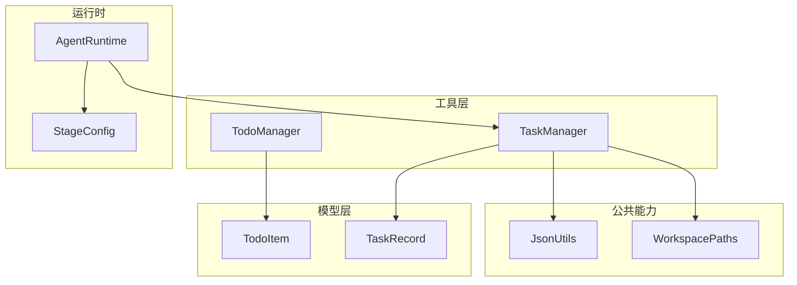
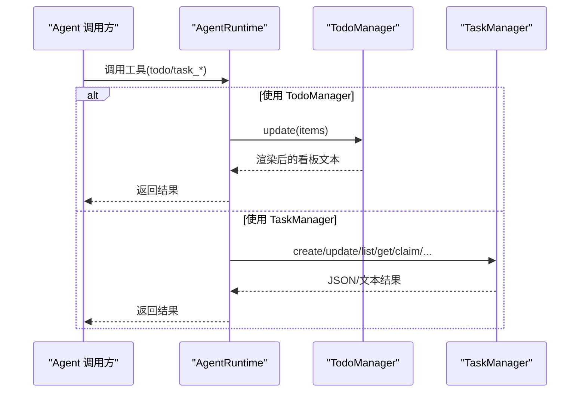
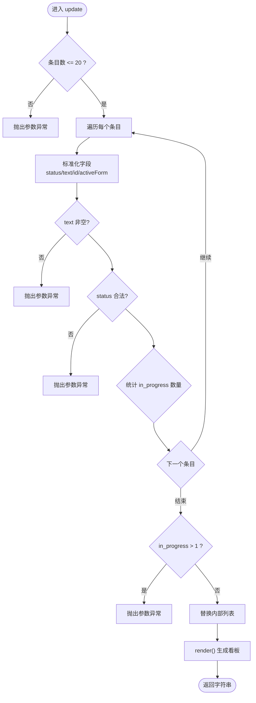
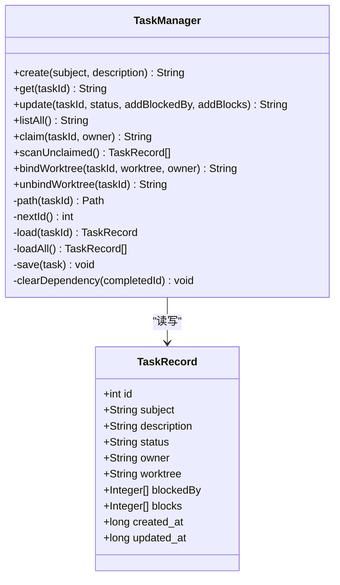
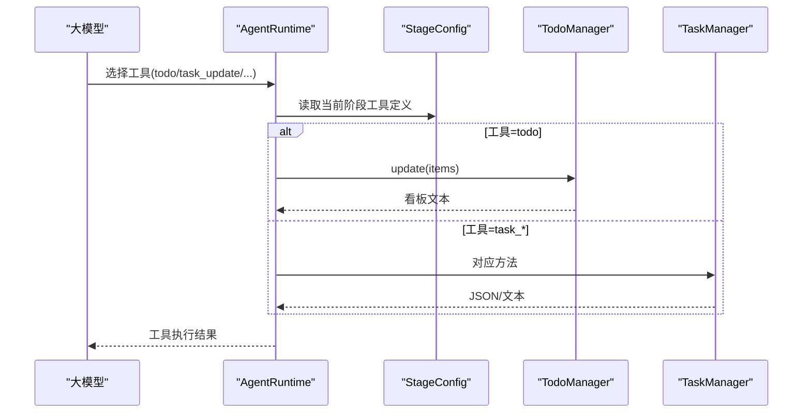
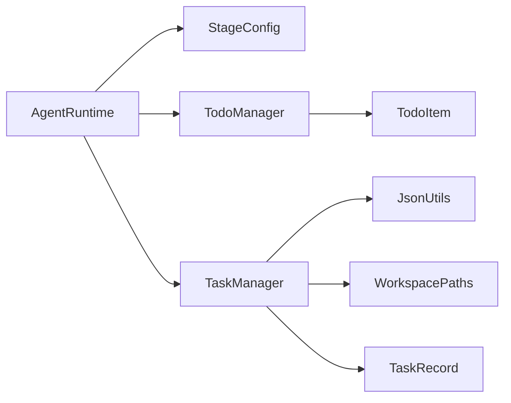

# 任务管理工具

<cite>
**本文引用的文件**
- [TodoManager.java](file://src/main/java/com/learnclaudecode/tools/TodoManager.java)
- [TodoItem.java](file://src/main/java/com/learnclaudecode/model/TodoItem.java)
- [TaskManager.java](file://src/main/java/com/learnclaudecode/tasks/TaskManager.java)
- [TaskRecord.java](file://src/main/java/com/learnclaudecode/model/TaskRecord.java)
- [JsonUtils.java](file://src/main/java/com/learnclaudecode/common/JsonUtils.java)
- [WorkspacePaths.java](file://src/main/java/com/learnclaudecode/common/WorkspacePaths.java)
- [StageConfig.java](file://src/main/java/com/learnclaudecode/agents/StageConfig.java)
- [AgentRuntime.java](file://src/main/java/com/learnclaudecode/agents/AgentRuntime.java)
</cite>

## 目录
1. [简介](#简介)
2. [项目结构](#项目结构)
3. [核心组件](#核心组件)
4. [架构总览](#架构总览)
5. [详细组件分析](#详细组件分析)
6. [依赖关系分析](#依赖关系分析)
7. [性能与扩展性](#性能与扩展性)
8. [故障排查指南](#故障排查指南)
9. [结论](#结论)
10. [附录：API 使用示例](#附录api-使用示例)

## 简介
本文件面向“任务管理工具”的文档目标，围绕 TodoManager 类及其在系统中的角色，系统阐述待办事项的生命周期管理（创建、更新、删除、状态跟踪）、数据模型设计、优先级与批量操作能力、持久化机制与同步策略、最佳实践与性能优化建议，以及与 Agent 运行时的集成方式和扩展点。同时补充 TaskManager 作为更完整的任务板实现，用于理解从轻量级 Todo 到可协作、可持久化的任务系统的演进路径。

## 项目结构
该仓库将“任务管理”能力拆分为两个层次：
- 轻量级 Todo 管理：TodoManager 提供内存中的待办清单，适合短流程、多步骤任务的即时规划与进度跟踪。
- 完整任务板：TaskManager 基于文件系统持久化任务记录，支持多 Agent 协作、依赖关系、认领与工作区隔离等能力。

图表来源
- [TodoManager.java:1-93](file://src/main/java/com/learnclaudecode/tools/TodoManager.java#L1-L93)
- [TaskManager.java:1-338](file://src/main/java/com/learnclaudecode/tasks/TaskManager.java#L1-L338)
- [TodoItem.java:1-8](file://src/main/java/com/learnclaudecode/model/TodoItem.java#L1-L8)
- [TaskRecord.java:1-62](file://src/main/java/com/learnclaudecode/model/TaskRecord.java#L1-L62)
- [JsonUtils.java:1-83](file://src/main/java/com/learnclaudecode/common/JsonUtils.java#L1-L83)
- [WorkspacePaths.java:1-150](file://src/main/java/com/learnclaudecode/common/WorkspacePaths.java#L1-L150)
- [StageConfig.java:96-165](file://src/main/java/com/learnclaudecode/agents/StageConfig.java#L96-L165)
- [AgentRuntime.java:227-245](file://src/main/java/com/learnclaudecode/agents/AgentRuntime.java#L227-L245)

章节来源
- [StageConfig.java:96-165](file://src/main/java/com/learnclaudecode/agents/StageConfig.java#L96-L165)
- [AgentRuntime.java:227-245](file://src/main/java/com/learnclaudecode/agents/AgentRuntime.java#L227-L245)

## 核心组件
- TodoManager：内存式待办清单管理器，负责校验、更新、渲染和未完成项检测；内置最大条目限制与并发执行约束。
- TaskManager：基于文件的持久化任务板，提供创建、查询、更新、认领、扫描可认领任务、绑定/解绑工作区、依赖清理等功能。
- 数据模型：
  - TodoItem：轻量记录，包含 id、text、status、activeForm。
  - TaskRecord：持久化任务记录，包含 id、subject、description、status、owner、worktree、blockedBy、blocks、created_at、updated_at。
- 公共能力：
  - JsonUtils：统一的 JSON 序列化/反序列化配置。
  - WorkspacePaths：安全的工作区路径解析与常用目录访问。

章节来源
- [TodoManager.java:1-93](file://src/main/java/com/learnclaudecode/tools/TodoManager.java#L1-L93)
- [TodoItem.java:1-8](file://src/main/java/com/learnclaudecode/model/TodoItem.java#L1-L8)
- [TaskManager.java:1-338](file://src/main/java/com/learnclaudecode/tasks/TaskManager.java#L1-L338)
- [TaskRecord.java:1-62](file://src/main/java/com/learnclaudecode/model/TaskRecord.java#L1-L62)
- [JsonUtils.java:1-83](file://src/main/java/com/learnclaudecode/common/JsonUtils.java#L1-L83)
- [WorkspacePaths.java:1-150](file://src/main/java/com/learnclaudecode/common/WorkspacePaths.java#L1-L150)

## 架构总览
TodoManager 与 TaskManager 分别承担不同场景的任务管理能力：
- TodoManager：适用于短期、单进程内的多步骤任务规划，通过 update 进行批量替换与校验，render 输出文本看板，hasOpenItems 辅助判断是否仍有未完成项。
- TaskManager：适用于跨进程/多 Agent 协作的持久化任务板，所有写操作均加锁保证一致性，并通过 clearDependency 维护依赖图的一致性。

图表来源
- [AgentRuntime.java:227-245](file://src/main/java/com/learnclaudecode/agents/AgentRuntime.java#L227-L245)
- [TodoManager.java:21-55](file://src/main/java/com/learnclaudecode/tools/TodoManager.java#L21-L55)
- [TaskManager.java:51-133](file://src/main/java/com/learnclaudecode/tasks/TaskManager.java#L51-L133)

## 详细组件分析

### TodoManager：待办清单生命周期与批量更新
- 生命周期
  - 创建：通过 update 传入新的 items 列表完成“整体替换式”创建或更新。
  - 更新：每次调用 update 都会对全部条目进行校验与标准化，并替换内部存储。
  - 删除：当前版本未提供显式删除接口；可通过再次调用 update 仅保留需要保留的条目来实现“逻辑删除”。
  - 状态跟踪：每个条目支持 pending/in_progress/completed 三种状态，且全局最多允许一个 in_progress。
- 校验与约束
  - 最大条目数限制：超过 20 条会抛出异常。
  - 必填字段：text/content 必须非空。
  - 状态白名单：仅允许指定三种状态。
  - 并发执行约束：in_progress 数量不能超过 1。
- 渲染与查询
  - render：生成人类可读的看板文本，包含标记、序号与完成计数。
  - hasOpenItems：快速判断是否存在未完成项。

图表来源
- [TodoManager.java:21-55](file://src/main/java/com/learnclaudecode/tools/TodoManager.java#L21-L55)
- [TodoManager.java:71-91](file://src/main/java/com/learnclaudecode/tools/TodoManager.java#L71-L91)

章节来源
- [TodoManager.java:21-55](file://src/main/java/com/learnclaudecode/tools/TodoManager.java#L21-L55)
- [TodoManager.java:62-91](file://src/main/java/com/learnclaudecode/tools/TodoManager.java#L62-L91)

### TodoItem：数据模型与字段含义
- id：唯一标识，若未提供则按顺序分配。
- text：任务描述文本，必填。
- status：状态枚举，取值 pending/in_progress/completed。
- activeForm：活跃形式文本，默认与 text 相同。

章节来源
- [TodoItem.java:1-8](file://src/main/java/com/learnclaudecode/model/TodoItem.java#L1-L8)

### TaskManager：持久化任务板与依赖管理
- 能力概览
  - 创建任务：create(subject, description)。
  - 获取详情：get(taskId)。
  - 更新任务：update(taskId, status, addBlockedBy, addBlocks)，支持状态变更、依赖追加、自动清理已完成任务的阻塞依赖。
  - 列出看板：listAll()。
  - 认领任务：claim(taskId, owner)。
  - 扫描可认领任务：scanUnclaimed()。
  - 绑定/解绑工作区：bindWorktree/unbindWorktree。
- 持久化与同步
  - 所有写方法均为 synchronized，确保同一时刻只有一个线程修改任务状态。
  - 任务以 JSON 文件形式保存在 .tasks 目录下，文件名形如 task_{id}.json。
  - 使用 JsonUtils 统一序列化/反序列化，时间戳使用 Instant.now().getEpochSecond()。
  - 依赖清理：当某任务被标记为 completed 时，会自动移除其他任务中对该任务的 blockedBy 引用，并立即落盘。
- 工作区隔离
  - 通过 worktree 字段将任务与独立工作目录关联，便于多任务并行隔离。

图表来源
- [TaskManager.java:51-133](file://src/main/java/com/learnclaudecode/tasks/TaskManager.java#L51-L133)
- [TaskManager.java:140-249](file://src/main/java/com/learnclaudecode/tasks/TaskManager.java#L140-L249)
- [TaskManager.java:257-336](file://src/main/java/com/learnclaudecode/tasks/TaskManager.java#L257-L336)
- [TaskRecord.java:1-62](file://src/main/java/com/learnclaudecode/model/TaskRecord.java#L1-L62)

章节来源
- [TaskManager.java:51-133](file://src/main/java/com/learnclaudecode/tasks/TaskManager.java#L51-L133)
- [TaskManager.java:140-249](file://src/main/java/com/learnclaudecode/tasks/TaskManager.java#L140-L249)
- [TaskManager.java:257-336](file://src/main/java/com/learnclaudecode/tasks/TaskManager.java#L257-L336)
- [TaskRecord.java:1-62](file://src/main/java/com/learnclaudecode/model/TaskRecord.java#L1-L62)

### 与 Agent 运行时的集成
- StageConfig 暴露了 todo、task_* 等工具定义，供 Agent 在 s03/s07/s11/s12 等阶段按需启用。
- AgentRuntime 根据工具名路由到具体实现，例如 claim_task 映射到 TaskManager.claim，todo 映射到 TodoManager.update。

图表来源
- [StageConfig.java:96-165](file://src/main/java/com/learnclaudecode/agents/StageConfig.java#L96-L165)
- [AgentRuntime.java:227-245](file://src/main/java/com/learnclaudecode/agents/AgentRuntime.java#L227-L245)
- [TodoManager.java:21-55](file://src/main/java/com/learnclaudecode/tools/TodoManager.java#L21-L55)
- [TaskManager.java:51-133](file://src/main/java/com/learnclaudecode/tasks/TaskManager.java#L51-L133)

章节来源
- [StageConfig.java:96-165](file://src/main/java/com/learnclaudecode/agents/StageConfig.java#L96-L165)
- [AgentRuntime.java:227-245](file://src/main/java/com/learnclaudecode/agents/AgentRuntime.java#L227-L245)

## 依赖关系分析
- TodoManager
  - 依赖模型：TodoItem（概念上），实际使用 Map<String,Object> 承载条目。
  - 无外部 I/O 依赖，纯内存操作。
- TaskManager
  - 依赖 JsonUtils 进行 JSON 序列化/反序列化。
  - 依赖 WorkspacePaths 获取 .tasks 目录路径并确保安全路径。
  - 依赖 TaskRecord 作为持久化实体。
- 运行时集成
  - StageConfig 提供工具定义，AgentRuntime 负责调度。

图表来源
- [AgentRuntime.java:227-245](file://src/main/java/com/learnclaudecode/agents/AgentRuntime.java#L227-L245)
- [StageConfig.java:96-165](file://src/main/java/com/learnclaudecode/agents/StageConfig.java#L96-L165)
- [TodoManager.java:1-93](file://src/main/java/com/learnclaudecode/tools/TodoManager.java#L1-L93)
- [TaskManager.java:1-338](file://src/main/java/com/learnclaudecode/tasks/TaskManager.java#L1-L338)
- [JsonUtils.java:1-83](file://src/main/java/com/learnclaudecode/common/JsonUtils.java#L1-L83)
- [WorkspacePaths.java:1-150](file://src/main/java/com/learnclaudecode/common/WorkspacePaths.java#L1-L150)
- [TaskRecord.java:1-62](file://src/main/java/com/learnclaudecode/model/TaskRecord.java#L1-L62)
- [TodoItem.java:1-8](file://src/main/java/com/learnclaudecode/model/TodoItem.java#L1-L8)

章节来源
- [TaskManager.java:1-338](file://src/main/java/com/learnclaudecode/tasks/TaskManager.java#L1-L338)
- [TodoManager.java:1-93](file://src/main/java/com/learnclaudecode/tools/TodoManager.java#L1-L93)

## 性能与扩展性
- 性能特性
  - TodoManager：内存操作，O(n) 校验与渲染，n 为条目数；受限于最大 20 条，适合短时任务规划。
  - TaskManager：磁盘 I/O 为主，所有写操作加锁避免竞态；loadAll 扫描 .tasks 目录并按文件名排序，适合中小规模任务集。
- 优化建议
  - 批量更新：优先使用 TodoManager.update 一次性替换整个清单，减少多次往返。
  - 依赖清理：利用 TaskManager.update 的状态流转自动清理依赖，避免手动维护。
  - 工作区隔离：通过 bindWorktree 将任务与独立目录绑定，降低上下文冲突。
  - 并发控制：TaskManager 已对关键方法加锁；如需更高吞吐，可在上层引入队列或分片策略。
- 扩展点
  - 新增状态：可扩展 TodoManager 的状态白名单与渲染逻辑；TaskManager 的状态机需同步调整。
  - 持久化后端：可将 TaskManager 的文件存储替换为数据库或对象存储，保持接口不变。
  - 优先级：可在 TaskRecord 中增加 priority 字段，并在 listAll 中按优先级排序；TodoManager 也可在渲染时体现优先级。

[本节为通用指导，不直接分析具体文件]

## 故障排查指南
- 常见异常与处理
  - TodoManager.update
    - 条目数超限：检查传入 items 长度不超过 20。
    - 文本为空：确保每个条目包含非空的 text 或 content。
    - 非法状态：仅允许 pending/in_progress/completed。
    - 多个 in_progress：确保至多一个条目处于 in_progress。
  - TaskManager
    - 任务不存在：get/load 时会抛出参数异常，确认 taskId 有效。
    - 文件读写失败：IO 异常会被包装为 IllegalStateException，检查 .tasks 目录权限与磁盘空间。
    - 依赖不一致：completed 后应自动清理依赖；若发现残留，检查是否绕过 update 直接修改文件。
- 调试建议
  - 打印看板：使用 TodoManager.render 或 TaskManager.listAll 查看当前视图。
  - 检查时间戳：TaskRecord.created_at/updated_at 可用于追踪变更历史。
  - 工作区路径：通过 WorkspacePaths 的安全解析验证路径是否越界。

章节来源
- [TodoManager.java:21-55](file://src/main/java/com/learnclaudecode/tools/TodoManager.java#L21-L55)
- [TaskManager.java:69-133](file://src/main/java/com/learnclaudecode/tasks/TaskManager.java#L69-L133)
- [TaskManager.java:276-322](file://src/main/java/com/learnclaudecode/tasks/TaskManager.java#L276-L322)

## 结论
TodoManager 提供了轻量、易用的待办清单管理能力，适合短期多步骤任务的规划与进度跟踪；TaskManager 则提供了持久化、可协作、带依赖关系的任务板，满足更复杂的团队协作需求。两者结合，既能满足简单场景的快速迭代，也能支撑复杂项目的任务编排。通过 StageConfig 与 AgentRuntime 的集成，这些能力可以无缝嵌入到 Agent 的工具链中，形成“思考—计划—执行—反馈”的闭环。

[本节为总结性内容，不直接分析具体文件]

## 附录：API 使用示例
以下示例展示如何调用核心 API，包括方法签名、参数说明与返回值处理。为避免泄露实现细节，仅提供调用方式与预期行为说明。

- TodoManager
  - update(items): 批量更新待办清单
    - 参数：items 为对象数组，每项包含 id、text/content、status、activeForm 等字段。
    - 返回：渲染后的看板文本。
    - 注意：最多 20 条；仅允许一个 in_progress；text 必填。
  - hasOpenItems(): 判断是否有未完成项
    - 返回：布尔值。
  - render(): 渲染看板
    - 返回：文本视图。

- TaskManager
  - create(subject, description): 创建任务
    - 参数：subject 主题，description 描述。
    - 返回：新任务的 JSON 表示。
  - get(taskId): 获取任务详情
    - 参数：taskId 整数。
    - 返回：任务 JSON。
  - update(taskId, status, addBlockedBy, addBlocks): 更新任务
    - 参数：taskId 整数；status 可选新状态；addBlockedBy/addBlocks 为依赖 ID 列表。
    - 返回：更新后的任务 JSON 或删除提示。
  - listAll(): 列出看板
    - 返回：文本看板。
  - claim(taskId, owner): 认领任务
    - 参数：taskId 整数；owner 认领者标识。
    - 返回：认领结果文本。
  - scanUnclaimed(): 扫描可认领任务
    - 返回：符合条件的任务记录列表。
  - bindWorktree(taskId, worktree, owner): 绑定工作区
    - 参数：taskId 整数；worktree 工作区名称；owner 可选。
    - 返回：更新后的任务 JSON。
  - unbindWorktree(taskId): 解绑工作区
    - 参数：taskId 整数。
    - 返回：更新后的任务 JSON。

章节来源
- [TodoManager.java:21-91](file://src/main/java/com/learnclaudecode/tools/TodoManager.java#L21-L91)
- [TaskManager.java:51-249](file://src/main/java/com/learnclaudecode/tasks/TaskManager.java#L51-L249)