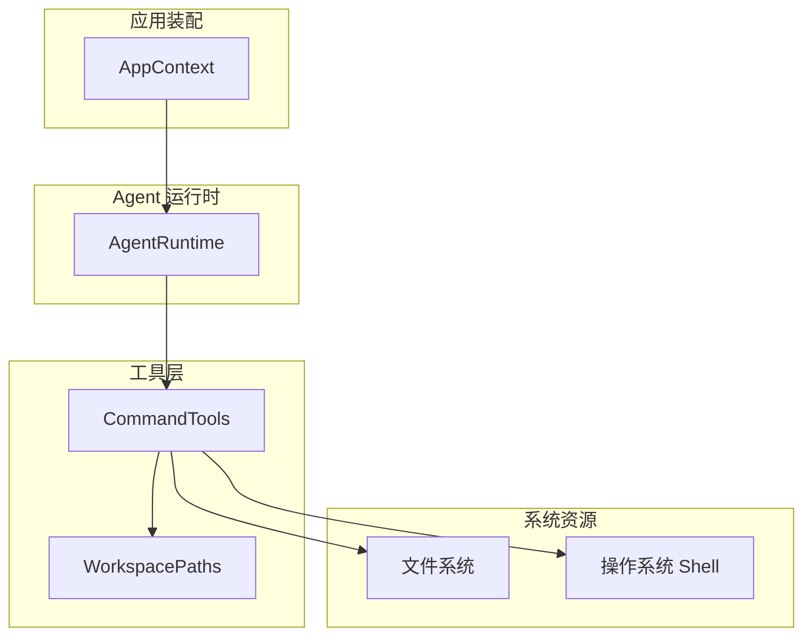
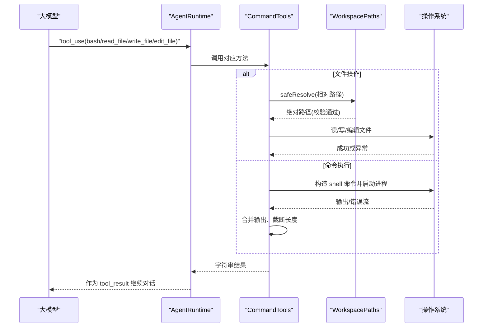
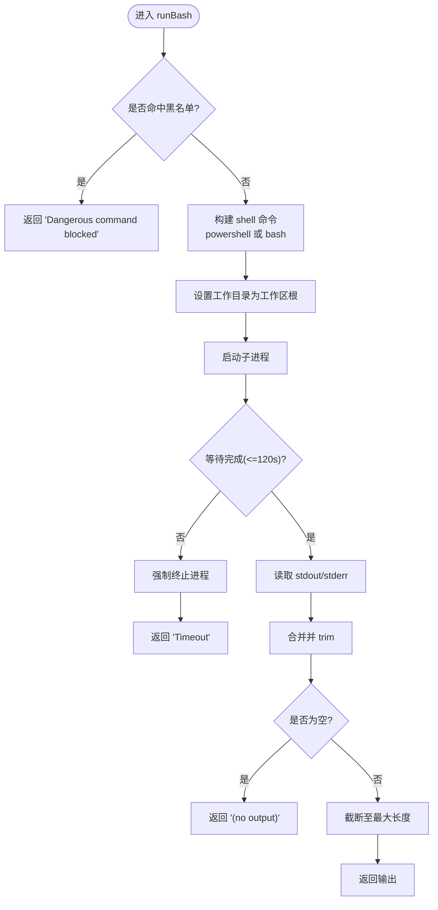
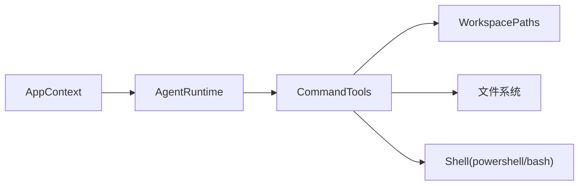

# 命令工具

<cite>
**本文引用的文件**
- [CommandTools.java](file://src/main/java/com/learnclaudecode/tools/CommandTools.java)
- [WorkspacePaths.java](file://src/main/java/com/learnclaudecode/common/WorkspacePaths.java)
- [AgentRuntime.java](file://src/main/java/com/learnclaudecode/agents/AgentRuntime.java)
- [AppContext.java](file://src/main/java/com/learnclaudecode/agents/AppContext.java)
- [ToolSpec.java](file://src/main/java/com/learnclaudecode/model/ToolSpec.java)
</cite>

## 目录
1. [简介](#简介)
2. [项目结构](#项目结构)
3. [核心组件](#核心组件)
4. [架构总览](#架构总览)
5. [详细组件分析](#详细组件分析)
6. [依赖关系分析](#依赖关系分析)
7. [性能考虑](#性能考虑)
8. [故障排查指南](#故障排查指南)
9. [结论](#结论)
10. [附录：使用示例与最佳实践](#附录使用示例与最佳实践)

## 简介
本文件围绕 CommandTools 类，系统性说明其在“工作区内的文件操作”和“命令执行”两大能力上的实现原理、安全限制、跨平台兼容方式，以及与 WorkspacePaths 的集成模式。同时给出 Agent 运行时如何调用这些工具的完整流程、参数约定、返回值格式与错误处理策略，并提供性能优化建议与常见问题解决方案。

## 项目结构
CommandTools 位于 tools 包中，提供四类能力：
- 在工作区内执行 shell 命令（bash/powershell）
- 读取工作区内文件内容（支持行数限制）
- 写入工作区内文件内容（自动创建父目录）
- 精确替换工作区内文件的某段文本

其安全边界由 WorkspacePaths 提供，确保所有路径解析均限定在工作区根目录下，防止路径逃逸。

图表来源
- [AppContext.java:35-58](file://src/main/java/com/learnclaudecode/agents/AppContext.java#L35-L58)
- [AgentRuntime.java:40-89](file://src/main/java/com/learnclaudecode/agents/AgentRuntime.java#L40-L89)
- [CommandTools.java:16-28](file://src/main/java/com/learnclaudecode/tools/CommandTools.java#L16-L28)
- [WorkspacePaths.java:11-23](file://src/main/java/com/learnclaudecode/common/WorkspacePaths.java#L11-L23)

章节来源
- [AppContext.java:35-58](file://src/main/java/com/learnclaudecode/agents/AppContext.java#L35-L58)
- [AgentRuntime.java:40-89](file://src/main/java/com/learnclaudecode/agents/AgentRuntime.java#L40-L89)
- [CommandTools.java:16-28](file://src/main/java/com/learnclaudecode/tools/CommandTools.java#L16-L28)
- [WorkspacePaths.java:11-23](file://src/main/java/com/learnclaudecode/common/WorkspacePaths.java#L11-L23)

## 核心组件
- CommandTools：封装工作区内的命令执行与文件读写编辑能力，内置基础安全拦截与超时控制。
- WorkspacePaths：负责工作区根路径管理与安全路径解析，防止路径逃逸。
- AgentRuntime：将模型返回的工具调用映射到本地方法，驱动 CommandTools 执行并聚合结果。
- ToolSpec：描述工具名称、说明与输入参数 schema，用于向模型暴露工具能力。

章节来源
- [CommandTools.java:16-146](file://src/main/java/com/learnclaudecode/tools/CommandTools.java#L16-L146)
- [WorkspacePaths.java:11-49](file://src/main/java/com/learnclaudecode/common/WorkspacePaths.java#L11-L49)
- [AgentRuntime.java:180-200](file://src/main/java/com/learnclaudecode/agents/AgentRuntime.java#L180-L200)
- [ToolSpec.java:1-10](file://src/main/java/com/learnclaudecode/model/ToolSpec.java#L1-L10)

## 架构总览
CommandTools 在 Agent 运行时的工具分发中被调用，形成“模型决策 -> 本地执行 -> 结果回传”的闭环。文件操作通过 WorkspacePaths 的安全解析保证只在工作区内进行；命令执行通过 ProcessBuilder 启动子进程，并在受限的工作目录内运行，配合黑名单与超时保护。

图表来源
- [AgentRuntime.java:180-200](file://src/main/java/com/learnclaudecode/agents/AgentRuntime.java#L180-L200)
- [CommandTools.java:36-78](file://src/main/java/com/learnclaudecode/tools/CommandTools.java#L36-L78)
- [WorkspacePaths.java:42-49](file://src/main/java/com/learnclaudecode/common/WorkspacePaths.java#L42-L49)

## 详细组件分析

### CommandTools 类
职责与能力
- 命令执行：runBash(command)
  - 基于黑名单的最小防护，避免危险命令
  - 根据操作系统选择 powershell 或 bash
  - 设置工作目录为工作区根目录
  - 设置 120 秒超时，超时强制终止进程
  - 合并 stdout/stderr，空输出返回占位提示，输出最大截断至固定长度
- 文件读取：runRead(relativePath, limit)
  - 通过 WorkspacePaths.safeResolve 安全解析路径
  - 支持按行限制读取，超出部分以提示行替代
  - 输出最大截断至固定长度
- 文件写入：runWrite(relativePath, content)
  - 安全解析路径，自动创建父目录
  - 以 UTF-8 编码写入内容
- 文件编辑：runEdit(relativePath, oldText, newText)
  - 安全解析路径，读取全文
  - 精确匹配旧文本，使用正则转义避免特殊字符问题
  - 仅替换首次匹配项

安全机制
- 危险命令黑名单：包含若干高危关键字，命中即拒绝执行
- 路径安全检查：全部文件操作经由 WorkspacePaths.safeResolve，阻止 ../ 等路径逃逸
- 工作目录隔离：命令执行时强制设置工作目录为工作区根目录
- 超时与资源回收：命令执行设置超时，超时后强制销毁进程
- 输出截断：统一对输出进行最大长度限制，避免上下文溢出

跨平台兼容
- 通过检测操作系统属性决定底层 shell：Windows 使用 powershell，其他系统使用 bash
- 统一对外接口，屏蔽平台差异

异常与错误处理
- 捕获 IO 异常与中断异常，返回结构化错误信息
- 文件编辑失败时返回明确提示（如未找到待替换文本）

图表来源
- [CommandTools.java:36-78](file://src/main/java/com/learnclaudecode/tools/CommandTools.java#L36-L78)

章节来源
- [CommandTools.java:36-146](file://src/main/java/com/learnclaudecode/tools/CommandTools.java#L36-L146)

### WorkspacePaths 类
职责与能力
- 工作区根路径管理：构造函数规范化为绝对路径
- 安全路径解析：safeResolve 将相对路径与工作区根拼接并规范化，若不在工作区内则抛出非法参数异常
- 常用目录访问：提供 .tasks、.team、skills、.transcripts、.worktrees 等目录路径
- 文本读写：readText/writeText 基于 safeResolve 保证安全

安全要点
- 所有文件访问必须经过 safeResolve，防止路径逃逸
- 写入前自动创建父目录，简化调用方逻辑

章节来源
- [WorkspacePaths.java:11-75](file://src/main/java/com/learnclaudecode/common/WorkspacePaths.java#L11-L75)

### AgentRuntime 中的工具调度
职责与能力
- 接收模型返回的 tool_use 消息
- 将工具名映射到 CommandTools 的具体方法
- 将执行结果作为 tool_result 回传给模型，驱动下一轮对话

关键映射
- bash -> runBash(command)
- read_file -> runRead(path, limit?)
- write_file -> runWrite(path, content)
- edit_file -> runEdit(path, old_text, new_text)

章节来源
- [AgentRuntime.java:180-200](file://src/main/java/com/learnclaudecode/agents/AgentRuntime.java#L180-L200)

### ToolSpec 工具定义
- 记录工具名称、描述与输入 schema，便于向模型暴露工具能力
- 与 AgentRuntime 的工具分发逻辑配合，形成“声明式工具 + 动态调度”的模式

章节来源
- [ToolSpec.java:1-10](file://src/main/java/com/learnclaudecode/model/ToolSpec.java#L1-L10)

## 依赖关系分析
- AppContext 装配 CommandTools 并注入 AgentRuntime
- AgentRuntime 依赖 CommandTools 执行具体工具
- CommandTools 依赖 WorkspacePaths 进行安全路径解析
- CommandTools 依赖操作系统提供的 shell 与文件系统

图表来源
- [AppContext.java:35-58](file://src/main/java/com/learnclaudecode/agents/AppContext.java#L35-L58)
- [AgentRuntime.java:40-89](file://src/main/java/com/learnclaudecode/agents/AgentRuntime.java#L40-L89)
- [CommandTools.java:16-28](file://src/main/java/com/learnclaudecode/tools/CommandTools.java#L16-L28)
- [WorkspacePaths.java:11-23](file://src/main/java/com/learnclaudecode/common/WorkspacePaths.java#L11-L23)

章节来源
- [AppContext.java:35-58](file://src/main/java/com/learnclaudecode/agents/AppContext.java#L35-L58)
- [AgentRuntime.java:40-89](file://src/main/java/com/learnclaudecode/agents/AgentRuntime.java#L40-L89)
- [CommandTools.java:16-28](file://src/main/java/com/learnclaudecode/tools/CommandTools.java#L16-L28)
- [WorkspacePaths.java:11-23](file://src/main/java/com/learnclaudecode/common/WorkspacePaths.java#L11-L23)

## 性能考虑
- 命令执行超时：默认 120 秒，避免长时间阻塞；必要时可调整超时阈值
- 输出截断：统一限制输出长度，减少上下文占用与网络传输开销
- 文件读取限长：runRead 支持 limit 参数，避免一次性加载超大文件
- 目录创建：写入前自动创建父目录，减少重复 I/O 与异常分支
- 正则替换：edit_file 使用转义后的精确匹配，避免误替换导致的额外处理

[本节为通用性能建议，不直接分析具体代码]

## 故障排查指南
- 路径逃逸异常：当相对路径尝试跳出工作区时会抛出非法参数异常，检查传入路径是否正确且位于工作区内
- 危险命令被拦截：命中黑名单会直接拒绝执行，确认命令不包含敏感关键字
- 命令执行超时：超过 120 秒会被强制终止，检查命令是否死循环或耗时过长
- 文件编辑失败：若未找到待替换文本会返回错误提示，确认 oldText 是否存在且完全匹配
- 权限问题：写入或创建目录可能因权限不足失败，检查工作区目录权限
- 跨平台差异：Windows 使用 powershell，Unix 使用 bash，注意命令语法差异

章节来源
- [CommandTools.java:36-146](file://src/main/java/com/learnclaudecode/tools/CommandTools.java#L36-L146)
- [WorkspacePaths.java:42-49](file://src/main/java/com/learnclaudecode/common/WorkspacePaths.java#L42-L49)

## 结论
CommandTools 提供了面向工作区的命令执行与文件操作能力，并通过 WorkspacePaths 实现了严格的路径安全控制。结合 AgentRuntime 的工具调度机制，形成了“模型决策 -> 本地执行 -> 结果反馈”的高效闭环。其设计兼顾了安全性、跨平台兼容性与性能优化，适合作为教学与轻量级工程的基础工具层。

[本节为总结性内容，不直接分析具体代码]

## 附录：使用示例与最佳实践

### 工具调用与参数说明
- bash
  - 参数：command（字符串）
  - 行为：在工作区根目录下执行 shell 命令
  - 返回：命令输出或错误信息（含超时、被拦截等情况）
- read_file
  - 参数：path（字符串）、limit（可选整数）
  - 行为：读取工作区内文件内容，支持按行限制
  - 返回：文件内容或错误信息
- write_file
  - 参数：path（字符串）、content（字符串）
  - 行为：写入内容到工作区内文件，自动创建父目录
  - 返回：写入字节数与路径或错误信息
- edit_file
  - 参数：path（字符串）、old_text（字符串）、new_text（字符串）
  - 行为：精确替换首次匹配的旧文本为新文本
  - 返回：编辑结果或错误信息

章节来源
- [AgentRuntime.java:180-200](file://src/main/java/com/learnclaudecode/agents/AgentRuntime.java#L180-L200)
- [CommandTools.java:36-146](file://src/main/java/com/learnclaudecode/tools/CommandTools.java#L36-L146)

### 返回值格式与错误处理
- 成功：返回人类可读的结果字符串（例如写入字节数、编辑成功提示、命令输出）
- 失败：返回以 “Error: ” 开头的错误信息，便于上层统一处理
- 空输出：命令无输出时返回占位提示，避免空字符串歧义
- 超长输出：统一截断至固定长度，避免上下文溢出

章节来源
- [CommandTools.java:36-146](file://src/main/java/com/learnclaudecode/tools/CommandTools.java#L36-L146)

### 与 WorkspacePaths 的集成与最佳实践
- 所有文件操作必须通过 WorkspacePaths.safeResolve，确保路径安全
- 写入前无需手动创建目录，工具内部会自动处理
- 读取大文件时使用 limit 参数，避免一次性加载过多内容
- 编辑文件时确保 oldText 完全匹配，必要时先读取确认内容

章节来源
- [WorkspacePaths.java:42-75](file://src/main/java/com/learnclaudecode/common/WorkspacePaths.java#L42-L75)
- [CommandTools.java:87-146](file://src/main/java/com/learnclaudecode/tools/CommandTools.java#L87-L146)

### 安全限制措施
- 危险命令黑名单：包含若干高危关键字，命中即拒绝执行
- 路径安全检查：禁止路径逃逸出工作区
- 工作目录隔离：命令执行限定在工作区根目录
- 超时保护：命令执行设置超时，超时后强制终止

章节来源
- [CommandTools.java:16-78](file://src/main/java/com/learnclaudecode/tools/CommandTools.java#L16-L78)
- [WorkspacePaths.java:42-49](file://src/main/java/com/learnclaudecode/common/WorkspacePaths.java#L42-L49)

### 跨平台兼容性
- Windows：使用 powershell 执行命令
- Unix/Linux/macOS：使用 bash 执行命令
- 对外接口一致，屏蔽平台差异

章节来源
- [CommandTools.java:73-78](file://src/main/java/com/learnclaudecode/tools/CommandTools.java#L73-L78)