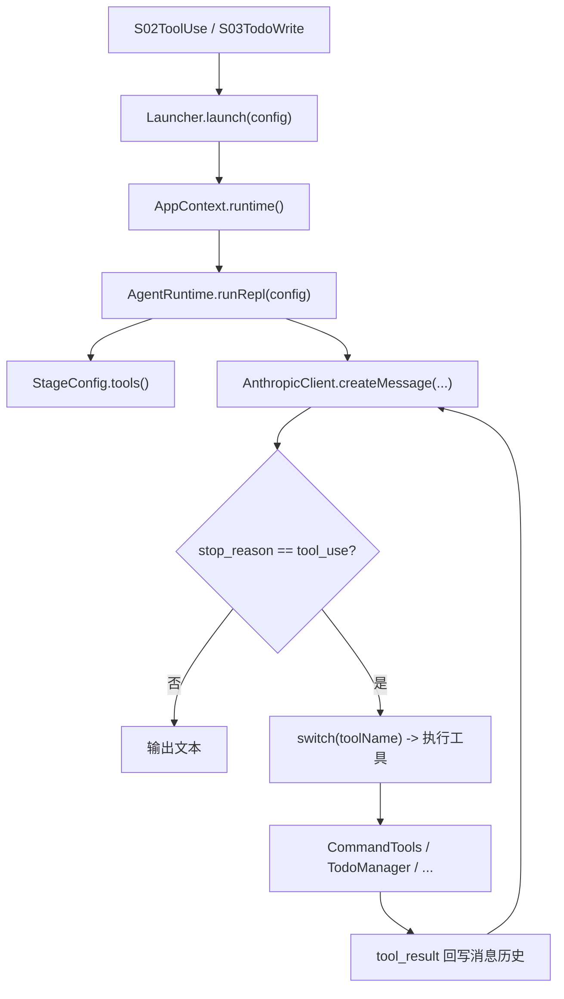
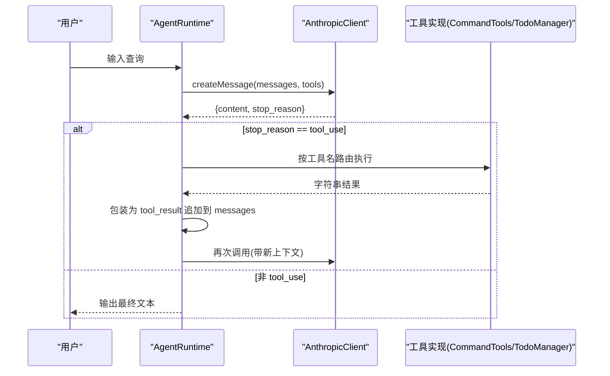
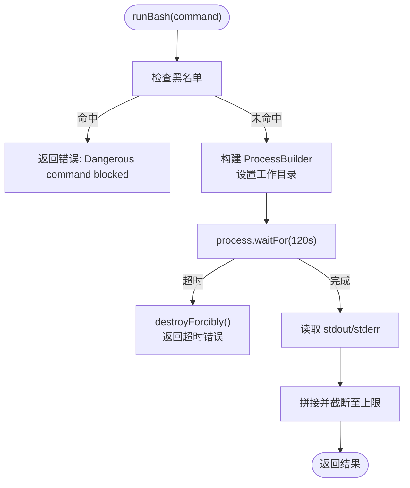
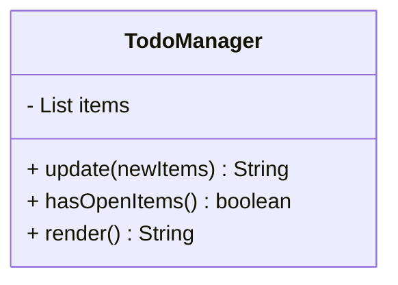
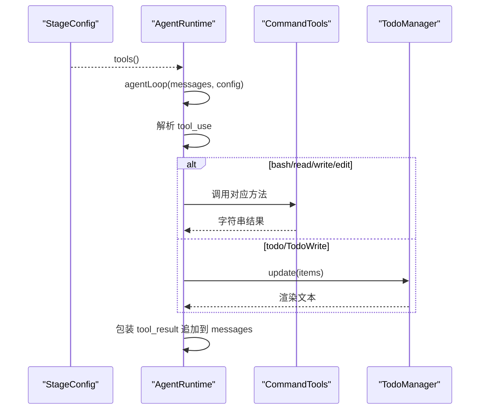
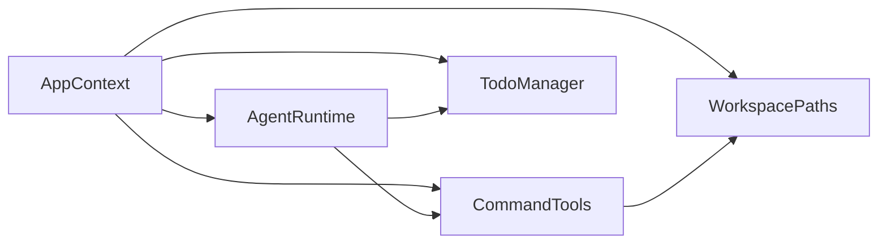

# 工具系统

<cite>
**本文引用的文件**
- [CommandTools.java](file://src/main/java/com/learnclaudecode/tools/CommandTools.java)
- [TodoManager.java](file://src/main/java/com/learnclaudecode/tools/TodoManager.java)
- [ToolSpec.java](file://src/main/java/com/learnclaudecode/model/ToolSpec.java)
- [StageConfig.java](file://src/main/java/com/learnclaudecode/agents/StageConfig.java)
- [AgentRuntime.java](file://src/main/java/com/learnclaudecode/agents/AgentRuntime.java)
- [AppContext.java](file://src/main/java/com/learnclaudecode/agents/AppContext.java)
- [WorkspacePaths.java](file://src/main/java/com/learnclaudecode/common/WorkspacePaths.java)
- [S02ToolUse.java](file://src/main/java/com/learnclaudecode/agents/S02ToolUse.java)
- [S03TodoWrite.java](file://src/main/java/com/learnclaudecode/agents/S03TodoWrite.java)
</cite>

## 目录
1. [简介](#简介)
2. [项目结构](#项目结构)
3. [核心组件](#核心组件)
4. [架构总览](#架构总览)
5. [详细组件分析](#详细组件分析)
6. [依赖关系分析](#依赖关系分析)
7. [性能与最佳实践](#性能与最佳实践)
8. [故障排查指南](#故障排查指南)
9. [结论](#结论)
10. [附录：自定义工具开发指南](#附录自定义工具开发指南)

## 简介
本文件面向希望理解并扩展“工具系统”的开发者，系统性说明工具的注册机制、调用流程、结果处理方式，以及内置工具 CommandTools（文件操作与命令执行）和 TodoManager（任务管理）的实现原理。同时给出 ToolSpec 模型设计说明，并提供从零开始开发自定义工具的完整指南，包括接口规范、参数校验、错误处理和性能优化建议。

## 项目结构
工具系统围绕“配置驱动 + 运行时调度”展开：
- StageConfig 负责声明当前阶段可用的工具集合（名称、描述、输入 schema）。
- AgentRuntime 在运行期根据模型返回的工具调用请求，将工具名路由到具体实现并执行。
- AppContext 统一装配各服务（如 CommandTools、TodoManager、工作区路径等），注入 AgentRuntime。
- WorkspacePaths 提供安全的工作区路径解析，防止越权访问。
- S02/S03 示例入口通过 Launcher 启动不同阶段的 Agent 能力。

图表来源
- [S02ToolUse.java:9-11](file://src/main/java/com/learnclaudecode/agents/S02ToolUse.java#L9-L11)
- [S03TodoWrite.java:9-11](file://src/main/java/com/learnclaudecode/agents/S03TodoWrite.java#L9-L11)
- [AppContext.java:35-58](file://src/main/java/com/learnclaudecode/agents/AppContext.java#L35-L58)
- [AgentRuntime.java:97-123](file://src/main/java/com/learnclaudecode/agents/AgentRuntime.java#L97-L123)
- [AgentRuntime.java:131-260](file://src/main/java/com/learnclaudecode/agents/AgentRuntime.java#L131-L260)
- [StageConfig.java:56-69](file://src/main/java/com/learnclaudecode/agents/StageConfig.java#L56-L69)

章节来源
- [AppContext.java:35-58](file://src/main/java/com/learnclaudecode/agents/AppContext.java#L35-L58)
- [AgentRuntime.java:97-123](file://src/main/java/com/learnclaudecode/agents/AgentRuntime.java#L97-L123)
- [StageConfig.java:56-69](file://src/main/java/com/learnclaudecode/agents/StageConfig.java#L56-L69)

## 核心组件
- 工具定义与注册：StageConfig.baseTools() 与 tool(name, description, schema) 构造标准工具定义；s01-s12/s_full 组合出不同能力集。
- 工具调度与执行：AgentRuntime.agentLoop() 中 switch(toolName) 将模型意图映射到本地方法。
- 工具实现：
  - CommandTools：bash 命令执行、read/write/edit 文件操作，含安全限制与超时控制。
  - TodoManager：维护待办列表，支持状态校验、渲染为看板文本。
- 模型交互：AnthropicClient.createMessage(...) 接收 messages、tools，返回 stop_reason 与 content。
- 工作区安全：WorkspacePaths.safeResolve() 确保所有文件操作不逃逸工作区根目录。

章节来源
- [StageConfig.java:56-69](file://src/main/java/com/learnclaudecode/agents/StageConfig.java#L56-L69)
- [AgentRuntime.java:180-240](file://src/main/java/com/learnclaudecode/agents/AgentRuntime.java#L180-L240)
- [CommandTools.java:36-144](file://src/main/java/com/learnclaudecode/tools/CommandTools.java#L36-L144)
- [TodoManager.java:21-91](file://src/main/java/com/learnclaudecode/tools/TodoManager.java#L21-L91)
- [WorkspacePaths.java:42-49](file://src/main/java/com/learnclaudecode/common/WorkspacePaths.java#L42-L49)

## 架构总览
工具系统的核心思想是“声明式工具 + 运行时分发”。StageConfig 暴露 tools 给模型；AgentRuntime 负责把模型的工具调用请求分派到具体实现；工具执行后以 tool_result 形式回写消息历史，驱动下一轮推理。

图表来源
- [AgentRuntime.java:131-260](file://src/main/java/com/learnclaudecode/agents/AgentRuntime.java#L131-L260)
- [StageConfig.java:56-69](file://src/main/java/com/learnclaudecode/agents/StageConfig.java#L56-L69)

## 详细组件分析

### CommandTools：文件与命令执行
- 命令执行 runBash(command)
  - 黑名单拦截危险命令。
  - 使用 ProcessBuilder 在工作区目录下执行 shell 命令，设置 120 秒超时，合并 stdout/stderr 并截断过长输出。
  - 跨平台 shell 选择由 shellCommand(command) 决定。
- 文件读取 runRead(path, limit)
  - 通过 WorkspacePaths.safeResolve 安全解析路径。
  - 支持行数限制，避免大文件占用过多上下文。
- 文件写入 runWrite(path, content)
  - 自动创建父目录，UTF-8 写入。
- 精确替换 runEdit(path, oldText, newText)
  - 基于正则转义进行首次匹配替换，保证精准编辑。

图表来源
- [CommandTools.java:36-78](file://src/main/java/com/learnclaudecode/tools/CommandTools.java#L36-L78)
- [CommandTools.java:87-144](file://src/main/java/com/learnclaudecode/tools/CommandTools.java#L87-L144)

章节来源
- [CommandTools.java:36-144](file://src/main/java/com/learnclaudecode/tools/CommandTools.java#L36-L144)
- [WorkspacePaths.java:42-49](file://src/main/java/com/learnclaudecode/common/WorkspacePaths.java#L42-L49)

### TodoManager：任务管理
- update(items)
  - 校验条目数量上限（最多 20）。
  - 兼容 text/content 字段，规范化 status（pending/in_progress/completed）。
  - 强制仅允许一个 in_progress 任务。
  - 标准化字段并持久化到内存列表。
- hasOpenItems()
  - 判断是否存在未完成项。
- render()
  - 将内部列表渲染为人类可读的看板文本，包含进度统计。

图表来源
- [TodoManager.java:12-91](file://src/main/java/com/learnclaudecode/tools/TodoManager.java#L12-L91)

章节来源
- [TodoManager.java:21-91](file://src/main/java/com/learnclaudecode/tools/TodoManager.java#L21-L91)

### ToolSpec：工具规格模型
- 用于对齐 Claude messages API 的工具描述结构，包含 name、description、input_schema。
- 在 StageConfig.tool(...) 中构造 Map 形式的工具定义，供模型识别与参数校验。

章节来源
- [ToolSpec.java:5-9](file://src/main/java/com/learnclaudecode/model/ToolSpec.java#L5-L9)
- [StageConfig.java:277-284](file://src/main/java/com/learnclaudecode/agents/StageConfig.java#L277-L284)

### 工具注册与调用流程
- 注册：StageConfig.baseTools() 定义基础工具（bash/read_file/write_file/edit_file），各阶段通过组合添加更多工具。
- 调用：AgentRuntime.agentLoop() 收到模型 tool_use 后，依据工具名路由到对应实现，执行后将结果封装为 tool_result 追加到消息历史。
- 结果处理：工具输出被截断显示，并以 user 消息形式回喂模型，驱动下一轮决策。

图表来源
- [StageConfig.java:56-69](file://src/main/java/com/learnclaudecode/agents/StageConfig.java#L56-L69)
- [AgentRuntime.java:180-240](file://src/main/java/com/learnclaudecode/agents/AgentRuntime.java#L180-L240)

章节来源
- [StageConfig.java:56-69](file://src/main/java/com/learnclaudecode/agents/StageConfig.java#L56-L69)
- [AgentRuntime.java:180-240](file://src/main/java/com/learnclaudecode/agents/AgentRuntime.java#L180-L240)

## 依赖关系分析
- AppContext 集中装配：创建 EnvConfig、WorkspacePaths、CommandTools、TodoManager、SkillLoader、CompressionService、TaskManager、BackgroundManager、MessageBus、TeammateManager、WorktreeManager，并注入 AgentRuntime。
- AgentRuntime 依赖 AnthropicClient 与上述服务，实现统一的工具调度与消息循环。
- CommandTools 依赖 WorkspacePaths 保证路径安全。
- TodoManager 依赖 TodoItem 记录（但实际使用 Map 存储，保持灵活兼容）。

图表来源
- [AppContext.java:35-58](file://src/main/java/com/learnclaudecode/agents/AppContext.java#L35-L58)
- [AgentRuntime.java:41-89](file://src/main/java/com/learnclaudecode/agents/AgentRuntime.java#L41-L89)
- [CommandTools.java:16-28](file://src/main/java/com/learnclaudecode/tools/CommandTools.java#L16-L28)

章节来源
- [AppContext.java:35-58](file://src/main/java/com/learnclaudecode/agents/AppContext.java#L35-L58)
- [AgentRuntime.java:41-89](file://src/main/java/com/learnclaudecode/agents/AgentRuntime.java#L41-L89)

## 性能与最佳实践
- 命令执行
  - 设置合理超时（默认 120 秒），避免长时间阻塞主循环。
  - 对输出长度做上限截断，减少上下文膨胀。
  - 黑名单防护危险命令，降低安全风险。
- 文件操作
  - 使用 safeResolve 确保路径不逃逸工作区。
  - 读取时支持 limit，避免一次性加载超大文件。
  - 写入前自动创建父目录，减少 IO 异常。
- 工具调用
  - 尽量让模型一次只调用少量工具，便于快速反馈。
  - 对复杂任务优先使用 Todo 或任务系统拆分步骤。
  - 后台任务适合长耗时命令，避免阻塞主循环。
- 上下文管理
  - 启用压缩策略，及时清理历史，保持对话窗口可控。
  - 手动 compact 触发时机应谨慎，避免丢失关键信息。

[本节为通用指导，无需特定文件引用]

## 故障排查指南
- 命令执行失败
  - 检查是否命中黑名单导致拒绝。
  - 确认工作区目录权限与命令可用性。
  - 关注超时与进程终止日志。
- 文件读写异常
  - 核对相对路径是否正确且位于工作区内。
  - 检查父目录创建是否成功。
  - 捕获并打印异常信息以便定位。
- Todo 更新报错
  - 确认 items 数量不超过上限。
  - 校验 status 是否为合法值。
  - 确保仅有一个 in_progress 任务。
- 工具未识别
  - 检查 StageConfig.tools() 是否包含该工具。
  - 确认 AgentRuntime 的 switch 分支已覆盖该工具名。

章节来源
- [CommandTools.java:36-78](file://src/main/java/com/learnclaudecode/tools/CommandTools.java#L36-L78)
- [CommandTools.java:87-144](file://src/main/java/com/learnclaudecode/tools/CommandTools.java#L87-L144)
- [TodoManager.java:21-54](file://src/main/java/com/learnclaudecode/tools/TodoManager.java#L21-L54)
- [AgentRuntime.java:180-240](file://src/main/java/com/learnclaudecode/agents/AgentRuntime.java#L180-L240)

## 结论
本工具系统采用“配置驱动 + 运行时分发”的清晰架构：StageConfig 声明工具能力，AgentRuntime 负责调度执行，CommandTools 与 TodoManager 提供核心功能。通过安全路径控制、超时与输出截断、状态校验等手段，系统在易用性与安全性之间取得平衡。遵循本文的最佳实践与开发指南，可高效扩展新的工具能力。

[本节为总结性内容，无需特定文件引用]

## 附录：自定义工具开发指南

### 目标
在不修改核心循环的前提下，新增一个工具，使其能被模型调用并安全执行。

### 步骤
1. 定义工具规格
   - 在 StageConfig.tool(...) 中增加一条工具定义，包含 name、description、input_schema（类型、必填字段等）。
   - 若需要全局可用，可在 sFull() 或其他阶段组合中加入。
2. 实现工具逻辑
   - 在合适的类中实现方法（例如新增 FileOps 或扩展 CommandTools）。
   - 使用 WorkspacePaths.safeResolve 保证路径安全。
   - 做好参数校验与错误处理，返回清晰的字符串结果。
3. 注册到调度器
   - 在 AgentRuntime.agentLoop() 的 switch(toolName) 中添加分支，将工具名映射到实现方法。
4. 测试与验证
   - 通过 S02/S03 等入口启动相应阶段，验证工具能否被模型正确调用。
   - 检查输出长度、异常路径、并发场景下的稳定性。

### 接口规范
- 工具名：唯一字符串，建议使用小写下划线命名。
- 输入 schema：遵循 JSON Schema 风格，明确 type、properties、required。
- 返回值：统一为字符串，必要时可结构化摘要（如 JSON 字符串）。

### 参数验证
- 对必填字段进行空值检查。
- 对数值型字段做类型转换与范围校验。
- 对路径类字段使用 safeResolve 并校验是否在允许范围内。

### 错误处理
- 业务异常：抛出 IllegalArgumentException 并附带原因。
- IO 异常：捕获并转换为友好错误消息。
- 超时/中断：记录线程中断状态，返回明确错误提示。

### 性能优化
- 避免在工具中执行长时间阻塞操作；如需长任务，使用后台任务工具。
- 对大文件读取/写入进行分页或限制大小。
- 复用共享资源（如路径工具、客户端实例），减少重复初始化。

章节来源
- [StageConfig.java:56-69](file://src/main/java/com/learnclaudecode/agents/StageConfig.java#L56-L69)
- [StageConfig.java:277-284](file://src/main/java/com/learnclaudecode/agents/StageConfig.java#L277-L284)
- [AgentRuntime.java:180-240](file://src/main/java/com/learnclaudecode/agents/AgentRuntime.java#L180-L240)
- [WorkspacePaths.java:42-49](file://src/main/java/com/learnclaudecode/common/WorkspacePaths.java#L42-L49)