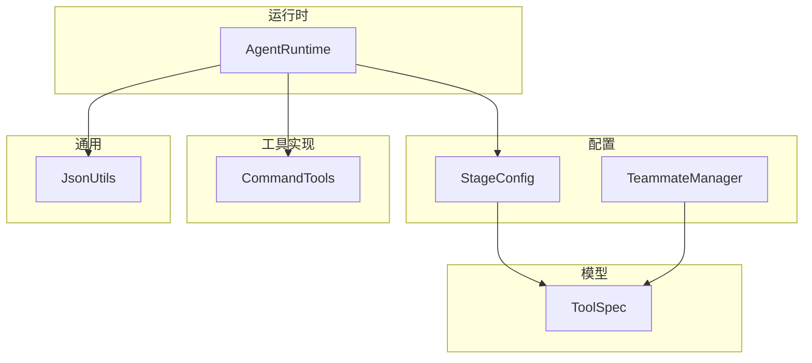
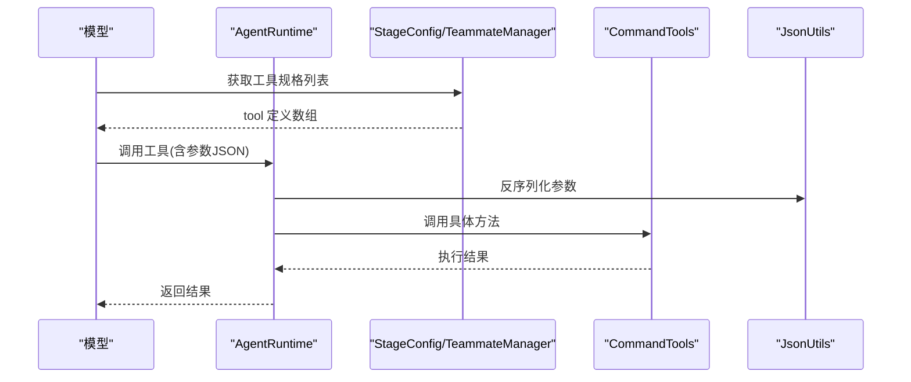
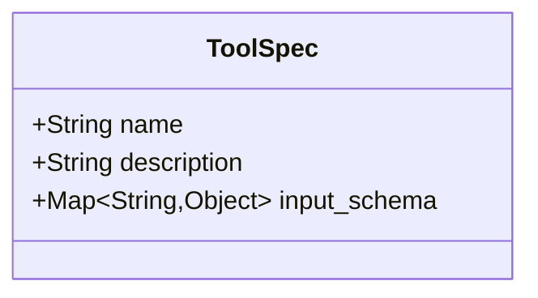
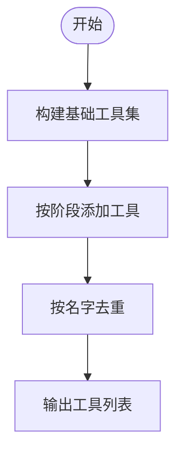
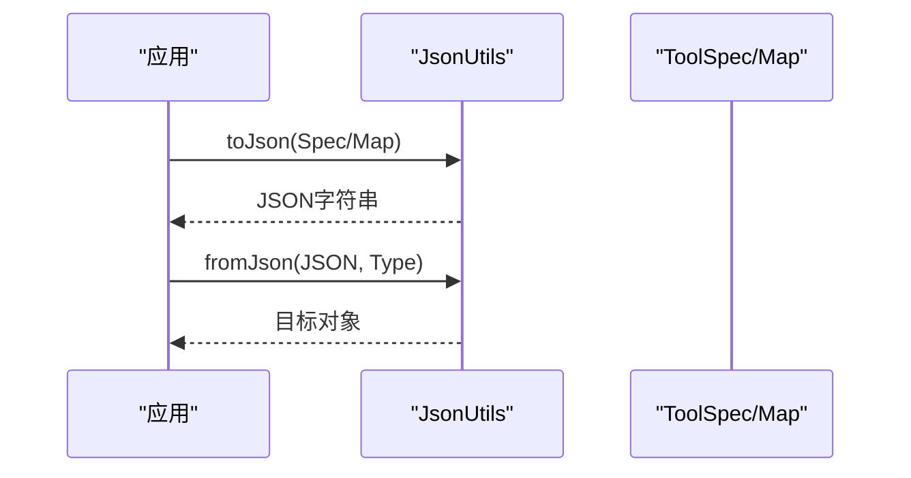
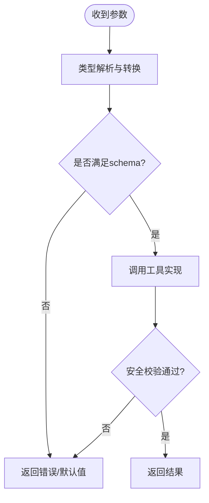
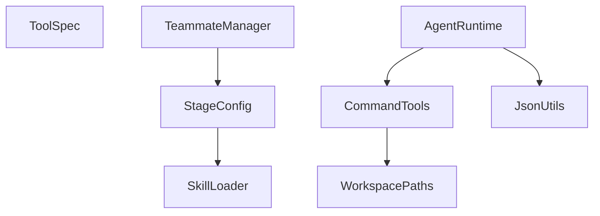

# 工具规格模型

<cite>
**本文引用的文件**
- [ToolSpec.java](file://src/main/java/com/learnclaudecode/model/ToolSpec.java)
- [StageConfig.java](file://src/main/java/com/learnclaudecode/agents/StageConfig.java)
- [TeammateManager.java](file://src/main/java/com/learnclaudecode/team/TeammateManager.java)
- [JsonUtils.java](file://src/main/java/com/learnclaudecode/common/JsonUtils.java)
- [AgentRuntime.java](file://src/main/java/com/learnclaudecode/agents/AgentRuntime.java)
- [CommandTools.java](file://src/main/java/com/learnclaudecode/tools/CommandTools.java)
</cite>

## 目录
1. [简介](#简介)
2. [项目结构](#项目结构)
3. [核心组件](#核心组件)
4. [架构总览](#架构总览)
5. [详细组件分析](#详细组件分析)
6. [依赖关系分析](#依赖关系分析)
7. [性能考量](#性能考量)
8. [故障排查指南](#故障排查指南)
9. [结论](#结论)
10. [附录](#附录)

## 简介
本文件围绕“工具规格模型”展开，聚焦 ToolSpec 类的设计理念与数据结构，解释其字段定义（名称、描述、参数定义与返回类型）、序列化/反序列化机制、验证规则与约束条件，并提供从简单到复杂的工具规格示例。同时说明工具规格在工具注册与发现过程中的作用，总结最佳实践与设计模式，并指导如何为自定义工具创建合适的规格定义。

## 项目结构
本项目采用分层组织：
- 模型层：ToolSpec 作为工具规格的轻量数据载体，对齐 Claude messages API 的工具描述结构。
- 配置层：StageConfig 集中定义各教学阶段的工具集合与能力开关，使用 Map<String,Object> 表达 tool 定义，便于与消息协议对接。
- 运行时层：AgentRuntime 负责解析模型返回的参数、调用具体工具实现；TeammateManager 在团队模式下扩展工具集。
- 工具实现层：CommandTools 等提供具体工具逻辑（如命令执行、文件读写）。
- 通用层：JsonUtils 统一 JSON 序列化/反序列化配置。

图表来源
- [ToolSpec.java:1-9](file://src/main/java/com/learnclaudecode/model/ToolSpec.java#L1-L9)
- [StageConfig.java:56-300](file://src/main/java/com/learnclaudecode/agents/StageConfig.java#L56-L300)
- [TeammateManager.java:275-310](file://src/main/java/com/learnclaudecode/team/TeammateManager.java#L275-L310)
- [AgentRuntime.java:312-350](file://src/main/java/com/learnclaudecode/agents/AgentRuntime.java#L312-L350)
- [CommandTools.java:16-146](file://src/main/java/com/learnclaudecode/tools/CommandTools.java#L16-L146)
- [JsonUtils.java:1-83](file://src/main/java/com/learnclaudecode/common/JsonUtils.java#L1-L83)

章节来源
- [ToolSpec.java:1-9](file://src/main/java/com/learnclaudecode/model/ToolSpec.java#L1-L9)
- [StageConfig.java:56-300](file://src/main/java/com/learnclaudecode/agents/StageConfig.java#L56-L300)
- [TeammateManager.java:275-310](file://src/main/java/com/learnclaudecode/team/TeammateManager.java#L275-L310)
- [JsonUtils.java:1-83](file://src/main/java/com/learnclaudecode/common/JsonUtils.java#L1-L83)

## 核心组件
- ToolSpec：以 Java record 形式承载工具规格，包含 name、description、input_schema 三个字段，语义清晰且不可变，适合跨进程或网络传输。
- StageConfig：集中管理不同阶段暴露的工具列表，通过内部 helper 构造 tool 定义，支持去重与组合，体现“能力即配置”的设计思想。
- TeammateManager：在团队协作场景下动态扩展工具集，保持与 StageConfig 一致的 tool 定义格式。
- JsonUtils：封装 Jackson ObjectMapper，提供统一的序列化和反序列化能力，确保时间类型等兼容处理。
- AgentRuntime：负责将模型返回的输入值安全地转换为工具方法所需参数，具备容错解析能力。
- CommandTools：提供基础命令与文件操作工具的具体实现，展示工具的实际行为与错误处理策略。

章节来源
- [ToolSpec.java:1-9](file://src/main/java/com/learnclaudecode/model/ToolSpec.java#L1-L9)
- [StageConfig.java:56-300](file://src/main/java/com/learnclaudecode/agents/StageConfig.java#L56-L300)
- [TeammateManager.java:275-310](file://src/main/java/com/learnclaudecode/team/TeammateManager.java#L275-L310)
- [JsonUtils.java:1-83](file://src/main/java/com/learnclaudecode/common/JsonUtils.java#L1-L83)
- [AgentRuntime.java:312-350](file://src/main/java/com/learnclaudecode/agents/AgentRuntime.java#L312-L350)
- [CommandTools.java:16-146](file://src/main/java/com/learnclaudecode/tools/CommandTools.java#L16-L146)

## 架构总览
工具规格在系统中的流转路径如下：
- 配置阶段：StageConfig 和 TeammateManager 生成 tool 定义（Map 结构），这些定义与 Claude messages API 约定一致。
- 运行时阶段：AgentRuntime 接收模型返回的工具调用请求，依据 input_schema 进行参数解析与类型转换，然后调用具体工具实现。
- 工具实现：CommandTools 等实现具体的业务逻辑，返回字符串结果或错误信息。
- 序列化：JsonUtils 提供统一的 JSON 编解码能力，用于工具规格与消息的序列化/反序列化。

图表来源
- [StageConfig.java:56-300](file://src/main/java/com/learnclaudecode/agents/StageConfig.java#L56-L300)
- [TeammateManager.java:275-310](file://src/main/java/com/learnclaudecode/team/TeammateManager.java#L275-L310)
- [AgentRuntime.java:312-350](file://src/main/java/com/learnclaudecode/agents/AgentRuntime.java#L312-L350)
- [CommandTools.java:16-146](file://src/main/java/com/learnclaudecode/tools/CommandTools.java#L16-L146)
- [JsonUtils.java:1-83](file://src/main/java/com/learnclaudecode/common/JsonUtils.java#L1-L83)

## 详细组件分析

### ToolSpec 类设计
- 设计理念：以不可变记录对象表达工具规格，字段最小化且语义明确，便于在不同模块间传递与比较。
- 字段定义：
  - name：工具唯一标识名，用于路由到具体实现。
  - description：人类可读的描述，帮助模型理解工具用途。
  - input_schema：遵循 JSON Schema 风格的参数定义，包含 type、properties、required 等键，用于约束输入参数的结构与类型。
- 返回类型：ToolSpec 本身不包含返回类型字段；实际返回类型由工具实现决定，通常以字符串或结构化对象返回，并在运行时由调用方处理。

图表来源
- [ToolSpec.java:1-9](file://src/main/java/com/learnclaudecode/model/ToolSpec.java#L1-L9)

章节来源
- [ToolSpec.java:1-9](file://src/main/java/com/learnclaudecode/model/ToolSpec.java#L1-L9)

### 工具规格的定义与构造
- StageConfig 通过内部 helper 构造 tool 定义，严格遵循 messages API 约定的结构：name、description、input_schema。
- 多阶段工具集通过组合与去重形成最终可用工具列表，避免重复定义冲突。
- TeammateManager 在团队模式下追加协作相关工具，保持与 StageConfig 一致的构造方式。

图表来源
- [StageConfig.java:56-300](file://src/main/java/com/learnclaudecode/agents/StageConfig.java#L56-L300)
- [TeammateManager.java:275-310](file://src/main/java/com/learnclaudecode/team/TeammateManager.java#L275-L310)

章节来源
- [StageConfig.java:56-300](file://src/main/java/com/learnclaudecode/agents/StageConfig.java#L56-L300)
- [TeammateManager.java:275-310](file://src/main/java/com/learnclaudecode/team/TeammateManager.java#L275-L310)

### 序列化与反序列化机制
- 工具规格与消息体通过 JsonUtils 提供的 ObjectMapper 进行序列化/反序列化。
- 已注册 JavaTimeModule 并禁用时间戳写入，保证时间类型的一致性与可读性。
- ToolSpec 作为 record，天然支持基于字段的序列化/反序列化；tool 定义以 Map 形式存在，便于灵活扩展。

图表来源
- [JsonUtils.java:1-83](file://src/main/java/com/learnclaudecode/common/JsonUtils.java#L1-L83)
- [ToolSpec.java:1-9](file://src/main/java/com/learnclaudecode/model/ToolSpec.java#L1-L9)

章节来源
- [JsonUtils.java:1-83](file://src/main/java/com/learnclaudecode/common/JsonUtils.java#L1-L83)
- [ToolSpec.java:1-9](file://src/main/java/com/learnclaudecode/model/ToolSpec.java#L1-L9)

### 验证规则与约束条件
- 输入 schema 使用 JSON Schema 风格声明参数类型与必填项，例如 type=object、properties、required。
- AgentRuntime 对模型返回的参数进行容错解析，如数字字段可能以字符串传入时自动转换，失败时回退默认值。
- 工具实现内部进行安全校验与边界保护，例如命令黑名单、超时控制、路径安全解析等。

图表来源
- [AgentRuntime.java:312-350](file://src/main/java/com/learnclaudecode/agents/AgentRuntime.java#L312-L350)
- [CommandTools.java:16-146](file://src/main/java/com/learnclaudecode/tools/CommandTools.java#L16-L146)

章节来源
- [AgentRuntime.java:312-350](file://src/main/java/com/learnclaudecode/agents/AgentRuntime.java#L312-L350)
- [CommandTools.java:16-146](file://src/main/java/com/learnclaudecode/tools/CommandTools.java#L16-L146)

### 工具规格在注册与发现中的作用
- 工具规格是“能力即配置”的核心：StageConfig 与 TeammateManager 通过声明式方式注册工具，运行时根据配置动态发现可用工具。
- 工具名作为路由键，AgentRuntime 依据模型请求中的 name 选择对应实现。
- 去重策略确保同名工具在合并阶段以最后一次定义为准，避免歧义。

图表来源
- [StageConfig.java:56-300](file://src/main/java/com/learnclaudecode/agents/StageConfig.java#L56-L300)
- [TeammateManager.java:275-310](file://src/main/java/com/learnclaudecode/team/TeammateManager.java#L275-L310)
- [AgentRuntime.java:312-350](file://src/main/java/com/learnclaudecode/agents/AgentRuntime.java#L312-L350)

章节来源
- [StageConfig.java:56-300](file://src/main/java/com/learnclaudecode/agents/StageConfig.java#L56-L300)
- [TeammateManager.java:275-310](file://src/main/java/com/learnclaudecode/team/TeammateManager.java#L275-L310)
- [AgentRuntime.java:312-350](file://src/main/java/com/learnclaudecode/agents/AgentRuntime.java#L312-L350)

### 最佳实践与设计模式
- 最小化规格：仅保留必要字段，避免过度复杂化 input_schema。
- 明确必填项：在 required 中列出关键参数，降低模型误用概率。
- 类型安全：尽量使用强类型字段（string、integer、boolean、array、object），减少运行时转换成本。
- 可组合性：通过 StageConfig 的组合与去重，实现能力的渐进式开放。
- 错误隔离：工具实现内部捕获异常并返回友好错误信息，避免崩溃传播。
- 可观测性：为工具命名与描述保持一致性与可读性，便于调试与文档化。

[本节为概念性内容，不直接分析具体文件]

### 为自定义工具创建规格定义
步骤建议：
- 定义工具名与描述：确保唯一且易于理解。
- 设计 input_schema：
  - 设置 type=object。
  - 在 properties 中声明每个参数的类型。
  - 在 required 中列出必填参数。
- 在 StageConfig 或 TeammateManager 中添加工具定义。
- 实现工具逻辑：在工具类中提供对应方法，处理参数校验与安全限制。
- 测试与验证：通过 AgentRuntime 的容错解析与工具实现的错误处理，确保健壮性。

[本节为概念性内容，不直接分析具体文件]

## 依赖关系分析
- ToolSpec 无外部依赖，仅使用 Map 表示 schema。
- StageConfig 依赖 SkillLoader 以动态注入 system prompt 的技能描述。
- TeammateManager 依赖 StageConfig.baseTools() 作为底座，再按需扩展。
- AgentRuntime 依赖 JsonUtils 进行参数解析，依赖工具实现完成调用。
- CommandTools 依赖 WorkspacePaths 进行路径安全解析。

图表来源
- [StageConfig.java:1-300](file://src/main/java/com/learnclaudecode/agents/StageConfig.java#L1-L300)
- [TeammateManager.java:275-310](file://src/main/java/com/learnclaudecode/team/TeammateManager.java#L275-L310)
- [AgentRuntime.java:312-350](file://src/main/java/com/learnclaudecode/agents/AgentRuntime.java#L312-L350)
- [CommandTools.java:16-146](file://src/main/java/com/learnclaudecode/tools/CommandTools.java#L16-L146)
- [JsonUtils.java:1-83](file://src/main/java/com/learnclaudecode/common/JsonUtils.java#L1-L83)

章节来源
- [StageConfig.java:1-300](file://src/main/java/com/learnclaudecode/agents/StageConfig.java#L1-L300)
- [TeammateManager.java:275-310](file://src/main/java/com/learnclaudecode/team/TeammateManager.java#L275-L310)
- [AgentRuntime.java:312-350](file://src/main/java/com/learnclaudecode/agents/AgentRuntime.java#L312-L350)
- [CommandTools.java:16-146](file://src/main/java/com/learnclaudecode/tools/CommandTools.java#L16-L146)
- [JsonUtils.java:1-83](file://src/main/java/com/learnclaudecode/common/JsonUtils.java#L1-L83)

## 性能考量
- 工具规格为轻量级数据结构，序列化开销低。
- 参数解析采用容错转换，减少因类型不一致导致的重试与错误分支。
- 工具实现中对大输出进行截断（如文件读取与命令输出），避免上下文溢出。
- 后台任务与超时控制提升长耗时操作的稳定性。

[本节为一般性讨论，不直接分析具体文件]

## 故障排查指南
- 参数解析失败：检查 input_schema 的 required 与类型声明是否与模型返回一致；利用 AgentRuntime 的 numberOrNull/stringOrNull 容错机制定位问题。
- 工具未生效：确认 StageConfig 或 TeammateManager 是否正确添加工具定义，并检查去重逻辑是否覆盖预期。
- 执行错误：查看工具实现中的异常捕获与错误返回，确认路径安全与命令黑名单是否拦截了合法操作。
- JSON 序列化问题：使用 JsonUtils.toPrettyJson 输出中间结构，结合 Jackson 日志定位字段缺失或类型不匹配。

章节来源
- [AgentRuntime.java:312-350](file://src/main/java/com/learnclaudecode/agents/AgentRuntime.java#L312-L350)
- [CommandTools.java:16-146](file://src/main/java/com/learnclaudecode/tools/CommandTools.java#L16-L146)
- [JsonUtils.java:1-83](file://src/main/java/com/learnclaudecode/common/JsonUtils.java#L1-L83)

## 结论
ToolSpec 以简洁不可变的记录对象承载工具规格，配合 StageConfig 与 TeammateManager 的声明式工具注册，实现了“能力即配置”的灵活架构。通过 JsonUtils 的统一序列化与 AgentRuntime 的容错参数解析，系统在易用性与健壮性之间取得平衡。遵循最佳实践可为自定义工具创建清晰的规格定义，确保工具在注册、发现与执行过程中稳定可靠。

[本节为总结性内容，不直接分析具体文件]

## 附录
- 简单工具示例（bash）：
  - name: bash
  - description: 执行 shell 命令
  - input_schema: type=object, properties.command=string, required=["command"]
- 复杂工具示例（send_message）：
  - name: send_message
  - description: 向队友发送消息
  - input_schema: type=object, properties.to/content/msg_type=string, required=["to","content"]

章节来源
- [StageConfig.java:56-300](file://src/main/java/com/learnclaudecode/agents/StageConfig.java#L56-L300)
- [TeammateManager.java:275-310](file://src/main/java/com/learnclaudecode/team/TeammateManager.java#L275-L310)