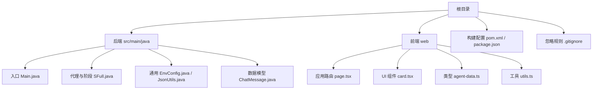
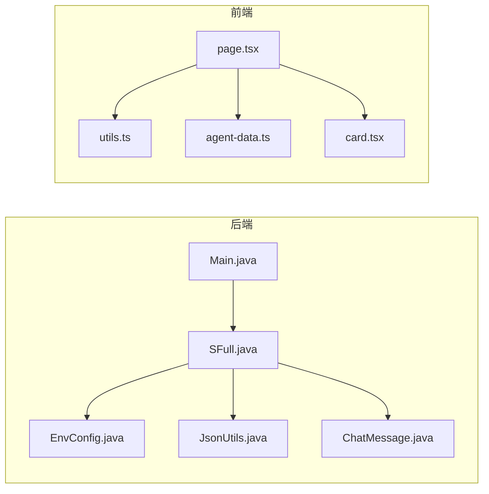
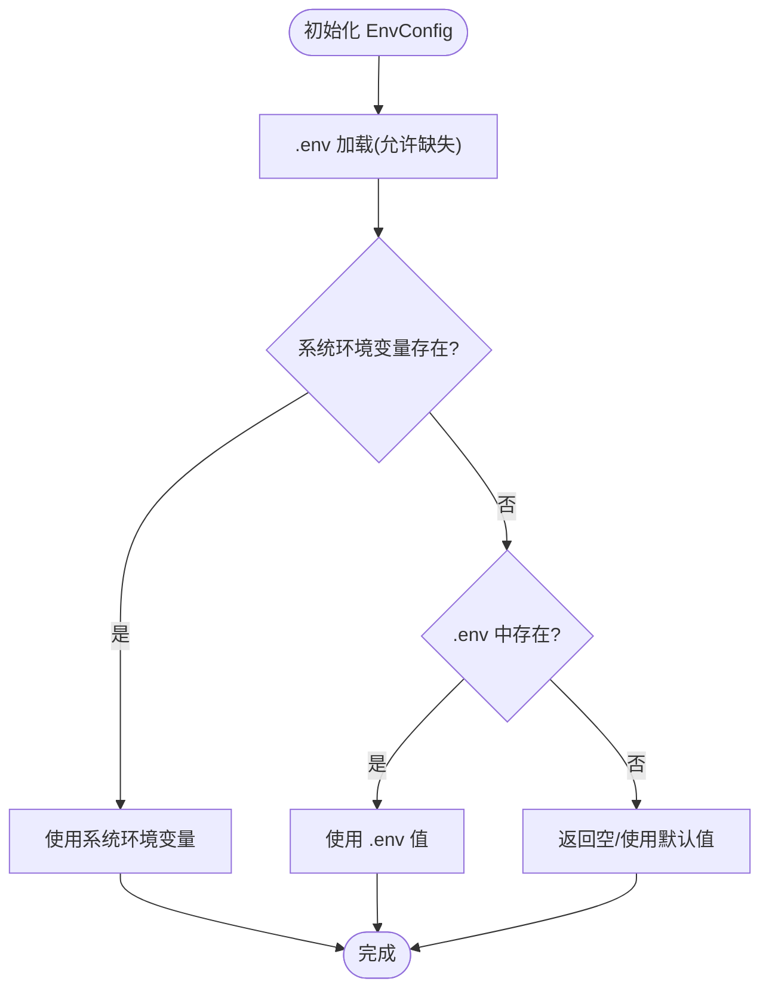
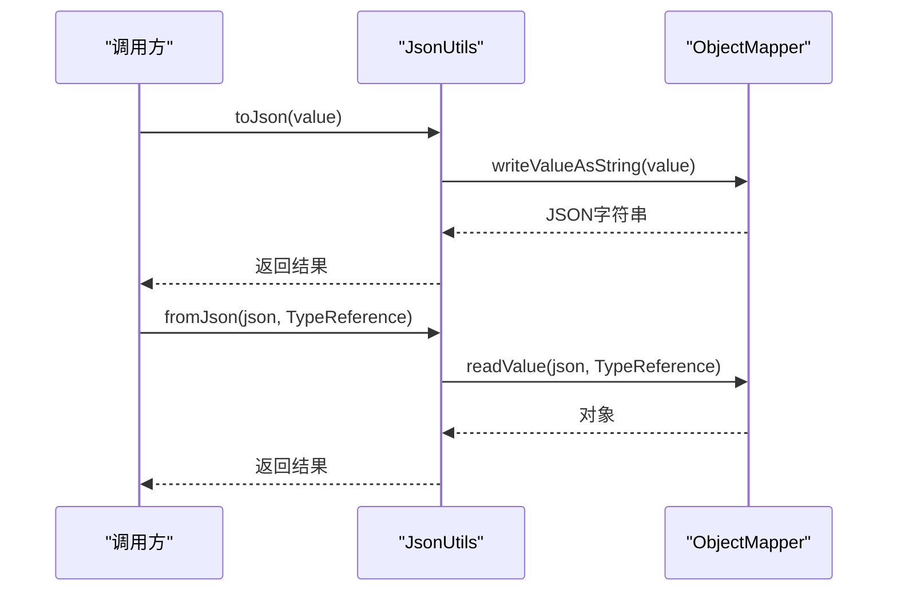
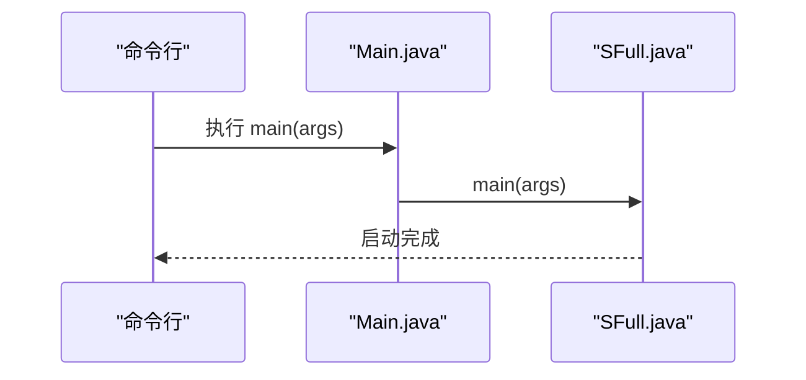
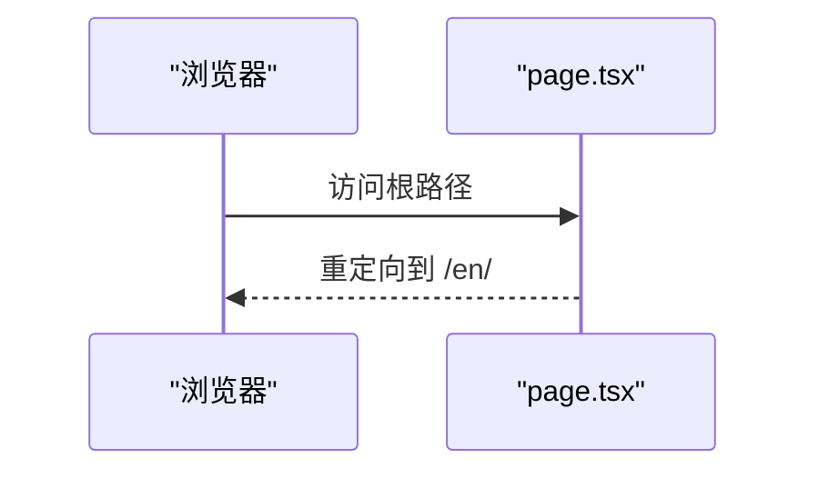
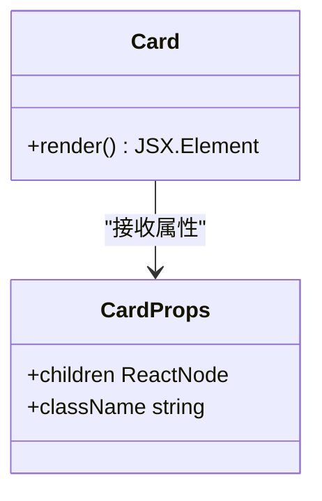
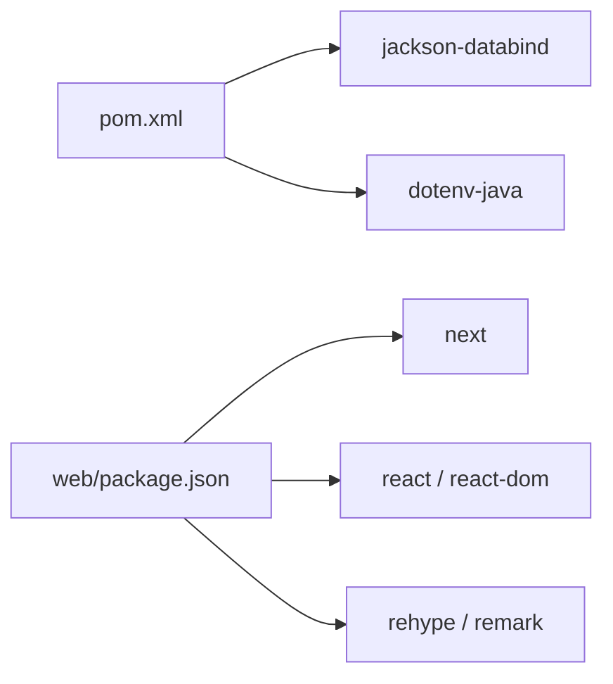

# 代码规范

<cite>
**本文引用的文件**
- [pom.xml](file://pom.xml)
- [.gitignore](file://.gitignore)
- [Main.java](file://src/main/java/com/learnclaudecode/Main.java)
- [SFull.java](file://src/main/java/com/learnclaudecode/agents/SFull.java)
- [EnvConfig.java](file://src/main/java/com/learnclaudecode/common/EnvConfig.java)
- [JsonUtils.java](file://src/main/java/com/learnclaudecode/common/JsonUtils.java)
- [ChatMessage.java](file://src/main/java/com/learnclaudecode/model/ChatMessage.java)
- [package.json](file://web/package.json)
- [tsconfig.json](file://web/tsconfig.json)
- [next.config.ts](file://web/next.config.ts)
- [page.tsx](file://web/src/app/page.tsx)
- [card.tsx](file://web/src/components/ui/card.tsx)
- [utils.ts](file://web/src/lib/utils.ts)
- [agent-data.ts](file://web/src/types/agent-data.ts)
</cite>

## 目录
1. [简介](#简介)
2. [项目结构](#项目结构)
3. [核心组件](#核心组件)
4. [架构总览](#架构总览)
5. [详细组件分析](#详细组件分析)
6. [依赖分析](#依赖分析)
7. [性能考虑](#性能考虑)
8. [故障排查指南](#故障排查指南)
9. [结论](#结论)
10. [附录](#附录)

## 简介
本规范面向本仓库的 Java 后端与 TypeScript/Next.js 前端，统一编码标准、构建配置、Git 工作流与代码审查要求。目标是在保证一致性与可维护性的同时，提升协作效率与交付质量。

## 项目结构
- 后端（Java）：基于 Maven，JDK 17，使用 Jackson 进行 JSON 处理，dotenv 管理环境变量；入口类为 Main，默认启动完整能力版本 SFull。
- 前端（TypeScript/Next.js）：基于 Next.js 静态导出，启用严格类型检查与模块解析；提供 UI 组件、类型定义与工具函数。
- 根级忽略规则：排除 .env、target、IDE 缓存等敏感或生成产物。

**图示来源**
- [pom.xml:1-68](file://pom.xml#L1-L68)
- [package.json:1-39](file://web/package.json#L1-L39)
- [Main.java:1-15](file://src/main/java/com/learnclaudecode/Main.java#L1-L15)
- [SFull.java:1-13](file://src/main/java/com/learnclaudecode/agents/SFull.java#L1-L13)
- [EnvConfig.java:1-96](file://src/main/java/com/learnclaudecode/common/EnvConfig.java#L1-L96)
- [JsonUtils.java:1-83](file://src/main/java/com/learnclaudecode/common/JsonUtils.java#L1-L83)
- [ChatMessage.java:1-8](file://src/main/java/com/learnclaudecode/model/ChatMessage.java#L1-L8)
- [page.tsx:1-6](file://web/src/app/page.tsx#L1-L6)
- [card.tsx:1-40](file://web/src/components/ui/card.tsx#L1-L40)
- [utils.ts:1-4](file://web/src/lib/utils.ts#L1-L4)
- [agent-data.ts:1-73](file://web/src/types/agent-data.ts#L1-L73)

**章节来源**
- [pom.xml:1-68](file://pom.xml#L1-L68)
- [.gitignore:1-8](file://.gitignore#L1-L8)
- [Main.java:1-15](file://src/main/java/com/learnclaudecode/Main.java#L1-L15)
- [SFull.java:1-13](file://src/main/java/com/learnclaudecode/agents/SFull.java#L1-L13)
- [EnvConfig.java:1-96](file://src/main/java/com/learnclaudecode/common/EnvConfig.java#L1-L96)
- [JsonUtils.java:1-83](file://src/main/java/com/learnclaudecode/common/JsonUtils.java#L1-L83)
- [ChatMessage.java:1-8](file://src/main/java/com/learnclaudecode/model/ChatMessage.java#L1-L8)
- [package.json:1-39](file://web/package.json#L1-L39)
- [tsconfig.json:1-35](file://web/tsconfig.json#L1-L35)
- [next.config.ts:1-10](file://web/next.config.ts#L1-L10)
- [page.tsx:1-6](file://web/src/app/page.tsx#L1-L6)
- [card.tsx:1-40](file://web/src/components/ui/card.tsx#L1-L40)
- [utils.ts:1-4](file://web/src/lib/utils.ts#L1-L4)
- [agent-data.ts:1-73](file://web/src/types/agent-data.ts#L1-L73)

## 核心组件
- 后端入口与启动流程：Main 作为默认入口，委托给 SFull 以完整能力模式启动。
- 环境配置：EnvConfig 统一读取 .env 与系统环境变量，并提供必填项校验与默认值策略。
- JSON 工具：JsonUtils 封装 ObjectMapper 实例，提供序列化与反序列化的统一接口与异常包装。
- 数据模型：ChatMessage 使用 record 表达不可变消息结构。
- 前端路由与组件：Next.js 页面重定向到国际化路径；UI 组件通过组合 className 实现样式复用；类型定义集中管理数据结构。

**章节来源**
- [Main.java:1-15](file://src/main/java/com/learnclaudecode/Main.java#L1-L15)
- [SFull.java:1-13](file://src/main/java/com/learnclaudecode/agents/SFull.java#L1-L13)
- [EnvConfig.java:1-96](file://src/main/java/com/learnclaudecode/common/EnvConfig.java#L1-L96)
- [JsonUtils.java:1-83](file://src/main/java/com/learnclaudecode/common/JsonUtils.java#L1-L83)
- [ChatMessage.java:1-8](file://src/main/java/com/learnclaudecode/model/ChatMessage.java#L1-L8)
- [page.tsx:1-6](file://web/src/app/page.tsx#L1-L6)
- [card.tsx:1-40](file://web/src/components/ui/card.tsx#L1-L40)
- [agent-data.ts:1-73](file://web/src/types/agent-data.ts#L1-L73)

## 架构总览
后端采用“入口 -> 场景启动器 -> 配置/工具”的分层组织；前端采用 Next.js App Router 的模块化页面与组件拆分，配合统一的类型与工具函数。

**图示来源**
- [Main.java:1-15](file://src/main/java/com/learnclaudecode/Main.java#L1-L15)
- [SFull.java:1-13](file://src/main/java/com/learnclaudecode/agents/SFull.java#L1-L13)
- [EnvConfig.java:1-96](file://src/main/java/com/learnclaudecode/common/EnvConfig.java#L1-L96)
- [JsonUtils.java:1-83](file://src/main/java/com/learnclaudecode/common/JsonUtils.java#L1-L83)
- [ChatMessage.java:1-8](file://src/main/java/com/learnclaudecode/model/ChatMessage.java#L1-L8)
- [page.tsx:1-6](file://web/src/app/page.tsx#L1-L6)
- [utils.ts:1-4](file://web/src/lib/utils.ts#L1-L4)
- [agent-data.ts:1-73](file://web/src/types/agent-data.ts#L1-L73)
- [card.tsx:1-40](file://web/src/components/ui/card.tsx#L1-L40)

## 详细组件分析

### 后端：环境与配置加载
- 优先级：系统环境变量优先于 .env；缺失必填项时抛出明确异常。
- 默认值：可选字段提供合理默认值，避免运行时失败。
- 建议：所有外部配置必须通过 EnvConfig 访问，禁止在业务代码中直接读取 System.getenv。

**图示来源**
- [EnvConfig.java:1-96](file://src/main/java/com/learnclaudecode/common/EnvConfig.java#L1-L96)

**章节来源**
- [EnvConfig.java:1-96](file://src/main/java/com/learnclaudecode/common/EnvConfig.java#L1-L96)

### 后端：JSON 序列化与反序列化
- 统一 ObjectMapper 实例，注册 JavaTimeModule 并禁用时间戳输出。
- 对外暴露紧凑与格式化两种序列化方法，以及泛型与非泛型反序列化。
- 异常包装：将底层异常转换为 IllegalStateException，便于上层统一处理。

**图示来源**
- [JsonUtils.java:1-83](file://src/main/java/com/learnclaudecode/common/JsonUtils.java#L1-L83)

**章节来源**
- [JsonUtils.java:1-83](file://src/main/java/com/learnclaudecode/common/JsonUtils.java#L1-L83)

### 后端：入口与启动流程
- Main 作为默认入口，转发到 SFull.main，以完整能力模式启动。
- 建议：新增运行模式时，保持入口单一职责，仅做参数选择与委派。

**图示来源**
- [Main.java:1-15](file://src/main/java/com/learnclaudecode/Main.java#L1-L15)
- [SFull.java:1-13](file://src/main/java/com/learnclaudecode/agents/SFull.java#L1-L13)

**章节来源**
- [Main.java:1-15](file://src/main/java/com/learnclaudecode/Main.java#L1-L15)
- [SFull.java:1-13](file://src/main/java/com/learnclaudecode/agents/SFull.java#L1-L13)

### 前端：路由与页面组织
- 根页面重定向到国际化路径，确保多语言体验一致性。
- 建议：页面按功能域拆分，公共逻辑下沉至 hooks 与 lib。

**图示来源**
- [page.tsx:1-6](file://web/src/app/page.tsx#L1-L6)

**章节来源**
- [page.tsx:1-6](file://web/src/app/page.tsx#L1-L6)

### 前端：UI 组件与类型
- 组件通过 cn 工具合并 className，保持样式灵活与可组合。
- 类型集中在 types 目录，前后端交互的数据契约需在此处维护。

**图示来源**
- [card.tsx:1-40](file://web/src/components/ui/card.tsx#L1-L40)
- [utils.ts:1-4](file://web/src/lib/utils.ts#L1-L4)
- [agent-data.ts:1-73](file://web/src/types/agent-data.ts#L1-L73)

**章节来源**
- [card.tsx:1-40](file://web/src/components/ui/card.tsx#L1-L40)
- [utils.ts:1-4](file://web/src/lib/utils.ts#L1-L4)
- [agent-data.ts:1-73](file://web/src/types/agent-data.ts#L1-L73)

## 依赖分析
- 后端依赖：Jackson 用于 JSON 处理，dotenv 用于环境变量加载；Maven 插件固定编译器与执行插件版本。
- 前端依赖：Next.js、React、Tailwind、rehype/remark 生态用于文档渲染；开发依赖包含 TS 与类型声明。

**图示来源**
- [pom.xml:1-68](file://pom.xml#L1-L68)
- [package.json:1-39](file://web/package.json#L1-L39)

**章节来源**
- [pom.xml:1-68](file://pom.xml#L1-L68)
- [package.json:1-39](file://web/package.json#L1-L39)

## 性能考虑
- 后端
  - 使用单例 ObjectMapper 避免重复创建开销。
  - 对大对象序列化优先使用紧凑格式，调试时使用格式化输出。
  - 环境变量读取仅在启动阶段进行，避免热路径 I/O。
- 前端
  - 启用严格类型与增量编译，减少构建时间。
  - 图片与资源按需优化；静态导出模式下注意资源体积。
  - 组件拆分与懒加载，降低首屏负担。

[本节为通用指导，不直接分析具体文件]

## 故障排查指南
- 环境变量缺失
  - 现象：启动时报缺少必要环境变量。
  - 定位：检查 .env 与系统环境变量是否设置正确。
  - 参考：EnvConfig 的必填项校验逻辑。
- JSON 序列化失败
  - 现象：抛出序列化相关异常。
  - 定位：检查对象字段是否与 JSON 映射一致，时间类型是否已注册模块。
  - 参考：JsonUtils 的统一异常包装。
- 前端构建错误
  - 现象：TS 类型错误或 Next 构建失败。
  - 定位：核对 tsconfig 与 next.config 配置，确认依赖版本兼容。
  - 参考：tsconfig 与 next.config。

**章节来源**
- [EnvConfig.java:1-96](file://src/main/java/com/learnclaudecode/common/EnvConfig.java#L1-L96)
- [JsonUtils.java:1-83](file://src/main/java/com/learnclaudecode/common/JsonUtils.java#L1-L83)
- [tsconfig.json:1-35](file://web/tsconfig.json#L1-L35)
- [next.config.ts:1-10](file://web/next.config.ts#L1-L10)

## 结论
本规范围绕“入口清晰、配置集中、类型安全、构建稳定”的原则，统一了后端与前端的编码风格与工程实践。遵循本规范可有效降低沟通成本、提高代码质量与交付效率。

## 附录

### 编码规范要点（示例与引用）
- Java
  - 命名约定：包名小写、类名大驼峰、方法与变量小驼峰、常量全大写。
  - 注释标准：类与方法使用 Javadoc 说明用途、参数与返回值；复杂逻辑添加行内注释。
  - 异常处理：对外暴露统一异常包装，内部捕获并记录上下文信息。
  - 参考片段
    - [EnvConfig.java:1-96](file://src/main/java/com/learnclaudecode/common/EnvConfig.java#L1-L96)
    - [JsonUtils.java:1-83](file://src/main/java/com/learnclaudecode/common/JsonUtils.java#L1-L83)
    - [ChatMessage.java:1-8](file://src/main/java/com/learnclaudecode/model/ChatMessage.java#L1-L8)
- TypeScript/React
  - 命名约定：组件 PascalCase，文件与文件夹 kebab-case；类型与接口使用大驼峰。
  - 类型优先：所有 props、状态与 API 响应均定义类型，避免 any。
  - 样式：通过 cn 工具合并 className，保持样式组合性。
  - 参考片段
    - [card.tsx:1-40](file://web/src/components/ui/card.tsx#L1-L40)
    - [utils.ts:1-4](file://web/src/lib/utils.ts#L1-L4)
    - [agent-data.ts:1-73](file://web/src/types/agent-data.ts#L1-L73)
- 构建配置
  - Maven：固定 JDK 版本与插件版本，统一编码为 UTF-8。
  - npm/Next：脚本命令标准化，严格类型检查，静态导出配置。
  - 参考片段
    - [pom.xml:1-68](file://pom.xml#L1-L68)
    - [package.json:1-39](file://web/package.json#L1-L39)
    - [tsconfig.json:1-35](file://web/tsconfig.json#L1-L35)
    - [next.config.ts:1-10](file://web/next.config.ts#L1-L10)

### Git 工作流与分支管理
- 分支策略
  - main：受保护分支，仅接受合并后的稳定版本。
  - develop：集成分支，日常开发合并到此。
  - feature/*：功能分支，从 develop 切出，完成后合并回 develop。
  - hotfix/*：修复分支，从 main 切出，修复后同时合并回 main 与 develop。
- 提交流程
  - 提交信息：使用语义化提交（feat/fix/docs/chore），描述变更目的与影响范围。
  - 代码审查：至少一名 reviewer 批准后方可合并；关注可读性、健壮性与测试覆盖。
  - 自动化：CI 触发构建与基础检查，通过后进入人工评审。
- 代码审查标准
  - 可读性：命名清晰、结构合理、注释恰当。
  - 健壮性：边界条件与异常处理完善。
  - 可测试性：关键逻辑具备单元测试或集成测试。
  - 安全性：敏感信息不入仓，依赖版本可控。

### 项目结构与文件组织约定
- 后端
  - 包划分：按领域分层（agents、common、model、tools、tasks、team、background）。
  - 文件命名：类名与文件名一致，工具类以 Utils 结尾，配置类以 Config 结尾。
  - 资源管理：配置文件与环境变量集中管理，不在业务代码中硬编码。
- 前端
  - 目录划分：app（路由）、components（组件）、lib（工具）、types（类型）、data（数据）。
  - 组件组织：按功能域拆分，UI 原子组件放在 ui 子目录。
  - 类型契约：跨模块共享的类型集中在 types 目录。

### 依赖管理规范
- 后端
  - 版本锁定：在 pom.xml 中显式声明依赖版本，避免隐式升级导致的不兼容。
  - 最小化依赖：仅引入必要库，定期清理未使用依赖。
- 前端
  - 锁定版本：使用 lock 文件锁定依赖版本，确保构建可重现。
  - 更新策略：小版本自动更新，大版本升级需评估兼容性并回归测试。