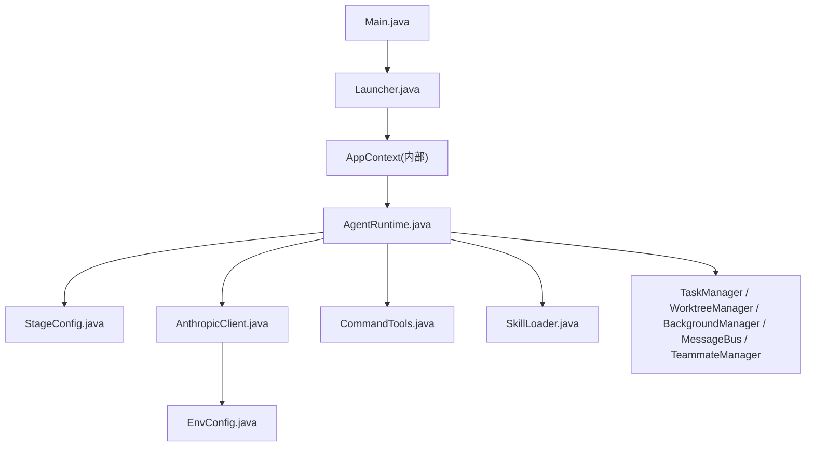
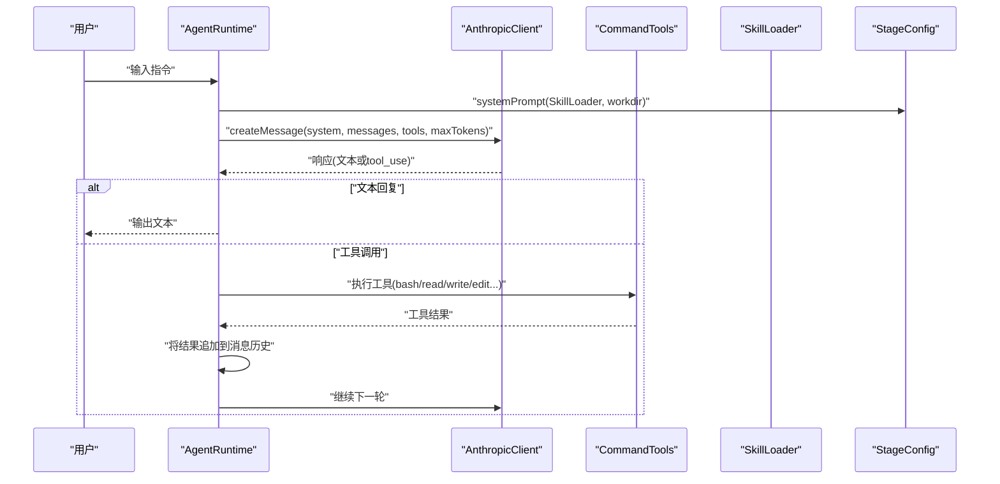
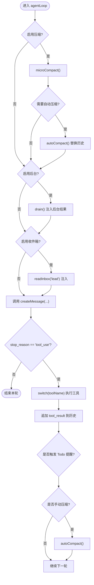
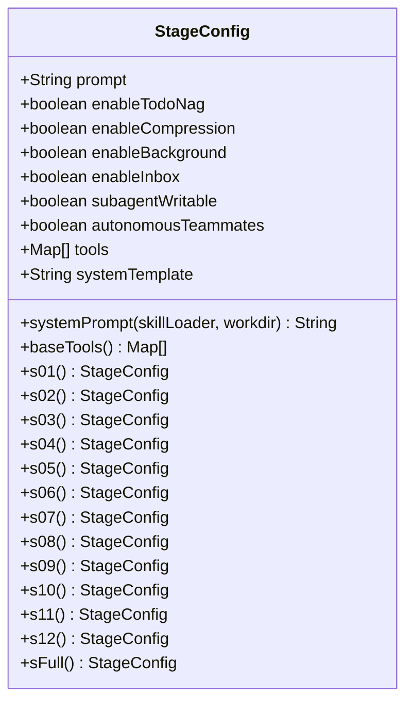
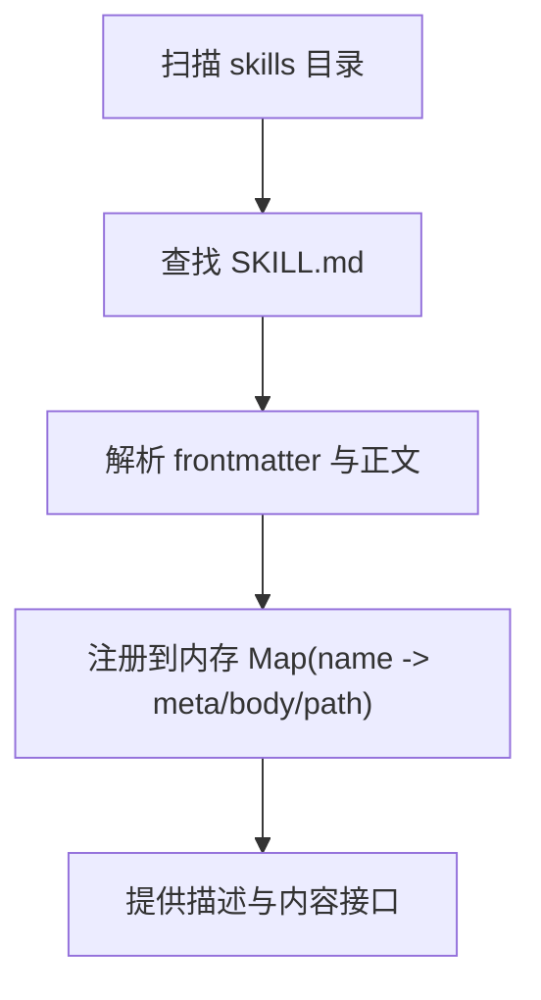
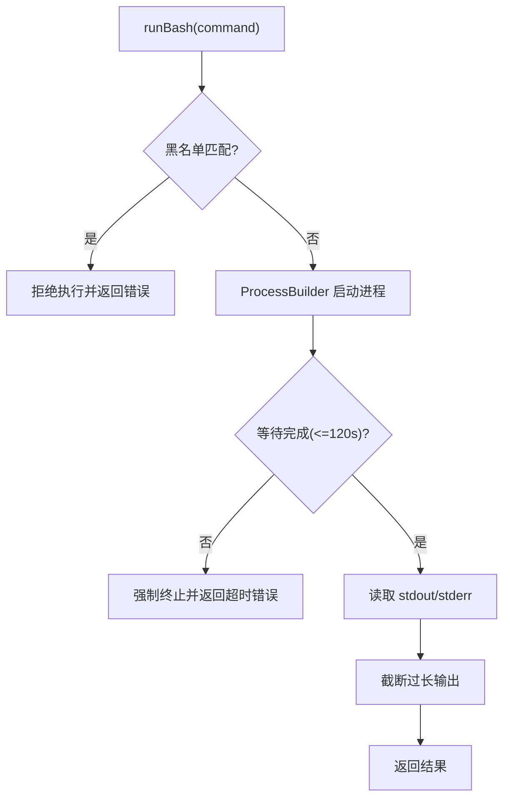
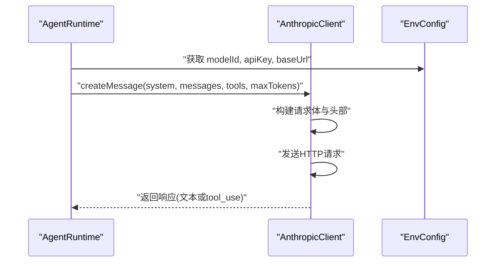
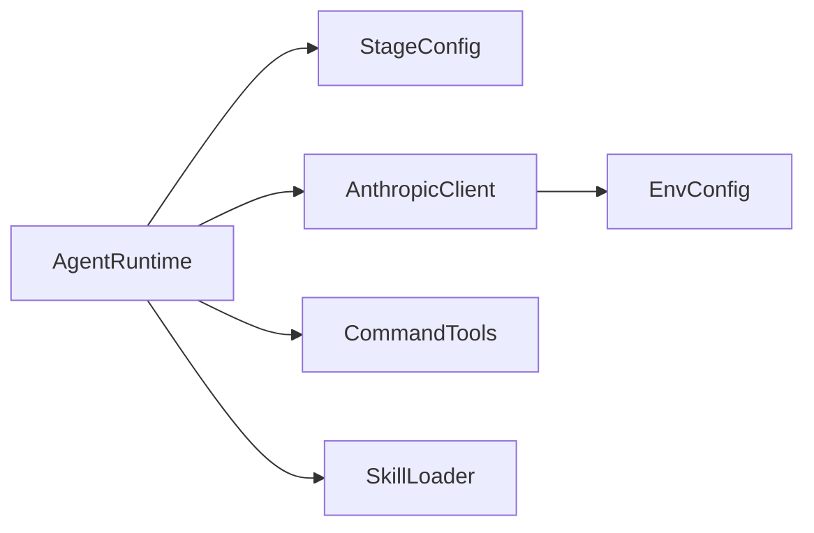

# 开发者指南

<cite>
**本文引用的文件**
- [pom.xml](file://pom.xml)
- [Main.java](file://src/main/java/com/learnclaudecode/Main.java)
- [Launcher.java](file://src/main/java/com/learnclaudecode/agents/Launcher.java)
- [StageConfig.java](file://src/main/java/com/learnclaudecode/agents/StageConfig.java)
- [AgentRuntime.java](file://src/main/java/com/learnclaudecode/agents/AgentRuntime.java)
- [SkillLoader.java](file://src/main/java/com/learnclaudecode/skills/SkillLoader.java)
- [CommandTools.java](file://src/main/java/com/learnclaudecode/tools/CommandTools.java)
- [AnthropicClient.java](file://src/main/java/com/learnclaudecode/common/AnthropicClient.java)
- [EnvConfig.java](file://src/main/java/com/learnclaudecode/common/EnvConfig.java)
- [ToolSpec.java](file://src/main/java/com/learnclaudecode/model/ToolSpec.java)
- [SKILL.md（agent-builder）](file://skills/agent-builder/SKILL.md)
- [SKILL.md（code-review）](file://skills/code-review/SKILL.md)
- [SKILL.md（mcp-builder）](file://skills/mcp-builder/SKILL.md)
- [SKILL.md（pdf）](file://skills/pdf/SKILL.md)
</cite>

## 目录
1. [简介](#简介)
2. [项目结构](#项目结构)
3. [核心组件](#核心组件)
4. [架构总览](#架构总览)
5. [详细组件分析](#详细组件分析)
6. [依赖关系分析](#依赖关系分析)
7. [性能与可扩展性](#性能与可扩展性)
8. [测试策略与调试技巧](#测试策略与调试技巧)
9. [贡献规范与提交流程](#贡献规范与提交流程)
10. [扩展开发指南](#扩展开发指南)
11. [故障排查](#故障排查)
12. [结论](#结论)

## 简介
本指南面向贡献者与扩展开发者，提供代码规范、Git 工作流、代码审查标准，以及基于现有技能模板的自定义技能开发方法。同时覆盖新工具、新阶段、插件式扩展、技能系统机制、测试策略与调试技巧，帮助你在保持工程一致性的前提下高效迭代。

## 项目结构
本项目采用“教学阶段 + 统一运行时”的设计：通过 StageConfig 逐步打开能力开关，由 AgentRuntime 驱动统一的 Agent 主循环；工具、任务、后台、团队、工作区等模块以可插拔方式接入。前端 Next.js 用于可视化演示与学习路径。

图表来源
- [Main.java:1-15](file://src/main/java/com/learnclaudecode/Main.java#L1-L15)
- [Launcher.java:1-28](file://src/main/java/com/learnclaudecode/agents/Launcher.java#L1-L28)
- [AgentRuntime.java:1-351](file://src/main/java/com/learnclaudecode/agents/AgentRuntime.java#L1-L351)
- [StageConfig.java:1-301](file://src/main/java/com/learnclaudecode/agents/StageConfig.java#L1-L301)
- [AnthropicClient.java:1-103](file://src/main/java/com/learnclaudecode/common/AnthropicClient.java#L1-L103)
- [EnvConfig.java:1-96](file://src/main/java/com/learnclaudecode/common/EnvConfig.java#L1-L96)

章节来源
- [pom.xml:1-68](file://pom.xml#L1-L68)
- [Main.java:1-15](file://src/main/java/com/learnclaudecode/Main.java#L1-L15)

## 核心组件
- 启动器与入口
  - Main 作为默认入口，委托给完整能力版本 SFull，再由 Launcher 统一初始化并运行。
- 运行时与阶段配置
  - AgentRuntime 实现“观察-决策-执行-反馈”的主循环，负责消息历史管理、工具调度、压缩、后台任务注入、团队收件箱轮询等。
  - StageConfig 定义每个教学阶段的 system prompt、可用工具集和能力开关（Todo、压缩、后台、团队、自治队友、工作区隔离）。
- 模型客户端与环境配置
  - AnthropicClient 封装对 Anthropic-compatible messages API 的调用，支持 Base URL、API Key、认证头与超时控制。
  - EnvConfig 从系统环境变量或 .env 读取模型 ID、密钥、Base URL 与工作目录。
- 工具与技能
  - CommandTools 提供 bash、read_file、write_file、edit_file 等基础工具，包含危险命令黑名单与超时保护。
  - SkillLoader 扫描 skills 目录下的 SKILL.md，解析 frontmatter 并提供描述与内容加载能力。
- 数据契约
  - ToolSpec 表示工具定义的数据结构，对齐 messages API 的工具描述格式。

章节来源
- [Launcher.java:1-28](file://src/main/java/com/learnclaudecode/agents/Launcher.java#L1-L28)
- [AgentRuntime.java:1-351](file://src/main/java/com/learnclaudecode/agents/AgentRuntime.java#L1-L351)
- [StageConfig.java:1-301](file://src/main/java/com/learnclaudecode/agents/StageConfig.java#L1-L301)
- [AnthropicClient.java:1-103](file://src/main/java/com/learnclaudecode/common/AnthropicClient.java#L1-L103)
- [EnvConfig.java:1-96](file://src/main/java/com/learnclaudecode/common/EnvConfig.java#L1-L96)
- [CommandTools.java:1-146](file://src/main/java/com/learnclaudecode/tools/CommandTools.java#L1-L146)
- [SkillLoader.java:1-106](file://src/main/java/com/learnclaudecode/skills/SkillLoader.java#L1-L106)
- [ToolSpec.java:1-10](file://src/main/java/com/learnclaudecode/model/ToolSpec.java#L1-L10)

## 架构总览
下图展示一次完整的 Agent 交互流程：用户输入进入 REPL，AgentRuntime 组装 system prompt 与工具列表，调用模型，根据返回决定文本回复或工具执行，并将结果写回上下文继续下一轮。

图表来源
- [AgentRuntime.java:97-261](file://src/main/java/com/learnclaudecode/agents/AgentRuntime.java#L97-L261)
- [AnthropicClient.java:52-101](file://src/main/java/com/learnclaudecode/common/AnthropicClient.java#L52-L101)
- [StageConfig.java:44-49](file://src/main/java/com/learnclaudecode/agents/StageConfig.java#L44-L49)
- [CommandTools.java:36-144](file://src/main/java/com/learnclaudecode/tools/CommandTools.java#L36-L144)

## 详细组件分析

### AgentRuntime：主循环与工具调度
- 职责
  - 维护消息历史，按阶段配置生成 system prompt 与工具集。
  - 处理自动/手动压缩、后台任务通知注入、团队收件箱轮询。
  - 将模型返回的 tool_use 映射到本地工具执行，并把结果写回上下文。
- 关键流程
  - runRepl：读取用户输入，写入 user 消息，触发 agentLoop。
  - agentLoop：循环调用模型，判断 stop_reason，若为 tool_use 则分发执行，否则结束本轮。
  - runSubagent：创建独立上下文的子代理，限制只读模式或允许写操作。
- 复杂度与优化
  - 每轮 O(N) 遍历工具块；压缩与后台注入在必要时触发，避免无谓开销。
  - 建议：对大文件读取增加分页提示；对工具执行增加重试与熔断。

图表来源
- [AgentRuntime.java:131-261](file://src/main/java/com/learnclaudecode/agents/AgentRuntime.java#L131-L261)

章节来源
- [AgentRuntime.java:97-310](file://src/main/java/com/learnclaudecode/agents/AgentRuntime.java#L97-L310)

### StageConfig：阶段编排与工具装配
- 职责
  - 为 s01-s12 与 s_full 提供不同的 system prompt、工具集与能力开关。
  - 动态展开 ${WORKDIR} 与 ${SKILLS} 占位符，使 system prompt 随环境与技能变化。
- 设计要点
  - baseTools 提供最小可工作的文件/命令工具集。
  - s_full 合并各阶段工具并去重，形成完整视图。
- 扩展点
  - 新增阶段：复制已有阶段构造逻辑，添加工具与开关。
  - 新增工具：在 baseTools 或特定阶段追加 tool(name, description, schema)。

图表来源
- [StageConfig.java:26-301](file://src/main/java/com/learnclaudecode/agents/StageConfig.java#L26-L301)

章节来源
- [StageConfig.java:44-49](file://src/main/java/com/learnclaudecode/agents/StageConfig.java#L44-L49)
- [StageConfig.java:56-301](file://src/main/java/com/learnclaudecode/agents/StageConfig.java#L56-L301)

### SkillLoader：技能发现与加载
- 职责
  - 扫描 skills 目录，识别每个技能的 SKILL.md，解析 frontmatter 提取 name/description。
  - 提供 getDescriptions() 与 getContent(name) 供 system prompt 与 load_skill 工具使用。
- 扩展点
  - 新增技能：在 skills 下新建目录并放置 SKILL.md，遵循 frontmatter 约定。
  - 增强解析：如需更多字段，可在 loadSkillFile 中扩展解析逻辑。

图表来源
- [SkillLoader.java:26-106](file://src/main/java/com/learnclaudecode/skills/SkillLoader.java#L26-L106)

章节来源
- [SkillLoader.java:26-106](file://src/main/java/com/learnclaudecode/skills/SkillLoader.java#L26-L106)

### CommandTools：基础工具与安全边界
- 职责
  - 执行 shell 命令（带黑名单拦截与超时）、读写编辑文件。
  - 限制输出长度，避免污染上下文。
- 安全与健壮性
  - 危险命令黑名单、进程超时销毁、异常捕获与错误信息返回。
- 扩展点
  - 新增工具：在 AgentRuntime 的 switch 分支中添加映射，并在 StageConfig 中声明工具 schema。

图表来源
- [CommandTools.java:36-78](file://src/main/java/com/learnclaudecode/tools/CommandTools.java#L36-L78)
- [CommandTools.java:87-144](file://src/main/java/com/learnclaudecode/tools/CommandTools.java#L87-L144)

章节来源
- [CommandTools.java:36-144](file://src/main/java/com/learnclaudecode/tools/CommandTools.java#L36-L144)

### AnthropicClient 与 EnvConfig：模型访问与配置
- AnthropicClient
  - 构建请求体（model、messages、system、tools、max_tokens），设置超时与认证头，发送 HTTP 请求并解析响应。
  - 错误处理：HTTP 非 2xx 抛出异常，网络异常统一包装。
- EnvConfig
  - 优先级：系统环境变量 > .env；必填项缺失时抛出异常；提供工作目录。
- 集成点
  - AgentRuntime 通过 StageConfig 提供的 tools 与 system prompt 发起推理。

图表来源
- [AnthropicClient.java:52-101](file://src/main/java/com/learnclaudecode/common/AnthropicClient.java#L52-L101)
- [EnvConfig.java:22-96](file://src/main/java/com/learnclaudecode/common/EnvConfig.java#L22-L96)

章节来源
- [AnthropicClient.java:52-101](file://src/main/java/com/learnclaudecode/common/AnthropicClient.java#L52-L101)
- [EnvConfig.java:22-96](file://src/main/java/com/learnclaudecode/common/EnvConfig.java#L22-L96)

## 依赖关系分析
- 模块耦合
  - AgentRuntime 强依赖 StageConfig、AnthropicClient、CommandTools、SkillLoader 及任务/后台/团队/工作区管理器。
  - StageConfig 仅依赖 SkillLoader 与基础数据结构，具备良好内聚性。
  - AnthropicClient 依赖 EnvConfig，解耦了具体服务提供方。
- 外部依赖
  - Maven 构建，JDK 17，Jackson JSON，dotenv 环境变量。
- 潜在风险
  - 工具映射集中在 AgentRuntime 的 switch，新增工具需同步修改多处（建议抽取工具注册表）。
  - 长耗时工具可能阻塞主循环，应结合后台任务机制。

图表来源
- [AgentRuntime.java:1-351](file://src/main/java/com/learnclaudecode/agents/AgentRuntime.java#L1-L351)
- [StageConfig.java:1-301](file://src/main/java/com/learnclaudecode/agents/StageConfig.java#L1-L301)
- [AnthropicClient.java:1-103](file://src/main/java/com/learnclaudecode/common/AnthropicClient.java#L1-L103)
- [EnvConfig.java:1-96](file://src/main/java/com/learnclaudecode/common/EnvConfig.java#L1-L96)

章节来源
- [pom.xml:1-68](file://pom.xml#L1-L68)

## 性能与可扩展性
- 性能要点
  - 上下文压缩：microCompact 与 autoCompact 降低长对话成本。
  - 后台任务：background_run/check 避免阻塞主循环。
  - 工具输出裁剪：限制最大输出长度，防止上下文膨胀。
- 可扩展性建议
  - 工具注册表：将工具名到实现的映射集中管理，便于热插拔与权限控制。
  - 插件化阶段：通过配置文件或 SPI 加载额外 StageConfig。
  - 多模型适配：在 AnthropicClient 之上抽象 Provider 接口，支持切换后端。

[本节为通用指导，不直接分析具体文件]

## 测试策略与调试技巧
- 单元测试建议
  - 工具层：针对 CommandTools 的 read/write/edit 与 bash 执行进行 Mock 验证，覆盖错误路径与超时。
  - 运行时：对 AgentRuntime.agentLoop 的关键分支（文本回复、tool_use、压缩、后台注入）编写用例。
  - 配置层：验证 StageConfig.sFull 工具去重与 system prompt 占位符展开。
- 集成测试建议
  - 使用兼容端点（如 OpenRouter 或本地 mock）验证 AnthropicClient 的请求/响应解析。
  - 端到端：启动一个最小 StageConfig（如 s01/s02），模拟用户输入，断言输出与工具调用序列。
- 调试技巧
  - 日志与打印：在 AgentRuntime 的工具分发处打印工具名与输出摘要，快速定位问题。
  - 环境检查：确认 .env 或系统环境变量正确设置 MODEL_ID、ANTHROPIC_API_KEY、ANTHROPIC_BASE_URL。
  - 超时与失败：关注 CommandTools 的超时与 AnthropicClient 的 HTTP 状态码，优先排查网络与鉴权。

章节来源
- [CommandTools.java:36-144](file://src/main/java/com/learnclaudecode/tools/CommandTools.java#L36-L144)
- [AnthropicClient.java:52-101](file://src/main/java/com/learnclaudecode/common/AnthropicClient.java#L52-L101)
- [EnvConfig.java:22-96](file://src/main/java/com/learnclaudecode/common/EnvConfig.java#L22-L96)

## 贡献规范与提交流程
- 代码规范
  - Java 17 语法，UTF-8 编码；命名清晰，注释说明意图与边界条件。
  - 变更最小化：每次提交聚焦单一职责，避免混合改动。
- Git 工作流
  - 分支策略：feature/* 功能分支，fix/* 修复分支，release/* 发布分支。
  - 提交信息：动词开头，简要描述变更；必要时引用 Issue。
  - 合并前：确保本地构建通过、相关测试通过、变更自测完备。
- 代码审查标准
  - 可读性：函数短小、职责单一、复杂逻辑有流程图或注释。
  - 安全性：敏感信息不入库，命令执行有白/黑名单校验，输入参数严格校验。
  - 兼容性：对外部 API 的调用需考虑失败与降级；新增字段向后兼容。
  - 文档：公共类/方法更新 Javadoc；新增能力补充 README 或 SKILL.md。

[本节为通用指导，不直接分析具体文件]

## 扩展开发指南

### 新工具开发
- 步骤
  1. 在 CommandTools 或新工具类中实现工具逻辑，保证错误处理与输出裁剪。
  2. 在 StageConfig 中为该阶段添加工具定义（name、description、input_schema）。
  3. 在 AgentRuntime 的工具分发 switch 中添加映射，将模型工具名绑定到实现。
  4. 更新相关测试，覆盖成功与失败路径。
- 注意事项
  - 工具幂等性与副作用：尽量幂等，避免重复执行造成不一致。
  - 权限控制：对写操作与命令执行进行白名单/黑名单校验。
  - 可观测性：记录关键指标（耗时、错误率）以便监控。

章节来源
- [StageConfig.java:56-301](file://src/main/java/com/learnclaudecode/agents/StageConfig.java#L56-L301)
- [AgentRuntime.java:189-234](file://src/main/java/com/learnclaudecode/agents/AgentRuntime.java#L189-L234)
- [CommandTools.java:36-144](file://src/main/java/com/learnclaudecode/tools/CommandTools.java#L36-L144)

### 新阶段添加
- 步骤
  1. 在 StageConfig 中新增阶段构造方法，组合所需工具与能力开关。
  2. 编写对应的 system prompt，明确角色、约束与期望行为。
  3. 可选：新增可视化场景与数据，便于教学演示。
- 最佳实践
  - 渐进式能力：从最小闭环开始，逐步引入规划、协作、隔离等高级特性。
  - 可配置化：将可变部分外置为占位符，便于在不同环境中复用。

章节来源
- [StageConfig.java:77-267](file://src/main/java/com/learnclaudecode/agents/StageConfig.java#L77-L267)

### 插件开发（技能系统）
- 机制
  - 技能以目录形式组织，每个技能包含 SKILL.md，frontmatter 至少包含 name 与 description。
  - SkillLoader 扫描并注册技能，AgentRuntime 通过 load_skill 工具按需加载。
- 自定义技能模板
  - agent-builder：指导如何设计与构建 AI Agent，强调能力、知识与上下文三要素。
  - code-review：提供结构化审查清单与输出格式，适用于安全、性能、可维护性等维度。
  - mcp-builder：介绍 MCP Server 构建方法与最佳实践，便于扩展外部能力。
  - pdf：PDF 读取、创建、合并的工作流与工具链建议。
- 创建自定义技能
  1. 在 skills 目录下新建技能目录，例如 my-skill。
  2. 创建 SKILL.md，填写 frontmatter（name、description）与正文（工作流、示例、注意事项）。
  3. 在 StageConfig 的 system prompt 中加入 ${SKILLS}，或在对应阶段启用 load_skill。
  4. 通过 AgentRuntime 的 load_skill 工具验证技能加载与内容输出。

章节来源
- [SkillLoader.java:26-106](file://src/main/java/com/learnclaudecode/skills/SkillLoader.java#L26-L106)
- [SKILL.md（agent-builder）:1-130](file://skills/agent-builder/SKILL.md#L1-L130)
- [SKILL.md（code-review）:1-99](file://skills/code-review/SKILL.md#L1-L99)
- [SKILL.md（mcp-builder）:1-49](file://skills/mcp-builder/SKILL.md#L1-L49)
- [SKILL.md（pdf）:1-50](file://skills/pdf/SKILL.md#L1-L50)

### 技能系统扩展机制
- 扩展点
  - 解析增强：在 SkillLoader.loadSkillFile 中扩展 frontmatter 字段解析。
  - 内容缓存：对频繁加载的技能进行内存缓存，减少 IO。
  - 权限与可见性：按阶段或用户暴露不同技能集合。
- 与系统交互
  - systemPrompt 动态注入 ${SKILLS}，使模型知晓可用技能。
  - load_skill 工具按需加载，避免一次性注入大量知识导致上下文膨胀。

章节来源
- [SkillLoader.java:45-106](file://src/main/java/com/learnclaudecode/skills/SkillLoader.java#L45-L106)
- [StageConfig.java:44-49](file://src/main/java/com/learnclaudecode/agents/StageConfig.java#L44-L49)
- [AgentRuntime.java:201-201](file://src/main/java/com/learnclaudecode/agents/AgentRuntime.java#L201-L201)

## 故障排查
- 常见问题
  - 环境变量缺失：MODEL_ID 必填，ANTHROPIC_API_KEY 与 ANTHROPIC_BASE_URL 影响鉴权与路由。
  - 工具执行失败：检查命令黑名单、路径安全、超时与权限。
  - 上下文过大：启用压缩或拆分任务，避免单次注入过多内容。
  - 团队协作异常：检查 MessageBus 与 TeammateManager 的消息收发与生命周期。
- 诊断步骤
  - 查看 AgentRuntime 的工具分发日志，确认工具名与参数。
  - 检查 AnthropicClient 的 HTTP 状态码与响应体，定位服务端错误。
  - 使用最小 StageConfig 复现问题，逐步加入能力定位根因。

章节来源
- [EnvConfig.java:22-96](file://src/main/java/com/learnclaudecode/common/EnvConfig.java#L22-L96)
- [CommandTools.java:36-144](file://src/main/java/com/learnclaudecode/tools/CommandTools.java#L36-L144)
- [AnthropicClient.java:52-101](file://src/main/java/com/learnclaudecode/common/AnthropicClient.java#L52-L101)
- [AgentRuntime.java:131-261](file://src/main/java/com/learnclaudecode/agents/AgentRuntime.java#L131-L261)

## 结论
本项目通过“阶段配置 + 统一运行时”的架构，实现了高度可演进、可教学的 Agent 框架。贡献者应遵循清晰的代码规范与提交流程，扩展开发应围绕工具、阶段与技能三大扩展点展开。借助测试与调试手段，持续优化性能与稳定性，推动项目向更强大的智能体平台演进。

[本节为总结性内容，不直接分析具体文件]