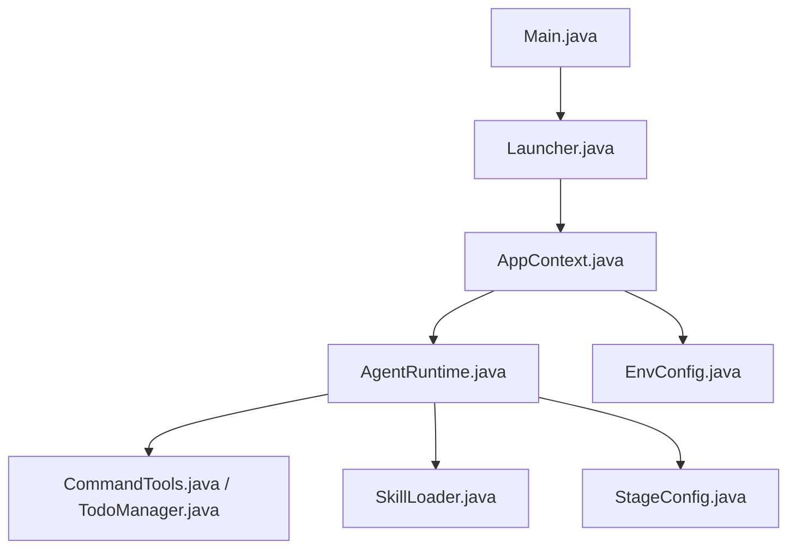
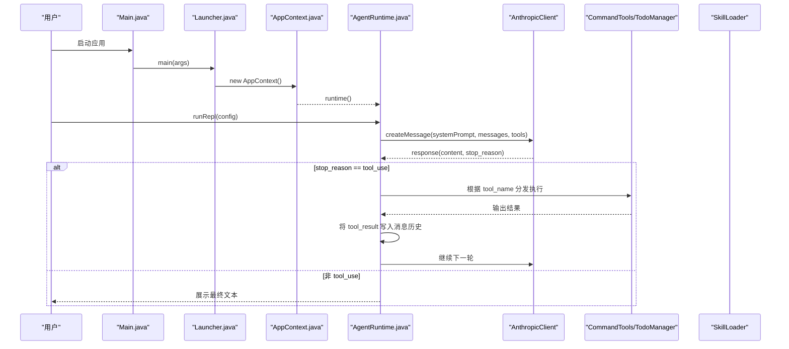
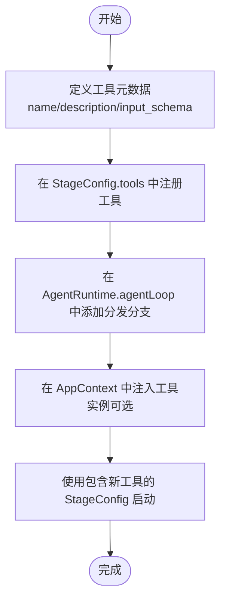
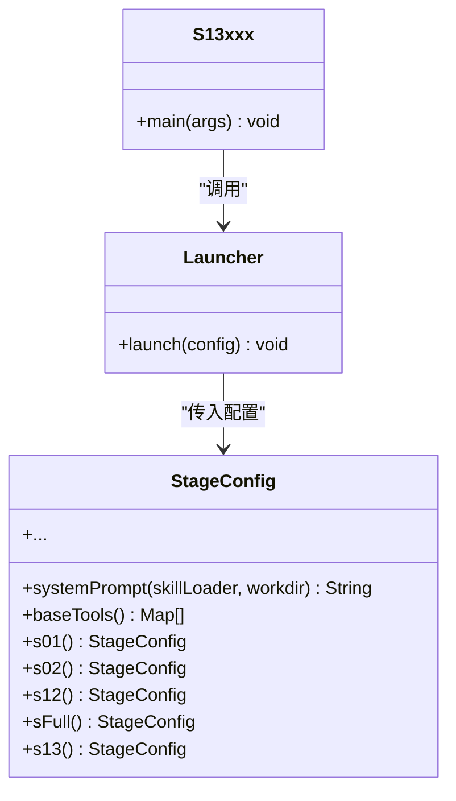
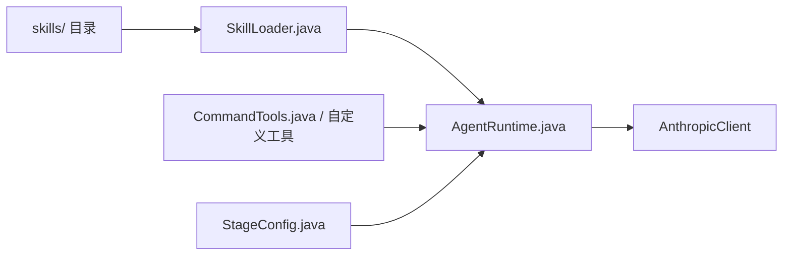
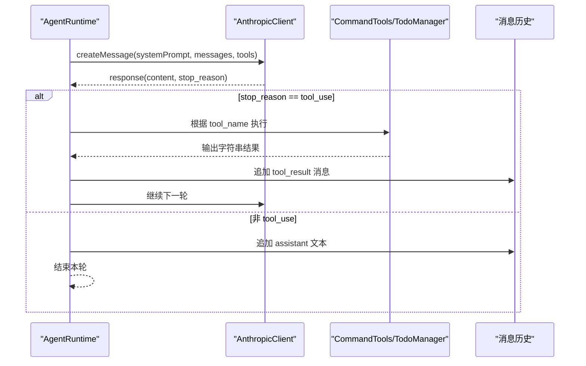
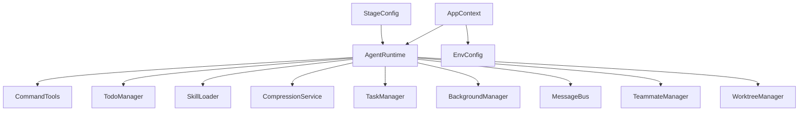

# 扩展开发

<cite>
**本文引用的文件**
- [Main.java](file://src/main/java/com/learnclaudecode/Main.java)
- [Launcher.java](file://src/main/java/com/learnclaudecode/agents/Launcher.java)
- [AppContext.java](file://src/main/java/com/learnclaudecode/agents/AppContext.java)
- [AgentRuntime.java](file://src/main/java/com/learnclaudecode/agents/AgentRuntime.java)
- [StageConfig.java](file://src/main/java/com/learnclaudecode/agents/StageConfig.java)
- [S01AgentLoop.java](file://src/main/java/com/learnclaudecode/agents/S01AgentLoop.java)
- [S02ToolUse.java](file://src/main/java/com/learnclaudecode/agents/S02ToolUse.java)
- [SFull.java](file://src/main/java/com/learnclaudecode/agents/SFull.java)
- [CommandTools.java](file://src/main/java/com/learnclaudecode/tools/CommandTools.java)
- [TodoManager.java](file://src/main/java/com/learnclaudecode/tools/TodoManager.java)
- [SkillLoader.java](file://src/main/java/com/learnclaudecode/skills/SkillLoader.java)
- [EnvConfig.java](file://src/main/java/com/learnclaudecode/common/EnvConfig.java)
- [ToolSpec.java](file://src/main/java/com/learnclaudecode/model/ToolSpec.java)
</cite>

## 目录
1. [简介](#简介)
2. [项目结构](#项目结构)
3. [核心组件](#核心组件)
4. [架构总览](#架构总览)
5. [详细组件分析](#详细组件分析)
6. [依赖关系分析](#依赖关系分析)
7. [性能与可扩展性](#性能与可扩展性)
8. [故障排查指南](#故障排查指南)
9. [结论](#结论)
10. [附录：扩展清单与示例路径](#附录：扩展清单与示例路径)

## 简介
本指南面向希望为系统添加新功能的开发者，覆盖以下目标：
- 新增工具（Tool）的完整流程：从接口定义、注册到接入 Agent 运行时。
- 新增学习阶段（基于 S01-S12 模板创建自定义阶段）。
- 插件架构的使用方法与扩展点（技能加载、工具装配、阶段编排）。
- 调试技巧与测试方法。
- 将自定义能力集成到 Agent 运行时的实践建议。

## 项目结构
本项目采用“运行时 + 阶段配置 + 工具/服务”的分层设计：
- 入口与启动：Main -> Launcher -> AppContext -> AgentRuntime
- 阶段配置：StageConfig 提供 s01-s12 与 s_full 的能力开关与工具集
- 工具与服务：CommandTools、TodoManager、SkillLoader、Task/Background/Team/Worktree 等
- 模型交互：通过 AnthropicClient 调用大模型，按 messages API 的工具协议进行工具调用

**图表来源**
- [Main.java:1-15](file://src/main/java/com/learnclaudecode/Main.java#L1-L15)
- [Launcher.java:1-28](file://src/main/java/com/learnclaudecode/agents/Launcher.java#L1-L28)
- [AppContext.java:1-70](file://src/main/java/com/learnclaudecode/agents/AppContext.java#L1-L70)
- [AgentRuntime.java:1-351](file://src/main/java/com/learnclaudecode/agents/AgentRuntime.java#L1-L351)
- [StageConfig.java:1-301](file://src/main/java/com/learnclaudecode/agents/StageConfig.java#L1-L301)
- [CommandTools.java:1-146](file://src/main/java/com/learnclaudecode/tools/CommandTools.java#L1-L146)
- [TodoManager.java:1-93](file://src/main/java/com/learnclaudecode/tools/TodoManager.java#L1-L93)
- [SkillLoader.java:1-106](file://src/main/java/com/learnclaudecode/skills/SkillLoader.java#L1-L106)
- [EnvConfig.java:1-96](file://src/main/java/com/learnclaudecode/common/EnvConfig.java#L1-L96)

**章节来源**
- [Main.java:1-15](file://src/main/java/com/learnclaudecode/Main.java#L1-L15)
- [Launcher.java:1-28](file://src/main/java/com/learnclaudecode/agents/Launcher.java#L1-L28)
- [AppContext.java:1-70](file://src/main/java/com/learnclaudecode/agents/AppContext.java#L1-L70)

## 核心组件
- AgentRuntime：统一驱动“用户输入 -> 调模型 -> 工具执行 -> 结果回写”的主循环，是扩展的核心接入点。
- StageConfig：阶段配置器，集中管理 system prompt、工具集合、功能开关（压缩、后台、团队、自治等）。
- AppContext：应用装配器，负责创建共享服务并注入到 AgentRuntime。
- CommandTools：基础命令与文件操作工具，体现工具实现的最小单元。
- SkillLoader：技能加载器，扫描 skills 目录下的 SKILL.md，作为知识型插件。
- EnvConfig：环境配置读取，支持 .env 与系统环境变量。

**章节来源**
- [AgentRuntime.java:23-39](file://src/main/java/com/learnclaudecode/agents/AgentRuntime.java#L23-L39)
- [StageConfig.java:11-25](file://src/main/java/com/learnclaudecode/agents/StageConfig.java#L11-L25)
- [AppContext.java:16-28](file://src/main/java/com/learnclaudecode/agents/AppContext.java#L16-L28)
- [CommandTools.java:13-28](file://src/main/java/com/learnclaudecode/tools/CommandTools.java#L13-L28)
- [SkillLoader.java:15-38](file://src/main/java/com/learnclaudecode/skills/SkillLoader.java#L15-L38)
- [EnvConfig.java:9-29](file://src/main/java/com/learnclaudecode/common/EnvConfig.java#L9-L29)

## 架构总览
下图展示了从启动到工具分发的关键流程，以及各组件之间的协作关系。

**图表来源**
- [Main.java:1-15](file://src/main/java/com/learnclaudecode/Main.java#L1-L15)
- [Launcher.java:18-26](file://src/main/java/com/learnclaudecode/agents/Launcher.java#L18-L26)
- [AppContext.java:35-59](file://src/main/java/com/learnclaudecode/agents/AppContext.java#L35-L59)
- [AgentRuntime.java:97-123](file://src/main/java/com/learnclaudecode/agents/AgentRuntime.java#L97-L123)
- [AgentRuntime.java:131-261](file://src/main/java/com/learnclaudecode/agents/AgentRuntime.java#L131-L261)
- [StageConfig.java:56-69](file://src/main/java/com/learnclaudecode/agents/StageConfig.java#L56-L69)

## 详细组件分析

### 新增工具（Tool）全流程
目标：新增一个工具，使其在指定阶段可用，并在 AgentRuntime 中可被调度执行。

步骤概览：
1. 实现工具逻辑类（例如：封装业务或外部服务调用）。
2. 在 StageConfig 中声明工具的元数据（name、description、input_schema），对齐 messages API 的工具描述格式。
3. 在 AgentRuntime.agentLoop 的工具分发分支中添加对应 case，将模型的工具调用映射到本地实现。
4. 在 AppContext 中注入工具实例（如需要）。
5. 在对应阶段的入口类（如 Sxx）中使用包含该工具的 StageConfig 启动。

**图表来源**
- [StageConfig.java:56-69](file://src/main/java/com/learnclaudecode/agents/StageConfig.java#L56-L69)
- [AgentRuntime.java:180-234](file://src/main/java/com/learnclaudecode/agents/AgentRuntime.java#L180-L234)
- [AppContext.java:44-58](file://src/main/java/com/learnclaudecode/agents/AppContext.java#L44-L58)

参考路径：
- 工具元数据构造：[StageConfig.java:277-284](file://src/main/java/com/learnclaudecode/agents/StageConfig.java#L277-L284)
- 工具分发映射：[AgentRuntime.java:189-234](file://src/main/java/com/learnclaudecode/agents/AgentRuntime.java#L189-L234)
- 基础工具实现：[CommandTools.java:36-145](file://src/main/java/com/learnclaudecode/tools/CommandTools.java#L36-L145)

**章节来源**
- [StageConfig.java:56-69](file://src/main/java/com/learnclaudecode/agents/StageConfig.java#L56-L69)
- [AgentRuntime.java:180-234](file://src/main/java/com/learnclaudecode/agents/AgentRuntime.java#L180-L234)
- [CommandTools.java:36-145](file://src/main/java/com/learnclaudecode/tools/CommandTools.java#L36-L145)

### 新增学习阶段（基于 S01-S12 模板）
目标：创建一个新阶段（例如 S13），复用现有阶段模板，组合所需工具与能力开关。

步骤概览：
1. 在 StageConfig 中新增阶段构建方法（如 s13()），继承已有阶段工具集并叠加新功能。
2. 新建阶段入口类（如 S13xxx），调用 Launcher.launch(StageConfig.s13())。
3. 如需启用高级特性（压缩、后台、团队、自治、worktree），在 StageConfig 中设置相应开关。
4. 若需引入新工具，参照“新增工具”流程在 StageConfig 中声明并在 AgentRuntime 中分发。

**图表来源**
- [StageConfig.java:77-267](file://src/main/java/com/learnclaudecode/agents/StageConfig.java#L77-L267)
- [S01AgentLoop.java:1-12](file://src/main/java/com/learnclaudecode/agents/S01AgentLoop.java#L1-L12)
- [S02ToolUse.java:1-13](file://src/main/java/com/learnclaudecode/agents/S02ToolUse.java#L1-L13)
- [Launcher.java:18-26](file://src/main/java/com/learnclaudecode/agents/Launcher.java#L18-L26)

参考路径：
- 阶段构建示例：[StageConfig.java:77-244](file://src/main/java/com/learnclaudecode/agents/StageConfig.java#L77-L244)
- 阶段入口示例：[S01AgentLoop.java:9-11](file://src/main/java/com/learnclaudecode/agents/S01AgentLoop.java#L9-L11), [S02ToolUse.java:9-11](file://src/main/java/com/learnclaudecode/agents/S02ToolUse.java#L9-L11)

**章节来源**
- [StageConfig.java:77-244](file://src/main/java/com/learnclaudecode/agents/StageConfig.java#L77-L244)
- [S01AgentLoop.java:1-12](file://src/main/java/com/learnclaudecode/agents/S01AgentLoop.java#L1-L12)
- [S02ToolUse.java:1-13](file://src/main/java/com/learnclaudecode/agents/S02ToolUse.java#L1-L13)
- [Launcher.java:18-26](file://src/main/java/com/learnclaudecode/agents/Launcher.java#L18-L26)

### 插件架构与扩展点
- 技能插件（SkillLoader）：扫描 skills 目录下的 SKILL.md，解析 frontmatter 与正文，暴露 load_skill 工具供模型按需加载。
- 工具插件（CommandTools 及后续扩展）：以工具元数据 + 分发分支的方式扩展能力。
- 阶段编排（StageConfig）：通过组合不同阶段工具与开关，形成“课程式”能力演进。
- 应用装配（AppContext）：集中创建共享服务，便于扩展时注入新的管理器或服务。

**图表来源**
- [SkillLoader.java:15-38](file://src/main/java/com/learnclaudecode/skills/SkillLoader.java#L15-L38)
- [AgentRuntime.java:180-234](file://src/main/java/com/learnclaudecode/agents/AgentRuntime.java#L180-L234)
- [StageConfig.java:56-69](file://src/main/java/com/learnclaudecode/agents/StageConfig.java#L56-L69)

参考路径：
- 技能加载与内容返回：[SkillLoader.java:45-104](file://src/main/java/com/learnclaudecode/skills/SkillLoader.java#L45-L104)
- 工具分发与执行：[AgentRuntime.java:189-234](file://src/main/java/com/learnclaudecode/agents/AgentRuntime.java#L189-L234)

**章节来源**
- [SkillLoader.java:15-104](file://src/main/java/com/learnclaudecode/skills/SkillLoader.java#L15-L104)
- [AgentRuntime.java:180-234](file://src/main/java/com/learnclaudecode/agents/AgentRuntime.java#L180-L234)
- [StageConfig.java:56-69](file://src/main/java/com/learnclaudecode/agents/StageConfig.java#L56-L69)

### 工具与运行时交互时序
下图展示一次工具调用的完整时序，包括模型决策、本地执行与结果回写。

**图表来源**
- [AgentRuntime.java:131-261](file://src/main/java/com/learnclaudecode/agents/AgentRuntime.java#L131-L261)

**章节来源**
- [AgentRuntime.java:131-261](file://src/main/java/com/learnclaudecode/agents/AgentRuntime.java#L131-L261)

## 依赖关系分析
- AgentRuntime 依赖多个管理器与工具：CommandTools、TodoManager、SkillLoader、CompressionService、TaskManager、BackgroundManager、MessageBus、TeammateManager、WorktreeManager。
- StageConfig 提供工具定义与阶段开关，决定运行时可用的能力集合。
- AppContext 集中装配这些依赖，避免在各阶段入口重复初始化。
- EnvConfig 提供模型访问与环境路径信息，贯穿整个应用。

**图表来源**
- [AgentRuntime.java:41-90](file://src/main/java/com/learnclaudecode/agents/AgentRuntime.java#L41-L90)
- [AppContext.java:44-58](file://src/main/java/com/learnclaudecode/agents/AppContext.java#L44-L58)
- [StageConfig.java:56-69](file://src/main/java/com/learnclaudecode/agents/StageConfig.java#L56-L69)

**章节来源**
- [AgentRuntime.java:41-90](file://src/main/java/com/learnclaudecode/agents/AgentRuntime.java#L41-L90)
- [AppContext.java:44-58](file://src/main/java/com/learnclaudecode/agents/AppContext.java#L44-L58)

## 性能与可扩展性
- 上下文压缩：StageConfig.enableCompression 控制自动/手动压缩，避免对话过长导致性能下降。
- 后台任务：StageConfig.enableBackground 允许长耗时任务异步执行，提升主循环响应性。
- 工具限流与超时：CommandTools.runBash 对危险命令进行黑名单拦截，并对进程执行设置超时限制。
- 工具去重：StageConfig.dedupe 在多阶段合并时按工具名去重，避免重复定义影响性能。

优化建议：
- 为新工具增加参数校验与错误快速失败机制，减少无效调用。
- 对高频工具增加缓存或批处理策略（如批量文件读写）。
- 合理设置压缩阈值与后台任务超时，平衡用户体验与资源占用。

**章节来源**
- [AgentRuntime.java:136-159](file://src/main/java/com/learnclaudecode/agents/AgentRuntime.java#L136-L159)
- [CommandTools.java:36-65](file://src/main/java/com/learnclaudecode/tools/CommandTools.java#L36-L65)
- [StageConfig.java:292-299](file://src/main/java/com/learnclaudecode/agents/StageConfig.java#L292-L299)

## 故障排查指南
常见问题与定位方法：
- 工具未生效：检查 StageConfig 是否已声明该工具；确认 AgentRuntime 分发分支是否包含对应 case。
- 工具执行报错：查看 CommandTools 的错误返回；确认工作区路径与安全解析是否正确。
- 模型不调用工具：检查 systemPrompt 与 tools 是否匹配；确认 stop_reason 是否为 tool_use。
- 技能未加载：确认 skills 目录下存在 SKILL.md；检查 SkillLoader 的扫描与解析逻辑。

调试技巧：
- 在 AgentRuntime 的工具分发处打印工具名与输入参数，辅助定位模型意图。
- 使用 EnvConfig 切换模型与基础 URL，便于在不同环境中验证。
- 逐步启用 StageConfig 的功能开关（压缩、后台、团队），隔离问题范围。

**章节来源**
- [AgentRuntime.java:189-234](file://src/main/java/com/learnclaudecode/agents/AgentRuntime.java#L189-L234)
- [CommandTools.java:87-145](file://src/main/java/com/learnclaudecode/tools/CommandTools.java#L87-L145)
- [SkillLoader.java:45-104](file://src/main/java/com/learnclaudecode/skills/SkillLoader.java#L45-L104)
- [EnvConfig.java:22-58](file://src/main/java/com/learnclaudecode/common/EnvConfig.java#L22-L58)

## 结论
本项目的扩展体系围绕“运行时 + 阶段配置 + 工具/服务”展开：
- 新增工具需在 StageConfig 中声明并在 AgentRuntime 中分发。
- 新增阶段通过 StageConfig 组合工具与开关，并以独立入口类启动。
- 插件化体现在技能加载与工具装配两个层面，便于知识型与能力型扩展。
- 通过 AppContext 集中装配依赖，保证扩展点的清晰与可维护性。

遵循上述流程与最佳实践，可以高效地为系统添加新功能并保持架构一致性。

## 附录：扩展清单与示例路径
- 新增工具
  - 工具元数据构造：[StageConfig.java:277-284](file://src/main/java/com/learnclaudecode/agents/StageConfig.java#L277-L284)
  - 工具分发映射：[AgentRuntime.java:189-234](file://src/main/java/com/learnclaudecode/agents/AgentRuntime.java#L189-L234)
  - 基础工具实现参考：[CommandTools.java:36-145](file://src/main/java/com/learnclaudecode/tools/CommandTools.java#L36-L145)
- 新增阶段
  - 阶段构建示例：[StageConfig.java:77-244](file://src/main/java/com/learnclaudecode/agents/StageConfig.java#L77-L244)
  - 阶段入口示例：[S01AgentLoop.java:9-11](file://src/main/java/com/learnclaudecode/agents/S01AgentLoop.java#L9-L11), [S02ToolUse.java:9-11](file://src/main/java/com/learnclaudecode/agents/S02ToolUse.java#L9-L11)
  - 统一启动器：[Launcher.java:18-26](file://src/main/java/com/learnclaudecode/agents/Launcher.java#L18-L26)
- 插件与扩展点
  - 技能加载：[SkillLoader.java:15-104](file://src/main/java/com/learnclaudecode/skills/SkillLoader.java#L15-L104)
  - 应用装配：[AppContext.java:35-59](file://src/main/java/com/learnclaudecode/agents/AppContext.java#L35-L59)
  - 环境配置：[EnvConfig.java:22-58](file://src/main/java/com/learnclaudecode/common/EnvConfig.java#L22-L58)
- 工具与运行时交互
  - 主循环与工具分发：[AgentRuntime.java:131-261](file://src/main/java/com/learnclaudecode/agents/AgentRuntime.java#L131-L261)