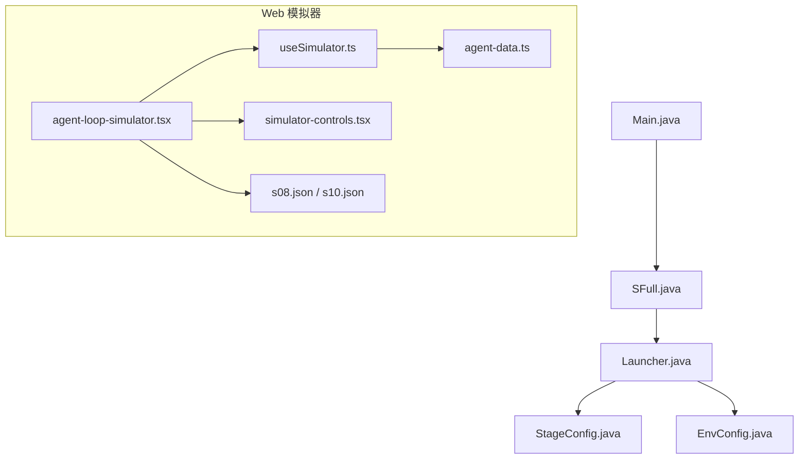
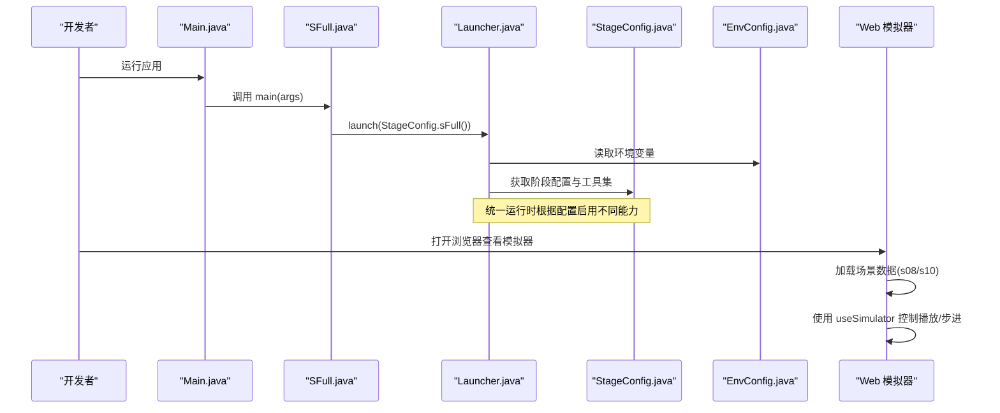
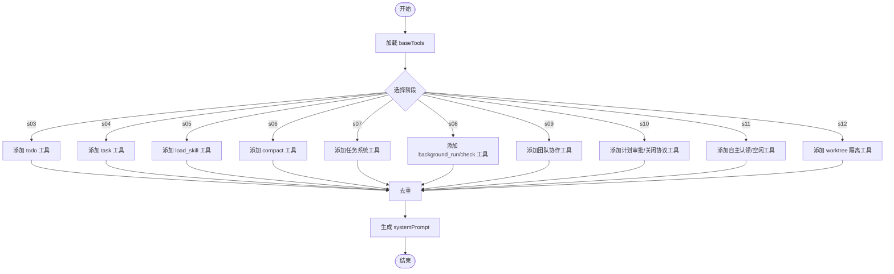
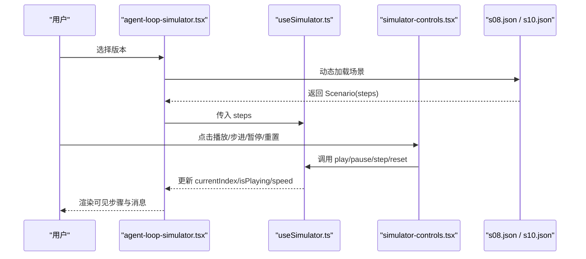
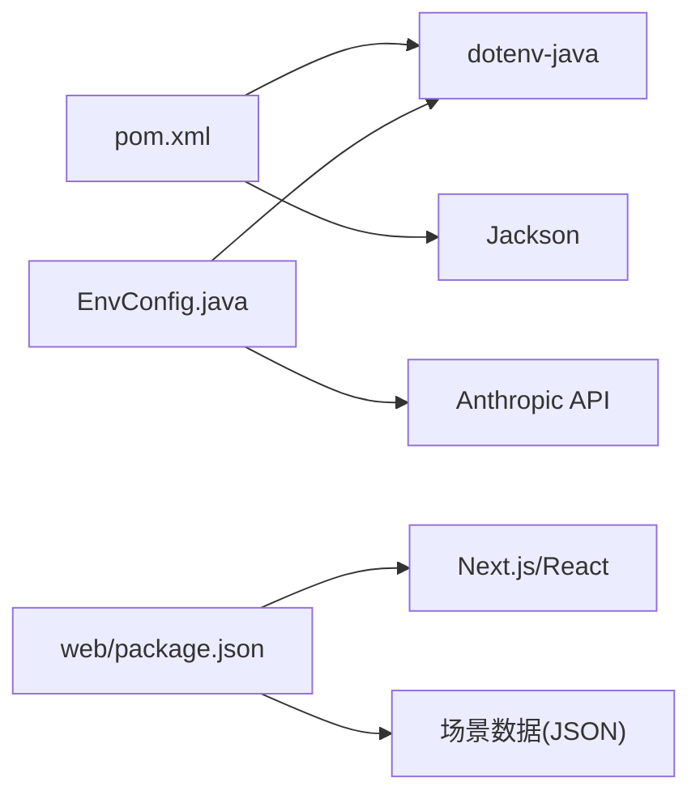

# 扩展测试与调试

<cite>
**本文引用的文件**
- [pom.xml](file://pom.xml)
- [Main.java](file://src/main/java/com/learnclaudecode/Main.java)
- [SFull.java](file://src/main/java/com/learnclaudecode/agents/SFull.java)
- [Launcher.java](file://src/main/java/com/learnclaudecode/agents/Launcher.java)
- [StageConfig.java](file://src/main/java/com/learnclaudecode/agents/StageConfig.java)
- [EnvConfig.java](file://src/main/java/com/learnclaudecode/common/EnvConfig.java)
- [useSimulator.ts](file://web/src/hooks/useSimulator.ts)
- [agent-loop-simulator.tsx](file://web/src/components/simulator/agent-loop-simulator.tsx)
- [simulator-controls.tsx](file://web/src/components/simulator/simulator-controls.tsx)
- [s08.json](file://web/src/data/scenarios/s08.json)
- [s10.json](file://web/src/data/scenarios/s10.json)
- [agent-data.ts](file://web/src/types/agent-data.ts)
</cite>

## 目录
1. [简介](#简介)
2. [项目结构](#项目结构)
3. [核心组件](#核心组件)
4. [架构总览](#架构总览)
5. [详细组件分析](#详细组件分析)
6. [依赖分析](#依赖分析)
7. [性能考虑](#性能考虑)
8. [故障排查指南](#故障排查指南)
9. [结论](#结论)
10. [附录](#附录)

## 简介
本指南面向希望为“自定义工具、学习阶段和插件”编写测试与进行调试的开发者。内容覆盖：
- 单元测试与集成测试的编写方法（Java 后端与 Web 前端）
- 调试技巧与工具使用（日志、断点、性能分析）
- 模拟环境搭建与 Web 模拟器验证流程
- 常见测试场景与调试案例，帮助快速定位问题

本项目采用“统一运行时 + 阶段配置”的方式组织能力演进，Web 端提供可视化模拟器用于功能验证与教学演示。

## 项目结构
- Java 后端
  - 入口与启动：Main 指向完整能力版本 SFull；SFull 通过 Launcher 启动统一运行时；StageConfig 定义各阶段能力开关与工具集。
  - 环境配置：EnvConfig 负责读取 .env 与环境变量，支撑模型访问与运行路径。
  - 构建：Maven 管理依赖与编译输出。
- Web 前端
  - 模拟器：AgentLoopSimulator 加载场景数据，useSimulator 控制播放步进，SimulatorControls 提供交互控件。
  - 场景数据：以 JSON 描述步骤序列，便于回放与验证。
  - 类型定义：agent-data.ts 定义步骤、场景等数据结构。

**图表来源**
- [Main.java:1-15](file://src/main/java/com/learnclaudecode/Main.java#L1-L15)
- [SFull.java:1-13](file://src/main/java/com/learnclaudecode/agents/SFull.java#L1-L13)
- [Launcher.java:1-28](file://src/main/java/com/learnclaudecode/agents/Launcher.java#L1-L28)
- [StageConfig.java:1-301](file://src/main/java/com/learnclaudecode/agents/StageConfig.java#L1-L301)
- [EnvConfig.java:1-96](file://src/main/java/com/learnclaudecode/common/EnvConfig.java#L1-L96)
- [agent-loop-simulator.tsx:1-60](file://web/src/components/simulator/agent-loop-simulator.tsx#L1-L60)
- [useSimulator.ts:1-53](file://web/src/hooks/useSimulator.ts#L1-L53)
- [simulator-controls.tsx:1-34](file://web/src/components/simulator/simulator-controls.tsx#L1-L34)
- [s08.json:36-56](file://web/src/data/scenarios/s08.json#L36-L56)
- [s10.json:30-38](file://web/src/data/scenarios/s10.json#L30-L38)
- [agent-data.ts:1-73](file://web/src/types/agent-data.ts#L1-L73)

**章节来源**
- [pom.xml:1-68](file://pom.xml#L1-L68)
- [Main.java:1-15](file://src/main/java/com/learnclaudecode/Main.java#L1-L15)
- [SFull.java:1-13](file://src/main/java/com/learnclaudecode/agents/SFull.java#L1-L13)
- [Launcher.java:1-28](file://src/main/java/com/learnclaudecode/agents/Launcher.java#L1-L28)
- [StageConfig.java:1-301](file://src/main/java/com/learnclaudecode/agents/StageConfig.java#L1-L301)
- [EnvConfig.java:1-96](file://src/main/java/com/learnclaudecode/common/EnvConfig.java#L1-L96)
- [agent-loop-simulator.tsx:1-60](file://web/src/components/simulator/agent-loop-simulator.tsx#L1-L60)
- [useSimulator.ts:1-53](file://web/src/hooks/useSimulator.ts#L1-L53)
- [simulator-controls.tsx:1-34](file://web/src/components/simulator/simulator-controls.tsx#L1-L34)
- [s08.json:36-56](file://web/src/data/scenarios/s08.json#L36-L56)
- [s10.json:30-38](file://web/src/data/scenarios/s10.json#L30-L38)
- [agent-data.ts:1-73](file://web/src/types/agent-data.ts#L1-L73)

## 核心组件
- 阶段配置 StageConfig
  - 作用：集中定义每个教学阶段的系统提示、工具集合与能力开关（如 Todo、压缩、后台任务、团队、自治队友、worktree）。
  - 关键点：工具列表可组合与去重；systemPrompt 支持动态替换工作区与技能信息。
- 启动器 Launcher
  - 作用：统一创建应用上下文并执行交互式运行时，避免重复初始化。
- 环境配置 EnvConfig
  - 作用：读取 .env 与环境变量，提供模型 ID、API Key、基础 URL 与工作目录。
- Web 模拟器
  - agent-loop-simulator.tsx：按版本动态加载场景数据，驱动可视化回放。
  - useSimulator.ts：维护播放状态、步进、自动播放与速度控制。
  - simulator-controls.tsx：提供播放、暂停、步进、重置、速度切换等交互。
  - 场景数据（s08.json、s10.json）：描述步骤序列与注释，便于验证并发与协议行为。
  - 类型定义（agent-data.ts）：约束步骤、场景等数据结构。

**章节来源**
- [StageConfig.java:1-301](file://src/main/java/com/learnclaudecode/agents/StageConfig.java#L1-L301)
- [Launcher.java:1-28](file://src/main/java/com/learnclaudecode/agents/Launcher.java#L1-L28)
- [EnvConfig.java:1-96](file://src/main/java/com/learnclaudecode/common/EnvConfig.java#L1-L96)
- [agent-loop-simulator.tsx:1-60](file://web/src/components/simulator/agent-loop-simulator.tsx#L1-L60)
- [useSimulator.ts:1-53](file://web/src/hooks/useSimulator.ts#L1-L53)
- [simulator-controls.tsx:1-34](file://web/src/components/simulator/simulator-controls.tsx#L1-L34)
- [s08.json:36-56](file://web/src/data/scenarios/s08.json#L36-L56)
- [s10.json:30-38](file://web/src/data/scenarios/s10.json#L30-L38)
- [agent-data.ts:1-73](file://web/src/types/agent-data.ts#L1-L73)

## 架构总览
下图展示从 Java 启动到 Web 模拟器回放的端到端关系，以及阶段配置如何影响运行时能力。

**图表来源**
- [Main.java:1-15](file://src/main/java/com/learnclaudecode/Main.java#L1-L15)
- [SFull.java:1-13](file://src/main/java/com/learnclaudecode/agents/SFull.java#L1-L13)
- [Launcher.java:1-28](file://src/main/java/com/learnclaudecode/agents/Launcher.java#L1-L28)
- [StageConfig.java:1-301](file://src/main/java/com/learnclaudecode/agents/StageConfig.java#L1-L301)
- [EnvConfig.java:1-96](file://src/main/java/com/learnclaudecode/common/EnvConfig.java#L1-L96)
- [agent-loop-simulator.tsx:1-60](file://web/src/components/simulator/agent-loop-simulator.tsx#L1-L60)
- [useSimulator.ts:1-53](file://web/src/hooks/useSimulator.ts#L1-L53)

## 详细组件分析

### 阶段配置与工具集（StageConfig）
- 设计要点
  - 工具集组合：baseTools 为基础能力，后续阶段逐步叠加新工具（如 todo、subagent、background_run、team 相关工具、worktree）。
  - 能力开关：enableTodoNag、enableCompression、enableBackground、enableInbox、autonomousTeammates 等布尔位控制运行时特性。
  - systemPrompt 动态化：通过占位符注入工作区路径与技能描述，增强提示词的可定制性。
- 测试建议
  - 单元测试：验证各阶段工具集是否包含预期工具；验证去重逻辑；验证 systemPrompt 占位符替换结果。
  - 集成测试：结合运行时，检查在特定 StageConfig 下工具是否可用、提示词是否正确生成。
- 复杂度与优化
  - 工具合并与去重时间复杂度近似 O(n)，n 为工具数量；可通过 Map 索引进一步降低重复处理成本。

**图表来源**
- [StageConfig.java:56-301](file://src/main/java/com/learnclaudecode/agents/StageConfig.java#L56-L301)

**章节来源**
- [StageConfig.java:1-301](file://src/main/java/com/learnclaudecode/agents/StageConfig.java#L1-L301)

### Web 模拟器（agent-loop-simulator.tsx、useSimulator.ts、simulator-controls.tsx）
- 数据流
  - 根据版本动态导入场景 JSON（如 s08、s10），解析为 Scenario。
  - useSimulator 维护当前步骤、播放状态、速度与定时器，提供 stepForward、play、pause、reset 等方法。
  - SimulatorControls 暴露 UI 按钮，触发上述方法。
- 测试建议
  - 单元测试：验证 useSimulator 的状态转换（播放/暂停/步进/重置）、边界条件（到达最后一步停止）。
  - 集成测试：验证场景数据加载与渲染；验证控制器事件与状态同步。
- 调试建议
  - 在浏览器控制台打印 visibleSteps 长度变化，确认滚动与渲染同步。
  - 对步骤数据进行快照比对，确保顺序与内容符合预期。

**图表来源**
- [agent-loop-simulator.tsx:1-60](file://web/src/components/simulator/agent-loop-simulator.tsx#L1-L60)
- [useSimulator.ts:1-53](file://web/src/hooks/useSimulator.ts#L1-L53)
- [simulator-controls.tsx:1-34](file://web/src/components/simulator/simulator-controls.tsx#L1-L34)
- [s08.json:36-56](file://web/src/data/scenarios/s08.json#L36-L56)
- [s10.json:30-38](file://web/src/data/scenarios/s10.json#L30-L38)

**章节来源**
- [agent-loop-simulator.tsx:1-60](file://web/src/components/simulator/agent-loop-simulator.tsx#L1-L60)
- [useSimulator.ts:1-53](file://web/src/hooks/useSimulator.ts#L1-L53)
- [simulator-controls.tsx:1-34](file://web/src/components/simulator/simulator-controls.tsx#L1-L34)
- [s08.json:36-56](file://web/src/data/scenarios/s08.json#L36-L56)
- [s10.json:30-38](file://web/src/data/scenarios/s10.json#L30-L38)

### 场景数据与类型（s08.json、s10.json、agent-data.ts）
- 场景数据
  - s08.json：描述后台任务并行执行与通知机制，适合验证非阻塞执行与队列消费。
  - s10.json：描述团队协议中的请求关联与状态机模式，适合验证跨 Agent 协作的一致性。
- 类型定义
  - agent-data.ts：定义步骤类型、工具名、输入、注解等字段，保证前后端数据结构一致。
- 测试建议
  - 单元测试：校验 JSON 结构与类型约束；验证步骤序列的完整性与顺序。
  - 集成测试：将场景数据注入模拟器，验证回放过程与 UI 表现一致。

**章节来源**
- [s08.json:36-56](file://web/src/data/scenarios/s08.json#L36-L56)
- [s10.json:30-38](file://web/src/data/scenarios/s10.json#L30-L38)
- [agent-data.ts:1-73](file://web/src/types/agent-data.ts#L1-L73)

## 依赖分析
- Maven 依赖
  - dotenv-java：读取 .env 环境变量。
  - Jackson：JSON 序列化/反序列化。
- 运行时依赖
  - Anthropic API Key/Base URL：由 EnvConfig 提供，决定模型访问目标。
- 前端依赖
  - Next.js、React、Framer Motion：构建与动画效果。
  - 场景数据：本地 JSON 文件，无需外部服务即可回放。

**图表来源**
- [pom.xml:19-35](file://pom.xml#L19-L35)
- [EnvConfig.java:1-96](file://src/main/java/com/learnclaudecode/common/EnvConfig.java#L1-L96)
- [web/package.json:1-39](file://web/package.json#L1-L39)

**章节来源**
- [pom.xml:1-68](file://pom.xml#L1-L68)
- [EnvConfig.java:1-96](file://src/main/java/com/learnclaudecode/common/EnvConfig.java#L1-L96)
- [web/package.json:1-39](file://web/package.json#L1-L39)

## 性能考虑
- 阶段配置合并与去重
  - 工具列表合并时注意重复项；已实现按名称去重，避免冗余。
- 模拟器回放
  - 使用定时器控制播放速度，避免频繁 DOM 操作；合理设置步长与可见步骤范围。
- 场景数据规模
  - 大场景 JSON 可能导致首屏加载变慢；可按需懒加载或分片加载。

[本节为通用指导，不直接分析具体文件]

## 故障排查指南
- 环境变量缺失
  - 现象：启动时报缺少必要环境变量。
  - 排查：检查 .env 与系统环境变量；确认 MODEL_ID、ANTHROPIC_API_KEY、ANTHROPIC_BASE_URL 已正确设置。
  - 参考：EnvConfig 的 require/getenv 逻辑。
- 模拟器无响应
  - 现象：点击播放/步进无变化。
  - 排查：检查 useSimulator 状态；确认场景数据 steps 非空；验证控制器事件绑定。
- 后台任务未生效
  - 现象：s08 场景中后台任务未显示或未完成。
  - 排查：确认 StageConfig 中 enableBackground=true；检查场景数据步骤顺序与注解；在 Web 控制台观察 visibleSteps 变化。
- 团队协议不一致
  - 现象：s10 场景中请求关联失败。
  - 排查：核对 request_id 传递；检查步骤类型与内容；验证 FSM 状态转换是否符合预期。

**章节来源**
- [EnvConfig.java:22-58](file://src/main/java/com/learnclaudecode/common/EnvConfig.java#L22-L58)
- [useSimulator.ts:12-53](file://web/src/hooks/useSimulator.ts#L12-L53)
- [s08.json:36-56](file://web/src/data/scenarios/s08.json#L36-L56)
- [s10.json:30-38](file://web/src/data/scenarios/s10.json#L30-L38)

## 结论
- 通过 StageConfig 的模块化能力编排，可以在同一运行时上灵活扩展工具与特性，便于测试与调试。
- Web 模拟器提供了可视化的回放与验证手段，配合场景数据可以快速定位问题。
- 建议在开发过程中结合单元测试、集成测试与模拟器回放，形成闭环的质量保障体系。

[本节为总结性内容，不直接分析具体文件]

## 附录

### 单元测试编写指南（Java）
- 针对 StageConfig
  - 断言各阶段工具集包含预期工具。
  - 断言去重逻辑正确。
  - 断言 systemPrompt 占位符替换结果。
- 针对 EnvConfig
  - 断言必填环境变量缺失时抛出异常。
  - 断言系统环境变量优先级高于 .env。
- 针对 Launcher
  - 断言传入不同 StageConfig 能正确启动运行时（可借助 Mock 或最小化集成测试）。

**章节来源**
- [StageConfig.java:56-301](file://src/main/java/com/learnclaudecode/agents/StageConfig.java#L56-L301)
- [EnvConfig.java:22-58](file://src/main/java/com/learnclaudecode/common/EnvConfig.java#L22-L58)
- [Launcher.java:18-26](file://src/main/java/com/learnclaudecode/agents/Launcher.java#L18-L26)

### 集成测试编写指南（Web）
- 场景加载
  - 验证不同版本（s08、s10）的场景数据能正确加载与解析。
- 播放器行为
  - 验证播放、暂停、步进、重置的状态转换。
  - 验证到达最后一步后自动停止。
- UI 同步
  - 验证 visibleSteps 变化与滚动行为一致。

**章节来源**
- [agent-loop-simulator.tsx:30-60](file://web/src/components/simulator/agent-loop-simulator.tsx#L30-L60)
- [useSimulator.ts:12-53](file://web/src/hooks/useSimulator.ts#L12-L53)
- [simulator-controls.tsx:7-34](file://web/src/components/simulator/simulator-controls.tsx#L7-L34)

### 调试技巧与工具使用
- 日志记录
  - Java：在关键路径添加日志输出（如工具注册、提示词生成、环境变量读取）。
  - Web：在 useSimulator 与组件中打印状态变化，辅助定位渲染问题。
- 断点调试
  - Java：在 Launcher.launch、StageConfig.systemPrompt、EnvConfig.getenv 处设置断点。
  - Web：在 agent-loop-simulator 的数据加载与 useSimulator 的状态更新处设置断点。
- 性能分析
  - Java：使用 Profiler 分析运行时 CPU/内存占用，关注工具合并与提示词生成热点。
  - Web：使用浏览器性能面板分析回放过程中的重排与重绘。

**章节来源**
- [Launcher.java:18-26](file://src/main/java/com/learnclaudecode/agents/Launcher.java#L18-L26)
- [StageConfig.java:44-49](file://src/main/java/com/learnclaudecode/agents/StageConfig.java#L44-L49)
- [EnvConfig.java:47-58](file://src/main/java/com/learnclaudecode/common/EnvConfig.java#L47-L58)
- [useSimulator.ts:12-53](file://web/src/hooks/useSimulator.ts#L12-L53)

### 模拟环境搭建与 Web 模拟器验证
- 环境准备
  - 安装 JDK 17 与 Node.js，确保 Maven 与 npm 可用。
  - 配置 .env 文件，填写 MODEL_ID、ANTHROPIC_API_KEY、ANTHROPIC_BASE_URL。
- 启动后端
  - 使用 Maven 运行主类 Main 或 SFull，进入交互式运行时。
- 启动前端
  - 在 web 目录下执行开发脚本，启动 Next.js 开发服务器。
- 功能验证
  - 打开浏览器，选择对应版本（如 s08、s10），使用模拟器回放场景。
  - 通过控制器进行播放、步进、暂停等操作，观察步骤与消息变化。
  - 结合场景数据的注解，验证后台任务并行与团队协议一致性。

**章节来源**
- [pom.xml:12-17](file://pom.xml#L12-L17)
- [EnvConfig.java:22-29](file://src/main/java/com/learnclaudecode/common/EnvConfig.java#L22-L29)
- [Main.java:5-13](file://src/main/java/com/learnclaudecode/Main.java#L5-L13)
- [SFull.java:3-11](file://src/main/java/com/learnclaudecode/agents/SFull.java#L3-L11)
- [agent-loop-simulator.tsx:30-60](file://web/src/components/simulator/agent-loop-simulator.tsx#L30-L60)
- [useSimulator.ts:12-53](file://web/src/hooks/useSimulator.ts#L12-L53)
- [s08.json:36-56](file://web/src/data/scenarios/s08.json#L36-L56)
- [s10.json:30-38](file://web/src/data/scenarios/s10.json#L30-L38)