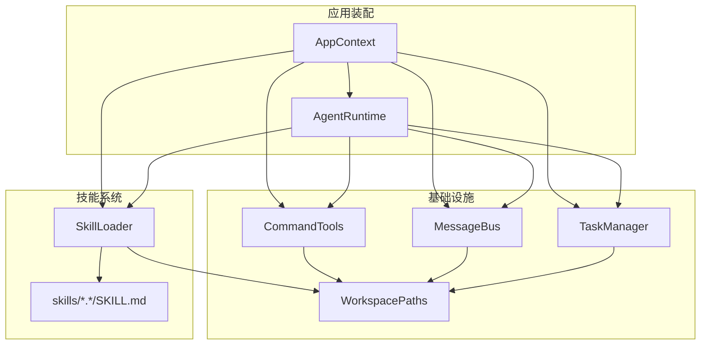
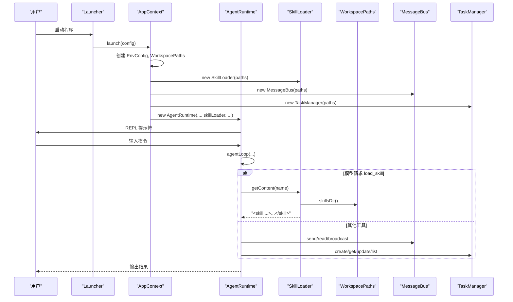
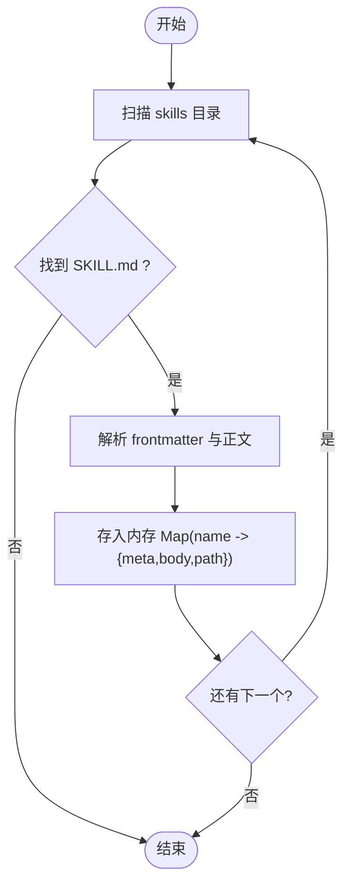
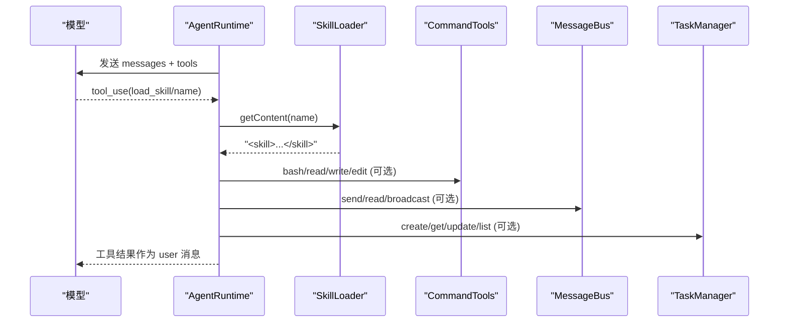
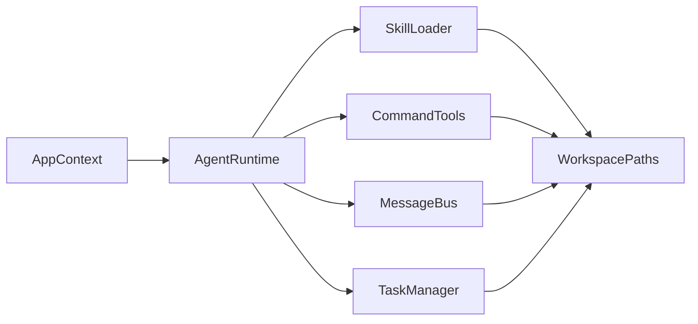

# 插件架构扩展

<cite>
**本文引用的文件**
- [SkillLoader.java](file://src/main/java/com/learnclaudecode/skills/SkillLoader.java)
- [AppContext.java](file://src/main/java/com/learnclaudecode/agents/AppContext.java)
- [AgentRuntime.java](file://src/main/java/com/learnclaudecode/agents/AgentRuntime.java)
- [WorkspacePaths.java](file://src/main/java/com/learnclaudecode/common/WorkspacePaths.java)
- [MessageBus.java](file://src/main/java/com/learnclaudecode/team/MessageBus.java)
- [TaskManager.java](file://src/main/java/com/learnclaudecode/tasks/TaskManager.java)
- [CommandTools.java](file://src/main/java/com/learnclaudecode/tools/CommandTools.java)
- [S05SkillLoading.java](file://src/main/java/com/learnclaudecode/agents/S05SkillLoading.java)
- [SKILL.md（agent-builder）](file://skills/agent-builder/SKILL.md)
- [SKILL.md（code-review）](file://skills/code-review/SKILL.md)
- [SKILL.md（mcp-builder）](file://skills/mcp-builder/SKILL.md)
- [SKILL.md（pdf）](file://skills/pdf/SKILL.md)
- [pom.xml](file://pom.xml)
</cite>

## 目录
1. [简介](#简介)
2. [项目结构](#项目结构)
3. [核心组件](#核心组件)
4. [架构总览](#架构总览)
5. [详细组件分析](#详细组件分析)
6. [依赖关系分析](#依赖关系分析)
7. [性能与可扩展性](#性能与可扩展性)
8. [故障排查指南](#故障排查指南)
9. [结论](#结论)
10. [附录：插件开发与部署实践](#附录插件开发与部署实践)

## 简介
本文件面向希望在本项目中扩展“技能/插件”能力的开发者，系统阐述插件化设计原理、SkillLoader 的工作机制、外部技能模块的开发与加载方式，以及插件生命周期管理、依赖注入、事件通信协议等关键主题。同时提供插件打包、版本管理与兼容性处理的最佳实践，并给出可操作的示例与部署指南。

## 项目结构
本项目采用分层与按能力组织的方式：
- agents：Agent 运行时、启动器、阶段配置与示例入口
- common：环境配置、工作区路径工具、JSON 工具
- skills：技能加载器（当前实现为基于 SKILL.md 的元数据与内容加载）
- team：消息总线与队友管理
- tasks：任务系统与隔离工作树管理
- tools：基础命令与文件操作工具
- web：前端可视化与演示站点（与本插件文档关联度较低）

图表来源
- [AppContext.java:35-59](file://src/main/java/com/learnclaudecode/agents/AppContext.java#L35-L59)
- [AgentRuntime.java:41-90](file://src/main/java/com/learnclaudecode/agents/AgentRuntime.java#L41-L90)
- [SkillLoader.java:18-38](file://src/main/java/com/learnclaudecode/skills/SkillLoader.java#L18-L38)
- [WorkspacePaths.java:11-125](file://src/main/java/com/learnclaudecode/common/WorkspacePaths.java#L11-L125)

章节来源
- [AppContext.java:35-59](file://src/main/java/com/learnclaudecode/agents/AppContext.java#L35-L59)
- [WorkspacePaths.java:11-125](file://src/main/java/com/learnclaudecode/common/WorkspacePaths.java#L11-L125)

## 核心组件
- SkillLoader：扫描工作区 skills 目录下的每个技能子目录，解析 SKILL.md 的 frontmatter 与正文，提供描述列表与指定技能的完整内容。
- AgentRuntime：统一运行循环，负责将模型的工具调用映射到本地实现；其中包含 load_skill 工具，用于按需加载技能内容。
- AppContext：应用装配器，集中创建共享服务（包括 SkillLoader），并通过依赖注入将各组件组装进 AgentRuntime。
- WorkspacePaths：安全路径工具，提供 skillsDir() 等约定路径访问，确保所有文件访问限制在工作区内。
- MessageBus：基于 .team/inbox/*.jsonl 的文件型消息总线，支持点对点消息与广播，作为团队内事件通信的基础。
- TaskManager：基于文件的轻量任务板，支持任务的创建、更新、认领、依赖管理与 worktree 绑定。
- CommandTools：基础命令执行与文件读写编辑工具，受限于工作区与安全黑名单。

章节来源
- [SkillLoader.java:18-104](file://src/main/java/com/learnclaudecode/skills/SkillLoader.java#L18-L104)
- [AgentRuntime.java:131-260](file://src/main/java/com/learnclaudecode/agents/AgentRuntime.java#L131-L260)
- [AppContext.java:35-59](file://src/main/java/com/learnclaudecode/agents/AppContext.java#L35-L59)
- [WorkspacePaths.java:11-125](file://src/main/java/com/learnclaudecode/common/WorkspacePaths.java#L11-L125)
- [MessageBus.java:19-123](file://src/main/java/com/learnclaudecode/team/MessageBus.java#L19-L123)
- [TaskManager.java:27-338](file://src/main/java/com/learnclaudecode/tasks/TaskManager.java#L27-L338)
- [CommandTools.java:16-146](file://src/main/java/com/learnclaudecode/tools/CommandTools.java#L16-L146)

## 架构总览
下图展示了从启动到技能加载与工具调用的整体流程。AppContext 在初始化时创建 SkillLoader，AgentRuntime 在运行中通过 load_skill 工具按需读取技能内容，并将其注入对话上下文。

图表来源
- [AppContext.java:35-59](file://src/main/java/com/learnclaudecode/agents/AppContext.java#L35-L59)
- [AgentRuntime.java:131-260](file://src/main/java/com/learnclaudecode/agents/AgentRuntime.java#L131-L260)
- [SkillLoader.java:26-104](file://src/main/java/com/learnclaudecode/skills/SkillLoader.java#L26-L104)
- [WorkspacePaths.java:117-125](file://src/main/java/com/learnclaudecode/common/WorkspacePaths.java#L117-L125)
- [MessageBus.java:54-123](file://src/main/java/com/learnclaudecode/team/MessageBus.java#L54-L123)
- [TaskManager.java:51-159](file://src/main/java/com/learnclaudecode/tasks/TaskManager.java#L51-L159)

## 详细组件分析

### SkillLoader：技能加载器
- 职责：扫描工作区 skills 目录，识别每个技能子目录中的 SKILL.md，解析 frontmatter（name/description 等）与正文，维护已加载技能集合。
- 关键方法：
  - 构造：根据 WorkspacePaths.skillsDir() 定位目录，遍历并加载 SKILL.md。
  - loadSkillFile：解析 frontmatter 与正文，构建 {meta, body, path} 的结构。
  - getDescriptions：生成可用技能列表与简要说明。
  - getContent：返回指定技能的完整内容，并以 <skill> 标签包裹以便注入上下文。
- 复杂度：
  - 时间：O(N) 扫描 N 个技能文件；解析单个文件 O(L)。
  - 空间：O(S) 存储所有技能的元数据与正文。
- 错误处理：IO 异常被忽略，保证健壮性；未知技能名返回友好错误信息。
- 扩展点：
  - 可在 loadSkillFile 中增强 frontmatter 解析（如 version、author、tags）。
  - 可增加校验逻辑（必填字段、格式校验）。
  - 可缓存已加载技能以提升重复访问性能。

图表来源
- [SkillLoader.java:26-72](file://src/main/java/com/learnclaudecode/skills/SkillLoader.java#L26-L72)

章节来源
- [SkillLoader.java:18-104](file://src/main/java/com/learnclaudecode/skills/SkillLoader.java#L18-L104)

### AgentRuntime：工具调度与技能集成
- 职责：统一运行循环，接收用户输入，调用模型，解析 tool_use，分发到具体工具实现；支持 load_skill 工具按需加载技能内容。
- 关键流程：
  - runRepl：REPL 交互循环，收集历史消息。
  - agentLoop：主循环，支持自动压缩、后台任务注入、收件箱轮询、模型调用、工具分发、结果回注。
  - runSubagent：子代理独立上下文执行，受限工具集。
- 技能集成：
  - 当模型发出 load_skill 工具调用时，调用 SkillLoader.getContent(name) 获取技能内容并注入上下文。
  - 可通过 StageConfig 控制是否启用压缩、后台任务、收件箱等特性。

图表来源
- [AgentRuntime.java:131-260](file://src/main/java/com/learnclaudecode/agents/AgentRuntime.java#L131-L260)
- [SkillLoader.java:98-104](file://src/main/java/com/learnclaudecode/skills/SkillLoader.java#L98-L104)
- [CommandTools.java:36-146](file://src/main/java/com/learnclaudecode/tools/CommandTools.java#L36-L146)
- [MessageBus.java:54-123](file://src/main/java/com/learnclaudecode/team/MessageBus.java#L54-L123)
- [TaskManager.java:51-159](file://src/main/java/com/learnclaudecode/tasks/TaskManager.java#L51-L159)

章节来源
- [AgentRuntime.java:97-310](file://src/main/java/com/learnclaudecode/agents/AgentRuntime.java#L97-L310)

### AppContext：依赖注入与应用装配
- 职责：集中创建共享服务，完成依赖注入，最终产出 AgentRuntime。
- 注入顺序：EnvConfig -> WorkspacePaths -> AnthropicClient -> CommandTools -> TodoManager -> SkillLoader -> CompressionService -> TaskManager -> BackgroundManager -> MessageBus -> TeammateManager -> WorktreeManager -> AgentRuntime。
- 优势：避免重复初始化代码，清晰展示分层结构与依赖关系。

章节来源
- [AppContext.java:35-59](file://src/main/java/com/learnclaudecode/agents/AppContext.java#L35-L59)

### WorkspacePaths：安全路径与工作区约定
- 职责：提供安全路径解析与常用目录访问（tasksDir、teamDir、inboxDir、skillsDir、transcriptDir、worktreesDir）。
- 安全策略：safeResolve 强制相对路径解析后必须位于工作区内，防止逃逸。
- 对插件的意义：所有插件资源（如 SKILL.md）应遵循约定目录结构，便于统一扫描与访问。

章节来源
- [WorkspacePaths.java:11-125](file://src/main/java/com/learnclaudecode/common/WorkspacePaths.java#L11-L125)

### MessageBus：事件通信协议
- 协议：基于 .team/inbox/*.jsonl 的文件型消息总线，每条消息一行 JSON，包含 type/from/content/timestamp/extra。
- 类型：message、broadcast、shutdown_request、shutdown_response、plan_approval_response。
- 语义：send 追加写入，readInbox 读后即清空，broadcast 向多个队友发送。
- 适用场景：多 Agent 协作、计划审批、关闭通知等。

章节来源
- [MessageBus.java:19-123](file://src/main/java/com/learnclaudecode/team/MessageBus.java#L19-L123)

### TaskManager：任务持久化与状态流转
- 职责：以 JSON 文件形式持久化任务，支持创建、查询、更新、认领、列出、绑定/解绑 worktree。
- 状态机：pending -> in_progress -> completed/deleted；completed 会清理其他任务的 blockedBy 依赖。
- 并发：关键方法加同步锁，避免并发修改导致的状态覆盖。

章节来源
- [TaskManager.java:27-338](file://src/main/java/com/learnclaudecode/tasks/TaskManager.java#L27-L338)

### CommandTools：基础工具与安全边界
- 职责：执行 shell 命令、读取/写入/编辑文件，限制危险命令与超时。
- 安全：黑名单拦截、工作区目录限定、输出长度限制。
- 平台兼容：Windows 使用 powershell，Unix-like 使用 bash。

章节来源
- [CommandTools.java:16-146](file://src/main/java/com/learnclaudecode/tools/CommandTools.java#L16-L146)

## 依赖关系分析
- 松耦合：各组件通过构造函数注入依赖，降低耦合度。
- 直接依赖：
  - AgentRuntime 依赖 SkillLoader、CommandTools、MessageBus、TaskManager 等。
  - SkillLoader 依赖 WorkspacePaths。
  - MessageBus、TaskManager、CommandTools 均依赖 WorkspacePaths。
- 间接依赖：AppContext 聚合所有服务并注入到 AgentRuntime。
- 潜在风险：
  - 若未来引入更多动态插件机制，需考虑类加载器隔离与版本冲突。
  - 文件型消息总线在高并发下可能成为瓶颈，可考虑异步队列或内存缓冲。

图表来源
- [AppContext.java:35-59](file://src/main/java/com/learnclaudecode/agents/AppContext.java#L35-L59)
- [AgentRuntime.java:41-90](file://src/main/java/com/learnclaudecode/agents/AgentRuntime.java#L41-L90)
- [SkillLoader.java:18-38](file://src/main/java/com/learnclaudecode/skills/SkillLoader.java#L18-L38)
- [WorkspacePaths.java:11-125](file://src/main/java/com/learnclaudecode/common/WorkspacePaths.java#L11-L125)

章节来源
- [AppContext.java:35-59](file://src/main/java/com/learnclaudecode/agents/AppContext.java#L35-L59)
- [AgentRuntime.java:41-90](file://src/main/java/com/learnclaudecode/agents/AgentRuntime.java#L41-L90)

## 性能与可扩展性
- 性能特征：
  - SkillLoader 启动时一次性扫描并解析所有 SKILL.md，适合中小规模技能集。
  - MessageBus 基于文件系统，简单可靠但高吞吐场景需优化（如批量写入、索引）。
  - TaskManager 每次操作涉及磁盘 IO，建议结合缓存或批处理。
- 可扩展性建议：
  - 插件发现：可扩展 SkillLoader 支持多种入口（如 plugin.json、SPI 接口）。
  - 版本兼容：在 frontmatter 中加入 version 字段，运行时进行兼容性检查。
  - 热加载：增加 reload 接口，支持运行时重新加载技能定义。
  - 沙箱隔离：对动态加载的代码使用独立 ClassLoader，避免类冲突。

[本节为通用指导，不直接分析具体文件]

## 故障排查指南
- 技能未加载：
  - 检查 skills 目录是否存在，SKILL.md 是否在正确子目录下。
  - 确认 frontmatter 中 name 字段唯一且无非法字符。
- 技能内容缺失：
  - 检查 getContent 返回的错误信息，确认名称匹配。
- 消息未送达：
  - 检查 .team/inbox 目录权限与存在性。
  - 确认消息类型在 VALID_TYPES 列表中。
- 任务状态异常：
  - 检查任务文件是否存在，状态字段是否符合预期。
  - 查看依赖清理逻辑是否正确触发。
- 命令执行失败：
  - 检查命令是否命中黑名单，是否超时。
  - 确认工作区路径安全解析成功。

章节来源
- [SkillLoader.java:98-104](file://src/main/java/com/learnclaudecode/skills/SkillLoader.java#L98-L104)
- [MessageBus.java:54-123](file://src/main/java/com/learnclaudecode/team/MessageBus.java#L54-L123)
- [TaskManager.java:84-133](file://src/main/java/com/learnclaudecode/tasks/TaskManager.java#L84-L133)
- [CommandTools.java:36-65](file://src/main/java/com/learnclaudecode/tools/CommandTools.java#L36-L65)

## 结论
本项目通过 SkillLoader 实现了基于 SKILL.md 的轻量级技能加载机制，配合 AgentRuntime 的工具调度与 AppContext 的依赖注入，形成了清晰的插件化架构。MessageBus 与 TaskManager 提供了团队协作与任务管理的基石。在此基础上，可通过增强 frontmatter、增加版本与兼容性检查、引入更丰富的插件发现机制，进一步提升系统的可扩展性与可维护性。

[本节为总结，不直接分析具体文件]

## 附录：插件开发与部署实践

### 插件开发规范
- 目录结构：每个插件为一个子目录，位于工作区的 skills 目录下。
- 入口文件：每个插件目录必须包含 SKILL.md。
- Frontmatter 字段：
  - name：插件唯一标识（必填）。
  - description：插件用途简述（推荐）。
  - version：插件版本号（建议新增，便于兼容性管理）。
  - author：作者信息（可选）。
  - tags：标签（可选）。
- 正文内容：详细说明插件的使用方式、最佳实践、示例命令等。

章节来源
- [SKILL.md（agent-builder）:1-130](file://skills/agent-builder/SKILL.md#L1-L130)
- [SKILL.md（code-review）:1-99](file://skills/code-review/SKILL.md#L1-L99)
- [SKILL.md（mcp-builder）:1-49](file://skills/mcp-builder/SKILL.md#L1-L49)
- [SKILL.md（pdf）:1-50](file://skills/pdf/SKILL.md#L1-L50)

### 插件生命周期管理
- 启动期：AppContext 创建 SkillLoader，扫描 skills 目录并加载所有 SKILL.md。
- 运行期：AgentRuntime 根据模型的工具调用，按需通过 load_skill 获取插件内容并注入上下文。
- 卸载期：当前实现为静态加载，如需热卸载，可新增 unload 接口并清理内存映射。

章节来源
- [AppContext.java:35-59](file://src/main/java/com/learnclaudecode/agents/AppContext.java#L35-L59)
- [AgentRuntime.java:131-260](file://src/main/java/com/learnclaudecode/agents/AgentRuntime.java#L131-L260)
- [SkillLoader.java:26-72](file://src/main/java/com/learnclaudecode/skills/SkillLoader.java#L26-L72)

### 依赖注入机制
- 通过 AppContext 集中创建并注入依赖，避免分散初始化。
- 插件无需关心其他组件的生命周期，仅通过 SkillLoader 暴露内容。
- 未来可扩展为 SPI 接口，允许插件注册自定义工具或服务。

章节来源
- [AppContext.java:35-59](file://src/main/java/com/learnclaudecode/agents/AppContext.java#L35-L59)

### 事件通信协议
- 使用 MessageBus 进行插件间通信，支持点对点消息与广播。
- 消息类型为 message、broadcast、shutdown_request、shutdown_response、plan_approval_response。
- 插件可通过 TaskManager 发布/订阅任务状态变化，实现协同工作。

章节来源
- [MessageBus.java:19-123](file://src/main/java/com/learnclaudecode/team/MessageBus.java#L19-L123)
- [TaskManager.java:51-159](file://src/main/java/com/learnclaudecode/tasks/TaskManager.java#L51-L159)

### 插件打包与版本管理
- 打包：将插件目录（含 SKILL.md）放入工作区的 skills 目录即可。
- 版本管理：建议在 frontmatter 中添加 version 字段，并在 SkillLoader 中增加版本校验逻辑。
- 兼容性：定义最小兼容版本范围，运行时拒绝不兼容插件。

章节来源
- [pom.xml:6-17](file://pom.xml#L6-L17)

### 实际示例与部署指南
- 示例插件：
  - agent-builder：提供 AI 智能体设计与构建指南。
  - code-review：提供代码审查清单与工作流程。
  - mcp-builder：提供 MCP 服务器构建指南。
  - pdf：提供 PDF 处理工具与最佳实践。
- 部署步骤：
  1. 在工作区根目录创建 skills 目录。
  2. 在每个插件子目录中放置 SKILL.md。
  3. 启动程序，AppContext 会自动加载所有插件。
  4. 通过模型调用 load_skill 工具获取插件内容并执行相关操作。

章节来源
- [S05SkillLoading.java:9-11](file://src/main/java/com/learnclaudecode/agents/S05SkillLoading.java#L9-L11)
- [SKILL.md（agent-builder）:1-130](file://skills/agent-builder/SKILL.md#L1-L130)
- [SKILL.md（code-review）:1-99](file://skills/code-review/SKILL.md#L1-L99)
- [SKILL.md（mcp-builder）:1-49](file://skills/mcp-builder/SKILL.md#L1-L49)
- [SKILL.md（pdf）:1-50](file://skills/pdf/SKILL.md#L1-L50)