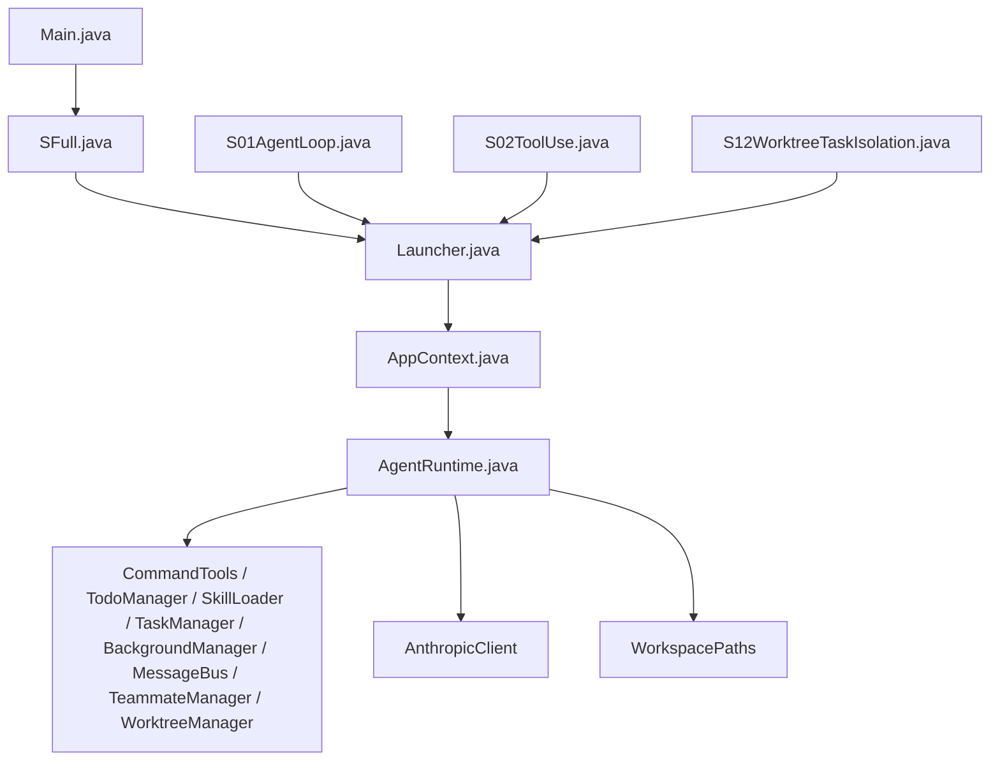
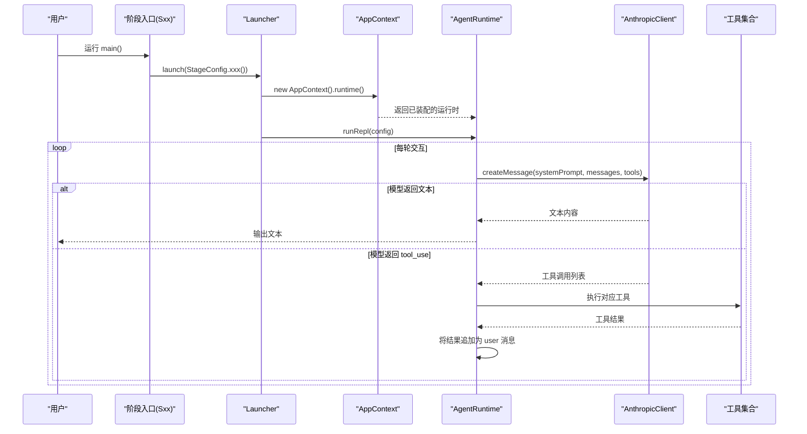
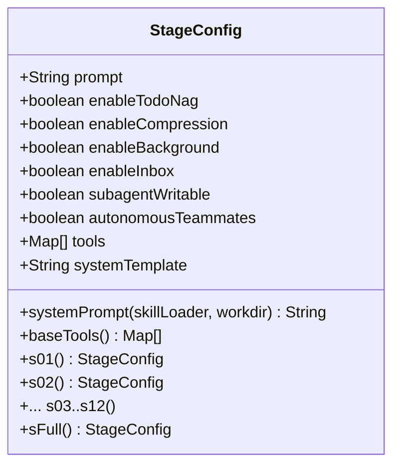
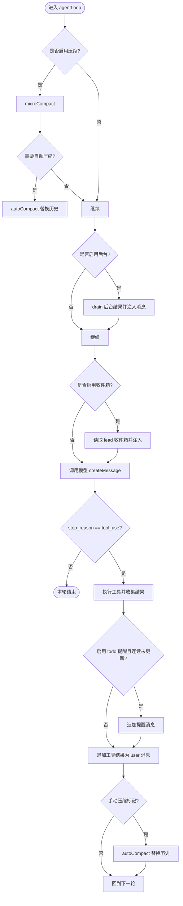
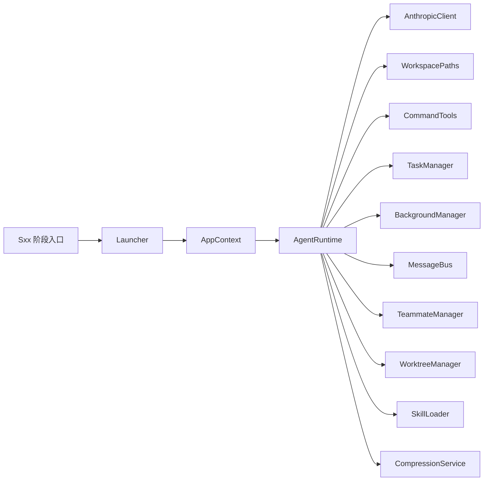

# 自定义学习阶段开发

<cite>
**本文引用的文件**
- [Launcher.java](file://src/main/java/com/learnclaudecode/agents/Launcher.java)
- [StageConfig.java](file://src/main/java/com/learnclaudecode/agents/StageConfig.java)
- [AppContext.java](file://src/main/java/com/learnclaudecode/agents/AppContext.java)
- [AgentRuntime.java](file://src/main/java/com/learnclaudecode/agents/AgentRuntime.java)
- [S01AgentLoop.java](file://src/main/java/com/learnclaudecode/agents/S01AgentLoop.java)
- [S02ToolUse.java](file://src/main/java/com/learnclaudecode/agents/S02ToolUse.java)
- [S12WorktreeTaskIsolation.java](file://src/main/java/com/learnclaudecode/agents/S12WorktreeTaskIsolation.java)
- [SFull.java](file://src/main/java/com/learnclaudecode/agents/SFull.java)
- [Main.java](file://src/main/java/com/learnclaudecode/Main.java)
- [SkillLoader.java](file://src/main/java/com/learnclaudecode/skills/SkillLoader.java)
- [EnvConfig.java](file://src/main/java/com/learnclaudecode/common/EnvConfig.java)
</cite>

## 目录
1. [简介](#简介)
2. [项目结构](#项目结构)
3. [核心组件](#核心组件)
4. [架构总览](#架构总览)
5. [详细组件分析](#详细组件分析)
6. [依赖关系分析](#依赖关系分析)
7. [性能与可扩展性](#性能与可扩展性)
8. [故障排查指南](#故障排查指南)
9. [结论](#结论)
10. [附录：从零到一创建新阶段的完整流程](#附录从零到一创建新阶段的完整流程)

## 简介
本指南面向希望在现有 S01-S12 教学阶段基础上扩展或新建“自定义学习阶段”的开发者。你将了解：
- 阶段类的继承结构与职责边界（每个阶段入口类非常薄，仅选择配置并启动）
- StageConfig 的配置方法（系统提示、工具集、能力开关）
- Launcher 的集成方式（统一入口，避免重复初始化）
- 阶段间的依赖关系与状态管理（通过运行时装配和消息历史驱动）
- 如何复用现有组件与服务（命令、任务、后台、团队、工作区隔离等）
- 完整的开发流程（从设计、实现到测试验证）
- 最佳实践与常见问题解决方案

## 项目结构
本项目采用“阶段即配置”的设计：每个 Sxx 阶段是一个独立的入口类，内部只负责选择对应的 StageConfig，并通过统一的 Launcher 启动 Agent 运行时。AppContext 集中装配共享服务，AgentRuntime 负责统一的交互循环与工具调度。

**图表来源**
- [Main.java:1-15](file://src/main/java/com/learnclaudecode/Main.java#L1-L15)
- [SFull.java:1-13](file://src/main/java/com/learnclaudecode/agents/SFull.java#L1-L13)
- [S01AgentLoop.java:1-12](file://src/main/java/com/learnclaudecode/agents/S01AgentLoop.java#L1-L12)
- [S02ToolUse.java:1-13](file://src/main/java/com/learnclaudecode/agents/S02ToolUse.java#L1-L13)
- [S12WorktreeTaskIsolation.java:1-13](file://src/main/java/com/learnclaudecode/agents/S12WorktreeTaskIsolation.java#L1-L13)
- [Launcher.java:1-28](file://src/main/java/com/learnclaudecode/agents/Launcher.java#L1-L28)
- [AppContext.java:1-70](file://src/main/java/com/learnclaudecode/agents/AppContext.java#L1-L70)
- [AgentRuntime.java:1-351](file://src/main/java/com/learnclaudecode/agents/AgentRuntime.java#L1-L351)

**章节来源**
- [Main.java:1-15](file://src/main/java/com/learnclaudecode/Main.java#L1-L15)
- [Launcher.java:1-28](file://src/main/java/com/learnclaudecode/agents/Launcher.java#L1-L28)
- [AppContext.java:1-70](file://src/main/java/com/learnclaudecode/agents/AppContext.java#L1-L70)
- [AgentRuntime.java:1-351](file://src/main/java/com/learnclaudecode/agents/AgentRuntime.java#L1-L351)

## 核心组件
- 阶段入口类（如 S01AgentLoop、S02ToolUse、S12WorktreeTaskIsolation、SFull）：极薄，仅调用 Launcher.launch(StageConfig.xxx())
- Launcher：统一启动器，创建应用上下文并运行 REPL
- StageConfig：阶段配置记录，定义 prompt、工具集、能力开关（Todo、压缩、后台、收件箱、子代理可写、自治队友、worktree）
- AppContext：装配所有共享服务（环境、路径、命令、任务、后台、团队、工作区隔离、技能加载、压缩服务等），并返回 AgentRuntime
- AgentRuntime：统一执行循环，处理用户输入、模型调用、工具调度、消息历史、自动/手动压缩、后台结果注入、团队收件箱轮询等
- SkillLoader：扫描 skills 目录下的 SKILL.md，提供技能描述与内容
- EnvConfig：读取环境变量（模型 ID、API Key、Base URL、工作目录）

**章节来源**
- [S01AgentLoop.java:1-12](file://src/main/java/com/learnclaudecode/agents/S01AgentLoop.java#L1-L12)
- [S02ToolUse.java:1-13](file://src/main/java/com/learnclaudecode/agents/S02ToolUse.java#L1-L13)
- [S12WorktreeTaskIsolation.java:1-13](file://src/main/java/com/learnclaudecode/agents/S12WorktreeTaskIsolation.java#L1-L13)
- [SFull.java:1-13](file://src/main/java/com/learnclaudecode/agents/SFull.java#L1-L13)
- [Launcher.java:1-28](file://src/main/java/com/learnclaudecode/agents/Launcher.java#L1-L28)
- [StageConfig.java:1-301](file://src/main/java/com/learnclaudecode/agents/StageConfig.java#L1-L301)
- [AppContext.java:1-70](file://src/main/java/com/learnclaudecode/agents/AppContext.java#L1-L70)
- [AgentRuntime.java:1-351](file://src/main/java/com/learnclaudecode/agents/AgentRuntime.java#L1-L351)
- [SkillLoader.java:1-106](file://src/main/java/com/learnclaudecode/skills/SkillLoader.java#L1-L106)
- [EnvConfig.java:1-96](file://src/main/java/com/learnclaudecode/common/EnvConfig.java#L1-L96)

## 架构总览
下图展示了从入口到运行时的调用链，以及各阶段如何通过 StageConfig 控制能力开关。

**图表来源**
- [Launcher.java:18-26](file://src/main/java/com/learnclaudecode/agents/Launcher.java#L18-L26)
- [AppContext.java:35-68](file://src/main/java/com/learnclaudecode/agents/AppContext.java#L35-L68)
- [AgentRuntime.java:97-123](file://src/main/java/com/learnclaudecode/agents/AgentRuntime.java#L97-L123)
- [AgentRuntime.java:131-261](file://src/main/java/com/learnclaudecode/agents/AgentRuntime.java#L131-L261)

## 详细组件分析

### StageConfig：阶段配置与能力编排
- 作用：定义当前阶段的 system prompt、工具集、能力开关（enableTodoNag、enableCompression、enableBackground、enableInbox、subagentWritable、autonomousTeammates）
- 关键方法：
  - systemPrompt(skillLoader, workdir)：动态替换占位符（WORKDIR、SKILLS）生成最终 system prompt
  - baseTools()：基础工具集合（bash、read_file、write_file、edit_file）
  - s01()..s12()、sFull()：预置的阶段配置构建器，体现能力逐步开放
  - tool(name, description, schema)：构造符合 messages API 的工具定义
  - dedupe(tools)：合并多阶段工具时按名字去重

**图表来源**
- [StageConfig.java:26-36](file://src/main/java/com/learnclaudecode/agents/StageConfig.java#L26-L36)
- [StageConfig.java:44-49](file://src/main/java/com/learnclaudecode/agents/StageConfig.java#L44-L49)
- [StageConfig.java:56-69](file://src/main/java/com/learnclaudecode/agents/StageConfig.java#L56-L69)
- [StageConfig.java:77-267](file://src/main/java/com/learnclaudecode/agents/StageConfig.java#L77-L267)

**章节来源**
- [StageConfig.java:1-301](file://src/main/java/com/learnclaudecode/agents/StageConfig.java#L1-L301)

### Launcher：统一启动器
- 作用：禁止外部实例化，提供静态 launch(config)，创建 AppContext 并调用 runtime.runRepl(config)
- 优点：避免每个阶段入口重复初始化；统一生命周期管理

**章节来源**
- [Launcher.java:1-28](file://src/main/java/com/learnclaudecode/agents/Launcher.java#L1-L28)

### AppContext：装配器
- 作用：集中创建共享服务（环境、路径、命令、任务、后台、团队、工作区隔离、技能加载、压缩服务等），并组装 AgentRuntime
- 关键点：按“基础能力 -> 扩展机制 -> 运行时”的顺序装配，便于理解分层结构

**章节来源**
- [AppContext.java:1-70](file://src/main/java/com/learnclaudecode/agents/AppContext.java#L1-L70)

### AgentRuntime：主循环与工具调度
- 作用：实现 Agent 闭环（用户输入 -> 调模型 -> 工具执行 -> 反馈结果 -> 继续循环）
- 关键逻辑：
  - runRepl(config)：REPL 交互循环，支持退出指令
  - agentLoop(messages, config)：单轮任务主循环，包含自动/手动压缩、后台结果注入、团队收件箱轮询、工具调度、消息历史更新
  - runSubagent(prompt, writable)：子代理独立上下文执行，限制工具集（可选只读）
  - 工具映射：switch(toolName) 将模型意图映射到本地 Java 实现

**图表来源**
- [AgentRuntime.java:131-261](file://src/main/java/com/learnclaudecode/agents/AgentRuntime.java#L131-L261)

**章节来源**
- [AgentRuntime.java:1-351](file://src/main/java/com/learnclaudecode/agents/AgentRuntime.java#L1-L351)

### 阶段入口类与集成方式
- 每个阶段入口类（S01、S02、...、S12、SFull）仅一行：Launcher.launch(StageConfig.xxx())
- 默认入口 Main.java 指向 SFull，便于以完整能力版本启动

**章节来源**
- [S01AgentLoop.java:1-12](file://src/main/java/com/learnclaudecode/agents/S01AgentLoop.java#L1-L12)
- [S02ToolUse.java:1-13](file://src/main/java/com/learnclaudecode/agents/S02ToolUse.java#L1-L13)
- [S12WorktreeTaskIsolation.java:1-13](file://src/main/java/com/learnclaudecode/agents/S12WorktreeTaskIsolation.java#L1-L13)
- [SFull.java:1-13](file://src/main/java/com/learnclaudecode/agents/SFull.java#L1-L13)
- [Main.java:1-15](file://src/main/java/com/learnclaudecode/Main.java#L1-L15)

### 技能加载与环境配置
- SkillLoader：扫描 skills 目录下的 SKILL.md，解析 frontmatter，提供 getDescriptions() 与 getContent(name)
- EnvConfig：读取 .env 或系统环境变量，提供 MODEL_ID、ANTHROPIC_API_KEY、ANTHROPIC_BASE_URL、工作目录

**章节来源**
- [SkillLoader.java:1-106](file://src/main/java/com/learnclaudecode/skills/SkillLoader.java#L1-L106)
- [EnvConfig.java:1-96](file://src/main/java/com/learnclaudecode/common/EnvConfig.java#L1-L96)

## 依赖关系分析
- 阶段入口类依赖 Launcher
- Launcher 依赖 AppContext 与 AgentRuntime
- AppContext 依赖多个服务（命令、任务、后台、团队、工作区隔离、技能加载、压缩等）
- AgentRuntime 依赖 AnthropicClient、WorkspacePaths、各管理器
- StageConfig 依赖 SkillLoader（用于 systemPrompt 动态展开）

**图表来源**
- [AppContext.java:35-68](file://src/main/java/com/learnclaudecode/agents/AppContext.java#L35-L68)
- [AgentRuntime.java:41-90](file://src/main/java/com/learnclaudecode/agents/AgentRuntime.java#L41-L90)

**章节来源**
- [AppContext.java:1-70](file://src/main/java/com/learnclaudecode/agents/AppContext.java#L1-L70)
- [AgentRuntime.java:1-351](file://src/main/java/com/learnclaudecode/agents/AgentRuntime.java#L1-L351)

## 性能与可扩展性
- 上下文压缩：支持 microCompact 与 autoCompact，避免对话过长导致性能下降
- 工具去重：StageConfig.dedupe 保证合并多阶段工具时无冲突
- 后台任务：非阻塞执行，结果异步注入主上下文，提升整体吞吐
- 可扩展点：
  - 新增工具：在 StageConfig.baseTools 或阶段配置中添加工具定义，并在 AgentRuntime.tool 映射中增加 case
  - 新增能力开关：在 StageConfig 中添加布尔字段，并在 AgentRuntime.agentLoop 中增加条件分支
  - 新增服务：在 AppContext 中装配，并在 AgentRuntime 构造函数中注入

[本节为通用指导，不直接分析具体文件]

## 故障排查指南
- 环境变量缺失：EnvConfig.require 会抛出异常，检查 MODEL_ID、ANTHROPIC_API_KEY、ANTHROPIC_BASE_URL
- 未知工具：AgentRuntime 默认返回 "Unknown tool: ..."，检查 StageConfig.tools 与 AgentRuntime 工具映射是否一致
- 工具参数类型不一致：AgentRuntime 提供 numberOrNull、numberOrDefault、stringOrNull 容错解析，若仍失败，检查模型输出格式
- 压缩触发异常：确认 CompressionService 阈值设置合理，必要时关闭 enableCompression 调试
- 后台任务无结果：检查 BackgroundManager 是否启用，确认任务超时与 drain 逻辑

**章节来源**
- [EnvConfig.java:22-39](file://src/main/java/com/learnclaudecode/common/EnvConfig.java#L22-L39)
- [AgentRuntime.java:189-234](file://src/main/java/com/learnclaudecode/agents/AgentRuntime.java#L189-L234)
- [AgentRuntime.java:318-349](file://src/main/java/com/learnclaudecode/agents/AgentRuntime.java#L318-L349)

## 结论
本项目通过“阶段即配置”的方式，将复杂 Agent 能力解耦为可组合的 StageConfig，并由统一的 Launcher 与 AgentRuntime 驱动。开发者只需关注 StageConfig 的能力编排与工具定义，即可快速创建新的学习阶段。同时，AppContext 提供了清晰的装配顺序，便于理解与维护。

[本节为总结，不直接分析具体文件]

## 附录：从零到一创建新阶段的完整流程

### 1. 设计阶段目标
- 明确该阶段要演示的核心能力（例如：新增一个“代码审查”工具）
- 决定是否需要开启 Todo、压缩、后台、收件箱、子代理可写、自治队友等开关

### 2. 创建阶段入口类
- 在 agents 包下新建 SXXYourStage.java
- 实现 main(args) 调用 Launcher.launch(StageConfig.yourStage())

**章节来源**
- [S01AgentLoop.java:1-12](file://src/main/java/com/learnclaudecode/agents/S01AgentLoop.java#L1-L12)
- [S02ToolUse.java:1-13](file://src/main/java/com/learnclaudecode/agents/S02ToolUse.java#L1-L13)

### 3. 在 StageConfig 中定义阶段配置
- 在 StageConfig 中添加 yourStage() 静态工厂方法
- 设置 prompt、tools、systemTemplate 及能力开关
- 如需复用基础工具，使用 baseTools()；如需合并多阶段工具，使用 dedupe()

**章节来源**
- [StageConfig.java:56-69](file://src/main/java/com/learnclaudecode/agents/StageConfig.java#L56-L69)
- [StageConfig.java:277-299](file://src/main/java/com/learnclaudecode/agents/StageConfig.java#L277-L299)

### 4. 实现工具与业务逻辑
- 如果新增工具，需在 AgentRuntime 的工具映射 switch 中添加对应 case
- 工具实现可复用 CommandTools、TaskManager、BackgroundManager、MessageBus、TeammateManager、WorktreeManager 等服务

**章节来源**
- [AgentRuntime.java:189-234](file://src/main/java/com/learnclaudecode/agents/AgentRuntime.java#L189-L234)
- [AppContext.java:35-68](file://src/main/java/com/learnclaudecode/agents/AppContext.java#L35-L68)

### 5. 系统集成与装配
- 如需新增服务，在 AppContext 中装配并注入 AgentRuntime
- 确保 StageConfig.systemPrompt 能正确展开 ${WORKDIR} 与 ${SKILLS}

**章节来源**
- [AppContext.java:35-68](file://src/main/java/com/learnclaudecode/agents/AppContext.java#L35-L68)
- [StageConfig.java:44-49](file://src/main/java/com/learnclaudecode/agents/StageConfig.java#L44-L49)

### 6. 测试与验证
- 运行你的阶段入口类，观察 REPL 交互
- 验证工具调用是否正确、消息历史是否更新、能力开关是否生效
- 使用 SFull 对比能力差异，定位问题

**章节来源**
- [SFull.java:1-13](file://src/main/java/com/learnclaudecode/agents/SFull.java#L1-L13)
- [AgentRuntime.java:97-123](file://src/main/java/com/learnclaudecode/agents/AgentRuntime.java#L97-L123)

### 7. 最佳实践
- 保持阶段入口类极简，仅负责选择配置与启动
- 优先复用现有工具与服务，避免重复造轮子
- 使用 StageConfig.dedupe 合并工具时注意命名冲突
- 对模型输出做容错解析（numberOrNull、stringOrDefault）
- 合理使用压缩与后台任务，提升性能与用户体验

[本节为通用指导，不直接分析具体文件]