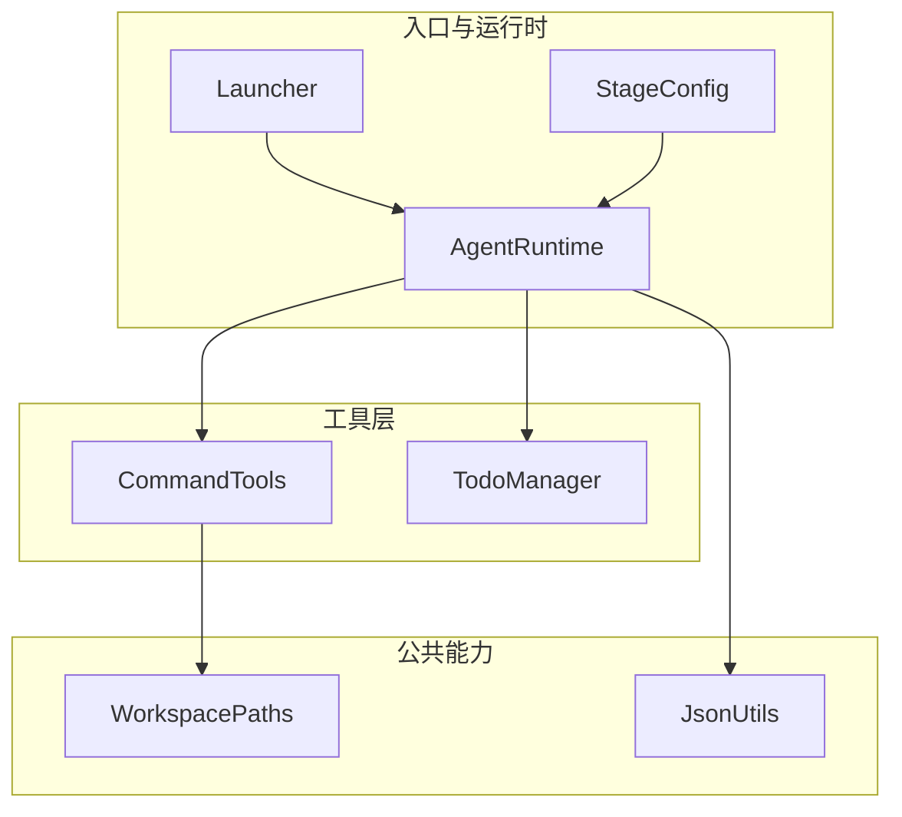
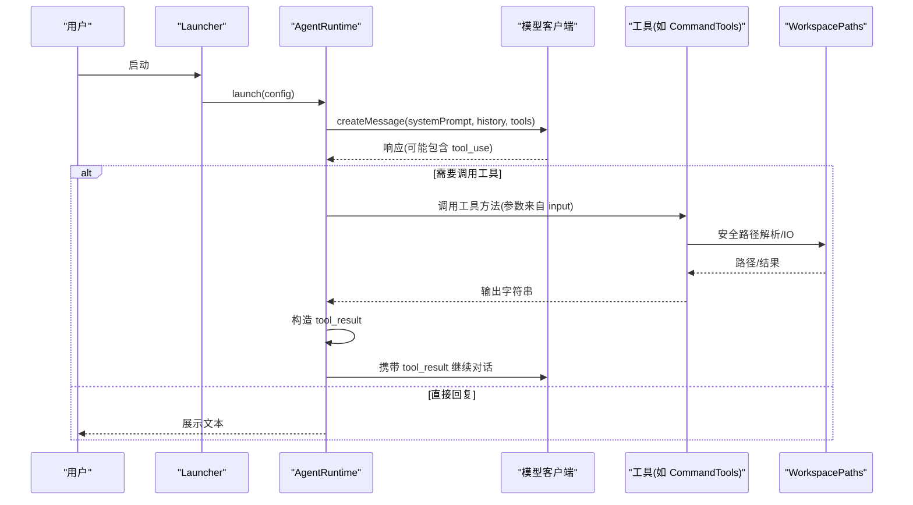
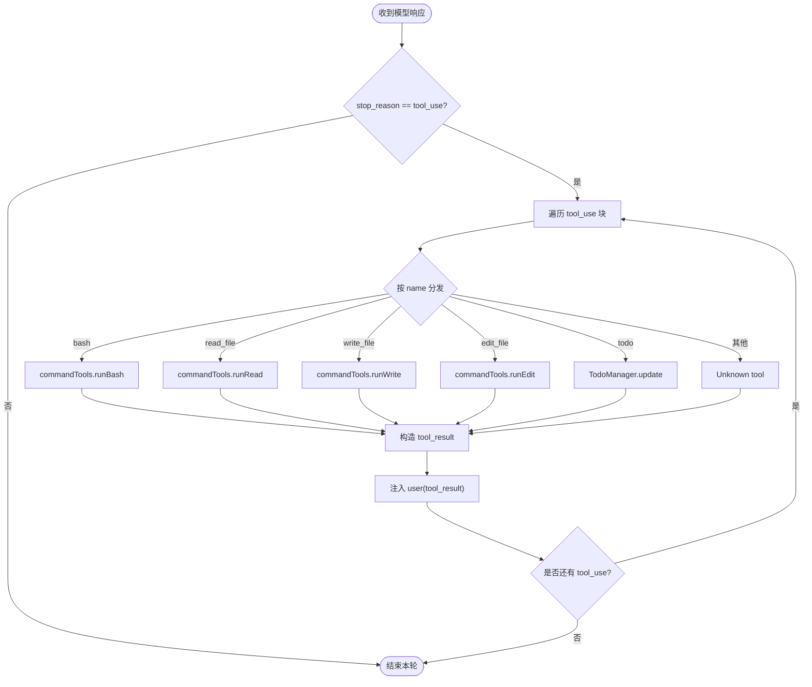
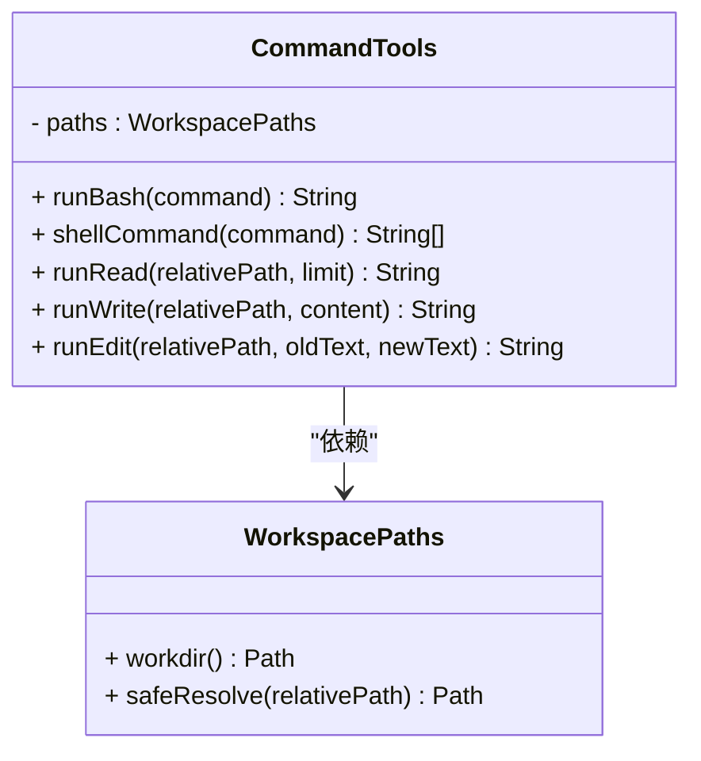
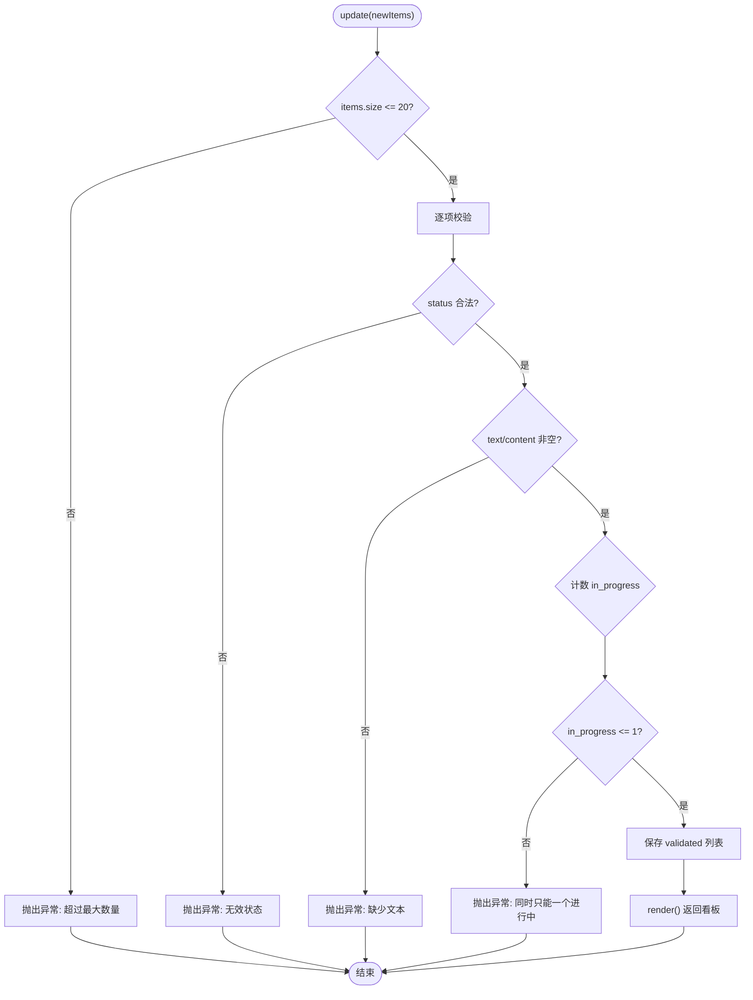
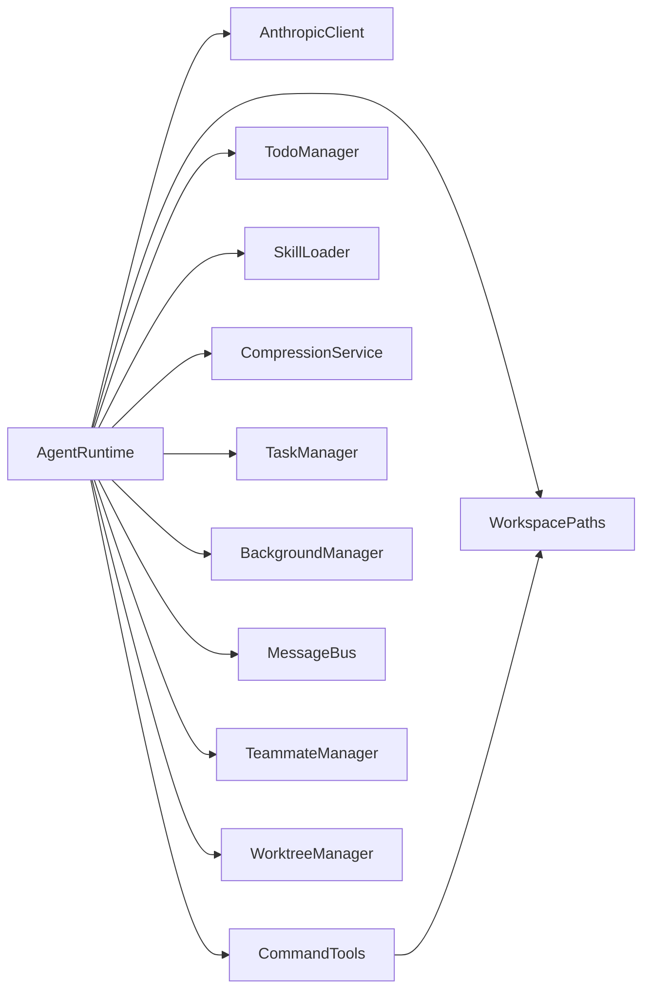

# 自定义工具开发

<cite>
**本文引用的文件**
- [CommandTools.java](file://src/main/java/com/learnclaudecode/tools/CommandTools.java)
- [TodoManager.java](file://src/main/java/com/learnclaudecode/tools/TodoManager.java)
- [ToolSpec.java](file://src/main/java/com/learnclaudecode/model/ToolSpec.java)
- [StageConfig.java](file://src/main/java/com/learnclaudecode/agents/StageConfig.java)
- [AgentRuntime.java](file://src/main/java/com/learnclaudecode/agents/AgentRuntime.java)
- [WorkspacePaths.java](file://src/main/java/com/learnclaudecode/common/WorkspacePaths.java)
- [JsonUtils.java](file://src/main/java/com/learnclaudecode/common/JsonUtils.java)
- [Launcher.java](file://src/main/java/com/learnclaudecode/agents/Launcher.java)
- [S02ToolUse.java](file://src/main/java/com/learnclaudecode/agents/S02ToolUse.java)
</cite>

## 目录
1. [简介](#简介)
2. [项目结构](#项目结构)
3. [核心组件](#核心组件)
4. [架构总览](#架构总览)
5. [详细组件分析](#详细组件分析)
6. [依赖关系分析](#依赖关系分析)
7. [性能与限制](#性能与限制)
8. [故障排查指南](#故障排查指南)
9. [结论](#结论)
10. [附录：常见工具实现示例](#附录：常见工具实现示例)

## 简介
本指南面向希望在现有 CommandTools 模式基础上扩展“自定义工具”的开发者。内容覆盖：
- 工具接口定义与参数校验
- 错误处理机制
- ToolSpec 模型的使用方式
- 在 Agent 运行时中注册新工具
- 工具调用的完整生命周期
- 常见工具类型（文件操作、API 调用、数据处理）的实现思路
- 测试方法与调试技巧

## 项目结构
本项目采用分层组织：
- agents：Agent 运行时、阶段配置、启动器
- tools：具体工具实现（命令执行、文件读写、任务管理等）
- model：数据模型（如 ToolSpec）
- common：通用能力（工作区路径、JSON 序列化等）
- skills/tasks/team/background/context：协作、任务、后台、上下文压缩等扩展能力

图表来源
- [Launcher.java:18-26](file://src/main/java/com/learnclaudecode/agents/Launcher.java#L18-L26)
- [AgentRuntime.java:40-90](file://src/main/java/com/learnclaudecode/agents/AgentRuntime.java#L40-L90)
- [StageConfig.java:56-70](file://src/main/java/com/learnclaudecode/agents/StageConfig.java#L56-L70)
- [CommandTools.java:13-28](file://src/main/java/com/learnclaudecode/tools/CommandTools.java#L13-L28)
- [WorkspacePaths.java:11-23](file://src/main/java/com/learnclaudecode/common/WorkspacePaths.java#L11-L23)
- [JsonUtils.java:12-15](file://src/main/java/com/learnclaudecode/common/JsonUtils.java#L12-L15)

章节来源
- [Launcher.java:1-28](file://src/main/java/com/learnclaudecode/agents/Launcher.java#L1-L28)
- [AgentRuntime.java:1-90](file://src/main/java/com/learnclaudecode/agents/AgentRuntime.java#L1-L90)
- [StageConfig.java:1-70](file://src/main/java/com/learnclaudecode/agents/StageConfig.java#L1-L70)

## 核心组件
- StageConfig：声明当前阶段可用的工具集合（name/description/input_schema），并生成 system prompt。
- AgentRuntime：统一调度，接收模型返回的 tool_use，分发到对应工具实现，收集结果回写消息历史。
- CommandTools：基础文件与命令工具（bash、read_file、write_file、edit_file）。
- TodoManager：任务清单管理，提供更新、渲染、状态检查。
- WorkspacePaths：安全路径解析与工作区目录访问。
- JsonUtils：统一的 JSON 序列化/反序列化。
- ToolSpec：对齐 messages API 的工具描述记录（name/description/input_schema）。

章节来源
- [StageConfig.java:56-70](file://src/main/java/com/learnclaudecode/agents/StageConfig.java#L56-L70)
- [AgentRuntime.java:131-261](file://src/main/java/com/learnclaudecode/agents/AgentRuntime.java#L131-L261)
- [CommandTools.java:30-145](file://src/main/java/com/learnclaudecode/tools/CommandTools.java#L30-L145)
- [TodoManager.java:15-91](file://src/main/java/com/learnclaudecode/tools/TodoManager.java#L15-L91)
- [WorkspacePaths.java:36-49](file://src/main/java/com/learnclaudecode/common/WorkspacePaths.java#L36-L49)
- [ToolSpec.java:5-9](file://src/main/java/com/learnclaudecode/model/ToolSpec.java#L5-L9)

## 架构总览
Agent 运行时的工具调用闭环如下：
- 用户输入进入 runRepl，追加到消息历史
- agentLoop 调用模型，若 stop_reason 为 tool_use，则解析工具名与参数
- 通过 switch 将工具名映射到本地方法（如 bash/read_file/write_file/edit_file/todo 等）
- 工具执行完成后，将 tool_result 作为 user 消息注入历史，继续下一轮
- 支持子代理、后台任务、团队消息、任务系统、worktree 等扩展工具

图表来源
- [Launcher.java:18-26](file://src/main/java/com/learnclaudecode/agents/Launcher.java#L18-L26)
- [AgentRuntime.java:97-123](file://src/main/java/com/learnclaudecode/agents/AgentRuntime.java#L97-L123)
- [AgentRuntime.java:131-261](file://src/main/java/com/learnclaudecode/agents/AgentRuntime.java#L131-L261)
- [CommandTools.java:30-145](file://src/main/java/com/learnclaudecode/tools/CommandTools.java#L30-L145)
- [WorkspacePaths.java:36-49](file://src/main/java/com/learnclaudecode/common/WorkspacePaths.java#L36-L49)

## 详细组件分析

### 工具定义与注册（StageConfig + ToolSpec）
- 工具定义由 StageConfig 集中管理，每个工具包含 name、description、input_schema。
- baseTools 提供最小可用工具集（bash、read_file、write_file、edit_file）。
- 各阶段通过组合 baseTools 与其他工具构建不同能力视图。
- ToolSpec 是轻量记录，用于表达工具元信息；实际工具列表以 Map 形式传递至模型。

章节来源
- [StageConfig.java:56-70](file://src/main/java/com/learnclaudecode/agents/StageConfig.java#L56-L70)
- [StageConfig.java:269-284](file://src/main/java/com/learnclaudecode/agents/StageConfig.java#L269-L284)
- [ToolSpec.java:5-9](file://src/main/java/com/learnclaudecode/model/ToolSpec.java#L5-L9)

### 工具分发与执行（AgentRuntime）
- agentLoop 中根据模型返回的 tool_use 块，解析 tool_name 与 input。
- 使用 switch 将工具名映射到具体实现（如 bash -> commandTools.runBash）。
- 所有工具输出统一封装为 tool_result，再注入消息历史。
- 支持多工具并行处理（遍历 response.content() 中的 tool_use 块）。

图表来源
- [AgentRuntime.java:131-261](file://src/main/java/com/learnclaudecode/agents/AgentRuntime.java#L131-L261)

章节来源
- [AgentRuntime.java:131-261](file://src/main/java/com/learnclaudecode/agents/AgentRuntime.java#L131-L261)

### 文件与命令工具（CommandTools）
- runBash：黑名单拦截危险命令，ProcessBuilder 执行 shell，超时保护，输出截断。
- shellCommand：跨平台命令包装（Windows 用 powershell，Linux/macOS 用 bash -lc）。
- runRead：读取文件，支持 limit 控制行数，避免大文件占用上下文。
- runWrite：写入文件，自动创建父目录。
- runEdit：精确替换旧文本为新文本，失败时提示未找到原文本。

图表来源
- [CommandTools.java:13-28](file://src/main/java/com/learnclaudecode/tools/CommandTools.java#L13-L28)
- [CommandTools.java:30-145](file://src/main/java/com/learnclaudecode/tools/CommandTools.java#L30-L145)
- [WorkspacePaths.java:11-23](file://src/main/java/com/learnclaudecode/common/WorkspacePaths.java#L11-L23)
- [WorkspacePaths.java:36-49](file://src/main/java/com/learnclaudecode/common/WorkspacePaths.java#L36-L49)

章节来源
- [CommandTools.java:30-145](file://src/main/java/com/learnclaudecode/tools/CommandTools.java#L30-L145)
- [WorkspacePaths.java:36-49](file://src/main/java/com/learnclaudecode/common/WorkspacePaths.java#L36-L49)

### 任务清单工具（TodoManager）
- update：校验 items 数量、字段合法性、状态枚举、in_progress 唯一性，渲染看板。
- hasOpenItems：判断是否存在未完成项。
- render：将内部状态渲染为人类可读的文本看板。

图表来源
- [TodoManager.java:15-55](file://src/main/java/com/learnclaudecode/tools/TodoManager.java#L15-L55)
- [TodoManager.java:71-91](file://src/main/java/com/learnclaudecode/tools/TodoManager.java#L71-L91)

章节来源
- [TodoManager.java:15-91](file://src/main/java/com/learnclaudecode/tools/TodoManager.java#L15-L91)

### 启动与阶段配置（Launcher + S02ToolUse + StageConfig）
- Launcher 统一入口，创建 AppContext 并调用 runtime().runRepl(config)。
- S02ToolUse 仅负责选择 s02 配置并启动。
- StageConfig.s02 启用 baseTools（bash、read_file、write_file、edit_file）。

章节来源
- [Launcher.java:18-26](file://src/main/java/com/learnclaudecode/agents/Launcher.java#L18-L26)
- [S02ToolUse.java:9-11](file://src/main/java/com/learnclaudecode/agents/S02ToolUse.java#L9-L11)
- [StageConfig.java:84-94](file://src/main/java/com/learnclaudecode/agents/StageConfig.java#L84-L94)

## 依赖关系分析
- AgentRuntime 依赖 AnthropicClient、WorkspacePaths、CommandTools、TodoManager、SkillLoader、CompressionService、TaskManager、BackgroundManager、MessageBus、TeammateManager、WorktreeManager。
- CommandTools 依赖 WorkspacePaths 进行安全路径解析。
- StageConfig 提供工具定义，被 AgentRuntime 消费。
- JsonUtils 被多处用于 JSON 序列化/格式化。

图表来源
- [AgentRuntime.java:40-90](file://src/main/java/com/learnclaudecode/agents/AgentRuntime.java#L40-L90)
- [CommandTools.java:13-28](file://src/main/java/com/learnclaudecode/tools/CommandTools.java#L13-L28)

章节来源
- [AgentRuntime.java:40-90](file://src/main/java/com/learnclaudecode/agents/AgentRuntime.java#L40-L90)

## 性能与限制
- 命令执行超时保护：默认 120 秒，防止长时间阻塞。
- 输出截断：stdout/stderr 合并后最多保留一定长度，避免上下文爆炸。
- 文件读取限制：read_file 支持 limit，减少大文件对上下文的压力。
- 路径安全：safeResolve 防止路径逃逸出工作区。
- 工具去重：多阶段合并时按名称去重，避免重复定义。

章节来源
- [CommandTools.java:36-65](file://src/main/java/com/learnclaudecode/tools/CommandTools.java#L36-L65)
- [CommandTools.java:87-100](file://src/main/java/com/learnclaudecode/tools/CommandTools.java#L87-L100)
- [WorkspacePaths.java:36-49](file://src/main/java/com/learnclaudecode/common/WorkspacePaths.java#L36-L49)
- [StageConfig.java:292-299](file://src/main/java/com/learnclaudecode/agents/StageConfig.java#L292-L299)

## 故障排查指南
- 命令执行失败：检查黑名单拦截、进程超时、IO 异常；查看 stderr 输出。
- 文件读写失败：确认路径在工作区内、权限正确；注意父目录自动创建。
- Todo 更新失败：检查 items 数量、状态枚举、文本是否为空、in_progress 唯一性。
- 工具未识别：确认 StageConfig 已注册该工具名，且 AgentRuntime 的 switch 分支已添加映射。
- JSON 序列化问题：使用 JsonUtils 统一序列化，避免时间类型格式不一致。

章节来源
- [CommandTools.java:36-65](file://src/main/java/com/learnclaudecode/tools/CommandTools.java#L36-L65)
- [CommandTools.java:110-121](file://src/main/java/com/learnclaudecode/tools/CommandTools.java#L110-L121)
- [TodoManager.java:21-55](file://src/main/java/com/learnclaudecode/tools/TodoManager.java#L21-L55)
- [AgentRuntime.java:189-234](file://src/main/java/com/learnclaudecode/agents/AgentRuntime.java#L189-L234)
- [JsonUtils.java:29-49](file://src/main/java/com/learnclaudecode/common/JsonUtils.java#L29-L49)

## 结论
本项目提供了清晰的工具抽象与运行时调度机制。通过 StageConfig 声明工具、AgentRuntime 分发执行、CommandTools/TodoManager 等实现具体能力，形成了可扩展的工具生态。新增工具只需遵循以下流程：
- 在 StageConfig 中声明工具定义（name/description/input_schema）
- 在 AgentRuntime 的 switch 中添加工具名到实现的映射
- 在工具类中实现业务逻辑，做好参数校验与错误处理
- 通过 WorkspacePaths 保证路径安全，利用 JsonUtils 处理数据序列化

## 附录：常见工具实现示例

### 新增工具步骤（基于 CommandTools 模式）
- 定义工具：在 StageConfig.baseTools 或相应阶段方法中添加 tool(name, description, schema)。
- 实现工具：新建工具类或扩展现有工具类，实现核心方法，做好参数校验与异常处理。
- 注册工具：在 AgentRuntime.agentLoop 的 switch 中添加 case 分支，将工具名映射到实现方法。
- 验证工具：通过 S02ToolUse 或对应阶段的 main 启动，观察控制台输出与工具行为。

章节来源
- [StageConfig.java:56-70](file://src/main/java/com/learnclaudecode/agents/StageConfig.java#L56-L70)
- [AgentRuntime.java:189-234](file://src/main/java/com/learnclaudecode/agents/AgentRuntime.java#L189-L234)
- [S02ToolUse.java:9-11](file://src/main/java/com/learnclaudecode/agents/S02ToolUse.java#L9-L11)

### 文件操作工具（参考 CommandTools）
- 读取文件：使用 runRead，支持 limit 控制行数，避免大文件影响上下文。
- 写入文件：使用 runWrite，自动创建父目录，返回写入字节数。
- 编辑文件：使用 runEdit，精确替换旧文本，失败时提示未找到原文本。

章节来源
- [CommandTools.java:80-145](file://src/main/java/com/learnclaudecode/tools/CommandTools.java#L80-L145)

### API 调用工具（建议实现思路）
- 定义工具：在 StageConfig 中添加 http_get/http_post 等工具定义。
- 实现工具：封装 HTTP 客户端，设置超时、重试、错误码处理，返回结构化结果。
- 注册工具：在 AgentRuntime 的 switch 中添加 case 分支，调用实现方法。
- 安全考虑：限制目标域名、白名单校验、敏感头过滤。

[本节为概念性指导，不直接分析具体文件]

### 数据处理工具（建议实现思路）
- 定义工具：在 StageConfig 中添加 transform/filter/sort 等工具定义。
- 实现工具：基于 JsonUtils 进行 JSON 解析与转换，提供可配置的规则。
- 注册工具：在 AgentRuntime 的 switch 中添加 case 分支，调用实现方法。
- 性能考虑：流式处理大对象，避免一次性加载全部数据。

[本节为概念性指导，不直接分析具体文件]

### 工具测试方法
- 单元测试：针对工具类的核心方法进行断言，覆盖正常与异常路径。
- 集成测试：通过 Launcher 启动特定阶段，模拟用户输入触发工具调用，验证输出。
- 边界测试：超大文件、超长命令、非法路径、并发调用等场景。
- 日志与调试：关注控制台输出的工具执行摘要，结合 stderr 定位问题。

[本节为通用测试建议，不直接分析具体文件]

### 调试技巧
- 逐步启用工具：从 baseTools 开始，逐步增加工具，便于定位问题。
- 打印中间状态：在 AgentRuntime 的工具分发处打印工具名与输入摘要。
- 限制输出长度：避免大量输出干扰调试，必要时分段查看。
- 使用 WorkspacePaths.safeResolve：确保路径始终在工作区内，避免越权访问。

章节来源
- [AgentRuntime.java:189-234](file://src/main/java/com/learnclaudecode/agents/AgentRuntime.java#L189-L234)
- [WorkspacePaths.java:36-49](file://src/main/java/com/learnclaudecode/common/WorkspacePaths.java#L36-L49)