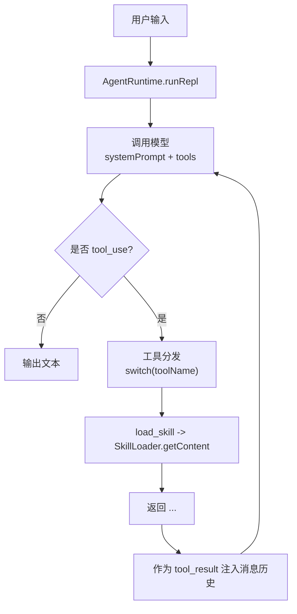
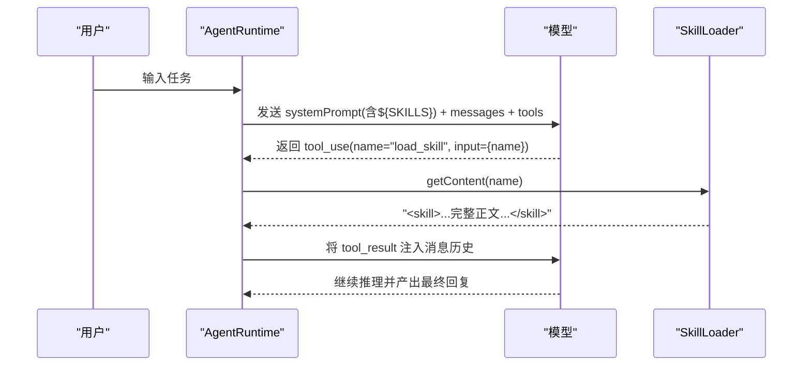
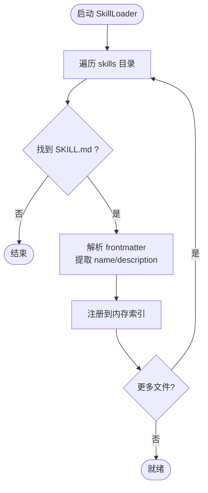
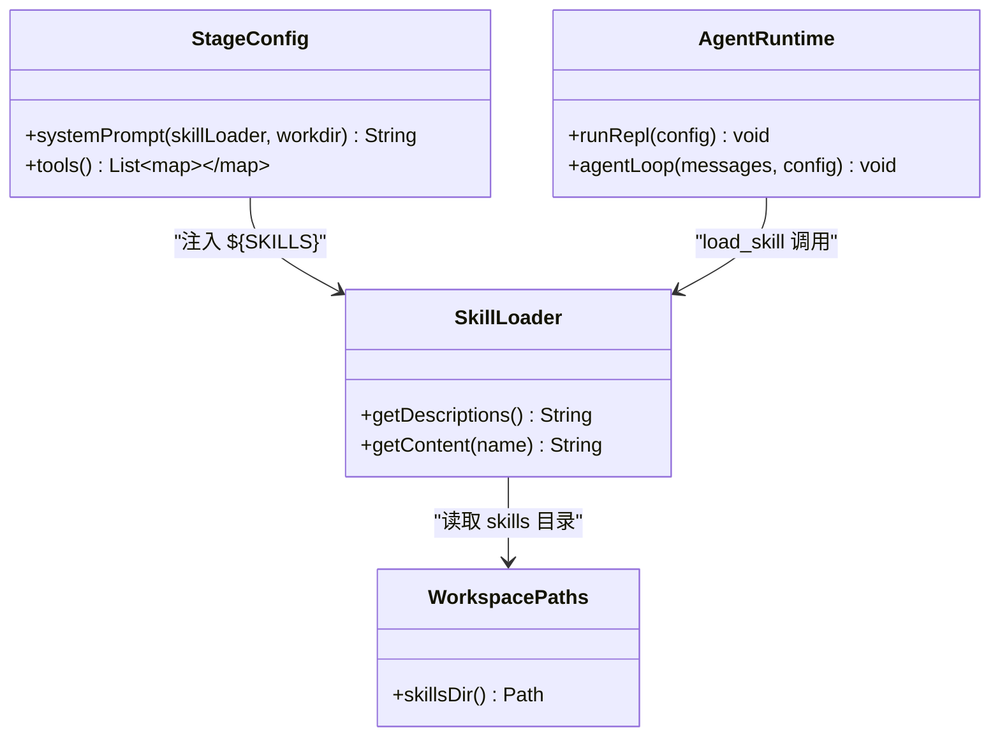

# 技能开发

<cite>
**本文引用的文件**
- [SKILL.md（agent-builder）](file://skills/agent-builder/SKILL.md)
- [SKILL.md（code-review）](file://skills/code-review/SKILL.md)
- [SKILL.md（mcp-builder）](file://skills/mcp-builder/SKILL.md)
- [SKILL.md（pdf）](file://skills/pdf/SKILL.md)
- [SkillLoader.java](file://src/main/java/com/learnclaudecode/skills/SkillLoader.java)
- [StageConfig.java](file://src/main/java/com/learnclaudecode/agents/StageConfig.java)
- [AgentRuntime.java](file://src/main/java/com/learnclaudecode/agents/AgentRuntime.java)
- [AppContext.java](file://src/main/java/com/learnclaudecode/agents/AppContext.java)
- [WorkspacePaths.java](file://src/main/java/com/learnclaudecode/common/WorkspacePaths.java)
- [S05SkillLoading.java](file://src/main/java/com/learnclaudecode/agents/S05SkillLoading.java)
</cite>

## 目录
1. [简介](#简介)
2. [项目结构](#项目结构)
3. [核心组件](#核心组件)
4. [架构总览](#架构总览)
5. [详细组件分析](#详细组件分析)
6. [依赖关系分析](#依赖关系分析)
7. [性能与扩展性](#性能与扩展性)
8. [故障排查指南](#故障排查指南)
9. [结论](#结论)
10. [附录：技能开发示例与最佳实践](#附录：技能开发示例与最佳实践)

## 简介
本指南面向希望基于现有模板创建自定义技能的开发者。仓库提供了四个示例技能（agent-builder、code-review、mcp-builder、pdf），并实现了完整的“技能加载与按需注入”机制。通过 SkillLoader，系统会在启动时扫描 skills 目录下的 SKILL.md 文件，解析 frontmatter 元数据，并在运行时将技能摘要注入 system prompt，在需要时将完整内容以工具结果形式注入对话上下文，从而实现“轻量常驻 + 按需加载”的两层能力体系。

## 项目结构
- 技能定义位于工作区根目录的 skills 子目录下，每个技能一个独立目录，入口为 SKILL.md。
- 运行时由 AgentRuntime 驱动，结合 StageConfig 暴露的工具集，动态装配 system prompt 与工具列表。
- WorkspacePaths 提供安全的工作区路径访问，确保所有文件操作不逃逸出当前工作区。
- AppContext 负责装配共享服务（包括 SkillLoader），并将其实例注入 AgentRuntime。

图表来源
- [AgentRuntime.java:97-260](file://src/main/java/com/learnclaudecode/agents/AgentRuntime.java#L97-L260)
- [SkillLoader.java:45-104](file://src/main/java/com/learnclaudecode/skills/SkillLoader.java#L45-L104)
- [StageConfig.java:44-49](file://src/main/java/com/learnclaudecode/agents/StageConfig.java#L44-L49)

章节来源
- [WorkspacePaths.java:11-125](file://src/main/java/com/learnclaudecode/common/WorkspacePaths.java#L11-L125)
- [AppContext.java:35-59](file://src/main/java/com/learnclaudecode/agents/AppContext.java#L35-L59)

## 核心组件
- 技能定义（SKILL.md）：采用 YAML frontmatter + Markdown 正文。frontmatter 至少包含 name 与 description；description 用于生成可用技能清单。
- 技能加载器（SkillLoader）：扫描 skills 目录，解析 SKILL.md 的 frontmatter，维护已加载技能索引，并提供描述汇总与按名获取完整内容的能力。
- 阶段配置（StageConfig）：定义不同教学阶段的工具集合与 system prompt 模板；s05 引入 load_skill 工具，并将 ${SKILLS} 占位符替换为技能摘要。
- 运行时（AgentRuntime）：统一的消息循环，当模型请求 load_skill 时，调用 SkillLoader 获取技能内容并以 tool_result 注入上下文。
- 应用上下文（AppContext）：装配 SkillLoader 等共享服务，并将其注入 AgentRuntime。

章节来源
- [SkillLoader.java:15-104](file://src/main/java/com/learnclaudecode/skills/SkillLoader.java#L15-L104)
- [StageConfig.java:124-135](file://src/main/java/com/learnclaudecode/agents/StageConfig.java#L124-L135)
- [AgentRuntime.java:168-234](file://src/main/java/com/learnclaudecode/agents/AgentRuntime.java#L168-L234)
- [AppContext.java:44-59](file://src/main/java/com/learnclaudecode/agents/AppContext.java#L44-L59)

## 架构总览
技能系统的两层设计：
- 第一层（常驻）：系统启动时读取所有 SKILL.md 的 frontmatter，生成简短的技能摘要，注入 system prompt。这使模型始终知道“有哪些技能可用”。
- 第二层（按需）：当模型决定使用某个技能时，通过 load_skill 工具触发，SkillLoader 返回该技能的完整正文，并以 tool_result 的方式注入到当前对话上下文中，供模型遵循具体执行步骤。

图表来源
- [StageConfig.java:44-49](file://src/main/java/com/learnclaudecode/agents/StageConfig.java#L44-L49)
- [AgentRuntime.java:168-234](file://src/main/java/com/learnclaudecode/agents/AgentRuntime.java#L168-L234)
- [SkillLoader.java:79-104](file://src/main/java/com/learnclaudecode/skills/SkillLoader.java#L79-L104)

## 详细组件分析

### 技能文件格式与元数据
- 位置与命名：每个技能一个目录，入口文件固定为 SKILL.md。
- Frontmatter：YAML 块，首尾以 --- 包裹。必须包含：
  - name：技能标识，用于 load_skill 调用。
  - description：简要说明，用于生成“可用技能清单”，帮助模型识别何时调用。
- 正文：Markdown 文档，包含技能的目标、步骤、注意事项、示例命令或代码片段等。
- 参考模板：
  - agent-builder：强调能力、知识、上下文的设计原则与渐进复杂度。
  - code-review：提供结构化审查清单与输出格式。
  - mcp-builder：介绍 MCP 概念与快速上手示例。
  - pdf：给出常用 PDF 处理命令与编程方式。

章节来源
- [SKILL.md（agent-builder）:1-130](file://skills/agent-builder/SKILL.md#L1-L130)
- [SKILL.md（code-review）:1-99](file://skills/code-review/SKILL.md#L1-L99)
- [SKILL.md（mcp-builder）:1-49](file://skills/mcp-builder/SKILL.md#L1-L49)
- [SKILL.md（pdf）:1-50](file://skills/pdf/SKILL.md#L1-L50)

### 技能加载机制与执行流程
- 启动扫描：SkillLoader 构造时扫描工作区的 skills 目录，查找所有名为 SKILL.md 的文件。
- 解析 frontmatter：提取 name、description 等键值对；正文保留为 body。
- 注册索引：以 name 为键，存储 meta、body、path。
- 描述汇总：getDescriptions 将所有技能的 name 与 description 拼接成清单，供 system prompt 使用。
- 按需加载：getContent 根据 name 返回带标签的完整正文，便于模型直接遵循。

图表来源
- [SkillLoader.java:21-72](file://src/main/java/com/learnclaudecode/skills/SkillLoader.java#L21-L72)

章节来源
- [SkillLoader.java:21-104](file://src/main/java/com/learnclaudecode/skills/SkillLoader.java#L21-L104)

### 运行时集成与工具映射
- 阶段配置 s05：新增 load_skill 工具，其 schema 仅要求 name 参数；systemTemplate 中包含 ${SKILLS} 占位符。
- 运行时调度：AgentRuntime 收到模型 tool_use 后，根据 toolName 分发；load_skill 会调用 SkillLoader.getContent 并返回结果。
- 上下文注入：工具结果以 user 消息形式追加到历史，下一轮模型即可看到完整技能指令。

图表来源
- [StageConfig.java:44-49](file://src/main/java/com/learnclaudecode/agents/StageConfig.java#L44-L49)
- [AgentRuntime.java:168-234](file://src/main/java/com/learnclaudecode/agents/AgentRuntime.java#L168-L234)
- [SkillLoader.java:21-72](file://src/main/java/com/learnclaudecode/skills/SkillLoader.java#L21-L72)
- [WorkspacePaths.java:116-125](file://src/main/java/com/learnclaudecode/common/WorkspacePaths.java#L116-L125)

章节来源
- [StageConfig.java:124-135](file://src/main/java/com/learnclaudecode/agents/StageConfig.java#L124-L135)
- [AgentRuntime.java:168-234](file://src/main/java/com/learnclaudecode/agents/AgentRuntime.java#L168-L234)

### 启动入口与示例运行
- S05SkillLoading：最小化入口，选择 s05 阶段配置并通过 Launcher 启动统一运行时。
- Launcher：统一入口，创建 AppContext 并调用 runtime().runRepl(config)。
- AppContext：装配 SkillLoader 等服务，并注入 AgentRuntime。

章节来源
- [S05SkillLoading.java:1-13](file://src/main/java/com/learnclaudecode/agents/S05SkillLoading.java#L1-L13)
- [Launcher.java:1-28](file://src/main/java/com/learnclaudecode/agents/Launcher.java#L1-L28)
- [AppContext.java:35-59](file://src/main/java/com/learnclaudecode/agents/AppContext.java#L35-L59)

## 依赖关系分析
- SkillLoader 依赖 WorkspacePaths 定位 skills 目录。
- StageConfig 依赖 SkillLoader 生成 system prompt 中的技能摘要。
- AgentRuntime 依赖 StageConfig 提供的 tools 与 systemPrompt，并在工具分发中调用 SkillLoader。
- AppContext 集中装配这些组件，形成可运行的 Agent 环境。

图表来源
- [WorkspacePaths.java:116-125](file://src/main/java/com/learnclaudecode/common/WorkspacePaths.java#L116-L125)
- [SkillLoader.java:21-72](file://src/main/java/com/learnclaudecode/skills/SkillLoader.java#L21-L72)
- [StageConfig.java:44-49](file://src/main/java/com/learnclaudecode/agents/StageConfig.java#L44-L49)
- [AgentRuntime.java:168-234](file://src/main/java/com/learnclaudecode/agents/AgentRuntime.java#L168-L234)

章节来源
- [AppContext.java:44-59](file://src/main/java/com/learnclaudecode/agents/AppContext.java#L44-L59)

## 性能与扩展性
- 轻量常驻：仅 frontmatter 进入 system prompt，避免大体积正文占用上下文。
- 按需加载：仅在模型需要时注入完整正文，减少不必要的 token 消耗。
- 可扩展性：新增技能只需在 skills 下添加目录与 SKILL.md，无需修改代码。
- 安全性：所有文件访问通过 WorkspacePaths.safeResolve 校验，防止路径逃逸。

[本节为通用指导，不直接分析具体文件]

## 故障排查指南
- 技能未生效
  - 检查 skills 目录是否存在，以及每个技能目录是否包含 SKILL.md。
  - 确认 SKILL.md 的 frontmatter 包含 name 与 description。
  - 查看 getDescriptions 输出是否包含新技能。
- 无法加载指定技能
  - 确认 load_skill 的 name 与 SKILL.md 的 name 一致。
  - 检查 getContent 返回值是否为错误提示（未知技能）。
- 路径安全问题
  - 若出现路径逃逸异常，检查相对路径是否越界工作区。
- 运行时未启用技能工具
  - 确认当前阶段配置包含 load_skill 工具（如 s05 或 s_full）。

章节来源
- [SkillLoader.java:79-104](file://src/main/java/com/learnclaudecode/skills/SkillLoader.java#L79-L104)
- [WorkspacePaths.java:42-49](file://src/main/java/com/learnclaudecode/common/WorkspacePaths.java#L42-L49)
- [StageConfig.java:124-135](file://src/main/java/com/learnclaudecode/agents/StageConfig.java#L124-L135)

## 结论
本项目的技能系统以“约定优于配置”的方式实现：通过统一的 SKILL.md 格式与自动扫描机制，让技能成为可插拔的知识模块。运行时将技能摘要常驻于 system prompt，按需注入完整指令，既保证模型知晓能力边界，又避免上下文膨胀。配合安全的文件访问与清晰的工具分发，开发者可以低成本地扩展领域知识与操作流程。

[本节为总结性内容，不直接分析具体文件]

## 附录：技能开发示例与最佳实践

### 从零开始：创建一个简单的文本处理技能
- 新建目录 skills/my-text-tool/SKILL.md。
- 在 frontmatter 中设置 name 为 my-text-tool，description 写明用途（例如“对文本进行大小写转换、去重、排序”）。
- 在正文中列出步骤与示例命令或脚本调用方式。
- 运行 s05 或 s_full 阶段，让模型在需要时通过 load_skill 获取你的技能正文。

章节来源
- [SKILL.md（pdf）:1-50](file://skills/pdf/SKILL.md#L1-L50)
- [SkillLoader.java:21-72](file://src/main/java/com/learnclaudecode/skills/SkillLoader.java#L21-L72)

### 复杂业务逻辑：构建一个代码质量检查技能
- 在 SKILL.md 中定义检查维度（安全、性能、可维护性）、检查清单与输出格式。
- 提供命令行工具或脚本调用指引，明确输入输出。
- 在 description 中强调触发场景（如“当用户要求审查代码或审计代码库时使用”）。
- 通过 load_skill 注入后，模型将严格遵循你的检查流程。

章节来源
- [SKILL.md（code-review）:1-99](file://skills/code-review/SKILL.md#L1-L99)

### 外部服务集成：构建 MCP 服务器技能
- 在 SKILL.md 中解释 MCP 的概念与作用（工具、资源、提示词）。
- 提供 Python 或 TypeScript 的快速起步示例，说明如何暴露工具。
- 在 description 中指明适用场景（创建 MCP 服务器、为 Claude 添加工具、集成外部服务）。

章节来源
- [SKILL.md（mcp-builder）:1-49](file://skills/mcp-builder/SKILL.md#L1-L49)

### 测试与调试
- 单元测试思路
  - 验证 SkillLoader.getDescriptions 是否包含预期技能。
  - 验证 SkillLoader.getContent 是否能正确返回指定技能的正文。
  - 验证非法 name 是否返回错误信息。
- 集成测试思路
  - 启动 s05 或 s_full 阶段，模拟模型调用 load_skill，检查工具结果是否正确注入消息历史。
  - 验证 system prompt 中 ${SKILLS} 是否被正确替换。
- 调试技巧
  - 打印 getDescriptions 输出，确认技能清单。
  - 打印 getContent 返回值，确认完整正文。
  - 检查 WorkspacePaths.skillsDir 指向的路径是否正确。

章节来源
- [SkillLoader.java:79-104](file://src/main/java/com/learnclaudecode/skills/SkillLoader.java#L79-L104)
- [StageConfig.java:44-49](file://src/main/java/com/learnclaudecode/agents/StageConfig.java#L44-L49)
- [AgentRuntime.java:168-234](file://src/main/java/com/learnclaudecode/agents/AgentRuntime.java#L168-L234)

### 部署与发布
- 将 skills 目录随项目一起发布，确保每个技能目录包含 SKILL.md。
- 在 CI 中增加校验：检查每个技能目录是否存在 SKILL.md，且 frontmatter 包含必要字段。
- 版本管理：为每个技能维护变更日志，记录 description 与正文的重要更新。

[本节为通用指导，不直接分析具体文件]