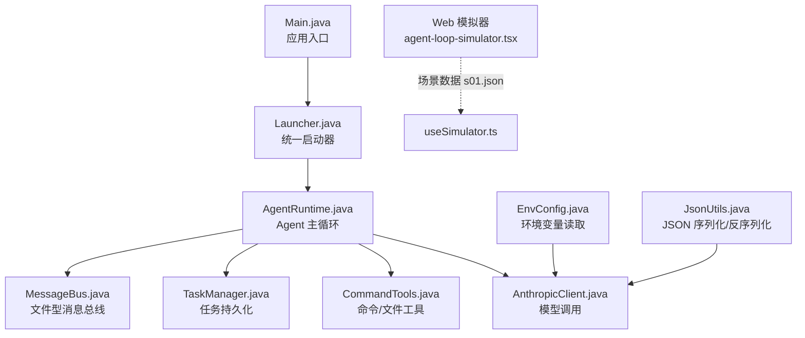
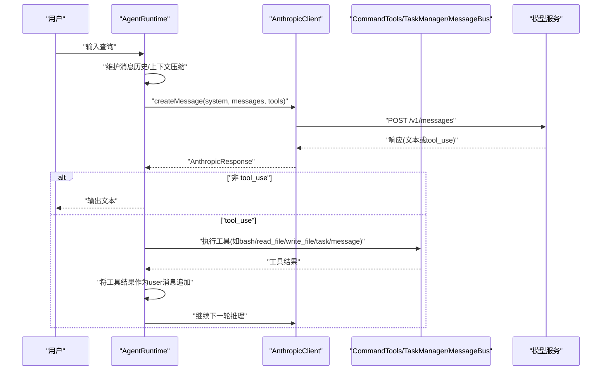
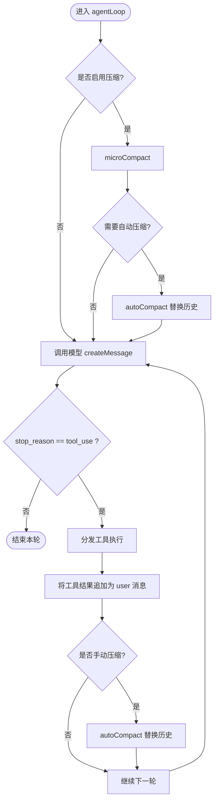
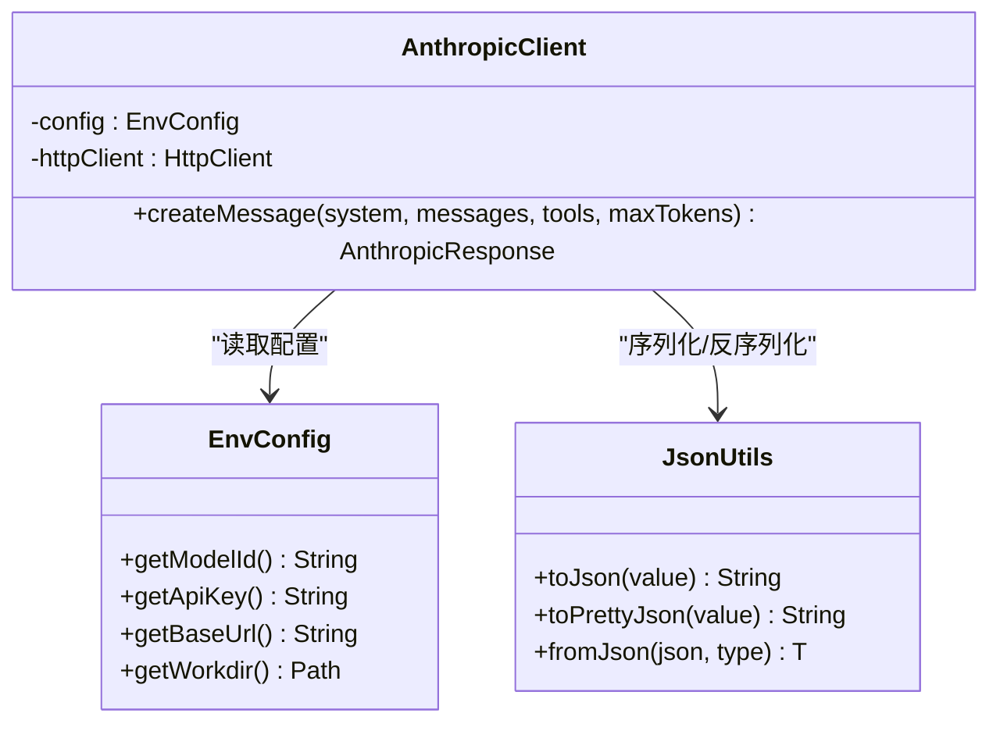
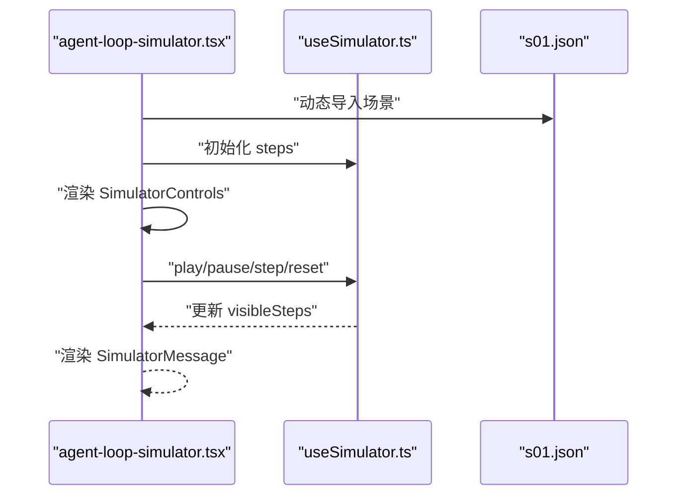
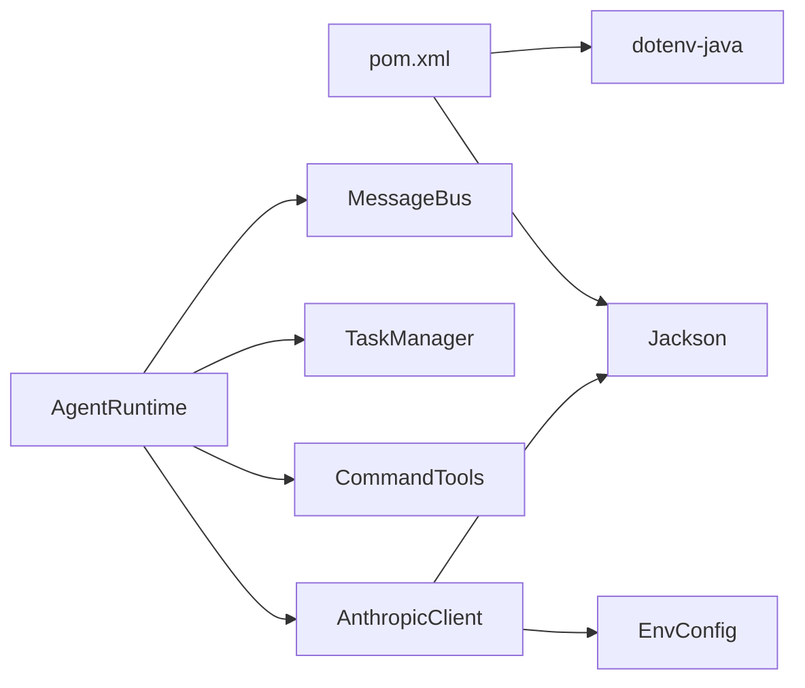

# 测试与调试

<cite>
**本文引用的文件**
- [pom.xml](file://pom.xml)
- [Main.java](file://src/main/java/com/learnclaudecode/Main.java)
- [Launcher.java](file://src/main/java/com/learnclaudecode/agents/Launcher.java)
- [AgentRuntime.java](file://src/main/java/com/learnclaudecode/agents/AgentRuntime.java)
- [AnthropicClient.java](file://src/main/java/com/learnclaudecode/common/AnthropicClient.java)
- [EnvConfig.java](file://src/main/java/com/learnclaudecode/common/EnvConfig.java)
- [JsonUtils.java](file://src/main/java/com/learnclaudecode/common/JsonUtils.java)
- [CommandTools.java](file://src/main/java/com/learnclaudecode/tools/CommandTools.java)
- [TaskManager.java](file://src/main/java/com/learnclaudecode/tasks/TaskManager.java)
- [MessageBus.java](file://src/main/java/com/learnclaudecode/team/MessageBus.java)
- [agent-loop-simulator.tsx](file://web/src/components/simulator/agent-loop-simulator.tsx)
- [simulator-controls.tsx](file://web/src/components/simulator/simulator-controls.tsx)
- [useSimulator.ts](file://web/src/hooks/useSimulator.ts)
- [s01.json](file://web/src/data/scenarios/s01.json)
</cite>

## 目录
1. [简介](#简介)
2. [项目结构](#项目结构)
3. [核心组件](#核心组件)
4. [架构总览](#架构总览)
5. [详细组件分析](#详细组件分析)
6. [依赖关系分析](#依赖关系分析)
7. [性能考虑](#性能考虑)
8. [故障排查指南](#故障排查指南)
9. [结论](#结论)
10. [附录](#附录)

## 简介
本指南面向希望在本项目中开展测试与调试的工程师，覆盖单元测试、集成测试（特别是与 Claude API 交互）、调试技巧（日志、断点、性能分析）以及 Web 模拟器的使用方法。目标是帮助你快速定位问题、验证 Agent 行为，并建立稳定的回归保障。

## 项目结构
本项目采用 Maven 构建，Java 后端提供 Agent 运行时、工具、任务管理、消息总线等能力；前端 Next.js 应用提供 Web 模拟器用于可视化回放 Agent 执行步骤。关键入口为 Main.java，统一通过 Launcher 启动不同阶段的 Agent 配置。

图表来源
- [Main.java:1-15](file://src/main/java/com/learnclaudecode/Main.java#L1-L15)
- [Launcher.java:1-28](file://src/main/java/com/learnclaudecode/agents/Launcher.java#L1-L28)
- [AgentRuntime.java:1-351](file://src/main/java/com/learnclaudecode/agents/AgentRuntime.java#L1-L351)
- [AnthropicClient.java:1-103](file://src/main/java/com/learnclaudecode/common/AnthropicClient.java#L1-L103)
- [EnvConfig.java:1-96](file://src/main/java/com/learnclaudecode/common/EnvConfig.java#L1-L96)
- [JsonUtils.java:1-82](file://src/main/java/com/learnclaudecode/common/JsonUtils.java#L1-L82)
- [CommandTools.java:1-146](file://src/main/java/com/learnclaudecode/tools/CommandTools.java#L1-L146)
- [TaskManager.java:1-338](file://src/main/java/com/learnclaudecode/tasks/TaskManager.java#L1-L338)
- [MessageBus.java:1-123](file://src/main/java/com/learnclaudecode/team/MessageBus.java#L1-L123)
- [agent-loop-simulator.tsx:1-97](file://web/src/components/simulator/agent-loop-simulator.tsx#L1-L97)
- [useSimulator.ts:1-53](file://web/src/hooks/useSimulator.ts#L1-L53)
- [s01.json](file://web/src/data/scenarios/s01.json)

章节来源
- [pom.xml:1-68](file://pom.xml#L1-L68)
- [Main.java:1-15](file://src/main/java/com/learnclaudecode/Main.java#L1-L15)
- [Launcher.java:1-28](file://src/main/java/com/learnclaudecode/agents/Launcher.java#L1-L28)

## 核心组件
- Agent 运行时：实现“观察-决策-执行-反馈”的闭环，负责消息历史维护、上下文压缩、后台任务注入、工具调度与子代理隔离。
- 模型客户端：封装 Anthropic-compatible messages API 调用，统一认证头、超时与错误处理。
- 工具层：提供 bash 执行、文件读写编辑、任务管理、消息总线等能力。
- 环境配置：从 .env 或系统环境变量加载模型 ID、API Key、Base URL 与工作目录。
- JSON 工具：集中 Jackson 配置，提供紧凑与格式化序列化/反序列化。

章节来源
- [AgentRuntime.java:1-351](file://src/main/java/com/learnclaudecode/agents/AgentRuntime.java#L1-L351)
- [AnthropicClient.java:1-103](file://src/main/java/com/learnclaudecode/common/AnthropicClient.java#L1-L103)
- [CommandTools.java:1-146](file://src/main/java/com/learnclaudecode/tools/CommandTools.java#L1-L146)
- [TaskManager.java:1-338](file://src/main/java/com/learnclaudecode/tasks/TaskManager.java#L1-L338)
- [MessageBus.java:1-123](file://src/main/java/com/learnclaudecode/team/MessageBus.java#L1-L123)
- [EnvConfig.java:1-96](file://src/main/java/com/learnclaudecode/common/EnvConfig.java#L1-L96)
- [JsonUtils.java:1-82](file://src/main/java/com/learnclaudecode/common/JsonUtils.java#L1-L82)

## 架构总览
下图展示一次 Agent 请求从用户输入到模型响应、工具执行与结果回灌的整体流程。

图表来源
- [AgentRuntime.java:92-261](file://src/main/java/com/learnclaudecode/agents/AgentRuntime.java#L92-L261)
- [AnthropicClient.java:52-101](file://src/main/java/com/learnclaudecode/common/AnthropicClient.java#L52-L101)
- [CommandTools.java:36-144](file://src/main/java/com/learnclaudecode/tools/CommandTools.java#L36-L144)
- [TaskManager.java:51-133](file://src/main/java/com/learnclaudecode/tasks/TaskManager.java#L51-L133)
- [MessageBus.java:54-121](file://src/main/java/com/learnclaudecode/team/MessageBus.java#L54-L121)

## 详细组件分析

### Agent 运行时（AgentRuntime）
- 职责：REPL 交互、单轮 Agent 循环、上下文压缩、后台任务与收件箱注入、工具调度、子代理隔离。
- 关键点：
  - 每次循环先做轻量裁剪，必要时自动压缩上下文。
  - 根据 StageConfig 决定是否启用背景任务、收件箱、Todo 提醒等特性。
  - 工具映射使用 switch 将模型意图翻译为本地执行逻辑。
  - 子代理共享模型客户端但拥有独立消息上下文，支持只读模式限制写工具。

图表来源
- [AgentRuntime.java:131-261](file://src/main/java/com/learnclaudecode/agents/AgentRuntime.java#L131-L261)

章节来源
- [AgentRuntime.java:1-351](file://src/main/java/com/learnclaudecode/agents/AgentRuntime.java#L1-L351)

### 模型客户端（AnthropicClient）
- 职责：构造请求体、设置认证头、发起 HTTP 调用、解析响应、统一异常。
- 关键点：
  - Base URL 可配置，便于对接兼容端点。
  - 同时发送 x-api-key 与 authorization 头以兼容多提供方。
  - 网络异常与中断统一包装为业务异常，便于上层处理。

图表来源
- [AnthropicClient.java:1-103](file://src/main/java/com/learnclaudecode/common/AnthropicClient.java#L1-L103)
- [EnvConfig.java:1-96](file://src/main/java/com/learnclaudecode/common/EnvConfig.java#L1-L96)
- [JsonUtils.java:1-82](file://src/main/java/com/learnclaudecode/common/JsonUtils.java#L1-L82)

章节来源
- [AnthropicClient.java:1-103](file://src/main/java/com/learnclaudecode/common/AnthropicClient.java#L1-L103)
- [EnvConfig.java:1-96](file://src/main/java/com/learnclaudecode/common/EnvConfig.java#L1-L96)
- [JsonUtils.java:1-82](file://src/main/java/com/learnclaudecode/common/JsonUtils.java#L1-L82)

### 工具类（CommandTools）
- 职责：安全地执行 shell 命令、读取/写入/编辑工作区文件。
- 关键点：
  - 危险命令黑名单拦截。
  - 跨平台 shell 命令构造。
  - 文件操作限制在工作区内，支持行数限制避免大文件污染上下文。

章节来源
- [CommandTools.java:1-146](file://src/main/java/com/learnclaudecode/tools/CommandTools.java#L1-L146)

### 任务管理（TaskManager）
- 职责：任务的创建、获取、更新、认领、列表、绑定/解绑 worktree、扫描可认领任务。
- 关键点：
  - 基于文件系统 JSON 的简单持久化。
  - 并发安全的同步方法。
  - 状态机：pending/in_progress/completed/deleted，完成时清理依赖。

章节来源
- [TaskManager.java:1-338](file://src/main/java/com/learnclaudecode/tasks/TaskManager.java#L1-L338)

### 消息总线（MessageBus）
- 职责：向指定收件箱写入消息、读取并清空收件箱、广播消息。
- 关键点：
  - 每条消息一行 JSON，读后即消费。
  - 类型校验，防止非法消息类型。

章节来源
- [MessageBus.java:1-123](file://src/main/java/com/learnclaudecode/team/MessageBus.java#L1-L123)

### Web 模拟器
- 职责：加载场景数据，逐步播放 Agent 执行过程，可视化用户消息、助手回复、工具调用与结果、系统事件。
- 关键点：
  - 动态导入各阶段场景 JSON。
  - useSimulator 控制播放、暂停、步进、重置与速度。
  - 控制器组件提供播放控件与速度调节。

图表来源
- [agent-loop-simulator.tsx:1-97](file://web/src/components/simulator/agent-loop-simulator.tsx#L1-L97)
- [useSimulator.ts:1-53](file://web/src/hooks/useSimulator.ts#L1-L53)
- [s01.json](file://web/src/data/scenarios/s01.json)

章节来源
- [agent-loop-simulator.tsx:1-97](file://web/src/components/simulator/agent-loop-simulator.tsx#L1-L97)
- [simulator-controls.tsx:1-34](file://web/src/components/simulator/simulator-controls.tsx#L1-L34)
- [useSimulator.ts:1-53](file://web/src/hooks/useSimulator.ts#L1-L53)
- [s01.json](file://web/src/data/scenarios/s01.json)

## 依赖关系分析
- 构建与运行：Maven 编译插件与 exec-maven-plugin 统一编码与运行参数。
- 运行时依赖：Jackson 用于 JSON 处理；dotenv-java 用于环境变量读取；JDK 17 标准库 HttpClient。
- 模块耦合：AgentRuntime 聚合多个子系统，形成高内聚低耦合的装配点；AnthropicClient 与 EnvConfig/JsonUtils 构成外部通信与数据编解码层。

图表来源
- [pom.xml:19-35](file://pom.xml#L19-L35)
- [AgentRuntime.java:41-90](file://src/main/java/com/learnclaudecode/agents/AgentRuntime.java#L41-L90)
- [AnthropicClient.java:27-41](file://src/main/java/com/learnclaudecode/common/AnthropicClient.java#L27-L41)

章节来源
- [pom.xml:1-68](file://pom.xml#L1-L68)

## 性能考虑
- 上下文压缩：在长对话中优先 microCompact，达到阈值再 autoCompact，减少 token 消耗与延迟。
- 工具输出截断：文件读取与命令输出限制长度，避免一次性塞入过多内容。
- 网络超时：模型调用设置合理超时，避免长时间阻塞。
- 并发安全：任务与消息总线的关键方法加锁，避免竞态条件。

[本节为通用指导，不直接分析具体文件]

## 故障排查指南
- 模型调用失败
  - 检查环境变量 MODEL_ID、ANTHROPIC_API_KEY、ANTHROPIC_BASE_URL 是否正确。
  - 查看 AnthropicClient 抛出的异常信息，包含 HTTP 状态码与响应体，便于定位兼容性问题。
- 工具执行异常
  - CommandTools 会返回错误字符串，关注危险命令拦截、超时与 IO 异常。
  - 文件路径需在工作区内，注意相对路径解析。
- 任务与消息问题
  - TaskManager 抛出异常时检查 .tasks 目录权限与文件完整性。
  - MessageBus 读取为空可能是未写入或权限问题，确认 inbox 目录存在。
- Web 模拟器无显示
  - 确认场景 JSON 已正确加载，检查 useSimulator 的 steps 是否为空。
  - 浏览器控制台查看是否有动态导入失败。

章节来源
- [AnthropicClient.java:87-101](file://src/main/java/com/learnclaudecode/common/AnthropicClient.java#L87-L101)
- [CommandTools.java:36-65](file://src/main/java/com/learnclaudecode/tools/CommandTools.java#L36-L65)
- [TaskManager.java:35-42](file://src/main/java/com/learnclaudecode/tasks/TaskManager.java#L35-L42)
- [MessageBus.java:35-42](file://src/main/java/com/learnclaudecode/team/MessageBus.java#L35-L42)
- [agent-loop-simulator.tsx:35-43](file://web/src/components/simulator/agent-loop-simulator.tsx#L35-L43)

## 结论
本项目提供了清晰的 Agent 运行时与工具链，配合 Web 模拟器可实现端到端的可视化调试。通过合理的测试策略（单元与集成）与调试技巧（日志、断点、性能分析），可以快速定位问题并验证功能稳定性。建议在生产前完善 Mock 与场景数据，确保与模型服务的交互具备可重复性与可观测性。

## 附录

### 测试策略与用例设计
- 单元测试
  - AnthropicClient：构造请求体、认证头、超时与异常分支；可使用 Mockito 或自定义 HTTP 服务器模拟响应。
  - CommandTools：危险命令拦截、跨平台 shell 构造、文件读写编辑边界条件（空内容、超大文件、不存在路径）。
  - TaskManager：任务生命周期（创建/更新/删除/认领）、依赖清理、并发安全。
  - MessageBus：消息类型校验、写入/读取/清空、广播计数。
  - AgentRuntime：工具分发分支、上下文压缩触发、后台任务与收件箱注入、子代理只读模式。
- 集成测试
  - 与 Claude API 交互：准备 .env 或系统环境变量，使用真实或兼容端点；记录请求与响应以便复现。
  - 端到端流程：通过 Launcher 启动特定 StageConfig，验证 REPL 输入输出与工具执行结果。
- 场景驱动测试
  - 使用 Web 模拟器场景 JSON 作为期望行为描述，对比实际执行日志与输出。

章节来源
- [AnthropicClient.java:52-101](file://src/main/java/com/learnclaudecode/common/AnthropicClient.java#L52-L101)
- [CommandTools.java:36-144](file://src/main/java/com/learnclaudecode/tools/CommandTools.java#L36-L144)
- [TaskManager.java:51-133](file://src/main/java/com/learnclaudecode/tasks/TaskManager.java#L51-L133)
- [MessageBus.java:54-121](file://src/main/java/com/learnclaudecode/team/MessageBus.java#L54-L121)
- [AgentRuntime.java:131-261](file://src/main/java/com/learnclaudecode/agents/AgentRuntime.java#L131-L261)
- [launcher.java:23-26](file://src/main/java/com/learnclaudecode/agents/Launcher.java#L23-L26)

### 调试技巧
- 日志记录
  - 在 AgentRuntime 的工具分发处打印工具名与输出片段，便于追踪执行路径。
  - 在 AnthropicClient 中保留 HTTP 状态码与响应体，辅助定位兼容问题。
- 断点调试
  - 在 AgentRuntime.agentLoop 的工具分发 switch 处设置断点，观察模型意图与实际执行。
  - 在 AnthropicClient.createMessage 的请求构建与响应解析处设置断点，检查 payload 与 headers。
- 性能分析
  - 使用 JDK Flight Recorder 或 IDE 性能分析器，关注模型调用耗时与工具执行耗时。
  - 监控上下文大小变化，评估压缩策略效果。

章节来源
- [AgentRuntime.java:189-235](file://src/main/java/com/learnclaudecode/agents/AgentRuntime.java#L189-L235)
- [AnthropicClient.java:74-95](file://src/main/java/com/learnclaudecode/common/AnthropicClient.java#L74-L95)

### Web 模拟器使用方法
- 启动 Web 应用后选择对应版本（如 s01），页面会动态加载场景 JSON。
- 使用控制器进行播放、暂停、步进、重置与速度调节，观察每一步的用户消息、助手回复、工具调用与结果。
- 结合后端日志与模拟器步骤，定位差异与问题。

章节来源
- [agent-loop-simulator.tsx:35-43](file://web/src/components/simulator/agent-loop-simulator.tsx#L35-L43)
- [simulator-controls.tsx:22-34](file://web/src/components/simulator/simulator-controls.tsx#L22-L34)
- [useSimulator.ts:27-53](file://web/src/hooks/useSimulator.ts#L27-L53)
- [s01.json](file://web/src/data/scenarios/s01.json)