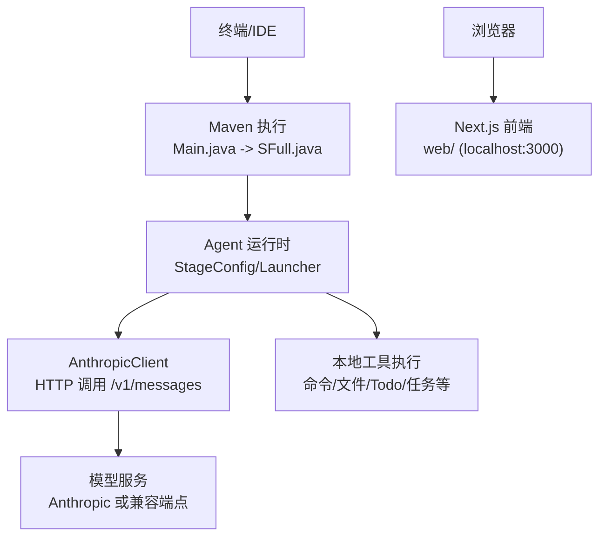
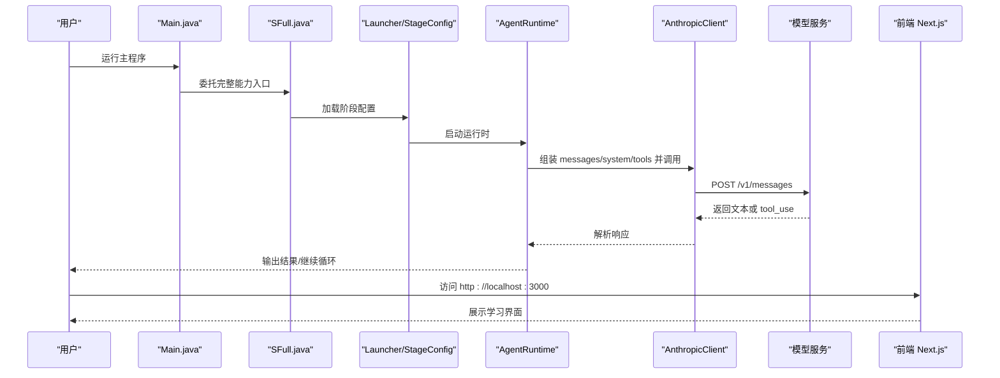
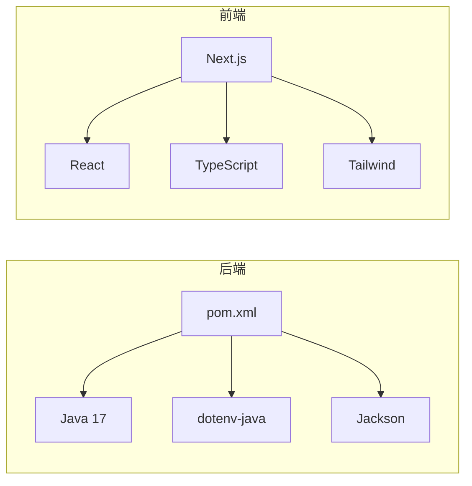

# 快速开始

<cite>
**本文引用的文件**
- [README.md](file://README.md)
- [pom.xml](file://pom.xml)
- [.env](file://.env)
- [EnvConfig.java](file://src/main/java/com/learnclaudecode/common/EnvConfig.java)
- [AnthropicClient.java](file://src/main/java/com/learnclaudecode/common/AnthropicClient.java)
- [Main.java](file://src/main/java/com/learnclaudecode/Main.java)
- [SFull.java](file://src/main/java/com/learnclaudecode/agents/SFull.java)
- [package.json](file://web/package.json)
- [web/README.md](file://web/README.md)
</cite>

## 目录
1. [简介](#简介)
2. [项目结构](#项目结构)
3. [核心组件](#核心组件)
4. [架构总览](#架构总览)
5. [详细组件分析](#详细组件分析)
6. [依赖分析](#依赖分析)
7. [性能注意事项](#性能注意事项)
8. [故障排除指南](#故障排除指南)
9. [结论](#结论)
10. [附录：一键启动清单](#附录：一键启动清单)

## 简介
本指南面向首次接触 Learn Claude Code Java 项目的用户，目标是帮助你在最短时间内完成环境准备、依赖安装、配置设置与前后端启动，体验“大模型决策 + 本地工具执行”的 Agent 闭环。项目后端基于 Java 17 与 Maven，前端为 Next.js 应用；后端通过 Anthropic-compatible 接口调用模型，支持自定义 Base URL 与 API Key。

## 项目结构
- 后端（Java）
  - 入口类 Main 默认启动完整能力版本 SFull。
  - 环境配置 EnvConfig 负责读取 .env 与系统环境变量。
  - 模型客户端 AnthropicClient 封装 HTTP 请求到 /v1/messages。
- 前端（Next.js）
  - web 目录提供可视化学习与演示页面，默认端口 3000。
- 构建与运行
  - 后端使用 Maven 编译与运行。
  - 前端使用 npm/yarn/pnpm/bun 管理依赖并启动开发服务器。

图表来源
- [Main.java:5-13](file://src/main/java/com/learnclaudecode/Main.java#L5-L13)
- [SFull.java:3-12](file://src/main/java/com/learnclaudecode/agents/SFull.java#L3-L12)
- [AnthropicClient.java:52-101](file://src/main/java/com/learnclaudecode/common/AnthropicClient.java#L52-L101)
- [web/README.md:5-17](file://web/README.md#L5-L17)

章节来源
- [README.md:174-195](file://README.md#L174-L195)
- [README.md:311-379](file://README.md#L311-L379)

## 核心组件
- 环境配置 EnvConfig
  - 从 .env 与系统环境变量中读取 MODEL_ID、ANTHROPIC_API_KEY、ANTHROPIC_BASE_URL。
  - 工作目录自动解析为当前进程工作路径。
- 模型客户端 AnthropicClient
  - 构造 JSON 负载（model、messages、system、tools、max_tokens）。
  - 发送 POST 到 {baseUrl}/v1/messages，携带认证头。
  - 统一处理网络异常与错误响应。
- 启动入口 Main/SFull
  - Main 默认委托给 SFull，SFull 以完整能力配置启动 Launcher。

章节来源
- [EnvConfig.java:22-58](file://src/main/java/com/learnclaudecode/common/EnvConfig.java#L22-L58)
- [AnthropicClient.java:52-101](file://src/main/java/com/learnclaudecode/common/AnthropicClient.java#L52-L101)
- [Main.java:5-13](file://src/main/java/com/learnclaudecode/Main.java#L5-L13)
- [SFull.java:3-12](file://src/main/java/com/learnclaudecode/agents/SFull.java#L3-L12)

## 架构总览
下图展示了从启动到模型调用的关键流程，以及前后端的交互关系。

图表来源
- [Main.java:5-13](file://src/main/java/com/learnclaudecode/Main.java#L5-L13)
- [SFull.java:3-12](file://src/main/java/com/learnclaudecode/agents/SFull.java#L3-L12)
- [AnthropicClient.java:52-101](file://src/main/java/com/learnclaudecode/common/AnthropicClient.java#L52-L101)
- [web/README.md:5-17](file://web/README.md#L5-L17)

## 详细组件分析

### 环境与配置
- 必需变量
  - MODEL_ID：必填，指定使用的模型 ID。
  - ANTHROPIC_API_KEY：可选但建议配置，用于鉴权。
  - ANTHROPIC_BASE_URL：可选，默认 https://api.anthropic.com，可替换为兼容端点。
- 优先级
  - 系统环境变量优先于 .env 中的同名变量。
- 工作目录
  - 自动解析为当前进程工作目录，便于相对路径操作。

章节来源
- [EnvConfig.java:22-58](file://src/main/java/com/learnclaudecode/common/EnvConfig.java#L22-L58)
- [.env:1-10](file://.env#L1-L10)

### 后端启动流程
- 最小闭环示例
  - 运行 S01AgentLoop 以体验最简 Agent 循环。
- 完整能力版本
  - 运行 SFull 以启用全部能力（工具、任务、团队、隔离等）。
- 其他阶段
  - 通过替换主类名运行对应阶段，如 S04Subagent、S07TaskSystem、S11AutonomousAgentTeams。

章节来源
- [README.md:337-365](file://README.md#L337-L365)
- [Main.java:5-13](file://src/main/java/com/learnclaudecode/Main.java#L5-L13)
- [SFull.java:3-12](file://src/main/java/com/learnclaudecode/agents/SFull.java#L3-L12)

### 前端启动流程
- 进入 web 目录，安装依赖后启动开发服务器。
- 默认访问 http://localhost:3000。
- 支持 npm/yarn/pnpm/bun 任意包管理器。

章节来源
- [web/README.md:5-17](file://web/README.md#L5-L17)
- [package.json:5-11](file://web/package.json#L5-L11)

### 模型调用细节
- 请求体字段
  - model、messages、system、tools、max_tokens。
- 认证头
  - 同时发送 x-api-key 与 authorization: Bearer，兼容官方与第三方。
- 超时与错误
  - 连接超时 30s，请求超时 180s；非 2xx 状态码直接抛出包含响应体的异常以便调试。

章节来源
- [AnthropicClient.java:52-101](file://src/main/java/com/learnclaudecode/common/AnthropicClient.java#L52-L101)

## 依赖分析
- 后端（Maven）
  - Java 17 编译目标。
  - dotenv-java 用于读取 .env。
  - Jackson 用于 JSON 序列化/反序列化。
- 前端（Next.js）
  - Next.js 16.x、React 19.x、TypeScript、Tailwind CSS 等。
  - scripts/extract-content.ts 在 dev/build 前执行数据提取脚本。

图表来源
- [pom.xml:12-35](file://pom.xml#L12-L35)
- [package.json:13-37](file://web/package.json#L13-L37)

章节来源
- [pom.xml:12-35](file://pom.xml#L12-L35)
- [package.json:13-37](file://web/package.json#L13-L37)

## 性能注意事项
- 合理设置 max_tokens，避免过长输出导致延迟与成本上升。
- 使用合适的模型与 Base URL，选择就近或低延迟的服务端点。
- 控制工具调用频率与上下文长度，必要时启用上下文压缩（高级能力）。
- 前端开发模式会执行内容提取脚本，首次启动可能较慢，属正常现象。

[本节为通用指导，不直接分析具体文件]

## 故障排除指南
- 启动时报缺少环境变量
  - 检查是否已配置 MODEL_ID，且值不为空。
  - 若使用 .env，确保文件位于项目根目录且键名正确。
- 模型调用失败
  - 检查 ANTHROPIC_API_KEY 是否正确。
  - 确认 ANTHROPIC_BASE_URL 指向可用的兼容端点。
  - 查看控制台输出的 HTTP 状态码与响应体，定位服务端错误。
- 网络超时或中断
  - 检查网络连通性与代理设置。
  - 适当调整超时策略或服务端可用性。
- 前端无法访问
  - 确认端口 3000 未被占用。
  - 重新执行 npm install 与 npm run dev。
- 中文编码问题
  - 后端构建插件已设置 UTF-8 相关系统属性，确保 IDE 与终端也使用 UTF-8。

章节来源
- [EnvConfig.java:22-58](file://src/main/java/com/learnclaudecode/common/EnvConfig.java#L22-L58)
- [AnthropicClient.java:74-101](file://src/main/java/com/learnclaudecode/common/AnthropicClient.java#L74-L101)
- [pom.xml:44-64](file://pom.xml#L44-L64)
- [web/README.md:5-17](file://web/README.md#L5-L17)

## 结论
通过以上步骤，你可以在几分钟内完成 Learn Claude Code Java 的环境搭建与运行，体验“模型决策 + 工具执行”的 Agent 闭环。建议先运行最小闭环示例理解基础流程，再逐步切换到完整能力版本，并结合前端可视化页面加深理解。

## 附录：一键启动清单
- 环境准备
  - 安装 Java 17 与 Maven。
  - 安装 Node.js（推荐 LTS），用于前端开发。
- 配置环境变量
  - 在项目根目录创建或编辑 .env，至少配置 MODEL_ID、ANTHROPIC_API_KEY、ANTHROPIC_BASE_URL。
- 启动后端
  - 最小闭环：mvn exec:java -Dexec.mainClass=com.learnclaudecode.agents.S01AgentLoop
  - 完整能力：mvn exec:java -Dexec.mainClass=com.learnclaudecode.agents.SFull
- 启动前端
  - cd web && npm install && npm run dev
  - 浏览器访问 http://localhost:3000

章节来源
- [README.md:311-379](file://README.md#L311-L379)
- [web/README.md:5-17](file://web/README.md#L5-L17)
- [.env:1-10](file://.env#L1-L10)