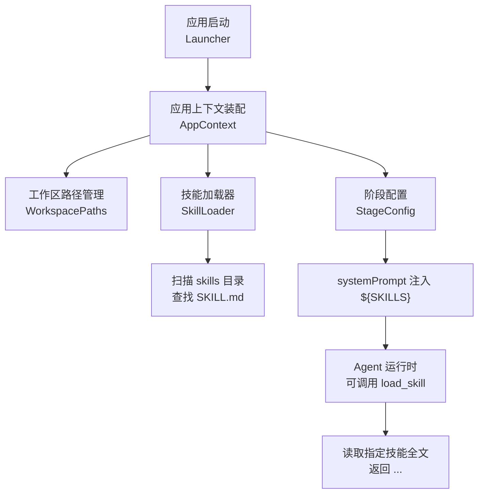
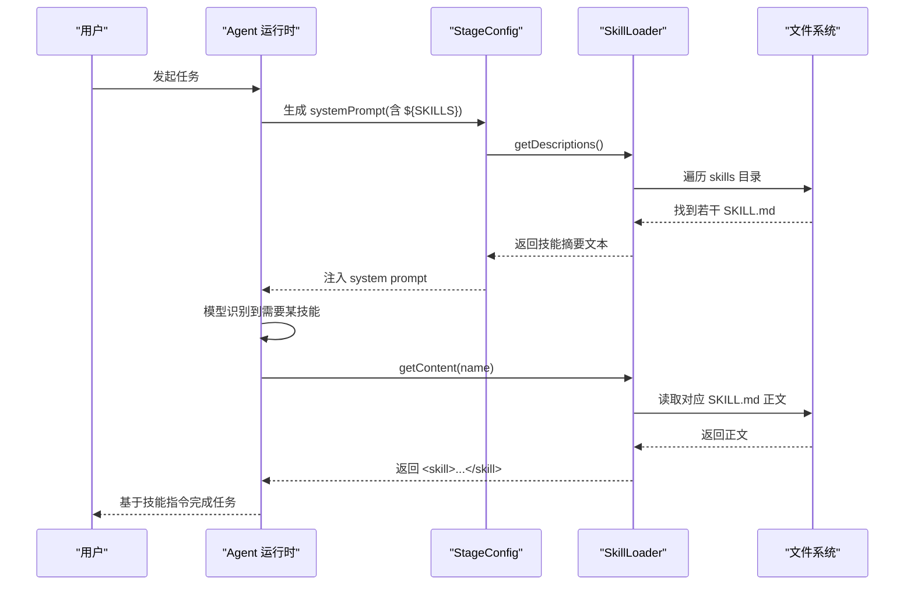
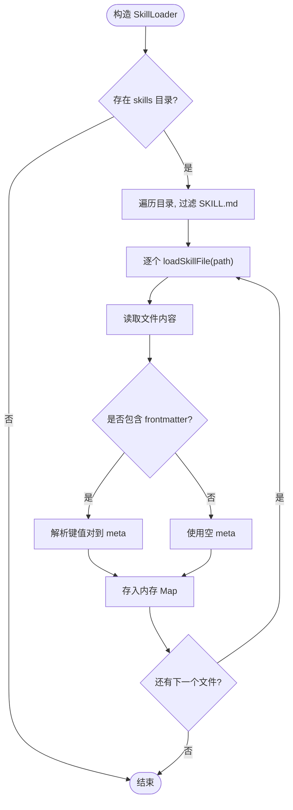
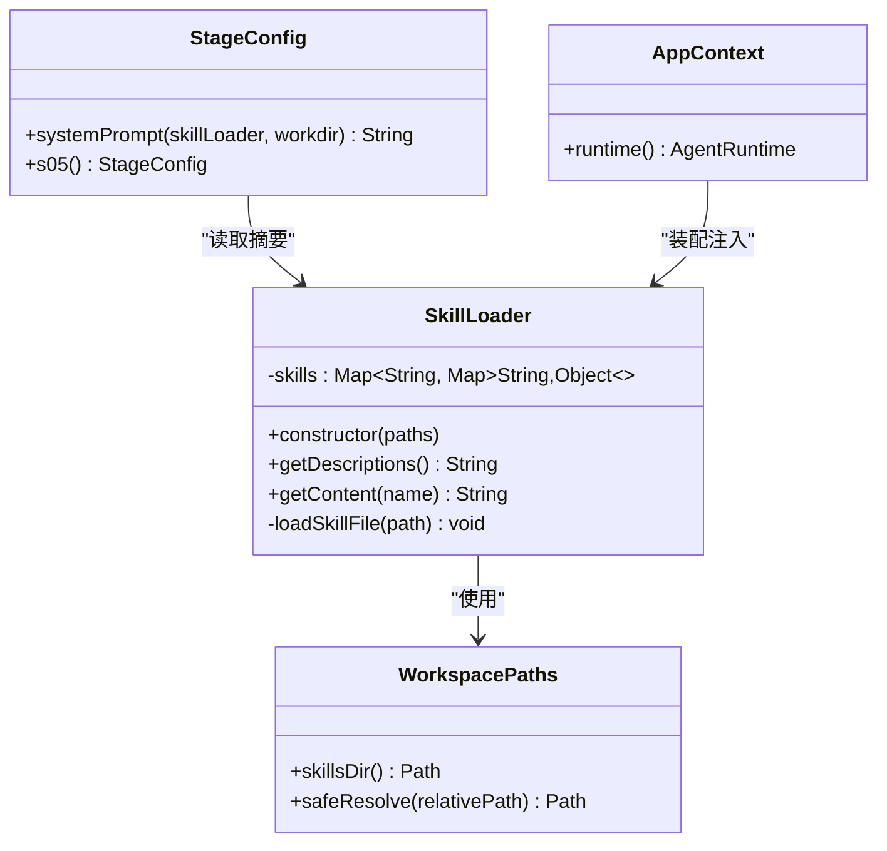

# 技能加载系统

<cite>
**本文引用的文件**
- [SkillLoader.java](file://src/main/java/com/learnclaudecode/skills/SkillLoader.java)
- [WorkspacePaths.java](file://src/main/java/com/learnclaudecode/common/WorkspacePaths.java)
- [StageConfig.java](file://src/main/java/com/learnclaudecode/agents/StageConfig.java)
- [AppContext.java](file://src/main/java/com/learnclaudecode/agents/AppContext.java)
- [Launcher.java](file://src/main/java/com/learnclaudecode/agents/Launcher.java)
- [S05SkillLoading.java](file://src/main/java/com/learnclaudecode/agents/S05SkillLoading.java)
- [SKILL.md（agent-builder）](file://skills/agent-builder/SKILL.md)
- [SKILL.md（code-review）](file://skills/code-review/SKILL.md)
- [SKILL.md（mcp-builder）](file://skills/mcp-builder/SKILL.md)
- [SKILL.md（pdf）](file://skills/pdf/SKILL.md)
</cite>

## 目录
1. [简介](#简介)
2. [项目结构](#项目结构)
3. [核心组件](#核心组件)
4. [架构总览](#架构总览)
5. [详细组件分析](#详细组件分析)
6. [依赖关系分析](#依赖关系分析)
7. [性能与可扩展性](#性能与可扩展性)
8. [故障排查指南](#故障排查指南)
9. [结论](#结论)
10. [附录：自定义技能创建指南](#附录自定义技能创建指南)

## 简介
本文件面向“技能加载系统”，系统性说明动态技能发现与加载机制，重点解释 SkillLoader 的实现原理（扫描、元数据解析、运行时加载），规范 SKILL.md 文件格式与描述结构，并提供创建自定义技能的完整指南（定义、工具绑定、配置选项）。同时给出版本管理与兼容性检查的建议方案。

## 项目结构
技能加载系统围绕以下关键路径组织：
- 技能定义位于工作区根目录的 skills 子目录下，每个技能一个独立目录，入口为 SKILL.md。
- 运行时通过 WorkspacePaths 定位 skills 目录，由 SkillLoader 扫描并解析。
- StageConfig 在构建 system prompt 时注入技能摘要；Agent 可通过 load_skill 工具按需获取完整技能内容。
- AppContext 装配 SkillLoader 并将其注入 AgentRuntime，使模型可在运行期调用技能。

图表来源
- [Launcher.java:18-26](file://src/main/java/com/learnclaudecode/agents/Launcher.java#L18-L26)
- [AppContext.java:35-58](file://src/main/java/com/learnclaudecode/agents/AppContext.java#L35-L58)
- [WorkspacePaths.java:115-125](file://src/main/java/com/learnclaudecode/common/WorkspacePaths.java#L115-L125)
- [SkillLoader.java:21-38](file://src/main/java/com/learnclaudecode/skills/SkillLoader.java#L21-L38)
- [StageConfig.java:44-49](file://src/main/java/com/learnclaudecode/agents/StageConfig.java#L44-L49)

章节来源
- [Launcher.java:18-26](file://src/main/java/com/learnclaudecode/agents/Launcher.java#L18-L26)
- [AppContext.java:35-58](file://src/main/java/com/learnclaudecode/agents/AppContext.java#L35-L58)
- [WorkspacePaths.java:115-125](file://src/main/java/com/learnclaudecode/common/WorkspacePaths.java#L115-L125)
- [SkillLoader.java:21-38](file://src/main/java/com/learnclaudecode/skills/SkillLoader.java#L21-L38)
- [StageConfig.java:44-49](file://src/main/java/com/learnclaudecode/agents/StageConfig.java#L44-L49)

## 核心组件
- SkillLoader：负责扫描 skills 目录、解析 SKILL.md 的 frontmatter 与正文、提供技能摘要与全文访问。
- WorkspacePaths：统一工作区路径访问，提供 skillsDir() 等安全路径方法。
- StageConfig：编排各教学阶段的工具与 system prompt，s05 引入 load_skill 工具并在 systemTemplate 中注入 ${SKILLS}。
- AppContext：装配 SkillLoader 并注入 AgentRuntime，使技能能力在运行时可用。
- S05SkillLoading / Launcher：演示入口，启动 s05 阶段以展示技能加载流程。

章节来源
- [SkillLoader.java:15-105](file://src/main/java/com/learnclaudecode/skills/SkillLoader.java#L15-L105)
- [WorkspacePaths.java:115-125](file://src/main/java/com/learnclaudecode/common/WorkspacePaths.java#L115-L125)
- [StageConfig.java:124-135](file://src/main/java/com/learnclaudecode/agents/StageConfig.java#L124-L135)
- [AppContext.java:35-58](file://src/main/java/com/learnclaudecode/agents/AppContext.java#L35-L58)
- [S05SkillLoading.java:9-11](file://src/main/java/com/learnclaudecode/agents/S05SkillLoading.java#L9-L11)

## 架构总览
技能加载采用“两层注入”的轻量设计：
- 第一层：启动时扫描所有 SKILL.md，提取 name/description 等元数据，生成简短列表注入 system prompt（${SKILLS}），让模型知道有哪些技能可用。
- 第二层：模型根据任务需要，调用 load_skill 工具，按名称获取对应技能的完整正文，作为 tool_result 注入当前上下文，指导具体执行。

图表来源
- [StageConfig.java:44-49](file://src/main/java/com/learnclaudecode/agents/StageConfig.java#L44-L49)
- [SkillLoader.java:21-38](file://src/main/java/com/learnclaudecode/skills/SkillLoader.java#L21-L38)
- [SkillLoader.java:79-104](file://src/main/java/com/learnclaudecode/skills/SkillLoader.java#L79-L104)

## 详细组件分析

### SkillLoader：扫描、解析与运行时加载
- 扫描策略：构造时从 WorkspacePaths.skillsDir() 开始递归遍历，筛选名为 SKILL.md 的文件，按文件名排序后逐个加载。
- 元数据解析：若文件以 ---\n 开头，则解析第一个分隔符内的键值对（简单 frontmatter），支持 name、description 等字段；未提供 name 时使用目录名作为默认名。
- 运行时加载：getContent(name) 根据已加载的技能名返回其正文，并以 <skill name="...">...</skill> 包裹；getDescriptions() 汇总所有技能的简要说明用于 system prompt。

图表来源
- [SkillLoader.java:21-38](file://src/main/java/com/learnclaudecode/skills/SkillLoader.java#L21-L38)
- [SkillLoader.java:45-72](file://src/main/java/com/learnclaudecode/skills/SkillLoader.java#L45-L72)

章节来源
- [SkillLoader.java:21-38](file://src/main/java/com/learnclaudecode/skills/SkillLoader.java#L21-L38)
- [SkillLoader.java:45-72](file://src/main/java/com/learnclaudecode/skills/SkillLoader.java#L45-L72)
- [SkillLoader.java:79-104](file://src/main/java/com/learnclaudecode/skills/SkillLoader.java#L79-L104)

### StageConfig：工具绑定与 System Prompt 注入
- s05 阶段新增 load_skill 工具，参数为 name，用于按需加载技能全文。
- systemTemplate 中包含占位符 ${WORKDIR} 与 ${SKILLS}，运行时替换为实际工作区路径与技能摘要列表。
- 其他阶段逐步叠加更多工具与特性，体现“同一运行时、不同能力开关”的设计思想。

章节来源
- [StageConfig.java:124-135](file://src/main/java/com/learnclaudecode/agents/StageConfig.java#L124-L135)
- [StageConfig.java:44-49](file://src/main/java/com/learnclaudecode/agents/StageConfig.java#L44-L49)

### AppContext：装配与注入
- 在应用启动时创建 WorkspacePaths、SkillLoader 等共享服务，并将 SkillLoader 注入 AgentRuntime，使模型可在运行期调用技能。
- 该装配顺序确保基础能力先于扩展机制就绪。

章节来源
- [AppContext.java:35-58](file://src/main/java/com/learnclaudecode/agents/AppContext.java#L35-L58)

### 入口与演示：S05SkillLoading / Launcher
- S05SkillLoading.main 调用 Launcher.launch(StageConfig.s05())，启动具备技能加载能力的 Agent 示例。
- Launcher 统一封装了 AppContext 的创建与运行时执行。

章节来源
- [S05SkillLoading.java:9-11](file://src/main/java/com/learnclaudecode/agents/S05SkillLoading.java#L9-L11)
- [Launcher.java:18-26](file://src/main/java/com/learnclaudecode/agents/Launcher.java#L18-L26)

## 依赖关系分析
- SkillLoader 依赖 WorkspacePaths 获取 skills 目录路径。
- StageConfig 依赖 SkillLoader 生成 system prompt 中的技能摘要。
- AppContext 将 SkillLoader 注入 AgentRuntime，形成运行时链路。
- 各 SKILL.md 文件作为数据源被 SkillLoader 读取。

图表来源
- [WorkspacePaths.java:115-125](file://src/main/java/com/learnclaudecode/common/WorkspacePaths.java#L115-L125)
- [SkillLoader.java:15-105](file://src/main/java/com/learnclaudecode/skills/SkillLoader.java#L15-L105)
- [StageConfig.java:44-49](file://src/main/java/com/learnclaudecode/agents/StageConfig.java#L44-L49)
- [AppContext.java:35-58](file://src/main/java/com/learnclaudecode/agents/AppContext.java#L35-L58)

章节来源
- [WorkspacePaths.java:115-125](file://src/main/java/com/learnclaudecode/common/WorkspacePaths.java#L115-L125)
- [SkillLoader.java:15-105](file://src/main/java/com/learnclaudecode/skills/SkillLoader.java#L15-L105)
- [StageConfig.java:44-49](file://src/main/java/com/learnclaudecode/agents/StageConfig.java#L44-L49)
- [AppContext.java:35-58](file://src/main/java/com/learnclaudecode/agents/AppContext.java#L35-L58)

## 性能与可扩展性
- 扫描复杂度：O(N) 次文件遍历与读取，N 为 SKILL.md 数量；适合中小规模技能集。
- 内存占用：仅缓存元数据与正文字符串，无额外对象开销；如需更大规模可考虑懒加载或分页摘要。
- 可扩展点：
  - 增加校验：在 loadSkillFile 中加入必填字段校验、长度限制、编码校验。
  - 增量更新：记录上次扫描时间戳，仅处理变更文件。
  - 多格式支持：扩展解析器以支持 YAML frontmatter 或 JSON 元数据。
  - 缓存策略：对频繁访问的技能正文进行内存或磁盘缓存。

[本节为通用建议，不直接分析具体文件]

## 故障排查指南
- 症状：getDescriptions() 返回“(no skills available)”
  - 可能原因：skills 目录不存在或为空；权限不足无法读取。
  - 处理：确认 WorkspacePaths.skillsDir() 指向正确目录；检查文件系统权限。
- 症状：getContent(name) 返回“Unknown skill”
  - 可能原因：技能名与 SKILL.md 中 name 不一致或未成功加载。
  - 处理：核对 name 字段；查看日志输出；确认文件编码为 UTF-8。
- 症状：frontmatter 解析异常
  - 可能原因：缺少分隔符或键值对格式错误。
  - 处理：确保以 ---\n 开头，键值对形如 key: value；必要时放宽解析逻辑或增加容错。

章节来源
- [SkillLoader.java:21-38](file://src/main/java/com/learnclaudecode/skills/SkillLoader.java#L21-L38)
- [SkillLoader.java:79-104](file://src/main/java/com/learnclaudecode/skills/SkillLoader.java#L79-L104)

## 结论
本技能加载系统以最小实现实现了“动态发现 + 按需加载”的核心目标：启动时扫描并注入技能摘要，运行期按需获取完整指令。该设计简洁、易扩展，适合作为教学与生产环境的基线实现。后续可按需增强校验、缓存、增量更新与多格式支持。

[本节为总结性内容，不直接分析具体文件]

## 附录：自定义技能创建指南

### 技能文件格式规范（SKILL.md）
- 位置：工作区根目录下的 skills/<技能名>/SKILL.md。
- Frontmatter（可选）：
  - name：技能唯一标识（若缺失，将使用目录名）。
  - description：技能用途简述（用于 system prompt 摘要）。
  - 其他字段：可按需添加，例如 version、keywords、author 等（当前解析器会忽略未知字段）。
- 正文：技能的具体指令、步骤、最佳实践与参考资源。

示例参考
- [SKILL.md（agent-builder）](file://skills/agent-builder/SKILL.md)
- [SKILL.md（code-review）](file://skills/code-review/SKILL.md)
- [SKILL.md（mcp-builder）](file://skills/mcp-builder/SKILL.md)
- [SKILL.md（pdf）](file://skills/pdf/SKILL.md)

章节来源
- [SkillLoader.java:45-72](file://src/main/java/com/learnclaudecode/skills/SkillLoader.java#L45-L72)
- [SKILL.md（agent-builder）:1-11](file://skills/agent-builder/SKILL.md#L1-L11)
- [SKILL.md（code-review）:1-5](file://skills/code-review/SKILL.md#L1-L5)
- [SKILL.md（mcp-builder）:1-5](file://skills/mcp-builder/SKILL.md#L1-L5)
- [SKILL.md（pdf）:1-5](file://skills/pdf/SKILL.md#L1-L5)

### 工具绑定与配置选项
- 工具绑定：在 StageConfig.s05() 中新增 load_skill(name) 工具，供模型按需加载技能。
- System Prompt：在 systemTemplate 中使用 ${SKILLS} 占位符，运行时替换为技能摘要列表，使模型知晓可用技能。
- 工作区路径：通过 ${WORKDIR} 注入当前工作区路径，便于技能内引用相对路径。

章节来源
- [StageConfig.java:124-135](file://src/main/java/com/learnclaudecode/agents/StageConfig.java#L124-L135)
- [StageConfig.java:44-49](file://src/main/java/com/learnclaudecode/agents/StageConfig.java#L44-L49)

### 版本管理与兼容性检查机制（建议）
当前实现未内置版本字段解析与兼容性检查。建议在 SKILL.md 的 frontmatter 中增加 version 字段，并在 SkillLoader 中实现：
- 版本读取：解析 frontmatter 中的 version。
- 兼容性矩阵：维护最低兼容版本与弃用标记。
- 加载前校验：在 loadSkillFile 中比较版本，拒绝不兼容或已弃用的技能。
- 升级提示：当检测到新版本时，向 system prompt 或日志输出升级建议。

[本节为扩展建议，不直接分析具体文件]