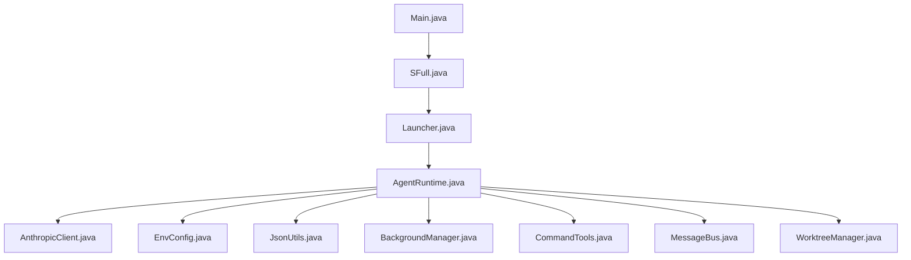
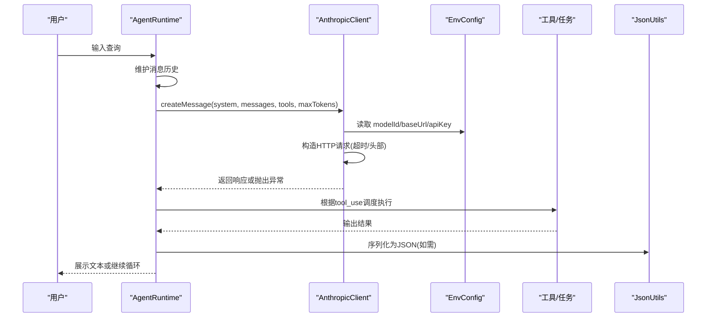
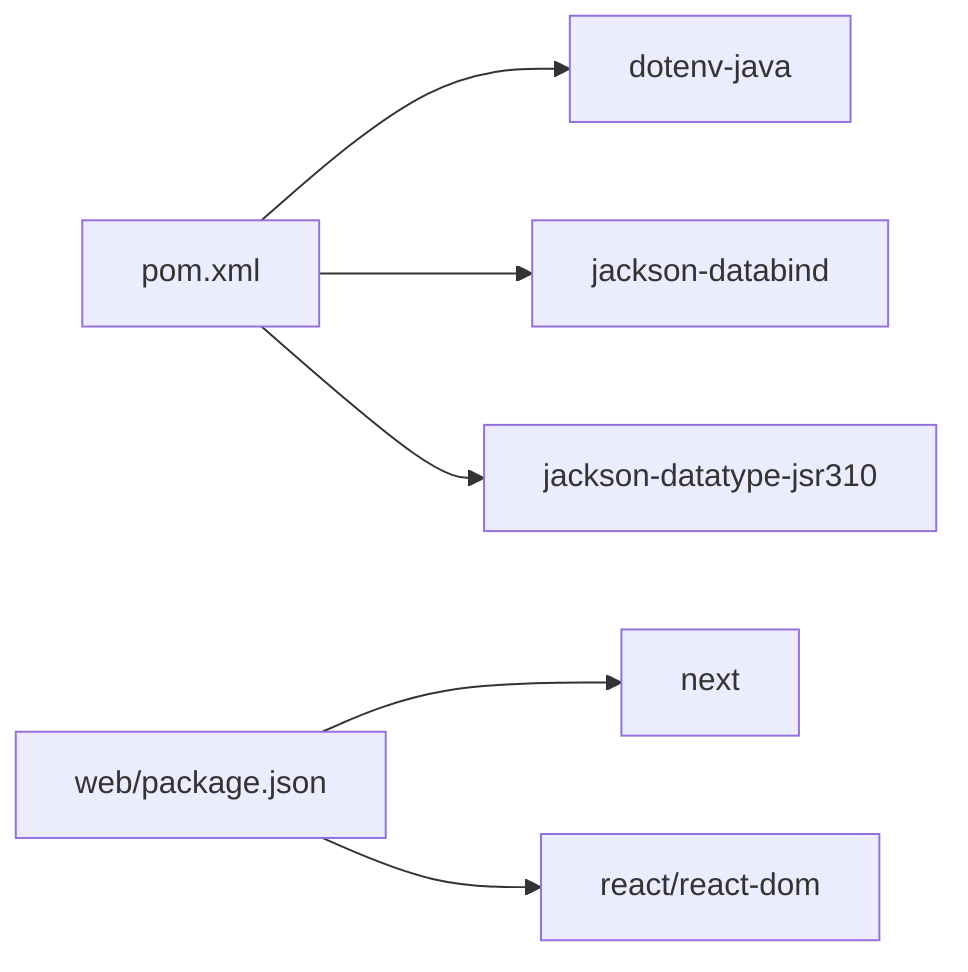

# 故障排除和常见问题

<cite>
**本文引用的文件**
- [Main.java](file://src/main/java/com/learnclaudecode/Main.java)
- [SFull.java](file://src/main/java/com/learnclaudecode/agents/SFull.java)
- [Launcher.java](file://src/main/java/com/learnclaudecode/agents/Launcher.java)
- [AgentRuntime.java](file://src/main/java/com/learnclaudecode/agents/AgentRuntime.java)
- [EnvConfig.java](file://src/main/java/com/learnclaudecode/common/EnvConfig.java)
- [AnthropicClient.java](file://src/main/java/com/learnclaudecode/common/AnthropicClient.java)
- [JsonUtils.java](file://src/main/java/com/learnclaudecode/common/JsonUtils.java)
- [BackgroundManager.java](file://src/main/java/com/learnclaudecode/background/BackgroundManager.java)
- [CommandTools.java](file://src/main/java/com/learnclaudecode/tools/CommandTools.java)
- [MessageBus.java](file://src/main/java/com/learnclaudecode/team/MessageBus.java)
- [WorktreeManager.java](file://src/main/java/com/learnclaudecode/tasks/WorktreeManager.java)
- [pom.xml](file://pom.xml)
- [package.json](file://web/package.json)
- [README.md](file://web/README.md)
</cite>

## 目录
1. [简介](#简介)
2. [项目结构](#项目结构)
3. [核心组件](#核心组件)
4. [架构总览](#架构总览)
5. [详细组件分析](#详细组件分析)
6. [依赖关系分析](#依赖关系分析)
7. [性能注意事项](#性能注意事项)
8. [故障排除指南](#故障排除指南)
9. [结论](#结论)
10. [附录](#附录)

## 简介
本文件面向开发与部署过程中可能遇到的典型问题，提供系统化的排查思路与解决方案。重点覆盖：
- 环境配置问题（环境变量、.env、编码）
- API 连接问题（认证、网络超时、兼容端点）
- 权限与执行问题（命令执行、工作目录、子代理限制）
- 性能问题（上下文压缩、后台任务、JSON 序列化）
- 日志分析与调试技巧
- 标准化排查流程与工具推荐

## 项目结构
本项目包含 Java 后端与 Next.js 前端两部分：
- Java 后端：以 Main 为入口，通过 Launcher 启动 AgentRuntime，使用 EnvConfig 读取环境，通过 AnthropicClient 调用模型服务，结合工具与任务管理实现 Agent 闭环。
- Web 前端：Next.js 应用，提供可视化与教程展示，构建脚本在 prebuild/dev 阶段执行内容提取。

图表来源
- [Main.java:1-15](file://src/main/java/com/learnclaudecode/Main.java#L1-L15)
- [SFull.java:1-13](file://src/main/java/com/learnclaudecode/agents/SFull.java#L1-L13)
- [Launcher.java:1-28](file://src/main/java/com/learnclaudecode/agents/Launcher.java#L1-L28)
- [AgentRuntime.java:1-351](file://src/main/java/com/learnclaudecode/agents/AgentRuntime.java#L1-L351)
- [AnthropicClient.java:1-103](file://src/main/java/com/learnclaudecode/common/AnthropicClient.java#L1-L103)
- [EnvConfig.java:1-96](file://src/main/java/com/learnclaudecode/common/EnvConfig.java#L1-L96)
- [JsonUtils.java:1-83](file://src/main/java/com/learnclaudecode/common/JsonUtils.java#L1-L83)
- [BackgroundManager.java:81-107](file://src/main/java/com/learnclaudecode/background/BackgroundManager.java#L81-L107)
- [CommandTools.java:61-142](file://src/main/java/com/learnclaudecode/tools/CommandTools.java#L61-L142)
- [MessageBus.java:72-100](file://src/main/java/com/learnclaudecode/team/MessageBus.java#L72-L100)
- [WorktreeManager.java:78](file://src/main/java/com/learnclaudecode/tasks/WorktreeManager.java#L78)

章节来源
- [Main.java:1-15](file://src/main/java/com/learnclaudecode/Main.java#L1-L15)
- [pom.xml:1-68](file://pom.xml#L1-L68)
- [package.json:1-39](file://web/package.json#L1-L39)
- [README.md:1-37](file://web/README.md#L1-L37)

## 核心组件
- 运行入口与启动器：Main 将默认能力版本委托给 SFull，再由 Launcher 统一创建 AppContext 并运行 REPL。
- Agent 运行时：AgentRuntime 实现“观察-决策-执行-反馈”的闭环，负责消息历史维护、工具调度、后台任务注入、团队消息轮询等。
- 环境配置：EnvConfig 优先从系统环境变量读取，其次回退到 .env；强制要求 MODEL_ID，可选 ANTHROPIC_API_KEY 与 ANTHROPIC_BASE_URL。
- 模型客户端：AnthropicClient 构造 HTTP 请求，设置超时、头部（含兼容认证头），解析响应体。
- JSON 工具：JsonUtils 统一管理 Jackson ObjectMapper，提供序列化与反序列化方法，统一异常包装。
- 后台任务与工具：BackgroundManager 管理命令执行与超时；CommandTools 封装常用命令；MessageBus 与 WorktreeManager 分别处理消息与仓库隔离。

章节来源
- [Launcher.java:18-26](file://src/main/java/com/learnclaudecode/agents/Launcher.java#L18-L26)
- [AgentRuntime.java:92-123](file://src/main/java/com/learnclaudecode/agents/AgentRuntime.java#L92-L123)
- [EnvConfig.java:22-58](file://src/main/java/com/learnclaudecode/common/EnvConfig.java#L22-L58)
- [AnthropicClient.java:36-100](file://src/main/java/com/learnclaudecode/common/AnthropicClient.java#L36-L100)
- [JsonUtils.java:13-81](file://src/main/java/com/learnclaudecode/common/JsonUtils.java#L13-L81)
- [BackgroundManager.java:81-107](file://src/main/java/com/learnclaudecode/background/BackgroundManager.java#L81-L107)
- [CommandTools.java:61-142](file://src/main/java/com/learnclaudecode/tools/CommandTools.java#L61-L142)
- [MessageBus.java:72-100](file://src/main/java/com/learnclaudecode/team/MessageBus.java#L72-L100)
- [WorktreeManager.java:78](file://src/main/java/com/learnclaudecode/tasks/WorktreeManager.java#L78)

## 架构总览
下图展示了从用户输入到模型调用、工具执行与结果反馈的整体流程，以及关键错误路径。

图表来源
- [AgentRuntime.java:131-260](file://src/main/java/com/learnclaudecode/agents/AgentRuntime.java#L131-L260)
- [AnthropicClient.java:52-100](file://src/main/java/com/learnclaudecode/common/AnthropicClient.java#L52-L100)
- [EnvConfig.java:22-58](file://src/main/java/com/learnclaudecode/common/EnvConfig.java#L22-L58)
- [JsonUtils.java:23-81](file://src/main/java/com/learnclaudecode/common/JsonUtils.java#L23-L81)

## 详细组件分析

### 环境配置与环境变量
- 必填项：MODEL_ID 缺失会直接抛出异常，导致启动失败。
- 可选项：ANTHROPIC_API_KEY 为空时不发送认证头；ANTHROPIC_BASE_URL 默认为官方地址，可替换为兼容端点。
- 优先级：系统环境变量优先于 .env，便于 CI/IDEA 覆盖本地值。
- 工作目录：当前进程工作目录用于相对路径解析。

常见症状与定位
- 启动即报错：检查是否设置了 MODEL_ID。
- 无法访问模型：确认 ANTHROPIC_BASE_URL 可达且格式正确；若使用第三方兼容端点，确保 /v1/messages 路径存在。
- 认证失败：确认 ANTHROPIC_API_KEY 已设置；客户端会同时发送 x-api-key 与 authorization 头以兼容不同提供方。

章节来源
- [EnvConfig.java:22-58](file://src/main/java/com/learnclaudecode/common/EnvConfig.java#L22-L58)
- [EnvConfig.java:65-84](file://src/main/java/com/learnclaudecode/common/EnvConfig.java#L65-L84)
- [AnthropicClient.java:71-85](file://src/main/java/com/learnclaudecode/common/AnthropicClient.java#L71-L85)

### API 连接与认证
- 连接与请求超时：HttpClient 设置连接超时；createMessage 设置请求超时，避免长时间阻塞。
- 兼容端点：Base URL 支持替换，便于接入智谱、OpenRouter 等兼容服务。
- 错误处理：HTTP 状态码 >= 400 会抛出包含状态码与响应体的异常；IO/中断异常统一包装为业务异常。

诊断步骤
- 网络连通性：验证 Base URL 可达；检查代理/防火墙设置。
- 认证头：确认 API Key 非空；必要时打印请求头进行比对。
- 响应体：捕获异常中的响应体信息，定位服务端错误详情。

章节来源
- [AnthropicClient.java:36-41](file://src/main/java/com/learnclaudecode/common/AnthropicClient.java#L36-L41)
- [AnthropicClient.java:71-85](file://src/main/java/com/learnclaudecode/common/AnthropicClient.java#L71-L85)
- [AnthropicClient.java:87-100](file://src/main/java/com/learnclaudecode/common/AnthropicClient.java#L87-L100)

### 权限与执行问题
- 命令执行：CommandTools 封装 bash/read/write/edit 等操作；异常会被包装为错误字符串返回。
- 后台任务：BackgroundManager 在超时后强制终止进程，避免资源占用；合并 stdout/stderr 作为结果。
- 子代理限制：当 subagentWritable 为 false 时，移除写文件工具，防止不受控写入。
- 工作目录：WorkspacePaths 基于当前工作目录解析相对路径，需确保运行目录正确。

排查要点
- 命令权限：确认运行用户对目标路径有读写权限。
- 超时控制：后台任务超时后会被销毁，检查命令耗时与超时阈值。
- 只读模式：子代理只读时，write_file/edit_file 将被禁用，需调整 StageConfig。

章节来源
- [CommandTools.java:61-142](file://src/main/java/com/learnclaudecode/tools/CommandTools.java#L61-L142)
- [BackgroundManager.java:81-107](file://src/main/java/com/learnclaudecode/background/BackgroundManager.java#L81-L107)
- [AgentRuntime.java:270-277](file://src/main/java/com/learnclaudecode/agents/AgentRuntime.java#L270-L277)

### 性能与上下文管理
- 上下文压缩：AgentRuntime 支持自动与手动压缩，减少消息历史长度，降低 token 消耗与延迟。
- JSON 序列化：JsonUtils 统一配置 Jackson，避免时间类型序列化问题；序列化失败会抛出异常。
- 后台任务注入：后台结果作为新消息注入主上下文，注意不要频繁注入大量数据。

优化建议
- 合理设置 enableCompression 与阈值，避免过度压缩影响对话质量。
- 监控 JSON 序列化开销，必要时对大对象进行分块处理。
- 控制后台任务频率与结果大小，避免消息历史膨胀。

章节来源
- [AgentRuntime.java:136-145](file://src/main/java/com/learnclaudecode/agents/AgentRuntime.java#L136-L145)
- [AgentRuntime.java:202-206](file://src/main/java/com/learnclaudecode/agents/AgentRuntime.java#L202-L206)
- [JsonUtils.java:13-81](file://src/main/java/com/learnclaudecode/common/JsonUtils.java#L13-L81)

### 前端构建与开发
- 构建脚本：predev/prebuild 阶段执行 extract 脚本，确保内容就绪后再启动 dev/build。
- 开发服务器：next dev 启动本地服务，端口默认 3000。
- 部署：可通过 Vercel 等平台部署。

常见问题
- 构建失败：检查 Node 环境与依赖安装；确认 extract 脚本可执行。
- 页面空白：检查浏览器控制台错误与服务端渲染日志。

章节来源
- [package.json:5-11](file://web/package.json#L5-L11)
- [README.md:3-17](file://web/README.md#L3-L17)

## 依赖关系分析
Java 后端依赖 dotenv 与 Jackson；Maven 插件配置了 UTF-8 编码；Web 前端依赖 Next.js 生态。

图表来源
- [pom.xml:19-35](file://pom.xml#L19-L35)
- [package.json:13-28](file://web/package.json#L13-L28)

章节来源
- [pom.xml:1-68](file://pom.xml#L1-L68)
- [package.json:1-39](file://web/package.json#L1-L39)

## 性能注意事项
- 模型调用超时：createMessage 设置较长超时，适合复杂推理；可根据场景调整。
- 上下文压缩：启用自动压缩可减少 token 使用，但需平衡信息完整性。
- 后台任务：超时保护避免僵尸进程；合并输出便于一次性查看。
- JSON 序列化：统一配置避免时间字段序列化异常；大对象序列化需谨慎。

[本节为通用指导，不直接分析具体文件]

## 故障排除指南

### 环境配置问题
症状
- 启动时报错提示缺少环境变量。
- 模型调用失败或返回认证错误。

排查步骤
- 确认已设置 MODEL_ID；如未设置，EnvConfig 会抛出异常。
- 检查 ANTHROPIC_API_KEY 是否为空；为空则不会发送认证头。
- 校验 ANTHROPIC_BASE_URL 是否可达；必要时替换为兼容端点。
- 在 IDEA/CI 中优先使用系统环境变量覆盖 .env。

预防措施
- 在 .env 模板中列出必填与可选变量。
- 在启动脚本中校验必要环境变量。

章节来源
- [EnvConfig.java:22-58](file://src/main/java/com/learnclaudecode/common/EnvConfig.java#L22-L58)
- [EnvConfig.java:65-84](file://src/main/java/com/learnclaudecode/common/EnvConfig.java#L65-L84)

### API 连接问题
症状
- 调用模型接口超时或连接失败。
- HTTP 状态码 4xx/5xx 返回错误。

排查步骤
- 检查网络连通性与代理设置。
- 确认 Base URL 与 /v1/messages 路径正确。
- 查看异常中的响应体，定位服务端错误。
- 确认认证头是否正确发送。

预防措施
- 增加重试与退避策略（可在上层封装）。
- 记录请求与响应摘要以便审计。

章节来源
- [AnthropicClient.java:36-41](file://src/main/java/com/learnclaudecode/common/AnthropicClient.java#L36-L41)
- [AnthropicClient.java:71-85](file://src/main/java/com/learnclaudecode/common/AnthropicClient.java#L71-L85)
- [AnthropicClient.java:87-100](file://src/main/java/com/learnclaudecode/common/AnthropicClient.java#L87-L100)

### 权限与执行问题
症状
- 命令执行失败或无权限。
- 后台任务超时或被强制终止。
- 子代理无法写入文件。

排查步骤
- 确认运行用户对目标路径具备读写权限。
- 检查后台任务超时阈值与命令耗时。
- 在只读模式下，确认 write_file/edit_file 被移除。

预防措施
- 最小权限原则运行进程。
- 为后台任务设置合理超时与资源限制。
- 明确子代理的只读/可写策略。

章节来源
- [CommandTools.java:61-142](file://src/main/java/com/learnclaudecode/tools/CommandTools.java#L61-L142)
- [BackgroundManager.java:81-107](file://src/main/java/com/learnclaudecode/background/BackgroundManager.java#L81-L107)
- [AgentRuntime.java:270-277](file://src/main/java/com/learnclaudecode/agents/AgentRuntime.java#L270-L277)

### 性能问题
症状
- 对话响应缓慢。
- Token 消耗过高。
- JSON 序列化异常或卡顿。

排查步骤
- 启用上下文压缩，观察消息历史长度变化。
- 监控模型调用耗时与响应大小。
- 检查 JSON 序列化对象大小与复杂度。

预防措施
- 合理设置 maxTokens 与压缩阈值。
- 对大对象进行分块或延迟加载。
- 定期清理后台任务与消息历史。

章节来源
- [AgentRuntime.java:136-145](file://src/main/java/com/learnclaudecode/agents/AgentRuntime.java#L136-L145)
- [AgentRuntime.java:202-206](file://src/main/java/com/learnclaudecode/agents/AgentRuntime.java#L202-L206)
- [JsonUtils.java:13-81](file://src/main/java/com/learnclaudecode/common/JsonUtils.java#L13-L81)

### 日志分析与调试技巧
- 标准输出：AgentRuntime 打印工具执行前缀与部分输出，便于快速定位。
- 异常信息：API 调用失败时会包含状态码与响应体；JSON 异常会包装为业务异常。
- 后台任务：合并 stdout/stderr 作为结果，便于一次性查看完整输出。
- 前端：使用浏览器开发者工具与 Next.js 日志定位渲染问题。

建议
- 在关键路径添加结构化日志（请求 ID、耗时、状态码）。
- 对异常进行分类与告警，便于快速响应。
- 使用日志聚合平台集中收集与分析。

章节来源
- [AgentRuntime.java:235-235](file://src/main/java/com/learnclaudecode/agents/AgentRuntime.java#L235-L235)
- [AnthropicClient.java:87-100](file://src/main/java/com/learnclaudecode/common/AnthropicClient.java#L87-L100)
- [BackgroundManager.java:81-107](file://src/main/java/com/learnclaudecode/background/BackgroundManager.java#L81-L107)

### 标准化排查流程
1. 复现问题：记录环境、输入、期望行为与实际行为。
2. 检查环境：确认环境变量与 .env 配置正确。
3. 检查网络：验证 Base URL 可达与认证头。
4. 检查权限：确认运行用户对路径与命令有足够权限。
5. 检查性能：评估上下文长度与模型调用耗时。
6. 收集日志：抓取异常堆栈与响应体。
7. 定位根因：逐步缩小范围，必要时简化输入或禁用功能。
8. 修复验证：实施修复并回归测试。

工具推荐
- 网络：curl/wget 测试端点连通性。
- 日志：结构化日志库与日志聚合平台。
- 监控：APM 工具跟踪调用链与性能指标。
- 前端：浏览器开发者工具与 Next.js 调试模式。

[本节为通用指导，不直接分析具体文件]

## 结论
通过系统化地检查环境配置、API 连接、权限与性能，并结合日志与调试技巧，可以快速定位并解决大多数开发与部署问题。建议在项目中建立标准化的排查流程与监控体系，提升问题响应效率与稳定性。

[本节为总结性内容，不直接分析具体文件]

## 附录
- 启动入口：Main 委托 SFull，再由 Launcher 启动 AgentRuntime。
- 构建与运行：Maven 编译与 exec 插件配置 UTF-8；Next.js 提供 dev/build/start 脚本。

章节来源
- [Main.java:1-15](file://src/main/java/com/learnclaudecode/Main.java#L1-L15)
- [SFull.java:1-13](file://src/main/java/com/learnclaudecode/agents/SFull.java#L1-L13)
- [Launcher.java:18-26](file://src/main/java/com/learnclaudecode/agents/Launcher.java#L18-L26)
- [pom.xml:37-64](file://pom.xml#L37-L64)
- [package.json:5-11](file://web/package.json#L5-L11)