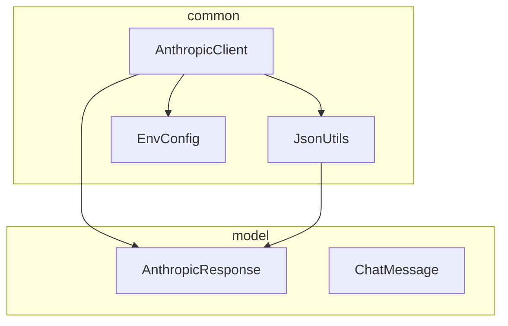
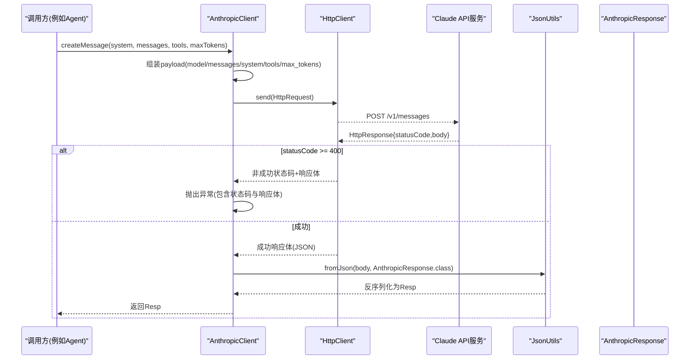
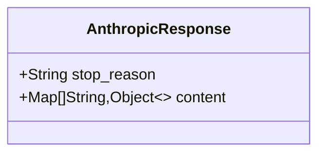
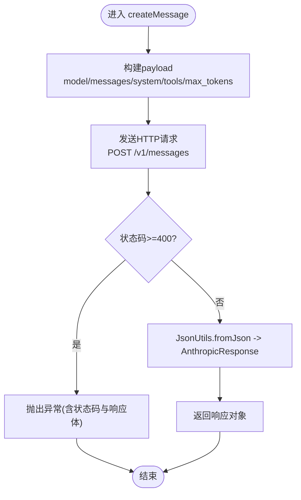
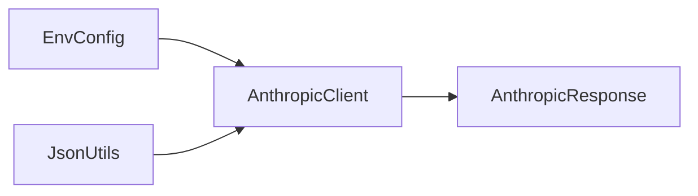

# API响应模型

<cite>
**本文引用的文件**
- [AnthropicResponse.java](file://src/main/java/com/learnclaudecode/model/AnthropicResponse.java)
- [AnthropicClient.java](file://src/main/java/com/learnclaudecode/common/AnthropicClient.java)
- [JsonUtils.java](file://src/main/java/com/learnclaudecode/common/JsonUtils.java)
- [EnvConfig.java](file://src/main/java/com/learnclaudecode/common/EnvConfig.java)
- [ChatMessage.java](file://src/main/java/com/learnclaudecode/model/ChatMessage.java)
</cite>

## 目录
1. [简介](#简介)
2. [项目结构](#项目结构)
3. [核心组件](#核心组件)
4. [架构总览](#架构总览)
5. [详细组件分析](#详细组件分析)
6. [依赖关系分析](#依赖关系分析)
7. [性能考量](#性能考量)
8. [故障排查指南](#故障排查指南)
9. [结论](#结论)
10. [附录：API调用示例与最佳实践](#附录api调用示例与最佳实践)

## 简介
本文件聚焦于 Claude API 的响应模型设计与封装策略，围绕 AnthropicResponse 的数据结构、错误处理机制、状态码映射、序列化/反序列化配置，以及 API 调用的完整流程进行系统化说明。文档旨在帮助读者理解从 HTTP 请求到业务对象映射的全过程，并提供异常处理与重试机制的最佳实践建议。

## 项目结构
本项目采用分层组织方式：
- common：通用能力（HTTP客户端、JSON工具、环境配置）
- model：领域数据模型（如 AnthropicResponse、ChatMessage）
- agents：智能体编排与执行逻辑
- tools/skills/tasks/team/background：辅助能力

与 API 响应模型直接相关的代码集中在 common 与 model 两个包中。

图表来源
- [AnthropicClient.java:27-102](file://src/main/java/com/learnclaudecode/common/AnthropicClient.java#L27-L102)
- [JsonUtils.java:12-83](file://src/main/java/com/learnclaudecode/common/JsonUtils.java#L12-L83)
- [EnvConfig.java:12-96](file://src/main/java/com/learnclaudecode/common/EnvConfig.java#L12-L96)
- [AnthropicResponse.java:8-13](file://src/main/java/com/learnclaudecode/model/AnthropicResponse.java#L8-L13)

章节来源
- [AnthropicClient.java:27-102](file://src/main/java/com/learnclaudecode/common/AnthropicClient.java#L27-L102)
- [JsonUtils.java:12-83](file://src/main/java/com/learnclaudecode/common/JsonUtils.java#L12-L83)
- [EnvConfig.java:12-96](file://src/main/java/com/learnclaudecode/common/EnvConfig.java#L12-L96)
- [AnthropicResponse.java:8-13](file://src/main/java/com/learnclaudecode/model/AnthropicResponse.java#L8-L13)

## 核心组件
- AnthropicResponse：轻量级响应模型，仅包含 stop_reason 与 content 字段，使用 Jackson 注解忽略未知属性以增强兼容性。
- AnthropicClient：负责构造请求、发送 HTTP 调用、统一错误处理与响应解析。
- JsonUtils：集中管理 Jackson ObjectMapper 的配置与 JSON 序列化/反序列化方法。
- EnvConfig：读取环境变量（模型ID、API Key、Base URL），支持 .env 与系统变量覆盖。
- ChatMessage：对话消息模型，content 为 Object 以兼容文本或结构化 tool_result。

章节来源
- [AnthropicResponse.java:8-13](file://src/main/java/com/learnclaudecode/model/AnthropicResponse.java#L8-L13)
- [AnthropicClient.java:27-102](file://src/main/java/com/learnclaudecode/common/AnthropicClient.java#L27-L102)
- [JsonUtils.java:12-83](file://src/main/java/com/learnclaudecode/common/JsonUtils.java#L12-L83)
- [EnvConfig.java:12-96](file://src/main/java/com/learnclaudecode/common/EnvConfig.java#L12-L96)
- [ChatMessage.java:3-7](file://src/main/java/com/learnclaudecode/model/ChatMessage.java#L3-L7)

## 架构总览
下图展示了从上层 Agent 到模型服务的端到端调用流程，重点体现请求构建、网络调用、错误处理与响应解析。

图表来源
- [AnthropicClient.java:52-100](file://src/main/java/com/learnclaudecode/common/AnthropicClient.java#L52-L100)
- [JsonUtils.java:59-65](file://src/main/java/com/learnclaudecode/common/JsonUtils.java#L59-L65)
- [AnthropicResponse.java:8-13](file://src/main/java/com/learnclaudecode/model/AnthropicResponse.java#L8-L13)

## 详细组件分析

### AnthropicResponse：响应模型设计模式与封装策略
- 设计要点
  - 使用 record 定义不可变数据结构，语义清晰且简洁。
  - 通过 @JsonIgnoreProperties(ignoreUnknown = true) 忽略未知字段，提升对上游接口演进的鲁棒性。
  - 字段 stop_reason 用于指示本轮结束原因；content 为 List<Map<String,Object>>，可承载文本块或结构化内容（如 tool_use/tool_result）。
- 复杂度与扩展性
  - 时间复杂度：O(1) 访问；空间复杂度：与 content 列表长度线性相关。
  - 若未来需要强类型化 content 中的元素，可引入联合类型或枚举标记，但需权衡兼容性与维护成本。

图表来源
- [AnthropicResponse.java:8-13](file://src/main/java/com/learnclaudecode/model/AnthropicResponse.java#L8-L13)

章节来源
- [AnthropicResponse.java:8-13](file://src/main/java/com/learnclaudecode/model/AnthropicResponse.java#L8-L13)

### AnthropicClient：请求构建、错误处理与状态码映射
- 请求构建
  - payload 包含 model、max_tokens、messages、system、tools，严格对齐 Anthropic Messages API 风格，便于对接兼容端点。
  - Base URL 来自 EnvConfig，默认指向官方地址，可通过环境变量替换为第三方兼容服务。
  - 认证头同时设置 x-api-key 与 authorization: Bearer，提高兼容性。
- 超时与连接
  - 连接超时 30 秒，请求超时 180 秒，避免长时间阻塞。
- 错误处理与状态码映射
  - 当 HTTP 状态码 >= 400 时，直接抛出包含状态码与响应体的异常，便于调试与定位。
  - IO 或中断异常统一包装为 IllegalStateException，并保留原始堆栈，上层无需重复处理网络细节。
- 响应解析
  - 使用 JsonUtils.fromJson 将响应体反序列化为 AnthropicResponse。

图表来源
- [AnthropicClient.java:52-100](file://src/main/java/com/learnclaudecode/common/AnthropicClient.java#L52-L100)

章节来源
- [AnthropicClient.java:52-100](file://src/main/java/com/learnclaudecode/common/AnthropicClient.java#L52-L100)

### JsonUtils：序列化与反序列化配置
- 配置要点
  - 全局 ObjectMapper 启用 JavaTimeModule 并禁用时间戳输出，保证日期格式一致。
  - toJson/toPrettyJson/fromJson 统一封装，失败时抛出 IllegalStateException，简化调用方错误处理。
- 适用场景
  - 请求体序列化、响应体反序列化、调试日志格式化等。

章节来源
- [JsonUtils.java:12-83](file://src/main/java/com/learnclaudecode/common/JsonUtils.java#L12-L83)

### EnvConfig：环境配置与端点切换
- 功能
  - 读取 MODEL_ID、ANTHROPIC_API_KEY、ANTHROPIC_BASE_URL，支持 .env 与系统环境变量覆盖。
  - 提供工作目录路径，便于后续文件操作。
- 影响范围
  - 决定模型版本、鉴权凭据与目标服务地址，直接影响 API 行为与兼容性。

章节来源
- [EnvConfig.java:12-96](file://src/main/java/com/learnclaudecode/common/EnvConfig.java#L12-L96)

### ChatMessage：消息模型
- 设计
  - role 表示角色（user/assistant/system），content 为 Object，兼容纯文本或结构化 tool_result 列表，提升灵活性。
- 用途
  - 作为 messages 数组的元素参与请求构建，支撑多轮对话与工具调用。

章节来源
- [ChatMessage.java:3-7](file://src/main/java/com/learnclaudecode/model/ChatMessage.java#L3-L7)

## 依赖关系分析
- AnthropicClient 依赖：
  - EnvConfig：获取模型ID、API Key、Base URL。
  - JsonUtils：序列化请求体、反序列化响应体。
  - Java HttpClient：发起网络请求。
- AnthropicResponse 依赖：
  - Jackson 注解：忽略未知属性，提升兼容性。
- JsonUtils 依赖：
  - Jackson ObjectMapper：统一序列化/反序列化配置。

图表来源
- [AnthropicClient.java:27-100](file://src/main/java/com/learnclaudecode/common/AnthropicClient.java#L27-L100)
- [JsonUtils.java:12-83](file://src/main/java/com/learnclaudecode/common/JsonUtils.java#L12-L83)
- [EnvConfig.java:12-96](file://src/main/java/com/learnclaudecode/common/EnvConfig.java#L12-L96)
- [AnthropicResponse.java:8-13](file://src/main/java/com/learnclaudecode/model/AnthropicResponse.java#L8-L13)

章节来源
- [AnthropicClient.java:27-100](file://src/main/java/com/learnclaudecode/common/AnthropicClient.java#L27-L100)
- [JsonUtils.java:12-83](file://src/main/java/com/learnclaudecode/common/JsonUtils.java#L12-L83)
- [EnvConfig.java:12-96](file://src/main/java/com/learnclaudecode/common/EnvConfig.java#L12-L96)
- [AnthropicResponse.java:8-13](file://src/main/java/com/learnclaudecode/model/AnthropicResponse.java#L8-L13)

## 性能考量
- 连接与请求超时：连接超时 30s，请求超时 180s，平衡稳定性与响应时效。
- 序列化开销：Jackson ObjectMapper 单例复用，减少初始化成本。
- 内存占用：AnthropicResponse.content 为 List<Map>，在长上下文或大量工具结果时需关注内存增长。
- 并发与线程安全：HttpClient 与 ObjectMapper 均为线程安全，可在多线程环境中共享。

[本节为通用性能讨论，不直接分析具体文件]

## 故障排查指南
- 常见错误
  - 环境变量缺失：EnvConfig 会抛出异常提示缺少必要的环境变量。
  - 网络异常：IOException/InterruptedException 被统一包装为 IllegalStateException，并保留原始堆栈。
  - 服务端错误：HTTP 状态码 >= 400 时，异常中包含状态码与响应体，便于快速定位问题。
- 排查步骤
  - 检查 .env 或系统环境变量是否正确设置（MODEL_ID、ANTHROPIC_API_KEY、ANTHROPIC_BASE_URL）。
  - 确认 Base URL 是否指向正确的兼容端点。
  - 捕获并打印异常信息，重点关注状态码与响应体内容。
  - 如需调试，可使用 JsonUtils.toPrettyJson 打印请求/响应。

章节来源
- [EnvConfig.java:22-39](file://src/main/java/com/learnclaudecode/common/EnvConfig.java#L22-L39)
- [AnthropicClient.java:87-100](file://src/main/java/com/learnclaudecode/common/AnthropicClient.java#L87-L100)
- [JsonUtils.java:29-83](file://src/main/java/com/learnclaudecode/common/JsonUtils.java#L29-L83)

## 结论
本项目通过轻量化的 AnthropicResponse 模型、统一的 JSON 工具与环境配置，实现了与 Anthropic Messages API 的高兼容对接。AnthropicClient 集中处理了请求构建、网络调用、错误处理与响应解析，使上层 Agent 能够专注于业务编排。当前实现已具备基础的可观测性与健壮性，建议在后续迭代中补充更细粒度的异常分类与重试策略，以进一步提升稳定性。

[本节为总结性内容，不直接分析具体文件]

## 附录：API调用示例与最佳实践

### 成功调用示例（概念流程）
- 步骤
  - 准备 system prompt、messages、tools 与 maxTokens。
  - 调用 AnthropicClient.createMessage(...)。
  - 接收 AnthropicResponse，根据 stop_reason 与 content 判断下一步动作（文本回复或工具调用）。
- 参考位置
  - 请求构建与发送：[AnthropicClient.java:52-85](file://src/main/java/com/learnclaudecode/common/AnthropicClient.java#L52-L85)
  - 响应解析：[AnthropicClient.java:95-95](file://src/main/java/com/learnclaudecode/common/AnthropicClient.java#L95-L95)

### 错误处理示例（概念流程）
- 步骤
  - 捕获 createMessage 抛出的异常。
  - 解析异常信息中的 HTTP 状态码与响应体，记录日志并做降级处理。
- 参考位置
  - 状态码检查与异常抛出：[AnthropicClient.java:90-93](file://src/main/java/com/learnclaudecode/common/AnthropicClient.java#L90-L93)
  - IO/中断异常包装：[AnthropicClient.java:96-100](file://src/main/java/com/learnclaudecode/common/AnthropicClient.java#L96-L100)

### 异常处理与重试机制最佳实践（建议）
- 异常分类
  - 网络层异常（连接超时、读写超时）：适合指数退避重试。
  - 服务端错误（4xx/5xx）：区分可重试（如 429、503、504）与不可重试（如 400、401、403、404）。
- 重试策略
  - 指数退避 + 抖动：初始间隔 1s，最大间隔 30s，最多重试 3 次。
  - 幂等性：确保请求可安全重试（如基于 request_id 去重）。
  - 熔断与降级：连续失败达到阈值后快速失败，避免雪崩。
- 可观测性
  - 记录关键指标：请求耗时、成功率、错误分布、重试次数。
  - 使用结构化日志，包含 request_id、model、status_code、error_message。

[本节为通用最佳实践建议，不直接分析具体文件]