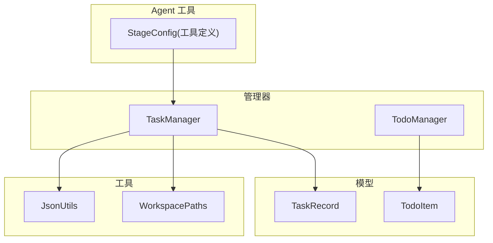
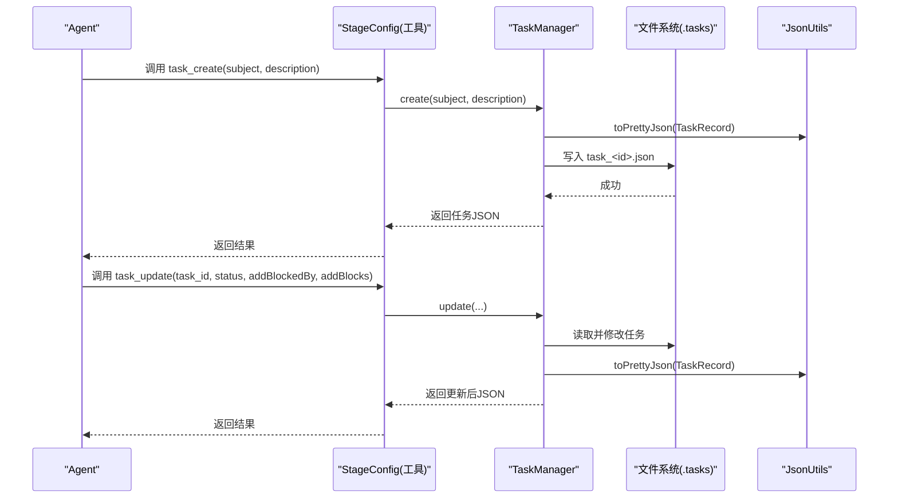
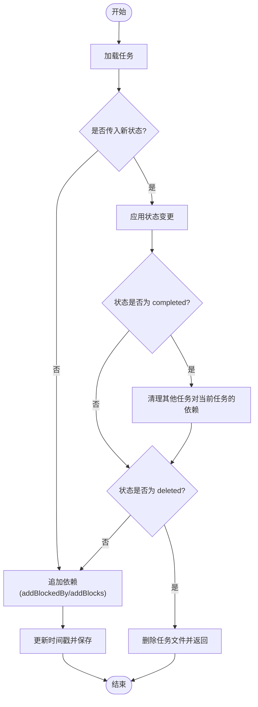
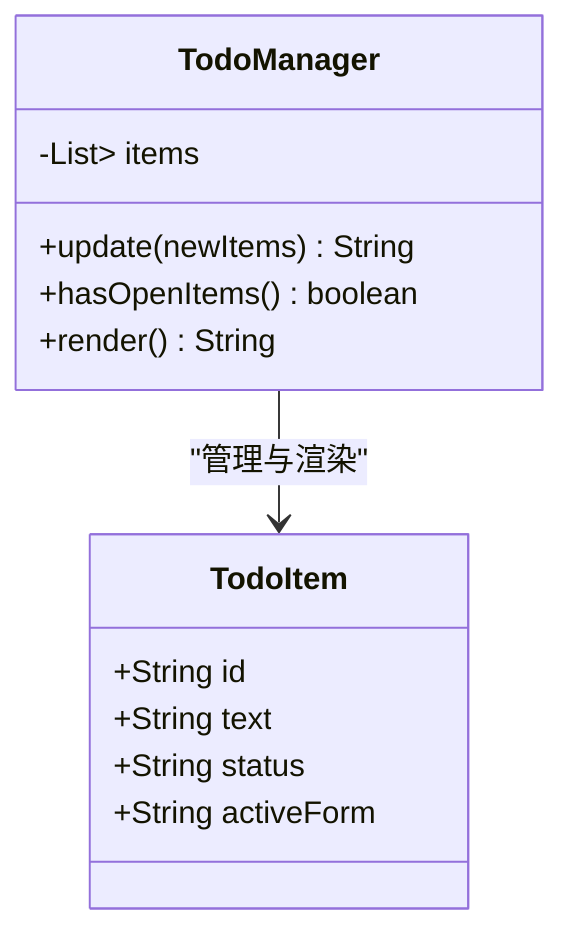
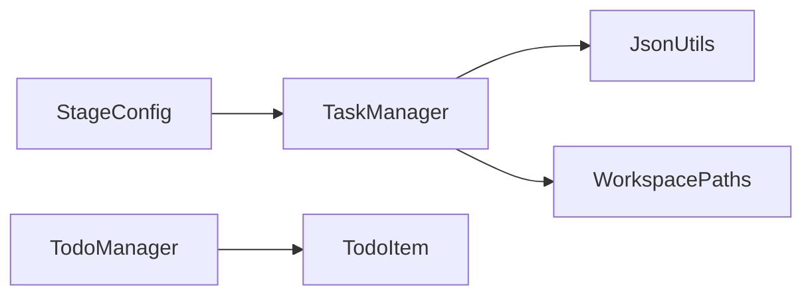

# 任务管理模型

<cite>
**本文引用的文件**
- [TaskRecord.java](file://src/main/java/com/learnclaudecode/model/TaskRecord.java)
- [TodoItem.java](file://src/main/java/com/learnclaudecode/model/TodoItem.java)
- [TaskManager.java](file://src/main/java/com/learnclaudecode/tasks/TaskManager.java)
- [TodoManager.java](file://src/main/java/com/learnclaudecode/tools/TodoManager.java)
- [JsonUtils.java](file://src/main/java/com/learnclaudecode/common/JsonUtils.java)
- [WorkspacePaths.java](file://src/main/java/com/learnclaudecode/common/WorkspacePaths.java)
- [StageConfig.java](file://src/main/java/com/learnclaudecode/agents/StageConfig.java)
</cite>

## 目录
1. [简介](#简介)
2. [项目结构](#项目结构)
3. [核心组件](#核心组件)
4. [架构总览](#架构总览)
5. [详细组件分析](#详细组件分析)
6. [依赖关系分析](#依赖关系分析)
7. [性能考量](#性能考量)
8. [故障排查指南](#故障排查指南)
9. [结论](#结论)
10. [附录：API使用示例与最佳实践](#附录api使用示例与最佳实践)

## 简介
本文件围绕任务管理模型展开，系统性说明 TaskRecord 与 TodoItem 的数据结构与业务逻辑，覆盖任务生命周期、状态转换、依赖关系管理，以及待办事项管理机制。文档同时给出任务创建、更新、跟踪、完成的完整流程，并提供基于 Agent 工具调用的 API 使用示例与最佳实践建议。

## 项目结构
任务管理相关代码主要分布在以下模块：
- 数据模型：model/TaskRecord.java、model/TodoItem.java
- 任务持久化与管理：tasks/TaskManager.java
- 待办项管理：tools/TodoManager.java
- 通用工具：common/JsonUtils.java、common/WorkspacePaths.java
- Agent 工具定义（对外暴露的 task_* 工具）：agents/StageConfig.java

图表来源
- [TaskManager.java:17-338](file://src/main/java/com/learnclaudecode/tasks/TaskManager.java#L17-L338)
- [TaskRecord.java:6-61](file://src/main/java/com/learnclaudecode/model/TaskRecord.java#L6-L61)
- [TodoItem.java:3-7](file://src/main/java/com/learnclaudecode/model/TodoItem.java#L3-L7)
- [TodoManager.java:9-93](file://src/main/java/com/learnclaudecode/tools/TodoManager.java#L9-L93)
- [JsonUtils.java:9-83](file://src/main/java/com/learnclaudecode/common/JsonUtils.java#L9-L83)
- [WorkspacePaths.java:8-150](file://src/main/java/com/learnclaudecode/common/WorkspacePaths.java#L8-L150)
- [StageConfig.java:151-164](file://src/main/java/com/learnclaudecode/agents/StageConfig.java#L151-L164)

章节来源
- [TaskManager.java:17-338](file://src/main/java/com/learnclaudecode/tasks/TaskManager.java#L17-L338)
- [WorkspacePaths.java:77-88](file://src/main/java/com/learnclaudecode/common/WorkspacePaths.java#L77-L88)

## 核心组件
- TaskRecord：任务持久化模型，包含任务标识、主题、描述、状态、认领者、工作树绑定、依赖关系（blockedBy/blocks）、时间戳等字段。
- TodoItem：待办项记录，包含 id、text、status、activeForm 四个字段，用于轻量级待办清单。
- TaskManager：文件型任务系统，提供任务的创建、查询、更新、认领、扫描可认领任务、绑定/解绑 worktree、列出看板视图等能力；所有写操作在同步临界区内执行，保证并发安全。
- TodoManager：内存中的待办项管理器，支持校验、渲染为文本看板，限制最大条目数与“仅允许一个进行中”的约束。
- JsonUtils：统一的 JSON 序列化/反序列化封装。
- WorkspacePaths：工作区路径工具，提供安全的相对路径解析与常用目录访问（如 .tasks）。

章节来源
- [TaskRecord.java:6-61](file://src/main/java/com/learnclaudecode/model/TaskRecord.java#L6-L61)
- [TodoItem.java:3-7](file://src/main/java/com/learnclaudecode/model/TodoItem.java#L3-L7)
- [TaskManager.java:17-338](file://src/main/java/com/learnclaudecode/tasks/TaskManager.java#L17-L338)
- [TodoManager.java:9-93](file://src/main/java/com/learnclaudecode/tools/TodoManager.java#L9-L93)
- [JsonUtils.java:9-83](file://src/main/java/com/learnclaudecode/common/JsonUtils.java#L9-L83)
- [WorkspacePaths.java:8-150](file://src/main/java/com/learnclaudecode/common/WorkspacePaths.java#L8-L150)

## 架构总览
任务管理采用“文件即状态”的简单但稳健的设计：每个任务是一个 JSON 文件，位于工作区的 .tasks 目录下。TaskManager 负责读写这些文件，并通过同步方法确保并发安全。Agent 通过 StageConfig 暴露的工具（task_create、task_update、task_list、task_get）与 TaskManager 交互，完成任务的全生命周期管理。

图表来源
- [StageConfig.java:151-164](file://src/main/java/com/learnclaudecode/agents/StageConfig.java#L151-L164)
- [TaskManager.java:51-133](file://src/main/java/com/learnclaudecode/tasks/TaskManager.java#L51-L133)
- [JsonUtils.java:23-49](file://src/main/java/com/learnclaudecode/common/JsonUtils.java#L23-L49)
- [WorkspacePaths.java:77-88](file://src/main/java/com/learnclaudecode/common/WorkspacePaths.java#L77-L88)

## 详细组件分析

### TaskRecord：数据结构与语义
- 关键字段
  - id：唯一标识
  - subject/description：标题与详细描述
  - status：任务状态（pending、in_progress、completed、deleted）
  - owner：认领者
  - worktree：关联的工作树标识
  - blockedBy/blocks：双向依赖关系（前置依赖与后续阻塞）
  - created_at/updated_at：时间戳
- 设计要点
  - 依赖关系以整数 ID 列表表示，便于跨任务引用
  - 状态与依赖共同决定任务是否可推进

章节来源
- [TaskRecord.java:6-61](file://src/main/java/com/learnclaudecode/model/TaskRecord.java#L6-L61)

### TaskManager：任务生命周期与状态机
- 关键方法
  - create：新建任务，默认状态 pending，生成唯一 id，落盘保存
  - get：按 id 获取任务详情
  - update：统一更新入口，处理状态变更、依赖追加、删除逻辑
  - claim：认领任务，将状态置为 in_progress
  - scanUnclaimed：扫描可立即认领的任务（pending、无 owner、无 blockedBy）
  - bindWorktree/unbindWorktree：绑定/解绑工作树，并在绑定时将 pending 推进到 in_progress
  - listAll：输出人类可读的看板视图
- 状态转换规则
  - pending → in_progress：通过 claim 或 bindWorktree 触发
  - in_progress → completed：通过 update 设置状态为 completed，并清理其他任务对它的依赖
  - 任意状态 → deleted：update 中直接删除任务文件并返回提示
- 依赖管理
  - 新增 blockedBy/addBlocks 时进行去重追加
  - 任务完成后自动清理其他任务对该任务的 blockedBy 依赖
- 并发与一致性
  - 所有写方法加 synchronized，避免并发覆盖
  - 依赖清理后立即落盘，确保多 Agent 读到的状态一致

图表来源
- [TaskManager.java:84-133](file://src/main/java/com/learnclaudecode/tasks/TaskManager.java#L84-L133)
- [TaskManager.java:329-336](file://src/main/java/com/learnclaudecode/tasks/TaskManager.java#L329-L336)

章节来源
- [TaskManager.java:51-133](file://src/main/java/com/learnclaudecode/tasks/TaskManager.java#L51-L133)
- [TaskManager.java:168-197](file://src/main/java/com/learnclaudecode/tasks/TaskManager.java#L168-L197)
- [TaskManager.java:215-249](file://src/main/java/com/learnclaudecode/tasks/TaskManager.java#L215-L249)
- [TaskManager.java:329-336](file://src/main/java/com/learnclaudecode/tasks/TaskManager.java#L329-L336)

### TodoItem 与 TodoManager：待办事项管理
- TodoItem：轻量记录，包含 id、text、status、activeForm
- TodoManager：内存维护待办列表，提供
  - update：批量校验与替换，限制最多 20 条，强制 text/content 必填，状态必须为 pending/in_progress/completed，且仅允许一个 in_progress
  - hasOpenItems：判断是否存在未完成项
  - render：渲染为带进度统计的文本看板
- 适用场景：短期、单会话内的待办清单，适合与任务系统配合使用

图表来源
- [TodoItem.java:3-7](file://src/main/java/com/learnclaudecode/model/TodoItem.java#L3-L7)
- [TodoManager.java:9-93](file://src/main/java/com/learnclaudecode/tools/TodoManager.java#L9-L93)

章节来源
- [TodoItem.java:3-7](file://src/main/java/com/learnclaudecode/model/TodoItem.java#L3-L7)
- [TodoManager.java:21-55](file://src/main/java/com/learnclaudecode/tools/TodoManager.java#L21-L55)
- [TodoManager.java:62-91](file://src/main/java/com/learnclaudecode/tools/TodoManager.java#L62-L91)

## 依赖关系分析
- 组件耦合
  - TaskManager 依赖 JsonUtils 进行序列化/反序列化，依赖 WorkspacePaths 定位 .tasks 目录
  - StageConfig 暴露 task_* 工具，供 Agent 调用 TaskManager
  - TodoManager 独立于 TaskManager，适用于短生命周期待办
- 外部依赖
  - Jackson ObjectMapper（通过 JsonUtils）
  - Java NIO 文件系统（读写 .tasks 下的 JSON 文件）

图表来源
- [StageConfig.java:151-164](file://src/main/java/com/learnclaudecode/agents/StageConfig.java#L151-L164)
- [TaskManager.java:1-16](file://src/main/java/com/learnclaudecode/tasks/TaskManager.java#L1-L16)
- [JsonUtils.java:9-83](file://src/main/java/com/learnclaudecode/common/JsonUtils.java#L9-L83)
- [WorkspacePaths.java:77-88](file://src/main/java/com/learnclaudecode/common/WorkspacePaths.java#L77-L88)
- [TodoManager.java:9-93](file://src/main/java/com/learnclaudecode/tools/TodoManager.java#L9-L93)

章节来源
- [TaskManager.java:1-16](file://src/main/java/com/learnclaudecode/tasks/TaskManager.java#L1-L16)
- [StageConfig.java:151-164](file://src/main/java/com/learnclaudecode/agents/StageConfig.java#L151-L164)

## 性能考量
- 文件 I/O 成本：每次更新都会读写磁盘，建议在批量更新时合并多次调用以减少 IO
- 并发控制：TaskManager 使用 synchronized 保护临界区，避免竞态条件；在高并发场景下可能成为瓶颈
- 依赖清理：任务完成时会遍历所有任务清理依赖，任务量较大时注意性能影响
- 内存占用：TodoManager 为内存存储，适合小规模待办；若需持久化应结合外部存储

[本节为通用指导，不直接分析具体文件]

## 故障排查指南
- 常见异常
  - 任务不存在：get/load 时抛出非法参数异常
  - 文件读写失败：IOException 被包装为 IllegalStateException
  - 删除失败：deleteIfExists 抛异常时包装为 IllegalStateException
- 排查步骤
  - 检查 .tasks 目录是否存在及权限
  - 确认任务 ID 是否正确
  - 查看 JSON 文件格式是否损坏
  - 检查依赖清理逻辑是否生效（completed 后 blockedBy 是否清空）

章节来源
- [TaskManager.java:276-322](file://src/main/java/com/learnclaudecode/tasks/TaskManager.java#L276-L322)
- [TaskManager.java:95-104](file://src/main/java/com/learnclaudecode/tasks/TaskManager.java#L95-L104)

## 结论
该任务管理系统以极简的文件持久化实现可靠的任务板，具备清晰的状态机与依赖管理能力。TaskRecord 表达任务全貌，TaskManager 提供并发安全的 CRUD 与依赖清理，TodoManager 提供轻量待办清单。通过 StageConfig 暴露的 Agent 工具，可实现端到端的任务规划与跟踪。

[本节为总结性内容，不直接分析具体文件]

## 附录：API使用示例与最佳实践

### 任务管理 API（通过 Agent 工具）
- 创建任务
  - 工具名：task_create
  - 输入：subject、description
  - 行为：创建任务，状态为 pending，返回任务 JSON
  - 参考：[StageConfig.java:151-164](file://src/main/java/com/learnclaudecode/agents/StageConfig.java#L151-L164)，[TaskManager.java:51-61](file://src/main/java/com/learnclaudecode/tasks/TaskManager.java#L51-L61)
- 更新任务
  - 工具名：task_update
  - 输入：task_id、status、addBlockedBy、addBlocks
  - 行为：更新状态与依赖；completed 时清理依赖；deleted 时删除文件
  - 参考：[TaskManager.java:84-133](file://src/main/java/com/learnclaudecode/tasks/TaskManager.java#L84-L133)
- 列出任务
  - 工具名：task_list
  - 行为：返回人类可读的看板视图
  - 参考：[TaskManager.java:140-159](file://src/main/java/com/learnclaudecode/tasks/TaskManager.java#L140-L159)
- 获取任务详情
  - 工具名：task_get
  - 输入：task_id
  - 行为：返回任务 JSON
  - 参考：[TaskManager.java:69-71](file://src/main/java/com/learnclaudecode/tasks/TaskManager.java#L69-L71)

### 待办项 API（内存）
- 更新待办列表
  - 方法：update(List<Map>)
  - 约束：最多 20 条；text/content 必填；状态合法；仅允许一个 in_progress
  - 参考：[TodoManager.java:21-55](file://src/main/java/com/learnclaudecode/tools/TodoManager.java#L21-L55)
- 渲染看板
  - 方法：render()
  - 行为：输出带进度统计的文本
  - 参考：[TodoManager.java:71-91](file://src/main/java/com/learnclaudecode/tools/TodoManager.java#L71-L91)

### 最佳实践
- 任务粒度：保持任务小而明确，便于依赖建模与并行推进
- 依赖建模：优先使用 blockedBy 表达前置依赖，blocks 用于反向追踪
- 状态推进：通过 claim 或 bindWorktree 进入 in_progress；完成后及时清理依赖
- 并发安全：避免绕过 TaskManager 直接操作 .tasks 目录
- 错误处理：捕获并记录 IOException/IllegalStateException，必要时回滚或重试
- 性能优化：批量更新合并调用；大任务集谨慎使用依赖清理

章节来源
- [StageConfig.java:151-164](file://src/main/java/com/learnclaudecode/agents/StageConfig.java#L151-L164)
- [TaskManager.java:51-133](file://src/main/java/com/learnclaudecode/tasks/TaskManager.java#L51-L133)
- [TaskManager.java:140-159](file://src/main/java/com/learnclaudecode/tasks/TaskManager.java#L140-L159)
- [TodoManager.java:21-91](file://src/main/java/com/learnclaudecode/tools/TodoManager.java#L21-L91)