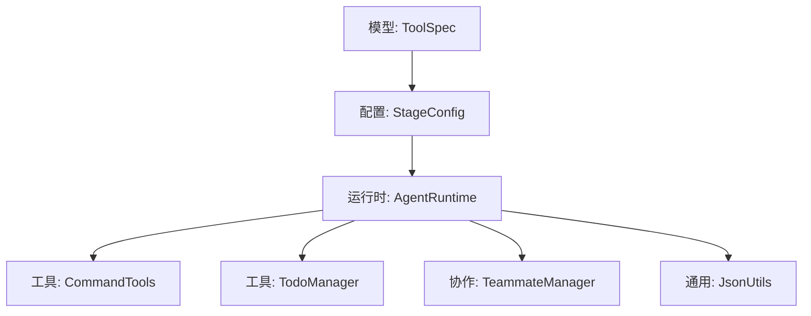
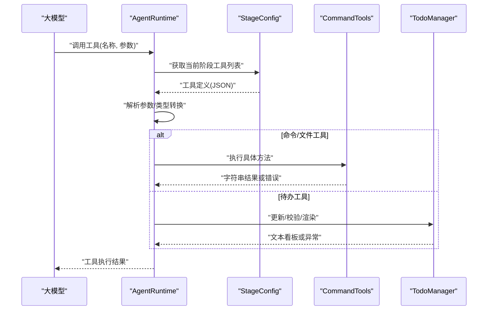
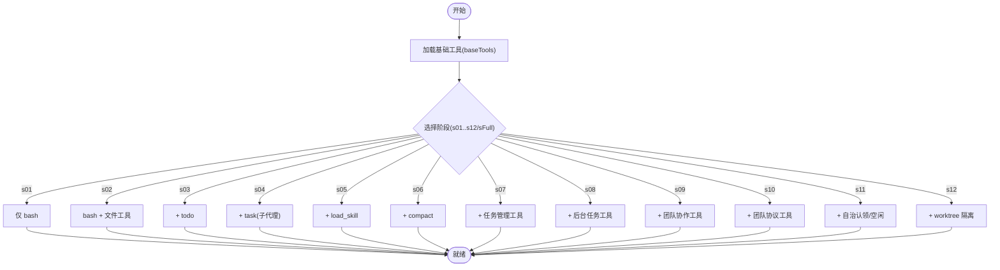
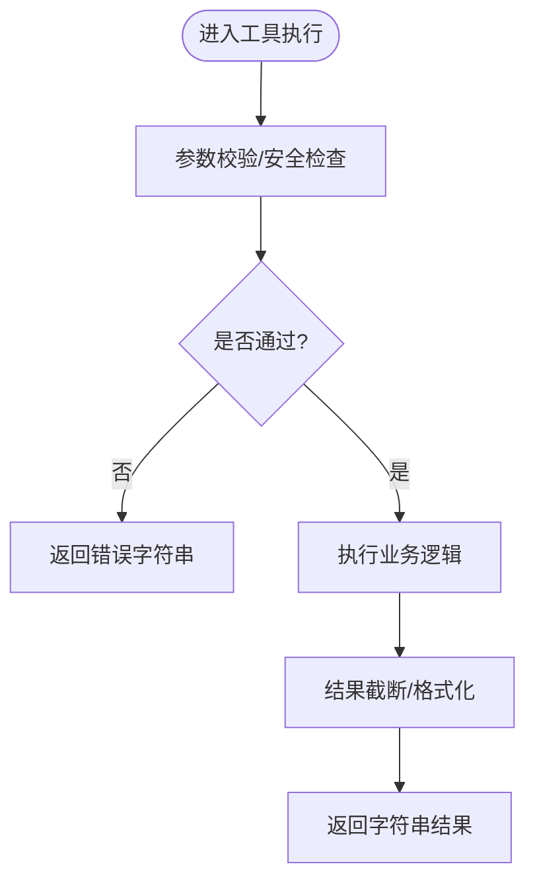
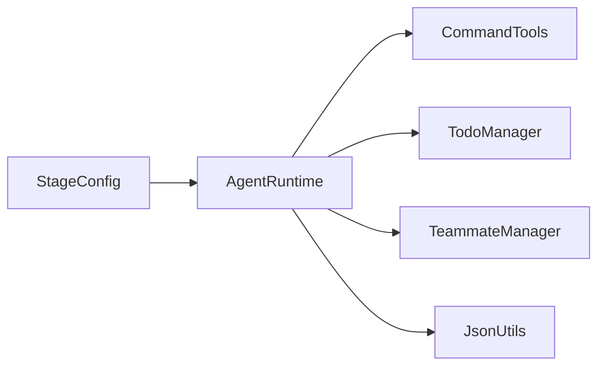

# 工具规格模型

<cite>
**本文引用的文件**
- [ToolSpec.java](file://src/main/java/com/learnclaudecode/model/ToolSpec.java)
- [StageConfig.java](file://src/main/java/com/learnclaudecode/agents/StageConfig.java)
- [AgentRuntime.java](file://src/main/java/com/learnclaudecode/agents/AgentRuntime.java)
- [CommandTools.java](file://src/main/java/com/learnclaudecode/tools/CommandTools.java)
- [TodoManager.java](file://src/main/java/com/learnclaudecode/tools/TodoManager.java)
- [TeammateManager.java](file://src/main/java/com/learnclaudecode/team/TeammateManager.java)
- [JsonUtils.java](file://src/main/java/com/learnclaudecode/common/JsonUtils.java)
</cite>

## 目录
1. [简介](#简介)
2. [项目结构](#项目结构)
3. [核心组件](#核心组件)
4. [架构总览](#架构总览)
5. [详细组件分析](#详细组件分析)
6. [依赖关系分析](#依赖关系分析)
7. [性能考虑](#性能考虑)
8. [故障排查指南](#故障排查指南)
9. [结论](#结论)
10. [附录](#附录)

## 简介
本文件围绕“工具规格模型”展开，重点说明 ToolSpec 类的设计与用途，并基于仓库中的实际实现，完整解释：
- 工具规格的字段定义、参数验证规则与返回类型约定
- 工具调用时的数据格式规范（输入 schema、参数传递、返回值）
- 工具的注册与使用流程（从配置到运行时分派）
- 工具开发示例（以命令与文件操作、待办管理为例），包括参数定义、错误处理与返回值封装

该文档既适合初学者理解整体机制，也便于开发者快速定位关键实现位置。

## 项目结构
本项目采用分层组织：
- 模型层：工具规格描述（ToolSpec）
- 配置层：阶段能力编排与工具声明（StageConfig）
- 运行时层：工具调用分发与执行（AgentRuntime）
- 工具实现层：具体工具逻辑（CommandTools、TodoManager）
- 协作扩展：队友工具装配（TeammateManager）
- 通用工具：JSON 序列化（JsonUtils）

图表来源
- [ToolSpec.java:1-10](file://src/main/java/com/learnclaudecode/model/ToolSpec.java#L1-L10)
- [StageConfig.java:56-70](file://src/main/java/com/learnclaudecode/agents/StageConfig.java#L56-L70)
- [AgentRuntime.java:187-202](file://src/main/java/com/learnclaudecode/agents/AgentRuntime.java#L187-L202)
- [CommandTools.java:36-65](file://src/main/java/com/learnclaudecode/tools/CommandTools.java#L36-L65)
- [TodoManager.java:21-55](file://src/main/java/com/learnclaudecode/tools/TodoManager.java#L21-L55)
- [TeammateManager.java:281-310](file://src/main/java/com/learnclaudecode/team/TeammateManager.java#L281-L310)
- [JsonUtils.java:13-15](file://src/main/java/com/learnclaudecode/common/JsonUtils.java#L13-L15)

章节来源
- [ToolSpec.java:1-10](file://src/main/java/com/learnclaudecode/model/ToolSpec.java#L1-L10)
- [StageConfig.java:56-70](file://src/main/java/com/learnclaudecode/agents/StageConfig.java#L56-L70)
- [AgentRuntime.java:187-202](file://src/main/java/com/learnclaudecode/agents/AgentRuntime.java#L187-L202)

## 核心组件
- 工具规格模型 ToolSpec：用于对齐 Claude messages API 的工具描述结构，包含名称、描述与输入 schema。
- 阶段配置 StageConfig：集中定义各教学阶段的系统提示词、可用工具集合以及高级开关；提供 baseTools 与 tool 构造器，统一生成符合 API 约定的工具定义。
- 运行时 AgentRuntime：将模型侧的工具调用请求映射到本地 Java 实现，完成参数提取、校验与执行，并返回字符串化结果。
- 工具实现 CommandTools：提供 bash 执行、文件读取/写入/编辑等基础能力，内置安全黑名单与超时控制。
- 工具实现 TodoManager：维护任务清单，支持状态校验、并发 in_progress 限制与文本渲染。
- 协作扩展 TeammateManager：为队友装配工具集，按自治模式动态增减能力。
- 通用工具 JsonUtils：统一的 JSON 序列化/反序列化入口。

章节来源
- [ToolSpec.java:1-10](file://src/main/java/com/learnclaudecode/model/ToolSpec.java#L1-L10)
- [StageConfig.java:56-70](file://src/main/java/com/learnclaudecode/agents/StageConfig.java#L56-L70)
- [AgentRuntime.java:187-202](file://src/main/java/com/learnclaudecode/agents/AgentRuntime.java#L187-L202)
- [CommandTools.java:36-65](file://src/main/java/com/learnclaudecode/tools/CommandTools.java#L36-L65)
- [TodoManager.java:21-55](file://src/main/java/com/learnclaudecode/tools/TodoManager.java#L21-L55)
- [TeammateManager.java:281-310](file://src/main/java/com/learnclaudecode/team/TeammateManager.java#L281-L310)
- [JsonUtils.java:13-15](file://src/main/java/com/learnclaudecode/common/JsonUtils.java#L13-L15)

## 架构总览
下图展示了工具从“声明”到“执行”的端到端流程：配置层声明工具，运行时根据模型调用进行分发，最终由具体工具实现执行并返回结果。

图表来源
- [StageConfig.java:56-70](file://src/main/java/com/learnclaudecode/agents/StageConfig.java#L56-L70)
- [AgentRuntime.java:187-202](file://src/main/java/com/learnclaudecode/agents/AgentRuntime.java#L187-L202)
- [CommandTools.java:36-65](file://src/main/java/com/learnclaudecode/tools/CommandTools.java#L36-L65)
- [TodoManager.java:21-55](file://src/main/java/com/learnclaudecode/tools/TodoManager.java#L21-L55)

## 详细组件分析

### ToolSpec 工具规格模型
- 设计目标：对齐 Claude messages API 的工具描述结构，作为工具元数据的轻量表示。
- 字段定义：
  - name：工具唯一标识名
  - description：工具功能描述
  - input_schema：输入参数的 JSON Schema（对象类型，含 properties 与 required 等）
- 复杂度与约束：
  - 时间复杂度 O(1)，空间复杂度 O(1)
  - 需保证 input_schema 与工具实现严格一致，否则运行时参数解析会失败
- 典型用法：由 StageConfig 通过 tool(name, description, schema) 构造，再注入 AgentRuntime 的工具表

章节来源
- [ToolSpec.java:1-10](file://src/main/java/com/learnclaudecode/model/ToolSpec.java#L1-L10)
- [StageConfig.java:277-284](file://src/main/java/com/learnclaudecode/agents/StageConfig.java#L277-L284)

### 工具注册与使用流程
- 注册阶段（配置期）：
  - StageConfig.baseTools() 提供基础工具（bash、read_file、write_file、edit_file）
  - 各阶段方法（s01..s12、sFull）按需叠加更多工具（todo、task、load_skill、compact、background_*、worktree_* 等）
  - tool(name, description, schema) 统一生成符合 API 的工具定义
- 使用阶段（运行期）：
  - AgentRuntime 接收模型的工具调用消息
  - 根据工具名分派到对应 Java 方法，提取参数并执行
  - 将执行结果序列化为字符串返回给模型
- 队友工具装配：
  - TeammateManager.teammateTools() 在 baseTools 基础上按自治模式追加消息与协议相关工具

图表来源
- [StageConfig.java:56-70](file://src/main/java/com/learnclaudecode/agents/StageConfig.java#L56-L70)
- [StageConfig.java:77-267](file://src/main/java/com/learnclaudecode/agents/StageConfig.java#L77-L267)
- [TeammateManager.java:281-310](file://src/main/java/com/learnclaudecode/team/TeammateManager.java#L281-L310)

章节来源
- [StageConfig.java:56-70](file://src/main/java/com/learnclaudecode/agents/StageConfig.java#L56-L70)
- [StageConfig.java:77-267](file://src/main/java/com/learnclaudecode/agents/StageConfig.java#L77-L267)
- [TeammateManager.java:281-310](file://src/main/java/com/learnclaudecode/team/TeammateManager.java#L281-L310)

### 参数验证规则与返回类型
- 参数验证
  - 命令工具：黑名单拦截危险命令；超时保护（120秒）；输出长度限制（约50KB）
  - 文件工具：路径安全解析；读取时支持行数限制；写入自动创建父目录；编辑要求精确匹配原文
  - 待办工具：最多20项；每项必须包含文本；状态仅限 pending/in_progress/completed；同时仅允许一个 in_progress
- 返回类型
  - 所有工具统一返回字符串结果，便于模型消费；错误以“Error: ...”前缀明确标识
  - 待办工具返回渲染后的文本看板，便于人类阅读

图表来源
- [CommandTools.java:36-65](file://src/main/java/com/learnclaudecode/tools/CommandTools.java#L36-L65)
- [CommandTools.java:87-101](file://src/main/java/com/learnclaudecode/tools/CommandTools.java#L87-L101)
- [CommandTools.java:110-121](file://src/main/java/com/learnclaudecode/tools/CommandTools.java#L110-L121)
- [CommandTools.java:131-144](file://src/main/java/com/learnclaudecode/tools/CommandTools.java#L131-L144)
- [TodoManager.java:21-55](file://src/main/java/com/learnclaudecode/tools/TodoManager.java#L21-L55)

章节来源
- [CommandTools.java:36-65](file://src/main/java/com/learnclaudecode/tools/CommandTools.java#L36-L65)
- [CommandTools.java:87-101](file://src/main/java/com/learnclaudecode/tools/CommandTools.java#L87-L101)
- [CommandTools.java:110-121](file://src/main/java/com/learnclaudecode/tools/CommandTools.java#L110-L121)
- [CommandTools.java:131-144](file://src/main/java/com/learnclaudecode/tools/CommandTools.java#L131-L144)
- [TodoManager.java:21-55](file://src/main/java/com/learnclaudecode/tools/TodoManager.java#L21-L55)

### 工具调用数据格式规范
- 工具定义（注册时）
  - 字段：name、description、input_schema
  - input_schema 遵循 JSON Schema 风格，包含 type、properties、required 等
- 工具调用（运行时）
  - 工具名：字符串，如 bash、read_file、write_file、edit_file、todo、task、load_skill、compact、background_run、check_background、spawn_teammate、list_teammates、send_message、read_inbox、broadcast、shutdown_request、plan_approval、claim_task、idle、worktree_create、worktree_list、worktree_remove、worktree_events
  - 参数：依据 input_schema 的 properties 与 required 决定；AgentRuntime 负责类型转换与缺失值处理
- 工具返回
  - 统一字符串；错误以“Error: ...”开头；成功结果尽量简洁且可被模型理解

章节来源
- [StageConfig.java:277-284](file://src/main/java/com/learnclaudecode/agents/StageConfig.java#L277-L284)
- [AgentRuntime.java:187-202](file://src/main/java/com/learnclaudecode/agents/AgentRuntime.java#L187-L202)
- [TeammateManager.java:281-310](file://src/main/java/com/learnclaudecode/team/TeammateManager.java#L281-L310)

### 工具开发示例（基于仓库现有实现）
- 示例一：命令与文件工具（CommandTools）
  - 参数定义：command、path、limit、content、old_text、new_text
  - 验证与安全：黑名单、超时、路径安全、内容长度限制
  - 返回值：成功输出或“Error: ...”
- 示例二：待办工具（TodoManager）
  - 参数定义：items（数组），每项含 id、text/content、status、activeForm
  - 验证规则：最大数量、必填文本、状态枚举、in_progress 唯一性
  - 返回值：渲染后的文本看板
- 示例三：队友工具（TeammateManager）
  - 参数定义：send_message(to, content, msg_type)、read_inbox()、claim_task(task_id)、idle()、shutdown_response(request_id, approve, reason)、plan_approval(plan)
  - 返回值：字符串化结果

章节来源
- [CommandTools.java:36-65](file://src/main/java/com/learnclaudecode/tools/CommandTools.java#L36-L65)
- [CommandTools.java:87-101](file://src/main/java/com/learnclaudecode/tools/CommandTools.java#L87-L101)
- [CommandTools.java:110-121](file://src/main/java/com/learnclaudecode/tools/CommandTools.java#L110-L121)
- [CommandTools.java:131-144](file://src/main/java/com/learnclaudecode/tools/CommandTools.java#L131-L144)
- [TodoManager.java:21-55](file://src/main/java/com/learnclaudecode/tools/TodoManager.java#L21-L55)
- [TeammateManager.java:281-310](file://src/main/java/com/learnclaudecode/team/TeammateManager.java#L281-L310)

## 依赖关系分析
- 低耦合高内聚：
  - 配置层（StageConfig）只负责声明工具，不关心实现细节
  - 运行时（AgentRuntime）通过工具名路由到具体实现，解耦了调用方与被调用方
  - 工具实现（CommandTools、TodoManager）专注业务逻辑与错误处理
- 外部依赖：
  - JSON 序列化统一通过 JsonUtils，避免分散配置
  - 文件系统访问集中在 CommandTools，配合 WorkspacePaths 做安全路径解析（由调用方传入）

图表来源
- [StageConfig.java:56-70](file://src/main/java/com/learnclaudecode/agents/StageConfig.java#L56-L70)
- [AgentRuntime.java:187-202](file://src/main/java/com/learnclaudecode/agents/AgentRuntime.java#L187-L202)
- [CommandTools.java:36-65](file://src/main/java/com/learnclaudecode/tools/CommandTools.java#L36-L65)
- [TodoManager.java:21-55](file://src/main/java/com/learnclaudecode/tools/TodoManager.java#L21-L55)
- [TeammateManager.java:281-310](file://src/main/java/com/learnclaudecode/team/TeammateManager.java#L281-L310)
- [JsonUtils.java:13-15](file://src/main/java/com/learnclaudecode/common/JsonUtils.java#L13-L15)

章节来源
- [StageConfig.java:56-70](file://src/main/java/com/learnclaudecode/agents/StageConfig.java#L56-L70)
- [AgentRuntime.java:187-202](file://src/main/java/com/learnclaudecode/agents/AgentRuntime.java#L187-L202)

## 性能考虑
- 命令执行超时：默认120秒，防止长时间阻塞
- 输出裁剪：命令与文件读取结果限制在约50KB，避免上下文溢出
- 文件读取行数限制：read_file 支持 limit 参数，减少不必要的数据传输
- 去重合并：多阶段工具合并时使用名字去重，避免重复定义带来的冗余

[本节为通用指导，不直接分析具体文件]

## 故障排查指南
- 常见错误与定位
  - 危险命令被拦截：检查命令是否命中黑名单
  - 超时错误：确认命令耗时是否超过120秒
  - 文件路径错误：确保相对路径在工作区内且存在
  - 编辑失败：确认 old_text 精确匹配原文
  - 待办校验失败：检查 items 数量、必填字段、状态枚举与 in_progress 唯一性
- 建议的调试步骤
  - 打印工具定义与参数，确认 input_schema 与实际调用一致
  - 逐步缩小问题范围：先测试最小参数集，再逐步增加
  - 关注返回字符串中的“Error: ”前缀，快速识别异常

章节来源
- [CommandTools.java:36-65](file://src/main/java/com/learnclaudecode/tools/CommandTools.java#L36-L65)
- [CommandTools.java:87-101](file://src/main/java/com/learnclaudecode/tools/CommandTools.java#L87-L101)
- [CommandTools.java:110-121](file://src/main/java/com/learnclaudecode/tools/CommandTools.java#L110-L121)
- [CommandTools.java:131-144](file://src/main/java/com/learnclaudecode/tools/CommandTools.java#L131-L144)
- [TodoManager.java:21-55](file://src/main/java/com/learnclaudecode/tools/TodoManager.java#L21-L55)

## 结论
- ToolSpec 提供了与 Claude messages API 对齐的工具规格描述，结合 StageConfig 的集中式工具声明，实现了灵活的能力编排。
- AgentRuntime 作为调度中枢，将模型的工具调用映射到本地实现，保证了可扩展性与一致性。
- 工具实现遵循统一的参数验证与返回约定，便于错误定位与模型消费。
- 通过本规范，开发者可以快速新增工具：定义 schema、实现逻辑、并在 StageConfig 中注册。

[本节为总结性内容，不直接分析具体文件]

## 附录
- 常用工具一览（来自各阶段配置）
  - 基础：bash、read_file、write_file、edit_file
  - 规划：todo
  - 子代理：task
  - 知识：load_skill
  - 上下文：compact
  - 任务：task_create、task_update、task_list、task_get
  - 后台：background_run、check_background
  - 团队：spawn_teammate、list_teammates、send_message、read_inbox、broadcast、shutdown_request、plan_approval、shutdown_response
  - 自治：claim_task、idle
  - 工作区隔离：worktree_create、worktree_list、worktree_remove、worktree_events

章节来源
- [StageConfig.java:77-267](file://src/main/java/com/learnclaudecode/agents/StageConfig.java#L77-L267)
- [TeammateManager.java:281-310](file://src/main/java/com/learnclaudecode/team/TeammateManager.java#L281-L310)