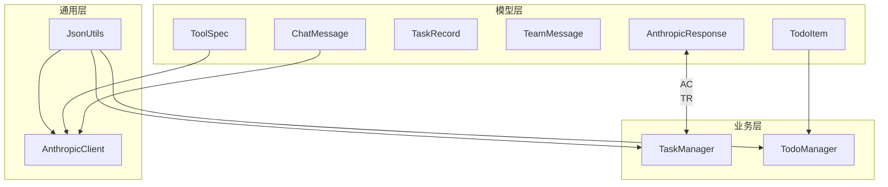
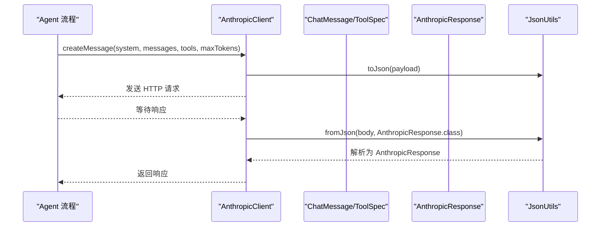
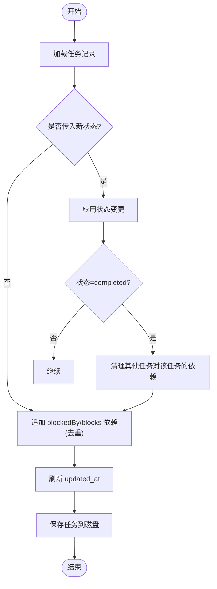
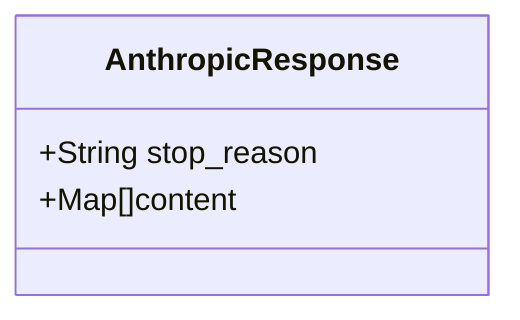
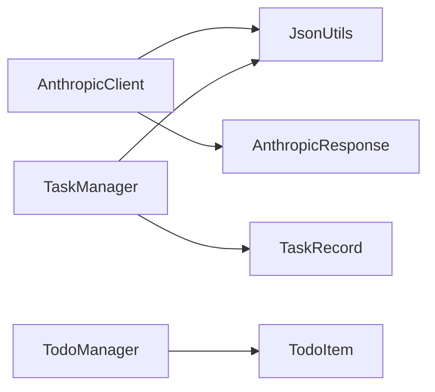

# 数据模型设计

<cite>
**本文引用的文件**
- [ChatMessage.java](file://src/main/java/com/learnclaudecode/model/ChatMessage.java)
- [ToolSpec.java](file://src/main/java/com/learnclaudecode/model/ToolSpec.java)
- [TaskRecord.java](file://src/main/java/com/learnclaudecode/model/TaskRecord.java)
- [TeamMessage.java](file://src/main/java/com/learnclaudecode/model/TeamMessage.java)
- [TodoItem.java](file://src/main/java/com/learnclaudecode/model/TodoItem.java)
- [AnthropicResponse.java](file://src/main/java/com/learnclaudecode/model/AnthropicResponse.java)
- [JsonUtils.java](file://src/main/java/com/learnclaudecode/common/JsonUtils.java)
- [AnthropicClient.java](file://src/main/java/com/learnclaudecode/common/AnthropicClient.java)
- [TodoManager.java](file://src/main/java/com/learnclaudecode/tools/TodoManager.java)
- [TaskManager.java](file://src/main/java/com/learnclaudecode/tasks/TaskManager.java)
</cite>

## 目录
1. [简介](#简介)
2. [项目结构](#项目结构)
3. [核心组件](#核心组件)
4. [架构总览](#架构总览)
5. [详细组件分析](#详细组件分析)
6. [依赖关系分析](#依赖关系分析)
7. [性能考量](#性能考量)
8. [故障排查指南](#故障排查指南)
9. [结论](#结论)
10. [附录](#附录)

## 简介
本文件聚焦于系统中的核心数据模型设计与实现，覆盖 ChatMessage、ToolSpec、TaskRecord、TeamMessage、TodoItem 以及 AnthropicResponse 等关键实体。文档从字段定义、设计理念、关联关系、数据流转、JSON 序列化与反序列化配置、数据验证规则与业务约束等方面进行全面说明，帮助读者快速理解并正确使用这些模型。

## 项目结构
数据模型集中在 model 包中，配合 common 中的 JSON 工具与 HTTP 客户端，以及 tools、tasks 等业务模块对模型的使用。整体组织方式遵循“领域模型 + 工具/服务”的分层思路：
- model：纯数据结构（record/class），无副作用
- common：通用能力（JSON、HTTP 调用）
- tools/tasks：业务逻辑与持久化，消费 model

图表来源
- [AnthropicClient.java:52-95](file://src/main/java/com/learnclaudecode/common/AnthropicClient.java#L52-L95)
- [JsonUtils.java:12-82](file://src/main/java/com/learnclaudecode/common/JsonUtils.java#L12-L82)
- [TaskManager.java:51-133](file://src/main/java/com/learnclaudecode/tasks/TaskManager.java#L51-L133)
- [TodoManager.java:21-55](file://src/main/java/com/learnclaudecode/tools/TodoManager.java#L21-L55)

章节来源
- [AnthropicClient.java:52-95](file://src/main/java/com/learnclaudecode/common/AnthropicClient.java#L52-L95)
- [JsonUtils.java:12-82](file://src/main/java/com/learnclaudecode/common/JsonUtils.java#L12-L82)
- [TaskManager.java:51-133](file://src/main/java/com/learnclaudecode/tasks/TaskManager.java#L51-L133)
- [TodoManager.java:21-55](file://src/main/java/com/learnclaudecode/tools/TodoManager.java#L21-L55)

## 核心组件
本节概述各核心模型的职责与设计要点：
- ChatMessage：对话消息的最小单元，role 表示角色，content 支持文本或结构化 tool_result，便于与 Claude messages API 对齐。
- ToolSpec：工具描述，包含 name、description、input_schema，用于向模型声明可用工具及其输入结构。
- TaskRecord：任务持久化模型，承载任务元信息、状态、依赖关系、工作区绑定与时间戳。
- TeamMessage：团队内部消息载体，type/from/content/timestamp/extra 构成统一的消息协议。
- TodoItem：待办条目，id/text/status/activeForm 表达最小可执行项。
- AnthropicResponse：Claude messages API 响应的轻量映射，stop_reason 与 content 列表。

章节来源
- [ChatMessage.java:3-7](file://src/main/java/com/learnclaudecode/model/ChatMessage.java#L3-L7)
- [ToolSpec.java:5-9](file://src/main/java/com/learnclaudecode/model/ToolSpec.java#L5-L9)
- [TaskRecord.java:6-61](file://src/main/java/com/learnclaudecode/model/TaskRecord.java#L6-L61)
- [TeamMessage.java:6-34](file://src/main/java/com/learnclaudecode/model/TeamMessage.java#L6-L34)
- [TodoItem.java:3-7](file://src/main/java/com/learnclaudecode/model/TodoItem.java#L3-L7)
- [AnthropicResponse.java:8-13](file://src/main/java/com/learnclaudecode/model/AnthropicResponse.java#L8-L13)

## 架构总览
下图展示数据模型在系统调用链中的位置：Agent 通过 AnthropicClient 发送消息与工具定义，服务端返回响应；任务与待办由各自管理器读写模型并持久化。

图表来源
- [AnthropicClient.java:52-95](file://src/main/java/com/learnclaudecode/common/AnthropicClient.java#L52-L95)
- [JsonUtils.java:29-80](file://src/main/java/com/learnclaudecode/common/JsonUtils.java#L29-L80)
- [AnthropicResponse.java:11-13](file://src/main/java/com/learnclaudecode/model/AnthropicResponse.java#L11-L13)

## 详细组件分析

### ChatMessage
- 设计目标：以最小字段表达对话消息，兼容文本与结构化 tool_result。
- 字段：
  - role：消息角色（如 user、assistant、tool 等）。
  - content：内容体，类型为 Object，允许字符串或结构化对象（例如 tool_result 列表）。
- 使用场景：作为 messages 数组元素发送给模型，或在工具调用后回传结果。
- 序列化：由 JsonUtils 统一管理，默认紧凑输出；如需格式化可使用 toPrettyJson。

章节来源
- [ChatMessage.java:3-7](file://src/main/java/com/learnclaudecode/model/ChatMessage.java#L3-L7)
- [JsonUtils.java:29-48](file://src/main/java/com/learnclaudecode/common/JsonUtils.java#L29-L48)

### ToolSpec
- 设计目标：对齐 Claude messages API 的工具描述结构，使模型能正确识别并调用工具。
- 字段：
  - name：工具名称。
  - description：工具用途说明。
  - input_schema：输入参数 schema，Map<String, Object> 形式，便于灵活扩展。
- 使用场景：随请求一并发送给模型，驱动 tool_use 行为。

章节来源
- [ToolSpec.java:5-9](file://src/main/java/com/learnclaudecode/model/ToolSpec.java#L5-L9)

### TaskRecord
- 设计目标：任务持久化模型，支撑任务创建、更新、依赖管理与工作区绑定。
- 字段：
  - id：唯一标识。
  - subject：任务主题。
  - description：详细描述。
  - status：状态（pending/in_progress/completed/deleted）。
  - owner：认领者。
  - worktree：绑定的工作区标识。
  - blockedBy：前置依赖 ID 列表。
  - blocks：被当前任务阻塞的后续任务 ID 列表。
  - created_at/updated_at：Unix 秒级时间戳。
- 业务规则与约束：
  - 状态机：completed 时自动清理其他任务的 blockedBy 依赖；deleted 直接删除文件。
  - 依赖管理：追加依赖时去重；完成时清理依赖。
  - 工作区绑定：绑定 worktree 且原状态为 pending 时推进为 in_progress。
  - 并发安全：所有写操作同步临界区保护。
- 持久化：每个任务一个 JSON 文件，路径基于 id。

图表来源
- [TaskManager.java:84-133](file://src/main/java/com/learnclaudecode/tasks/TaskManager.java#L84-L133)
- [TaskManager.java:329-336](file://src/main/java/com/learnclaudecode/tasks/TaskManager.java#L329-L336)

章节来源
- [TaskRecord.java:6-61](file://src/main/java/com/learnclaudecode/model/TaskRecord.java#L6-L61)
- [TaskManager.java:51-133](file://src/main/java/com/learnclaudecode/tasks/TaskManager.java#L51-L133)
- [TaskManager.java:168-235](file://src/main/java/com/learnclaudecode/tasks/TaskManager.java#L168-L235)
- [TaskManager.java:276-336](file://src/main/java/com/learnclaudecode/tasks/TaskManager.java#L276-L336)

### TeamMessage
- 设计目标：统一的团队消息协议，支持不同类型消息的扩展。
- 字段：
  - type：消息类型（message/broadcast/shutdown_request 等）。
  - from：发送者标识。
  - content：正文。
  - timestamp：Unix 时间戳。
  - extra：扩展字段 Map，承载不同消息类型的附加数据。
- 使用场景：团队内异步通信、广播通知、控制信号等。

章节来源
- [TeamMessage.java:6-34](file://src/main/java/com/learnclaudecode/model/TeamMessage.java#L6-L34)

### TodoItem
- 设计目标：最小化的待办条目模型，便于渲染与状态跟踪。
- 字段：
  - id：条目标识。
  - text：任务文本。
  - status：状态（pending/in_progress/completed）。
  - activeForm：当前活跃形式的文本（常用于高亮显示）。
- 使用场景：与 TodoManager 配合，进行校验、渲染与看板输出。

章节来源
- [TodoItem.java:3-7](file://src/main/java/com/learnclaudecode/model/TodoItem.java#L3-L7)

### AnthropicResponse
- 设计目标：轻量映射 Claude messages API 响应，屏蔽无关字段。
- 字段：
  - stop_reason：停止原因。
  - content：内容列表，元素为 Map<String, Object>，可包含文本或工具调用片段。
- 注解：@JsonIgnoreProperties(ignoreUnknown = true) 忽略未知字段，提升兼容性。
- 使用场景：接收模型响应后交由上层判断是文本回复还是 tool_use。

图表来源
- [AnthropicResponse.java:11-13](file://src/main/java/com/learnclaudecode/model/AnthropicResponse.java#L11-L13)

章节来源
- [AnthropicResponse.java:8-13](file://src/main/java/com/learnclaudecode/model/AnthropicResponse.java#L8-L13)

## 依赖关系分析
- 模型之间松耦合：
  - ChatMessage 与 ToolSpec 主要用于与模型交互的请求构造。
  - TaskRecord 与 TeamMessage 分别服务于任务系统与团队协作。
  - TodoItem 与 TaskRecord 语义相近但粒度不同，前者偏 UI/看板，后者偏持久化。
- 外部依赖：
  - JsonUtils：提供 ObjectMapper 实例与统一序列化/反序列化方法。
  - AnthropicClient：封装 HTTP 调用，将 JSON 载荷与响应映射到模型。
- 耦合点：
  - AnthropicClient 依赖 JsonUtils 与 AnthropicResponse。
  - TaskManager 依赖 JsonUtils 与 TaskRecord。
  - TodoManager 依赖 TodoItem（实际内部使用 Map 存储，但对外暴露 TodoItem 概念）。

图表来源
- [AnthropicClient.java:52-95](file://src/main/java/com/learnclaudecode/common/AnthropicClient.java#L52-L95)
- [TaskManager.java:51-133](file://src/main/java/com/learnclaudecode/tasks/TaskManager.java#L51-L133)
- [TodoManager.java:21-55](file://src/main/java/com/learnclaudecode/tools/TodoManager.java#L21-L55)

章节来源
- [AnthropicClient.java:52-95](file://src/main/java/com/learnclaudecode/common/AnthropicClient.java#L52-L95)
- [TaskManager.java:51-133](file://src/main/java/com/learnclaudecode/tasks/TaskManager.java#L51-L133)
- [TodoManager.java:21-55](file://src/main/java/com/learnclaudecode/tools/TodoManager.java#L21-L55)

## 性能考量
- JSON 序列化：
  - 使用单一 ObjectMapper 实例，避免重复初始化开销。
  - 关闭日期时间戳写入，保证可读性与一致性。
- 网络 I/O：
  - 连接超时与请求超时合理设置，避免长时间阻塞。
  - 错误响应直接抛出异常，便于上层快速失败。
- 任务持久化：
  - 文件级同步临界区，避免并发写冲突。
  - 依赖清理与状态更新在同一事务式流程中完成，减少多次 IO。
- 内存占用：
  - 模型尽量轻量，避免冗余字段。
  - 列表型字段（blockedBy/blocks）按需维护，避免不必要增长。

[本节为通用指导，不直接分析具体文件]

## 故障排查指南
- JSON 序列化/反序列化失败：
  - 检查 JsonUtils 抛出的 IllegalStateException，定位具体字段类型不匹配或格式问题。
- Anthropic API 调用失败：
  - 关注 HTTP 状态码与响应体，确认鉴权头与 Base URL 配置是否正确。
  - 若出现中断，注意线程中断标志已复位。
- 任务状态异常：
  - 检查状态机逻辑（completed/deleted）与依赖清理是否生效。
  - 查看任务文件是否存在及权限是否正常。
- Todo 校验失败：
  - 确认 text/content 非空、status 合法、in_progress 数量不超过 1。

章节来源
- [JsonUtils.java:29-80](file://src/main/java/com/learnclaudecode/common/JsonUtils.java#L29-L80)
- [AnthropicClient.java:87-100](file://src/main/java/com/learnclaudecode/common/AnthropicClient.java#L87-L100)
- [TaskManager.java:84-133](file://src/main/java/com/learnclaudecode/tasks/TaskManager.java#L84-L133)
- [TodoManager.java:21-55](file://src/main/java/com/learnclaudecode/tools/TodoManager.java#L21-L55)

## 结论
本数据模型设计围绕“简洁、可扩展、易集成”的原则展开：
- 模型字段最小化，职责清晰，便于在不同上下文中复用。
- 通过 JsonUtils 统一序列化策略，确保跨模块一致的数据交换格式。
- 业务约束与状态机在管理器中集中实现，降低模型复杂度。
- 对 Anthropic API 的适配采用轻量映射，兼顾兼容性与可维护性。

[本节为总结性内容，不直接分析具体文件]

## 附录

### JSON 序列化与反序列化配置说明
- 统一使用 JsonUtils.MAPPER：
  - 注册 JavaTimeModule，处理时间类型。
  - 禁用 WRITE_DATES_AS_TIMESTAMPS，确保时间以 ISO 格式输出。
- 常用方法：
  - toJson：紧凑 JSON 字符串。
  - toPrettyJson：格式化 JSON 字符串。
  - fromJson(json, Class)：反序列化为指定类型。
  - fromJson(json, TypeReference)：反序列化为泛型类型。

章节来源
- [JsonUtils.java:12-82](file://src/main/java/com/learnclaudecode/common/JsonUtils.java#L12-L82)

### 数据验证规则与业务约束
- Todo 校验：
  - 最大条目数限制。
  - text/content 必填。
  - status 必须在允许集合内。
  - 同时仅允许一个 in_progress 条目。
- 任务状态与依赖：
  - completed 时清理依赖。
  - deleted 直接删除文件。
  - 绑定 worktree 且原状态为 pending 时推进为 in_progress。
  - 依赖追加去重，避免重复。

章节来源
- [TodoManager.java:21-55](file://src/main/java/com/learnclaudecode/tools/TodoManager.java#L21-L55)
- [TaskManager.java:84-133](file://src/main/java/com/learnclaudecode/tasks/TaskManager.java#L84-L133)
- [TaskManager.java:215-235](file://src/main/java/com/learnclaudecode/tasks/TaskManager.java#L215-L235)

### AnthropicResponse 的 API 响应封装设计
- 使用 @JsonIgnoreProperties(ignoreUnknown = true) 忽略未知字段，增强对不同版本/提供商的兼容性。
- 字段 stop_reason 与 content 列表足以支撑上层判断文本回复或工具调用。
- 通过 AnthropicClient 统一解析，简化上层调用复杂度。

章节来源
- [AnthropicResponse.java:11-13](file://src/main/java/com/learnclaudecode/model/AnthropicResponse.java#L11-L13)
- [AnthropicClient.java:87-95](file://src/main/java/com/learnclaudecode/common/AnthropicClient.java#L87-L95)