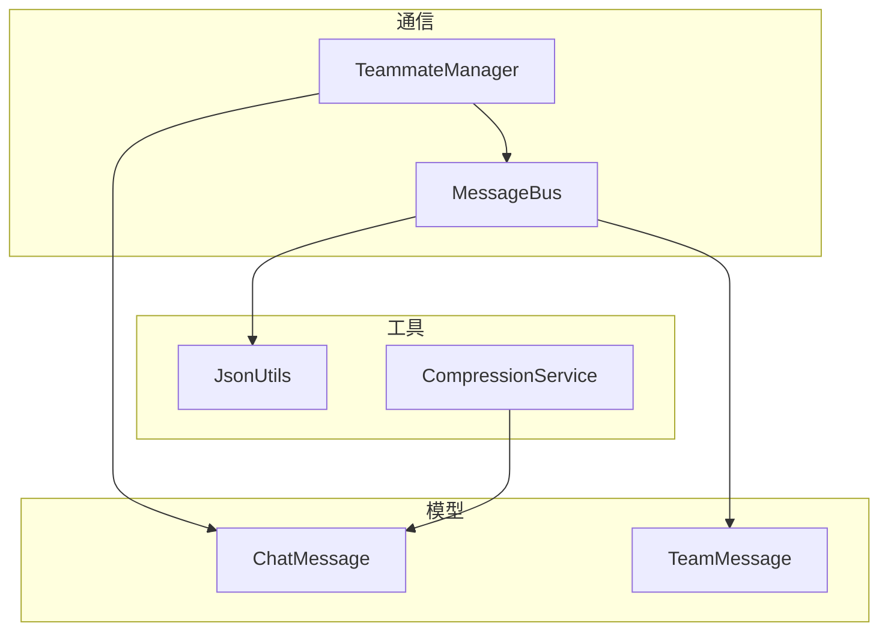
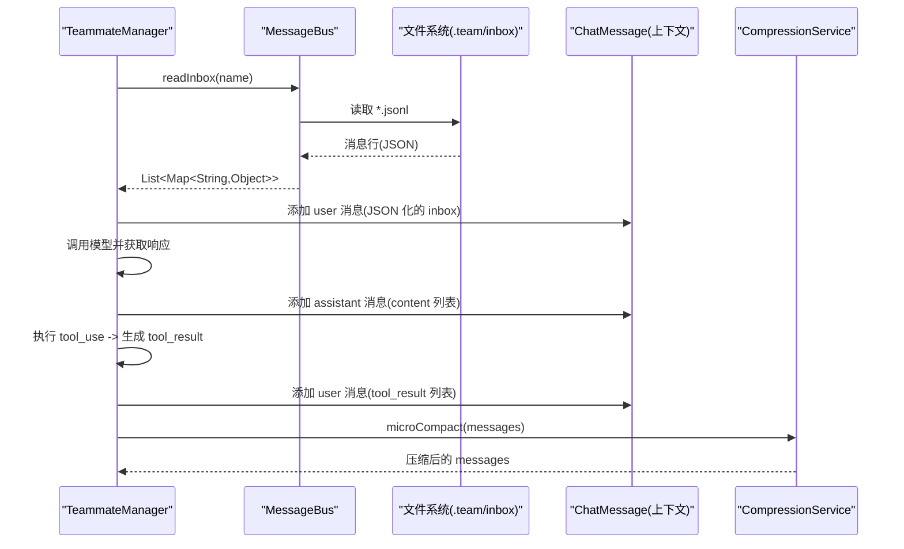
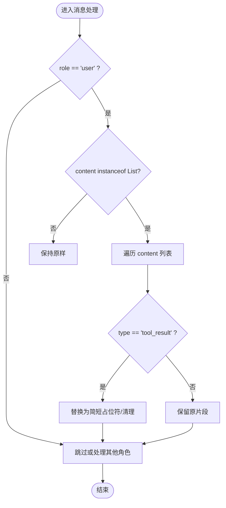
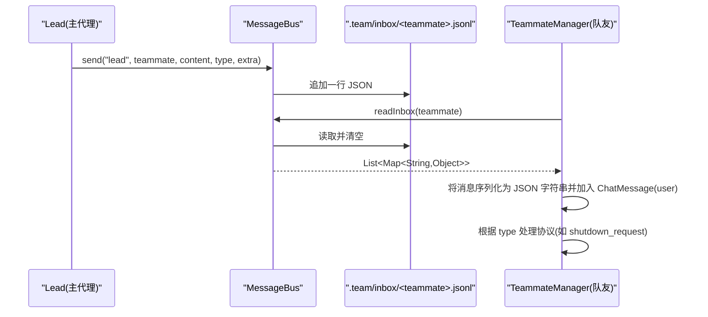
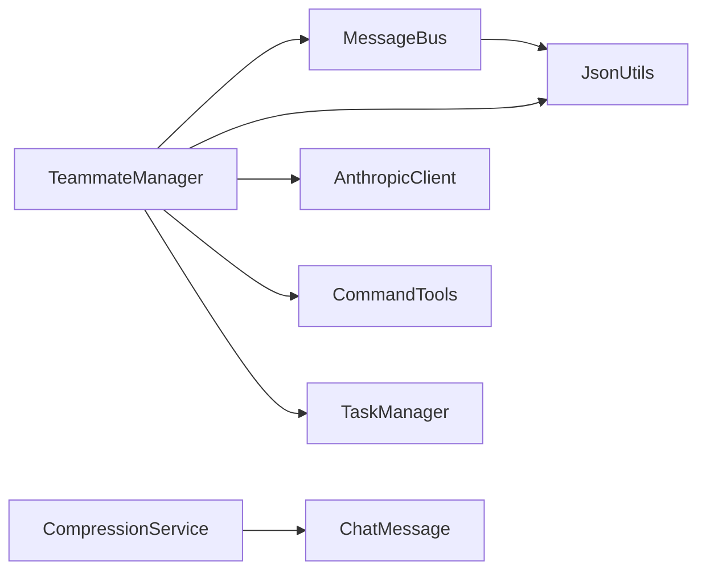

# 核心消息模型

<cite>
**本文引用的文件**
- [ChatMessage.java](file://src/main/java/com/learnclaudecode/model/ChatMessage.java)
- [TeamMessage.java](file://src/main/java/com/learnclaudecode/model/TeamMessage.java)
- [JsonUtils.java](file://src/main/java/com/learnclaudecode/common/JsonUtils.java)
- [MessageBus.java](file://src/main/java/com/learnclaudecode/team/MessageBus.java)
- [TeammateManager.java](file://src/main/java/com/learnclaudecode/team/TeammateManager.java)
- [CompressionService.java](file://src/main/java/com/learnclaudecode/context/CompressionService.java)
</cite>

## 目录
1. [简介](#简介)
2. [项目结构](#项目结构)
3. [核心组件](#核心组件)
4. [架构总览](#架构总览)
5. [详细组件分析](#详细组件分析)
6. [依赖关系分析](#依赖关系分析)
7. [性能考量](#性能考量)
8. [故障排查指南](#故障排查指南)
9. [结论](#结论)
10. [附录：使用示例与最佳实践](#附录使用示例与最佳实践)

## 简介
本文件聚焦于系统中的两个核心消息模型：ChatMessage（对话消息）与 TeamMessage（团队协作消息），并围绕其设计理念、字段设计、序列化/反序列化配置、在团队通信中的传递机制，以及实际使用示例与最佳实践进行系统化说明。重点解释 ChatMessage.content 采用 Object 类型以兼容文本或结构化 tool_result 列表的设计动机与实现方式，并描述 TeamMessage 在基于文件的轻量级消息总线中的角色与流转过程。

## 项目结构
- 模型层
  - ChatMessage：对话消息记录，包含 role 与 content。
  - TeamMessage：队友间消息的结构化模型，包含 type、from、content、timestamp、extra。
- 工具与基础设施
  - JsonUtils：统一的 JSON 序列化/反序列化工具，集中管理 ObjectMapper 配置。
  - MessageBus：基于 .team/inbox/*.jsonl 的文件型消息总线，负责发送、读取与广播。
  - TeammateManager：队友管理器，驱动队友循环、消费 inbox、调用模型与工具，并将结果以 ChatMessage 形式维护上下文。
  - CompressionService：对历史消息进行微压缩，识别并处理 tool_result 片段，降低上下文体积。

图表来源
- [ChatMessage.java:1-8](file://src/main/java/com/learnclaudecode/model/ChatMessage.java#L1-L8)
- [TeamMessage.java:1-35](file://src/main/java/com/learnclaudecode/model/TeamMessage.java#L1-L35)
- [MessageBus.java:1-123](file://src/main/java/com/learnclaudecode/team/MessageBus.java#L1-L123)
- [TeammateManager.java:177-273](file://src/main/java/com/learnclaudecode/team/TeammateManager.java#L177-L273)
- [JsonUtils.java:1-83](file://src/main/java/com/learnclaudecode/common/JsonUtils.java#L1-L83)
- [CompressionService.java:62-84](file://src/main/java/com/learnclaudecode/context/CompressionService.java#L62-L84)

章节来源
- [ChatMessage.java:1-8](file://src/main/java/com/learnclaudecode/model/ChatMessage.java#L1-L8)
- [TeamMessage.java:1-35](file://src/main/java/com/learnclaudecode/model/TeamMessage.java#L1-L35)
- [MessageBus.java:1-123](file://src/main/java/com/learnclaudecode/team/MessageBus.java#L1-L123)
- [TeammateManager.java:177-273](file://src/main/java/com/learnclaudecode/team/TeammateManager.java#L177-L273)
- [JsonUtils.java:1-83](file://src/main/java/com/learnclaudecode/common/JsonUtils.java#L1-L83)
- [CompressionService.java:62-84](file://src/main/java/com/learnclaudecode/context/CompressionService.java#L62-L84)

## 核心组件
- ChatMessage
  - role：消息角色，如 user、assistant。
  - content：Object 类型，支持字符串文本或结构化 tool_result 列表，便于在同一模型中承载不同形态的消息内容。
- TeamMessage
  - type：消息类型，如 message、broadcast、shutdown_request、shutdown_response、plan_approval_response。
  - from：发送者标识。
  - content：消息正文（字符串）。
  - timestamp：时间戳（Unix 秒）。
  - extra：扩展字段，用于附加不同类型消息所需的额外数据。
- JsonUtils
  - 提供统一的 JSON 序列化/反序列化能力，集中配置 ObjectMapper（注册 JavaTimeModule、禁用日期写为时间戳等）。
- MessageBus
  - 基于文件系统（.team/inbox/*.jsonl）的轻量消息通道，支持 send、readInbox、broadcast。
  - 每条消息落盘为一行 JSON，读后即清空，实现“读即消费”语义。
- TeammateManager
  - 驱动队友线程，消费 inbox，构造 ChatMessage 上下文，调用模型与工具，将工具执行结果以 tool_result 列表追加到消息历史。
- CompressionService
  - 对历史消息进行微压缩，识别并替换较早的 tool_result 大文本，保留结构信息的同时减少上下文体积。

章节来源
- [ChatMessage.java:1-8](file://src/main/java/com/learnclaudecode/model/ChatMessage.java#L1-L8)
- [TeamMessage.java:1-35](file://src/main/java/com/learnclaudecode/model/TeamMessage.java#L1-L35)
- [JsonUtils.java:1-83](file://src/main/java/com/learnclaudecode/common/JsonUtils.java#L1-L83)
- [MessageBus.java:1-123](file://src/main/java/com/learnclaudecode/team/MessageBus.java#L1-L123)
- [TeammateManager.java:177-273](file://src/main/java/com/learnclaudecode/team/TeammateManager.java#L177-L273)
- [CompressionService.java:62-84](file://src/main/java/com/learnclaudecode/context/CompressionService.java#L62-L84)

## 架构总览
下图展示了消息模型在系统内的交互关系：TeammateManager 通过 MessageBus 收发 TeamMessage；在对话上下文中，TeammateManager 维护 ChatMessage 列表，其中 assistant 返回的内容作为结构化块，tool_use 执行后以 tool_result 列表追加到 user 角色的消息中；CompressionService 对历史消息进行微压缩，优化上下文大小。

图表来源
- [TeammateManager.java:177-273](file://src/main/java/com/learnclaudecode/team/TeammateManager.java#L177-L273)
- [MessageBus.java:54-101](file://src/main/java/com/learnclaudecode/team/MessageBus.java#L54-L101)
- [CompressionService.java:62-84](file://src/main/java/com/learnclaudecode/context/CompressionService.java#L62-L84)

## 详细组件分析

### ChatMessage：role 与 content 的设计
- role：区分消息角色（user、assistant），用于构建对话上下文。
- content：采用 Object 类型，以兼容两种常见形态：
  - 字符串文本：直接承载自然语言内容。
  - 结构化 tool_result 列表：当模型返回 tool_use 时，执行工具后将结果封装为 type=tool_result 的列表，再追加到 user 消息中，形成“调用-结果”的闭环。
- 设计动机：
  - 统一消息模型，避免为文本与结构化结果分别定义多个消息类型。
  - 便于后续处理（如压缩、过滤、渲染）按 content 的类型分支处理。
- 典型用法路径：
  - 队友循环中，将 inbox 消息序列化为 JSON 字符串后作为 user 消息加入上下文。
  - 模型返回 assistant 消息（content 为块列表），若存在 tool_use，则执行工具并生成 tool_result 列表，再次以 user 消息追加。
  - 压缩服务识别 user 且 content 为 List 的情况，提取 type=tool_result 的片段进行处理。

图表来源
- [CompressionService.java:62-84](file://src/main/java/com/learnclaudecode/context/CompressionService.java#L62-L84)

章节来源
- [ChatMessage.java:1-8](file://src/main/java/com/learnclaudecode/model/ChatMessage.java#L1-L8)
- [TeammateManager.java:182-263](file://src/main/java/com/learnclaudecode/team/TeammateManager.java#L182-L263)
- [CompressionService.java:62-84](file://src/main/java/com/learnclaudecode/context/CompressionService.java#L62-L84)

### TeamMessage：团队协作中的消息传递机制
- 字段说明：
  - type：限定为 message、broadcast、shutdown_request、shutdown_response、plan_approval_response 等。
  - from：发送者标识（通常为队友名称或 Agent 名称）。
  - content：消息正文（字符串）。
  - timestamp：创建时间（Unix 秒）。
  - extra：扩展字段，用于携带不同类型消息所需的数据（如 request_id、approve、feedback 等）。
- 持久化与协议：
  - 每条消息写入 .team/inbox/<name>.jsonl 的一行 JSON，便于多代理通过文件系统最小依赖通信。
  - 读取后立即清空，实现“读即消费”的 inbox 语义。
- 广播机制：
  - broadcast 方法向多个队友发送同一条消息，自动排除发送者自身。
- 与 TeammateManager 的协作：
  - 队友循环中先消费 inbox，将每条消息序列化为 JSON 字符串后作为 user 消息加入上下文。
  - 通过工具 send_message 向指定队友发送消息；通过 shutdown_response、plan_approval_response 完成协议交互。

图表来源
- [MessageBus.java:54-101](file://src/main/java/com/learnclaudecode/team/MessageBus.java#L54-L101)
- [TeammateManager.java:177-273](file://src/main/java/com/learnclaudecode/team/TeammateManager.java#L177-L273)

章节来源
- [TeamMessage.java:1-35](file://src/main/java/com/learnclaudecode/model/TeamMessage.java#L1-L35)
- [MessageBus.java:1-123](file://src/main/java/com/learnclaudecode/team/MessageBus.java#L1-L123)
- [TeammateManager.java:177-273](file://src/main/java/com/learnclaudecode/team/TeammateManager.java#L177-L273)

### 序列化与反序列化配置
- JsonUtils 统一管理 ObjectMapper：
  - 注册 JavaTimeModule，确保时间类型正确序列化/反序列化。
  - 禁用 WRITE_DATES_AS_TIMESTAMPS，使日期以 ISO 格式输出而非时间戳。
- 常用方法：
  - toJson：紧凑 JSON 字符串。
  - toPrettyJson：格式化 JSON 字符串（常用于配置文件与调试）。
  - fromJson(json, Class<T>)：反序列化为指定类型。
  - fromJson(json, TypeReference<T>)：反序列化为泛型类型。
- 在消息总线中的应用：
  - send：将消息 Map 序列化为 JSON 字符串写入 jsonl。
  - readInbox：逐行读取并反序列化为 Map，便于灵活处理不同消息类型。

章节来源
- [JsonUtils.java:1-83](file://src/main/java/com/learnclaudecode/common/JsonUtils.java#L1-L83)
- [MessageBus.java:54-101](file://src/main/java/com/learnclaudecode/team/MessageBus.java#L54-L101)

## 依赖关系分析
- TeammateManager 依赖：
  - MessageBus：消费 inbox、发送消息、广播。
  - JsonUtils：序列化/反序列化。
  - AnthropicClient：调用模型，获取 assistant 响应。
  - CommandTools：执行 bash、读写文件等工具。
  - TaskManager：认领任务（自治模式）。
- MessageBus 依赖：
  - WorkspacePaths：确定 inbox 目录。
  - JsonUtils：序列化/反序列化。
- CompressionService 依赖：
  - ChatMessage：识别并处理 tool_result 片段。

图表来源
- [TeammateManager.java:1-11](file://src/main/java/com/learnclaudecode/team/TeammateManager.java#L1-L11)
- [MessageBus.java:1-15](file://src/main/java/com/learnclaudecode/team/MessageBus.java#L1-L15)
- [CompressionService.java:62-84](file://src/main/java/com/learnclaudecode/context/CompressionService.java#L62-L84)

章节来源
- [TeammateManager.java:1-11](file://src/main/java/com/learnclaudecode/team/TeammateManager.java#L1-L11)
- [MessageBus.java:1-15](file://src/main/java/com/learnclaudecode/team/MessageBus.java#L1-L15)
- [CompressionService.java:62-84](file://src/main/java/com/learnclaudecode/context/CompressionService.java#L62-L84)

## 性能考量
- 上下文压缩：
  - 对较老的 tool_result 大文本进行微压缩，替换为简短占位符，保留“曾发生”的结构信息，显著降低上下文体积，提升推理效率。
- 文件 I/O：
  - 消息总线采用 jsonl 单行 JSON 存储，读后即清空，避免重复消费与内存堆积。
  - 并发安全：send 与 readInbox 使用 synchronized 保证线程安全。
- 序列化开销：
  - 统一使用 JsonUtils，减少重复配置与异常处理成本；toPrettyJson 仅用于配置与调试场景，避免在生产路径频繁格式化。

[本节为通用性能讨论，不直接分析具体代码行]

## 故障排查指南
- 无效消息类型：
  - MessageBus.send 会校验 msgType 是否在 VALID_TYPES 列表中，否则返回错误提示。
- 文件读写异常：
  - send/readInbox 捕获 IOException 并返回错误信息或系统错误消息，便于定位问题。
- 上下文过大导致性能下降：
  - 检查是否及时调用压缩逻辑；确认 tool_result 片段是否被合理压缩。
- 消息未消费或重复消费：
  - 确认 readInbox 是否正确清空文件；检查是否有外部进程修改了 jsonl 文件。

章节来源
- [MessageBus.java:54-101](file://src/main/java/com/learnclaudecode/team/MessageBus.java#L54-L101)
- [CompressionService.java:62-84](file://src/main/java/com/learnclaudecode/context/CompressionService.java#L62-L84)

## 结论
- ChatMessage 的 Object 类型 content 提供了强大的灵活性，既能承载文本，又能承载结构化 tool_result 列表，简化了消息模型并提升了可扩展性。
- TeamMessage 配合 MessageBus 实现了轻量、可靠、跨进程的团队协作通信，支持多种消息类型与扩展字段，满足复杂协议需求。
- JsonUtils 集中管理序列化配置，确保一致性与可维护性。
- 通过压缩与合理的 I/O 策略，系统在大规模上下文与高并发场景下仍能保持良好性能。

[本节为总结性内容，不直接分析具体代码行]

## 附录：使用示例与最佳实践

### 使用示例（路径引用）
- 构造 ChatMessage 并维护上下文
  - 参考路径：[TeammateManager.java:182-263](file://src/main/java/com/learnclaudecode/team/TeammateManager.java#L182-L263)
  - 要点：
    - 将 inbox 消息序列化为 JSON 字符串后作为 user 消息加入上下文。
    - 模型返回 assistant 消息（content 为块列表），若存在 tool_use，执行工具并生成 tool_result 列表，再以 user 消息追加。
- 发送与接收 TeamMessage
  - 参考路径：[MessageBus.java:54-101](file://src/main/java/com/learnclaudecode/team/MessageBus.java#L54-L101)
  - 要点：
    - send 将消息写入 .team/inbox/<name>.jsonl。
    - readInbox 读取并清空，返回消息列表供上层处理。
- 广播消息
  - 参考路径：[MessageBus.java:112-121](file://src/main/java/com/learnclaudecode/team/MessageBus.java#L112-L121)
  - 要点：
    - 向多个队友发送同一条消息，自动排除发送者自身。
- 压缩 tool_result 片段
  - 参考路径：[CompressionService.java:62-84](file://src/main/java/com/learnclaudecode/context/CompressionService.java#L62-L84)
  - 要点：
    - 识别 user 且 content 为 List 的消息，提取 type=tool_result 的片段进行压缩。

### 最佳实践
- 明确 role 与 content 的约定：
  - user 消息通常承载文本或 tool_result 列表；assistant 消息承载模型返回的块列表。
- 控制 tool_result 的大小：
  - 对较大的 tool_result 进行截断或摘要，避免上下文膨胀。
- 合理使用 extra 字段：
  - 在 TeamMessage 中通过 extra 携带协议相关数据（如 request_id、approve、feedback），保持 content 简洁。
- 利用压缩服务：
  - 在长会话中定期调用压缩逻辑，保持上下文高效。
- 谨慎处理文件 I/O：
  - 确保 readInbox 的“读后即清空”语义不被破坏；避免多线程竞争导致的丢失或重复。

[本节为实践指导，不直接分析具体代码行]