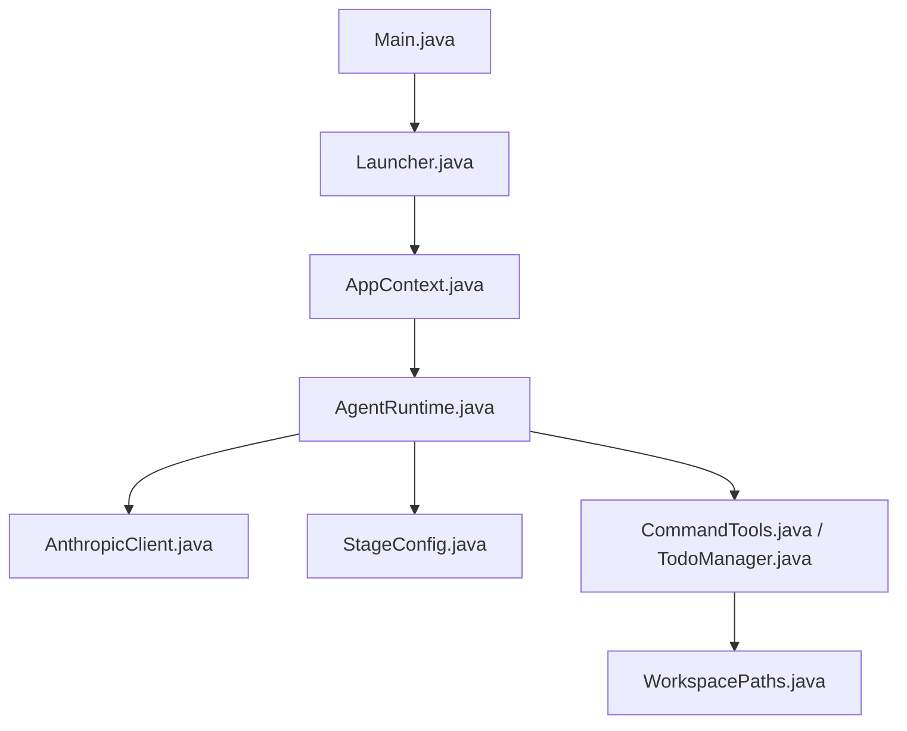
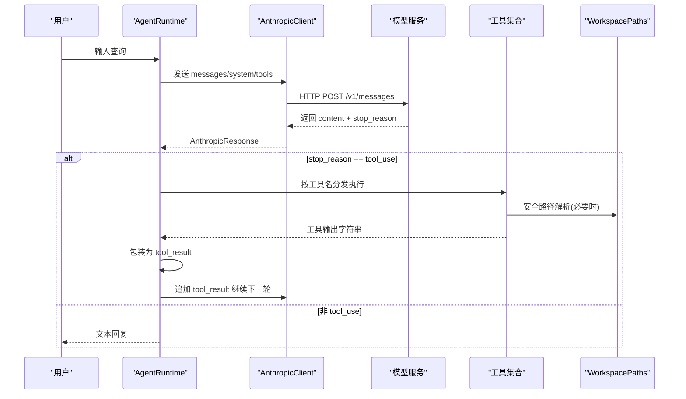
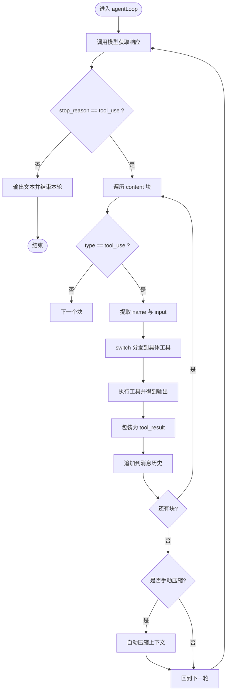
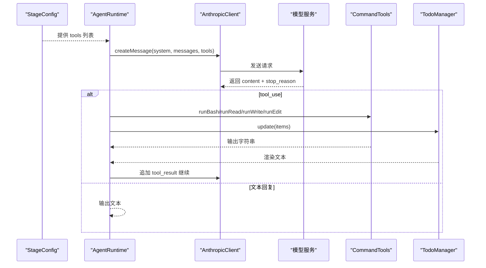
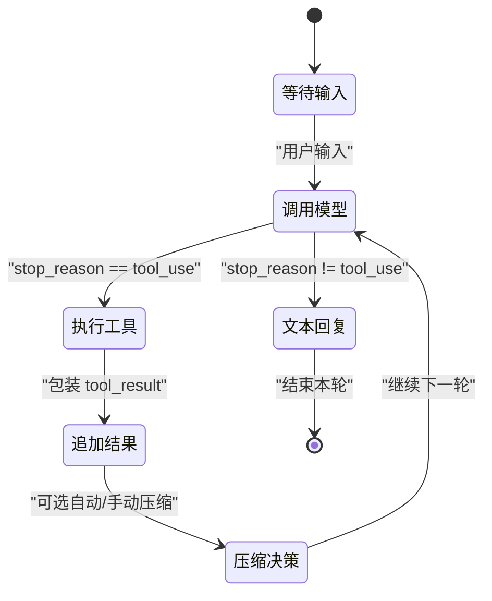
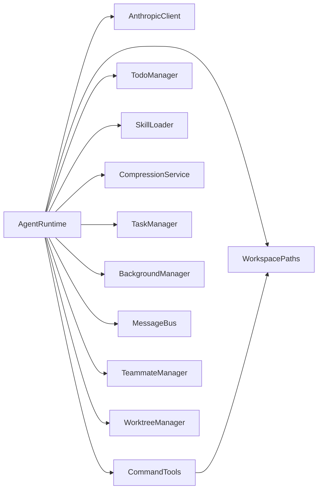

# 工具执行流程

<cite>
**本文引用的文件**
- [Main.java](file://src/main/java/com/learnclaudecode/Main.java)
- [Launcher.java](file://src/main/java/com/learnclaudecode/agents/Launcher.java)
- [AppContext.java](file://src/main/java/com/learnclaudecode/agents/AppContext.java)
- [StageConfig.java](file://src/main/java/com/learnclaudecode/agents/StageConfig.java)
- [AgentRuntime.java](file://src/main/java/com/learnclaudecode/agents/AgentRuntime.java)
- [AnthropicClient.java](file://src/main/java/com/learnclaudecode/common/AnthropicClient.java)
- [WorkspacePaths.java](file://src/main/java/com/learnclaudecode/common/WorkspacePaths.java)
- [CommandTools.java](file://src/main/java/com/learnclaudecode/tools/CommandTools.java)
- [TodoManager.java](file://src/main/java/com/learnclaudecode/tools/TodoManager.java)
- [AnthropicResponse.java](file://src/main/java/com/learnclaudecode/model/AnthropicResponse.java)
- [ToolSpec.java](file://src/main/java/com/learnclaudecode/model/ToolSpec.java)
</cite>

## 目录
1. [简介](#简介)
2. [项目结构](#项目结构)
3. [核心组件](#核心组件)
4. [架构总览](#架构总览)
5. [详细组件分析](#详细组件分析)
6. [依赖关系分析](#依赖关系分析)
7. [性能考量](#性能考量)
8. [故障排查指南](#故障排查指南)
9. [结论](#结论)
10. [附录](#附录)

## 简介
本文面向“Learn Claude Code Java”项目，系统化解析工具调用的完整处理机制。重点说明：
- 模型返回的工具调用请求如何被解析与执行（名称映射、参数提取与类型转换）。
- 工具调度器的实现原理（switch 分发机制）与扩展方式。
- 内置工具的功能与用法（文件操作、命令执行、任务管理等）。
- 执行结果的处理策略（成功与错误的统一封装）。
- 安全机制（权限控制与资源限制）。
- 提供时序图与状态图，展示从工具声明到结果返回的完整流程。
- 自定义工具的开发指南与最佳实践。

## 项目结构
本项目采用分层装配模式：入口类选择阶段配置，启动器创建应用上下文并注入共享服务，运行时驱动 Agent 循环，工具定义由阶段配置集中管理，工具实现在 tools 包中，路径与安全校验在 common 包中。

图表来源
- [Main.java:5-13](file://src/main/java/com/learnclaudecode/Main.java#L5-L13)
- [Launcher.java:23-26](file://src/main/java/com/learnclaudecode/agents/Launcher.java#L23-L26)
- [AppContext.java:35-59](file://src/main/java/com/learnclaudecode/agents/AppContext.java#L35-L59)
- [AgentRuntime.java:97-123](file://src/main/java/com/learnclaudecode/agents/AgentRuntime.java#L97-L123)
- [StageConfig.java:56-70](file://src/main/java/com/learnclaudecode/agents/StageConfig.java#L56-L70)
- [CommandTools.java:36-144](file://src/main/java/com/learnclaudecode/tools/CommandTools.java#L36-L144)
- [WorkspacePaths.java:42-49](file://src/main/java/com/learnclaudecode/common/WorkspacePaths.java#L42-L49)

章节来源
- [Main.java:5-13](file://src/main/java/com/learnclaudecode/Main.java#L5-L13)
- [Launcher.java:23-26](file://src/main/java/com/learnclaudecode/agents/Launcher.java#L23-L26)
- [AppContext.java:35-59](file://src/main/java/com/learnclaudecode/agents/AppContext.java#L35-L59)

## 核心组件
- 运行期装配：AppContext 负责创建环境配置、工作区路径、模型客户端、工具集、任务与团队能力等，并组装统一的 AgentRuntime。
- 阶段能力编排：StageConfig 以 record 形式维护 system prompt、功能开关与工具定义列表，支持多阶段能力叠加与去重。
- 运行时主循环：AgentRuntime 实现 REPL 交互与 agentLoop，驱动“用户输入 -> 调模型 -> 工具执行 -> 结果回写”的闭环。
- 模型通信：AnthropicClient 将 messages、system、tools 打包为 HTTP 请求，返回结构化响应。
- 工具实现：CommandTools 提供 bash、read_file、write_file、edit_file；TodoManager 提供 todo/TodoWrite 管理能力。
- 路径安全：WorkspacePaths 提供 safeResolve 等安全方法，防止路径逃逸。

章节来源
- [AppContext.java:35-59](file://src/main/java/com/learnclaudecode/agents/AppContext.java#L35-L59)
- [StageConfig.java:26-36](file://src/main/java/com/learnclaudecode/agents/StageConfig.java#L26-L36)
- [AgentRuntime.java:131-260](file://src/main/java/com/learnclaudecode/agents/AgentRuntime.java#L131-L260)
- [AnthropicClient.java:52-101](file://src/main/java/com/learnclaudecode/common/AnthropicClient.java#L52-L101)
- [CommandTools.java:36-144](file://src/main/java/com/learnclaudecode/tools/CommandTools.java#L36-L144)
- [TodoManager.java:21-55](file://src/main/java/com/learnclaudecode/tools/TodoManager.java#L21-L55)
- [WorkspacePaths.java:42-49](file://src/main/java/com/learnclaudecode/common/WorkspacePaths.java#L42-L49)

## 架构总览
下图展示了从入口到工具执行的端到端流程，包括工具声明、模型推理、工具调度、执行与结果回传。

图表来源
- [AgentRuntime.java:131-260](file://src/main/java/com/learnclaudecode/agents/AgentRuntime.java#L131-L260)
- [AnthropicClient.java:52-101](file://src/main/java/com/learnclaudecode/common/AnthropicClient.java#L52-L101)
- [WorkspacePaths.java:42-49](file://src/main/java/com/learnclaudecode/common/WorkspacePaths.java#L42-L49)

## 详细组件分析

### 工具声明与能力编排（StageConfig）
- 工具定义：通过 baseTools 和阶段专用方法构建工具列表，每个工具包含 name、description、input_schema，对齐 messages API 约定。
- 能力开关：enableTodoNag、enableCompression、enableBackground、enableInbox、subagentWritable、autonomousTeammates 控制运行时行为。
- 合并与去重：sFull 聚合多阶段工具，使用 dedupe 按名字去重，避免重复定义。

章节来源
- [StageConfig.java:56-70](file://src/main/java/com/learnclaudecode/agents/StageConfig.java#L56-L70)
- [StageConfig.java:251-267](file://src/main/java/com/learnclaudecode/agents/StageConfig.java#L251-L267)
- [StageConfig.java:277-299](file://src/main/java/com/learnclaudecode/agents/StageConfig.java#L277-L299)

### 工具调度器与分发机制（AgentRuntime.agentLoop）
- 工具名称映射：switch(toolName) 将模型声明的工具名映射到本地实现方法。
- 参数提取与类型转换：从 input 中提取字段，使用 numberOrNull、numberOrDefault、stringOrNull 做容错解析。
- 结果封装：统一包装为 {type:"tool_result", tool_use_id, content}，再作为 user 消息追加到历史。
- 扩展方式：新增工具时，需在 StageConfig.tools 中添加定义，并在 switch 分支添加对应实现。

图表来源
- [AgentRuntime.java:131-260](file://src/main/java/com/learnclaudecode/agents/AgentRuntime.java#L131-L260)
- [AgentRuntime.java:318-349](file://src/main/java/com/learnclaudecode/agents/AgentRuntime.java#L318-L349)

章节来源
- [AgentRuntime.java:131-260](file://src/main/java/com/learnclaudecode/agents/AgentRuntime.java#L131-L260)
- [AgentRuntime.java:318-349](file://src/main/java/com/learnclaudecode/agents/AgentRuntime.java#L318-L349)

### 内置工具详解

#### 命令执行工具（bash）
- 功能：在工作区内执行 shell 命令，跨平台适配（Windows PowerShell / Unix bash）。
- 安全：黑名单拦截危险命令；超时保护（120秒）；输出长度限制。
- 错误处理：捕获异常并返回错误信息字符串。

章节来源
- [CommandTools.java:36-78](file://src/main/java/com/learnclaudecode/tools/CommandTools.java#L36-L78)

#### 文件读取工具（read_file）
- 功能：读取工作区内文件内容，支持 limit 行数限制，避免大文件导致上下文爆炸。
- 安全：通过 WorkspacePaths.safeResolve 确保路径不逃逸工作区。
- 错误处理：异常转为错误字符串返回。

章节来源
- [CommandTools.java:87-101](file://src/main/java/com/learnclaudecode/tools/CommandTools.java#L87-L101)
- [WorkspacePaths.java:42-49](file://src/main/java/com/learnclaudecode/common/WorkspacePaths.java#L42-L49)

#### 文件写入工具（write_file）
- 功能：写入或覆盖文件内容，自动创建父目录。
- 安全：路径安全校验。
- 错误处理：异常转为错误字符串返回。

章节来源
- [CommandTools.java:110-121](file://src/main/java/com/learnclaudecode/tools/CommandTools.java#L110-L121)
- [WorkspacePaths.java:42-49](file://src/main/java/com/learnclaudecode/common/WorkspacePaths.java#L42-L49)

#### 文件编辑工具（edit_file）
- 功能：精确替换文件中首次出现的旧文本为新文本。
- 安全：路径安全校验。
- 错误处理：未找到文本或 IO 异常均返回错误信息。

章节来源
- [CommandTools.java:131-144](file://src/main/java/com/learnclaudecode/tools/CommandTools.java#L131-L144)
- [WorkspacePaths.java:42-49](file://src/main/java/com/learnclaudecode/common/WorkspacePaths.java#L42-L49)

#### 任务清单工具（todo / TodoWrite）
- 功能：更新任务清单，支持 pending/in_progress/completed 状态，限制最多 20 项，且仅允许一个 in_progress。
- 渲染：生成人类可读的任务看板文本。
- 错误处理：非法状态或缺少文本时抛出异常。

章节来源
- [TodoManager.java:21-55](file://src/main/java/com/learnclaudecode/tools/TodoManager.java#L21-L55)
- [TodoManager.java:71-91](file://src/main/java/com/learnclaudecode/tools/TodoManager.java#L71-L91)

#### 子代理工具（task）
- 功能：在独立上下文中执行子任务，可配置只读或可写能力。
- 实现：内部复用 AgentRuntime 的循环逻辑，但隔离消息历史与工具集。

章节来源
- [AgentRuntime.java:270-310](file://src/main/java/com/learnclaudecode/agents/AgentRuntime.java#L270-L310)

#### 技能加载工具（load_skill）
- 功能：根据名称加载技能描述或内容，用于增强 Agent 的专业知识。

章节来源
- [StageConfig.java:129-135](file://src/main/java/com/learnclaudecode/agents/StageConfig.java#L129-L135)

#### 上下文压缩工具（compact）
- 功能：触发手动压缩，减少对话历史占用。
- 行为：本轮结束后执行 autoCompact，用摘要替代旧上下文。

章节来源
- [AgentRuntime.java:202-206](file://src/main/java/com/learnclaudecode/agents/AgentRuntime.java#L202-L206)
- [AgentRuntime.java:253-259](file://src/main/java/com/learnclaudecode/agents/AgentRuntime.java#L253-L259)

#### 后台任务工具（background_run / check_background）
- 功能：异步执行命令并检查状态，结果以通知形式注入主上下文。

章节来源
- [AgentRuntime.java:207-208](file://src/main/java/com/learnclaudecode/agents/AgentRuntime.java#L207-L208)

#### 任务管理工具（task_create / task_update / task_list / task_get）
- 功能：创建、更新、列出、获取任务详情，支撑多步骤任务跟踪。

章节来源
- [StageConfig.java:156-165](file://src/main/java/com/learnclaudecode/agents/StageConfig.java#L156-L165)
- [AgentRuntime.java:209-219](file://src/main/java/com/learnclaudecode/agents/AgentRuntime.java#L209-L219)

#### 团队协作工具（spawn_teammate / list_teammates / send_message / read_inbox / broadcast / shutdown_request / plan_approval）
- 功能：创建队友、发消息、广播、读取收件箱、关闭请求、计划审批等，支持多 Agent 协作。

章节来源
- [StageConfig.java:186-211](file://src/main/java/com/learnclaudecode/agents/StageConfig.java#L186-L211)
- [AgentRuntime.java:220-227](file://src/main/java/com/learnclaudecode/agents/AgentRuntime.java#L220-L227)

#### 自治与隔离工具（claim_task / idle / worktree_*）
- 功能：认领任务、空闲状态、worktree 创建/列表/移除/事件查看，支持任务隔离与生命周期可见性。

章节来源
- [StageConfig.java:218-244](file://src/main/java/com/learnclaudecode/agents/StageConfig.java#L218-L244)
- [AgentRuntime.java:227-232](file://src/main/java/com/learnclaudecode/agents/AgentRuntime.java#L227-L232)

### 工具执行结果处理
- 成功结果：工具返回字符串，统一包装为 tool_result 并追加到消息历史。
- 错误情况：工具内部捕获异常并返回错误字符串；部分工具抛业务异常（如 TodoManager），上层需记录日志或提示。
- 上下文管理：可选自动/手动压缩，避免上下文过大影响性能。

章节来源
- [AgentRuntime.java:236-259](file://src/main/java/com/learnclaudecode/agents/AgentRuntime.java#L236-L259)
- [CommandTools.java:59-64](file://src/main/java/com/learnclaudecode/tools/CommandTools.java#L59-L64)
- [TodoManager.java:21-55](file://src/main/java/com/learnclaudecode/tools/TodoManager.java#L21-L55)

### 安全机制
- 路径安全：所有文件操作必须通过 WorkspacePaths.safeResolve，防止 ../ 逃逸工作区。
- 命令安全：黑名单拦截危险命令；超时保护；输出长度限制。
- 能力开关：通过 StageConfig 控制是否启用敏感能力（如 subagentWritable、enableBackground）。

章节来源
- [WorkspacePaths.java:42-49](file://src/main/java/com/learnclaudecode/common/WorkspacePaths.java#L42-L49)
- [CommandTools.java:36-42](file://src/main/java/com/learnclaudecode/tools/CommandTools.java#L36-L42)
- [StageConfig.java:26-36](file://src/main/java/com/learnclaudecode/agents/StageConfig.java#L26-L36)

### 工具调用时序图（从声明到结果返回）

图表来源
- [StageConfig.java:56-70](file://src/main/java/com/learnclaudecode/agents/StageConfig.java#L56-L70)
- [AgentRuntime.java:131-260](file://src/main/java/com/learnclaudecode/agents/AgentRuntime.java#L131-L260)
- [AnthropicClient.java:52-101](file://src/main/java/com/learnclaudecode/common/AnthropicClient.java#L52-L101)
- [CommandTools.java:36-144](file://src/main/java/com/learnclaudecode/tools/CommandTools.java#L36-L144)
- [TodoManager.java:21-55](file://src/main/java/com/learnclaudecode/tools/TodoManager.java#L21-L55)

### 工具调用状态图（Agent 主循环）

图表来源
- [AgentRuntime.java:97-123](file://src/main/java/com/learnclaudecode/agents/AgentRuntime.java#L97-L123)
- [AgentRuntime.java:131-260](file://src/main/java/com/learnclaudecode/agents/AgentRuntime.java#L131-L260)

## 依赖关系分析
- AgentRuntime 依赖：AnthropicClient、WorkspacePaths、CommandTools、TodoManager、SkillLoader、CompressionService、TaskManager、BackgroundManager、MessageBus、TeammateManager、WorktreeManager。
- StageConfig 提供工具定义，AgentRuntime 负责调度；工具实现依赖 WorkspacePaths 进行安全路径校验。
- AnthropicClient 依赖 EnvConfig 与 JsonUtils，负责网络通信与序列化。

图表来源
- [AgentRuntime.java:41-90](file://src/main/java/com/learnclaudecode/agents/AgentRuntime.java#L41-L90)
- [AppContext.java:35-59](file://src/main/java/com/learnclaudecode/agents/AppContext.java#L35-L59)
- [CommandTools.java:3-28](file://src/main/java/com/learnclaudecode/tools/CommandTools.java#L3-L28)

章节来源
- [AgentRuntime.java:41-90](file://src/main/java/com/learnclaudecode/agents/AgentRuntime.java#L41-L90)
- [AppContext.java:35-59](file://src/main/java/com/learnclaudecode/agents/AppContext.java#L35-L59)

## 性能考量
- 上下文压缩：microCompact 与 autoCompact 降低历史大小，避免 token 超限。
- 工具输出限制：命令与文件读取输出限制长度，防止上下文膨胀。
- 超时与中断：命令执行设置超时，异常中断后恢复线程状态。
- 批量处理：后台任务结果批量注入，减少频繁上下文切换。

章节来源
- [AgentRuntime.java:136-145](file://src/main/java/com/learnclaudecode/agents/AgentRuntime.java#L136-L145)
- [CommandTools.java:47-58](file://src/main/java/com/learnclaudecode/tools/CommandTools.java#L47-L58)
- [CommandTools.java:59-64](file://src/main/java/com/learnclaudecode/tools/CommandTools.java#L59-L64)

## 故障排查指南
- 模型调用失败：检查 HTTP 状态码与响应体，确认 Base URL 与 API Key 配置正确。
- 工具未知：确认 StageConfig.tools 中已声明该工具，并在 AgentRuntime.switch 中添加分支。
- 路径逃逸：确保所有文件操作通过 WorkspacePaths.safeResolve，避免非法路径。
- 命令超时：调整超时时间或优化命令逻辑，避免长时间阻塞。
- Todo 校验失败：检查 items 字段格式与状态值，确保不超过最大数量且仅一个 in_progress。

章节来源
- [AnthropicClient.java:87-101](file://src/main/java/com/learnclaudecode/common/AnthropicClient.java#L87-L101)
- [AgentRuntime.java:189-234](file://src/main/java/com/learnclaudecode/agents/AgentRuntime.java#L189-L234)
- [WorkspacePaths.java:42-49](file://src/main/java/com/learnclaudecode/common/WorkspacePaths.java#L42-L49)
- [CommandTools.java:47-64](file://src/main/java/com/learnclaudecode/tools/CommandTools.java#L47-L64)
- [TodoManager.java:21-55](file://src/main/java/com/learnclaudecode/tools/TodoManager.java#L21-L55)

## 结论
本项目通过清晰的装配与编排机制，实现了可扩展的工具执行流程。StageConfig 集中管理工具定义与能力开关，AgentRuntime 负责调度与结果处理，工具实现聚焦于具体业务逻辑，并通过 WorkspacePaths 保障安全。该设计便于教学演示与生产扩展，推荐在新增工具时遵循“声明+分发+安全校验”的模式。

## 附录

### 自定义工具开发指南
- 步骤一：在 StageConfig.tools 中添加工具定义（name、description、input_schema）。
- 步骤二：在 AgentRuntime.agentLoop 的 switch 中添加新工具分支，实现参数提取与类型转换。
- 步骤三：在 tools 包中实现工具逻辑，必要时依赖 WorkspacePaths 进行安全路径校验。
- 步骤四：如需能力开关，扩展 StageConfig 字段并在运行时按需启用。
- 最佳实践：
  - 保持工具幂等性与错误可恢复性。
  - 对长耗时操作使用后台任务或超时保护。
  - 输出结果控制在合理长度，避免上下文爆炸。
  - 严格路径与命令白名单/黑名单策略。

章节来源
- [StageConfig.java:56-70](file://src/main/java/com/learnclaudecode/agents/StageConfig.java#L56-L70)
- [AgentRuntime.java:189-234](file://src/main/java/com/learnclaudecode/agents/AgentRuntime.java#L189-L234)
- [CommandTools.java:36-144](file://src/main/java/com/learnclaudecode/tools/CommandTools.java#L36-L144)
- [WorkspacePaths.java:42-49](file://src/main/java/com/learnclaudecode/common/WorkspacePaths.java#L42-L49)