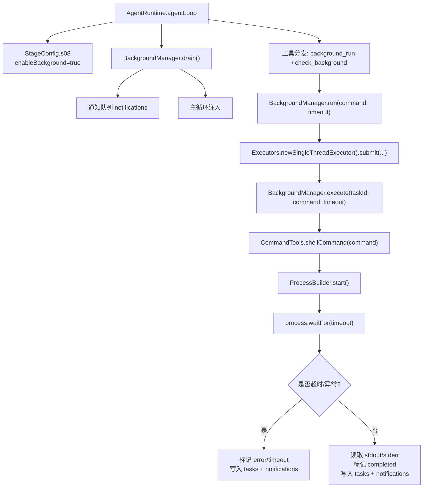
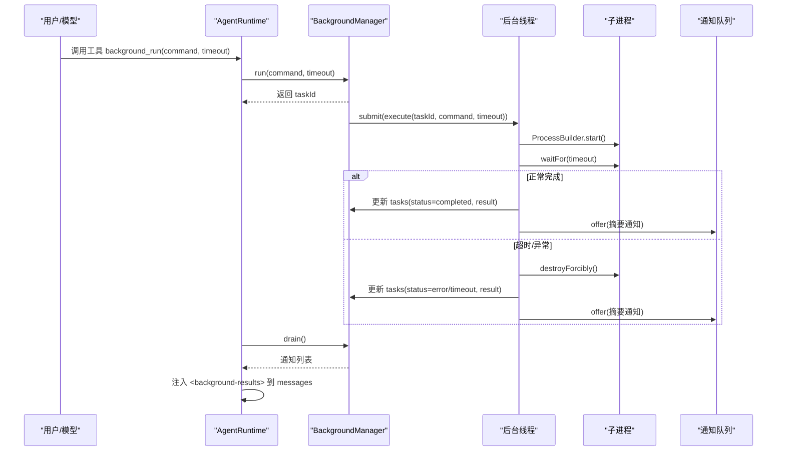
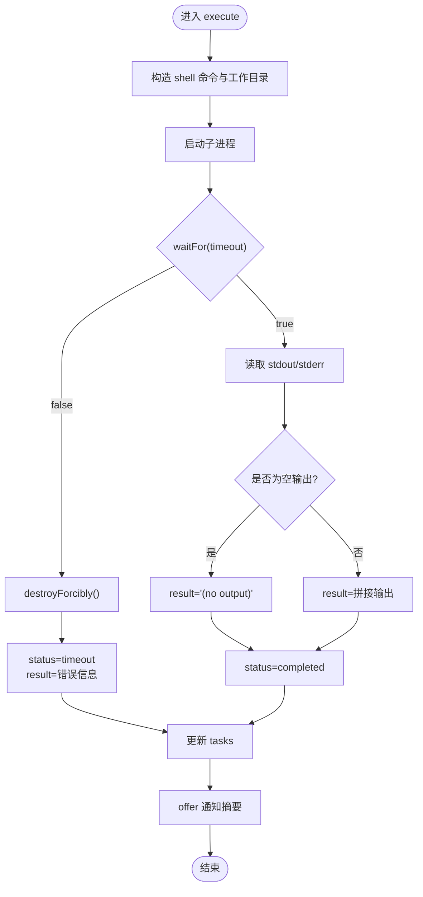
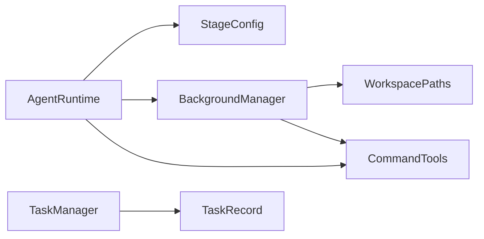

# 异步任务处理

<cite>
**本文引用的文件**
- [BackgroundManager.java](file://src/main/java/com/learnclaudecode/background/BackgroundManager.java)
- [AgentRuntime.java](file://src/main/java/com/learnclaudecode/agents/AgentRuntime.java)
- [StageConfig.java](file://src/main/java/com/learnclaudecode/agents/StageConfig.java)
- [CommandTools.java](file://src/main/java/com/learnclaudecode/tools/CommandTools.java)
- [WorkspacePaths.java](file://src/main/java/com/learnclaudecode/common/WorkspacePaths.java)
- [TaskRecord.java](file://src/main/java/com/learnclaudecode/model/TaskRecord.java)
- [TaskManager.java](file://src/main/java/com/learnclaudecode/tasks/TaskManager.java)
</cite>

## 目录
1. [简介](#简介)
2. [项目结构](#项目结构)
3. [核心组件](#核心组件)
4. [架构总览](#架构总览)
5. [详细组件分析](#详细组件分析)
6. [依赖关系分析](#依赖关系分析)
7. [性能与资源管理](#性能与资源管理)
8. [故障排查指南](#故障排查指南)
9. [结论](#结论)
10. [附录：使用示例与最佳实践](#附录使用示例与最佳实践)

## 简介
本文件围绕 Learn Claude Code Java 项目的后台异步任务机制，系统性解析 BackgroundManager 的实现原理与集成方式，覆盖任务的创建、执行、监控、结果收集、状态跟踪、超时与异常处理、以及主循环中的通知注入。同时给出并发模型、线程池策略、调度与并发控制的设计要点，并提供长时间运行任务与批量任务的处理建议及性能监控原则。

## 项目结构
本项目将“后台任务”作为 Agent 的一个能力阶段（s08），通过工具调用暴露给模型，并由 Agent 主循环在每轮开始前轮询后台结果，将其注入对话上下文。关键路径如下：
- 配置层：StageConfig.s08() 启用 enableBackground，并注册 background_run/check_background 工具。
- 运行时：AgentRuntime.agentLoop() 在每次 LLM 调用前检查 enableBackground，并通过 BackgroundManager.drain() 获取通知，注入 messages。
- 后台执行：BackgroundManager.run() 生成任务 ID，提交到独立线程执行命令；execute() 启动子进程、等待完成、记录状态与结果，并向通知队列投递摘要。
- 工具与路径：CommandTools.shellCommand() 构造跨平台 shell 命令；WorkspacePaths 提供工作区根目录与安全路径能力。
- 任务持久化：TaskManager/TaskRecord 用于更通用的任务板（文件持久化），与后台任务解耦但可配合使用。



图表来源
- [AgentRuntime.java:131-159](file://src/main/java/com/learnclaudecode/agents/AgentRuntime.java#L131-L159)
- [StageConfig.java:172-179](file://src/main/java/com/learnclaudecode/agents/StageConfig.java#L172-L179)
- [BackgroundManager.java:43-123](file://src/main/java/com/learnclaudecode/background/BackgroundManager.java#L43-L123)
- [CommandTools.java:73-78](file://src/main/java/com/learnclaudecode/tools/CommandTools.java#L73-L78)

章节来源
- [StageConfig.java:172-179](file://src/main/java/com/learnclaudecode/agents/StageConfig.java#L172-L179)
- [AgentRuntime.java:131-159](file://src/main/java/com/learnclaudecode/agents/AgentRuntime.java#L131-L159)
- [BackgroundManager.java:43-123](file://src/main/java/com/learnclaudecode/background/BackgroundManager.java#L43-L123)
- [CommandTools.java:73-78](file://src/main/java/com/learnclaudecode/tools/CommandTools.java#L73-L78)

## 核心组件
- BackgroundManager：后台任务管理器，负责任务生命周期、进程执行、状态更新与通知投递。
- AgentRuntime：Agent 主循环，负责工具分发、后台结果轮询与注入。
- StageConfig：阶段配置，定义 s08 的后台能力开关与工具集。
- CommandTools：跨平台 shell 命令构造与基础命令执行工具。
- WorkspacePaths：工作区路径管理与安全校验。
- TaskManager/TaskRecord：通用任务板（文件持久化），与后台任务解耦，可用于长期任务编排。

章节来源
- [BackgroundManager.java:20-159](file://src/main/java/com/learnclaudecode/background/BackgroundManager.java#L20-L159)
- [AgentRuntime.java:131-234](file://src/main/java/com/learnclaudecode/agents/AgentRuntime.java#L131-L234)
- [StageConfig.java:172-179](file://src/main/java/com/learnclaudecode/agents/StageConfig.java#L172-L179)
- [CommandTools.java:16-78](file://src/main/java/com/learnclaudecode/tools/CommandTools.java#L16-L78)
- [WorkspacePaths.java:11-49](file://src/main/java/com/learnclaudecode/common/WorkspacePaths.java#L11-L49)
- [TaskManager.java:27-133](file://src/main/java/com/learnclaudecode/tasks/TaskManager.java#L27-L133)
- [TaskRecord.java:9-61](file://src/main/java/com/learnclaudecode/model/TaskRecord.java#L9-L61)

## 架构总览
后台任务采用“主循环 + 单线程执行器 + 通知队列”的轻量异步模型：
- 主循环不阻塞：调用 background_run 立即返回任务 ID，后续由后台线程执行。
- 执行隔离：每个任务在独立线程中启动子进程，限制工作目录为工作区根，避免路径逃逸。
- 超时保护：waitFor 指定超时，超时后强制终止进程，标记 timeout。
- 结果收集：后台线程完成后更新任务表并投递通知摘要；主循环每轮 drain 通知并注入消息历史。
- 查询接口：check_background 支持按任务 ID 或全部任务查询当前状态。



图表来源
- [AgentRuntime.java:131-159](file://src/main/java/com/learnclaudecode/agents/AgentRuntime.java#L131-L159)
- [BackgroundManager.java:43-123](file://src/main/java/com/learnclaudecode/background/BackgroundManager.java#L43-L123)

## 详细组件分析

### BackgroundManager：后台任务执行与通知
- 任务创建：run() 生成短任务 ID，写入内存任务表（status=running），并提交到单线程执行器。
- 执行流程：execute() 构造 shell 命令、设置工作目录、启动子进程、等待完成；根据结果更新任务状态与结果，并投递通知摘要。
- 查询与消费：check() 支持按任务 ID 或全部任务查询；drain() 一次性取出所有通知。
- 并发与数据一致性：任务表使用 ConcurrentHashMap；通知使用无界 LinkedBlockingQueue；注意未显式同步任务表写操作，存在并发写风险。



图表来源
- [BackgroundManager.java:68-123](file://src/main/java/com/learnclaudecode/background/BackgroundManager.java#L68-L123)

章节来源
- [BackgroundManager.java:43-159](file://src/main/java/com/learnclaudecode/background/BackgroundManager.java#L43-L159)

### AgentRuntime：主循环与后台结果注入
- 每轮开始：若 enableBackground 开启，则调用 backgroundManager.drain() 获取通知，组装成 <background-results> 文本并追加到 messages。
- 工具分发：将模型的工具调用映射到本地实现，包括 background_run 与 check_background。
- 上下文注入：后台结果以 user 消息形式注入，随后 assistant 确认收到，确保模型在下轮推理时能看到最新状态。

```mermaid
sequenceDiagram
participant Loop as "AgentRuntime.agentLoop"
participant BM as "BackgroundManager"
participant Msg as "messages"
Loop->>BM : drain()
BM-->>Loop : List<通知>
alt 有通知
Loop->>Msg : 追加 "<background-results>"
Loop->>Msg : 追加 "Noted background results."
end
Loop->>Loop : 继续 LLM 调用与工具执行
```

图表来源
- [AgentRuntime.java:131-159](file://src/main/java/com/learnclaudecode/agents/AgentRuntime.java#L131-L159)
- [AgentRuntime.java:207-208](file://src/main/java/com/learnclaudecode/agents/AgentRuntime.java#L207-L208)

章节来源
- [AgentRuntime.java:131-159](file://src/main/java/com/learnclaudecode/agents/AgentRuntime.java#L131-L159)
- [AgentRuntime.java:207-208](file://src/main/java/com/learnclaudecode/agents/AgentRuntime.java#L207-L208)

### StageConfig：s08 后台能力配置
- 启用标志：enableBackground = true。
- 工具注册：background_run（command, timeout）、check_background（task_id）。
- 系统提示：引导模型对长耗时命令使用后台执行。

章节来源
- [StageConfig.java:172-179](file://src/main/java/com/learnclaudecode/agents/StageConfig.java#L172-L179)

### CommandTools：跨平台命令构造与执行
- shellCommand：Windows 使用 powershell -Command，类 Unix 使用 bash -lc。
- runBash：内置危险命令黑名单、默认超时 120s、统一输出截断与错误封装。

章节来源
- [CommandTools.java:16-78](file://src/main/java/com/learnclaudecode/tools/CommandTools.java#L16-L78)

### WorkspacePaths：工作区路径与安全
- workdir：规范化后的工作区根目录。
- safeResolve：防止路径逃逸出工作区。
- 背景任务在执行时将子进程工作目录设置为 workdir，保证相对路径一致性与安全性。

章节来源
- [WorkspacePaths.java:11-49](file://src/main/java/com/learnclaudecode/common/WorkspacePaths.java#L11-L49)

### TaskManager/TaskRecord：任务板与持久化
- TaskRecord：描述任务主题、描述、状态、拥有者、worktree、依赖关系与时间戳。
- TaskManager：基于 JSON 文件的简单任务板，支持创建、更新、认领、列出、绑定/解除 worktree 等。
- 与后台任务的关系：两者解耦；后台任务适合短时命令执行与结果回注，任务板适合中长期任务编排与协作。

章节来源
- [TaskRecord.java:9-61](file://src/main/java/com/learnclaudecode/model/TaskRecord.java#L9-L61)
- [TaskManager.java:27-338](file://src/main/java/com/learnclaudecode/tasks/TaskManager.java#L27-L338)

## 依赖关系分析
- BackgroundManager 依赖 WorkspacePaths（工作目录）与 CommandTools（shell 命令构造）。
- AgentRuntime 依赖 StageConfig（能力开关与工具定义）、BackgroundManager（后台任务）、CommandTools（工具执行）。
- TaskManager/TaskRecord 独立于后台任务，提供持久化任务管理能力。



图表来源
- [AgentRuntime.java:131-234](file://src/main/java/com/learnclaudecode/agents/AgentRuntime.java#L131-L234)
- [BackgroundManager.java:20-159](file://src/main/java/com/learnclaudecode/background/BackgroundManager.java#L20-L159)
- [StageConfig.java:172-179](file://src/main/java/com/learnclaudecode/agents/StageConfig.java#L172-L179)
- [TaskManager.java:27-338](file://src/main/java/com/learnclaudecode/tasks/TaskManager.java#L27-L338)
- [TaskRecord.java:9-61](file://src/main/java/com/learnclaudecode/model/TaskRecord.java#L9-L61)

章节来源
- [AgentRuntime.java:131-234](file://src/main/java/com/learnclaudecode/agents/AgentRuntime.java#L131-L234)
- [BackgroundManager.java:20-159](file://src/main/java/com/learnclaudecode/background/BackgroundManager.java#L20-L159)
- [StageConfig.java:172-179](file://src/main/java/com/learnclaudecode/agents/StageConfig.java#L172-L179)
- [TaskManager.java:27-338](file://src/main/java/com/learnclaudecode/tasks/TaskManager.java#L27-L338)
- [TaskRecord.java:9-61](file://src/main/java/com/learnclaudecode/model/TaskRecord.java#L9-L61)

## 性能与资源管理
- 线程模型：每个后台任务使用 Executors.newSingleThreadExecutor() 提交到独立线程，避免阻塞主循环；但未复用线程池，可能导致线程数量随任务增长而增加。
- 进程管理：子进程通过 ProcessBuilder 启动，使用 waitFor(timeout) 控制执行时长，超时后 destroyForcibly() 释放资源。
- 输出截断：结果字符串进行长度截断，避免过大内容影响内存与传输。
- 通知队列：使用无界 LinkedBlockingQueue，高吞吐场景下可能积压；建议在业务层定期 drain 并清理。
- 并发安全：任务表使用 ConcurrentHashMap，但多次 put 未加锁，存在并发写覆盖风险；通知队列本身线程安全。
- 建议优化：
  - 引入固定大小的线程池（如 ThreadPoolExecutor）限制并发度，避免资源耗尽。
  - 为通知队列设置容量上限，并在溢出时记录告警或丢弃旧通知。
  - 对任务表写入加锁或使用原子更新，确保状态一致性。
  - 增加任务指标采集（执行时长、失败率、超时率）以便监控。

[本节为通用性能指导，无需特定文件引用]

## 故障排查指南
- 任务未出现结果：
  - 检查 enableBackground 是否开启；确认 AgentRuntime 每轮调用了 drain()。
  - 查看后台线程是否成功提交执行；确认 execute() 是否被调用。
- 任务超时：
  - 调整 background_run 的 timeout 参数；确认子进程是否卡死或被系统杀死。
- 任务报错：
  - 通过 check_background(task_id) 查看 status 与 result；关注异常信息与错误输出。
- 通知丢失：
  - 确认主循环及时 drain()；检查通知队列是否过大导致内存压力。
- 路径问题：
  - 确认命令在工作区目录下执行；必要时使用绝对路径或 WorkspacePaths.safeResolve。

章节来源
- [AgentRuntime.java:131-159](file://src/main/java/com/learnclaudecode/agents/AgentRuntime.java#L131-L159)
- [BackgroundManager.java:68-123](file://src/main/java/com/learnclaudecode/background/BackgroundManager.java#L68-L123)
- [BackgroundManager.java:131-159](file://src/main/java/com/learnclaudecode/background/BackgroundManager.java#L131-L159)

## 结论
本项目通过 BackgroundManager 实现了轻量、非阻塞的后台任务机制，结合 AgentRuntime 的通知注入，使模型能够在不中断主交互的情况下处理长耗时命令。其设计简洁清晰，具备超时保护与结果回注能力；但在并发控制、线程池复用与通知队列管理方面仍有优化空间。配合 TaskManager 的任务板能力，可实现从短期命令执行到长期任务编排的完整工作流。

[本节为总结性内容，无需特定文件引用]

## 附录：使用示例与最佳实践

### 典型用法
- 启动后台任务：
  - 通过工具 background_run(command, timeout) 提交长耗时命令，立即获得 taskId。
  - 主循环会在下一轮自动注入后台结果，无需主动等待。
- 查询任务状态：
  - 使用 check_background(task_id) 获取单个任务状态与结果；不带 task_id 可列出所有任务。
- 组合任务板：
  - 使用 task_create/task_update 建立任务依赖与状态流转；后台任务可作为具体执行步骤之一。

章节来源
- [StageConfig.java:172-179](file://src/main/java/com/learnclaudecode/agents/StageConfig.java#L172-L179)
- [AgentRuntime.java:207-208](file://src/main/java/com/learnclaudecode/agents/AgentRuntime.java#L207-L208)
- [TaskManager.java:51-133](file://src/main/java/com/learnclaudecode/tasks/TaskManager.java#L51-L133)

### 长时间运行任务
- 合理设置 timeout，避免无限等待；对可能卡死的命令增加重试与降级策略。
- 将大输出分段处理或落盘，避免单次结果过大。
- 使用 TaskManager 记录任务进度与依赖，便于恢复与追踪。

### 批量任务处理
- 控制并发度：引入线程池限制最大并行任务数，避免资源争用。
- 聚合通知：批量任务完成后合并通知，减少主循环注入次数。
- 失败隔离：单个任务失败不影响其他任务；记录失败原因并告警。

### 性能监控与资源管理
- 指标采集：记录任务数、成功率、平均执行时长、超时率、队列长度。
- 资源回收：确保子进程正确终止；避免泄漏文件句柄或内存。
- 容量规划：根据负载调整线程池大小与队列容量；监控 GC 与 CPU 使用。

[本节为通用最佳实践，无需特定文件引用]