# 数据流与控制流

<cite>
**本文引用的文件**
- [Main.java](file://src/main/java/com/learnclaudecode/Main.java)
- [Launcher.java](file://src/main/java/com/learnclaudecode/agents/Launcher.java)
- [AppContext.java](file://src/main/java/com/learnclaudecode/agents/AppContext.java)
- [StageConfig.java](file://src/main/java/com/learnclaudecode/agents/StageConfig.java)
- [AgentRuntime.java](file://src/main/java/com/learnclaudecode/agents/AgentRuntime.java)
- [AnthropicClient.java](file://src/main/java/com/learnclaudecode/common/AnthropicClient.java)
- [CommandTools.java](file://src/main/java/com/learnclaudecode/tools/CommandTools.java)
- [CompressionService.java](file://src/main/java/com/learnclaudecode/context/CompressionService.java)
- [BackgroundManager.java](file://src/main/java/com/learnclaudecode/background/BackgroundManager.java)
- [MessageBus.java](file://src/main/java/com/learnclaudecode/team/MessageBus.java)
- [TeammateManager.java](file://src/main/java/com/learnclaudecode/team/TeammateManager.java)
- [TaskManager.java](file://src/main/java/com/learnclaudecode/tasks/TaskManager.java)
</cite>

## 目录
1. [简介](#简介)
2. [项目结构](#项目结构)
3. [核心组件](#核心组件)
4. [架构总览](#架构总览)
5. [详细组件分析](#详细组件分析)
6. [依赖关系分析](#依赖关系分析)
7. [性能考虑](#性能考虑)
8. [故障排查指南](#故障排查指南)
9. [结论](#结论)

## 简介
本文面向“Learn Claude Code Java”项目，聚焦数据流与控制流的完整链路：从用户输入到 Agent 响应、模型调用、工具执行、后台任务与消息总线协作、错误处理与异常传播，以及关键业务流程的状态转换。通过时序图、流程图和状态图，帮助读者理解该项目的运行机理与扩展点。

## 项目结构
- 入口层：Main 启动 SFull，统一由 Launcher 装配 AppContext 并驱动 AgentRuntime。
- 运行时层：AgentRuntime 实现“消息历史 -> 模型推理 -> 工具执行 -> 结果回灌”的闭环。
- 能力层：StageConfig 按阶段开关组合工具集；各 Manager/Service 提供具体能力（命令、任务、压缩、后台、消息、队友）。
- 外部集成：AnthropicClient 封装 HTTP 调用，对接兼容的消息 API。

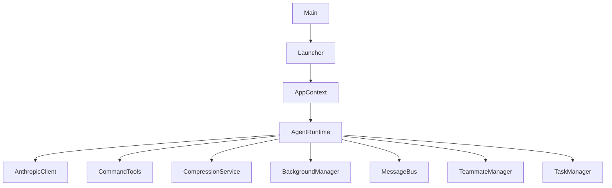

**图表来源**
- [Main.java:1-15](file://src/main/java/com/learnclaudecode/Main.java#L1-L15)
- [Launcher.java:1-28](file://src/main/java/com/learnclaudecode/agents/Launcher.java#L1-L28)
- [AppContext.java:1-70](file://src/main/java/com/learnclaudecode/agents/AppContext.java#L1-L70)
- [AgentRuntime.java:1-351](file://src/main/java/com/learnclaudecode/agents/AgentRuntime.java#L1-L351)

**章节来源**
- [Main.java:1-15](file://src/main/java/com/learnclaudecode/Main.java#L1-L15)
- [Launcher.java:1-28](file://src/main/java/com/learnclaudecode/agents/Launcher.java#L1-L28)
- [AppContext.java:1-70](file://src/main/java/com/learnclaudecode/agents/AppContext.java#L1-L70)

## 核心组件
- AgentRuntime：统一编排消息历史、系统提示、工具集，驱动主循环，负责工具分发与结果回灌。
- AnthropicClient：构造请求体、设置超时与鉴权头，发送 HTTP 请求并解析响应。
- StageConfig：定义不同教学阶段的 system prompt、工具集与功能开关。
- CommandTools：安全的 shell 执行与文件读写编辑。
- CompressionService：微压缩与自动压缩，控制上下文窗口压力。
- BackgroundManager：异步后台任务执行与通知队列。
- MessageBus：基于文件的收件箱消息总线，支持点对点与广播。
- TeammateManager：队友生命周期管理、协议处理与自治模式。
- TaskManager：任务持久化、状态流转与依赖清理。

**章节来源**
- [AgentRuntime.java:1-351](file://src/main/java/com/learnclaudecode/agents/AgentRuntime.java#L1-L351)
- [AnthropicClient.java:1-103](file://src/main/java/com/learnclaudecode/common/AnthropicClient.java#L1-L103)
- [StageConfig.java:1-301](file://src/main/java/com/learnclaudecode/agents/StageConfig.java#L1-L301)
- [CommandTools.java:1-146](file://src/main/java/com/learnclaudecode/tools/CommandTools.java#L1-L146)
- [CompressionService.java:1-172](file://src/main/java/com/learnclaudecode/context/CompressionService.java#L1-L172)
- [BackgroundManager.java:1-160](file://src/main/java/com/learnclaudecode/background/BackgroundManager.java#L1-L160)
- [MessageBus.java:1-123](file://src/main/java/com/learnclaudecode/team/MessageBus.java#L1-L123)
- [TeammateManager.java:1-438](file://src/main/java/com/learnclaudecode/team/TeammateManager.java#L1-L438)
- [TaskManager.java:1-338](file://src/main/java/com/learnclaudecode/tasks/TaskManager.java#L1-L338)

## 架构总览
下图展示“用户输入 -> 模型调用 -> 工具执行 -> 结果返回”的主控流程，以及后台任务与消息总线的并行通道。

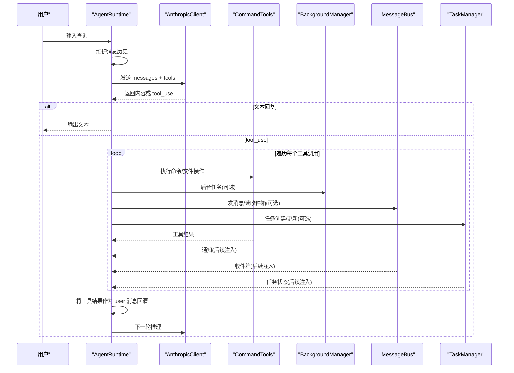

**图表来源**
- [AgentRuntime.java:97-261](file://src/main/java/com/learnclaudecode/agents/AgentRuntime.java#L97-L261)
- [AnthropicClient.java:52-101](file://src/main/java/com/learnclaudecode/common/AnthropicClient.java#L52-L101)
- [BackgroundManager.java:43-123](file://src/main/java/com/learnclaudecode/background/BackgroundManager.java#L43-L123)
- [MessageBus.java:54-121](file://src/main/java/com/learnclaudecode/team/MessageBus.java#L54-L121)
- [TaskManager.java:51-133](file://src/main/java/com/learnclaudecode/tasks/TaskManager.java#L51-L133)

## 详细组件分析

### AgentRuntime：主循环与工具调度
- 接收用户输入，追加为 user 消息进入历史。
- 每轮先做轻量裁剪与自动压缩（可配置），再读取后台通知与收件箱，合并进历史。
- 调用模型获取下一步动作；若为 tool_use，则根据工具名分派到对应本地实现，收集结果后以 user 消息形式回灌，继续下一轮。
- 子代理通过独立消息上下文隔离执行，限制工具权限。

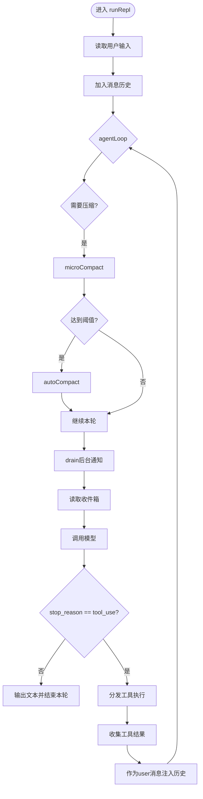

**图表来源**
- [AgentRuntime.java:97-261](file://src/main/java/com/learnclaudecode/agents/AgentRuntime.java#L97-L261)
- [CompressionService.java:69-170](file://src/main/java/com/learnclaudecode/context/CompressionService.java#L69-L170)
- [BackgroundManager.java:154-158](file://src/main/java/com/learnclaudecode/background/BackgroundManager.java#L154-L158)
- [MessageBus.java:83-101](file://src/main/java/com/learnclaudecode/team/MessageBus.java#L83-L101)

**章节来源**
- [AgentRuntime.java:97-310](file://src/main/java/com/learnclaudecode/agents/AgentRuntime.java#L97-L310)

### AnthropicClient：模型网关
- 组装 payload：model、max_tokens、messages、system、tools。
- 设置 Base URL、超时、鉴权头，发送 HTTP 请求。
- 解析响应为结构化对象，供上层判断是否 tool_use。

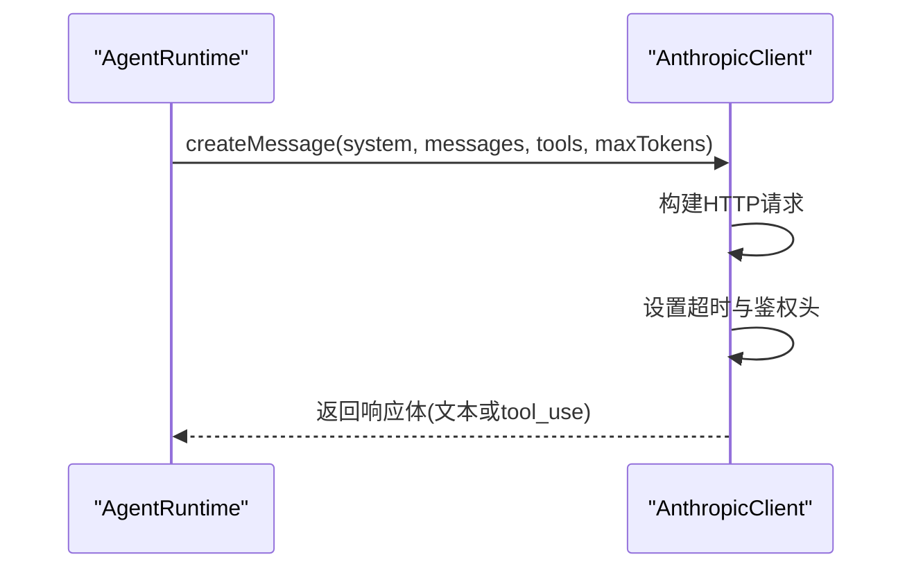

**图表来源**
- [AnthropicClient.java:52-101](file://src/main/java/com/learnclaudecode/common/AnthropicClient.java#L52-L101)

**章节来源**
- [AnthropicClient.java:1-103](file://src/main/java/com/learnclaudecode/common/AnthropicClient.java#L1-L103)

### CommandTools：安全执行与文件操作
- 黑名单拦截危险命令，限定工作区目录执行。
- 跨平台 shell 命令构造，超时保护与输出截断。
- 文件读取支持行数限制，写入自动创建目录，编辑采用精确替换。

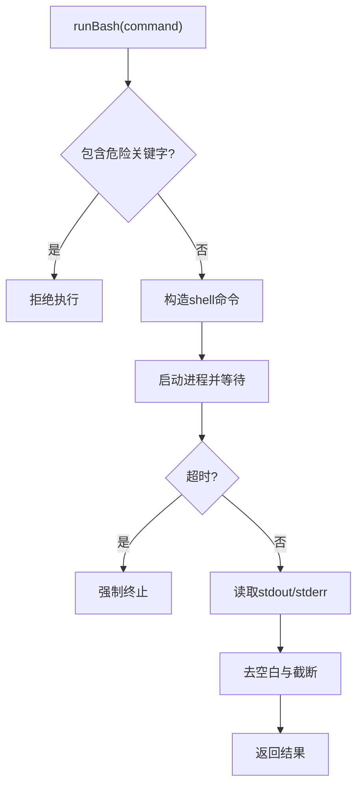

**图表来源**
- [CommandTools.java:36-78](file://src/main/java/com/learnclaudecode/tools/CommandTools.java#L36-L78)
- [CommandTools.java:87-144](file://src/main/java/com/learnclaudecode/tools/CommandTools.java#L87-L144)

**章节来源**
- [CommandTools.java:1-146](file://src/main/java/com/learnclaudecode/tools/CommandTools.java#L1-L146)

### CompressionService：上下文压缩
- microCompact：仅清理较老的 tool_result 大文本，保留最近若干条完整上下文。
- autoCompact：将完整历史落盘为 transcript，调用模型生成摘要，用“摘要+确认”替换旧历史。
- needsAutoCompact：基于 JSON 长度估算 token 数，超过阈值触发自动压缩。

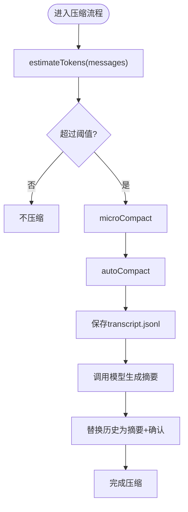

**图表来源**
- [CompressionService.java:56-170](file://src/main/java/com/learnclaudecode/context/CompressionService.java#L56-L170)

**章节来源**
- [CompressionService.java:1-172](file://src/main/java/com/learnclaudecode/context/CompressionService.java#L1-L172)

### BackgroundManager：异步任务与通知
- run：分配 taskId，提交单线程执行器执行命令，立即返回任务启动信息。
- execute：在工作区根目录执行命令，捕获 stdout/stderr，记录状态与结果，投递通知到队列。
- drain：主循环周期性取出通知，注入对话历史。

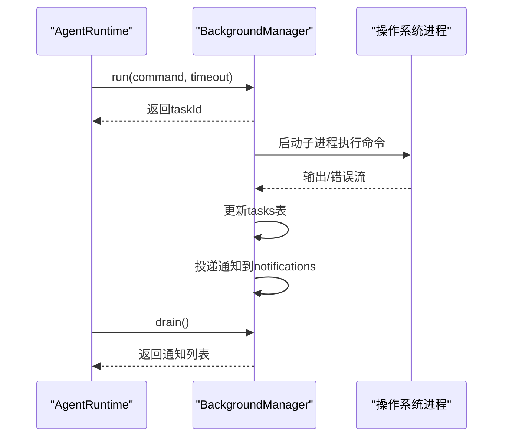

**图表来源**
- [BackgroundManager.java:43-123](file://src/main/java/com/learnclaudecode/background/BackgroundManager.java#L43-L123)
- [BackgroundManager.java:154-158](file://src/main/java/com/learnclaudecode/background/BackgroundManager.java#L154-L158)

**章节来源**
- [BackgroundManager.java:1-160](file://src/main/java/com/learnclaudecode/background/BackgroundManager.java#L1-L160)

### MessageBus：文件型消息总线
- send：校验类型，序列化消息并追加到目标收件箱文件。
- readInbox：读取并清空收件箱，实现“读即消费”。
- broadcast：向多个队友发送广播消息。

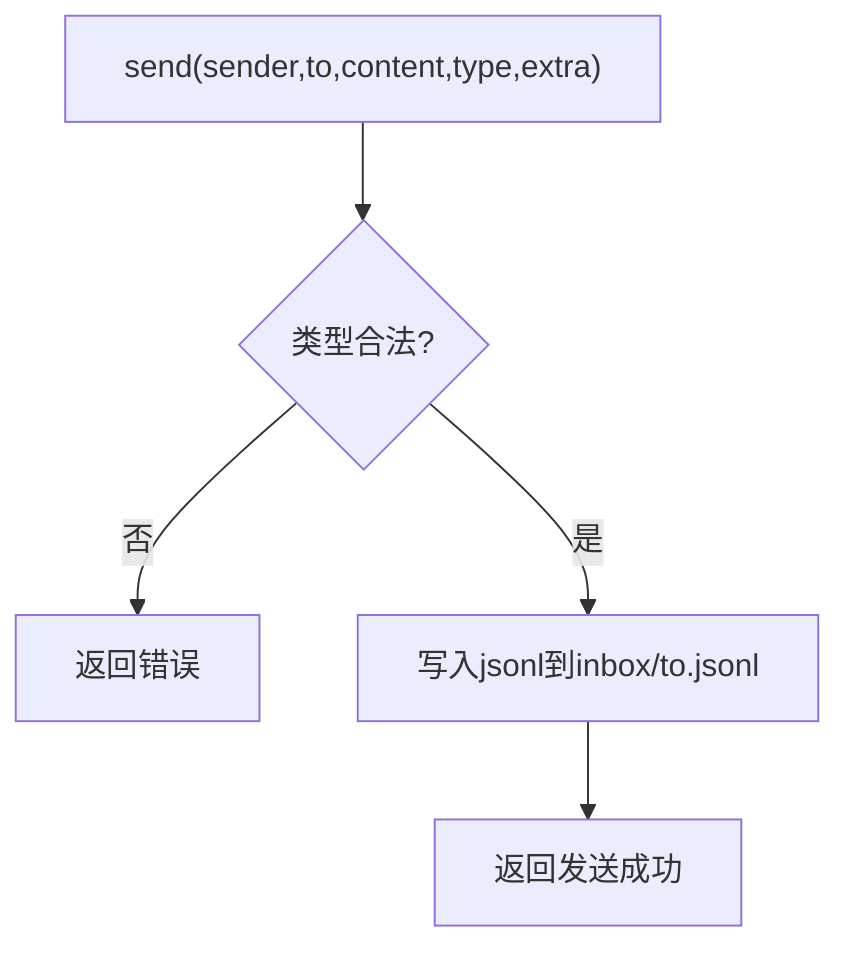

**图表来源**
- [MessageBus.java:54-75](file://src/main/java/com/learnclaudecode/team/MessageBus.java#L54-L75)
- [MessageBus.java:83-101](file://src/main/java/com/learnclaudecode/team/MessageBus.java#L83-L101)
- [MessageBus.java:112-121](file://src/main/java/com/learnclaudecode/team/MessageBus.java#L112-L121)

**章节来源**
- [MessageBus.java:1-123](file://src/main/java/com/learnclaudecode/team/MessageBus.java#L1-L123)

### TeammateManager：多代理协作与自治
- spawn：创建队友线程，持久化成员配置，启动独立循环。
- loop：读取收件箱消息，调用模型，执行工具（通信、任务认领、协议响应等），自治模式下空闲时尝试自动接单。
- 协议：shutdown_request/response、plan_approval/response。

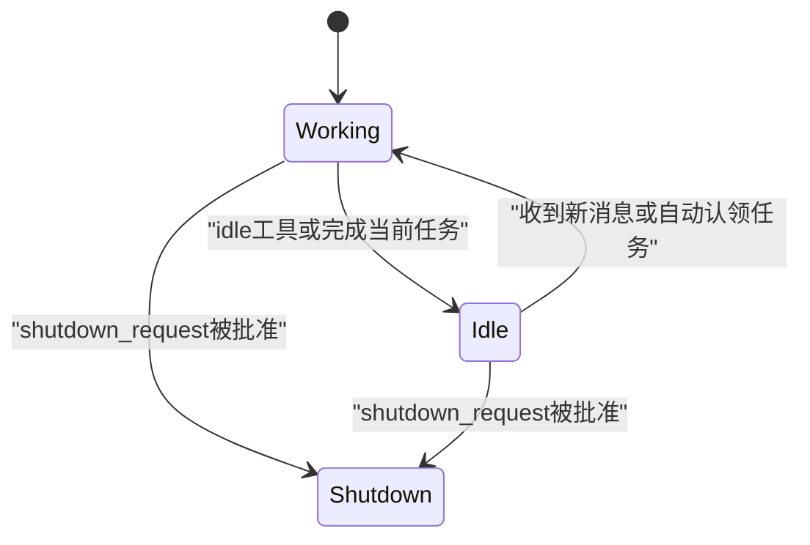

**图表来源**
- [TeammateManager.java:81-105](file://src/main/java/com/learnclaudecode/team/TeammateManager.java#L81-L105)
- [TeammateManager.java:177-273](file://src/main/java/com/learnclaudecode/team/TeammateManager.java#L177-L273)
- [TeammateManager.java:321-356](file://src/main/java/com/learnclaudecode/team/TeammateManager.java#L321-L356)

**章节来源**
- [TeammateManager.java:1-438](file://src/main/java/com/learnclaudecode/team/TeammateManager.java#L1-L438)

### TaskManager：任务板与依赖管理
- create/get/update/listAll/claim：任务全生命周期管理。
- 依赖清理：任务完成后自动清除其他任务的 blockedBy 依赖。
- worktree 绑定：将任务与工作目录关联，便于隔离执行。

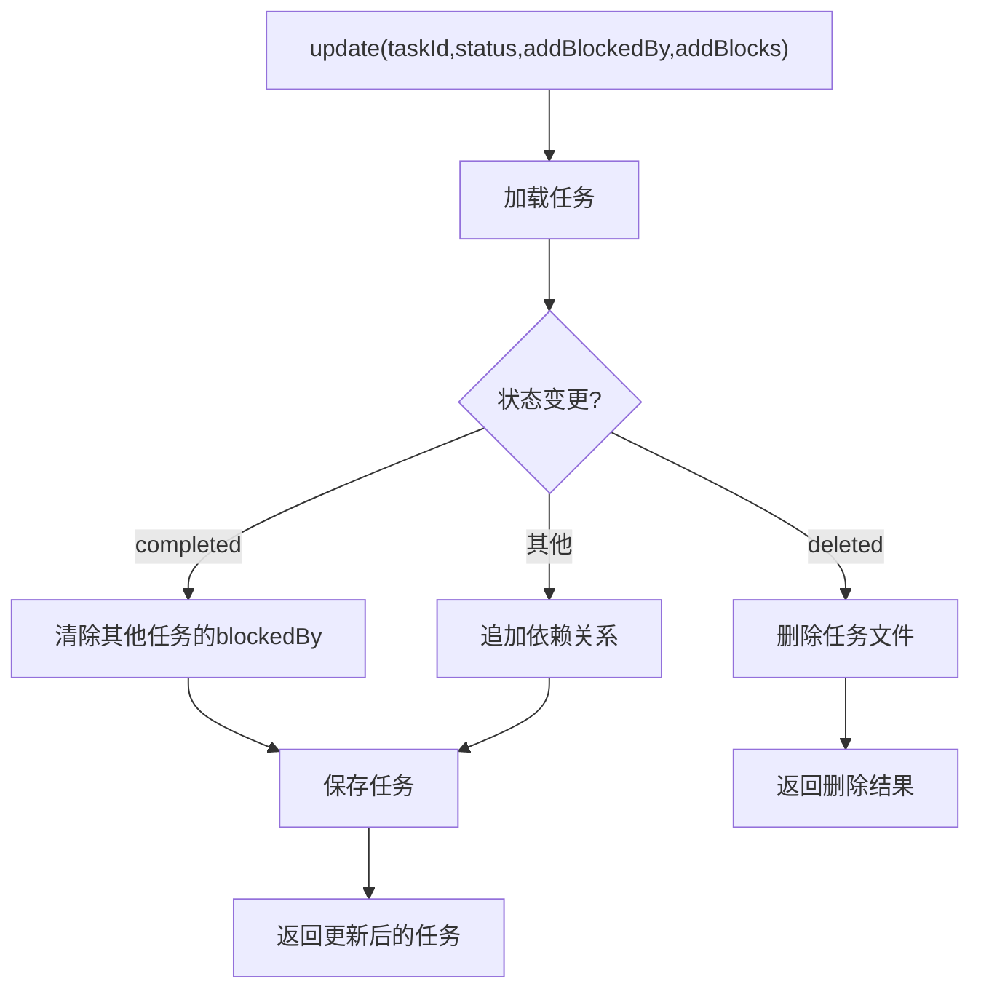

**图表来源**
- [TaskManager.java:84-133](file://src/main/java/com/learnclaudecode/tasks/TaskManager.java#L84-L133)
- [TaskManager.java:329-336](file://src/main/java/com/learnclaudecode/tasks/TaskManager.java#L329-L336)

**章节来源**
- [TaskManager.java:1-338](file://src/main/java/com/learnclaudecode/tasks/TaskManager.java#L1-L338)

## 依赖关系分析
- AgentRuntime 强依赖 AnthropicClient、CommandTools、CompressionService、BackgroundManager、MessageBus、TeammateManager、TaskManager。
- StageConfig 提供工具集与系统提示模板，决定运行时能力边界。
- AppContext 集中装配所有共享服务，避免重复初始化。
- 各 Manager/Service 之间通过文件与内存数据结构解耦，降低耦合度。

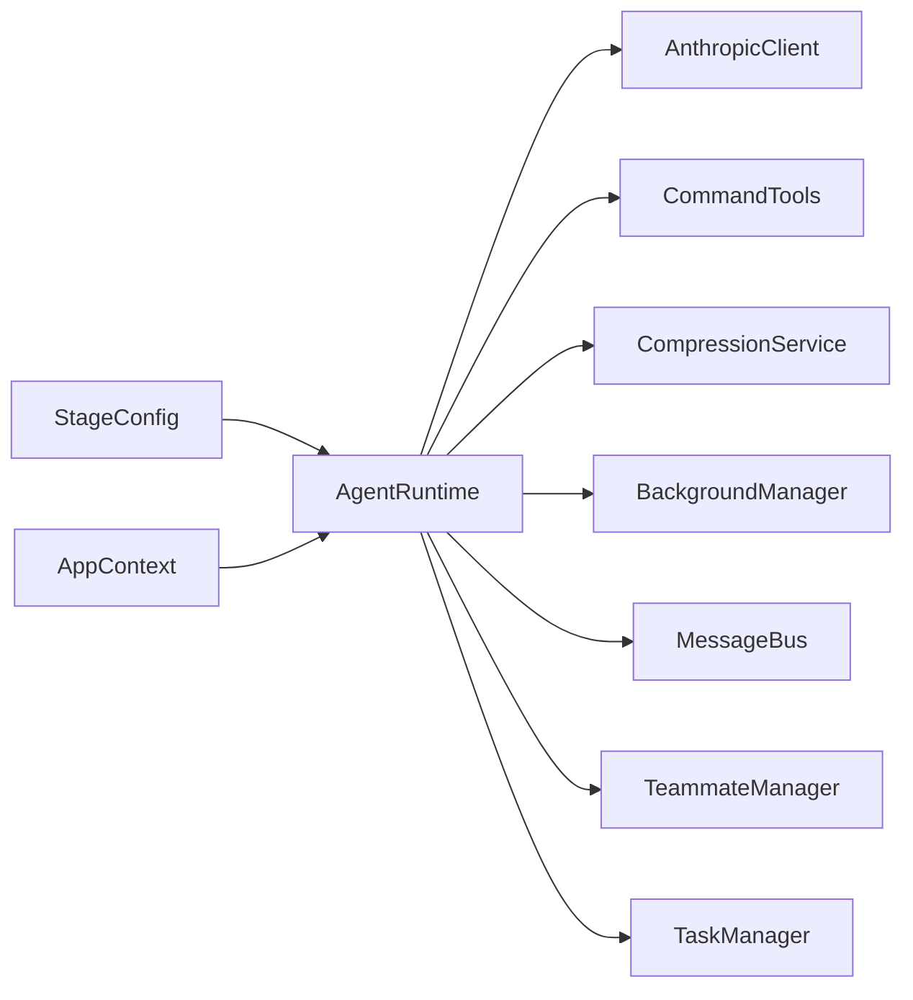

**图表来源**
- [AppContext.java:35-59](file://src/main/java/com/learnclaudecode/agents/AppContext.java#L35-L59)
- [AgentRuntime.java:41-90](file://src/main/java/com/learnclaudecode/agents/AgentRuntime.java#L41-L90)
- [StageConfig.java:56-267](file://src/main/java/com/learnclaudecode/agents/StageConfig.java#L56-L267)

**章节来源**
- [AppContext.java:1-70](file://src/main/java/com/learnclaudecode/agents/AppContext.java#L1-L70)
- [AgentRuntime.java:1-351](file://src/main/java/com/learnclaudecode/agents/AgentRuntime.java#L1-L351)
- [StageConfig.java:1-301](file://src/main/java/com/learnclaudecode/agents/StageConfig.java#L1-L301)

## 性能考虑
- 上下文窗口控制：
  - microCompact 仅清理较老的大文本结果，保留最近若干条完整上下文，减少不必要的摘要开销。
  - autoCompact 在达到阈值时转存完整历史并生成摘要，避免无限增长导致延迟与成本上升。
- 工具执行优化：
  - 文件读取支持 limit，防止超大文件阻塞上下文。
  - 命令执行设置超时，避免长时间占用资源。
- 后台任务：
  - 使用独立线程执行长耗时任务，主循环非阻塞；通知队列批量 drain，降低频繁 IO。
- 消息总线：
  - 基于文件 jsonl 的“读即消费”，简单可靠；在高并发场景下可通过锁或队列升级。
- 资源管理：
  - 子进程强制终止与异常捕获，避免僵尸进程。
  - 团队配置与任务文件落盘失败时抛出明确异常，便于快速定位。

[本节为通用性能建议，不直接分析具体代码片段]

## 故障排查指南
- 模型调用失败：
  - 检查网络连通性、API Key、Base URL 是否正确；客户端在 HTTP 错误码 >= 400 时抛出异常并附带响应体，便于调试。
- 命令执行失败：
  - 检查命令是否被黑名单拦截；查看超时与进程退出码；注意工作区路径是否正确。
- 后台任务无输出：
  - 使用 check 接口查询任务状态；确认通知队列是否被 drain；检查 stdout/stderr 拼接逻辑。
- 收件箱为空：
  - 确认 send 是否成功写入文件；readInbox 会清空文件，确保消费者及时读取。
- 任务依赖未清理：
  - 确认任务状态更新为 completed；检查 clearDependency 是否被执行。

**章节来源**
- [AnthropicClient.java:87-101](file://src/main/java/com/learnclaudecode/common/AnthropicClient.java#L87-L101)
- [CommandTools.java:36-78](file://src/main/java/com/learnclaudecode/tools/CommandTools.java#L36-L78)
- [BackgroundManager.java:131-158](file://src/main/java/com/learnclaudecode/background/BackgroundManager.java#L131-L158)
- [MessageBus.java:54-101](file://src/main/java/com/learnclaudecode/team/MessageBus.java#L54-L101)
- [TaskManager.java:84-133](file://src/main/java/com/learnclaudecode/tasks/TaskManager.java#L84-L133)

## 结论
该项目以 AgentRuntime 为核心，围绕“消息历史 -> 模型推理 -> 工具执行 -> 结果回灌”的主循环，结合后台任务、消息总线、任务系统与上下文压缩，形成可扩展、可配置的 Agent 框架。通过 StageConfig 的能力开关，可以在不同阶段逐步引入更复杂的机制，既适合教学演示，也具备工程实践价值。错误处理与资源管理贯穿各组件，保障系统在复杂交互下的健壮性。