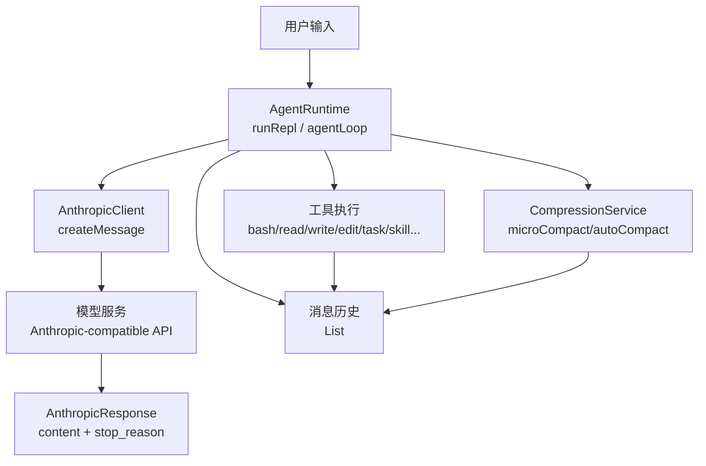
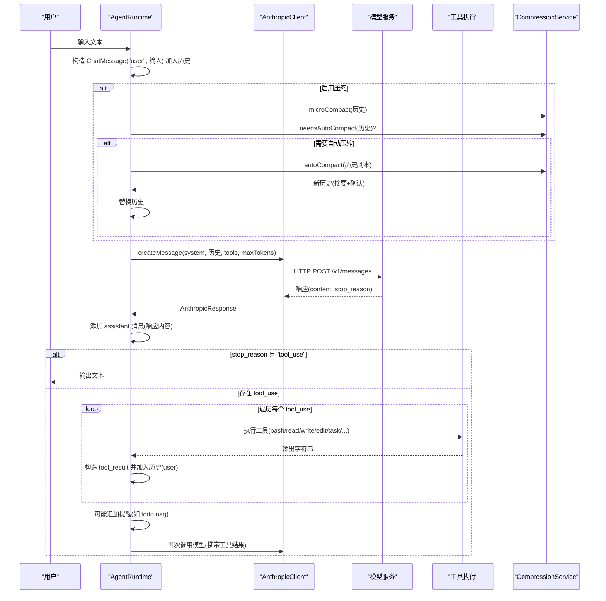
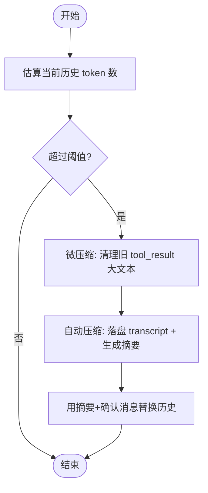
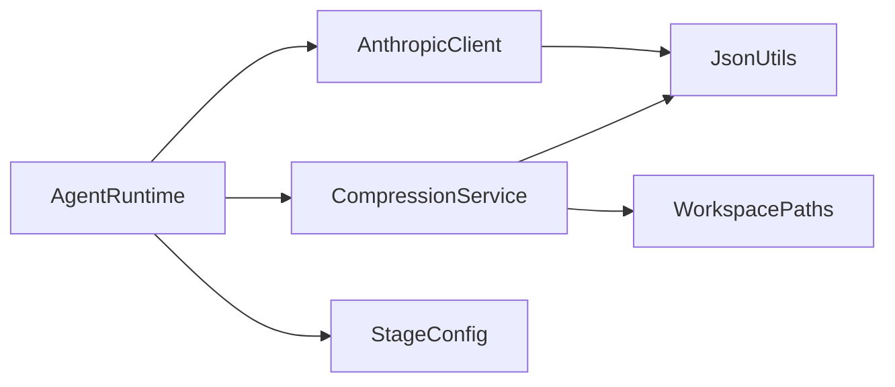

# 消息处理机制

<cite>
**本文引用的文件**
- [AgentRuntime.java](file://src/main/java/com/learnclaudecode/agents/AgentRuntime.java)
- [AnthropicClient.java](file://src/main/java/com/learnclaudecode/common/AnthropicClient.java)
- [CompressionService.java](file://src/main/java/com/learnclaudecode/context/CompressionService.java)
- [ChatMessage.java](file://src/main/java/com/learnclaudecode/model/ChatMessage.java)
- [AnthropicResponse.java](file://src/main/java/com/learnclaudecode/model/AnthropicResponse.java)
- [JsonUtils.java](file://src/main/java/com/learnclaudecode/common/JsonUtils.java)
- [StageConfig.java](file://src/main/java/com/learnclaudecode/agents/StageConfig.java)
- [AppContext.java](file://src/main/java/com/learnclaudecode/agents/AppContext.java)
- [Launcher.java](file://src/main/java/com/learnclaudecode/agents/Launcher.java)
</cite>

## 目录
1. [简介](#简介)
2. [项目结构](#项目结构)
3. [核心组件](#核心组件)
4. [架构总览](#架构总览)
5. [详细组件分析](#详细组件分析)
6. [依赖关系分析](#依赖关系分析)
7. [性能考量](#性能考量)
8. [故障排查指南](#故障排查指南)
9. [结论](#结论)
10. [附录](#附录)

## 简介
本文件聚焦 Learn Claude Code Java 项目的消息处理机制，系统性解析从用户输入到模型响应、再到工具调用与上下文压缩的完整流程。重点包括：
- 用户输入如何转换为 ChatMessage 并加入消息历史
- 消息生命周期管理：创建、存储、压缩、清理
- 模型响应的处理逻辑：文本回复与 tool_use 的分支处理
- 消息格式规范：user、assistant、tool_use、tool_result 等结构
- 消息历史维护策略：上下文压缩、截断与内存优化
- 时序图展示端到端的消息流转
- 错误处理与异常恢复机制

## 项目结构
本项目采用分层与能力开关组合的设计：
- 运行时层：AgentRuntime 负责主循环、消息历史、工具调度与压缩触发
- 通信层：AnthropicClient 封装 HTTP 请求与响应解析
- 数据模型层：ChatMessage、AnthropicResponse 定义消息与响应结构
- 上下文层：CompressionService 提供微压缩与自动压缩
- 配置层：StageConfig 控制不同阶段的能力（工具集、system prompt、压缩开关）
- 装配层：AppContext 统一装配服务，Launcher 作为入口

图表来源
- [AgentRuntime.java:97-261](file://src/main/java/com/learnclaudecode/agents/AgentRuntime.java#L97-L261)
- [AnthropicClient.java:52-100](file://src/main/java/com/learnclaudecode/common/AnthropicClient.java#L52-L100)
- [CompressionService.java:56-170](file://src/main/java/com/learnclaudecode/context/CompressionService.java#L56-L170)

章节来源
- [AppContext.java:35-59](file://src/main/java/com/learnclaudecode/agents/AppContext.java#L35-L59)
- [Launcher.java:23-26](file://src/main/java/com/learnclaudecode/agents/Launcher.java#L23-L26)

## 核心组件
- AgentRuntime：实现“观察上下文 -> 调模型 -> 执行动作 -> 更新上下文”的主循环；维护消息历史；触发压缩；分发工具调用；将工具结果回灌为 user 消息。
- AnthropicClient：构造请求体（model、messages、system、tools、max_tokens），发送 HTTP 请求，解析响应为 AnthropicResponse。
- CompressionService：估算 token、微压缩旧 tool_result、自动压缩并生成摘要，落盘 transcript 以便回溯。
- ChatMessage：轻量消息记录，role 与 content（可为文本或结构化列表）。
- AnthropicResponse：包含 stop_reason 与 content（文本块或 tool_use 列表）。
- StageConfig：按阶段注入 system prompt、工具集与功能开关（压缩、后台、团队等）。
- JsonUtils：统一的 JSON 序列化/反序列化，用于 payload 构建与 transcript 落盘。

章节来源
- [AgentRuntime.java:40-90](file://src/main/java/com/learnclaudecode/agents/AgentRuntime.java#L40-L90)
- [AnthropicClient.java:27-41](file://src/main/java/com/learnclaudecode/common/AnthropicClient.java#L27-L41)
- [CompressionService.java:29-48](file://src/main/java/com/learnclaudecode/context/CompressionService.java#L29-L48)
- [ChatMessage.java:3-7](file://src/main/java/com/learnclaudecode/model/ChatMessage.java#L3-L7)
- [AnthropicResponse.java:8-13](file://src/main/java/com/learnclaudecode/model/AnthropicResponse.java#L8-L13)
- [StageConfig.java:26-49](file://src/main/java/com/learnclaudecode/agents/StageConfig.java#L26-L49)
- [JsonUtils.java:12-15](file://src/main/java/com/learnclaudecode/common/JsonUtils.java#L12-L15)

## 架构总览
下图展示了从用户输入到最终响应的端到端消息流，包括工具调用与上下文压缩的关键节点。

图表来源
- [AgentRuntime.java:97-261](file://src/main/java/com/learnclaudecode/agents/AgentRuntime.java#L97-L261)
- [AnthropicClient.java:52-100](file://src/main/java/com/learnclaudecode/common/AnthropicClient.java#L52-L100)
- [CompressionService.java:56-170](file://src/main/java/com/learnclaudecode/context/CompressionService.java#L56-L170)

## 详细组件分析

### 用户输入到消息历史的转换
- 用户在 REPL 中输入文本后，AgentRuntime 将其包装为 ChatMessage(role="user", content=文本)，并追加到历史列表。
- 随后进入 agentLoop，准备调用模型。

章节来源
- [AgentRuntime.java:97-123](file://src/main/java/com/learnclaudecode/agents/AgentRuntime.java#L97-L123)

### 模型调用与响应处理
- AgentRuntime 通过 AnthropicClient.createMessage 发送系统提示、消息历史、工具定义与最大 token 数。
- 响应被解析为 AnthropicResponse，包含 content（文本块或 tool_use 列表）和 stop_reason。
- 若 stop_reason 不是 "tool_use"，则视为最终文本回复，直接输出给用户。
- 若存在 tool_use，则逐一映射到本地工具执行，并将结果以 tool_result 形式作为新的 user 消息回灌到历史，继续下一轮。

章节来源
- [AgentRuntime.java:131-176](file://src/main/java/com/learnclaudecode/agents/AgentRuntime.java#L131-L176)
- [AnthropicClient.java:52-100](file://src/main/java/com/learnclaudecode/common/AnthropicClient.java#L52-L100)
- [AnthropicResponse.java:8-13](file://src/main/java/com/learnclaudecode/model/AnthropicResponse.java#L8-L13)

### 工具调用与结果回灌
- 工具映射覆盖 bash、read_file、write_file、edit_file、todo/TodoWrite、task、load_skill、compact、background_run/check_background、任务管理、团队协作、worktree 等。
- 每次工具执行后，构造 tool_result（type="tool_result", tool_use_id, content=输出），追加到历史。
- 可选提醒机制：在多轮未更新 todo 时插入提醒文本块，引导模型更新计划。

章节来源
- [AgentRuntime.java:177-259](file://src/main/java/com/learnclaudecode/agents/AgentRuntime.java#L177-L259)
- [StageConfig.java:56-69](file://src/main/java/com/learnclaudecode/agents/StageConfig.java#L56-L69)

### 上下文压缩与清理
- 微压缩（microCompact）：扫描历史中的 tool_result，仅对较老的长文本内容进行占位替换，保留最近若干条完整结果，减少上下文体积而不破坏结构信息。
- 自动压缩（autoCompact）：当估算 token 超过阈值时，先将完整历史落盘为 jsonl 格式的 transcript，再调用模型生成摘要，用“摘要+确认”两条消息替换原历史，确保可追溯性。
- 估算方法：使用 JSON 长度除以 4 近似 token 数，适合教学场景快速判断是否接近窗口上限。

图表来源
- [CompressionService.java:56-170](file://src/main/java/com/learnclaudecode/context/CompressionService.java#L56-L170)

章节来源
- [CompressionService.java:56-170](file://src/main/java/com/learnclaudecode/context/CompressionService.java#L56-L170)
- [AgentRuntime.java:131-145](file://src/main/java/com/learnclaudecode/agents/AgentRuntime.java#L131-L145)

### 消息格式规范
- ChatMessage：由 role 与 content 组成。role 支持 "user"、"assistant"；content 可为文本或结构化列表（如 tool_result 集合）。
- AnthropicResponse：包含 stop_reason 与 content（文本块或 tool_use 列表）。
- 工具定义：由 StageConfig.baseTools 及后续阶段扩展，遵循 messages API 的 tool 结构（name、description、input_schema）。
- 工具结果：type="tool_result"，附带 tool_use_id 与 content（字符串输出）。

章节来源
- [ChatMessage.java:3-7](file://src/main/java/com/learnclaudecode/model/ChatMessage.java#L3-L7)
- [AnthropicResponse.java:8-13](file://src/main/java/com/learnclaudecode/model/AnthropicResponse.java#L8-L13)
- [StageConfig.java:56-69](file://src/main/java/com/learnclaudecode/agents/StageConfig.java#L56-L69)
- [AgentRuntime.java:236-241](file://src/main/java/com/learnclaudecode/agents/AgentRuntime.java#L236-L241)

### 消息历史维护策略
- 每轮循环先进行微压缩，必要时触发自动压缩，避免历史无限增长。
- 工具结果以 user 消息形式回灌，使模型基于真实世界状态继续推理。
- 后台任务与团队消息会被合并为新的 user 消息注入历史，保证上下文一致性。
- 手动 compact 工具会延迟到本轮工具结果写回后再执行真正压缩，避免中断对话。

章节来源
- [AgentRuntime.java:131-176](file://src/main/java/com/learnclaudecode/agents/AgentRuntime.java#L131-L176)
- [AgentRuntime.java:202-259](file://src/main/java/com/learnclaudecode/agents/AgentRuntime.java#L202-L259)

## 依赖关系分析
- AgentRuntime 依赖 AnthropicClient、CompressionService、StageConfig 以及各类工具管理器，形成“运行时中心”的耦合模式。
- AnthropicClient 依赖 EnvConfig 与 JsonUtils，屏蔽网络细节，向上提供统一接口。
- CompressionService 依赖 WorkspacePaths、AnthropicClient 与 JsonUtils，完成落盘与摘要生成。
- StageConfig 提供各阶段能力视图，解耦具体实现与运行期配置。

图表来源
- [AgentRuntime.java:40-90](file://src/main/java/com/learnclaudecode/agents/AgentRuntime.java#L40-L90)
- [AnthropicClient.java:27-41](file://src/main/java/com/learnclaudecode/common/AnthropicClient.java#L27-L41)
- [CompressionService.java:29-48](file://src/main/java/com/learnclaudecode/context/CompressionService.java#L29-L48)

章节来源
- [AppContext.java:35-59](file://src/main/java/com/learnclaudecode/agents/AppContext.java#L35-L59)

## 性能考量
- 估算 token 使用 JSON 长度/4 的近似方法，计算开销低，适合教学场景快速决策。
- 微压缩优先于自动压缩，尽量保留最近几轮完整上下文，降低模型理解成本。
- 自动压缩将完整历史落盘为 jsonl，便于后续回溯与分析，但会增加 I/O 开销。
- 工具执行结果在回灌前进行长度限制打印，避免控制台输出过大影响交互体验。

[本节为通用指导，不直接分析具体文件]

## 故障排查指南
- 网络调用失败：AnthropicClient 在 HTTP 状态码 >= 400 时抛出业务异常，包含状态码与响应体，便于定位兼容性问题。
- 中断与 IO 异常：捕获 IOException 与 InterruptedException，统一转为 IllegalStateException，避免上层重复处理网络细节。
- 压缩失败：autoCompact 中文件写入失败会抛出异常，需检查工作区路径权限与磁盘空间。
- 工具未知：switch default 返回 "Unknown tool"，应检查 StageConfig 工具定义与模型输出字段一致性。

章节来源
- [AnthropicClient.java:87-100](file://src/main/java/com/learnclaudecode/common/AnthropicClient.java#L87-L100)
- [CompressionService.java:156-159](file://src/main/java/com/learnclaudecode/context/CompressionService.java#L156-L159)
- [AgentRuntime.java:232-234](file://src/main/java/com/learnclaudecode/agents/AgentRuntime.java#L232-L234)

## 结论
该项目的消息处理机制围绕 AgentRuntime 展开，实现了“用户输入 -> 消息历史 -> 模型调用 -> 工具执行 -> 结果回灌 -> 上下文压缩”的闭环。通过 StageConfig 的能力开关与 CompressionService 的分层压缩策略，系统在保持交互流畅性的同时有效控制了上下文规模。错误处理与异常恢复机制确保了消息处理的健壮性，适合教学与扩展使用。

[本节为总结性内容，不直接分析具体文件]

## 附录
- 启动流程：Launcher.launch -> AppContext.runtime().runRepl -> AgentRuntime.runRepl -> agentLoop
- 关键路径参考：
  - 用户输入到历史：[AgentRuntime.java:97-123](file://src/main/java/com/learnclaudecode/agents/AgentRuntime.java#L97-L123)
  - 模型调用与响应：[AgentRuntime.java:131-176](file://src/main/java/com/learnclaudecode/agents/AgentRuntime.java#L131-L176), [AnthropicClient.java:52-100](file://src/main/java/com/learnclaudecode/common/AnthropicClient.java#L52-L100)
  - 工具执行与结果回灌：[AgentRuntime.java:177-259](file://src/main/java/com/learnclaudecode/agents/AgentRuntime.java#L177-L259)
  - 上下文压缩：[CompressionService.java:56-170](file://src/main/java/com/learnclaudecode/context/CompressionService.java#L56-L170)
  - 消息与响应模型：[ChatMessage.java:3-7](file://src/main/java/com/learnclaudecode/model/ChatMessage.java#L3-L7), [AnthropicResponse.java:8-13](file://src/main/java/com/learnclaudecode/model/AnthropicResponse.java#L8-L13)