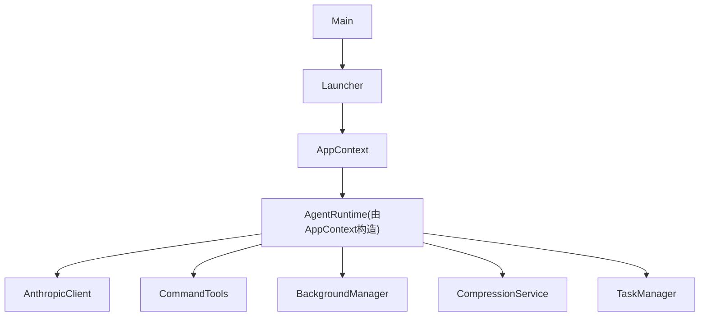
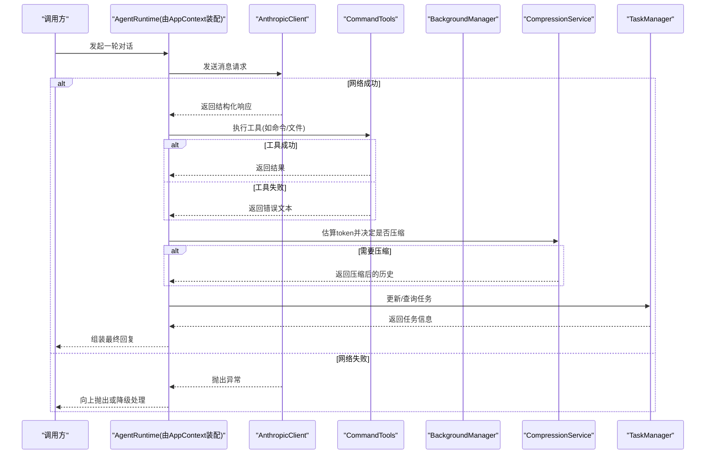
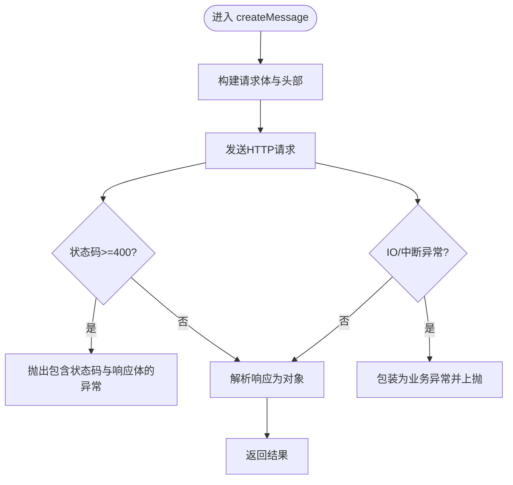
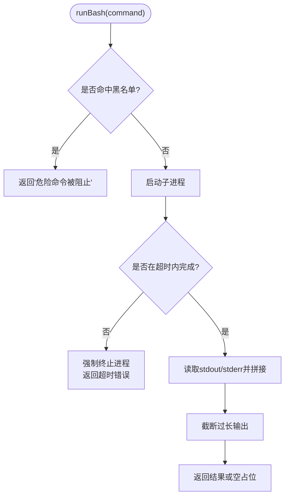
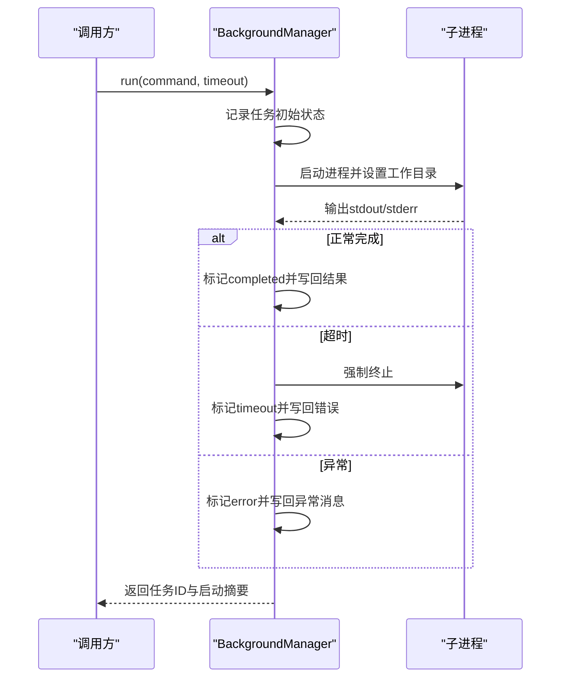
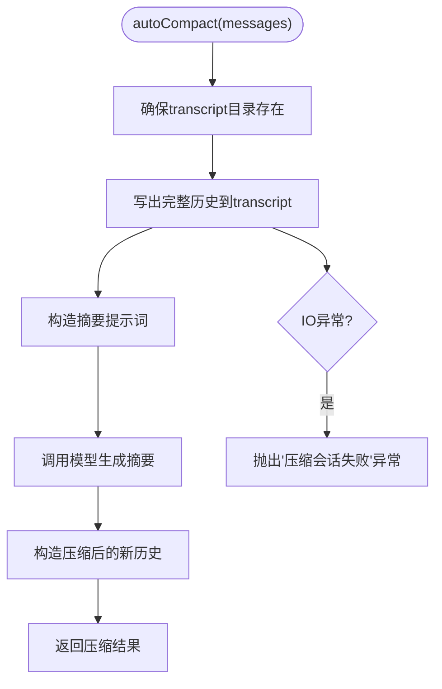
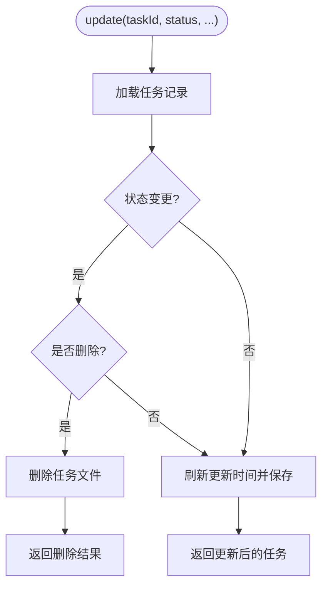
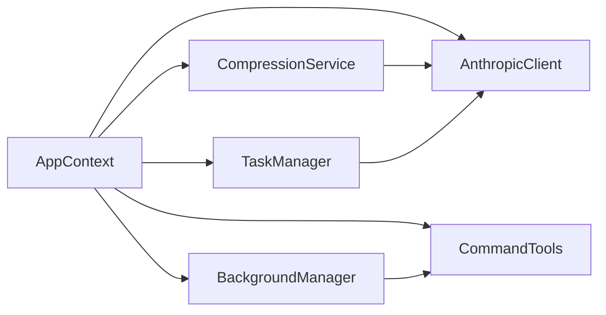

# 错误处理与传播

<cite>
**本文引用的文件**
- [Main.java](file://src/main/java/com/learnclaudecode/Main.java)
- [Launcher.java](file://src/main/java/com/learnclaudecode/agents/Launcher.java)
- [AppContext.java](file://src/main/java/com/learnclaudecode/agents/AppContext.java)
- [SFull.java](file://src/main/java/com/learnclaudecode/agents/SFull.java)
- [AnthropicClient.java](file://src/main/java/com/learnclaudecode/common/AnthropicClient.java)
- [EnvConfig.java](file://src/main/java/com/learnclaudecode/common/EnvConfig.java)
- [JsonUtils.java](file://src/main/java/com/learnclaudecode/common/JsonUtils.java)
- [WorkspacePaths.java](file://src/main/java/com/learnclaudecode/common/WorkspacePaths.java)
- [CommandTools.java](file://src/main/java/com/learnclaudecode/tools/CommandTools.java)
- [BackgroundManager.java](file://src/main/java/com/learnclaudecode/background/BackgroundManager.java)
- [CompressionService.java](file://src/main/java/com/learnclaudecode/context/CompressionService.java)
- [TaskManager.java](file://src/main/java/com/learnclaudecode/tasks/TaskManager.java)
</cite>

## 目录
1. [简介](#简介)
2. [项目结构](#项目结构)
3. [核心组件](#核心组件)
4. [架构总览](#架构总览)
5. [详细组件分析](#详细组件分析)
6. [依赖关系分析](#依赖关系分析)
7. [性能考量](#性能考量)
8. [故障排查指南](#故障排查指南)
9. [结论](#结论)
10. [附录](#附录)

## 简介
本文件聚焦 Learn Claude Code Java 项目的错误处理与传播机制，系统梳理网络请求、工具执行、I/O 与配置等场景下的异常捕获策略、错误分类分级、统一封装方式、跨层传播路径、重试与熔断思路，以及监控告警与排障实践。目标是帮助读者在不深入代码细节的前提下，快速掌握该项目的容错设计与可观测性要点。

## 项目结构
本项目采用分层组织：入口与装配（Main、Launcher、AppContext）、通用能力（common）、工具与子系统（tools、background、context、tasks）等。错误处理贯穿各层：
- 入口层负责启动并委托运行时；
- 装配层集中创建共享服务；
- 通用层提供网络、JSON、路径与环境配置；
- 工具与子系统层承载具体业务操作与副作用。

图表来源
- [Main.java:1-15](file://src/main/java/com/learnclaudecode/Main.java#L1-L15)
- [Launcher.java:1-28](file://src/main/java/com/learnclaudecode/agents/Launcher.java#L1-L28)
- [AppContext.java:1-70](file://src/main/java/com/learnclaudecode/agents/AppContext.java#L1-L70)

章节来源
- [Main.java:1-15](file://src/main/java/com/learnclaudecode/Main.java#L1-L15)
- [Launcher.java:1-28](file://src/main/java/com/learnclaudecode/agents/Launcher.java#L1-L28)
- [AppContext.java:1-70](file://src/main/java/com/learnclaudecode/agents/AppContext.java#L1-L70)

## 核心组件
- 网络客户端：负责对外部模型服务的 HTTP 调用与响应解析，集中处理网络异常与状态码。
- JSON 工具：统一序列化/反序列化失败的处理，避免上层重复捕获底层库异常。
- 工作区路径：安全校验相对路径，防止越权访问，抛出非法参数异常。
- 命令工具：执行 shell 命令，限制危险命令、超时控制、输出截断与异常包装。
- 后台任务：异步执行命令，统一记录状态与通知，异常归并为错误状态。
- 上下文压缩：在接近上下文上限时进行微压缩或自动压缩，落盘转录并生成摘要。
- 任务管理：基于文件的轻量任务板，读写失败统一转为业务异常。
- 环境配置：强制必填项缺失时报错，便于早期发现配置问题。

章节来源
- [AnthropicClient.java:1-103](file://src/main/java/com/learnclaudecode/common/AnthropicClient.java#L1-L103)
- [JsonUtils.java:1-83](file://src/main/java/com/learnclaudecode/common/JsonUtils.java#L1-L83)
- [WorkspacePaths.java:1-150](file://src/main/java/com/learnclaudecode/common/WorkspacePaths.java#L1-L150)
- [CommandTools.java:1-146](file://src/main/java/com/learnclaudecode/tools/CommandTools.java#L1-L146)
- [BackgroundManager.java:1-160](file://src/main/java/com/learnclaudecode/background/BackgroundManager.java#L1-L160)
- [CompressionService.java:1-172](file://src/main/java/com/learnclaudecode/context/CompressionService.java#L1-L172)
- [TaskManager.java:1-338](file://src/main/java/com/learnclaudecode/tasks/TaskManager.java#L1-L338)
- [EnvConfig.java:1-96](file://src/main/java/com/learnclaudecode/common/EnvConfig.java#L1-L96)

## 架构总览
下图展示一次“用户输入 -> 模型调用 -> 工具执行 -> 结果回传”的主链路，以及关键错误点与传播路径。

图表来源
- [AppContext.java:1-70](file://src/main/java/com/learnclaudecode/agents/AppContext.java#L1-L70)
- [AnthropicClient.java:1-103](file://src/main/java/com/learnclaudecode/common/AnthropicClient.java#L1-L103)
- [CommandTools.java:1-146](file://src/main/java/com/learnclaudecode/tools/CommandTools.java#L1-L146)
- [BackgroundManager.java:1-160](file://src/main/java/com/learnclaudecode/background/BackgroundManager.java#L1-L160)
- [CompressionService.java:1-172](file://src/main/java/com/learnclaudecode/context/CompressionService.java#L1-L172)
- [TaskManager.java:1-338](file://src/main/java/com/learnclaudecode/tasks/TaskManager.java#L1-L338)

## 详细组件分析

### 网络请求错误处理（AnthropicClient）
- 错误分类
  - 服务端错误：HTTP 状态码 >= 400，直接抛出包含状态码与响应体的异常，便于定位兼容性问题。
  - 网络/中断异常：IO 异常与线程中断统一包装为业务异常，保持上层无需感知底层网络细节。
- 错误传播
  - 通过异常向上抛出，由调用方（如 AgentRuntime）决定重试、降级或终止流程。
- 可恢复 vs 致命
  - 可恢复：临时网络抖动、超时，适合重试。
  - 致命：认证失败、参数错误、服务不可用，应快速失败并告警。
- 建议的重试与熔断
  - 指数退避重试：针对 5xx、超时、连接失败。
  - 熔断器：连续失败达到阈值后快速失败，降低雪崩风险。
  - 限流：按 QPS/并发限制保护下游。

图表来源
- [AnthropicClient.java:52-100](file://src/main/java/com/learnclaudecode/common/AnthropicClient.java#L52-L100)

章节来源
- [AnthropicClient.java:52-100](file://src/main/java/com/learnclaudecode/common/AnthropicClient.java#L52-L100)

### 工具执行错误处理（CommandTools）
- 错误分类
  - 安全拦截：黑名单命令直接拒绝，返回明确错误文本。
  - 超时：进程等待超过阈值，强制销毁并返回超时错误。
  - IO/中断：捕获并转换为可读错误文本，避免崩溃。
- 错误传播
  - 以字符串形式返回错误，便于上层聚合到消息中继续与模型交互。
- 可恢复 vs 致命
  - 可恢复：超时、权限不足，可提示重试或调整命令。
  - 致命：危险命令被拦截，应阻断并记录审计日志。
- 建议
  - 增加更细粒度的错误码（如 TIMEOUT、BLOCKED、IO_ERROR）。
  - 对长输出做分页/采样，避免上下文爆炸。

图表来源
- [CommandTools.java:36-65](file://src/main/java/com/learnclaudecode/tools/CommandTools.java#L36-L65)

章节来源
- [CommandTools.java:36-65](file://src/main/java/com/learnclaudecode/tools/CommandTools.java#L36-L65)

### 后台任务错误处理（BackgroundManager）
- 错误分类
  - 进程启动/读取异常：统一记为 error 状态，并将异常消息写入结果字段。
  - 超时：标记 timeout 并返回超时错误。
- 错误传播
  - 通过通知队列将摘要推送到主循环，供后续轮次消费；同时维护任务表供查询。
- 可恢复 vs 致命
  - 可恢复：瞬时 IO 错误，可重试或稍后检查。
  - 致命：命令本身非法或权限不足，需人工介入。
- 建议
  - 引入任务级别的重试次数与最大重试时间。
  - 对通知大小做限制，避免阻塞队列。

图表来源
- [BackgroundManager.java:43-123](file://src/main/java/com/learnclaudecode/background/BackgroundManager.java#L43-L123)

章节来源
- [BackgroundManager.java:43-123](file://src/main/java/com/learnclaudecode/background/BackgroundManager.java#L43-L123)

### 上下文压缩错误处理（CompressionService）
- 错误分类
  - 文件落盘失败：转译为业务异常，确保上层能感知压缩失败。
  - 模型调用失败：由 AnthropicClient 统一处理，此处仅接收结果。
- 错误传播
  - 若 transcript 无法写入，直接抛出异常，阻止继续压缩。
- 可恢复 vs 致命
  - 可恢复：磁盘空间不足但可清理，可重试。
  - 致命：权限不足或路径不存在且无法创建，需人工干预。
- 建议
  - 增加压缩失败的回退策略（保留原历史或仅做微压缩）。
  - 记录压缩耗时与触发原因，用于容量规划。

图表来源
- [CompressionService.java:118-159](file://src/main/java/com/learnclaudecode/context/CompressionService.java#L118-L159)

章节来源
- [CompressionService.java:118-159](file://src/main/java/com/learnclaudecode/context/CompressionService.java#L118-L159)

### 任务管理错误处理（TaskManager）
- 错误分类
  - 目录创建失败：初始化阶段即抛出异常，尽早暴露环境问题。
  - 任务不存在：读取时抛出非法参数异常。
  - 删除/保存失败：统一包装为业务异常。
- 错误传播
  - 所有 I/O 异常均转为 IllegalStateException，便于上层统一处理。
- 可恢复 vs 致命
  - 可恢复：临时文件系统拥塞，可重试。
  - 致命：权限不足或磁盘损坏，需停机修复。
- 建议
  - 引入事务式写入（先写临时文件再原子替换），减少部分写入导致的数据不一致。
  - 增加并发锁粒度优化，避免全局同步瓶颈。

图表来源
- [TaskManager.java:84-133](file://src/main/java/com/learnclaudecode/tasks/TaskManager.java#L84-L133)

章节来源
- [TaskManager.java:84-133](file://src/main/java/com/learnclaudecode/tasks/TaskManager.java#L84-L133)

### 环境与路径安全错误（EnvConfig、WorkspacePaths）
- EnvConfig
  - 必填环境变量缺失：抛出非法状态异常，阻止应用启动。
  - 优先级：系统环境变量优先于 .env，便于 CI/本地覆盖。
- WorkspacePaths
  - 路径逃逸防护：相对路径解析后必须位于工作区内，否则抛出非法参数异常。
  - 读写 I/O：方法声明抛出 IO 异常，由调用方决定处理策略。

章节来源
- [EnvConfig.java:22-39](file://src/main/java/com/learnclaudecode/common/EnvConfig.java#L22-L39)
- [WorkspacePaths.java:42-49](file://src/main/java/com/learnclaudecode/common/WorkspacePaths.java#L42-L49)

### JSON 序列化错误（JsonUtils）
- 统一捕获 Jackson 的 JsonProcessingException，并包装为 IllegalStateException，避免上层分散处理。
- 提供紧凑与格式化两种序列化方式，便于调试与传输。

章节来源
- [JsonUtils.java:29-34](file://src/main/java/com/learnclaudecode/common/JsonUtils.java#L29-L34)
- [JsonUtils.java:43-48](file://src/main/java/com/learnclaudecode/common/JsonUtils.java#L43-L48)
- [JsonUtils.java:59-64](file://src/main/java/com/learnclaudecode/common/JsonUtils.java#L59-L64)
- [JsonUtils.java:75-80](file://src/main/java/com/learnclaudecode/common/JsonUtils.java#L75-L80)

## 依赖关系分析
- 耦合度
  - AppContext 作为装配中心，集中依赖各子系统，形成高内聚低耦合的服务边界。
  - 各子系统通过接口化能力（如 CommandTools、WorkspacePaths）降低直接耦合。
- 外部依赖
  - 网络：Java HttpClient，受超时与状态码影响。
  - 文件：NIO Files，受权限与磁盘状态影响。
  - JSON：Jackson，受数据结构与版本兼容性影响。
- 潜在循环依赖
  - 当前未见明显循环引用；AppContext 单向依赖各模块。

图表来源
- [AppContext.java:1-70](file://src/main/java/com/learnclaudecode/agents/AppContext.java#L1-L70)
- [CompressionService.java:1-172](file://src/main/java/com/learnclaudecode/context/CompressionService.java#L1-L172)
- [BackgroundManager.java:1-160](file://src/main/java/com/learnclaudecode/background/BackgroundManager.java#L1-L160)
- [TaskManager.java:1-338](file://src/main/java/com/learnclaudecode/tasks/TaskManager.java#L1-L338)

章节来源
- [AppContext.java:1-70](file://src/main/java/com/learnclaudecode/agents/AppContext.java#L1-L70)

## 性能考量
- 网络
  - 合理设置连接与请求超时，避免长时间阻塞。
  - 对大响应体进行分块或限制，减少内存占用。
- 工具执行
  - 命令输出截断与分页，避免上下文过大。
  - 后台任务使用独立线程池，避免阻塞主循环。
- 文件 I/O
  - 批量写入与原子替换，减少竞争与部分写入。
  - 定期清理 transcript 与任务历史，控制磁盘增长。
- 压缩
  - 微压缩优先，仅在必要时触发自动压缩，降低模型调用成本。

[本节为通用指导，不直接分析具体文件]

## 故障排查指南
- 常见问题定位
  - 网络失败：检查 API Key、Base URL、防火墙与代理；查看状态码与响应体。
  - 工具执行失败：确认命令合法性、权限与工作目录；关注超时与黑名单拦截。
  - 文件 I/O 失败：检查工作区路径、权限与磁盘空间；查看 transcript 与任务目录。
  - 配置缺失：核对 MODEL_ID、ANTHROPIC_API_KEY、ANTHROPIC_BASE_URL 等必填项。
- 日志与调试
  - 在网络与 I/O 关键路径打印请求/响应摘要与耗时。
  - 对后台任务与压缩过程记录触发条件与结果摘要。
  - 使用结构化日志（含错误码、请求ID、堆栈片段）便于检索。
- 诊断技巧
  - 复现最小用例：隔离网络、工具、文件三类错误源。
  - 逐步禁用功能：关闭压缩或后台任务，验证是否为根因。
  - 观察资源使用：CPU、内存、磁盘 I/O 峰值与泄漏迹象。

章节来源
- [AnthropicClient.java:87-100](file://src/main/java/com/learnclaudecode/common/AnthropicClient.java#L87-L100)
- [CommandTools.java:36-65](file://src/main/java/com/learnclaudecode/tools/CommandTools.java#L36-L65)
- [BackgroundManager.java:68-123](file://src/main/java/com/learnclaudecode/background/BackgroundManager.java#L68-L123)
- [CompressionService.java:118-159](file://src/main/java/com/learnclaudecode/context/CompressionService.java#L118-L159)
- [TaskManager.java:35-41](file://src/main/java/com/learnclaudecode/tasks/TaskManager.java#L35-L41)
- [EnvConfig.java:22-39](file://src/main/java/com/learnclaudecode/common/EnvConfig.java#L22-L39)

## 结论
该项目在错误处理方面遵循“就近捕获、统一包装、清晰传播”的原则：网络与 JSON 异常在上层统一包装为业务异常；工具与后台任务将错误转化为可消费的文本或状态；路径与环境配置在早期阶段快速失败。建议在现有基础上补充标准化的错误码体系、重试与熔断策略、以及完善的监控告警，以提升系统的容错能力与可观测性。

[本节为总结性内容，不直接分析具体文件]

## 附录

### 错误分类与分级建议
- 分类
  - 网络类：超时、连接失败、服务端错误。
  - 工具类：命令被拦截、超时、IO 错误。
  - 数据类：JSON 解析失败、文件读写失败。
  - 配置类：环境变量缺失、路径非法。
- 分级
  - 可恢复：短暂异常，支持重试或降级。
  - 不可恢复：配置错误、权限不足、数据损坏，需人工介入。
- 标准化封装
  - 错误码：如 NET_TIMEOUT、NET_SERVER_ERR、CMD_BLOCKED、CMD_TIMEOUT、IO_ERROR、JSON_ERR、CONFIG_MISSING、PATH_ESCAPE。
  - 错误消息：包含上下文信息（请求ID、目标URL、命令、路径等）。
  - 堆栈跟踪：仅在服务端或调试模式输出，生产环境仅携带必要信息。

[本节为概念性内容，不直接分析具体文件]

### 重试与熔断策略（建议）
- 重试
  - 适用：网络超时、5xx、连接失败。
  - 策略：指数退避 + 抖动，最大重试次数与总时长限制。
  - 幂等性：确保重试不会造成副作用（如只读操作）。
- 熔断
  - 指标：失败率、慢调用比例、异常数。
  - 动作：快速失败、降级返回、告警。
  - 恢复：半开探测，逐步恢复流量。

[本节为概念性内容，不直接分析具体文件]

### 监控与告警最佳实践（建议）
- 指标
  - 网络：请求量、成功率、延迟分布、错误码分布。
  - 工具：执行成功率、超时率、黑名单拦截次数。
  - 文件：读写失败率、磁盘使用率。
  - 压缩：触发频率、耗时、节省 token 数。
- 日志
  - 结构化日志，包含错误码、请求ID、耗时、关键参数脱敏。
  - 分级输出（INFO/WARN/ERROR），避免敏感信息泄露。
- 告警
  - 阈值告警：错误率突增、延迟飙升、磁盘满。
  - 趋势告警：持续失败、资源持续增长。
  - 通知渠道：即时通讯、邮件、工单系统。

[本节为概念性内容，不直接分析具体文件]