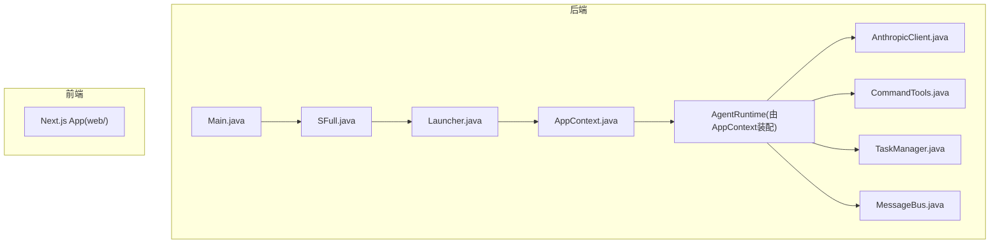
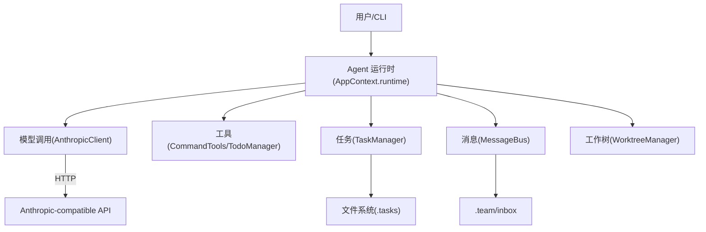
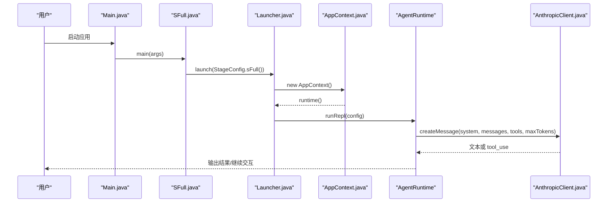
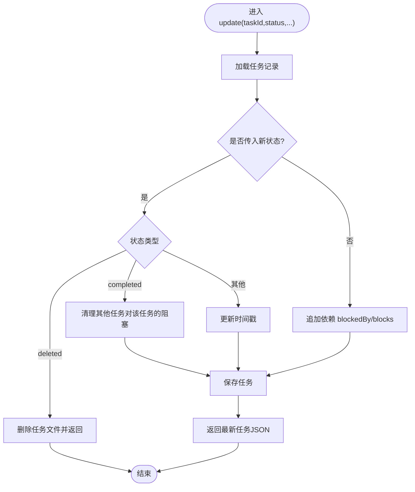
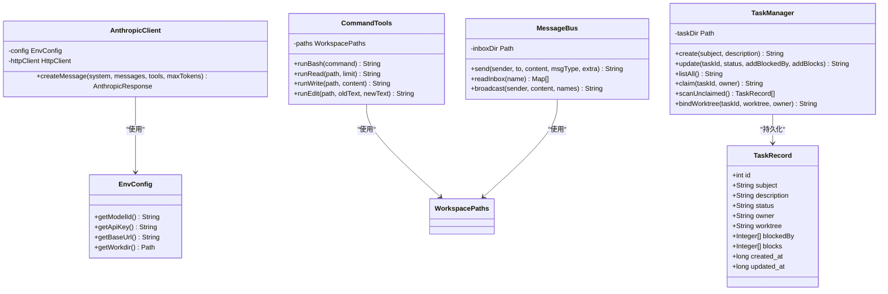
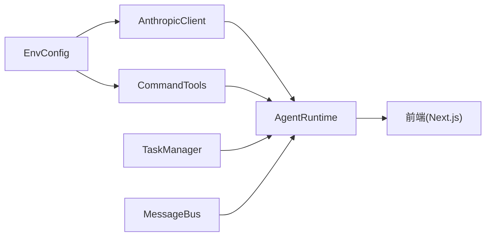
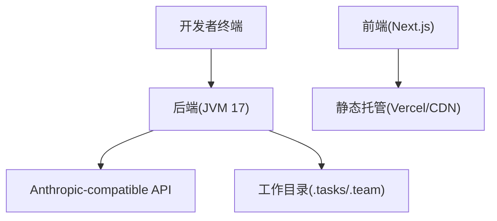

# 整体架构概览

<cite>
**本文引用的文件**
- [pom.xml](file://pom.xml)
- [Main.java](file://src/main/java/com/learnclaudecode/Main.java)
- [Launcher.java](file://src/main/java/com/learnclaudecode/agents/Launcher.java)
- [AppContext.java](file://src/main/java/com/learnclaudecode/agents/AppContext.java)
- [SFull.java](file://src/main/java/com/learnclaudecode/agents/SFull.java)
- [EnvConfig.java](file://src/main/java/com/learnclaudecode/common/EnvConfig.java)
- [AnthropicClient.java](file://src/main/java/com/learnclaudecode/common/AnthropicClient.java)
- [CommandTools.java](file://src/main/java/com/learnclaudecode/tools/CommandTools.java)
- [TaskManager.java](file://src/main/java/com/learnclaudecode/tasks/TaskManager.java)
- [MessageBus.java](file://src/main/java/com/learnclaudecode/team/MessageBus.java)
- [TaskRecord.java](file://src/main/java/com/learnclaudecode/model/TaskRecord.java)
- [web/package.json](file://web/package.json)
- [arch-diagram.tsx](file://web/src/components/architecture/arch-diagram.tsx)
</cite>

## 目录
1. [简介](#简介)
2. [项目结构](#项目结构)
3. [核心组件](#核心组件)
4. [架构总览](#架构总览)
5. [详细组件分析](#详细组件分析)
6. [依赖关系分析](#依赖关系分析)
7. [性能与可扩展性](#性能与可扩展性)
8. [部署拓扑与基础设施](#部署拓扑与基础设施)
9. [故障排查指南](#故障排查指南)
10. [结论](#结论)

## 简介
本仓库是 Learn Claude Code 的 Java 实现，用于演示“Agent 运行时 + 工具系统 + 任务管理 + 团队协作”的分层架构。后端以 Java 17 构建，通过 Maven 管理依赖；前端采用 Next.js（React）提供交互式可视化与学习路径。系统围绕“用户输入 -> Agent 循环 -> 模型调用 -> 工具执行 -> 状态持久化 -> 团队通信”的主链路组织代码，强调模块化、可演进和教学友好。

## 项目结构
- 后端（Java）：位于 src/main/java/com/learnclaudecode，按职责划分为 agents（Agent 运行时与阶段入口）、common（环境配置与 HTTP 客户端）、tools（命令与待办等工具）、tasks（任务管理与工作树隔离）、team（消息总线与队友协调）、context（上下文压缩）、model（数据模型）、skills（技能加载）。
- 前端（Next.js）：位于 web，提供多语言、版本演进可视化、架构图展示、模拟器与教程页面。
- 根级 pom.xml 定义 Java 17 编译目标与 Jackson、dotenv 等依赖；web/package.json 定义 Next.js、React、Tailwind 等前端依赖。

图表来源
- [Main.java:5-13](file://src/main/java/com/learnclaudecode/Main.java#L5-L13)
- [SFull.java:3-11](file://src/main/java/com/learnclaudecode/agents/SFull.java#L3-L11)
- [Launcher.java:18-26](file://src/main/java/com/learnclaudecode/agents/Launcher.java#L18-L26)
- [AppContext.java:35-58](file://src/main/java/com/learnclaudecode/agents/AppContext.java#L35-L58)

章节来源
- [pom.xml:12-35](file://pom.xml#L12-L35)
- [web/package.json:13-28](file://web/package.json#L13-L28)

## 核心组件
- 应用装配器 AppContext：集中创建共享服务（环境、工作区、模型客户端、命令工具、待办、技能加载、上下文压缩、任务管理、后台任务、消息总线、队友协调、工作树），并组装统一 Agent 运行时。
- 启动器 Launcher：统一入口，接收 StageConfig 后交由 AppContext.runtime().runRepl(config) 驱动交互循环。
- 环境配置 EnvConfig：从 .env 或系统环境变量读取模型 ID、API Key、Base URL 与工作目录，支持覆盖策略。
- 模型客户端 AnthropicClient：封装对 Anthropic-compatible Messages API 的 HTTP 调用，构造请求体、鉴权头与超时控制，解析响应为结构化对象。
- 工具系统 CommandTools：在工作区内安全执行 shell 命令、读写与编辑文件，包含危险命令黑名单与输出长度限制。
- 任务系统 TaskManager：基于文件的轻量任务板，支持创建、更新、认领、列出、依赖管理与 worktree 绑定。
- 消息总线 MessageBus：基于 .team/inbox/*.jsonl 的文件型消息通道，支持单发、广播与读后即消费语义。
- 数据模型 TaskRecord：任务持久化实体，包含状态、依赖、归属、时间戳等字段。

章节来源
- [AppContext.java:16-58](file://src/main/java/com/learnclaudecode/agents/AppContext.java#L16-L58)
- [Launcher.java:18-26](file://src/main/java/com/learnclaudecode/agents/Launcher.java#L18-L26)
- [EnvConfig.java:22-93](file://src/main/java/com/learnclaudecode/common/EnvConfig.java#L22-L93)
- [AnthropicClient.java:27-101](file://src/main/java/com/learnclaudecode/common/AnthropicClient.java#L27-L101)
- [CommandTools.java:13-145](file://src/main/java/com/learnclaudecode/tools/CommandTools.java#L13-L145)
- [TaskManager.java:17-337](file://src/main/java/com/learnclaudecode/tasks/TaskManager.java#L17-L337)
- [MessageBus.java:16-122](file://src/main/java/com/learnclaudecode/team/MessageBus.java#L16-L122)
- [TaskRecord.java:6-61](file://src/main/java/com/learnclaudecode/model/TaskRecord.java#L6-L61)

## 架构总览
系统采用分层架构：
- 表现层（Agent 运行时）：负责用户交互、轮询与调度，将输入转化为模型调用与工具执行。
- 业务层（工具系统、任务管理、团队协作）：提供命令执行、任务生命周期、消息通信与队友协调。
- 数据层（模型定义、配置管理）：封装环境配置、HTTP 客户端与持久化数据结构。

图表来源
- [AppContext.java:35-58](file://src/main/java/com/learnclaudecode/agents/AppContext.java#L35-L58)
- [AnthropicClient.java:52-99](file://src/main/java/com/learnclaudecode/common/AnthropicClient.java#L52-L99)
- [TaskManager.java:51-133](file://src/main/java/com/learnclaudecode/tasks/TaskManager.java#L51-L133)
- [MessageBus.java:54-120](file://src/main/java/com/learnclaudecode/team/MessageBus.java#L54-L120)

章节来源
- [AppContext.java:16-58](file://src/main/java/com/learnclaudecode/agents/AppContext.java#L16-L58)

## 详细组件分析

### 启动与运行流程（序列图）

图表来源
- [Main.java:5-13](file://src/main/java/com/learnclaudecode/Main.java#L5-L13)
- [SFull.java:3-11](file://src/main/java/com/learnclaudecode/agents/SFull.java#L3-L11)
- [Launcher.java:18-26](file://src/main/java/com/learnclaudecode/agents/Launcher.java#L18-L26)
- [AppContext.java:35-58](file://src/main/java/com/learnclaudecode/agents/AppContext.java#L35-L58)
- [AnthropicClient.java:52-99](file://src/main/java/com/learnclaudecode/common/AnthropicClient.java#L52-L99)

章节来源
- [Main.java:5-13](file://src/main/java/com/learnclaudecode/Main.java#L5-L13)
- [SFull.java:3-11](file://src/main/java/com/learnclaudecode/agents/SFull.java#L3-L11)
- [Launcher.java:18-26](file://src/main/java/com/learnclaudecode/agents/Launcher.java#L18-L26)
- [AppContext.java:35-58](file://src/main/java/com/learnclaudecode/agents/AppContext.java#L35-L58)

### 任务管理（流程图）

图表来源
- [TaskManager.java:84-133](file://src/main/java/com/learnclaudecode/tasks/TaskManager.java#L84-L133)
- [TaskManager.java:329-336](file://src/main/java/com/learnclaudecode/tasks/TaskManager.java#L329-L336)

章节来源
- [TaskManager.java:84-133](file://src/main/java/com/learnclaudecode/tasks/TaskManager.java#L84-L133)
- [TaskManager.java:329-336](file://src/main/java/com/learnclaudecode/tasks/TaskManager.java#L329-L336)

### 类关系（类图）

图表来源
- [EnvConfig.java:22-93](file://src/main/java/com/learnclaudecode/common/EnvConfig.java#L22-L93)
- [AnthropicClient.java:27-101](file://src/main/java/com/learnclaudecode/common/AnthropicClient.java#L27-L101)
- [CommandTools.java:13-145](file://src/main/java/com/learnclaudecode/tools/CommandTools.java#L13-L145)
- [TaskManager.java:17-337](file://src/main/java/com/learnclaudecode/tasks/TaskManager.java#L17-L337)
- [MessageBus.java:16-122](file://src/main/java/com/learnclaudecode/team/MessageBus.java#L16-L122)
- [TaskRecord.java:6-61](file://src/main/java/com/learnclaudecode/model/TaskRecord.java#L6-L61)

章节来源
- [EnvConfig.java:22-93](file://src/main/java/com/learnclaudecode/common/EnvConfig.java#L22-L93)
- [AnthropicClient.java:27-101](file://src/main/java/com/learnclaudecode/common/AnthropicClient.java#L27-L101)
- [CommandTools.java:13-145](file://src/main/java/com/learnclaudecode/tools/CommandTools.java#L13-L145)
- [TaskManager.java:17-337](file://src/main/java/com/learnclaudecode/tasks/TaskManager.java#L17-L337)
- [MessageBus.java:16-122](file://src/main/java/com/learnclaudecode/team/MessageBus.java#L16-L122)
- [TaskRecord.java:6-61](file://src/main/java/com/learnclaudecode/model/TaskRecord.java#L6-L61)

## 依赖关系分析
- 装配顺序体现分层依赖：EnvConfig -> WorkspacePaths -> AnthropicClient/CommandTools -> SkillLoader/CompressionService -> TaskManager/BackgroundManager -> MessageBus/TeammateManager/WorktreeManager -> AgentRuntime。
- 外部依赖：
  - 后端：Jackson（JSON 序列化）、dotenv（环境变量）、标准库 HttpClient。
  - 前端：Next.js、React、Tailwind、Framer Motion、rehype/remark 生态用于文档渲染。
- 耦合点：
  - AppContext 作为装配中心，集中注入依赖，降低模块间直接耦合。
  - AnthropicClient 仅依赖 EnvConfig 与 JsonUtils，保持协议无关的调用能力。
  - TaskManager 与 MessageBus 通过文件系统解耦，便于扩展为分布式队列。

图表来源
- [AppContext.java:35-58](file://src/main/java/com/learnclaudecode/agents/AppContext.java#L35-L58)
- [AnthropicClient.java:27-101](file://src/main/java/com/learnclaudecode/common/AnthropicClient.java#L27-L101)
- [CommandTools.java:13-145](file://src/main/java/com/learnclaudecode/tools/CommandTools.java#L13-L145)
- [TaskManager.java:17-337](file://src/main/java/com/learnclaudecode/tasks/TaskManager.java#L17-L337)
- [MessageBus.java:16-122](file://src/main/java/com/learnclaudecode/team/MessageBus.java#L16-L122)

章节来源
- [pom.xml:12-35](file://pom.xml#L12-L35)
- [web/package.json:13-28](file://web/package.json#L13-L28)

## 性能与可扩展性
- 性能要点
  - 命令执行超时与输出截断：避免长时间阻塞与超大输出影响上下文。
  - 文件 IO 批量扫描与排序：任务列表与消息读取采用流式处理，减少内存占用。
  - 网络超时与重试：HTTP 客户端设置连接与请求超时，提升鲁棒性。
- 可扩展性设计
  - 分层装配：新增工具或服务只需在 AppContext 中注册，无需修改上层逻辑。
  - 协议抽象：AnthropicClient 仅关注消息协议，便于替换后端提供方。
  - 文件总线：MessageBus 与 TaskManager 基于文件系统，易于迁移到消息队列或数据库。
  - 前端可视化：Next.js 组件按功能拆分，支持多语言与版本演进视图。

[本节为通用指导，不直接分析具体文件]

## 部署拓扑与基础设施
- 后端
  - 运行环境：JDK 17，Maven 构建。
  - 配置：通过 .env 或系统环境变量注入 MODEL_ID、ANTHROPIC_API_KEY、ANTHROPIC_BASE_URL、工作目录。
  - 进程：单一 JVM 进程，主入口 Main.java -> SFull.java -> Launcher.launch(...)。
- 前端
  - 运行环境：Node.js（Next.js 16.x）、React 19、Tailwind CSS。
  - 构建与发布：npm run build 生成静态资源，可通过 Vercel 或其他静态托管平台部署。
- 基础设施要求
  - 网络访问：需能访问 Anthropic-compatible API 端点。
  - 文件系统：具备读写权限的工作目录，用于 .tasks、.team/inbox 等持久化数据。
  - 容器化建议：将后端打包为 Docker 镜像，挂载工作目录卷；前端独立部署静态站点。

[此图为概念性拓扑，不映射具体源码文件]

## 故障排查指南
- 环境变量缺失
  - 现象：启动时报缺少必需环境变量异常。
  - 处理：检查 .env 或系统环境变量是否包含 MODEL_ID、ANTHROPIC_API_KEY、ANTHROPIC_BASE_URL。
- 模型调用失败
  - 现象：HTTP 错误码或非 2xx 响应抛出异常。
  - 处理：确认 Base URL、API Key、网络连通性与速率限制；查看响应体定位兼容性问题。
- 命令执行超时或被拦截
  - 现象：命令执行超过 120s 被强制终止，或触发危险命令黑名单。
  - 处理：优化命令逻辑，避免死循环；调整或移除危险命令匹配规则需谨慎评估安全性。
- 任务/消息文件写入失败
  - 现象：IO 异常导致无法创建或写入 .tasks/.team/inbox。
  - 处理：检查工作目录权限、磁盘空间与路径合法性。

章节来源
- [EnvConfig.java:37-58](file://src/main/java/com/learnclaudecode/common/EnvConfig.java#L37-L58)
- [AnthropicClient.java:87-100](file://src/main/java/com/learnclaudecode/common/AnthropicClient.java#L87-L100)
- [CommandTools.java:36-65](file://src/main/java/com/learnclaudecode/tools/CommandTools.java#L36-L65)
- [TaskManager.java:316-322](file://src/main/java/com/learnclaudecode/tasks/TaskManager.java#L316-L322)
- [MessageBus.java:68-74](file://src/main/java/com/learnclaudecode/team/MessageBus.java#L68-L74)

## 结论
Learn Claude Code Java 项目以清晰的三层架构组织 Agent 运行时、工具系统与数据层，通过 AppContext 集中装配，实现了高内聚、低耦合的可扩展设计。技术栈选择兼顾教学与实践：Java 17 提供稳定运行时与并发能力，Maven 简化构建与依赖管理，Next.js 提供现代化前端体验。系统通过文件型消息总线与任务存储实现轻量协作，同时保留向更高级基础设施迁移的空间。建议在后续迭代中引入配置校验、日志追踪与指标采集，进一步提升可观测性与运维效率。