# 架构设计

<cite>
**本文引用的文件**
- [Main.java](file://src/main/java/com/learnclaudecode/Main.java)
- [pom.xml](file://pom.xml)
- [Launcher.java](file://src/main/java/com/learnclaudecode/agents/Launcher.java)
- [AppContext.java](file://src/main/java/com/learnclaudecode/agents/AppContext.java)
- [StageConfig.java](file://src/main/java/com/learnclaudecode/agents/StageConfig.java)
- [AgentRuntime.java](file://src/main/java/com/learnclaudecode/agents/AgentRuntime.java)
- [AnthropicClient.java](file://src/main/java/com/learnclaudecode/common/AnthropicClient.java)
- [EnvConfig.java](file://src/main/java/com/learnclaudecode/common/EnvConfig.java)
- [CommandTools.java](file://src/main/java/com/learnclaudecode/tools/CommandTools.java)
- [TaskManager.java](file://src/main/java/com/learnclaudecode/tasks/TaskManager.java)
- [MessageBus.java](file://src/main/java/com/learnclaudecode/team/MessageBus.java)
- [BackgroundManager.java](file://src/main/java/com/learnclaudecode/background/BackgroundManager.java)
- [CompressionService.java](file://src/main/java/com/learnclaudecode/context/CompressionService.java)
- [SkillLoader.java](file://src/main/java/com/learnclaudecode/skills/SkillLoader.java)
</cite>

## 目录
1. [简介](#简介)
2. [项目结构](#项目结构)
3. [核心组件](#核心组件)
4. [架构总览](#架构总览)
5. [详细组件分析](#详细组件分析)
6. [依赖关系分析](#依赖关系分析)
7. [性能考量](#性能考量)
8. [故障排查指南](#故障排查指南)
9. [结论](#结论)
10. [附录](#附录)

## 简介
本文件面向 Learn Claude Code Java 项目的整体架构与设计模式，系统阐述分层架构（表现层、业务层、数据层）、模块化设计原则与组件依赖关系；深入解析工厂、策略、命令、观察者、单例等设计模式在系统中的落地方式；提供系统架构图与组件交互图，解释数据流向与控制流程；并总结技术决策、权衡与约束条件，给出基础设施要求、可扩展性考虑与部署拓扑建议。

## 项目结构
项目采用“统一入口 + 装配器 + 运行时”的分层组织：
- 入口层：Main 作为默认入口，委托到完整能力版本 SFull。
- 启动与装配层：Launcher 统一启动，AppContext 集中装配共享服务与环境配置。
- 运行时层：AgentRuntime 实现 Agent 主循环与工具调度。
- 能力扩展层：按阶段通过 StageConfig 暴露不同工具集与开关（s01-s12、s_full）。
- 基础设施层：模型客户端、环境配置、工作区路径、JSON 工具等。
- 业务能力层：命令与文件操作、任务管理、后台任务、消息总线、上下文压缩、技能加载等。

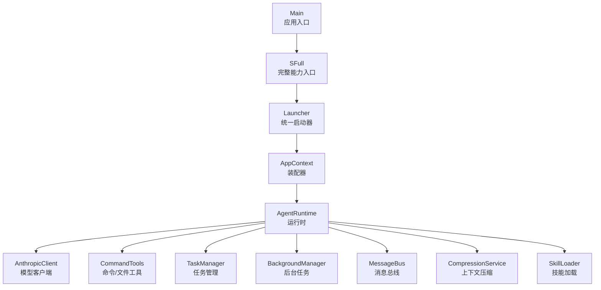

图表来源
- [Main.java:1-15](file://src/main/java/com/learnclaudecode/Main.java#L1-L15)
- [Launcher.java:1-28](file://src/main/java/com/learnclaudecode/agents/Launcher.java#L1-L28)
- [AppContext.java:1-70](file://src/main/java/com/learnclaudecode/agents/AppContext.java#L1-L70)
- [AgentRuntime.java:1-351](file://src/main/java/com/learnclaudecode/agents/AgentRuntime.java#L1-L351)

章节来源
- [Main.java:1-15](file://src/main/java/com/learnclaudecode/Main.java#L1-L15)
- [pom.xml:1-68](file://pom.xml#L1-L68)

## 核心组件
- 应用入口与启动器
  - Main 将执行委托给 SFull，SFull 使用 Launcher.launch(StageConfig.sFull()) 启动。
  - Launcher 仅负责创建 AppContext 并调用其 runtime().runRepl(config)。
- 装配器
  - AppContext 读取 EnvConfig，创建工作区路径，依次创建基础能力（命令、Todo、技能、压缩、任务、后台、消息、队友、worktree），最终组装 AgentRuntime。
- 运行时
  - AgentRuntime 维护消息历史，驱动 REPL 交互，实现“用户输入 -> 调模型 -> 工具执行 -> 结果回写 -> 继续推理”的闭环。
- 模型客户端
  - AnthropicClient 封装 HTTP 请求，构造 messages API 负载，处理认证与错误。
- 环境与配置
  - EnvConfig 从 .env 或系统环境变量加载模型 ID、API Key、Base URL 与工作目录。
- 工具与能力
  - CommandTools：安全地执行 shell 命令与读写文件。
  - TaskManager：基于文件的轻量任务板，支持创建、更新、认领、列表、依赖清理。
  - BackgroundManager：异步执行长耗时命令，并通过通知队列回灌主循环。
  - MessageBus：基于 JSONL 的文件型消息总线，支持发送、读取、广播。
  - CompressionService：三层压缩（微压缩、自动压缩、摘要替换）缓解上下文窗口压力。
  - SkillLoader：扫描 skills 目录下的 SKILL.md，注入可被模型加载的知识。

章节来源
- [Launcher.java:1-28](file://src/main/java/com/learnclaudecode/agents/Launcher.java#L1-L28)
- [AppContext.java:1-70](file://src/main/java/com/learnclaudecode/agents/AppContext.java#L1-L70)
- [AgentRuntime.java:1-351](file://src/main/java/com/learnclaudecode/agents/AgentRuntime.java#L1-L351)
- [AnthropicClient.java:1-103](file://src/main/java/com/learnclaudecode/common/AnthropicClient.java#L1-L103)
- [EnvConfig.java:1-96](file://src/main/java/com/learnclaudecode/common/EnvConfig.java#L1-L96)
- [CommandTools.java:1-146](file://src/main/java/com/learnclaudecode/tools/CommandTools.java#L1-L146)
- [TaskManager.java:1-338](file://src/main/java/com/learnclaudecode/tasks/TaskManager.java#L1-L338)
- [BackgroundManager.java:1-160](file://src/main/java/com/learnclaudecode/background/BackgroundManager.java#L1-L160)
- [MessageBus.java:1-123](file://src/main/java/com/learnclaudecode/team/MessageBus.java#L1-L123)
- [CompressionService.java:1-172](file://src/main/java/com/learnclaudecode/context/CompressionService.java#L1-L172)
- [SkillLoader.java:1-106](file://src/main/java/com/learnclaudecode/skills/SkillLoader.java#L1-L106)

## 架构总览
系统采用分层与模块化结合的设计：
- 表现层：REPL 交互（控制台输出提示与结果）。
- 业务层：AgentRuntime 编排工具调用、上下文压缩、后台任务、团队协作等。
- 数据层：文件系统持久化（任务、消息、transcript、skills）。
- 外部集成：Anthropic-compatible 模型接口。

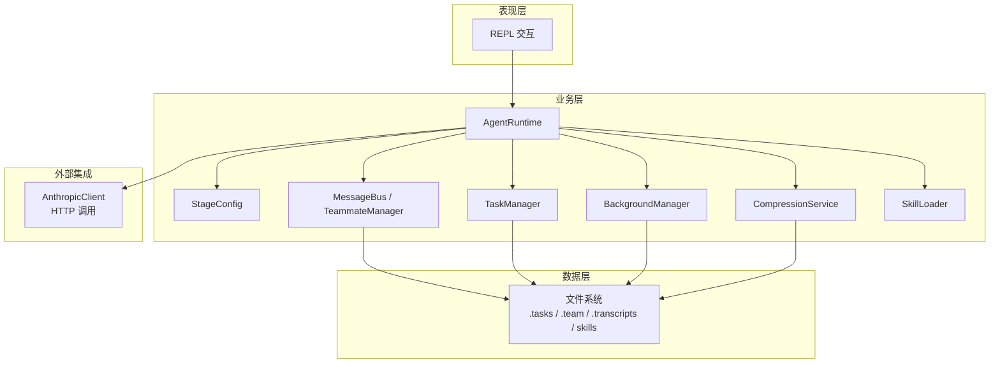

图表来源
- [AgentRuntime.java:1-351](file://src/main/java/com/learnclaudecode/agents/AgentRuntime.java#L1-L351)
- [StageConfig.java:1-301](file://src/main/java/com/learnclaudecode/agents/StageConfig.java#L1-L301)
- [CompressionService.java:1-172](file://src/main/java/com/learnclaudecode/context/CompressionService.java#L1-L172)
- [MessageBus.java:1-123](file://src/main/java/com/learnclaudecode/team/MessageBus.java#L1-L123)
- [TaskManager.java:1-338](file://src/main/java/com/learnclaudecode/tasks/TaskManager.java#L1-L338)
- [BackgroundManager.java:1-160](file://src/main/java/com/learnclaudecode/background/BackgroundManager.java#L1-L160)
- [SkillLoader.java:1-106](file://src/main/java/com/learnclaudecode/skills/SkillLoader.java#L1-L106)
- [AnthropicClient.java:1-103](file://src/main/java/com/learnclaudecode/common/AnthropicClient.java#L1-L103)

## 详细组件分析

### 运行时与工具调度（AgentRuntime）
- 控制流
  - runRepl：读取用户输入，追加 user 消息，进入 agentLoop。
  - agentLoop：每轮先做上下文微压缩/自动压缩、后台任务注入、收件箱注入；调用模型获取下一步动作；若为 tool_use，则分发到具体工具执行；将工具结果以 user 消息回写；必要时触发手动压缩；直到模型停止调用工具。
- 工具映射
  - 通过 switch 将模型声明的工具名映射到本地实现（bash、read/write/edit、todo、subagent、skill、background、task、teammate、message、worktree 等）。
- 子代理
  - runSubagent：独立消息上下文，受限工具集，循环调用模型直至完成并返回摘要。

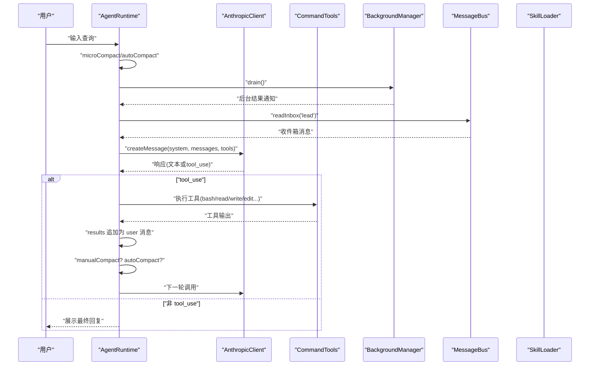

图表来源
- [AgentRuntime.java:92-261](file://src/main/java/com/learnclaudecode/agents/AgentRuntime.java#L92-L261)
- [AnthropicClient.java:43-101](file://src/main/java/com/learnclaudecode/common/AnthropicClient.java#L43-L101)
- [CommandTools.java:30-145](file://src/main/java/com/learnclaudecode/tools/CommandTools.java#L30-L145)
- [BackgroundManager.java:43-158](file://src/main/java/com/learnclaudecode/background/BackgroundManager.java#L43-L158)
- [MessageBus.java:54-121](file://src/main/java/com/learnclaudecode/team/MessageBus.java#L54-L121)
- [SkillLoader.java:79-104](file://src/main/java/com/learnclaudecode/skills/SkillLoader.java#L79-L104)

章节来源
- [AgentRuntime.java:92-310](file://src/main/java/com/learnclaudecode/agents/AgentRuntime.java#L92-L310)

### 阶段配置与能力编排（StageConfig）
- 角色：课程编排器，决定 system prompt、tools、功能开关（todo 提醒、压缩、后台、收件箱、子代理可写、自治队友等）。
- 机制：baseTools 定义最小工具集；各阶段方法组合工具集；sFull 合并所有阶段能力并去重。
- 价值：同一运行时通过配置切换能力，降低复杂度，便于教学与演进。

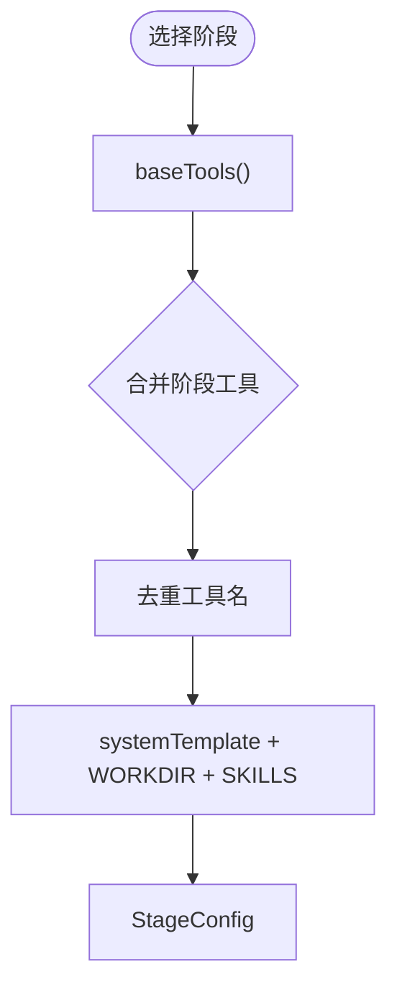

图表来源
- [StageConfig.java:51-301](file://src/main/java/com/learnclaudecode/agents/StageConfig.java#L51-L301)

章节来源
- [StageConfig.java:1-301](file://src/main/java/com/learnclaudecode/agents/StageConfig.java#L1-L301)

### 模型客户端与环境配置（AnthropicClient、EnvConfig）
- AnthropicClient：构造 payload（model、max_tokens、messages、system、tools），设置兼容头与超时，发送 HTTP 请求，解析响应或抛出异常。
- EnvConfig：优先系统环境变量，其次 .env；强制 MODEL_ID；可选 ANTHROPIC_API_KEY、ANTHROPIC_BASE_URL；工作目录为当前进程目录。

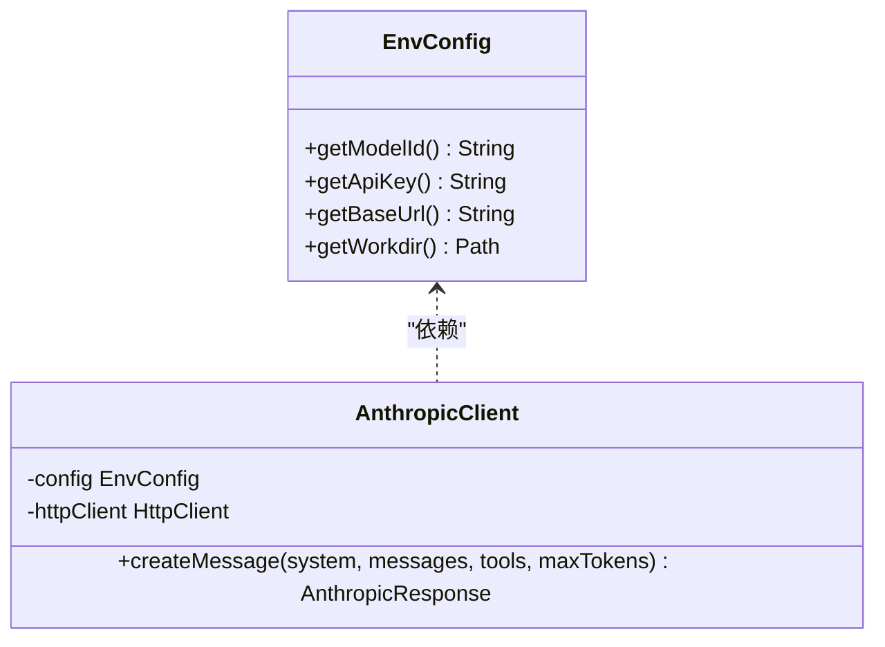

图表来源
- [EnvConfig.java:1-96](file://src/main/java/com/learnclaudecode/common/EnvConfig.java#L1-L96)
- [AnthropicClient.java:1-103](file://src/main/java/com/learnclaudecode/common/AnthropicClient.java#L1-L103)

章节来源
- [AnthropicClient.java:43-101](file://src/main/java/com/learnclaudecode/common/AnthropicClient.java#L43-L101)
- [EnvConfig.java:22-96](file://src/main/java/com/learnclaudecode/common/EnvConfig.java#L22-L96)

### 命令与文件工具（CommandTools）
- 安全：黑名单拦截危险命令；跨平台 shell 适配；超时保护。
- 文件：安全路径解析；限制读取行数；精确文本替换；写入时自动创建目录。

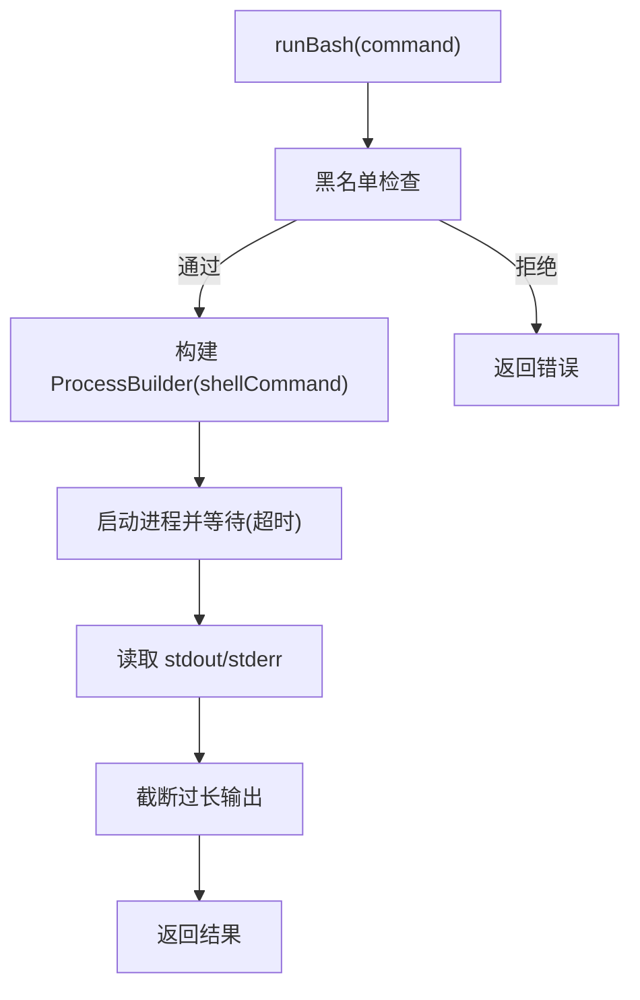

图表来源
- [CommandTools.java:30-78](file://src/main/java/com/learnclaudecode/tools/CommandTools.java#L30-L78)
- [CommandTools.java:80-145](file://src/main/java/com/learnclaudecode/tools/CommandTools.java#L80-L145)

章节来源
- [CommandTools.java:1-146](file://src/main/java/com/learnclaudecode/tools/CommandTools.java#L1-L146)

### 任务系统（TaskManager）
- 持久化：每个任务一个 JSON 文件；支持创建、获取、更新、认领、列表、扫描可认领任务、绑定/解绑 worktree。
- 并发：关键方法加同步锁；状态变更包含依赖清理与时间戳更新。
- 协作：多 Agent 通过共享任务目录协作。

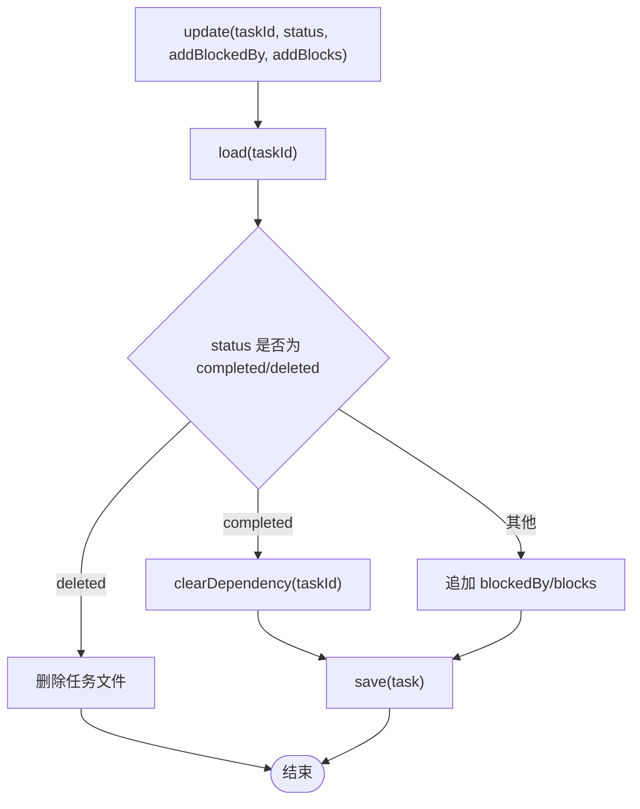

图表来源
- [TaskManager.java:84-133](file://src/main/java/com/learnclaudecode/tasks/TaskManager.java#L84-L133)
- [TaskManager.java:329-336](file://src/main/java/com/learnclaudecode/tasks/TaskManager.java#L329-L336)

章节来源
- [TaskManager.java:1-338](file://src/main/java/com/learnclaudecode/tasks/TaskManager.java#L1-L338)

### 后台任务（BackgroundManager）
- 异步执行：为每个命令分配唯一 taskId，提交到独立线程执行。
- 通知机制：执行完成后更新任务表并向通知队列投递摘要，主循环 drain() 后注入对话历史。
- 超时与错误：超时强制终止；异常统一记录为 error。

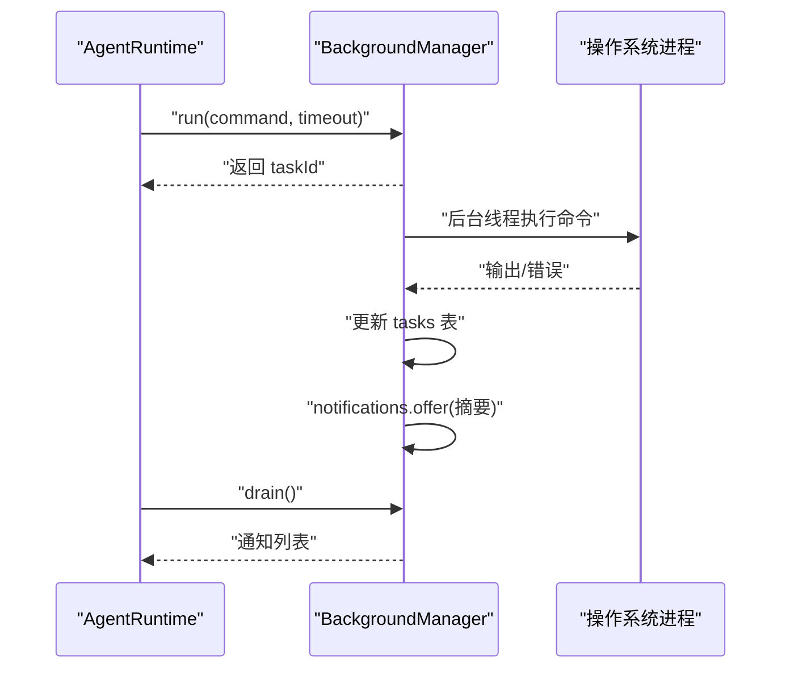

图表来源
- [BackgroundManager.java:43-158](file://src/main/java/com/learnclaudecode/background/BackgroundManager.java#L43-L158)
- [AgentRuntime.java:146-159](file://src/main/java/com/learnclaudecode/agents/AgentRuntime.java#L146-L159)

章节来源
- [BackgroundManager.java:1-160](file://src/main/java/com/learnclaudecode/background/BackgroundManager.java#L1-L160)

### 消息总线（MessageBus）
- 协议：每条消息一行 JSON，落盘到 .team/inbox/<name>.jsonl。
- 能力：send、readInbox（读后即空）、broadcast。
- 类型校验：仅允许预定义的消息类型。

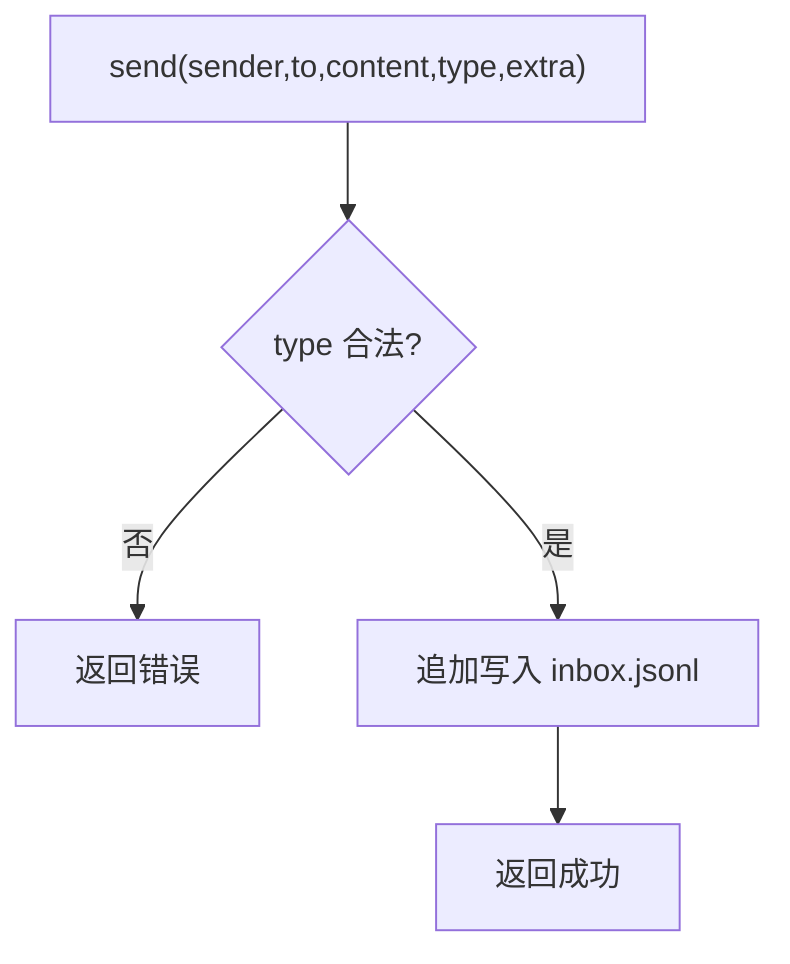

图表来源
- [MessageBus.java:54-75](file://src/main/java/com/learnclaudecode/team/MessageBus.java#L54-L75)
- [MessageBus.java:83-102](file://src/main/java/com/learnclaudecode/team/MessageBus.java#L83-L102)
- [MessageBus.java:112-121](file://src/main/java/com/learnclaudecode/team/MessageBus.java#L112-L121)

章节来源
- [MessageBus.java:1-123](file://src/main/java/com/learnclaudecode/team/MessageBus.java#L1-L123)

### 上下文压缩（CompressionService）
- 三层策略：
  - microCompact：清理较老的 tool_result 大文本，保留最近若干条。
  - autoCompact：转存完整 transcript，调用模型生成摘要，用“摘要+确认”替换旧历史。
  - needsAutoCompact：估算 token 数超过阈值触发自动压缩。
- 目的：避免无限增长的历史导致上下文溢出。

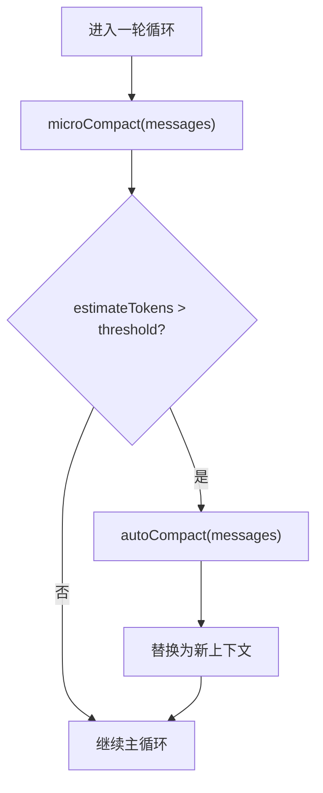

图表来源
- [CompressionService.java:56-170](file://src/main/java/com/learnclaudecode/context/CompressionService.java#L56-L170)
- [AgentRuntime.java:136-145](file://src/main/java/com/learnclaudecode/agents/AgentRuntime.java#L136-L145)

章节来源
- [CompressionService.java:1-172](file://src/main/java/com/learnclaudecode/context/CompressionService.java#L1-L172)

### 技能加载（SkillLoader）
- 扫描 skills 目录下的 SKILL.md，解析简单 frontmatter（name/description）。
- 提供 getDescriptions 与 getContent，供 StageConfig 注入 system prompt 与模型动态加载。

章节来源
- [SkillLoader.java:1-106](file://src/main/java/com/learnclaudecode/skills/SkillLoader.java#L1-L106)

## 依赖关系分析
- 装配顺序体现依赖方向：EnvConfig -> WorkspacePaths -> 基础能力 -> 高级机制 -> AgentRuntime。
- 运行时强耦合于工具与扩展服务，但通过 StageConfig 解耦能力暴露面。
- 数据层通过文件系统松耦合连接任务、消息、transcript、技能等模块。

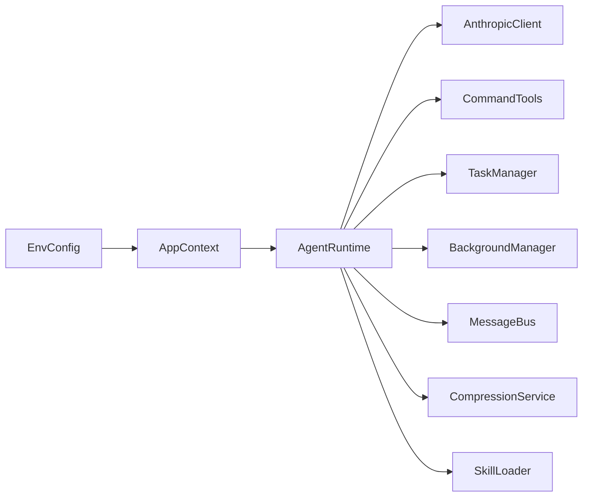

图表来源
- [AppContext.java:35-59](file://src/main/java/com/learnclaudecode/agents/AppContext.java#L35-L59)
- [AgentRuntime.java:41-90](file://src/main/java/com/learnclaudecode/agents/AgentRuntime.java#L41-L90)

章节来源
- [AppContext.java:1-70](file://src/main/java/com/learnclaudecode/agents/AppContext.java#L1-L70)
- [AgentRuntime.java:1-90](file://src/main/java/com/learnclaudecode/agents/AgentRuntime.java#L1-L90)

## 性能考量
- 网络与超时：模型客户端设置连接与请求超时，避免阻塞。
- 上下文窗口：微压缩与自动压缩减少历史体积，保障长对话稳定性。
- I/O 与并发：任务与消息使用文件持久化，关键方法加同步；后台任务使用独立线程与队列，避免阻塞主循环。
- 资源保护：命令执行黑名单与超时，防止失控进程占用资源。
- 传输优化：工具结果与通知内容截断，避免过大负载影响性能。

## 故障排查指南
- 模型调用失败
  - 检查环境变量 MODEL_ID、ANTHROPIC_API_KEY、ANTHROPIC_BASE_URL 是否正确。
  - 查看 HTTP 状态码与响应体，定位兼容端点问题。
- 命令执行异常
  - 确认命令未命中黑名单；检查工作目录权限；关注超时与进程退出码。
- 任务与消息丢失
  - 检查 .tasks 与 .team/inbox 目录是否存在与可写；确认 JSONL 格式正确。
- 上下文压缩异常
  - 检查 .transcripts 目录权限；确认模型摘要请求成功；核对阈值与 keepRecent 参数。

章节来源
- [AnthropicClient.java:87-101](file://src/main/java/com/learnclaudecode/common/AnthropicClient.java#L87-L101)
- [CommandTools.java:36-65](file://src/main/java/com/learnclaudecode/tools/CommandTools.java#L36-L65)
- [TaskManager.java:51-133](file://src/main/java/com/learnclaudecode/tasks/TaskManager.java#L51-L133)
- [MessageBus.java:54-102](file://src/main/java/com/learnclaudecode/team/MessageBus.java#L54-L102)
- [CompressionService.java:118-170](file://src/main/java/com/learnclaudecode/context/CompressionService.java#L118-L170)

## 结论
Learn Claude Code Java 通过“统一运行时 + 阶段配置”的方式，将复杂的多能力 Agent 行为抽象为可插拔的工具与机制。分层架构清晰、模块化良好，借助文件系统实现低耦合的数据持久化与通信。设计模式的应用体现在：
- 工厂模式：StageConfig 各阶段方法构建配置对象；AppContext 装配服务。
- 策略模式：StageConfig.tools/systemPrompt 随阶段变化；工具映射 switch 作为策略分发。
- 命令模式：工具调用将意图与执行分离，便于扩展新工具。
- 观察者模式：BackgroundManager 的通知队列与 MessageBus 的收件箱机制。
- 单例模式：运行期共享的服务实例由 AppContext 提供（如 AgentRuntime、Client 等）。

## 附录

### 设计模式映射
- 工厂模式
  - StageConfig.s01()/s02()/.../sFull() 构建不同配置。
  - AppContext 创建并注入共享服务。
- 策略模式
  - StageConfig 根据阶段提供不同的 tools 与 systemPrompt。
  - AgentRuntime 中工具名到实现的映射。
- 命令模式
  - 工具调用将“做什么”与“怎么做”解耦，新增工具只需扩展映射与实现。
- 观察者模式
  - BackgroundManager 通知队列；MessageBus 收件箱订阅/消费。
- 单例模式
  - 运行期内共享的运行时与服务实例（由 AppContext 提供）。

### 基础设施要求
- Java 17 运行时。
- 环境变量：MODEL_ID（必填）、ANTHROPIC_API_KEY（可选）、ANTHROPIC_BASE_URL（可选）。
- 工作目录需具备读写权限（用于 .tasks、.team、.transcripts、skills）。

### 可扩展性与部署拓扑
- 可扩展性
  - 新增工具：在 StageConfig 中声明工具定义，在 AgentRuntime 中添加映射分支与实现。
  - 新增能力：通过 AppContext 装配新服务并在运行时按需启用。
  - 多模型兼容：通过 AnthropicClient 的 Base URL 与头部适配第三方兼容端点。
- 部署拓扑
  - 单机 CLI：Main -> SFull -> Launcher -> AppContext -> AgentRuntime。
  - 未来可演进为服务端：将 REPL 替换为 HTTP 网关，保持后端运行时不变。