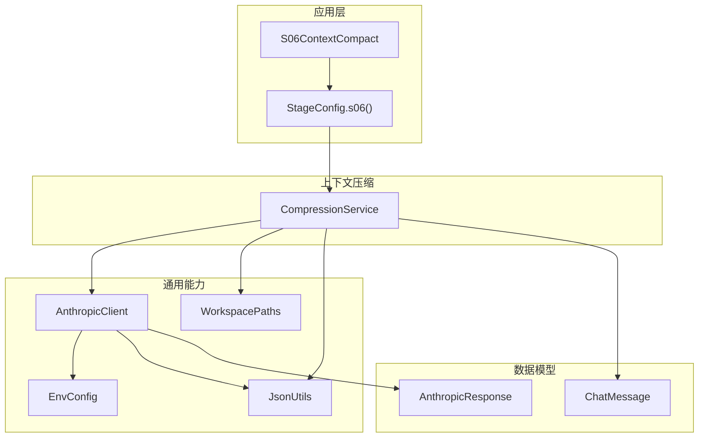
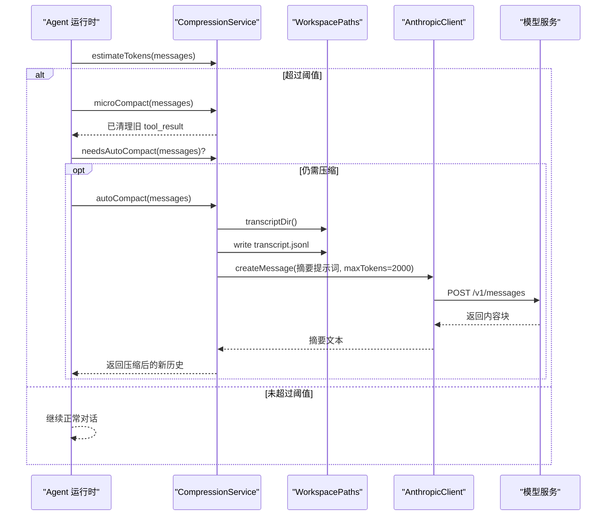
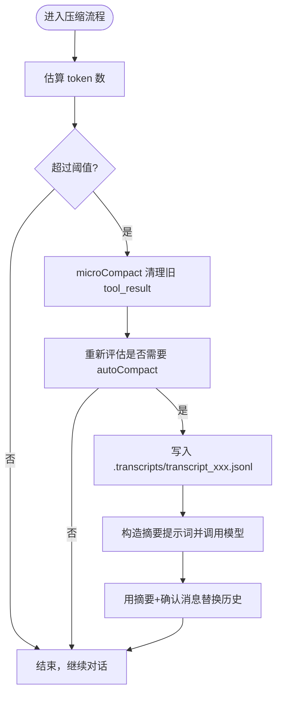
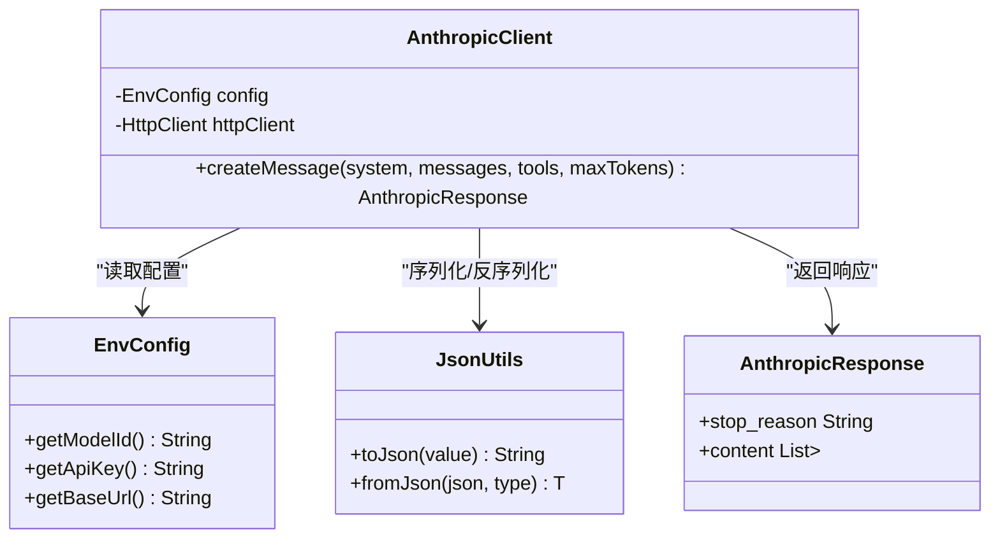
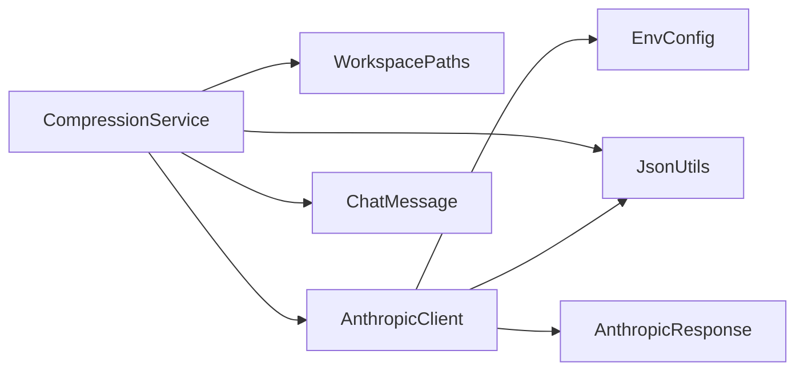

# 上下文压缩依赖

<cite>
**本文引用的文件**
- [CompressionService.java](file://src/main/java/com/learnclaudecode/context/CompressionService.java)
- [AnthropicClient.java](file://src/main/java/com/learnclaudecode/common/AnthropicClient.java)
- [EnvConfig.java](file://src/main/java/com/learnclaudecode/common/EnvConfig.java)
- [JsonUtils.java](file://src/main/java/com/learnclaudecode/common/JsonUtils.java)
- [WorkspacePaths.java](file://src/main/java/com/learnclaudecode/common/WorkspacePaths.java)
- [ChatMessage.java](file://src/main/java/com/learnclaudecode/model/ChatMessage.java)
- [AnthropicResponse.java](file://src/main/java/com/learnclaudecode/model/AnthropicResponse.java)
- [StageConfig.java](file://src/main/java/com/learnclaudecode/agents/StageConfig.java)
- [S06ContextCompact.java](file://src/main/java/com/learnclaudecode/agents/S06ContextCompact.java)
</cite>

## 目录
1. [简介](#简介)
2. [项目结构](#项目结构)
3. [核心组件](#核心组件)
4. [架构总览](#架构总览)
5. [详细组件分析](#详细组件分析)
6. [依赖关系分析](#依赖关系分析)
7. [性能与内存优化](#性能与内存优化)
8. [故障排查指南](#故障排查指南)
9. [结论](#结论)
10. [附录：配置示例](#附录配置示例)

## 简介
本文件围绕“上下文压缩依赖”展开，重点解析 CompressionService 的实现机制、与 AnthropicClient 的协作方式、消息历史管理、压缩策略选择与阈值控制、压缩后上下文格式与还原机制、对话连贯性保障、性能优化与内存管理，并提供不同场景下的配置示例。目标是帮助读者理解如何在长对话中通过分层压缩降低 API 调用成本，同时保持任务状态和决策可追溯。

## 项目结构
本项目采用按功能域划分的包结构：
- agents：Agent 运行阶段与编排（包含 s06 上下文压缩入口）
- common：通用能力（模型客户端、环境配置、JSON 工具、工作区路径）
- context：上下文压缩服务
- model：数据模型（消息、响应等）
- skills/tasks/tools/team/background：其他辅助能力

图表来源
- [S06ContextCompact.java:1-13](file://src/main/java/com/learnclaudecode/agents/S06ContextCompact.java#L1-L13)
- [StageConfig.java:137-149](file://src/main/java/com/learnclaudecode/agents/StageConfig.java#L137-L149)
- [CompressionService.java:18-48](file://src/main/java/com/learnclaudecode/context/CompressionService.java#L18-L48)
- [AnthropicClient.java:15-41](file://src/main/java/com/learnclaudecode/common/AnthropicClient.java#L15-L41)
- [WorkspacePaths.java:127-136](file://src/main/java/com/learnclaudecode/common/WorkspacePaths.java#L127-L136)
- [JsonUtils.java:9-15](file://src/main/java/com/learnclaudecode/common/JsonUtils.java#L9-L15)
- [ChatMessage.java:1-8](file://src/main/java/com/learnclaudecode/model/ChatMessage.java#L1-L8)
- [AnthropicResponse.java:1-14](file://src/main/java/com/learnclaudecode/model/AnthropicResponse.java#L1-L14)

章节来源
- [S06ContextCompact.java:1-13](file://src/main/java/com/learnclaudecode/agents/S06ContextCompact.java#L1-L13)
- [StageConfig.java:137-149](file://src/main/java/com/learnclaudecode/agents/StageConfig.java#L137-L149)

## 核心组件
- CompressionService：实现三层压缩思想中的两层（micro compact 与 auto compact），负责估算 token、清理旧工具结果、落盘完整转录、生成摘要并替换历史。
- AnthropicClient：封装对 Anthropic-compatible messages API 的 HTTP 调用，构造请求体、处理认证、解析响应。
- WorkspacePaths：提供安全的工作区路径访问，包括 .transcripts 目录。
- JsonUtils：统一 JSON 序列化/反序列化，用于消息转存、估算 token、构建请求体。
- ChatMessage / AnthropicResponse：消息与响应的轻量数据模型。
- EnvConfig：读取环境变量（模型 ID、API Key、Base URL、工作目录）。
- StageConfig.s06：启用压缩能力的阶段配置，暴露 compact 工具。

章节来源
- [CompressionService.java:18-48](file://src/main/java/com/learnclaudecode/context/CompressionService.java#L18-L48)
- [AnthropicClient.java:15-41](file://src/main/java/com/learnclaudecode/common/AnthropicClient.java#L15-L41)
- [WorkspacePaths.java:127-136](file://src/main/java/com/learnclaudecode/common/WorkspacePaths.java#L127-L136)
- [JsonUtils.java:9-15](file://src/main/java/com/learnclaudecode/common/JsonUtils.java#L9-L15)
- [ChatMessage.java:1-8](file://src/main/java/com/learnclaudecode/model/ChatMessage.java#L1-L8)
- [AnthropicResponse.java:1-14](file://src/main/java/com/learnclaudecode/model/AnthropicResponse.java#L1-L14)
- [EnvConfig.java:22-29](file://src/main/java/com/learnclaudecode/common/EnvConfig.java#L22-L29)
- [StageConfig.java:137-149](file://src/main/java/com/learnclaudecode/agents/StageConfig.java#L137-L149)

## 架构总览
上下文压缩的整体流程如下：
- 在 Agent 运行过程中，根据当前消息历史估算 token，判断是否需要自动压缩。
- 若需要，先执行 micro compact 清理较老的 tool_result 大文本，保留最近若干条完整细节。
- 若仍超过阈值或业务要求，则执行 auto compact：将完整历史写入 .transcripts，向模型发送摘要请求，用“摘要 + 确认消息”替换原历史，从而大幅减少后续上下文体积。
- AnthropicClient 负责与模型服务端通信，EnvConfig 提供模型与端点配置，WorkspacePaths 提供安全的文件落盘路径。

图表来源
- [CompressionService.java:50-170](file://src/main/java/com/learnclaudecode/context/CompressionService.java#L50-L170)
- [AnthropicClient.java:52-100](file://src/main/java/com/learnclaudecode/common/AnthropicClient.java#L52-L100)
- [WorkspacePaths.java:127-136](file://src/main/java/com/learnclaudecode/common/WorkspacePaths.java#L127-L136)

## 详细组件分析

### CompressionService：上下文压缩服务
- 设计目标：对齐“三层压缩”思想，解决长对话导致的上下文窗口上限问题。
- 关键方法：
  - estimateTokens：基于 JSON 长度除以 4 的近似估算，快速判断是否接近上下文上限。
  - microCompact：仅清理较老的 tool_result 大文本，保留最近 keepRecent 条完整细节，避免误删重要上下文。
  - autoCompact：将完整历史落盘为 jsonl 转录文件；构造摘要提示词并调用模型生成摘要；以“摘要 + 确认消息”替换原历史，保证后续对话连贯。
  - needsAutoCompact：基于阈值判断是否需要自动压缩。
- 参数说明：
  - threshold：触发自动压缩的 token 阈值。
  - keepRecent：micro compact 时保留的最近 tool_result 数量。
- 错误处理：文件落盘失败抛出异常，确保上层能感知压缩失败。

图表来源
- [CompressionService.java:50-170](file://src/main/java/com/learnclaudecode/context/CompressionService.java#L50-L170)

章节来源
- [CompressionService.java:18-170](file://src/main/java/com/learnclaudecode/context/CompressionService.java#L18-L170)

### AnthropicClient：模型客户端
- 职责：构造 messages API 请求体（model、messages、system、tools、max_tokens），设置超时与认证头，发送 HTTP 请求并解析响应。
- 兼容性与扩展：支持第三方兼容端点（通过 Base URL），同时发送 x-api-key 与 authorization 头以兼容多种服务。
- 错误处理：HTTP 非 2xx 直接抛出异常并附带响应体；IO/中断统一包装为业务异常。

图表来源
- [AnthropicClient.java:15-100](file://src/main/java/com/learnclaudecode/common/AnthropicClient.java#L15-L100)
- [EnvConfig.java:22-96](file://src/main/java/com/learnclaudecode/common/EnvConfig.java#L22-L96)
- [JsonUtils.java:9-83](file://src/main/java/com/learnclaudecode/common/JsonUtils.java#L9-L83)
- [AnthropicResponse.java:1-14](file://src/main/java/com/learnclaudecode/model/AnthropicResponse.java#L1-L14)

章节来源
- [AnthropicClient.java:15-100](file://src/main/java/com/learnclaudecode/common/AnthropicClient.java#L15-L100)
- [EnvConfig.java:22-96](file://src/main/java/com/learnclaudecode/common/EnvConfig.java#L22-L96)
- [JsonUtils.java:9-83](file://src/main/java/com/learnclaudecode/common/JsonUtils.java#L9-L83)
- [AnthropicResponse.java:1-14](file://src/main/java/com/learnclaudecode/model/AnthropicResponse.java#L1-L14)

### 数据模型与路径工具
- ChatMessage：记录角色与内容，内容可为文本或结构化列表（如 tool_result）。
- WorkspacePaths：提供 .transcripts 目录与安全路径解析，防止路径逃逸。
- JsonUtils：提供紧凑与格式化 JSON 输出，统一时间模块注册与日期序列化行为。

章节来源
- [ChatMessage.java:1-8](file://src/main/java/com/learnclaudecode/model/ChatMessage.java#L1-L8)
- [WorkspacePaths.java:127-136](file://src/main/java/com/learnclaudecode/common/WorkspacePaths.java#L127-L136)
- [JsonUtils.java:9-83](file://src/main/java/com/learnclaudecode/common/JsonUtils.java#L9-L83)

### 阶段配置与入口
- StageConfig.s06：启用 enableCompression，并暴露 compact 工具，使 Agent 可在对话中主动触发压缩。
- S06ContextCompact：启动 s06 阶段的示例入口，委托 Launcher 加载 StageConfig。

章节来源
- [StageConfig.java:137-149](file://src/main/java/com/learnclaudecode/agents/StageConfig.java#L137-L149)
- [S06ContextCompact.java:1-13](file://src/main/java/com/learnclaudecode/agents/S06ContextCompact.java#L1-L13)

## 依赖关系分析
- CompressionService 依赖：
  - WorkspacePaths：获取 .transcripts 目录并写入转录文件。
  - AnthropicClient：调用模型生成摘要。
  - JsonUtils：序列化消息与转录文件。
  - ChatMessage：消息数据结构。
- AnthropicClient 依赖：
  - EnvConfig：读取模型 ID、API Key、Base URL。
  - JsonUtils：序列化请求体与反序列化响应。
  - AnthropicResponse：映射响应结构。
- 耦合度与内聚性：
  - 各组件职责清晰，CompressionService 聚焦压缩逻辑，AnthropicClient 专注网络与协议适配，WorkspacePaths 负责路径安全，JsonUtils 提供统一的序列化能力。
  - 潜在循环依赖：无直接循环依赖；通过接口化数据模型与工具类降低耦合。

图表来源
- [CompressionService.java:18-48](file://src/main/java/com/learnclaudecode/context/CompressionService.java#L18-L48)
- [AnthropicClient.java:15-41](file://src/main/java/com/learnclaudecode/common/AnthropicClient.java#L15-L41)
- [WorkspacePaths.java:127-136](file://src/main/java/com/learnclaudecode/common/WorkspacePaths.java#L127-L136)
- [JsonUtils.java:9-15](file://src/main/java/com/learnclaudecode/common/JsonUtils.java#L9-L15)
- [ChatMessage.java:1-8](file://src/main/java/com/learnclaudecode/model/ChatMessage.java#L1-L8)
- [EnvConfig.java:22-29](file://src/main/java/com/learnclaudecode/common/EnvConfig.java#L22-L29)
- [AnthropicResponse.java:1-14](file://src/main/java/com/learnclaudecode/model/AnthropicResponse.java#L1-L14)

章节来源
- [CompressionService.java:18-48](file://src/main/java/com/learnclaudecode/context/CompressionService.java#L18-L48)
- [AnthropicClient.java:15-41](file://src/main/java/com/learnclaudecode/common/AnthropicClient.java#L15-L41)

## 性能与内存优化
- Token 估算优化：
  - 使用 JSON 长度除以 4 的近似估算，避免引入完整 tokenizer 带来的开销，适合教学项目快速判断是否接近上下文上限。
- 微压缩策略：
  - 仅清理较老的 tool_result 大文本，保留最近 keepRecent 条完整细节，减少上下文体积的同时保留操作痕迹。
- 自动压缩策略：
  - 将完整历史落盘为 jsonl，便于回溯；摘要请求限制输入长度（截取前 80000 字符），避免摘要请求本身过大。
  - 摘要输出限制 maxTokens=2000，控制模型输出成本。
- I/O 与并发：
  - 转录文件写入采用顺序写入，避免并发竞争；如需高并发场景，可考虑缓冲写入与异步落盘。
- 内存管理：
  - 消息历史较大时，建议分批处理与流式写入转录文件，避免一次性加载到内存导致 OOM。
  - 合理设置 keepRecent，避免过多保留导致压缩效果不足。
- 网络与超时：
  - 客户端连接超时 30s，请求超时 180s，可根据网络状况调整；重试与退避策略可在上层实现。

[本节为通用指导，不直接分析具体文件]

## 故障排查指南
- 常见错误与定位：
  - 环境变量缺失：EnvConfig 会抛出缺少必要变量的异常，检查 MODEL_ID、ANTHROPIC_API_KEY、ANTHROPIC_BASE_URL。
  - API 调用失败：AnthropicClient 在非 2xx 时抛出异常并附带响应体，便于调试兼容端点返回的错误详情。
  - 文件落盘失败：autoCompact 捕获 IO 异常并包装为业务异常，检查 .transcripts 目录权限与磁盘空间。
- 日志与诊断：
  - 查看 .transcripts 目录下的 transcript_*.jsonl 文件，确认完整历史是否正确落盘。
  - 检查压缩后的新历史是否包含摘要与确认消息，确保后续对话能继续。
- 性能问题：
  - 若频繁触发 autoCompact，考虑提高阈值或增大 keepRecent，减少摘要调用频率。
  - 若摘要耗时过长，检查网络状况与模型服务可用性，必要时增加重试与超时策略。

章节来源
- [EnvConfig.java:22-39](file://src/main/java/com/learnclaudecode/common/EnvConfig.java#L22-L39)
- [AnthropicClient.java:74-100](file://src/main/java/com/learnclaudecode/common/AnthropicClient.java#L74-L100)
- [CompressionService.java:118-160](file://src/main/java/com/learnclaudecode/context/CompressionService.java#L118-L160)

## 结论
CompressionService 通过“微压缩 + 自动压缩”的分层策略，有效缓解长对话导致的上下文窗口压力。结合 AnthropicClient 的模型调用能力，系统能够在保证任务状态与决策可追溯的前提下，显著降低 API 调用成本。通过合理的阈值与保留策略，以及完善的错误处理与性能优化，该方案适用于教学与生产环境的上下文管理需求。

[本节为总结，不直接分析具体文件]

## 附录：配置示例
以下示例展示在不同场景下如何配置压缩策略（threshold、keepRecent）与相关开关：

- 短对话、低延迟场景
  - 阈值：较高（例如 15000 token），减少不必要的压缩。
  - keepRecent：较小（例如 2-3），优先保留最近细节。
  - 适用：交互频繁但单次对话较短的应用。

- 长对话、成本控制场景
  - 阈值：较低（例如 5000 token），尽早触发自动压缩。
  - keepRecent：适中（例如 5-8），平衡细节保留与压缩效果。
  - 适用：长时间任务、多轮工具调用的场景。

- 高可靠性、可追溯优先场景
  - 阈值：中等（例如 8000 token）。
  - keepRecent：较大（例如 10+），尽量保留更多工具结果原文。
  - 适用：审计与回溯要求高的场景。

- 多 Agent 协作场景
  - 阈值：根据团队规模与消息量动态调整。
  - keepRecent：根据协作复杂度设定，避免过多上下文污染。
  - 适用：多 Agent 并行任务、消息总线频繁通信的场景。

- 边缘网络与高延迟场景
  - 阈值：适当提高，减少摘要调用次数。
  - 网络超时：根据实际网络状况调整客户端超时。
  - 适用：不稳定网络环境下的稳定运行。

章节来源
- [StageConfig.java:137-149](file://src/main/java/com/learnclaudecode/agents/StageConfig.java#L137-L149)
- [CompressionService.java:43-48](file://src/main/java/com/learnclaudecode/context/CompressionService.java#L43-L48)
- [AnthropicClient.java:74-100](file://src/main/java/com/learnclaudecode/common/AnthropicClient.java#L74-L100)