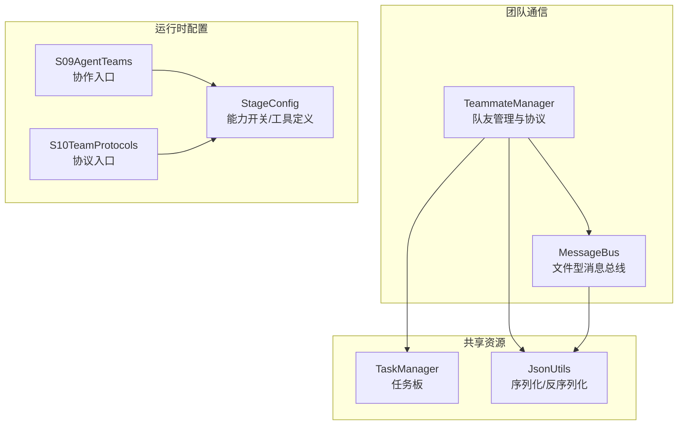
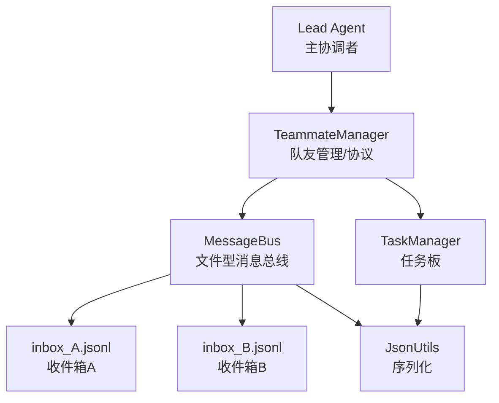
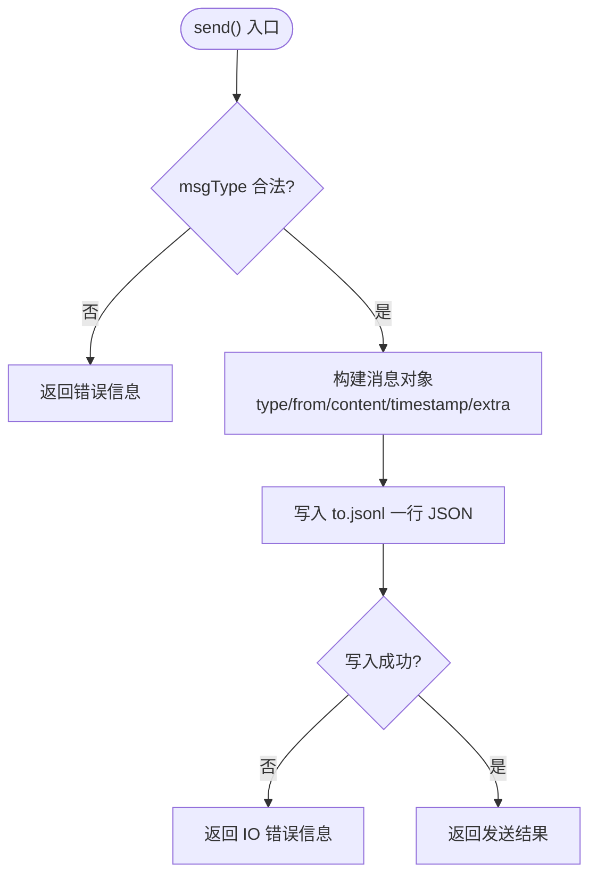
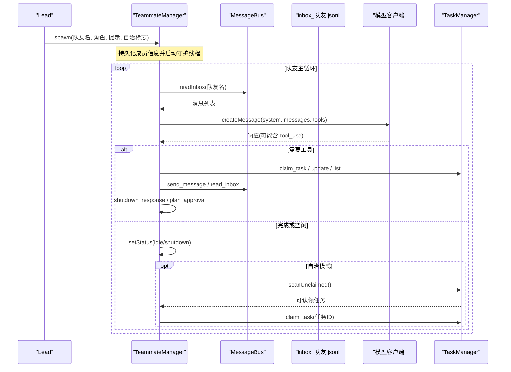
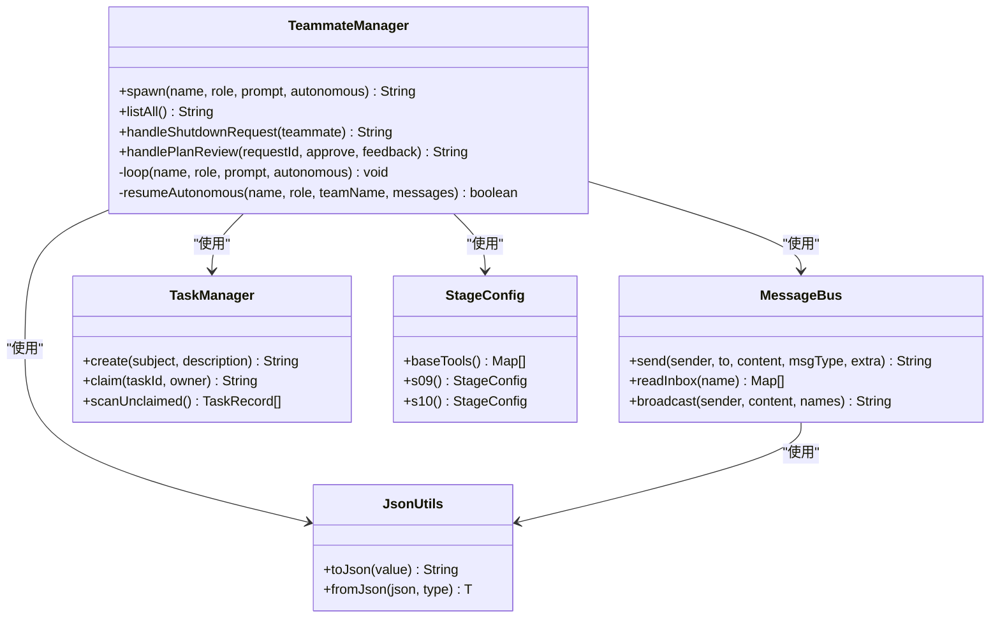

# 团队协作依赖

<cite>
**本文引用的文件**
- [MessageBus.java](file://src/main/java/com/learnclaudecode/team/MessageBus.java)
- [TeammateManager.java](file://src/main/java/com/learnclaudecode/team/TeammateManager.java)
- [TeamMessage.java](file://src/main/java/com/learnclaudecode/model/TeamMessage.java)
- [JsonUtils.java](file://src/main/java/com/learnclaudecode/common/JsonUtils.java)
- [TaskManager.java](file://src/main/java/com/learnclaudecode/tasks/TaskManager.java)
- [StageConfig.java](file://src/main/java/com/learnclaudecode/agents/StageConfig.java)
- [S09AgentTeams.java](file://src/main/java/com/learnclaudecode/agents/S09AgentTeams.java)
- [S10TeamProtocols.java](file://src/main/java/com/learnclaudecode/agents/S10TeamProtocols.java)
</cite>

## 目录
1. [简介](#简介)
2. [项目结构](#项目结构)
3. [核心组件](#核心组件)
4. [架构总览](#架构总览)
5. [详细组件分析](#详细组件分析)
6. [依赖关系分析](#依赖关系分析)
7. [性能与扩展性](#性能与扩展性)
8. [故障排查指南](#故障排查指南)
9. [结论](#结论)
10. [附录：使用示例](#附录使用示例)

## 简介
本文件聚焦于多代理协作中的消息通信与团队管理，系统性阐述 MessageBus 与 TeammateManager 的协作机制。内容涵盖：
- 事件驱动的消息传递：发布、订阅与路由（基于文件系统 inbox）
- 团队成员的注册、发现与通信协议（启动、状态、关闭、计划审批等）
- 多代理间同步与异步消息交换模式
- 消息序列化、版本兼容性与错误处理策略
- 具体使用示例，展示代理间的消息传递与协作流程

## 项目结构
围绕团队协作的关键代码位于 team、model、tasks、common、agents 等包中：
- team：消息总线与队友管理器
- model：团队消息数据模型
- tasks：任务板（用于自治认领与任务编排）
- common：JSON 序列化与工具
- agents：阶段配置与入口脚本（s09/s10 演示多代理协作与协议）

图表来源
- [MessageBus.java:16-123](file://src/main/java/com/learnclaudecode/team/MessageBus.java#L16-L123)
- [TeammateManager.java:24-438](file://src/main/java/com/learnclaudecode/team/TeammateManager.java#L24-L438)
- [TaskManager.java:17-338](file://src/main/java/com/learnclaudecode/tasks/TaskManager.java#L17-L338)
- [JsonUtils.java:9-83](file://src/main/java/com/learnclaudecode/common/JsonUtils.java#L9-L83)
- [StageConfig.java:11-301](file://src/main/java/com/learnclaudecode/agents/StageConfig.java#L11-L301)
- [S09AgentTeams.java:1-13](file://src/main/java/com/learnclaudecode/agents/S09AgentTeams.java#L1-L13)
- [S10TeamProtocols.java:1-13](file://src/main/java/com/learnclaudecode/agents/S10TeamProtocols.java#L1-L13)

章节来源
- [MessageBus.java:16-123](file://src/main/java/com/learnclaudecode/team/MessageBus.java#L16-L123)
- [TeammateManager.java:24-438](file://src/main/java/com/learnclaudecode/team/TeammateManager.java#L24-L438)
- [TaskManager.java:17-338](file://src/main/java/com/learnclaudecode/tasks/TaskManager.java#L17-L338)
- [JsonUtils.java:9-83](file://src/main/java/com/learnclaudecode/common/JsonUtils.java#L9-L83)
- [StageConfig.java:11-301](file://src/main/java/com/learnclaudecode/agents/StageConfig.java#L11-L301)
- [S09AgentTeams.java:1-13](file://src/main/java/com/learnclaudecode/agents/S09AgentTeams.java#L1-L13)
- [S10TeamProtocols.java:1-13](file://src/main/java/com/learnclaudecode/agents/S10TeamProtocols.java#L1-L13)

## 核心组件
- MessageBus：基于文件系统的“inbox”消息总线，实现按收件箱投递、读后即消费、广播等能力，提供最小依赖的多代理通信通道。
- TeammateManager：负责队友生命周期管理（创建、状态维护）、消息协议处理（shutdown_request、plan_approval_response）、以及自治模式下任务自动认领。
- TaskManager：共享任务板，支持任务创建、更新、认领、依赖清理与扫描可认领任务，为自治协作提供工作池。
- JsonUtils：统一 JSON 序列化/反序列化，保证消息格式一致性与时间类型处理。
- StageConfig：集中管理不同阶段的工具集与能力开关，驱动 s09/s10 等多代理协作场景。

章节来源
- [MessageBus.java:16-123](file://src/main/java/com/learnclaudecode/team/MessageBus.java#L16-L123)
- [TeammateManager.java:24-438](file://src/main/java/com/learnclaudecode/team/TeammateManager.java#L24-L438)
- [TaskManager.java:17-338](file://src/main/java/com/learnclaudecode/tasks/TaskManager.java#L17-L338)
- [JsonUtils.java:9-83](file://src/main/java/com/learnclaudecode/common/JsonUtils.java#L9-L83)
- [StageConfig.java:11-301](file://src/main/java/com/learnclaudecode/agents/StageConfig.java#L11-L301)

## 架构总览
下图展示了多代理协作的整体架构：Lead 作为协调者，通过 TeammateManager 创建并管理多个队友线程；所有代理通过 MessageBus 进行消息通信；任务由 TaskManager 统一管理，支持自治认领。

图表来源
- [TeammateManager.java:177-273](file://src/main/java/com/learnclaudecode/team/TeammateManager.java#L177-L273)
- [MessageBus.java:54-121](file://src/main/java/com/learnclaudecode/team/MessageBus.java#L54-L121)
- [TaskManager.java:51-197](file://src/main/java/com/learnclaudecode/tasks/TaskManager.java#L51-L197)
- [JsonUtils.java:23-83](file://src/main/java/com/learnclaudecode/common/JsonUtils.java#L23-L83)

## 详细组件分析

### MessageBus：事件驱动的消息总线
- 设计要点
  - 以文件系统为传输介质，每个代理拥有独立 inbox 文件（如 name.jsonl），每条消息为一行 JSON，便于多进程/多线程安全追加读取。
  - 支持三种核心操作：
    - send：向指定收件箱发送消息，包含 type、from、content、timestamp、extra 等字段，并对 msgType 做白名单校验。
    - readInbox：读取并清空指定收件箱，实现“读即消费”语义，避免重复处理。
    - broadcast：向多个目标发送广播消息（排除自身）。
  - 错误处理：对无效类型直接返回错误信息；IO 异常时返回错误消息或空列表，确保调用方稳定。
- 路由机制
  - 路由键为收件箱名称（to），MessageBus 将消息写入 to.jsonl，接收方通过 readInbox(name) 拉取。
- 序列化与兼容性
  - 使用 JsonUtils 统一序列化，时间戳采用秒级数值，便于跨语言/版本解析。
  - extra 字段为 Map<String, Object>，允许扩展新字段而不破坏旧客户端。

图表来源
- [MessageBus.java:54-75](file://src/main/java/com/learnclaudecode/team/MessageBus.java#L54-L75)

章节来源
- [MessageBus.java:16-123](file://src/main/java/com/learnclaudecode/team/MessageBus.java#L16-L123)
- [JsonUtils.java:23-83](file://src/main/java/com/learnclaudecode/common/JsonUtils.java#L23-L83)

### TeammateManager：团队成员注册、发现与通信协议
- 成员注册与发现
  - spawn：创建并启动一个队友线程，持久化成员信息到 team/config.json，设置初始角色与状态。
  - listAll/memberNames：列出当前队友及其状态，支持动态发现。
- 通信协议
  - shutdown_request：Lead 向队友发起关闭请求，记录 request_id 并等待 shutdown_response 回执。
  - plan_approval_response：队友提交计划供 Lead 审批，Lead 通过 handlePlanReview 回传批准/拒绝结果。
- 队友主循环
  - loop：持续从 inbox 读取消息，注入对话上下文，调用模型生成响应；根据 stop_reason 决定继续执行或进入 idle/shutdown。
  - 工具子集：基础文件/命令工具 + 通信工具（send_message、read_inbox）+ 协议工具（shutdown_response、plan_approval）或自治工具（claim_task、idle）。
- 自治模式
  - resumeAutonomous：在空闲时轮询 inbox 与新任务，优先响应消息，否则自动认领未阻塞任务，模拟自组织行为。

图表来源
- [TeammateManager.java:81-105](file://src/main/java/com/learnclaudecode/team/TeammateManager.java#L81-L105)
- [TeammateManager.java:177-273](file://src/main/java/com/learnclaudecode/team/TeammateManager.java#L177-L273)
- [TeammateManager.java:321-356](file://src/main/java/com/learnclaudecode/team/TeammateManager.java#L321-L356)
- [TaskManager.java:168-197](file://src/main/java/com/learnclaudecode/tasks/TaskManager.java#L168-L197)

章节来源
- [TeammateManager.java:81-105](file://src/main/java/com/learnclaudecode/team/TeammateManager.java#L81-L105)
- [TeammateManager.java:141-167](file://src/main/java/com/learnclaudecode/team/TeammateManager.java#L141-L167)
- [TeammateManager.java:177-273](file://src/main/java/com/learnclaudecode/team/TeammateManager.java#L177-L273)
- [TeammateManager.java:321-356](file://src/main/java/com/learnclaudecode/team/TeammateManager.java#L321-L356)
- [TaskManager.java:168-197](file://src/main/java/com/learnclaudecode/tasks/TaskManager.java#L168-L197)

### 多代理通信模式：同步与异步
- 异步消息
  - send/broadcast：非阻塞写入 inbox 文件，接收方通过 readInbox 主动拉取，天然解耦。
  - 读后即消费：readInbox 读取后立即清空收件箱，避免重复处理。
- 半同步协议
  - shutdown_request/shutdown_response：通过 request_id 关联请求与响应，Lead 记录 pending 状态，队友处理后回传结果。
  - plan_approval_response：类似地，通过 request_id 关联计划审批请求与结果。
- 自治协作
  - 空闲时自动扫描任务板并认领任务，无需 Lead 显式分配，体现自组织特性。

章节来源
- [MessageBus.java:54-121](file://src/main/java/com/learnclaudecode/team/MessageBus.java#L54-L121)
- [TeammateManager.java:141-167](file://src/main/java/com/learnclaudecode/team/TeammateManager.java#L141-L167)
- [TeammateManager.java:321-356](file://src/main/java/com/learnclaudecode/team/TeammateManager.java#L321-L356)

### 消息序列化、版本兼容性与错误重试
- 序列化
  - 统一使用 JsonUtils，确保时间戳与复杂对象的序列化一致性。
  - 消息结构包含 type、from、content、timestamp、extra，便于扩展。
- 版本兼容性
  - extra 字段为 Map，新增字段不影响旧客户端解析。
  - msgType 白名单限制，防止未知类型导致歧义。
- 错误处理
  - send：非法类型立即返回错误；IO 异常返回错误信息。
  - readInbox：IO 异常返回包含错误信息的系统消息，保障健壮性。
- 重试机制
  - 当前实现未内置重试逻辑；可通过上层调用方在失败时重试 send/readInbox，或在任务板层面标记失败并重试。

章节来源
- [MessageBus.java:54-101](file://src/main/java/com/learnclaudecode/team/MessageBus.java#L54-L101)
- [JsonUtils.java:23-83](file://src/main/java/com/learnclaudecode/common/JsonUtils.java#L23-L83)

## 依赖关系分析
- TeammateManager 依赖：
  - MessageBus：用于消息收发与广播
  - TaskManager：用于任务认领与扫描
  - JsonUtils：用于配置与消息序列化
  - StageConfig：用于工具定义与能力开关
- MessageBus 依赖：
  - JsonUtils：消息序列化
  - WorkspacePaths：inbox 目录路径
- TaskManager 依赖：
  - JsonUtils：任务记录序列化
  - WorkspacePaths：任务目录路径

图表来源
- [TeammateManager.java:24-438](file://src/main/java/com/learnclaudecode/team/TeammateManager.java#L24-L438)
- [MessageBus.java:16-123](file://src/main/java/com/learnclaudecode/team/MessageBus.java#L16-L123)
- [TaskManager.java:17-338](file://src/main/java/com/learnclaudecode/tasks/TaskManager.java#L17-L338)
- [JsonUtils.java:9-83](file://src/main/java/com/learnclaudecode/common/JsonUtils.java#L9-L83)
- [StageConfig.java:11-301](file://src/main/java/com/learnclaudecode/agents/StageConfig.java#L11-L301)

章节来源
- [TeammateManager.java:24-438](file://src/main/java/com/learnclaudecode/team/TeammateManager.java#L24-L438)
- [MessageBus.java:16-123](file://src/main/java/com/learnclaudecode/team/MessageBus.java#L16-L123)
- [TaskManager.java:17-338](file://src/main/java/com/learnclaudecode/tasks/TaskManager.java#L17-L338)
- [JsonUtils.java:9-83](file://src/main/java/com/learnclaudecode/common/JsonUtils.java#L9-L83)
- [StageConfig.java:11-301](file://src/main/java/com/learnclaudecode/agents/StageConfig.java#L11-L301)

## 性能与扩展性
- 性能特征
  - 文件 I/O：消息与任务均以文件形式持久化，适合轻量级部署；在高并发场景下需注意锁粒度与磁盘吞吐。
  - 读后即消费：减少重复处理开销，提高吞吐。
  - 守护线程：队友运行在独立线程，避免阻塞 Lead。
- 扩展建议
  - 增加重试与幂等：在 send/readInbox 外层封装重试与去重逻辑。
  - 引入队列或消息中间件：当规模扩大时，可用内存队列或轻量消息服务替代文件 inbox。
  - 增强协议：增加超时、心跳、健康检查等机制。

[本节为通用指导，不直接分析具体文件]

## 故障排查指南
- 常见问题
  - 消息未送达：检查 inbox 目录是否存在、权限是否正确；确认 send 的 to 参数与 readInbox 的名称一致。
  - 重复处理：确保 readInbox 后清空文件；若出现重复，检查是否多次读取同一文件而未清空。
  - 协议卡住：检查 shutdown_request/request_id 是否匹配；确认队友已发送 shutdown_response。
  - 任务无法认领：查看任务状态是否为 pending、是否被 blockedBy 阻塞；确认 scanUnclaimed 能返回任务。
- 定位方法
  - 查看 inbox 文件内容，确认消息格式与字段完整性。
  - 检查 team/config.json 中成员状态与更新时间。
  - 查看任务文件 task_*.json 的状态与依赖关系。

章节来源
- [MessageBus.java:54-101](file://src/main/java/com/learnclaudecode/team/MessageBus.java#L54-L101)
- [TeammateManager.java:141-167](file://src/main/java/com/learnclaudecode/team/TeammateManager.java#L141-L167)
- [TaskManager.java:168-197](file://src/main/java/com/learnclaudecode/tasks/TaskManager.java#L168-L197)

## 结论
MessageBus 与 TeammateManager 共同构成了轻量而稳健的多代理协作基础设施：前者提供低耦合的文件型消息通道，后者负责队友生命周期与协议协调，并结合 TaskManager 实现自治认领。该设计易于理解与扩展，适合教学与小型团队协作场景；在生产环境中可根据规模引入更强大的消息中间件与重试机制。

[本节为总结性内容，不直接分析具体文件]

## 附录：使用示例
以下示例展示如何使用 s09 与 s10 的能力进行多代理协作与协议交互。

- 启动多代理协作（s09）
  - 通过 S09AgentTeams.main 启动，启用 spawn_teammate、send_message、read_inbox、broadcast 等工具。
  - Lead 可创建队友并向其发送消息；队友通过 read_inbox 拉取并处理。

- 启动团队协议（s10）
  - 通过 S10TeamProtocols.main 启动，在 s09 基础上增加 shutdown_request 与 plan_approval 工具。
  - Lead 可向队友发起关闭请求，队友通过 shutdown_response 回传结果；队友也可提交计划供 Lead 审批。

章节来源
- [S09AgentTeams.java:1-13](file://src/main/java/com/learnclaudecode/agents/S09AgentTeams.java#L1-L13)
- [S10TeamProtocols.java:1-13](file://src/main/java/com/learnclaudecode/agents/S10TeamProtocols.java#L1-L13)
- [StageConfig.java:181-211](file://src/main/java/com/learnclaudecode/agents/StageConfig.java#L181-L211)