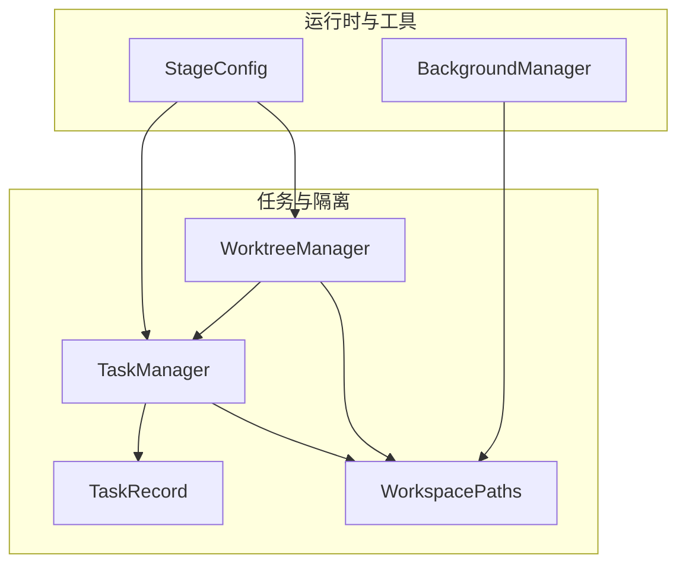
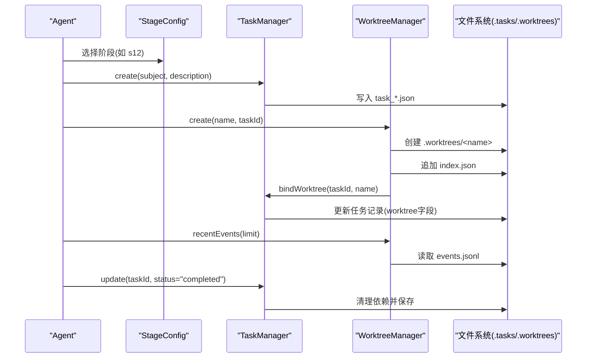
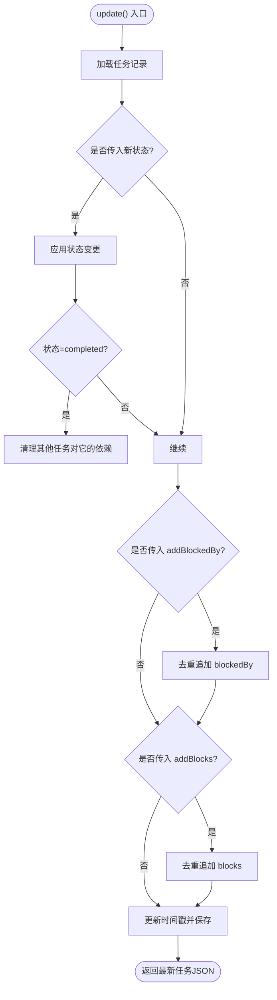
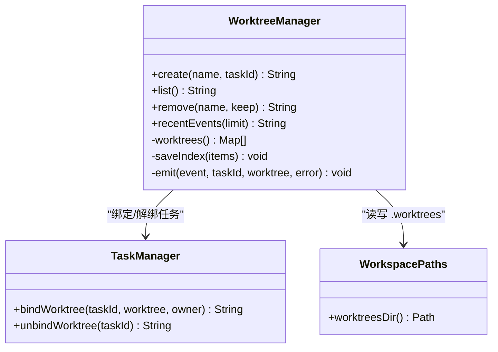
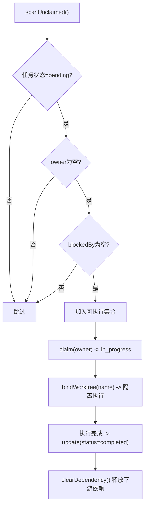

# 任务管理依赖

<cite>
**本文引用的文件**
- [TaskManager.java](file://src/main/java/com/learnclaudecode/tasks/TaskManager.java)
- [WorktreeManager.java](file://src/main/java/com/learnclaudecode/tasks/WorktreeManager.java)
- [TaskRecord.java](file://src/main/java/com/learnclaudecode/model/TaskRecord.java)
- [WorkspacePaths.java](file://src/main/java/com/learnclaudecode/common/WorkspacePaths.java)
- [BackgroundManager.java](file://src/main/java/com/learnclaudecode/background/BackgroundManager.java)
- [StageConfig.java](file://src/main/java/com/learnclaudecode/agents/StageConfig.java)
- [S12WorktreeTaskIsolation.java](file://src/main/java/com/learnclaudecode/agents/S12WorktreeTaskIsolation.java)
</cite>

## 目录
1. [简介](#简介)
2. [项目结构](#项目结构)
3. [核心组件](#核心组件)
4. [架构总览](#架构总览)
5. [详细组件分析](#详细组件分析)
6. [依赖关系与调度机制](#依赖关系与调度机制)
7. [持久化与恢复策略](#持久化与恢复策略)
8. [性能考量](#性能考量)
9. [故障排查指南](#故障排查指南)
10. [结论](#结论)
11. [附录：使用示例](#附录使用示例)

## 简介
本文件围绕任务管理系统中的 TaskManager 与 WorktreeManager 的协作机制展开，系统性说明任务生命周期（创建、调度、执行、完成）与工作树隔离（不同任务间环境独立）、任务依赖关系处理（先后顺序与资源竞争）、以及任务的持久化与恢复策略。文档同时提供端到端的使用示例，帮助读者理解从“创建任务”到“绑定工作树并执行”的完整流程。

## 项目结构
任务系统位于 tasks 包中，由 TaskManager 负责任务记录与状态流转，WorktreeManager 负责为任务分配隔离的工作目录（worktree），并通过索引与事件日志维护其生命周期。模型层通过 TaskRecord 描述任务元数据与依赖关系；路径工具 WorkspacePaths 统一管理工作区下的 .tasks 与 .worktrees 等目录；StageConfig 暴露任务与 worktree 的工具接口，供上层 Agent 调用；BackgroundManager 提供后台命令执行能力，常与任务执行结合。

图表来源
- [TaskManager.java:27-42](file://src/main/java/com/learnclaudecode/tasks/TaskManager.java#L27-L42)
- [WorktreeManager.java:24-58](file://src/main/java/com/learnclaudecode/tasks/WorktreeManager.java#L24-L58)
- [TaskRecord.java:9-61](file://src/main/java/com/learnclaudecode/model/TaskRecord.java#L9-L61)
- [WorkspacePaths.java:77-148](file://src/main/java/com/learnclaudecode/common/WorkspacePaths.java#L77-L148)
- [StageConfig.java:151-244](file://src/main/java/com/learnclaudecode/agents/StageConfig.java#L151-L244)
- [BackgroundManager.java:20-34](file://src/main/java/com/learnclaudecode/background/BackgroundManager.java#L20-L34)

章节来源
- [TaskManager.java:27-42](file://src/main/java/com/learnclaudecode/tasks/TaskManager.java#L27-L42)
- [WorktreeManager.java:24-58](file://src/main/java/com/learnclaudecode/tasks/WorktreeManager.java#L24-L58)
- [WorkspacePaths.java:77-148](file://src/main/java/com/learnclaudecode/common/WorkspacePaths.java#L77-L148)
- [StageConfig.java:151-244](file://src/main/java/com/learnclaudecode/agents/StageConfig.java#L151-L244)

## 核心组件
- TaskManager：基于文件的任务板，负责任务创建、查询、更新、认领、扫描可执行任务、绑定/解绑 worktree、依赖清理与持久化。
- WorktreeManager：维护 .worktrees 下的索引与事件日志，负责创建/移除工作树目录，并将工作树与任务绑定或解绑。
- TaskRecord：任务持久化模型，包含 ID、主题、描述、状态、拥有者、关联 worktree、依赖列表（blockedBy/blocks）、时间戳。
- WorkspacePaths：安全路径工具，提供 .tasks 与 .worktrees 等目录的统一访问。
- BackgroundManager：后台任务执行器，用于异步运行命令并收集结果，常用于任务执行阶段。
- StageConfig：编排各教学阶段的工具集，其中 s07 暴露任务工具，s12 暴露 worktree 工具。

章节来源
- [TaskManager.java:44-235](file://src/main/java/com/learnclaudecode/tasks/TaskManager.java#L44-L235)
- [WorktreeManager.java:60-166](file://src/main/java/com/learnclaudecode/tasks/WorktreeManager.java#L60-L166)
- [TaskRecord.java:9-61](file://src/main/java/com/learnclaudecode/model/TaskRecord.java#L9-L61)
- [WorkspacePaths.java:77-148](file://src/main/java/com/learnclaudecode/common/WorkspacePaths.java#L77-L148)
- [BackgroundManager.java:36-159](file://src/main/java/com/learnclaudecode/background/BackgroundManager.java#L36-L159)
- [StageConfig.java:151-244](file://src/main/java/com/learnclaudecode/agents/StageConfig.java#L151-L244)

## 架构总览
下图展示了任务与工作树在系统中的交互关系：Agent 通过 StageConfig 暴露的工具调用 TaskManager 和 WorktreeManager；TaskManager 将任务状态与依赖持久化为 JSON 文件；WorktreeManager 在 .worktrees 下创建隔离目录，并在 index.json 与 events.jsonl 中维护索引与事件；当任务完成后，TaskManager 自动清理其他任务的阻塞依赖。

图表来源
- [TaskManager.java:44-133](file://src/main/java/com/learnclaudecode/tasks/TaskManager.java#L44-L133)
- [WorktreeManager.java:60-99](file://src/main/java/com/learnclaudecode/tasks/WorktreeManager.java#L60-L99)
- [WorktreeManager.java:168-184](file://src/main/java/com/learnclaudecode/tasks/WorktreeManager.java#L168-L184)
- [WorkspacePaths.java:77-148](file://src/main/java/com/learnclaudecode/common/WorkspacePaths.java#L77-L148)

## 详细组件分析

### TaskManager：任务生命周期与依赖管理
- 任务创建：生成唯一 ID、初始状态 pending、写入 .tasks/task_*.json。
- 任务查询与看板：支持按 ID 获取详情、列出所有任务并以易读格式展示状态、拥有者与依赖。
- 任务更新与依赖：
  - 支持设置新状态；当状态为 completed 时，自动清理其他任务对该任务的 blockedBy 依赖。
  - 支持追加 addBlockedBy 与 addBlocks，实现“前置依赖”和“被依赖”的双向关系，且去重追加。
  - 删除任务时直接删除对应 JSON 文件。
- 任务认领与扫描：
  - claim：将任务标记为 in_progress 并记录 owner。
  - scanUnclaimed：返回满足 pending、无 owner、无 blockedBy 的任务，供调度器或队友认领。
- 工作树绑定：
  - bindWorktree：将任务与 worktree 名称绑定，若原状态为 pending 则推进为 in_progress。
  - unbindWorktree：解除绑定。
- 持久化：所有变更均落盘到 .tasks 目录，保证进程重启后可恢复。

图表来源
- [TaskManager.java:84-133](file://src/main/java/com/learnclaudecode/tasks/TaskManager.java#L84-L133)
- [TaskManager.java:324-336](file://src/main/java/com/learnclaudecode/tasks/TaskManager.java#L324-L336)

章节来源
- [TaskManager.java:44-235](file://src/main/java/com/learnclaudecode/tasks/TaskManager.java#L44-L235)
- [TaskManager.java:251-336](file://src/main/java/com/learnclaudecode/tasks/TaskManager.java#L251-L336)

### WorktreeManager：工作树隔离与生命周期
- 初始化：确保 .worktrees 目录存在，准备 index.json 与 events.jsonl。
- 创建工作树：
  - 创建 .worktrees/<name> 目录作为隔离工作空间。
  - 写入索引项（名称、路径、分支、task_id、状态）。
  - 同步更新任务记录，绑定 worktree 并推进状态。
  - 追加一条创建事件到 events.jsonl。
- 列出工作树：读取 index.json 返回当前工作树清单。
- 移除工作树：
  - 可选择保留或删除底层目录。
  - 从索引中移除记录。
  - 若绑定了任务，则解绑任务。
  - 追加移除事件。
- 事件查询：recentEvents 读取 events.jsonl 最近若干行，便于审计与排障。

图表来源
- [WorktreeManager.java:60-166](file://src/main/java/com/learnclaudecode/tasks/WorktreeManager.java#L60-L166)
- [WorktreeManager.java:186-243](file://src/main/java/com/learnclaudecode/tasks/WorktreeManager.java#L186-L243)
- [WorkspacePaths.java:138-148](file://src/main/java/com/learnclaudecode/common/WorkspacePaths.java#L138-L148)

章节来源
- [WorktreeManager.java:60-166](file://src/main/java/com/learnclaudecode/tasks/WorktreeManager.java#L60-L166)
- [WorktreeManager.java:168-243](file://src/main/java/com/learnclaudecode/tasks/WorktreeManager.java#L168-L243)

### 模型与路径：TaskRecord 与 WorkspacePaths
- TaskRecord 字段包括 id、subject、description、status、owner、worktree、blockedBy、blocks、created_at、updated_at，构成任务的核心元数据与依赖关系。
- WorkspacePaths 提供 safeResolve、readText、writeText 等方法，并定义 .tasks 与 .worktrees 等目录路径，确保路径安全与一致性。

章节来源
- [TaskRecord.java:9-61](file://src/main/java/com/learnclaudecode/model/TaskRecord.java#L9-L61)
- [WorkspacePaths.java:7-148](file://src/main/java/com/learnclaudecode/common/WorkspacePaths.java#L7-L148)

### 后台执行：BackgroundManager
- 以异步方式启动命令，使用单线程执行器提交任务，避免阻塞主循环。
- 执行过程中捕获超时与异常，统一记录状态与结果，并通过通知队列回传摘要。
- 提供 check 与 drain 接口，便于上层轮询任务状态与消费通知。

章节来源
- [BackgroundManager.java:36-159](file://src/main/java/com/learnclaudecode/background/BackgroundManager.java#L36-L159)

## 依赖关系与调度机制
- 依赖建模：
  - blockedBy：当前任务的前置任务 ID 列表，只有这些任务完成后，当前任务才可推进。
  - blocks：当前任务完成后会解除哪些后续任务的阻塞。
- 依赖清理：
  - 当某任务状态变为 completed，TaskManager 会遍历所有任务，移除它们对已完成任务的 blockedBy 引用，从而释放下游任务的可执行性。
- 调度策略：
  - scanUnclaimed 返回满足 pending、无 owner、无 blockedBy 的任务，供调度器或队友认领并开始执行。
  - 认领后任务状态推进为 in_progress，并可进一步绑定 worktree 进入实际执行阶段。
- 资源竞争：
  - 通过 worktree 隔离，每个任务在独立的目录下执行，避免文件与上下文冲突。
  - 后台命令执行使用独立子进程与超时控制，防止长任务占用资源。

图表来源
- [TaskManager.java:177-197](file://src/main/java/com/learnclaudecode/tasks/TaskManager.java#L177-L197)
- [TaskManager.java:161-175](file://src/main/java/com/learnclaudecode/tasks/TaskManager.java#L161-L175)
- [TaskManager.java:215-235](file://src/main/java/com/learnclaudecode/tasks/TaskManager.java#L215-L235)
- [TaskManager.java:324-336](file://src/main/java/com/learnclaudecode/tasks/TaskManager.java#L324-L336)

章节来源
- [TaskManager.java:161-235](file://src/main/java/com/learnclaudecode/tasks/TaskManager.java#L161-L235)
- [TaskManager.java:324-336](file://src/main/java/com/learnclaudecode/tasks/TaskManager.java#L324-L336)

## 持久化与恢复策略
- 任务持久化：
  - 每个任务以 JSON 文件形式保存在 .tasks 目录，文件名形如 task_*.json。
  - 所有写操作均落盘，确保进程重启后可通过 loadAll 恢复任务板。
- 工作树持久化：
  - index.json 保存当前所有工作树的元数据，便于快速列出与查找。
  - events.jsonl 以追加模式记录工作树的生命周期事件（创建、移除等），便于审计与回溯。
- 恢复机制：
  - 启动时 TaskManager 会确保 .tasks 目录存在；WorktreeManager 会确保 .worktrees 目录及基础文件存在。
  - 若 index.json 缺失 worktrees 字段，会自动补空列表，增强鲁棒性。
  - 事件文件读取失败时返回空数组，避免中断流程。

章节来源
- [TaskManager.java:251-322](file://src/main/java/com/learnclaudecode/tasks/TaskManager.java#L251-L322)
- [WorktreeManager.java:39-58](file://src/main/java/com/learnclaudecode/tasks/WorktreeManager.java#L39-L58)
- [WorktreeManager.java:186-216](file://src/main/java/com/learnclaudecode/tasks/WorktreeManager.java#L186-L216)
- [WorktreeManager.java:218-243](file://src/main/java/com/learnclaudecode/tasks/WorktreeManager.java#L218-L243)

## 性能考量
- 并发与锁：
  - TaskManager 与 WorktreeManager 的关键方法使用 synchronized 保护，避免并发修改导致的状态覆盖。
- I/O 成本：
  - 任务列表与单个任务读取均为文件级操作，适合中小规模任务板；大规模场景建议引入索引或数据库。
- 后台任务：
  - 使用单线程执行器与超时控制，避免长任务阻塞主循环；结果通过队列回传，降低内存压力。
- 事件日志：
  - events.jsonl 采用追加模式，读取时限制返回条数，避免一次性加载过大文件。

章节来源
- [TaskManager.java:51-133](file://src/main/java/com/learnclaudecode/tasks/TaskManager.java#L51-L133)
- [WorktreeManager.java:71-99](file://src/main/java/com/learnclaudecode/tasks/WorktreeManager.java#L71-L99)
- [BackgroundManager.java:43-123](file://src/main/java/com/learnclaudecode/background/BackgroundManager.java#L43-L123)

## 故障排查指南
- 任务不存在：
  - 读取任务时若文件不存在，抛出参数非法异常；检查任务 ID 是否正确。
- 删除失败：
  - 删除任务时若 IO 异常，抛出非法状态异常；检查权限与磁盘空间。
- 工作树未知：
  - 移除未知工作树会返回错误信息；确认名称与索引一致。
- 事件读取失败：
  - 读取事件文件失败时返回空数组；检查 events.jsonl 是否存在与可读。
- 后台任务超时：
  - 后台命令超时会被强制终止并记录 timeout 状态；调整超时时间或优化命令。

章节来源
- [TaskManager.java:276-322](file://src/main/java/com/learnclaudecode/tasks/TaskManager.java#L276-L322)
- [WorktreeManager.java:122-166](file://src/main/java/com/learnclaudecode/tasks/WorktreeManager.java#L122-L166)
- [WorktreeManager.java:168-184](file://src/main/java/com/learnclaudecode/tasks/WorktreeManager.java#L168-L184)
- [BackgroundManager.java:68-123](file://src/main/java/com/learnclaudecode/background/BackgroundManager.java#L68-L123)

## 结论
TaskManager 与 WorktreeManager 共同构成了一个轻量但完整的任务管理与隔离执行框架。TaskManager 通过文件持久化与依赖清理实现了任务生命周期的可靠管理；WorktreeManager 通过目录隔离与事件日志确保了多任务间的独立性可观测性。配合 StageConfig 暴露的工具接口与 BackgroundManager 的异步执行能力，系统能够支撑多步骤、多代理协作的复杂工作流。

## 附录：使用示例
以下示例展示如何创建任务、绑定工作树、执行任务并跟踪状态与事件。

- 创建任务
  - 调用任务创建工具，输入主题与描述，得到任务 JSON。
  - 参考：[StageConfig.java:151-165](file://src/main/java/com/learnclaudecode/agents/StageConfig.java#L151-L165)
- 绑定工作树
  - 调用 worktree_create，传入名称与任务 ID，系统创建隔离目录并绑定任务。
  - 参考：[StageConfig.java:234-244](file://src/main/java/com/learnclaudecode/agents/StageConfig.java#L234-L244)
  - 参考：[WorktreeManager.java:71-99](file://src/main/java/com/learnclaudecode/tasks/WorktreeManager.java#L71-L99)
- 执行任务
  - 使用后台命令执行工具运行具体命令，或在 worktree 目录下进行文件操作。
  - 参考：[BackgroundManager.java:43-123](file://src/main/java/com/learnclaudecode/background/BackgroundManager.java#L43-L123)
- 跟踪状态与事件
  - 查询任务状态与列表，查看工作树事件以了解生命周期。
  - 参考：[TaskManager.java:135-159](file://src/main/java/com/learnclaudecode/tasks/TaskManager.java#L135-L159)
  - 参考：[WorktreeManager.java:168-184](file://src/main/java/com/learnclaudecode/tasks/WorktreeManager.java#L168-L184)
- 完成任务
  - 更新任务状态为 completed，系统将自动清理下游依赖。
  - 参考：[TaskManager.java:84-133](file://src/main/java/com/learnclaudecode/tasks/TaskManager.java#L84-L133)

章节来源
- [StageConfig.java:151-244](file://src/main/java/com/learnclaudecode/agents/StageConfig.java#L151-L244)
- [WorktreeManager.java:71-99](file://src/main/java/com/learnclaudecode/tasks/WorktreeManager.java#L71-L99)
- [BackgroundManager.java:43-123](file://src/main/java/com/learnclaudecode/background/BackgroundManager.java#L43-L123)
- [TaskManager.java:84-159](file://src/main/java/com/learnclaudecode/tasks/TaskManager.java#L84-L159)