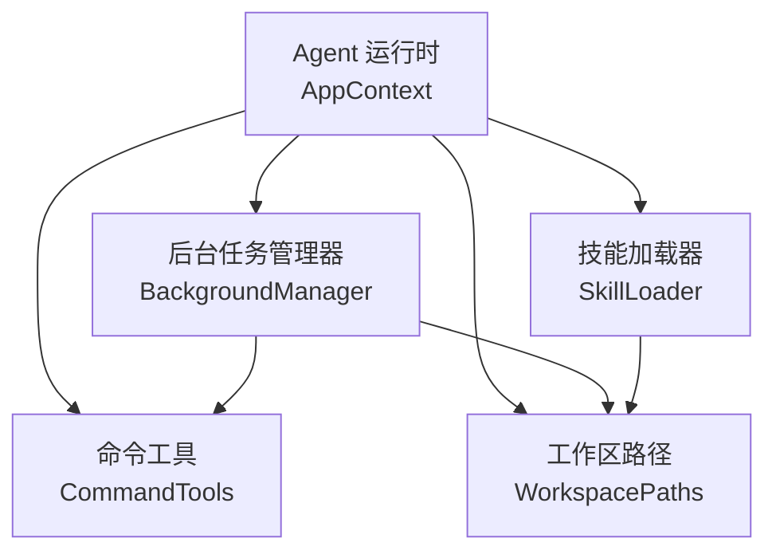
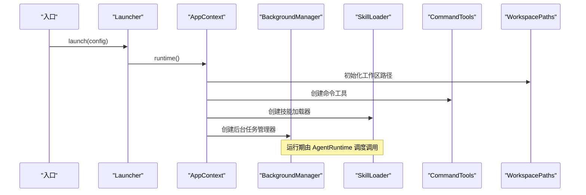
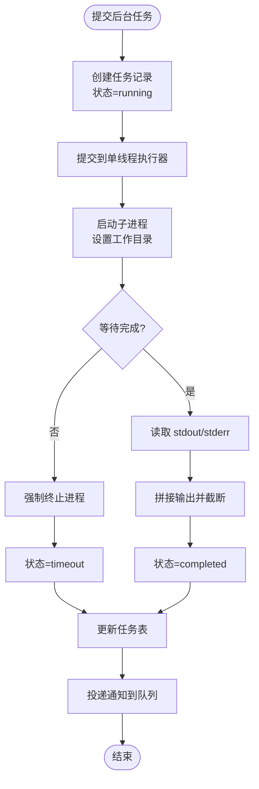
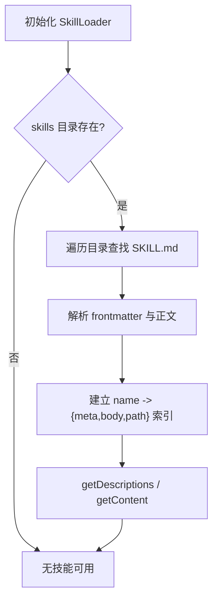
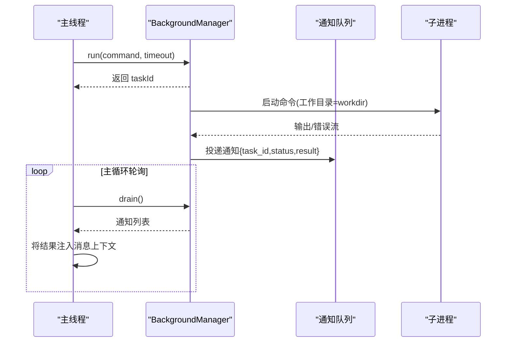
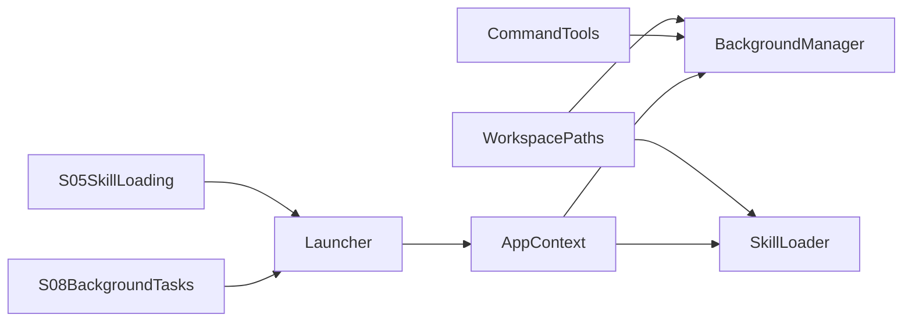

# 后台任务与技能依赖

<cite>
**本文引用的文件**
- [BackgroundManager.java](file://src/main/java/com/learnclaudecode/background/BackgroundManager.java)
- [SkillLoader.java](file://src/main/java/com/learnclaudecode/skills/SkillLoader.java)
- [WorkspacePaths.java](file://src/main/java/com/learnclaudecode/common/WorkspacePaths.java)
- [CommandTools.java](file://src/main/java/com/learnclaudecode/tools/CommandTools.java)
- [AppContext.java](file://src/main/java/com/learnclaudecode/agents/AppContext.java)
- [Launcher.java](file://src/main/java/com/learnclaudecode/agents/Launcher.java)
- [S08BackgroundTasks.java](file://src/main/java/com/learnclaudecode/agents/S08BackgroundTasks.java)
- [S05SkillLoading.java](file://src/main/java/com/learnclaudecode/agents/S05SkillLoading.java)
- [SKILL.md（agent-builder）](file://skills/agent-builder/SKILL.md)
- [SKILL.md（code-review）](file://skills/code-review/SKILL.md)
</cite>

## 目录
1. [简介](#简介)
2. [项目结构](#项目结构)
3. [核心组件](#核心组件)
4. [架构总览](#架构总览)
5. [详细组件分析](#详细组件分析)
6. [依赖关系分析](#依赖关系分析)
7. [性能考虑](#性能考虑)
8. [故障排查指南](#故障排查指南)
9. [结论](#结论)
10. [附录：示例流程与最佳实践](#附录示例流程与最佳实践)

## 简介
本文件聚焦于“后台任务与技能依赖”的实现机制，围绕 BackgroundManager 与 SkillLoader 两个核心类展开，系统性说明：
- 后台任务的提交、执行、监控与结果回调机制；
- 技能的动态发现、解析与加载流程；
- 后台任务与主线程的通信方式及线程安全策略；
- 技能版本管理与兼容性检查的现状与建议；
- 结合仓库中的示例入口，给出后台任务创建与技能动态加载的使用路径。

## 项目结构
本项目采用分层与按能力组织的方式：
- agents：应用装配与阶段入口（如 S05、S08），通过 Launcher 统一启动；
- background：后台任务管理；
- skills：技能加载器；
- common：工作区路径与环境配置等基础能力；
- tools：命令执行与文件操作工具；
- tasks/team/context：任务、团队、上下文压缩等扩展能力。

图表来源
- [AppContext.java:35-58](file://src/main/java/com/learnclaudecode/agents/AppContext.java#L35-L58)
- [BackgroundManager.java:20-34](file://src/main/java/com/learnclaudecode/background/BackgroundManager.java#L20-L34)
- [SkillLoader.java:18-38](file://src/main/java/com/learnclaudecode/skills/SkillLoader.java#L18-L38)
- [CommandTools.java:16-28](file://src/main/java/com/learnclaudecode/tools/CommandTools.java#L16-L28)
- [WorkspacePaths.java:11-23](file://src/main/java/com/learnclaudecode/common/WorkspacePaths.java#L11-L23)

章节来源
- [AppContext.java:35-58](file://src/main/java/com/learnclaudecode/agents/AppContext.java#L35-L58)
- [Launcher.java:23-26](file://src/main/java/com/learnclaudecode/agents/Launcher.java#L23-L26)

## 核心组件
- BackgroundManager：负责后台任务的异步执行、状态跟踪与通知分发。使用并发容器保存任务状态，使用阻塞队列向主循环投递结果摘要。
- SkillLoader：扫描工作区 skills 目录下的 SKILL.md 文件，解析 frontmatter 元数据与正文内容，提供技能描述与内容查询接口。
- WorkspacePaths：统一工作区路径解析与安全校验，确保所有文件访问不越界。
- CommandTools：封装 shell 命令执行、文件读写与编辑，提供跨平台 shell 命令构造与危险命令拦截。

章节来源
- [BackgroundManager.java:20-159](file://src/main/java/com/learnclaudecode/background/BackgroundManager.java#L20-L159)
- [SkillLoader.java:18-106](file://src/main/java/com/learnclaudecode/skills/SkillLoader.java#L18-L106)
- [WorkspacePaths.java:11-150](file://src/main/java/com/learnclaudecode/common/WorkspacePaths.java#L11-L150)
- [CommandTools.java:16-146](file://src/main/java/com/learnclaudecode/tools/CommandTools.java#L16-L146)

## 架构总览
后台任务与技能加载在应用启动时完成装配，并在运行期按需调用：
- AppContext 集中创建共享服务，包括 BackgroundManager 与 SkillLoader；
- 各阶段入口（如 S05、S08）通过 Launcher 启动 Agent 运行时；
- 后台任务以独立线程执行外部命令，完成后将结果写入任务表并投递通知；
- 技能加载器在初始化时扫描 skills 目录，构建技能索引供上层使用。

图表来源
- [Launcher.java:23-26](file://src/main/java/com/learnclaudecode/agents/Launcher.java#L23-L26)
- [AppContext.java:35-58](file://src/main/java/com/learnclaudecode/agents/AppContext.java#L35-L58)

## 详细组件分析

### BackgroundManager：后台任务执行与通知
- 任务生命周期
  - 提交：run(command, timeoutSeconds) 生成唯一 taskId，记录初始状态为 running，并通过单线程执行器提交 execute(taskId, command, timeoutSeconds)。
  - 执行：execute 使用 ProcessBuilder 启动子进程，设置工作目录为工作区根，等待超时后读取 stdout/stderr，更新任务状态为 completed/timeout/error，并将结果截断后写回任务表。
  - 通知：每次执行结束后，向 notifications 队列投递一条包含 task_id、status 和短摘要的通知。
  - 查询：check(taskId) 支持单个或全部任务的状态查询；drain() 批量取出通知列表供主循环消费。
- 线程安全与一致性
  - 任务表使用 ConcurrentHashMap 保证并发安全；
  - 通知使用 LinkedBlockingQueue 作为生产者-消费者通道，避免主线程阻塞；
  - 结果字符串进行长度限制，防止过大负载影响主循环。
- 错误处理
  - 捕获异常统一记为 error，并记录异常信息；
  - 超时强制终止进程，避免资源泄露；
  - 空输出用占位文本提示，避免误判。

图表来源
- [BackgroundManager.java:43-123](file://src/main/java/com/learnclaudecode/background/BackgroundManager.java#L43-L123)

章节来源
- [BackgroundManager.java:43-159](file://src/main/java/com/learnclaudecode/background/BackgroundManager.java#L43-L159)

### SkillLoader：动态技能发现与加载
- 扫描与解析
  - 构造函数中获取 skillsDir，若存在则遍历所有 SKILL.md 文件；
  - loadSkillFile 读取文件内容，解析 frontmatter（name/description 等键值对），提取正文与元数据；
  - 将每个技能以 name 为键存入内存映射，便于后续查询。
- 查询接口
  - getDescriptions：返回所有已加载技能的简要说明；
  - getContent：返回指定技能的完整内容，并以 XML 标签包裹，便于上层注入到模型上下文。
- 健壮性
  - 文件读取异常被忽略，避免单个技能损坏影响整体加载；
  - 未找到技能时返回可用技能列表，便于调试。

图表来源
- [SkillLoader.java:26-72](file://src/main/java/com/learnclaudecode/skills/SkillLoader.java#L26-L72)
- [SkillLoader.java:79-104](file://src/main/java/com/learnclaudecode/skills/SkillLoader.java#L79-L104)

章节来源
- [SkillLoader.java:26-104](file://src/main/java/com/learnclaudecode/skills/SkillLoader.java#L26-L104)

### 主线程与后台任务的通信机制
- 主线程职责
  - 通过 AppContext 装配 BackgroundManager 与 SkillLoader；
  - 在 Agent 主循环中周期性调用 BackgroundManager.drain() 获取通知，将结果注入消息流；
  - 根据模型决策调用 BackgroundManager.run/check 发起或查询任务。
- 后台线程职责
  - 执行外部命令，维护任务状态，投递通知；
  - 不直接修改主线程上下文，仅通过队列解耦。
- 线程安全与一致性保障
  - 使用并发容器与阻塞队列隔离状态与通知；
  - 结果截断与占位文本减少主线程压力；
  - 工作区路径统一通过 WorkspacePaths.safeResolve 校验，避免越权访问。

图表来源
- [BackgroundManager.java:43-123](file://src/main/java/com/learnclaudecode/background/BackgroundManager.java#L43-L123)
- [BackgroundManager.java:154-158](file://src/main/java/com/learnclaudecode/background/BackgroundManager.java#L154-L158)

章节来源
- [BackgroundManager.java:43-159](file://src/main/java/com/learnclaudecode/background/BackgroundManager.java#L43-L159)
- [AppContext.java:35-58](file://src/main/java/com/learnclaudecode/agents/AppContext.java#L35-L58)

### 技能版本管理与兼容性检查
- 现状
  - 当前实现基于 SKILL.md 的简单 frontmatter，支持 name/description 等字段；
  - 未显式定义 version 字段与兼容性检查逻辑；
  - 加载过程忽略 IO 异常，具备一定容错性。
- 建议
  - 在 frontmatter 中引入 version 字段（如语义化版本），并在加载时进行最小版本要求检查；
  - 增加兼容性矩阵或迁移脚本，当检测到旧版技能时给出警告或降级提示；
  - 对关键字段（如 name、description）做必填校验，提升可维护性。

章节来源
- [SkillLoader.java:45-72](file://src/main/java/com/learnclaudecode/skills/SkillLoader.java#L45-L72)
- [SKILL.md（agent-builder）:1-11](file://skills/agent-builder/SKILL.md#L1-L11)
- [SKILL.md（code-review）:1-4](file://skills/code-review/SKILL.md#L1-L4)

## 依赖关系分析
- BackgroundManager 依赖 WorkspacePaths 与 CommandTools，用于定位工作区与执行命令；
- SkillLoader 依赖 WorkspacePaths，用于定位 skills 目录；
- AppContext 集中装配这些组件，形成清晰的依赖层次；
- 入口类 S05、S08 通过 Launcher 启动，体现阶段化学习路径。

图表来源
- [AppContext.java:35-58](file://src/main/java/com/learnclaudecode/agents/AppContext.java#L35-L58)
- [BackgroundManager.java:20-34](file://src/main/java/com/learnclaudecode/background/BackgroundManager.java#L20-L34)
- [SkillLoader.java:18-38](file://src/main/java/com/learnclaudecode/skills/SkillLoader.java#L18-L38)
- [Launcher.java:23-26](file://src/main/java/com/learnclaudecode/agents/Launcher.java#L23-L26)
- [S05SkillLoading.java:9-11](file://src/main/java/com/learnclaudecode/agents/S05SkillLoading.java#L9-L11)
- [S08BackgroundTasks.java:9-11](file://src/main/java/com/learnclaudecode/agents/S08BackgroundTasks.java#L9-L11)

章节来源
- [AppContext.java:35-58](file://src/main/java/com/learnclaudecode/agents/AppContext.java#L35-L58)
- [BackgroundManager.java:20-34](file://src/main/java/com/learnclaudecode/background/BackgroundManager.java#L20-L34)
- [SkillLoader.java:18-38](file://src/main/java/com/learnclaudecode/skills/SkillLoader.java#L18-L38)
- [Launcher.java:23-26](file://src/main/java/com/learnclaudecode/agents/Launcher.java#L23-L26)
- [S05SkillLoading.java:9-11](file://src/main/java/com/learnclaudecode/agents/S05SkillLoading.java#L9-L11)
- [S08BackgroundTasks.java:9-11](file://src/main/java/com/learnclaudecode/agents/S08BackgroundTasks.java#L9-L11)

## 性能考虑
- 后台任务
  - 每个任务使用独立线程执行，避免阻塞主交互；
  - 超时控制与强制终止防止僵尸进程；
  - 结果截断与通知摘要降低主线程负载。
- 技能加载
  - 启动时一次性扫描，后续查询为 O(1) 哈希查找；
  - 大文件输出需在上层控制注入大小，避免上下文膨胀。
- 路径安全
  - 所有文件访问经 safeResolve 校验，防止路径穿越攻击。

[本节为通用性能讨论，不直接分析具体代码行]

## 故障排查指南
- 后台任务无输出
  - 检查 check(taskId) 返回状态是否为 completed；
  - 确认命令是否在工作区目录下可执行；
  - 查看通知队列是否有对应 task_id 的通知。
- 后台任务超时
  - 调整 run 的 timeoutSeconds 参数；
  - 检查命令是否存在死锁或长时间 I/O。
- 技能未加载
  - 确认 skills 目录存在且包含 SKILL.md；
  - 检查 frontmatter 格式是否正确（name/description）；
  - 使用 getDescriptions 验证已加载技能列表。
- 路径越界
  - 确保相对路径合法，避免 ../ 逃逸；
  - 使用 WorkspacePaths.safeResolve 进行安全解析。

章节来源
- [BackgroundManager.java:68-123](file://src/main/java/com/learnclaudecode/background/BackgroundManager.java#L68-L123)
- [BackgroundManager.java:131-158](file://src/main/java/com/learnclaudecode/background/BackgroundManager.java#L131-L158)
- [SkillLoader.java:26-72](file://src/main/java/com/learnclaudecode/skills/SkillLoader.java#L26-L72)
- [WorkspacePaths.java:42-49](file://src/main/java/com/learnclaudecode/common/WorkspacePaths.java#L42-L49)

## 结论
- BackgroundManager 提供了可靠的后台任务执行框架，具备任务状态管理、超时控制、结果通知与线程安全保障；
- SkillLoader 实现了轻量级的技能动态发现与加载，适合教学与扩展场景；
- 通过 AppContext 的统一装配，后台任务与技能加载能够无缝集成到 Agent 运行时；
- 建议在技能层面引入版本管理与兼容性检查，进一步提升可维护性与安全性。

[本节为总结性内容，不直接分析具体代码行]

## 附录：示例流程与最佳实践

### 后台任务创建与监控示例
- 入口：S08BackgroundTasks.main 通过 Launcher.launch 启动 StageConfig.s08；
- 运行期：Agent 运行时调用 BackgroundManager.run 提交任务，使用 check 查询状态，使用 drain 获取通知；
- 建议：合理设置超时时间，及时清理已完成任务，避免任务表无限增长。

章节来源
- [S08BackgroundTasks.java:9-11](file://src/main/java/com/learnclaudecode/agents/S08BackgroundTasks.java#L9-L11)
- [BackgroundManager.java:43-159](file://src/main/java/com/learnclaudecode/background/BackgroundManager.java#L43-L159)

### 技能动态加载示例
- 入口：S05SkillLoading.main 通过 Launcher.launch 启动 StageConfig.s05；
- 运行期：AppContext 初始化时创建 SkillLoader，扫描 skills 目录；
- 使用：通过 getDescriptions 列出可用技能，getContent 获取指定技能内容并注入上下文；
- 建议：为每个技能编写清晰的 frontmatter，保持 description 简洁明确。

章节来源
- [S05SkillLoading.java:9-11](file://src/main/java/com/learnclaudecode/agents/S05SkillLoading.java#L9-L11)
- [AppContext.java:35-58](file://src/main/java/com/learnclaudecode/agents/AppContext.java#L35-L58)
- [SkillLoader.java:26-104](file://src/main/java/com/learnclaudecode/skills/SkillLoader.java#L26-L104)